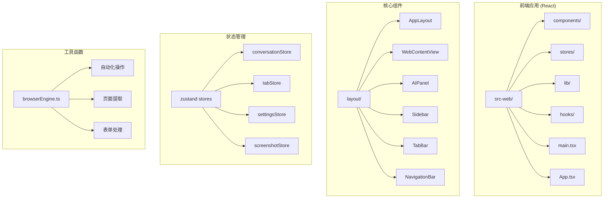
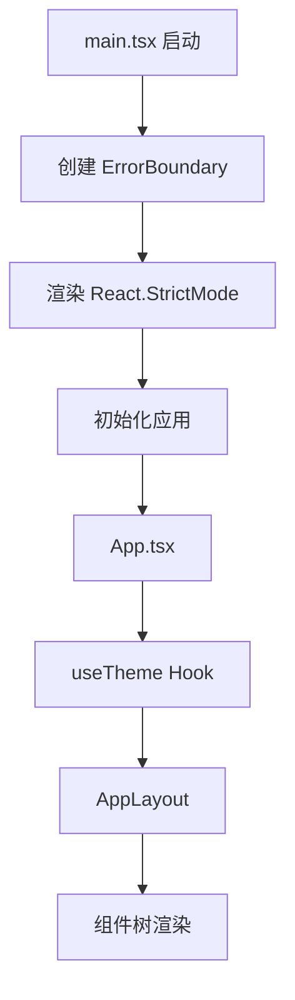
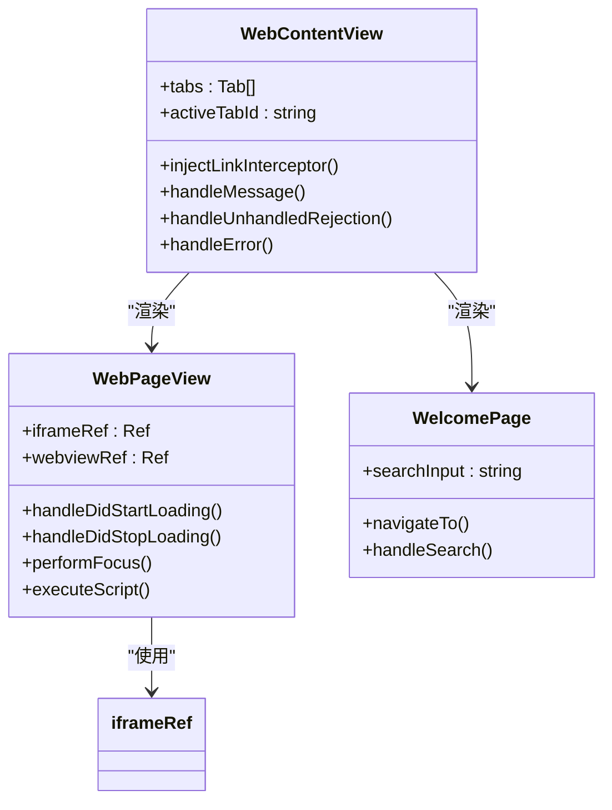
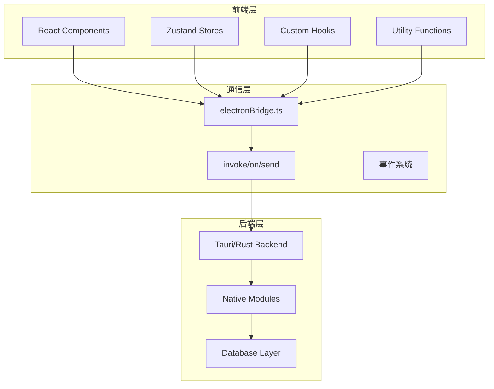
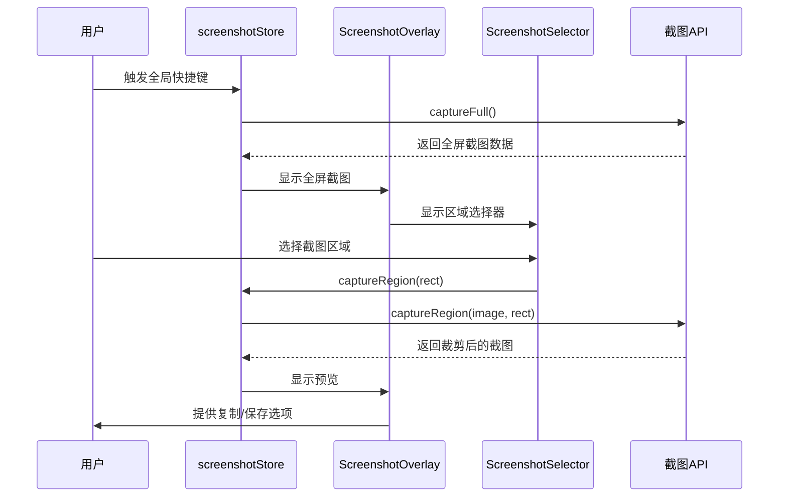
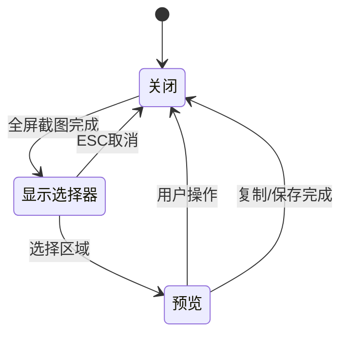
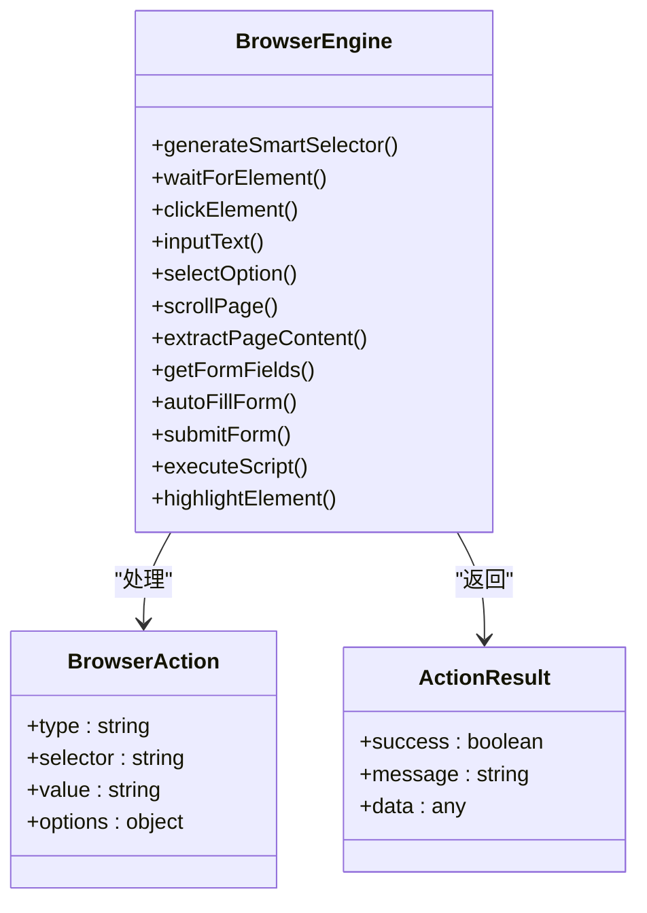
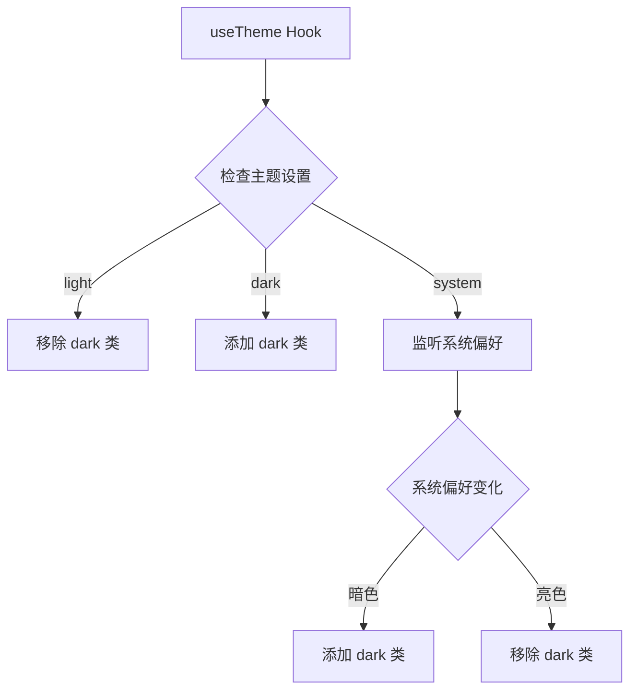
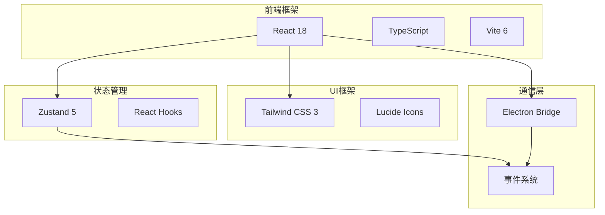

# 前端增强功能

<cite>
**本文档引用的文件**
- [README.md](file://README.md)
- [App.tsx](file://src-web/src/App.tsx)
- [main.tsx](file://src-web/src/main.tsx)
- [AppLayout.tsx](file://src-web/src/components/layout/AppLayout.tsx)
- [WebContentView.tsx](file://src-web/src/components/layout/WebContentView.tsx)
- [WebView2Container.tsx](file://src-web/src/components/layout/WebView2Container.tsx)
- [ScreenshotOverlay.tsx](file://src-web/src/components/ui/ScreenshotOverlay.tsx)
- [ScreenshotSelector.tsx](file://src-web/src/components/ui/ScreenshotSelector.tsx)
- [screenshotStore.ts](file://src-web/src/stores/screenshotStore.ts)
- [browserEngine.ts](file://src-web/src/lib/browserEngine.ts)
- [electronBridge.ts](file://src-web/src/lib/electronBridge.ts)
- [useTheme.ts](file://src-web/src/hooks/useTheme.ts)
- [package.json](file://package.json)
</cite>

## 目录
1. [简介](#简介)
2. [项目结构](#项目结构)
3. [核心组件](#核心组件)
4. [架构概览](#架构概览)
5. [详细组件分析](#详细组件分析)
6. [依赖关系分析](#依赖关系分析)
7. [性能考虑](#性能考虑)
8. [故障排除指南](#故障排除指南)
9. [结论](#结论)

## 简介

CoSurf 是一个基于 Electron 和 React 的 AI 阅读伴侣应用，提供了强大的前端增强功能。该项目的核心目标是成为用户的 AI 阅读伙伴和思考搭档，帮助用户理解、记录和关联阅读内容。

主要特性包括：
- AI 深度理解网页内容，智能摘要和术语解释
- 自动标注要点，生成记忆卡片
- 跨文章关联召回功能
- 浏览器能力：多标签页管理、导航历史、书签管理
- 截图工具：全屏/选区截图，支持标注
- 现代化 UI 设计，支持亮色/暗色主题

## 项目结构

CoSurf 采用现代化的前端架构，主要分为以下几个部分：



**图表来源**
- [AppLayout.tsx:1-209](file://src-web/src/components/layout/AppLayout.tsx#L1-L209)
- [WebContentView.tsx:1-800](file://src-web/src/components/layout/WebContentView.tsx#L1-L800)

**章节来源**
- [README.md:213-326](file://README.md#L213-L326)
- [package.json:1-49](file://package.json#L1-L49)

## 核心组件

### 应用入口和布局系统

应用的入口点位于 `src-web/src/main.tsx`，采用了错误边界机制来提升用户体验：



**图表来源**
- [main.tsx:1-52](file://src-web/src/main.tsx#L1-L52)
- [App.tsx:1-8](file://src-web/src/App.tsx#L1-L8)

### 浏览器内容视图

WebContentView 是整个应用的核心组件，负责处理网页内容的加载和交互：



**图表来源**
- [WebContentView.tsx:114-292](file://src-web/src/components/layout/WebContentView.tsx#L114-L292)
- [WebContentView.tsx:417-604](file://src-web/src/components/layout/WebContentView.tsx#L417-L604)

**章节来源**
- [WebContentView.tsx:1-800](file://src-web/src/components/layout/WebContentView.tsx#L1-L800)

## 架构概览

CoSurf 采用了分层架构设计，从前端到后端的通信通过 Electron Bridge 实现：



**图表来源**
- [electronBridge.ts:1-100](file://src-web/src/lib/electronBridge.ts#L1-L100)
- [AppLayout.tsx:17-209](file://src-web/src/components/layout/AppLayout.tsx#L17-L209)

## 详细组件分析

### 截图功能系统

CoSurf 提供了完整的截图功能，包括全屏截图和区域选择截图：



**图表来源**
- [screenshotStore.ts:1-174](file://src-web/src/stores/screenshotStore.ts#L1-L174)
- [ScreenshotOverlay.tsx:1-153](file://src-web/src/components/ui/ScreenshotOverlay.tsx#L1-L153)
- [ScreenshotSelector.tsx:1-160](file://src-web/src/components/ui/ScreenshotSelector.tsx#L1-L160)

#### 截图状态管理

截图功能的状态管理采用了 Zustand，提供了完整的状态流转：



**图表来源**
- [screenshotStore.ts:25-93](file://src-web/src/stores/screenshotStore.ts#L25-L93)

**章节来源**
- [screenshotStore.ts:1-174](file://src-web/src/stores/screenshotStore.ts#L1-L174)
- [ScreenshotOverlay.tsx:1-153](file://src-web/src/components/ui/ScreenshotOverlay.tsx#L1-L153)
- [ScreenshotSelector.tsx:1-160](file://src-web/src/components/ui/ScreenshotSelector.tsx#L1-L160)

### 浏览器自动化引擎

CoSurf 内置了强大的浏览器自动化引擎，支持多种操作类型：



**图表来源**
- [browserEngine.ts:1-521](file://src-web/src/lib/browserEngine.ts#L1-L521)

#### 智能选择器生成

浏览器引擎的核心功能之一是智能选择器生成，支持多种选择器策略：

```mermaid
flowchart TD
A[生成智能选择器] --> B{检查元素属性}
B --> |有ID| C[返回 #id]
B --> |有类名| D[返回 tagName.class1.class2]
B --> |有属性| E[返回 [attr="value"]]
B --> |无匹配| F[生成元素路径]
F --> G[使用CSS选择器]
G --> H[使用XPath风格路径]
```

**图表来源**
- [browserEngine.ts:22-77](file://src-web/src/lib/browserEngine.ts#L22-L77)

**章节来源**
- [browserEngine.ts:1-521](file://src-web/src/lib/browserEngine.ts#L1-L521)

### 主题系统

CoSurf 支持动态主题切换，包括亮色、暗色和系统跟随模式：



**图表来源**
- [useTheme.ts:1-25](file://src-web/src/hooks/useTheme.ts#L1-L25)

**章节来源**
- [useTheme.ts:1-25](file://src-web/src/hooks/useTheme.ts#L1-L25)

## 依赖关系分析

### 技术栈依赖

CoSurf 采用了现代化的技术栈，各组件之间的依赖关系如下：



**图表来源**
- [README.md:102-116](file://README.md#L102-L116)

### 组件间通信

前端组件间的通信主要通过以下几种方式实现：

1. **Props 传递**：父子组件间的数据传递
2. **Zustand Store**：全局状态管理
3. **事件系统**：组件间松耦合通信
4. **Electron Bridge**：前端与后端通信

**章节来源**
- [README.md:102-116](file://README.md#L102-L116)

## 性能考虑

### 渲染优化

CoSurf 在性能方面采用了多项优化措施：

1. **懒加载组件**：只渲染当前激活的标签页
2. **事件监听清理**：及时清理不再使用的事件监听器
3. **状态管理优化**：使用 Zustand 减少不必要的重渲染
4. **内存管理**：定期清理过期的请求记录

### 网络和资源优化

1. **CDN 资源**：使用 CDN 加载第三方库
2. **按需加载**：只在需要时加载特定功能
3. **缓存策略**：合理利用浏览器缓存

## 故障排除指南

### 常见问题及解决方案

#### 截图功能异常

**问题症状**：截图功能无法正常工作

**可能原因**：
1. Electron API 不可用
2. 截图权限问题
3. 图像数据格式错误

**解决步骤**：
1. 检查 Electron 环境是否可用
2. 验证截图权限设置
3. 确认图像数据格式正确

#### 页面加载问题

**问题症状**：网页无法正常加载或显示空白

**可能原因**：
1. CSP 限制
2. 跨域访问问题
3. 网络连接问题

**解决步骤**：
1. 检查 CSP 配置
2. 验证跨域设置
3. 测试网络连接

#### 主题切换问题

**问题症状**：主题切换后样式不生效

**可能原因**：
1. CSS 类未正确应用
2. 事件监听器未正确绑定
3. 浏览器缓存问题

**解决步骤**：
1. 检查 CSS 类的正确性
2. 验证事件监听器绑定
3. 清除浏览器缓存

**章节来源**
- [main.tsx:6-43](file://src-web/src/main.tsx#L6-L43)
- [WebContentView.tsx:154-180](file://src-web/src/components/layout/WebContentView.tsx#L154-L180)

## 结论

CoSurf 的前端增强功能展现了现代 Web 应用的最佳实践。通过精心设计的架构和丰富的功能特性，该应用为用户提供了优秀的 AI 阅读体验。

主要优势包括：
- **模块化设计**：清晰的组件分离和职责划分
- **状态管理优化**：高效的 Zustand 状态管理
- **用户体验优先**：流畅的交互和响应式设计
- **可扩展性**：易于添加新功能和组件

未来可以考虑的改进方向：
- 进一步优化性能，特别是在大型页面上的表现
- 增强错误处理和用户反馈机制
- 扩展更多的浏览器自动化功能
- 改进主题系统的灵活性