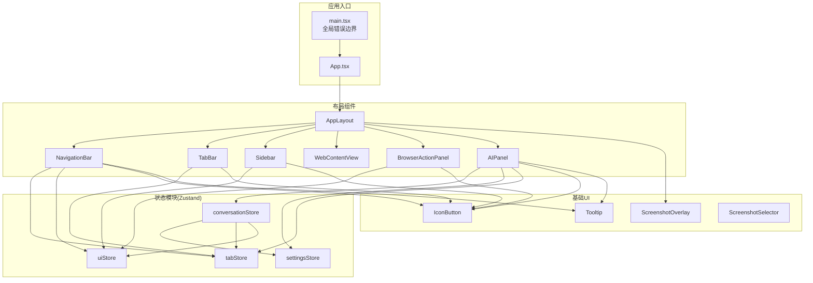
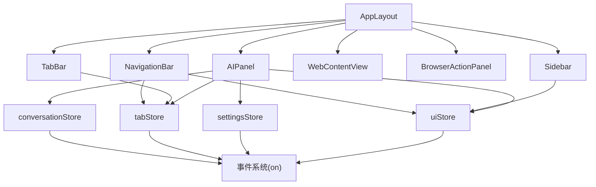
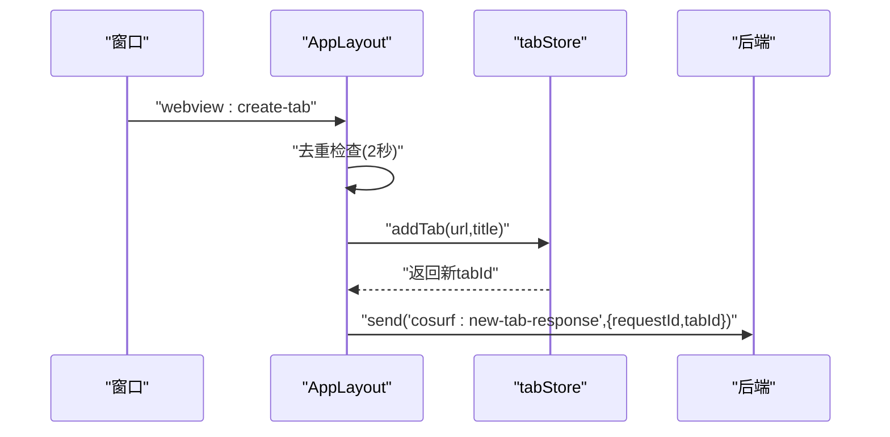
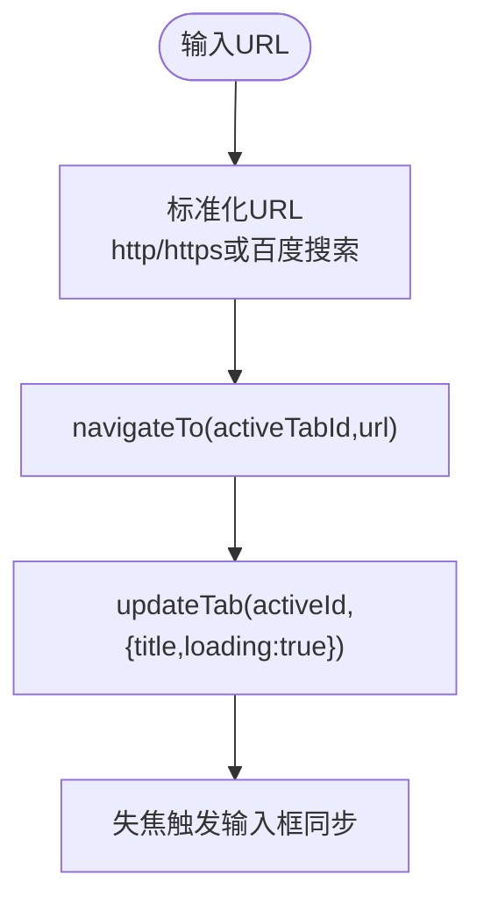
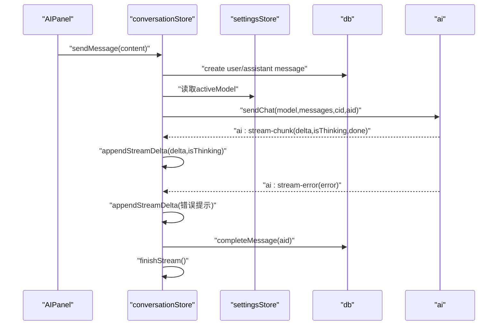
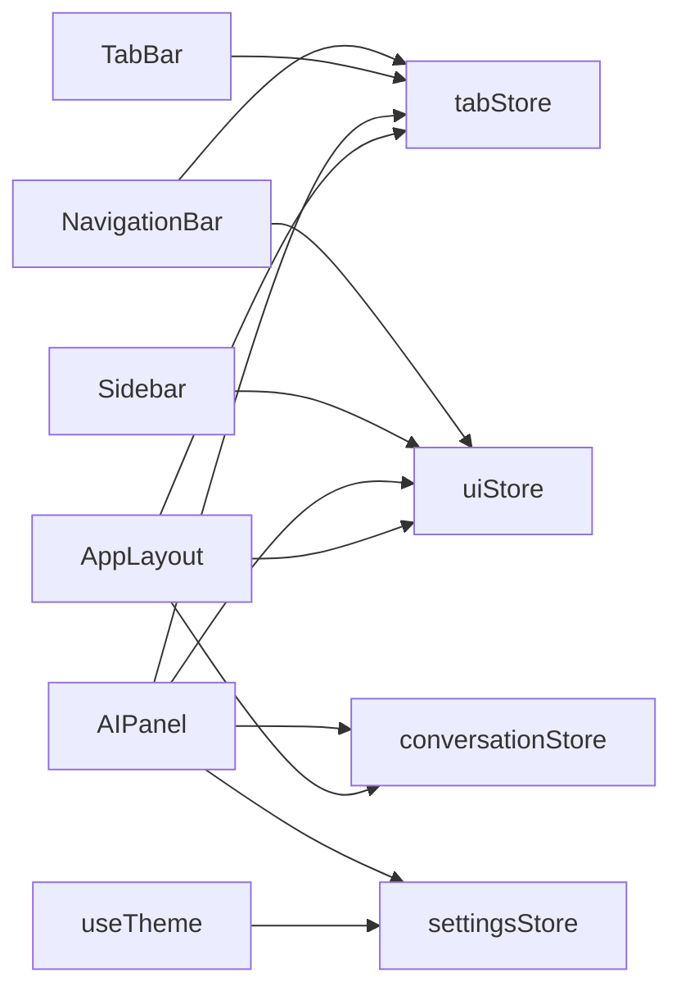
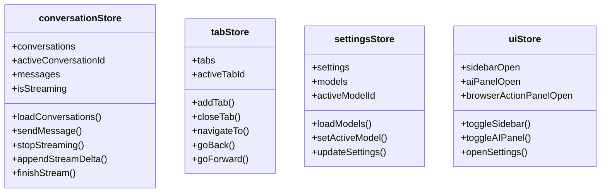

# 前端架构

<cite>
**本文档引用的文件**
- [src-web/src/App.tsx](file://src-web/src/App.tsx)
- [src-web/src/main.tsx](file://src-web/src/main.tsx)
- [src-web/src/index.css](file://src-web/src/index.css)
- [src-web/src/hooks/useTheme.ts](file://src-web/src/hooks/useTheme.ts)
- [src-web/src/components/layout/AppLayout.tsx](file://src-web/src/components/layout/AppLayout.tsx)
- [src-web/src/components/layout/Sidebar.tsx](file://src-web/src/components/layout/Sidebar.tsx)
- [src-web/src/components/layout/TabBar.tsx](file://src-web/src/components/layout/TabBar.tsx)
- [src-web/src/components/layout/NavigationBar.tsx](file://src-web/src/components/layout/NavigationBar.tsx)
- [src-web/src/components/layout/AIPanel.tsx](file://src-web/src/components/layout/AIPanel.tsx)
- [src-web/src/components/layout/BrowserActionPanel.tsx](file://src-web/src/components/layout/BrowserActionPanel.tsx)
- [src-web/src/components/layout/WebContentView.tsx](file://src-web/src/components/layout/WebContentView.tsx)
- [src-web/src/components/ui/IconButton.tsx](file://src-web/src/components/ui/IconButton.tsx)
- [src-web/src/components/ui/Tooltip.tsx](file://src-web/src/components/ui/Tooltip.tsx)
- [src-web/src/components/ui/ScreenshotOverlay.tsx](file://src-web/src/components/ui/ScreenshotOverlay.tsx)
- [src-web/src/components/ui/ScreenshotSelector.tsx](file://src-web/src/components/ui/ScreenshotSelector.tsx)
- [src-web/src/stores/conversationStore.ts](file://src-web/src/stores/conversationStore.ts)
- [src-web/src/stores/tabStore.ts](file://src-web/src/stores/tabStore.ts)
- [src-web/src/stores/settingsStore.ts](file://src-web/src/stores/settingsStore.ts)
- [src-web/src/stores/uiStore.ts](file://src-web/src/stores/uiStore.ts)
- [src-web/package.json](file://src-web/package.json)
- [src-web/tsconfig.app.json](file://src-web/tsconfig.app.json)
</cite>

## 目录
1. [简介](#简介)
2. [项目结构](#项目结构)
3. [核心组件](#核心组件)
4. [架构总览](#架构总览)
5. [详细组件分析](#详细组件分析)
6. [依赖关系分析](#依赖关系分析)
7. [性能考虑](#性能考虑)
8. [故障排查指南](#故障排查指南)
9. [结论](#结论)
10. [附录](#附录)

## 简介
本文件面向 CoSurf 前端架构，系统性梳理 React 组件树与状态管理，重点覆盖布局组件（AppLayout、Sidebar、TabBar、NavigationBar）、功能组件（AIPanel、BrowserActionPanel、WebContentView）的设计与职责；深入解析 Zustand 状态模块（conversationStore、tabStore、settingsStore、uiStore）的数据流与交互模式；阐述基础 UI 组件（IconButton、Tooltip、ScreenshotOverlay、ScreenshotSelector）的实现与复用策略；说明样式系统与主题切换机制；解释事件系统与组件间通信；并提供组件生命周期管理、性能优化策略与错误边界处理的最佳实践。

## 项目结构
前端位于 src-web 目录，采用按功能分层的组织方式：
- 组件层：components/layout（布局与功能组件）、components/ui（基础 UI 组件）
- 状态层：stores（Zustand 状态模块）
- 钩子与工具：hooks（如 useTheme）、lib（事件、API、工具函数）
- 样式层：index.css（Tailwind + CSS 变量主题）

图表来源
- [src-web/src/App.tsx:1-8](file://src-web/src/App.tsx#L1-L8)
- [src-web/src/main.tsx:1-52](file://src-web/src/main.tsx#L1-L52)
- [src-web/src/components/layout/AppLayout.tsx:1-209](file://src-web/src/components/layout/AppLayout.tsx#L1-L209)
- [src-web/src/stores/conversationStore.ts:1-365](file://src-web/src/stores/conversationStore.ts#L1-L365)
- [src-web/src/stores/tabStore.ts:1-220](file://src-web/src/stores/tabStore.ts#L1-L220)
- [src-web/src/stores/settingsStore.ts:1-201](file://src-web/src/stores/settingsStore.ts#L1-L201)
- [src-web/src/stores/uiStore.ts:1-99](file://src-web/src/stores/uiStore.ts#L1-L99)

章节来源
- [src-web/src/App.tsx:1-8](file://src-web/src/App.tsx#L1-L8)
- [src-web/src/main.tsx:1-52](file://src-web/src/main.tsx#L1-L52)
- [src-web/src/index.css:1-95](file://src-web/src/index.css#L1-L95)
- [src-web/src/hooks/useTheme.ts:1-25](file://src-web/src/hooks/useTheme.ts#L1-L25)

## 核心组件
- App：应用根组件，初始化主题钩子并挂载 AppLayout。
- AppLayout：顶层布局容器，负责全局快捷键、跨组件事件监听（新建标签页）、拖拽调整侧边栏宽度、组合渲染各子布局。
- TabBar：标签页列表与交互，支持新增、关闭、切换、静音、favicon 展示。
- NavigationBar：地址栏、导航按钮、书签、窗口控制、侧边栏面板切换、工具箱开关。
- Sidebar：侧边栏内容区，根据当前面板类型渲染不同面板（书签、历史、对话、下载、标签）。
- AIPanel：AI 对话面板，含模型选择、消息列表、输入框、流式输出、反馈与复制。
- BrowserActionPanel：浏览器动作面板（如截图、工具等）。
- WebContentView：承载 WebView 的容器，负责页面内容展示与交互桥接。

章节来源
- [src-web/src/App.tsx:1-8](file://src-web/src/App.tsx#L1-L8)
- [src-web/src/components/layout/AppLayout.tsx:1-209](file://src-web/src/components/layout/AppLayout.tsx#L1-L209)
- [src-web/src/components/layout/TabBar.tsx:1-79](file://src-web/src/components/layout/TabBar.tsx#L1-L79)
- [src-web/src/components/layout/NavigationBar.tsx:1-388](file://src-web/src/components/layout/NavigationBar.tsx#L1-L388)
- [src-web/src/components/layout/Sidebar.tsx:1-180](file://src-web/src/components/layout/Sidebar.tsx#L1-L180)
- [src-web/src/components/layout/AIPanel.tsx:1-647](file://src-web/src/components/layout/AIPanel.tsx#L1-L647)

## 架构总览
CoSurf 前端采用“组件 + 状态模块”的清晰分层：
- 组件层：负责视图与用户交互，通过 hooks 订阅状态模块。
- 状态层：Zustand Store 管理应用状态，提供原子化的读写与副作用（如数据库访问、AI 流式事件）。
- 事件层：基于自定义事件系统（on/off）实现跨组件通信（如新建标签页请求、AI 流式片段）。
- 主题层：CSS 变量 + useTheme 钩子实现明暗主题与系统跟随。

图表来源
- [src-web/src/components/layout/AppLayout.tsx:1-209](file://src-web/src/components/layout/AppLayout.tsx#L1-L209)
- [src-web/src/stores/conversationStore.ts:1-365](file://src-web/src/stores/conversationStore.ts#L1-L365)
- [src-web/src/stores/tabStore.ts:1-220](file://src-web/src/stores/tabStore.ts#L1-L220)
- [src-web/src/stores/settingsStore.ts:1-201](file://src-web/src/stores/settingsStore.ts#L1-L201)
- [src-web/src/stores/uiStore.ts:1-99](file://src-web/src/stores/uiStore.ts#L1-L99)

## 详细组件分析

### AppLayout：顶层布局与全局行为
- 全局快捷键：支持 Ctrl+J（切换 AI 面板）、Ctrl+T（新建标签）、Ctrl+W（关闭当前标签）、Ctrl+L（聚焦地址栏）、Ctrl+Shift+N（新建对话并确保 AI 面板打开）。
- 启动初始化：加载模型与对话列表；避免重复调用 setActiveTab 导致的状态不一致。
- 新建标签页请求：监听 webview:create-tab 事件，去重（同一 URL 2 秒内不重复创建），创建后回传新标签页 ID。
- 侧边栏宽度拖拽：鼠标按下后计算 delta，实时更新 sidebarWidth，并恢复样式。
- 子组件组合：NavigationBar、TabBar、Sidebar、WebContentView、BrowserActionPanel、AIPanel、SettingsPage、ToolboxPanel、ScreenshotOverlay。

图表来源
- [src-web/src/components/layout/AppLayout.tsx:118-150](file://src-web/src/components/layout/AppLayout.tsx#L118-L150)
- [src-web/src/stores/tabStore.ts:69-89](file://src-web/src/stores/tabStore.ts#L69-L89)

章节来源
- [src-web/src/components/layout/AppLayout.tsx:1-209](file://src-web/src/components/layout/AppLayout.tsx#L1-L209)

### TabBar：标签页管理
- 订阅策略：分别订阅 tabs 与 activeTabId，避免对象引用导致的无限重渲染。
- 视觉与交互：支持 favicon、加载动画、静音标记、关闭按钮、hover 显示关闭态。
- 功能：新增标签、关闭指定标签、切换活动标签、滚动容器支持横向滚动。

章节来源
- [src-web/src/components/layout/TabBar.tsx:1-79](file://src-web/src/components/layout/TabBar.tsx#L1-L79)
- [src-web/src/stores/tabStore.ts:1-220](file://src-web/src/stores/tabStore.ts#L1-L220)

### NavigationBar：地址栏与导航控制
- 地址栏：支持 Enter 导航、Escape 失焦；自动标准化 URL（http/https、搜索引擎）；显示安全图标与域信息。
- 导航按钮：后退、前进、刷新、主页；根据 canGoBack/canGoForward 控制可用性。
- 书签：根据当前 URL 判断是否已收藏，支持添加/移除。
- 侧边栏与工具：切换标签管理、工具箱、书签、历史、AI 面板、下载管理、设置。
- 窗口控制：最小化、最大化/还原、关闭。
- 事件联动：监听 cosurf:focus-address-bar 事件聚焦地址栏。

图表来源
- [src-web/src/components/layout/NavigationBar.tsx:128-174](file://src-web/src/components/layout/NavigationBar.tsx#L128-L174)
- [src-web/src/stores/tabStore.ts:141-161](file://src-web/src/stores/tabStore.ts#L141-L161)

章节来源
- [src-web/src/components/layout/NavigationBar.tsx:1-388](file://src-web/src/components/layout/NavigationBar.tsx#L1-L388)
- [src-web/src/stores/tabStore.ts:1-220](file://src-web/src/stores/tabStore.ts#L1-L220)

### Sidebar：侧边栏面板
- 面板类型：书签、历史、对话、下载、标签；通过 uiStore 控制当前面板与开关。
- 会话面板：支持新建对话、置顶/取消置顶、删除、切换活动会话；展示消息数量。
- 渲染策略：根据 sidebarPanel 分发渲染对应面板组件。

章节来源
- [src-web/src/components/layout/Sidebar.tsx:1-180](file://src-web/src/components/layout/Sidebar.tsx#L1-L180)
- [src-web/src/stores/uiStore.ts:1-99](file://src-web/src/stores/uiStore.ts#L1-L99)

### AIPanel：AI 对话与消息展示
- 面板尺寸：支持拖拽调整宽度；顶部固定区域包含模型选择、历史、新对话、收起。
- 消息列表：支持 Markdown 渲染、表格、代码块、链接点击（在新标签页打开）；思考过程可折叠展开。
- 输入区：多行文本、Shift+Enter 换行、发送/停止；自动高度适配。
- 流式输出：监听 ai:stream-chunk 事件增量更新；ai:stream-error 错误提示；结束时标记完成。
- 反馈与复制：对助手消息提供点赞/踩、复制响应。

图表来源
- [src-web/src/components/layout/AIPanel.tsx:67-243](file://src-web/src/components/layout/AIPanel.tsx#L67-L243)
- [src-web/src/stores/conversationStore.ts:103-243](file://src-web/src/stores/conversationStore.ts#L103-L243)
- [src-web/src/stores/settingsStore.ts:92-99](file://src-web/src/stores/settingsStore.ts#L92-L99)

章节来源
- [src-web/src/components/layout/AIPanel.tsx:1-647](file://src-web/src/components/layout/AIPanel.tsx#L1-L647)
- [src-web/src/stores/conversationStore.ts:1-365](file://src-web/src/stores/conversationStore.ts#L1-L365)

### BrowserActionPanel 与 WebContentView
- BrowserActionPanel：承载浏览器相关动作（如截图、工具等），由 uiStore 控制开关。
- WebContentView：作为 WebView 容器，与后端交互（如标签页切换、导航）。

章节来源
- [src-web/src/components/layout/BrowserActionPanel.tsx](file://src-web/src/components/layout/BrowserActionPanel.tsx)
- [src-web/src/components/layout/WebContentView.tsx](file://src-web/src/components/layout/WebContentView.tsx)
- [src-web/src/stores/uiStore.ts:1-99](file://src-web/src/stores/uiStore.ts#L1-L99)

### 基础 UI 组件：复用与设计原则
- IconButton：统一尺寸、状态（hover/active）、变体（solid/outline）与图标大小，用于导航、面板、输入区按钮。
- Tooltip：轻提示封装，配合按钮使用，减少文案冗余。
- ScreenshotOverlay/ScreenshotSelector：截图流程的覆盖层与选择器，与 uiStore 的截图状态联动。

章节来源
- [src-web/src/components/ui/IconButton.tsx](file://src-web/src/components/ui/IconButton.tsx)
- [src-web/src/components/ui/Tooltip.tsx](file://src-web/src/components/ui/Tooltip.tsx)
- [src-web/src/components/ui/ScreenshotOverlay.tsx](file://src-web/src/components/ui/ScreenshotOverlay.tsx)
- [src-web/src/components/ui/ScreenshotSelector.tsx](file://src-web/src/components/ui/ScreenshotSelector.tsx)

## 依赖关系分析
- 组件依赖：各布局组件通过 Zustand hooks 订阅状态；NavigationBar 与 TabBar 依赖 tabStore；AIPanel 依赖 conversationStore、settingsStore、tabStore、uiStore；Sidebar 依赖 uiStore。
- 事件依赖：AppLayout 监听 webview:create-tab；conversationStore 监听 ai:stream-chunk/ai:stream-error。
- 主题依赖：useTheme 读取 settingsStore 中的 theme 并切换 root.classList。

图表来源
- [src-web/src/components/layout/NavigationBar.tsx:23-47](file://src-web/src/components/layout/NavigationBar.tsx#L23-L47)
- [src-web/src/components/layout/TabBar.tsx:2-12](file://src-web/src/components/layout/TabBar.tsx#L2-L12)
- [src-web/src/components/layout/Sidebar.tsx:12-19](file://src-web/src/components/layout/Sidebar.tsx#L12-L19)
- [src-web/src/components/layout/AIPanel.tsx:22-26](file://src-web/src/components/layout/AIPanel.tsx#L22-L26)
- [src-web/src/components/layout/AppLayout.tsx:10-13](file://src-web/src/components/layout/AppLayout.tsx#L10-L13)
- [src-web/src/hooks/useTheme.ts:4-5](file://src-web/src/hooks/useTheme.ts#L4-L5)

章节来源
- [src-web/src/stores/conversationStore.ts:1-365](file://src-web/src/stores/conversationStore.ts#L1-L365)
- [src-web/src/stores/tabStore.ts:1-220](file://src-web/src/stores/tabStore.ts#L1-L220)
- [src-web/src/stores/settingsStore.ts:1-201](file://src-web/src/stores/settingsStore.ts#L1-L201)
- [src-web/src/stores/uiStore.ts:1-99](file://src-web/src/stores/uiStore.ts#L1-L99)

## 性能考虑
- 订阅粒度：TabBar 与 NavigationBar 分别订阅 tabs 与 activeTabId，避免对象引用导致的重渲染风暴。
- 渲染优化：AIPanel 中消息列表使用基于内容的 key，确保消息内容变化时重渲染；Textarea 高度自适应限制最大高度。
- 事件去重：AppLayout 对新建标签页请求进行去重（2 秒内相同 URL 不重复创建），并定期清理请求记录（30 秒）。
- DOM 事件：拖拽调整宽度时临时设置 body 样式，释放时恢复，避免全局样式污染。
- 数据持久化：Zustand 状态与数据库双向同步，避免内存状态丢失；AI 流式输出直接落库，减少重复保存。

章节来源
- [src-web/src/components/layout/TabBar.tsx:7-9](file://src-web/src/components/layout/TabBar.tsx#L7-L9)
- [src-web/src/components/layout/NavigationBar.tsx:33-36](file://src-web/src/components/layout/NavigationBar.tsx#L33-L36)
- [src-web/src/components/layout/AIPanel.tsx:55-65](file://src-web/src/components/layout/AIPanel.tsx#L55-L65)
- [src-web/src/components/layout/AppLayout.tsx:99-150](file://src-web/src/components/layout/AppLayout.tsx#L99-L150)

## 故障排查指南
- 全局错误边界：main.tsx 中定义 ErrorBoundary，捕获子树异常并提供重载按钮。
- 控制台日志：conversationStore 在消息发送、流式片段、错误场景打印详细日志，便于定位问题。
- 常见问题：
  - 无法发送消息：检查 settingsStore 中是否存在已激活模型；确认网络与 API Key。
  - 标签页无法创建：检查 webview:create-tab 事件是否被正确派发与去重逻辑。
  - 主题不生效：确认 useTheme 已执行，且 settingsStore 中 theme 正确更新。

章节来源
- [src-web/src/main.tsx:6-43](file://src-web/src/main.tsx#L6-L43)
- [src-web/src/stores/conversationStore.ts:177-242](file://src-web/src/stores/conversationStore.ts#L177-L242)

## 结论
CoSurf 前端以清晰的组件分层与 Zustand 状态模块为核心，结合事件系统实现跨组件通信；通过主题钩子与 Tailwind/CSS 变量实现灵活的主题切换；在性能方面采用精细化订阅与事件去重策略。整体架构具备良好的扩展性与可维护性，适合进一步引入更多工具面板与技能系统。

## 附录

### 样式系统与主题切换机制
- CSS 变量：index.css 定义明/暗两套变量，通过 root.classList 切换 .dark 类名。
- useTheme：根据 settingsStore 中的 theme 值动态添加/移除 .dark，支持系统跟随模式。
- Tailwind：使用 @tailwind base/components/utilities，提供通用样式与滚动条、拖拽区域等定制类。

章节来源
- [src-web/src/index.css:5-41](file://src-web/src/index.css#L5-L41)
- [src-web/src/hooks/useTheme.ts:4-23](file://src-web/src/hooks/useTheme.ts#L4-L23)

### Zustand 状态模块设计模式与数据流
- conversationStore：管理会话列表、消息流式输出、标题自动生成、反馈写入。
- tabStore：管理标签页集合、导航历史、活跃标签页切换、新增/关闭标签。
- settingsStore：管理应用设置、模型配置、主题语言、技能目录与 IQS API Key。
- uiStore：管理 UI 面板开关与尺寸、设置页视图、工具箱开关。

图表来源
- [src-web/src/stores/conversationStore.ts:8-25](file://src-web/src/stores/conversationStore.ts#L8-L25)
- [src-web/src/stores/tabStore.ts:6-20](file://src-web/src/stores/tabStore.ts#L6-L20)
- [src-web/src/stores/settingsStore.ts:6-31](file://src-web/src/stores/settingsStore.ts#L6-L31)
- [src-web/src/stores/uiStore.ts:6-29](file://src-web/src/stores/uiStore.ts#L6-L29)

### 事件系统与组件间通信
- 事件监听：on(eventName, handler) 注册监听；在组件卸载时需调用 unlisten。
- 典型事件：
  - webview:create-tab：来自后端的创建标签页请求，携带 requestId/url/title。
  - ai:stream-chunk：AI 流式输出片段，携带 conversationId/messageId/delta/isThinking/done。
  - ai:stream-error：AI 流式错误，携带 conversationId/error。
  - ai:tool-call-start：工具调用开始事件（日志用途）。

章节来源
- [src-web/src/components/layout/AppLayout.tsx:118-150](file://src-web/src/components/layout/AppLayout.tsx#L118-L150)
- [src-web/src/stores/conversationStore.ts:177-216](file://src-web/src/stores/conversationStore.ts#L177-L216)

### 组件生命周期管理与最佳实践
- 生命周期：在 useEffect 中注册键盘事件、窗口事件、定时清理；在返回函数中移除监听，避免内存泄漏。
- 性能：避免在渲染路径中创建新对象；使用 useCallback 包裹事件处理器；合理拆分订阅范围。
- 错误处理：全局 ErrorBoundary 捕获异常；store 内部 try/catch 并记录错误；必要时回退 UI 状态。

章节来源
- [src-web/src/components/layout/AppLayout.tsx:31-84](file://src-web/src/components/layout/AppLayout.tsx#L31-L84)
- [src-web/src/main.tsx:6-43](file://src-web/src/main.tsx#L6-L43)