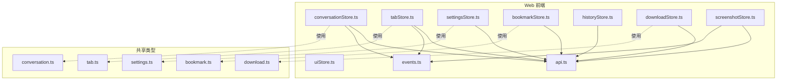
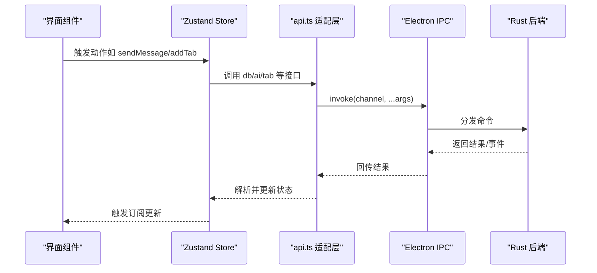
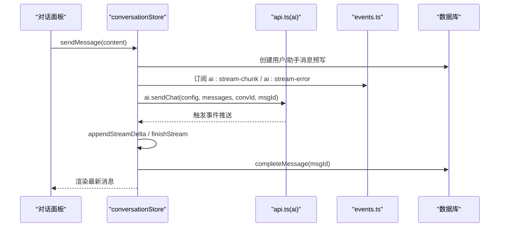
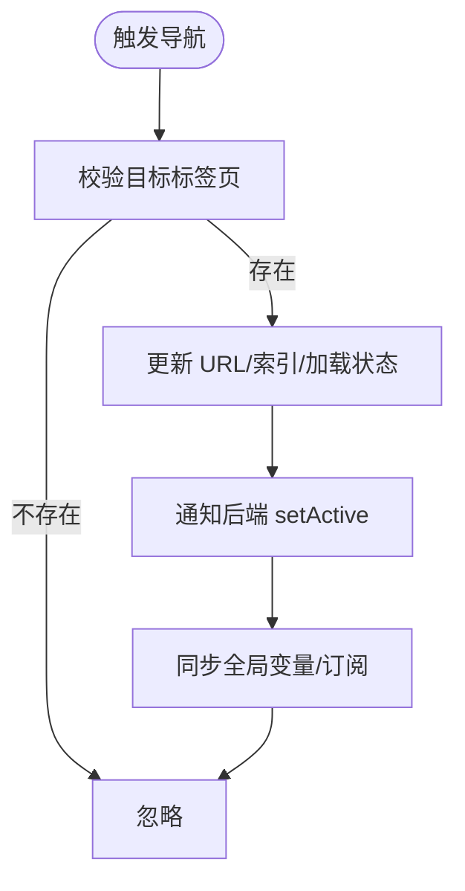
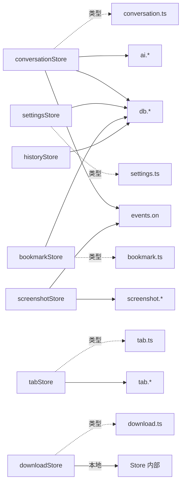

# 状态管理

<cite>
**本文引用的文件**
- [conversationStore.ts](file://src-web/src/stores/conversationStore.ts)
- [tabStore.ts](file://src-web/src/stores/tabStore.ts)
- [settingsStore.ts](file://src-web/src/stores/settingsStore.ts)
- [uiStore.ts](file://src-web/src/stores/uiStore.ts)
- [bookmarkStore.ts](file://src-web/src/stores/bookmarkStore.ts)
- [historyStore.ts](file://src-web/src/stores/historyStore.ts)
- [downloadStore.ts](file://src-web/src/stores/downloadStore.ts)
- [screenshotStore.ts](file://src-web/src/stores/screenshotStore.ts)
- [api.ts](file://src-web/src/lib/api.ts)
- [events.ts](file://src-web/src/lib/events.ts)
- [conversation.ts](file://packages/shared/src/conversation.ts)
- [tab.ts](file://packages/shared/src/tab.ts)
- [settings.ts](file://packages/shared/src/settings.ts)
- [bookmark.ts](file://packages/shared/src/bookmark.ts)
- [download.ts](file://packages/shared/src/download.ts)
</cite>

## 目录
1. [简介](#简介)
2. [项目结构](#项目结构)
3. [核心组件](#核心组件)
4. [架构总览](#架构总览)
5. [详细组件分析](#详细组件分析)
6. [依赖关系分析](#依赖关系分析)
7. [性能考量](#性能考量)
8. [故障排查指南](#故障排查指南)
9. [结论](#结论)
10. [附录](#附录)

## 简介
本文件系统性梳理 CoSurf 基于 Zustand 的状态管理架构，覆盖对话、标签页、设置、UI、书签、历史、下载、截图八大 Store 的设计与职责，并深入解析状态同步机制（与后端的双向绑定、事件驱动的实时更新、持久化策略）、订阅与派发模式、中间件使用建议、最佳实践、性能优化与调试技巧。文档同时提供可操作的状态操作示例与错误处理方案，帮助开发者快速理解与扩展状态管理。

## 项目结构
CoSurf 的前端状态管理集中于 src-web/src/stores 目录，采用“按功能域划分”的模块化组织方式，每个 Store 独立封装状态、动作与副作用，通过统一的 API 层与事件层与后端交互。共享类型位于 packages/shared，确保前后端数据契约一致。

图表来源
- [conversationStore.ts:1-365](file://src-web/src/stores/conversationStore.ts#L1-L365)
- [tabStore.ts:1-248](file://src-web/src/stores/tabStore.ts#L1-L248)
- [settingsStore.ts:1-201](file://src-web/src/stores/settingsStore.ts#L1-L201)
- [uiStore.ts:1-99](file://src-web/src/stores/uiStore.ts#L1-L99)
- [bookmarkStore.ts:1-138](file://src-web/src/stores/bookmarkStore.ts#L1-L138)
- [historyStore.ts:1-100](file://src-web/src/stores/historyStore.ts#L1-L100)
- [downloadStore.ts:1-73](file://src-web/src/stores/downloadStore.ts#L1-L73)
- [screenshotStore.ts:1-128](file://src-web/src/stores/screenshotStore.ts#L1-L128)
- [api.ts:1-429](file://src-web/src/lib/api.ts#L1-L429)
- [events.ts:1-83](file://src-web/src/lib/events.ts#L1-L83)
- [conversation.ts:1-14](file://packages/shared/src/conversation.ts#L1-L14)
- [tab.ts:1-32](file://packages/shared/src/tab.ts#L1-L32)
- [settings.ts:1-47](file://packages/shared/src/settings.ts#L1-L47)
- [bookmark.ts:1-25](file://packages/shared/src/bookmark.ts#L1-L25)
- [download.ts:1-29](file://packages/shared/src/download.ts#L1-L29)

章节来源
- [conversationStore.ts:1-365](file://src-web/src/stores/conversationStore.ts#L1-L365)
- [tabStore.ts:1-248](file://src-web/src/stores/tabStore.ts#L1-L248)
- [settingsStore.ts:1-201](file://src-web/src/stores/settingsStore.ts#L1-L201)
- [uiStore.ts:1-99](file://src-web/src/stores/uiStore.ts#L1-L99)
- [bookmarkStore.ts:1-138](file://src-web/src/stores/bookmarkStore.ts#L1-L138)
- [historyStore.ts:1-100](file://src-web/src/stores/historyStore.ts#L1-L100)
- [downloadStore.ts:1-73](file://src-web/src/stores/downloadStore.ts#L1-L73)
- [screenshotStore.ts:1-128](file://src-web/src/stores/screenshotStore.ts#L1-L128)
- [api.ts:1-429](file://src-web/src/lib/api.ts#L1-L429)
- [events.ts:1-83](file://src-web/src/lib/events.ts#L1-L83)
- [conversation.ts:1-14](file://packages/shared/src/conversation.ts#L1-L14)
- [tab.ts:1-32](file://packages/shared/src/tab.ts#L1-L32)
- [settings.ts:1-47](file://packages/shared/src/settings.ts#L1-L47)
- [bookmark.ts:1-25](file://packages/shared/src/bookmark.ts#L1-L25)
- [download.ts:1-29](file://packages/shared/src/download.ts#L1-L29)

## 核心组件
- conversationStore（对话状态）
  - 职责：维护会话列表、当前会话、消息流、流式生成控制、标题自动生成、与 AI 服务的流式事件交互。
  - 关键点：本地预写入消息与 DB 实体 ID 绑定、事件驱动增量渲染、流结束标记、标题智能更新。
- tabStore（标签页状态）
  - 职责：标签页集合、活动标签页、导航历史、增删改排序、与后端的标签页切换联动。
  - 关键点：导航历史栈、活动态同步至后端、Electron 主进程桥接。
- settingsStore（设置状态）
  - 职责：应用设置、模型配置、活动模型、技能目录、IQS API Key 等。
  - 关键点：设置变更持久化、模型增删改查、活动模型切换。
- uiStore（UI 状态）
  - 职责：侧边栏、AI 面板、浏览器动作面板、设置面板、工具箱的可见性与尺寸。
  - 关键点：宽度约束与窗口自适应、面板切换逻辑。
- bookmarkStore（书签状态）
  - 职责：书签与文件夹、当前目录、搜索、增删改。
  - 关键点：按目录加载、删除文件夹自动回退根目录。
- historyStore（历史记录状态）
  - 职责：浏览历史列表、搜索、新增、清理。
  - 关键点：跳过内部页与空白页、搜索与加载的联动。
- downloadStore（下载状态）
  - 职责：下载队列、状态管理、取消与清理。
  - 关键点：计算属性 activeDownloads、hasDownloads。
- screenshotStore（截图状态）
  - 职责：全屏/区域截图、复制/保存、提示信息。
  - 关键点：事件驱动的截图完成回调、裁剪与后端处理。

章节来源
- [conversationStore.ts:8-25](file://src-web/src/stores/conversationStore.ts#L8-L25)
- [tabStore.ts:6-20](file://src-web/src/stores/tabStore.ts#L6-L20)
- [settingsStore.ts:6-31](file://src-web/src/stores/settingsStore.ts#L6-L31)
- [uiStore.ts:6-29](file://src-web/src/stores/uiStore.ts#L6-L29)
- [bookmarkStore.ts:21-39](file://src-web/src/stores/bookmarkStore.ts#L21-L39)
- [historyStore.ts:11-21](file://src-web/src/stores/historyStore.ts#L11-L21)
- [downloadStore.ts:5-17](file://src-web/src/stores/downloadStore.ts#L5-L17)
- [screenshotStore.ts:5-23](file://src-web/src/stores/screenshotStore.ts#L5-L23)

## 架构总览
Zustand Store 通过统一的 API 层与事件层与后端交互，形成“Store → API → IPC → 后端”的链路；同时 Store 之间通过共享类型与事件进行协作，实现跨域状态同步与解耦。

图表来源
- [api.ts:13-19](file://src-web/src/lib/api.ts#L13-L19)
- [api.ts:54-245](file://src-web/src/lib/api.ts#L54-L245)
- [events.ts:51-57](file://src-web/src/lib/events.ts#L51-L57)

## 详细组件分析

### conversationStore（对话状态）
- 数据结构
  - conversations: 会话数组
  - activeConversationId: 当前会话 ID
  - messages: 当前会话消息数组
  - isStreaming/isLoading: 流式与加载状态
- 核心动作
  - 加载：loadConversations、loadMessages
  - 选择/创建/删除：setActiveConversation、createConversation、deleteConversation
  - 发送消息：sendMessage（含本地预写、DB 持久化、事件监听、流结束标记）
  - 流式处理：appendStreamDelta、finishStream、stopStreaming
  - 标题更新：checkAndUpdateTitle（基于消息内容与轮次）
- 事件与后端
  - 监听 ai:stream-chunk、ai:stream-error、ai:tool-call-start
  - 通过 ai.sendChat 触发 Rust 流式生成，增量写入数据库
- 错误处理
  - 捕获 DB 写入异常、模型缺失、网络错误，展示用户可读提示并停止流

图表来源
- [conversationStore.ts:103-243](file://src-web/src/stores/conversationStore.ts#L103-L243)
- [api.ts:250-267](file://src-web/src/lib/api.ts#L250-L267)
- [events.ts:51-57](file://src-web/src/lib/events.ts#L51-L57)

章节来源
- [conversationStore.ts:8-25](file://src-web/src/stores/conversationStore.ts#L8-L25)
- [conversationStore.ts:34-101](file://src-web/src/stores/conversationStore.ts#L34-L101)
- [conversationStore.ts:103-243](file://src-web/src/stores/conversationStore.ts#L103-L243)
- [conversationStore.ts:245-304](file://src-web/src/stores/conversationStore.ts#L245-L304)
- [conversationStore.ts:306-364](file://src-web/src/stores/conversationStore.ts#L306-L364)
- [conversation.ts:1-14](file://packages/shared/src/conversation.ts#L1-L14)

### tabStore（标签页状态）
- 数据结构
  - tabs: Tab 数组（含导航历史与索引）
  - activeTabId: 当前活动标签页 ID
- 核心动作
  - 活动切换：setActiveTab（同步后端）
  - 新建/关闭：addTab、closeTab（自动回退）
  - 更新/重排：updateTab、reorderTabs
  - 导航：navigateTo、goBack、goForward、canGoBack/canGoForward
- 与后端同步
  - 通过 tabApi.setActive 通知后端切换活动标签页
  - 暴露全局变量与订阅，保持 Electron 主进程同步

图表来源
- [tabStore.ts:152-228](file://src-web/src/stores/tabStore.ts#L152-L228)
- [tabStore.ts:65-72](file://src-web/src/stores/tabStore.ts#L65-L72)
- [tabStore.ts:231-247](file://src-web/src/stores/tabStore.ts#L231-L247)

章节来源
- [tabStore.ts:6-20](file://src-web/src/stores/tabStore.ts#L6-L20)
- [tabStore.ts:38-229](file://src-web/src/stores/tabStore.ts#L38-L229)
- [tab.ts:1-32](file://packages/shared/src/tab.ts#L1-L32)

### settingsStore（设置状态）
- 数据结构
  - settings: AppSettings
  - models: 模型配置数组
  - activeModelId: 活动模型 ID
  - skillsDirectory/iqsApiKey: 特殊配置项
- 核心动作
  - 加载模型与活动模型：loadModels、setActiveModel
  - 设置主题/语言/用户名：setTheme/setLanguage/setUserName
  - 更新设置：updateSettings（逐项持久化）
  - 模型增删改：addModel/removeModel/updateModel
  - 技能目录与 IQS Key：setSkillsDirectory/setIqsApiKey
- 持久化策略
  - settings 通过 db.setSetting 逐项写入；模型通过 db.*ModelConfig 接口管理

章节来源
- [settingsStore.ts:6-31](file://src-web/src/stores/settingsStore.ts#L6-L31)
- [settingsStore.ts:33-200](file://src-web/src/stores/settingsStore.ts#L33-L200)
- [settings.ts:1-47](file://packages/shared/src/settings.ts#L1-L47)

### uiStore（UI 状态）
- 数据结构
  - 侧边栏、AI 面板、浏览器动作面板、设置面板、工具箱的可见性与尺寸
- 核心动作
  - 切换/打开/关闭：toggleSidebar/toggleAIPanel/toggleBrowserActionPanel/openSettings/closeSettings/toggleToolbox/openToolbox/closeToolbox
  - 设置面板：setSettingsView
  - 宽度调整：setSidebarWidth/setAIPanelWidth（带窗口自适应约束）

章节来源
- [uiStore.ts:6-29](file://src-web/src/stores/uiStore.ts#L6-L29)
- [uiStore.ts:31-98](file://src-web/src/stores/uiStore.ts#L31-L98)

### bookmarkStore（书签状态）
- 数据结构
  - bookmarks/folders、currentFolderId、loading、searchQuery
- 核心动作
  - 加载：loadBookmarks/loadFolders
  - 目录切换：setCurrentFolder（自动加载）
  - 搜索：setSearchQuery（联动搜索/加载）
  - 增删改：addBookmark/deleteBookmark、addFolder/deleteFolder
  - 查询：isBookmarked/removeBookmarkByUrl

章节来源
- [bookmarkStore.ts:21-39](file://src-web/src/stores/bookmarkStore.ts#L21-L39)
- [bookmarkStore.ts:41-137](file://src-web/src/stores/bookmarkStore.ts#L41-L137)
- [bookmark.ts:1-25](file://packages/shared/src/bookmark.ts#L1-L25)

### historyStore（历史记录状态）
- 数据结构
  - entries、loading、searchQuery
- 核心动作
  - 搜索/加载：setSearchQuery、loadHistory/searchHistory
  - 新增/删除/清空：addHistory/deleteEntry/clearAll

章节来源
- [historyStore.ts:11-21](file://src-web/src/stores/historyStore.ts#L11-L21)
- [historyStore.ts:23-99](file://src-web/src/stores/historyStore.ts#L23-L99)
- [bookmark.ts:19-24](file://packages/shared/src/bookmark.ts#L19-L24)

### downloadStore（下载状态）
- 数据结构
  - downloads、计算属性 activeDownloads/hasDownloads
- 核心动作
  - 添加/更新/移除：addDownload/updateDownload/removeDownload
  - 清理与取消：clearCompleted/cancelDownload

章节来源
- [downloadStore.ts:5-17](file://src-web/src/stores/downloadStore.ts#L5-L17)
- [downloadStore.ts:19-72](file://src-web/src/stores/downloadStore.ts#L19-L72)
- [download.ts:1-29](file://packages/shared/src/download.ts#L1-L29)

### screenshotStore（截图状态）
- 数据结构
  - isOpen/showSelector/fullScreenImage/imageData 及尺寸、saving/copying、toast
- 核心动作
  - 初始化：init（监听截图完成事件）
  - 关闭：close
  - 区域截图：captureRegion（调用后端裁剪）
  - 复制/保存：copyToClipboard/saveToFile

章节来源
- [screenshotStore.ts:5-23](file://src-web/src/stores/screenshotStore.ts#L5-L23)
- [screenshotStore.ts:25-127](file://src-web/src/stores/screenshotStore.ts#L25-L127)

## 依赖关系分析
- Store 与 API 层
  - 所有 Store 通过 api.ts 的 db/ai/tab/screenshot 等命名空间访问后端能力，统一使用 invoke 与 parseJSON 解析。
- Store 与事件层
  - conversationStore 与 screenshotStore 通过 events.on 监听 ai 与截图事件，实现流式渲染与 UI 协同。
- Store 与共享类型
  - Store 的数据结构与动作参数严格遵循 shared 下的类型定义，保证前后端一致性。

图表来源
- [api.ts:54-245](file://src-web/src/lib/api.ts#L54-L245)
- [events.ts:51-57](file://src-web/src/lib/events.ts#L51-L57)
- [conversation.ts:1-14](file://packages/shared/src/conversation.ts#L1-L14)
- [tab.ts:1-32](file://packages/shared/src/tab.ts#L1-L32)
- [settings.ts:1-47](file://packages/shared/src/settings.ts#L1-L47)
- [bookmark.ts:1-25](file://packages/shared/src/bookmark.ts#L1-L25)
- [download.ts:1-29](file://packages/shared/src/download.ts#L1-L29)

章节来源
- [api.ts:1-429](file://src-web/src/lib/api.ts#L1-L429)
- [events.ts:1-83](file://src-web/src/lib/events.ts#L1-L83)

## 性能考量
- 状态粒度与订阅范围
  - 将大型列表（如历史、书签）拆分为独立 Store，避免无关 UI 重渲染。
  - 使用局部订阅（useStore(selector)）减少不必要的组件刷新。
- 异步与批处理
  - 对批量更新（如标签页重排）使用一次 set，避免多次重渲染。
- 事件监听生命周期
  - 在 conversationStore 中，流结束后及时取消事件监听，防止内存泄漏。
- 计算属性
  - downloadStore 的 activeDownloads/hasDownloads 作为 getter，避免重复计算。
- 网络与 IO
  - 设置与模型变更采用逐项持久化，降低单次写入开销。
- UI 尺寸约束
  - uiStore 的宽度设置包含最小/最大值限制，避免极端尺寸影响性能。

## 故障排查指南
- 对话发送失败
  - 现象：出现错误提示、流无法结束
  - 排查：检查模型是否激活、API Key 是否正确、网络连通性；查看控制台日志定位 sendMessage 流程
  - 参考
    - [conversationStore.ts:235-242](file://src-web/src/stores/conversationStore.ts#L235-L242)
    - [conversationStore.ts:176-216](file://src-web/src/stores/conversationStore.ts#L176-L216)
- 流式事件未到达
  - 现象：消息不更新、无提示
  - 排查：确认事件通道名称一致、监听函数未被提前取消、当前会话 ID 匹配
  - 参考
    - [events.ts:15-35](file://src-web/src/lib/events.ts#L15-L35)
    - [conversationStore.ts:177-209](file://src-web/src/stores/conversationStore.ts#L177-L209)
- 标签页切换不同步
  - 现象：前端活动态与后端不一致
  - 排查：确认 setActive 调用、Electron 全局变量同步、订阅是否生效
  - 参考
    - [tabStore.ts:65-72](file://src-web/src/stores/tabStore.ts#L65-L72)
    - [tabStore.ts:242-246](file://src-web/src/stores/tabStore.ts#L242-L246)
- 设置未持久化
  - 现象：重启后设置丢失
  - 排查：检查 updateSettings 的逐项写入流程、db.setSetting 是否抛错
  - 参考
    - [settingsStore.ts:76-90](file://src-web/src/stores/settingsStore.ts#L76-L90)
- 截图失败
  - 现象：toast 显示失败
  - 排查：确认截图事件回调、裁剪参数、后端 save/copy 接口
  - 参考
    - [screenshotStore.ts:82-101](file://src-web/src/stores/screenshotStore.ts#L82-L101)
    - [screenshotStore.ts:104-126](file://src-web/src/stores/screenshotStore.ts#L104-L126)

章节来源
- [conversationStore.ts:176-242](file://src-web/src/stores/conversationStore.ts#L176-L242)
- [events.ts:15-35](file://src-web/src/lib/events.ts#L15-L35)
- [tabStore.ts:65-72](file://src-web/src/stores/tabStore.ts#L65-L72)
- [tabStore.ts:242-246](file://src-web/src/stores/tabStore.ts#L242-L246)
- [settingsStore.ts:76-90](file://src-web/src/stores/settingsStore.ts#L76-L90)
- [screenshotStore.ts:82-126](file://src-web/src/stores/screenshotStore.ts#L82-L126)

## 结论
CoSurf 的状态管理以 Zustand 为核心，结合统一 API 与事件层，实现了 Store 与后端的高效协同。各 Store 职责清晰、边界明确，通过共享类型保障一致性，通过事件驱动实现流式与实时更新。建议在实际开发中遵循“细粒度 Store + 局部订阅 + 生命周期管理”的原则，持续优化异步与 IO 开销，提升用户体验与稳定性。

## 附录
- 状态操作示例（路径指引）
  - 发送消息：[conversationStore.ts:103-243](file://src-web/src/stores/conversationStore.ts#L103-L243)
  - 新建标签页：[tabStore.ts:74-99](file://src-web/src/stores/tabStore.ts#L74-L99)
  - 切换活动模型：[settingsStore.ts:92-99](file://src-web/src/stores/settingsStore.ts#L92-L99)
  - 打开设置面板：[uiStore.ts:75-85](file://src-web/src/stores/uiStore.ts#L75-L85)
  - 添加书签：[bookmarkStore.ts:78-88](file://src-web/src/stores/bookmarkStore.ts#L78-L88)
  - 搜索历史：[historyStore.ts:48-61](file://src-web/src/stores/historyStore.ts#L48-L61)
  - 添加下载任务：[downloadStore.ts:22-33](file://src-web/src/stores/downloadStore.ts#L22-L33)
  - 截图保存：[screenshotStore.ts:104-126](file://src-web/src/stores/screenshotStore.ts#L104-L126)
- 错误处理方案（路径指引）
  - 对话流错误：[conversationStore.ts:235-242](file://src-web/src/stores/conversationStore.ts#L235-L242)
  - 设置持久化失败：[settingsStore.ts:87-89](file://src-web/src/stores/settingsStore.ts#L87-L89)
  - 截图复制失败：[screenshotStore.ts:96-101](file://src-web/src/stores/screenshotStore.ts#L96-L101)