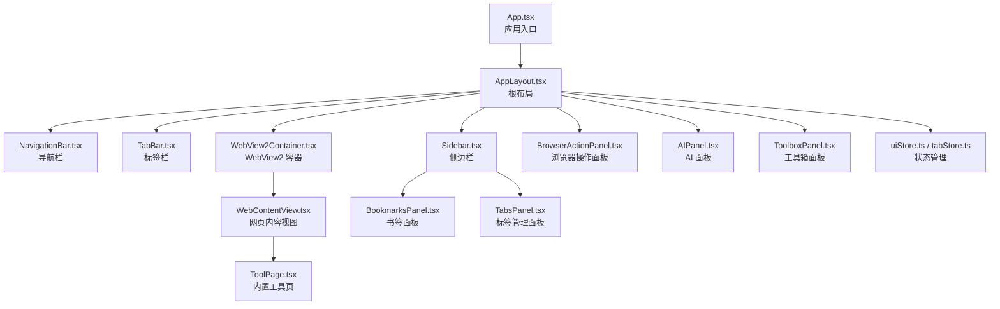
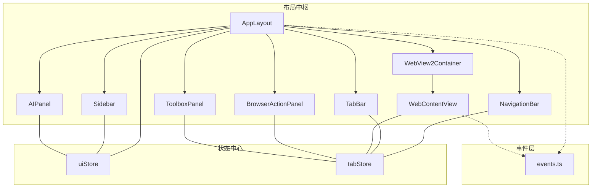
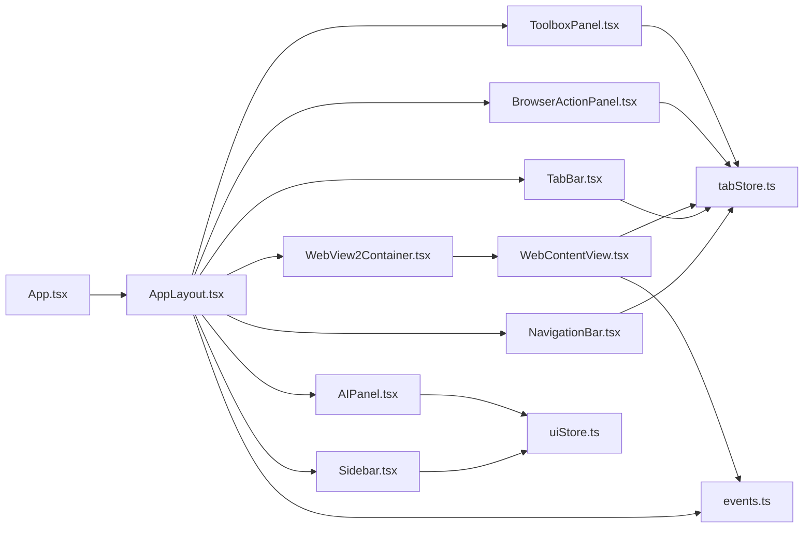
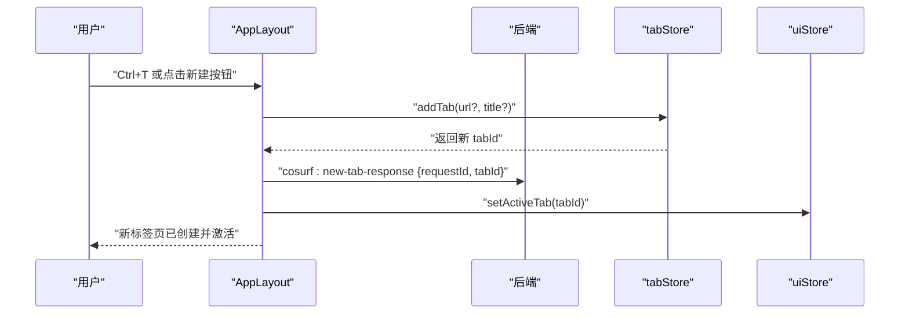
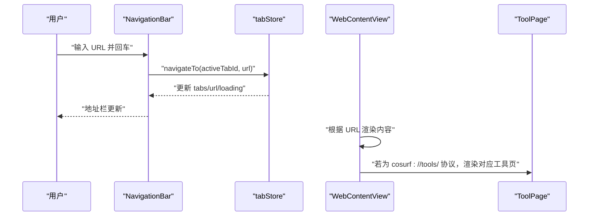
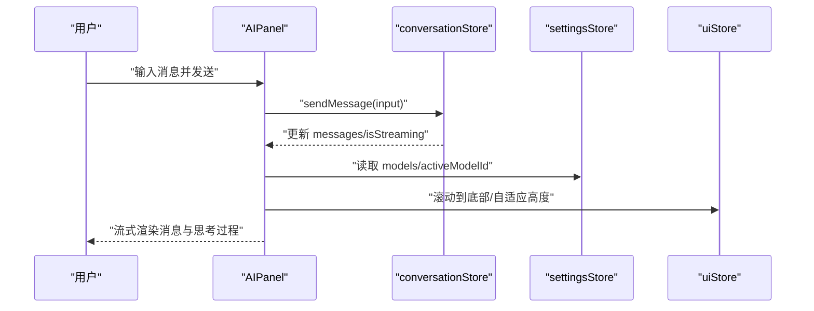

# 组件系统

<cite>
**本文档引用的文件**
- [App.tsx](file://src-web/src/App.tsx)
- [AppLayout.tsx](file://src-web/src/components/layout/AppLayout.tsx)
- [Sidebar.tsx](file://src-web/src/components/layout/Sidebar.tsx)
- [TabBar.tsx](file://src-web/src/components/layout/TabBar.tsx)
- [NavigationBar.tsx](file://src-web/src/components/layout/NavigationBar.tsx)
- [AIPanel.tsx](file://src-web/src/components/layout/AIPanel.tsx)
- [BrowserActionPanel.tsx](file://src-web/src/components/layout/BrowserActionPanel.tsx)
- [WebContentView.tsx](file://src-web/src/components/layout/WebContentView.tsx)
- [WebView2Container.tsx](file://src-web/src/components/layout/WebView2Container.tsx)
- [ToolboxPanel.tsx](file://src-web/src/components/layout/ToolboxPanel.tsx)
- [uiStore.ts](file://src-web/src/stores/uiStore.ts)
- [tabStore.ts](file://src-web/src/stores/tabStore.ts)
- [events.ts](file://src-web/src/lib/events.ts)
- [BookmarksPanel.tsx](file://src-web/src/components/sidebar/BookmarksPanel.tsx)
- [TabsPanel.tsx](file://src-web/src/components/sidebar/TabsPanel.tsx)
- [ToolPage.tsx](file://src-web/src/components/tools/ToolPage.tsx)
</cite>

## 目录
1. [简介](#简介)
2. [项目结构](#项目结构)
3. [核心组件](#核心组件)
4. [架构总览](#架构总览)
5. [组件详解](#组件详解)
6. [依赖关系分析](#依赖关系分析)
7. [性能考量](#性能考量)
8. [故障排查指南](#故障排查指南)
9. [结论](#结论)
10. [附录](#附录)

## 简介
本文件面向 CoSurf 组件系统，围绕 React 组件树进行深入解析，重点覆盖以下方面：
- AppLayout 作为根组件的设计模式与布局管理
- 各布局组件的职责边界与交互关系：Sidebar、TabBar、NavigationBar、AIPanel、BrowserActionPanel、WebContentView、WebView2Container、ToolboxPanel
- 组件间通信机制：props 传递、事件系统、状态共享
- 生命周期管理、条件渲染、动态加载
- 复用策略、性能优化技巧、错误处理模式
- 使用示例与最佳实践

## 项目结构
CoSurf 的前端采用基于功能域的组织方式，核心入口为 App.tsx，其渲染 AppLayout，后者作为布局中枢协调各子组件。

图表来源
- [App.tsx:1-8](file://src-web/src/App.tsx#L1-L8)
- [AppLayout.tsx:1-209](file://src-web/src/components/layout/AppLayout.tsx#L1-L209)
- [WebView2Container.tsx:1-13](file://src-web/src/components/layout/WebView2Container.tsx#L1-L13)
- [WebContentView.tsx:1-964](file://src-web/src/components/layout/WebContentView.tsx#L1-L964)
- [ToolPage.tsx:1-59](file://src-web/src/components/tools/ToolPage.tsx#L1-L59)
- [Sidebar.tsx:1-180](file://src-web/src/components/layout/Sidebar.tsx#L1-L180)
- [BookmarksPanel.tsx:1-289](file://src-web/src/components/sidebar/BookmarksPanel.tsx#L1-L289)
- [TabsPanel.tsx:1-139](file://src-web/src/components/sidebar/TabsPanel.tsx#L1-L139)
- [NavigationBar.tsx:1-388](file://src-web/src/components/layout/NavigationBar.tsx#L1-L388)
- [TabBar.tsx:1-79](file://src-web/src/components/layout/TabBar.tsx#L1-L79)
- [AIPanel.tsx:1-647](file://src-web/src/components/layout/AIPanel.tsx#L1-L647)
- [BrowserActionPanel.tsx:1-264](file://src-web/src/components/layout/BrowserActionPanel.tsx#L1-L264)
- [ToolboxPanel.tsx:1-279](file://src-web/src/components/layout/ToolboxPanel.tsx#L1-L279)
- [uiStore.ts:1-99](file://src-web/src/stores/uiStore.ts#L1-L99)
- [tabStore.ts:1-236](file://src-web/src/stores/tabStore.ts#L1-L236)

章节来源
- [App.tsx:1-8](file://src-web/src/App.tsx#L1-L8)
- [AppLayout.tsx:1-209](file://src-web/src/components/layout/AppLayout.tsx#L1-L209)

## 核心组件
- AppLayout：全局布局容器，负责键盘快捷键、全局事件监听、侧边栏宽度拖拽、AI 面板开关、标签页创建请求去重与响应、UI 状态协调。
- Sidebar：侧边栏容器，根据当前面板类型渲染不同子面板（书签、历史、对话、下载、标签管理），支持面板切换与宽度约束。
- TabBar：标签页列表与操作，支持新建、关闭、切换、静音、加载指示、favicon 展示。
- NavigationBar：地址栏、导航按钮、书签、窗口控制、工具箱入口、AI 面板入口、浏览器操作面板入口。
- AIPanel：AI 对话面板，支持模型选择、消息流式渲染、思考过程折叠、反馈与复制、输入框自适应高度、拖拽宽度。
- BrowserActionPanel：浏览器操作面板，元素选择模式、点击元素、输入文本、截图、提取内容、操作历史。
- WebContentView：网页内容视图，统一处理 iframe 加载、跨域限制、链接拦截、标题获取、页面内容提取、错误抑制与超时检测。
- WebView2Container：WebView2 容器包装，当前直接返回 WebContentView。
- ToolboxPanel：工具箱面板，内置工具分类与搜索，点击在新标签页打开工具页面。
- uiStore / tabStore：状态管理，集中管理 UI 面板开关、尺寸、侧边栏面板类型；标签页集合、活动标签、导航历史与 API 调用。

章节来源
- [AppLayout.tsx:1-209](file://src-web/src/components/layout/AppLayout.tsx#L1-L209)
- [Sidebar.tsx:1-180](file://src-web/src/components/layout/Sidebar.tsx#L1-L180)
- [TabBar.tsx:1-79](file://src-web/src/components/layout/TabBar.tsx#L1-L79)
- [NavigationBar.tsx:1-388](file://src-web/src/components/layout/NavigationBar.tsx#L1-L388)
- [AIPanel.tsx:1-647](file://src-web/src/components/layout/AIPanel.tsx#L1-L647)
- [BrowserActionPanel.tsx:1-264](file://src-web/src/components/layout/BrowserActionPanel.tsx#L1-L264)
- [WebContentView.tsx:1-964](file://src-web/src/components/layout/WebContentView.tsx#L1-L964)
- [WebView2Container.tsx:1-13](file://src-web/src/components/layout/WebView2Container.tsx#L1-L13)
- [ToolboxPanel.tsx:1-279](file://src-web/src/components/layout/ToolboxPanel.tsx#L1-L279)
- [uiStore.ts:1-99](file://src-web/src/stores/uiStore.ts#L1-L99)
- [tabStore.ts:1-236](file://src-web/src/stores/tabStore.ts#L1-L236)

## 架构总览
CoSurf 采用“布局中枢 + 多面板 + 状态中心”的架构：
- 布局中枢：AppLayout 统一调度 UI 面板、键盘快捷键、全局事件与标签页创建流程
- 面板层：各功能面板独立渲染，通过 uiStore 控制显隐与尺寸
- 内容层：WebContentView 负责 iframe 加载与内容交互，ToolPage 支持内置工具
- 状态层：uiStore 管理 UI 状态，tabStore 管理标签页状态与导航历史
- 事件层：events.ts 提供跨平台事件封装，兼容 Electron 与 Tauri 的差异

图表来源
- [AppLayout.tsx:1-209](file://src-web/src/components/layout/AppLayout.tsx#L1-L209)
- [NavigationBar.tsx:1-388](file://src-web/src/components/layout/NavigationBar.tsx#L1-L388)
- [TabBar.tsx:1-79](file://src-web/src/components/layout/TabBar.tsx#L1-L79)
- [WebView2Container.tsx:1-13](file://src-web/src/components/layout/WebView2Container.tsx#L1-L13)
- [WebContentView.tsx:1-964](file://src-web/src/components/layout/WebContentView.tsx#L1-L964)
- [Sidebar.tsx:1-180](file://src-web/src/components/layout/Sidebar.tsx#L1-L180)
- [BrowserActionPanel.tsx:1-264](file://src-web/src/components/layout/BrowserActionPanel.tsx#L1-L264)
- [AIPanel.tsx:1-647](file://src-web/src/components/layout/AIPanel.tsx#L1-L647)
- [ToolboxPanel.tsx:1-279](file://src-web/src/components/layout/ToolboxPanel.tsx#L1-L279)
- [uiStore.ts:1-99](file://src-web/src/stores/uiStore.ts#L1-L99)
- [tabStore.ts:1-236](file://src-web/src/stores/tabStore.ts#L1-L236)
- [events.ts:1-83](file://src-web/src/lib/events.ts#L1-L83)

## 组件详解

### AppLayout：根布局与全局协调
- 设计模式：根组件集中处理全局快捷键、全局事件监听、侧边栏宽度拖拽、标签页创建去重与响应、初始化加载模型与对话列表
- 关键职责
  - 全局快捷键：Ctrl+J 切换 AI 面板、Ctrl+T 新建标签页、Ctrl+W 关闭当前标签页、Ctrl+L 聚焦地址栏、Ctrl+Shift+N 新建对话
  - 标签页创建：监听 webview:create-tab 事件，去重（同一 URL 2 秒内不重复创建），创建后通过 cosurf:new-tab-response 响应后端
  - 侧边栏宽度拖拽：鼠标按下记录初始位置与宽度，移动时实时更新，释放时恢复样式
  - 初始化：启动时加载模型与对话列表
- 通信机制
  - 通过 uiStore/tabsStore/settingsStore/conversationStore 管理状态
  - 通过 events.ts on 监听后端事件
  - 通过 window.dispatchEvent 触发地址栏聚焦等事件

章节来源
- [AppLayout.tsx:1-209](file://src-web/src/components/layout/AppLayout.tsx#L1-L209)
- [events.ts:1-83](file://src-web/src/lib/events.ts#L1-L83)
- [uiStore.ts:1-99](file://src-web/src/stores/uiStore.ts#L1-L99)
- [tabStore.ts:1-236](file://src-web/src/stores/tabStore.ts#L1-L236)

### Sidebar：侧边栏与面板切换
- 职责：根据当前面板类型渲染对应子面板（书签、历史、对话、下载、标签管理），支持面板切换与宽度约束
- 关键点
  - 面板配置表：将面板类型映射到图标与标签
  - ConversationPanel：展示对话列表，支持新建、置顶、删除、切换
  - 与 uiStore 交互：toggleSidebar、setSidebarPanel、setSidebarWidth
- 交互关系
  - NavigationBar 的书签/历史/标签管理按钮通过 setSidebarPanel 切换面板
  - 侧边栏宽度受 uiStore 约束（最小 200px，最大窗口宽度 50%）

章节来源
- [Sidebar.tsx:1-180](file://src-web/src/components/layout/Sidebar.tsx#L1-L180)
- [NavigationBar.tsx:1-388](file://src-web/src/components/layout/NavigationBar.tsx#L1-L388)
- [uiStore.ts:1-99](file://src-web/src/stores/uiStore.ts#L1-L99)
- [BookmarksPanel.tsx:1-289](file://src-web/src/components/sidebar/BookmarksPanel.tsx#L1-L289)
- [TabsPanel.tsx:1-139](file://src-web/src/components/sidebar/TabsPanel.tsx#L1-L139)

### TabBar：标签页列表与操作
- 职责：展示标签页列表，支持切换、关闭、新建、静音、加载指示、favicon 展示
- 关键点
  - 分别订阅 tabs 与 activeTabId，避免对象引用导致的无限循环
  - 支持 hover 显示关闭按钮，点击关闭对应标签页
  - 新建按钮触发 addTab
- 交互关系
  - 与 tabStore 交互：setActiveTab、closeTab、addTab
  - 与 NavigationBar 协作：地址栏聚焦、书签切换

章节来源
- [TabBar.tsx:1-79](file://src-web/src/components/layout/TabBar.tsx#L1-L79)
- [tabStore.ts:1-236](file://src-web/src/stores/tabStore.ts#L1-L236)

### NavigationBar：导航栏与地址栏
- 职责：后退/前进/刷新/主页、地址栏输入与校验、书签切换、窗口控制、工具箱入口、AI 面板入口、浏览器操作面板入口
- 关键点
  - 地址栏输入：支持 about:blank、cosurf://tools/ 协议、URL 标准化、百度搜索回退
  - 书签：根据当前页面 URL 判断是否已收藏，支持添加/移除
  - 窗口控制：最小化、最大化/还原、关闭
  - 事件：监听 cosurf:focus-address-bar 事件聚焦地址栏
- 交互关系
  - 与 tabStore：goBack/goForward/navigateTo/updateTab
  - 与 uiStore：toggleAIPanel/toggleBrowserActionPanel/setSidebarPanel/openSettings/toggleToolbox
  - 与 bookmarkStore：loadBookmarks/addBookmark/removeBookmarkByUrl

章节来源
- [NavigationBar.tsx:1-388](file://src-web/src/components/layout/NavigationBar.tsx#L1-L388)
- [tabStore.ts:1-236](file://src-web/src/stores/tabStore.ts#L1-L236)
- [uiStore.ts:1-99](file://src-web/src/stores/uiStore.ts#L1-L99)

### AIPanel：AI 对话面板
- 职责：模型选择、消息流式渲染、思考过程折叠、反馈与复制、输入框自适应高度、拖拽宽度
- 关键点
  - 模型选择：下拉菜单展示可用模型，支持本地/远程标识
  - 消息渲染：Markdown 渲染、表格、代码块、链接点击（在新标签页打开）
  - 思考过程：可折叠查看，流式生成时自动滚动
  - 输入：支持 Shift+Enter 换行，发送/停止
- 交互关系
  - 与 conversationStore：messages/isStreaming/sendMessage/createConversation/stopStreaming
  - 与 settingsStore：models/activeModelId/setActiveModel
  - 与 uiStore：aiPanelOpen/aiPanelWidth/setAIPanelWidth/toggleAIPanel/setSidebarPanel

章节来源
- [AIPanel.tsx:1-647](file://src-web/src/components/layout/AIPanel.tsx#L1-L647)
- [uiStore.ts:1-99](file://src-web/src/stores/uiStore.ts#L1-L99)
- [tabStore.ts:1-236](file://src-web/src/stores/tabStore.ts#L1-L236)

### BrowserActionPanel：浏览器操作面板
- 职责：元素选择模式、点击元素、输入文本、截图、提取内容、操作历史
- 关键点
  - 通过 pageApi.executeScript 在目标页面执行脚本（点击、输入、滚动）
  - 监听 cosurf:element-selected 事件，接收元素选择结果
  - 支持截图与页面内容提取，并记录操作历史
- 交互关系
  - 与 tabStore：activeTabId
  - 与 events.ts：监听/分发自定义事件

章节来源
- [BrowserActionPanel.tsx:1-264](file://src-web/src/components/layout/BrowserActionPanel.tsx#L1-L264)
- [events.ts:1-83](file://src-web/src/lib/events.ts#L1-L83)

### WebContentView：网页内容视图
- 职责：统一处理 iframe 加载、跨域限制、链接拦截、标题获取、页面内容提取、错误抑制与超时检测
- 关键点
  - 链接拦截：注入脚本拦截 a 标签点击与 window.open，通过 postMessage 通知父窗口创建新标签页
  - 标题获取：优先从 iframe 获取，跨域时通过后端 API 获取
  - 页面内容提取：监听 webview:get-content 事件，执行脚本并返回结果
  - 错误抑制：静默处理 shell.open 相关错误，避免弹窗
  - 超时检测：对 iframe 加载进行超时保护
- 交互关系
  - 与 tabStore：activeTabId、addTab、updateTab
  - 与 events.ts：监听 webview:* 事件
  - 与 ToolPage：识别 cosurf://tools/ 协议并渲染对应工具页

章节来源
- [WebContentView.tsx:1-964](file://src-web/src/components/layout/WebContentView.tsx#L1-L964)
- [ToolPage.tsx:1-59](file://src-web/src/components/tools/ToolPage.tsx#L1-L59)
- [events.ts:1-83](file://src-web/src/lib/events.ts#L1-L83)
- [tabStore.ts:1-236](file://src-web/src/stores/tabStore.ts#L1-L236)

### WebView2Container：WebView2 容器
- 职责：当前直接返回 WebContentView，未来可扩展为多实例 WebView 容器
- 交互关系：与 WebContentView 一对一映射

章节来源
- [WebView2Container.tsx:1-13](file://src-web/src/components/layout/WebView2Container.tsx#L1-L13)
- [WebContentView.tsx:1-964](file://src-web/src/components/layout/WebContentView.tsx#L1-L964)

### ToolboxPanel：工具箱面板
- 职责：内置工具分类与搜索，点击在新标签页打开工具页面
- 关键点
  - 工具分类：JSON 工具、正则表达式、二维码、加密/解密、数据对比
  - 搜索过滤：按名称与描述过滤
  - ESC 关闭与点击外部关闭
- 交互关系
  - 与 uiStore：toolboxOpen/closeToolbox
  - 与 tabStore：addTab

章节来源
- [ToolboxPanel.tsx:1-279](file://src-web/src/components/layout/ToolboxPanel.tsx#L1-L279)
- [uiStore.ts:1-99](file://src-web/src/stores/uiStore.ts#L1-L99)
- [tabStore.ts:1-236](file://src-web/src/stores/tabStore.ts#L1-L236)

## 依赖关系分析

图表来源
- [App.tsx:1-8](file://src-web/src/App.tsx#L1-L8)
- [AppLayout.tsx:1-209](file://src-web/src/components/layout/AppLayout.tsx#L1-L209)
- [WebView2Container.tsx:1-13](file://src-web/src/components/layout/WebView2Container.tsx#L1-L13)
- [WebContentView.tsx:1-964](file://src-web/src/components/layout/WebContentView.tsx#L1-L964)
- [NavigationBar.tsx:1-388](file://src-web/src/components/layout/NavigationBar.tsx#L1-L388)
- [TabBar.tsx:1-79](file://src-web/src/components/layout/TabBar.tsx#L1-L79)
- [Sidebar.tsx:1-180](file://src-web/src/components/layout/Sidebar.tsx#L1-L180)
- [BrowserActionPanel.tsx:1-264](file://src-web/src/components/layout/BrowserActionPanel.tsx#L1-L264)
- [AIPanel.tsx:1-647](file://src-web/src/components/layout/AIPanel.tsx#L1-L647)
- [ToolboxPanel.tsx:1-279](file://src-web/src/components/layout/ToolboxPanel.tsx#L1-L279)
- [uiStore.ts:1-99](file://src-web/src/stores/uiStore.ts#L1-L99)
- [tabStore.ts:1-236](file://src-web/src/stores/tabStore.ts#L1-L236)
- [events.ts:1-83](file://src-web/src/lib/events.ts#L1-L83)

章节来源
- [App.tsx:1-8](file://src-web/src/App.tsx#L1-L8)
- [AppLayout.tsx:1-209](file://src-web/src/components/layout/AppLayout.tsx#L1-L209)
- [uiStore.ts:1-99](file://src-web/src/stores/uiStore.ts#L1-L99)
- [tabStore.ts:1-236](file://src-web/src/stores/tabStore.ts#L1-L236)
- [events.ts:1-83](file://src-web/src/lib/events.ts#L1-L83)

## 性能考量
- 状态订阅优化
  - TabBar/NavigationBar 分别订阅 tabs 与 activeTabId，避免对象引用导致的无限循环
  - AppLayout 使用 useRef 缓存拖拽状态，减少重渲染
- 条件渲染与动态加载
  - Sidebar 仅在 sidebarOpen 且面板非 none 时渲染
  - AIPanel 仅在 aiPanelOpen 时渲染
  - WebContentView 根据 activeTab 与 URL 动态决定渲染内容（欢迎页、工具页、WebPageView）
- 跨域与超时
  - WebContentView 对跨域页面采用后端标题获取与错误抑制策略，避免阻塞 UI
  - 加载超时检测与错误处理，提升健壮性
- 事件与内存
  - 事件监听在组件卸载时及时清理，避免内存泄漏
  - 标签页创建去重（2 秒内相同 URL 不重复创建），降低重复渲染与后端压力

[本节为通用指导，无需特定文件引用]

## 故障排查指南
- 地址栏无法聚焦
  - 检查 NavigationBar 是否正确监听 cosurf:focus-address-bar 事件
  - 确认 AppLayout 的全局快捷键未被输入框拦截
- 新标签页创建无效
  - 检查 AppLayout 是否收到 webview:create-tab 事件
  - 确认去重逻辑（同一 URL 2 秒内不重复创建）
  - 检查后端响应 cosurf:new-tab-response 是否成功
- iframe 无法加载或空白
  - 检查跨域限制与 X-Frame-Options
  - 确认 WebContentView 的链接拦截与 postMessage 机制是否生效
  - 查看加载超时与错误抑制日志
- 书签/历史/下载面板无数据
  - 确认对应 Store 的 load* 方法是否被调用
  - 检查数据持久化与初始化逻辑
- AI 面板不显示或消息不更新
  - 检查 conversationStore 的消息流状态与 isStreaming
  - 确认 AIPanel 的消息列表 key 是否随内容变化而更新

章节来源
- [NavigationBar.tsx:85-93](file://src-web/src/components/layout/NavigationBar.tsx#L85-L93)
- [AppLayout.tsx:118-150](file://src-web/src/components/layout/AppLayout.tsx#L118-L150)
- [WebContentView.tsx:137-151](file://src-web/src/components/layout/WebContentView.tsx#L137-L151)
- [AIPanel.tsx:285-299](file://src-web/src/components/layout/AIPanel.tsx#L285-L299)

## 结论
CoSurf 组件系统以 AppLayout 为核心，通过清晰的职责划分与状态中心实现高内聚、低耦合的布局与功能模块。组件间通过 props、事件与状态共享实现松耦合通信，配合性能优化与错误处理策略，提供了稳定、可扩展的用户体验。建议在后续迭代中进一步完善工具箱功能与跨域场景下的统一处理机制。

[本节为总结，无需特定文件引用]

## 附录

### 组件通信序列图：新建标签页流程

图表来源
- [AppLayout.tsx:131-143](file://src-web/src/components/layout/AppLayout.tsx#L131-L143)
- [tabStore.ts:74-99](file://src-web/src/stores/tabStore.ts#L74-L99)
- [uiStore.ts:56-72](file://src-web/src/stores/uiStore.ts#L56-L72)

### 组件通信序列图：地址栏导航流程

图表来源
- [NavigationBar.tsx:128-174](file://src-web/src/components/layout/NavigationBar.tsx#L128-L174)
- [tabStore.ts:152-171](file://src-web/src/stores/tabStore.ts#L152-L171)
- [WebContentView.tsx:281-288](file://src-web/src/components/layout/WebContentView.tsx#L281-L288)
- [ToolPage.tsx:8-37](file://src-web/src/components/tools/ToolPage.tsx#L8-L37)

### 组件通信序列图：AI 消息流渲染

图表来源
- [AIPanel.tsx:67-74](file://src-web/src/components/layout/AIPanel.tsx#L67-L74)
- [AIPanel.tsx:39-57](file://src-web/src/components/layout/AIPanel.tsx#L39-L57)
- [AIPanel.tsx:124-133](file://src-web/src/components/layout/AIPanel.tsx#L124-L133)
- [uiStore.ts:31-99](file://src-web/src/stores/uiStore.ts#L31-L99)