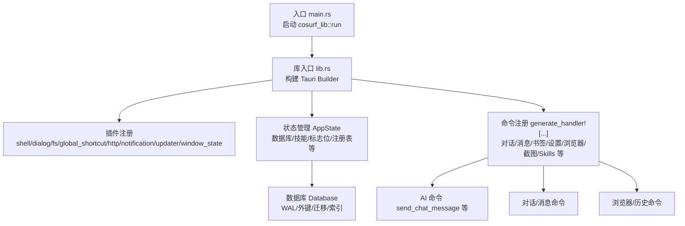
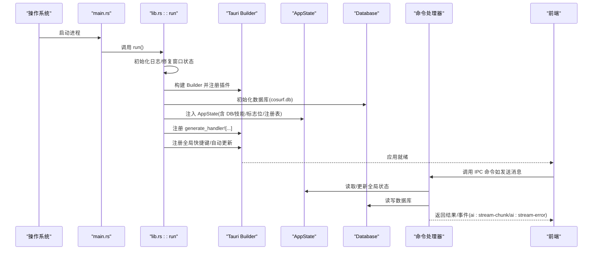
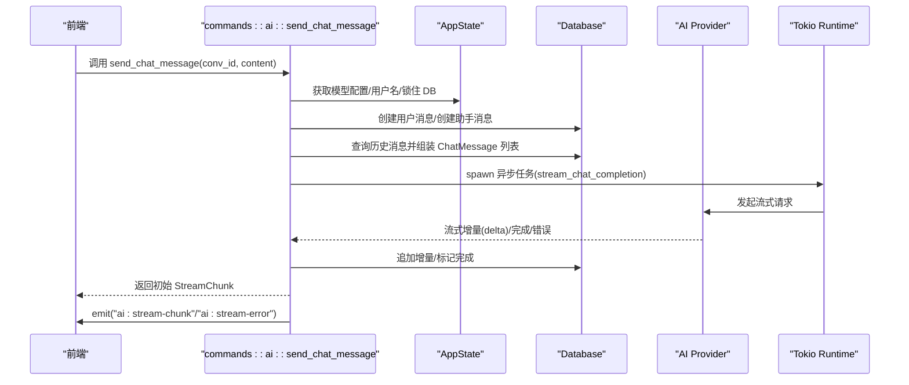
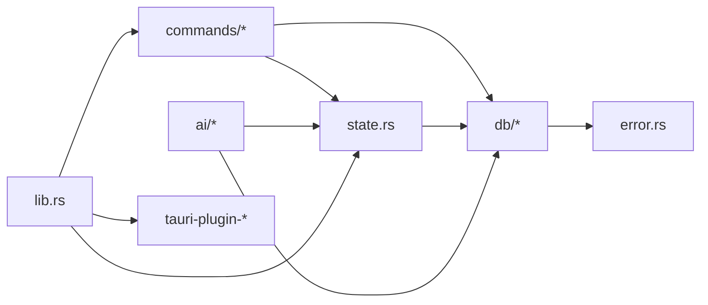

# 后端架构

<cite>
**本文引用的文件**
- [src-tauri/src/main.rs](file://src-tauri/src/main.rs)
- [src-tauri/src/lib.rs](file://src-tauri/src/lib.rs)
- [src-tauri/src/state.rs](file://src-tauri/src/state.rs)
- [src-tauri/src/error.rs](file://src-tauri/src/error.rs)
- [src-tauri/Cargo.toml](file://src-tauri/Cargo.toml)
- [src-tauri/src/commands/mod.rs](file://src-tauri/src/commands/mod.rs)
- [src-tauri/src/commands/ai.rs](file://src-tauri/src/commands/ai.rs)
- [src-tauri/src/commands/conversation.rs](file://src-tauri/src/commands/conversation.rs)
- [src-tauri/src/commands/message.rs](file://src-tauri/src/commands/message.rs)
- [src-tauri/src/commands/browser.rs](file://src-tauri/src/commands/browser.rs)
- [src-tauri/src/db/mod.rs](file://src-tauri/src/db/mod.rs)
- [src-tauri/src/db/conversations.rs](file://src-tauri/src/db/conversations.rs)
- [src-tauri/src/db/messages.rs](file://src-tauri/src/db/messages.rs)
- [src-tauri/src/db/bookmarks.rs](file://src-tauri/src/db/bookmarks.rs)
- [src-tauri/src/ai/mod.rs](file://src-tauri/src/ai/mod.rs)
</cite>

## 目录
1. [简介](#简介)
2. [项目结构](#项目结构)
3. [核心组件](#核心组件)
4. [架构总览](#架构总览)
5. [详细组件分析](#详细组件分析)
6. [依赖关系分析](#依赖关系分析)
7. [性能考量](#性能考量)
8. [故障排查指南](#故障排查指南)
9. [结论](#结论)
10. [附录：扩展开发指南](#附录扩展开发指南)

## 简介
本文件面向 CoSurf 后端（Tauri 应用）的架构与实现，重点覆盖：
- 入口点与应用初始化流程
- 全局状态管理与并发控制
- 错误处理策略与错误类型定义
- 命令处理器体系（ai.rs、conversation.rs、message.rs、browser.rs 等）
- 插件系统与 AI/数据库/工具模块组织
- IPC 通信与事件系统
- 并发与异步编程模式
- 性能、内存与资源管理
- 新命令与功能模块扩展指南

## 项目结构
CoSurf 后端位于 src-tauri 目录，采用“按功能域分层 + 按模块聚合”的组织方式：
- 入口与初始化：main.rs、lib.rs
- 全局状态：state.rs
- 错误与统一响应：error.rs
- 命令模块：commands/ai.rs、conversation.rs、message.rs、browser.rs 等
- 数据库与迁移：db/mod.rs、conversations.rs、messages.rs、bookmarks.rs
- AI 子系统：ai/mod.rs 及其子模块
- 依赖声明：Cargo.toml

图表来源
- [src-tauri/src/main.rs:1-6](file://src-tauri/src/main.rs#L1-L6)
- [src-tauri/src/lib.rs:16-217](file://src-tauri/src/lib.rs#L16-L217)
- [src-tauri/src/state.rs:9-77](file://src-tauri/src/state.rs#L9-L77)
- [src-tauri/src/db/mod.rs:11-272](file://src-tauri/src/db/mod.rs#L11-L272)

章节来源
- [src-tauri/src/main.rs:1-6](file://src-tauri/src/main.rs#L1-L6)
- [src-tauri/src/lib.rs:16-217](file://src-tauri/src/lib.rs#L16-L217)
- [src-tauri/src/state.rs:9-77](file://src-tauri/src/state.rs#L9-L77)
- [src-tauri/src/db/mod.rs:11-272](file://src-tauri/src/db/mod.rs#L11-L272)

## 核心组件
- 应用入口与初始化
  - main.rs 作为 Windows 子系统入口，调用 cosurf_lib::run
  - lib.rs::run 完成日志初始化、窗口状态修复、插件注册、数据库初始化、全局状态注入、快捷键注册、自动更新检查，并最终运行 Tauri 应用
- 全局状态 AppState
  - 包含数据库句柄、应用数据目录、取消标志、活动标签页 ID、页面内容响应缓存、Skills 管理器、最近打开 URL 去重、MCP 工具注册表等
  - 在初始化阶段加载/创建 Skills 目录、同步示例 Skills、加载已有 Skills
- 错误处理
  - AppError 统一错误类型，覆盖数据库、HTTP、JSON、Tauri、AI Provider、配置、未找到、内部错误
  - ErrorResponse 用于 IPC 序列化传输，映射错误码与消息
  - AppResult<T> 为 Result<T, AppError> 的别名
- 命令处理器
  - 通过 generate_handler! 注册，覆盖对话、消息、书签、设置、AI、AI Agent、浏览器导航、页面上下文、页面缓存、截图、Skills 等
  - 大多数命令通过 State<'_, AppState> 访问数据库与全局状态
- 数据库与迁移
  - Database::new 创建 cosurf.db，启用 WAL 与外键约束，执行迁移
  - conversations、messages、bookmarks 等表结构与索引
  - 迁移包含字段补齐、内容拆分（thinking_content）、mcp_servers 列补齐、feedback 列补齐

章节来源
- [src-tauri/src/main.rs:1-6](file://src-tauri/src/main.rs#L1-L6)
- [src-tauri/src/lib.rs:16-217](file://src-tauri/src/lib.rs#L16-L217)
- [src-tauri/src/state.rs:9-77](file://src-tauri/src/state.rs#L9-L77)
- [src-tauri/src/error.rs:4-64](file://src-tauri/src/error.rs#L4-L64)
- [src-tauri/src/db/mod.rs:11-272](file://src-tauri/src/db/mod.rs#L11-L272)

## 架构总览
下图展示了后端启动、状态注入、命令注册与事件发射的整体流程。

图表来源
- [src-tauri/src/main.rs:1-6](file://src-tauri/src/main.rs#L1-L6)
- [src-tauri/src/lib.rs:41-107](file://src-tauri/src/lib.rs#L41-L107)
- [src-tauri/src/state.rs:25-77](file://src-tauri/src/state.rs#L25-L77)
- [src-tauri/src/db/mod.rs:16-30](file://src-tauri/src/db/mod.rs#L16-L30)

## 详细组件分析

### 入口与初始化（main.rs、lib.rs）
- main.rs 仅负责调用 cosurf_lib::run，遵循 Tauri 的入口约定
- lib.rs::run 的关键步骤：
  - 日志初始化（基于环境变量过滤级别）
  - 修复窗口状态缓存中的装饰属性
  - 注册常用插件（shell、dialog、fs、global_shortcut、http、notification、updater、window_state）
  - 初始化数据库与应用状态，注入 AppState
  - 注册全局截图快捷键，触发截图事件
  - 条件性自动更新检查并通过事件通知前端
  - 通过 generate_handler! 注册全部命令

章节来源
- [src-tauri/src/main.rs:1-6](file://src-tauri/src/main.rs#L1-L6)
- [src-tauri/src/lib.rs:16-217](file://src-tauri/src/lib.rs#L16-L217)

### 全局状态管理（state.rs）
- AppState 字段与职责
  - db: Mutex<Database>，线程安全访问数据库
  - app_data_dir: 应用数据目录
  - cancel_flag: Arc<AtomicBool>，用于中断 AI 生成
  - active_tab_id: Arc<Mutex<Option<String>>>，当前活动标签页 ID
  - page_content_responses: Arc<Mutex<HashMap<String, String>>>
  - skills_manager: Arc<Mutex<SkillsManager>>
  - recent_opened_urls: Arc<Mutex<HashMap<String, Instant>>>
  - mcp_tool_registry: Arc<Mutex<HashMap<String, (String, String)>>>
- 初始化逻辑
  - 从数据库读取 Skills 目录配置，若缺失则回退到默认路径并确保目录存在
  - 同步示例 Skills 并加载目录内已存在技能
  - 其余字段初始化为默认空状态

章节来源
- [src-tauri/src/state.rs:9-77](file://src-tauri/src/state.rs#L9-L77)

### 错误处理策略（error.rs）
- AppError
  - 覆盖数据库、HTTP、JSON、Tauri、AI Provider、配置、未找到、内部错误
  - 支持 from 转换，便于在不同层间传播
- ErrorResponse
  - 为 IPC 序列化而设计，包含 code 与 message
  - From<AppError> 实现将错误映射为统一的错误码与消息
- AppResult<T>
  - Result<T, AppError> 的别名，简化返回类型

章节来源
- [src-tauri/src/error.rs:4-64](file://src-tauri/src/error.rs#L4-L64)

### 命令处理器体系（commands/*）
- 命令注册
  - 通过 generate_handler! 将各模块导出的 #[tauri::command] 函数集中注册
  - 涵盖对话、消息、书签、设置、AI、AI Agent、浏览器导航、页面上下文、页面缓存、截图、Skills 等
- ai.rs
  - stop_generation：设置取消标志
  - send_chat_message：构建系统提示词与历史消息，派生异步任务执行流式生成，捕获 panic 并通过事件上报错误与完成信号
  - append_stream_chunk、complete_stream：追加流式片段与标记完成
  - generate_conversation_title：非流式请求生成标题
- conversation.rs
  - list/get/create/update/delete 会话
  - get_conversation_with_messages：一次性返回会话与消息列表
- message.rs
  - list/get/create/update/delete 消息
  - append_message_content、complete_message、set_message_feedback：流式与反馈相关操作
- browser.rs
  - 历史记录列表、搜索、新增、清空、删除

图表来源
- [src-tauri/src/commands/ai.rs:17-274](file://src-tauri/src/commands/ai.rs#L17-L274)
- [src-tauri/src/state.rs:9-23](file://src-tauri/src/state.rs#L9-L23)
- [src-tauri/src/db/messages.rs:152-175](file://src-tauri/src/db/messages.rs#L152-L175)

章节来源
- [src-tauri/src/commands/mod.rs:1-13](file://src-tauri/src/commands/mod.rs#L1-L13)
- [src-tauri/src/commands/ai.rs:10-397](file://src-tauri/src/commands/ai.rs#L10-L397)
- [src-tauri/src/commands/conversation.rs:8-73](file://src-tauri/src/commands/conversation.rs#L8-L73)
- [src-tauri/src/commands/message.rs:7-99](file://src-tauri/src/commands/message.rs#L7-L99)
- [src-tauri/src/commands/browser.rs:7-64](file://src-tauri/src/commands/browser.rs#L7-L64)

### 插件系统与模块组织（ai/mod.rs、db/mod.rs）
- 插件与扩展点
  - Tauri 插件：shell、dialog、fs、global_shortcut、http、notification、updater、window_state
  - 全局快捷键：注册截图快捷键，触发截图事件
  - 自动更新：条件编译 feature，检查并静默下载安装
- AI 模块
  - ai/mod.rs 暴露 agent、mcp、playwright_client、provider、sandbox、skills、stream、tools、tools_impl 等子模块
  - 与命令层协作，提供工具执行、流式生成、MCP 服务器对接等能力
- 数据库模块
  - db/mod.rs 定义 Database 结构体与迁移逻辑，确保表结构、索引、必要列存在
  - conversations.rs、messages.rs、bookmarks.rs 提供 CRUD 与业务查询

章节来源
- [src-tauri/src/lib.rs:42-49](file://src-tauri/src/lib.rs#L42-L49)
- [src-tauri/src/lib.rs:77-93](file://src-tauri/src/lib.rs#L77-L93)
- [src-tauri/src/ai/mod.rs:1-12](file://src-tauri/src/ai/mod.rs#L1-L12)
- [src-tauri/src/db/mod.rs:11-272](file://src-tauri/src/db/mod.rs#L11-L272)

### IPC 通信与事件系统
- 命令到命令的调用
  - 前端通过 invoke 调用后端命令；命令内部可直接访问 State 与 DB
- 事件发射
  - AI 流式过程中通过 app.emit 发射 ai:stream-chunk 与 ai:stream-error
  - 自动更新可用时通过 app.emit 发射 updater:update-available
- 事件消费
  - 前端监听上述事件，驱动 UI 更新与错误提示

章节来源
- [src-tauri/src/commands/ai.rs:233-264](file://src-tauri/src/commands/ai.rs#L233-L264)
- [src-tauri/src/lib.rs:232-232](file://src-tauri/src/lib.rs#L232-L232)

### 并发处理与异步编程模式
- 取消机制
  - 使用 AtomicBool cancel_flag，命令层在关键路径读取并提前退出
- 异步任务
  - send_chat_message 中 spawn 异步任务执行流式生成，使用 tokio::task::spawn 包裹，捕获 panic 并上报
- 线程安全
  - AppState 内部大量使用 Arc<Mutex<T>> 保证跨任务共享与互斥访问
- 事件驱动
  - 通过 emit 推送流式增量与错误，前端拉取或订阅

章节来源
- [src-tauri/src/state.rs:12-13](file://src-tauri/src/state.rs#L12-L13)
- [src-tauri/src/commands/ai.rs:210-265](file://src-tauri/src/commands/ai.rs#L210-L265)

## 依赖关系分析
- 外部依赖
  - tauri、tauri-plugin-*：UI、插件生态
  - rusqlite：SQLite 访问与 WAL/外键
  - reqwest、reqwest-eventsource：HTTP 请求与 SSE
  - tokio、futures：异步运行时与流式处理
  - serde/serde_json：序列化与 IPC
  - tracing/tracing-subscriber：日志
- 内部模块耦合
  - commands 依赖 state 与 db，db 依赖 error
  - ai 与 commands 协作，通过 state 访问 DB 与全局状态

图表来源
- [src-tauri/src/lib.rs:108-214](file://src-tauri/src/lib.rs#L108-L214)
- [src-tauri/src/state.rs:9-23](file://src-tauri/src/state.rs#L9-L23)
- [src-tauri/src/db/mod.rs:11-272](file://src-tauri/src/db/mod.rs#L11-L272)
- [src-tauri/Cargo.toml:21-70](file://src-tauri/Cargo.toml#L21-L70)

章节来源
- [src-tauri/Cargo.toml:21-70](file://src-tauri/Cargo.toml#L21-L70)

## 性能考量
- 数据库
  - WAL 模式提升并发写入性能
  - 外键约束保障一致性
  - 迁移阶段对表结构与索引进行补齐与优化
- IO 与网络
  - 流式请求与增量写入，避免大对象一次性传输
  - SSE 事件源用于实时推送
- 内存与资源
  - 使用 Arc<Mutex<T>> 管理共享状态，避免重复拷贝
  - 事件驱动减少轮询与阻塞等待
- 日志
  - 基于环境变量动态调整日志级别，生产环境降低开销

章节来源
- [src-tauri/src/db/mod.rs:24-25](file://src-tauri/src/db/mod.rs#L24-L25)
- [src-tauri/src/lib.rs:17-21](file://src-tauri/src/lib.rs#L17-L21)

## 故障排查指南
- 常见错误与定位
  - LOCK_ERROR：State 上的 Mutex 被异常占用，检查命令中锁的生命周期与并发调用
  - NO_MODEL：未配置活跃模型，需在设置中配置模型
  - DATABASE_ERROR：SQLite 操作失败，检查 cosurf.db 文件权限与磁盘空间
  - HTTP_ERROR/NETWORK_ERROR：网络请求失败，检查代理、证书与目标可达性
  - AI_PROVIDER_ERROR：AI 服务返回错误，检查 API Key、URL 与服务状态
  - NOT_FOUND：资源不存在，确认 ID 是否正确
- 事件辅助诊断
  - 监听 ai:stream-error 与 ai:stream-chunk，定位流式生成异常与进度
  - 监听 updater:update-available，确认自动更新可用性

章节来源
- [src-tauri/src/error.rs:47-61](file://src-tauri/src/error.rs#L47-L61)
- [src-tauri/src/commands/ai.rs:233-264](file://src-tauri/src/commands/ai.rs#L233-L264)

## 结论
CoSurf 后端以 Tauri 为核心，结合 Rust 的强类型与所有权模型，构建了稳定、可扩展且高性能的桌面应用后端。通过明确的命令层、统一的错误模型、完善的数据库迁移与事件系统，实现了从对话管理到 AI 流式生成、从浏览器导航到截图工具的完整能力闭环。全局状态与并发控制确保了复杂场景下的可靠性，同时为后续扩展提供了清晰的接口与最佳实践。

## 附录：扩展开发指南
- 新增命令
  - 在对应模块（如 src-tauri/src/commands/your_mod.rs）编写 #[tauri::command] 函数
  - 在 src-tauri/src/commands/mod.rs 中导出模块
  - 在 lib.rs 的 generate_handler! 中注册该命令
- 新增数据库实体
  - 在 db/mod.rs 中添加迁移语句，确保字段与索引存在
  - 在 db/ 下新增模块（如 your_entity.rs），实现 CRUD 与业务查询
  - 在 error.rs 中补充必要的错误类型（如需要）
- 新增 AI 工具或技能
  - 在 ai/tools.rs 或 ai/skills.rs 中扩展
  - 通过 AppState.skills_manager 管理技能目录与加载
- 新增插件
  - 在 lib.rs 的插件注册处添加新插件
  - 如需全局快捷键，参考现有注册方式
- 事件与 UI
  - 在命令中使用 app.emit 发射事件
  - 前端监听相应事件并更新 UI

章节来源
- [src-tauri/src/commands/mod.rs:1-13](file://src-tauri/src/commands/mod.rs#L1-L13)
- [src-tauri/src/lib.rs:108-214](file://src-tauri/src/lib.rs#L108-L214)
- [src-tauri/src/db/mod.rs:41-148](file://src-tauri/src/db/mod.rs#L41-L148)
- [src-tauri/src/state.rs:25-77](file://src-tauri/src/state.rs#L25-L77)