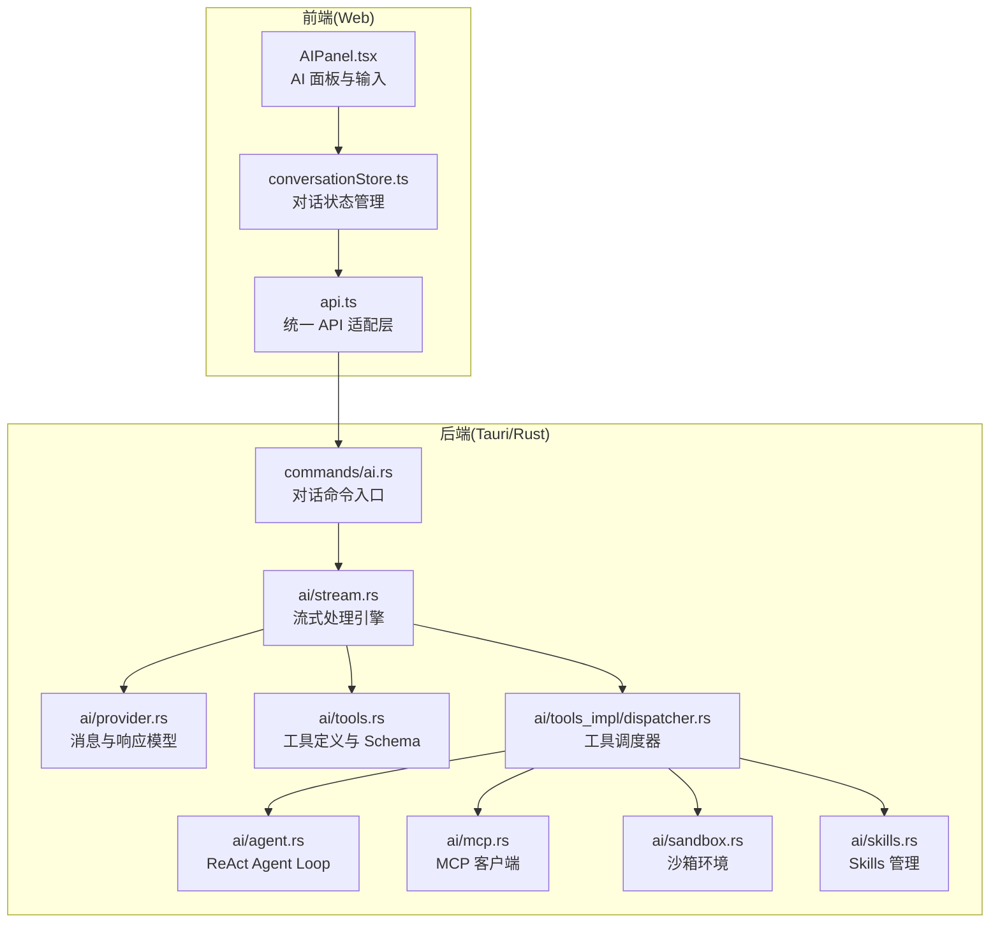
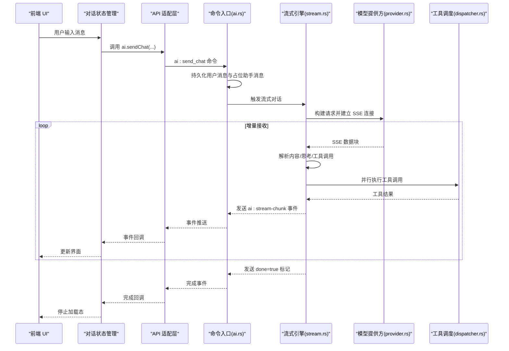
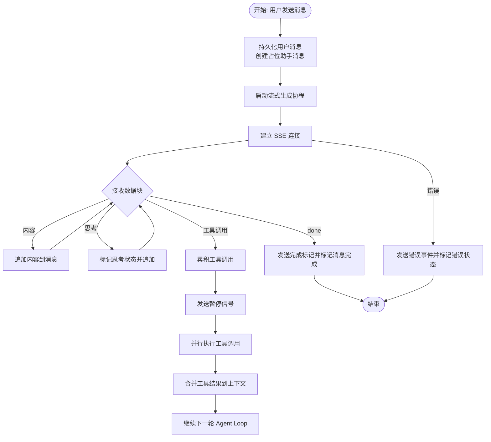
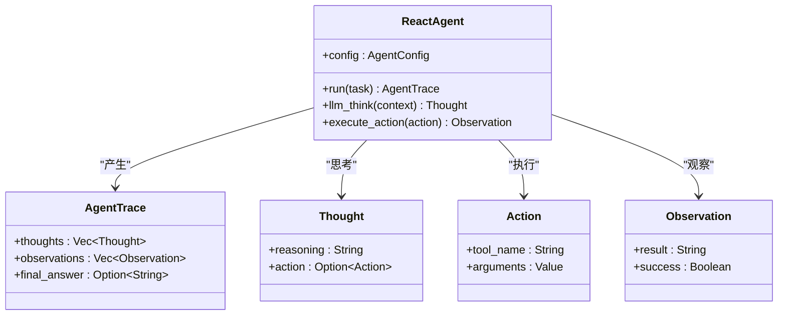
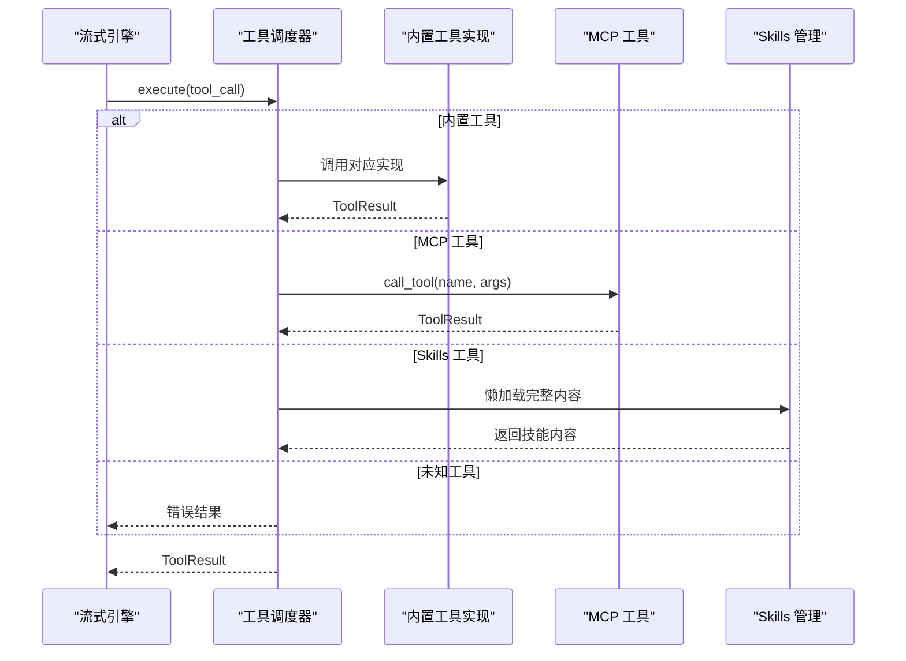
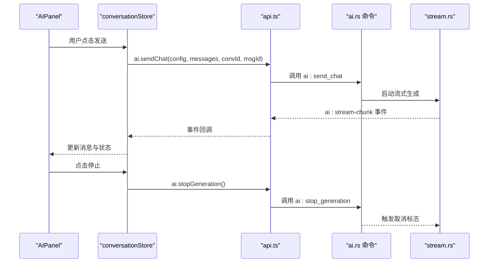
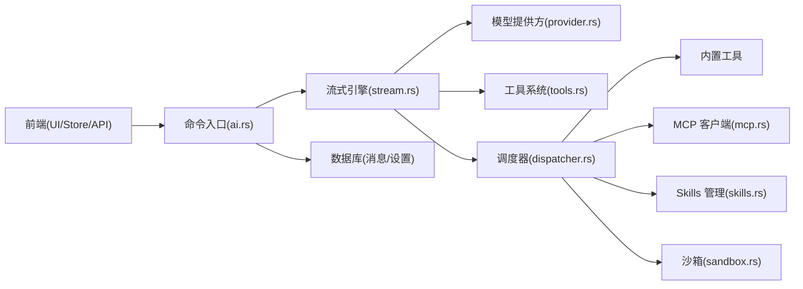

# AI 命令模块

<cite>
**本文档引用的文件**
- [ai.rs](file://src-tauri/src/commands/ai.rs)
- [ai_agent.rs](file://src-tauri/src/commands/ai_agent.rs)
- [stream.rs](file://src-tauri/src/ai/stream.rs)
- [provider.rs](file://src-tauri/src/ai/provider.rs)
- [tools.rs](file://src-tauri/src/ai/tools.rs)
- [agent.rs](file://src-tauri/src/ai/agent.rs)
- [mcp.rs](file://src-tauri/src/ai/mcp.rs)
- [sandbox.rs](file://src-tauri/src/ai/sandbox.rs)
- [skills.rs](file://src-tauri/src/ai/skills.rs)
- [tools_impl/mod.rs](file://src-tauri/src/ai/tools_impl/mod.rs)
- [tools_impl/dispatcher.rs](file://src-tauri/src/ai/tools_impl/dispatcher.rs)
- [api.ts](file://src-web/src/lib/api.ts)
- [conversationStore.ts](file://src-web/src/stores/conversationStore.ts)
- [AIPanel.tsx](file://src-web/src/components/layout/AIPanel.tsx)
</cite>

## 目录
1. [简介](#简介)
2. [项目结构](#项目结构)
3. [核心组件](#核心组件)
4. [架构总览](#架构总览)
5. [详细组件分析](#详细组件分析)
6. [依赖关系分析](#依赖关系分析)
7. [性能考虑](#性能考虑)
8. [故障排除指南](#故障排除指南)
9. [结论](#结论)

## 简介
本文件系统性梳理 CoSurf 的 AI 命令模块，重点覆盖：
- 对话生成命令与流式响应处理
- Agent Loop 控制与工具调用编排
- AI 命令与 AI 代理系统的交互机制（参数传递、响应格式、错误处理）
- 流式对话实现原理（SSE 事件推送、实时数据传输、客户端连接管理）
- 具体调用方式、参数配置与返回值处理示例
- 性能优化策略、并发控制与资源管理最佳实践

## 项目结构
AI 命令模块主要分布在 Tauri 后端与 Web 前端两部分：
- 后端（Rust）：命令入口、流式处理引擎、工具调度、Agent Loop、MCP/Skills 集成
- 前端（TypeScript/React）：统一 API 适配层、对话状态管理、UI 交互与事件监听

**图表来源**
- [api.ts:254-271](file://src-web/src/lib/api.ts#L254-L271)
- [conversationStore.ts:103-243](file://src-web/src/stores/conversationStore.ts#L103-L243)
- [AIPanel.tsx:32-156](file://src-web/src/components/layout/AIPanel.tsx#L32-L156)
- [ai.rs:16-274](file://src-tauri/src/commands/ai.rs#L16-L274)
- [stream.rs:77-283](file://src-tauri/src/ai/stream.rs#L77-L283)
- [provider.rs:6-135](file://src-tauri/src/ai/provider.rs#L6-L135)
- [tools.rs:1-621](file://src-tauri/src/ai/tools.rs#L1-L621)
- [tools_impl/dispatcher.rs:11-238](file://src-tauri/src/ai/tools_impl/dispatcher.rs#L11-L238)
- [agent.rs:55-139](file://src-tauri/src/ai/agent.rs#L55-L139)
- [mcp.rs:45-151](file://src-tauri/src/ai/mcp.rs#L45-L151)
- [sandbox.rs:48-251](file://src-tauri/src/ai/sandbox.rs#L48-L251)
- [skills.rs:84-576](file://src-tauri/src/ai/skills.rs#L84-L576)

**章节来源**
- [ai.rs:1-397](file://src-tauri/src/commands/ai.rs#L1-L397)
- [stream.rs:1-778](file://src-tauri/src/ai/stream.rs#L1-L778)
- [tools_impl/dispatcher.rs:1-238](file://src-tauri/src/ai/tools_impl/dispatcher.rs#L1-L238)
- [api.ts:254-271](file://src-web/src/lib/api.ts#L254-L271)
- [conversationStore.ts:103-364](file://src-web/src/stores/conversationStore.ts#L103-L364)

## 核心组件
- 命令入口与生命周期
  - 对话发送命令：负责消息持久化、构建上下文、触发流式生成、错误事件回传
  - 停止生成命令：通过共享取消标志中断 SSE 流
  - 流式片段追加与完成：支持增量写入与最终标记
  - 标题生成命令：基于非流式请求生成会话标题
- 流式处理引擎
  - 单轮流式对话：SSE 推送、增量内容与思考内容解析、工具调用聚合
  - Agent Loop：多轮工具调用、并行执行、重复调用检测与强制终止
- 工具系统
  - 内置工具：网页总结、页面操作、打开链接、翻译、导出、网络搜索、执行命令
  - 外部工具：MCP 工具、Skills 渐进式加载
  - 调度器：按名称路由到具体实现
- 代理系统
  - ReAct Agent Loop：思考-行动-观察循环，支持最大迭代次数与最终答案收敛
- 配置与集成
  - 模型配置：API Key、Base URL、温度、TopP、最大 Token
  - MCP 服务器：HTTP/Streamable HTTP/SSE/STDIO 多种传输模式
  - Skills：目录结构、Frontmatter 解析、懒加载完整内容

**章节来源**
- [ai.rs:10-396](file://src-tauri/src/commands/ai.rs#L10-L396)
- [stream.rs:77-602](file://src-tauri/src/ai/stream.rs#L77-L602)
- [tools.rs:19-225](file://src-tauri/src/ai/tools.rs#L19-L225)
- [tools_impl/dispatcher.rs:11-238](file://src-tauri/src/ai/tools_impl/dispatcher.rs#L11-L238)
- [agent.rs:55-139](file://src-tauri/src/ai/agent.rs#L55-L139)
- [mcp.rs:45-151](file://src-tauri/src/ai/mcp.rs#L45-L151)
- [skills.rs:84-576](file://src-tauri/src/ai/skills.rs#L84-L576)

## 架构总览
AI 命令模块采用“命令-引擎-调度-工具”的分层架构：
- 前端通过统一 API 适配层发起命令
- 后端命令入口负责参数校验、消息持久化与上下文构建
- 流式处理引擎负责与大模型服务建立 SSE 连接，解析增量数据
- Agent Loop 控制工具调用的决策与执行
- 调度器将工具调用路由到具体实现（内置工具、MCP、Skills）

**图表来源**
- [conversationStore.ts:172-243](file://src-web/src/stores/conversationStore.ts#L172-L243)
- [api.ts:254-271](file://src-web/src/lib/api.ts#L254-L271)
- [ai.rs:16-274](file://src-tauri/src/commands/ai.rs#L16-L274)
- [stream.rs:301-602](file://src-tauri/src/ai/stream.rs#L301-L602)
- [tools_impl/dispatcher.rs:11-238](file://src-tauri/src/ai/tools_impl/dispatcher.rs#L11-L238)

## 详细组件分析

### 对话生成命令与流式响应
- 命令入口职责
  - 校验活动模型配置，创建用户与助手消息，构建历史上下文
  - 触发流式生成协程，捕获 panic 与异常，统一发出错误事件
  - 返回初始空片段以启动前端监听
- 流式处理流程
  - 单轮对话：建立 SSE 连接，逐块解析内容与思考，累积工具调用
  - Agent Loop：若检测到工具调用，停止当前轮次，进入工具执行阶段
  - 工具执行：并行执行多个工具调用，聚合结果后继续下一轮
  - 取消与错误：支持用户取消、网络错误、解析错误的事件回传与状态标记
- 前端交互
  - 监听 ai:stream-chunk 与 ai:stream-error 事件，增量更新消息
  - 支持停止生成按钮，调用 ai:stop_generation 命令

**图表来源**
- [ai.rs:16-274](file://src-tauri/src/commands/ai.rs#L16-L274)
- [stream.rs:301-602](file://src-tauri/src/ai/stream.rs#L301-L602)

**章节来源**
- [ai.rs:16-274](file://src-tauri/src/commands/ai.rs#L16-L274)
- [stream.rs:77-283](file://src-tauri/src/ai/stream.rs#L77-L283)
- [conversationStore.ts:172-243](file://src-web/src/stores/conversationStore.ts#L172-L243)

### Agent Loop 控制与工具调用
- Agent Loop 设计
  - 基于 ReAct 思考-行动-观察循环，支持最大迭代次数
  - 模型可自主决定是否调用工具；若无工具调用则直接输出最终答案
- 工具调用编排
  - 工具调用去重与重复检测：计算工具签名，连续重复时注入强制终止提示
  - 并行执行：工具调用结果聚合后合并到上下文
  - 最大迭代保护：防止无限循环
- 工具类型与来源
  - 内置工具：网页相关、系统命令等
  - MCP 工具：动态发现与注册，支持多种传输模式
  - Skills 工具：渐进式加载，仅暴露描述，调用后再懒加载完整内容

**图表来源**
- [agent.rs:55-139](file://src-tauri/src/ai/agent.rs#L55-L139)

**章节来源**
- [stream.rs:94-283](file://src-tauri/src/ai/stream.rs#L94-L283)
- [tools.rs:19-225](file://src-tauri/src/ai/tools.rs#L19-L225)
- [tools_impl/dispatcher.rs:11-238](file://src-tauri/src/ai/tools_impl/dispatcher.rs#L11-L238)
- [mcp.rs:45-151](file://src-tauri/src/ai/mcp.rs#L45-L151)
- [skills.rs:84-576](file://src-tauri/src/ai/skills.rs#L84-L576)

### 工具系统与调度
- 工具定义
  - ToolCall：工具调用标识、名称、参数
  - ToolResult：工具执行结果（输出与成功标志）
  - 内置工具 Schema：统一的 OpenAI function calling 格式
- 调度策略
  - 内置工具：open_url、web_search、summarize_page、web_agent、run_command 等
  - MCP 工具：从服务器动态拉取工具列表并注册
  - Skills 工具：仅暴露描述，调用后懒加载完整内容
- 执行路径
  - 根据工具名称路由到对应实现模块
  - 错误时返回假结果并继续 Agent Loop

**图表来源**
- [tools_impl/dispatcher.rs:11-238](file://src-tauri/src/ai/tools_impl/dispatcher.rs#L11-L238)
- [tools.rs:1-621](file://src-tauri/src/ai/tools.rs#L1-L621)
- [mcp.rs:116-151](file://src-tauri/src/ai/mcp.rs#L116-L151)
- [skills.rs:261-272](file://src-tauri/src/ai/skills.rs#L261-L272)

**章节来源**
- [tools.rs:1-621](file://src-tauri/src/ai/tools.rs#L1-L621)
- [tools_impl/dispatcher.rs:11-238](file://src-tauri/src/ai/tools_impl/dispatcher.rs#L11-L238)

### 前端交互与事件驱动
- API 适配层
  - 统一封装 invoke 调用，提供 ai.sendChat、ai.stopGeneration、ai.generateTitle 等方法
- 状态管理
  - conversationStore：管理会话列表、消息、流式状态、标题自动生成
  - 监听 ai:stream-chunk 与 ai:stream-error 事件，增量更新消息并处理错误
- UI 组件
  - AIPanel：AI 面板、模型选择、消息列表、输入框与发送/停止按钮
  - Markdown 渲染、反馈（点赞/点踩）、复制等功能

**图表来源**
- [AIPanel.tsx:58-156](file://src-web/src/components/layout/AIPanel.tsx#L58-L156)
- [conversationStore.ts:103-243](file://src-web/src/stores/conversationStore.ts#L103-L243)
- [api.ts:254-271](file://src-web/src/lib/api.ts#L254-L271)
- [ai.rs:10-14](file://src-tauri/src/commands/ai.rs#L10-L14)

**章节来源**
- [api.ts:254-271](file://src-web/src/lib/api.ts#L254-L271)
- [conversationStore.ts:103-364](file://src-web/src/stores/conversationStore.ts#L103-L364)
- [AIPanel.tsx:32-647](file://src-web/src/components/layout/AIPanel.tsx#L32-L647)

## 依赖关系分析
- 模块耦合
  - 命令入口依赖流式引擎与数据库；流式引擎依赖模型提供方、工具系统与调度器
  - 调度器依赖内置工具、MCP 客户端与 Skills 管理器
  - 前端通过 API 适配层与命令入口解耦，事件驱动更新 UI
- 外部依赖
  - 模型提供方：支持多种提供商，统一请求构建与响应解析
  - MCP 服务器：支持 HTTP/Streamable HTTP/SSE/STDIO 传输
  - Skills 目录：基于文件系统，Frontmatter 解析与懒加载

**图表来源**
- [ai.rs:1-397](file://src-tauri/src/commands/ai.rs#L1-L397)
- [stream.rs:1-778](file://src-tauri/src/ai/stream.rs#L1-L778)
- [tools_impl/dispatcher.rs:1-238](file://src-tauri/src/ai/tools_impl/dispatcher.rs#L1-L238)
- [mcp.rs:1-151](file://src-tauri/src/ai/mcp.rs#L1-L151)
- [skills.rs:1-576](file://src-tauri/src/ai/skills.rs#L1-L576)
- [sandbox.rs:1-251](file://src-tauri/src/ai/sandbox.rs#L1-L251)

**章节来源**
- [ai.rs:1-397](file://src-tauri/src/commands/ai.rs#L1-L397)
- [stream.rs:1-778](file://src-tauri/src/ai/stream.rs#L1-L778)
- [tools_impl/dispatcher.rs:1-238](file://src-tauri/src/ai/tools_impl/dispatcher.rs#L1-L238)

## 性能考虑
- 流式传输优化
  - SSE 增量推送，前端即时渲染，降低延迟
  - 工具调用并行执行，缩短整体响应时间
- 资源管理
  - 取消标志原子操作，避免阻塞与资源泄漏
  - 工具执行结果聚合后及时清理中间状态
- 并发控制
  - 工具调用使用 join_all 并行执行，合理设置最大并发
  - Agent Loop 设置最大迭代次数，防止无限循环
- 存储与缓存
  - 消息增量写入数据库，减少一次性写入压力
  - Skills 懒加载，仅在需要时读取完整内容

[本节为通用指导，无需特定文件引用]

## 故障排除指南
- 常见错误与处理
  - 模型配置缺失：命令入口返回 NO_MODEL 错误码，需在设置中配置活动模型
  - 网络错误：SSE 连接失败时发送 ai:stream-error 事件，包含错误提示与配置建议
  - 工具调用失败：返回假结果并继续 Agent Loop，避免中断对话
  - 取消生成：用户点击停止后，流式引擎发送完成标记并标记消息完成
- 前端诊断
  - 监听 ai:stream-error 事件，显示错误信息并提示检查 API Key、Base URL、网络
  - 检查 ai:stream-chunk 事件是否持续到达，判断 SSE 连接状态
- 后端日志
  - 详细的请求与响应日志，便于定位问题
  - 工具调用与 Agent Loop 的迭代日志，便于分析执行路径

**章节来源**
- [ai.rs:231-264](file://src-tauri/src/commands/ai.rs#L231-L264)
- [stream.rs:547-568](file://src-tauri/src/ai/stream.rs#L547-L568)
- [conversationStore.ts:199-209](file://src-web/src/stores/conversationStore.ts#L199-L209)

## 结论
CoSurf 的 AI 命令模块通过清晰的分层设计与事件驱动机制，实现了从对话生成到工具调用的完整闭环。命令入口负责生命周期管理，流式引擎提供低延迟的增量体验，Agent Loop 保障工具调用的可控与高效，调度器与工具系统支撑多样化的外部能力集成。前端通过统一 API 适配层与事件监听，提供了流畅的用户体验。配合完善的错误处理与性能优化策略，模块具备良好的稳定性与可扩展性。