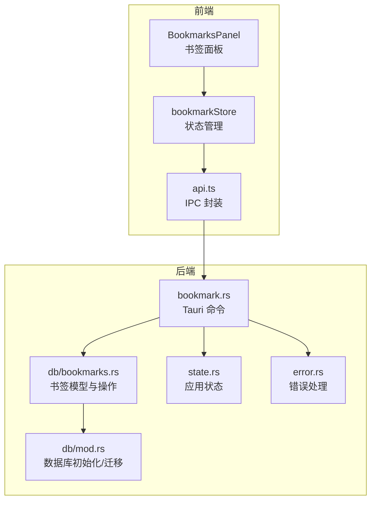
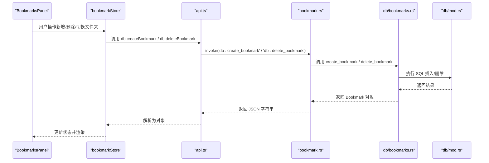
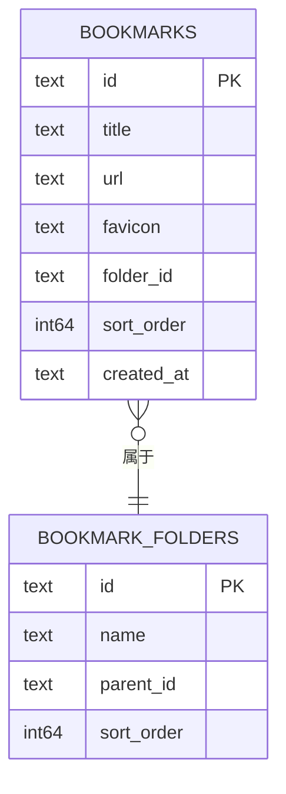
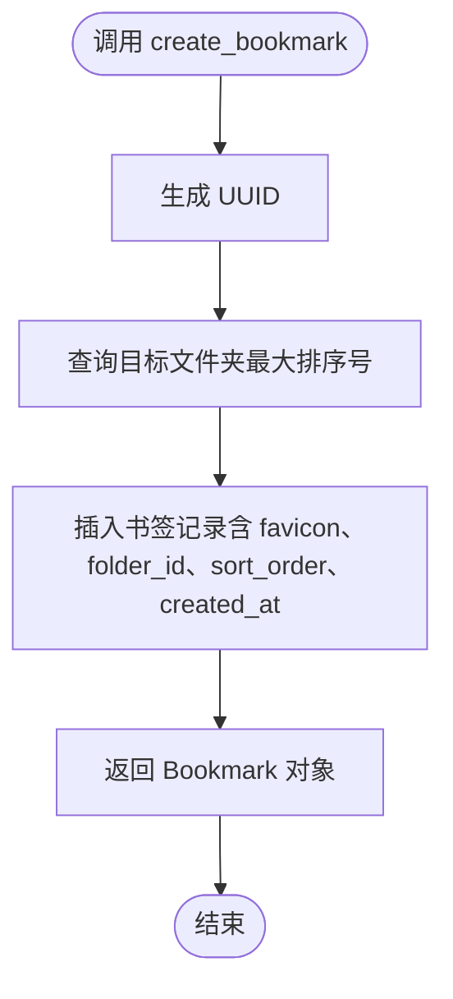
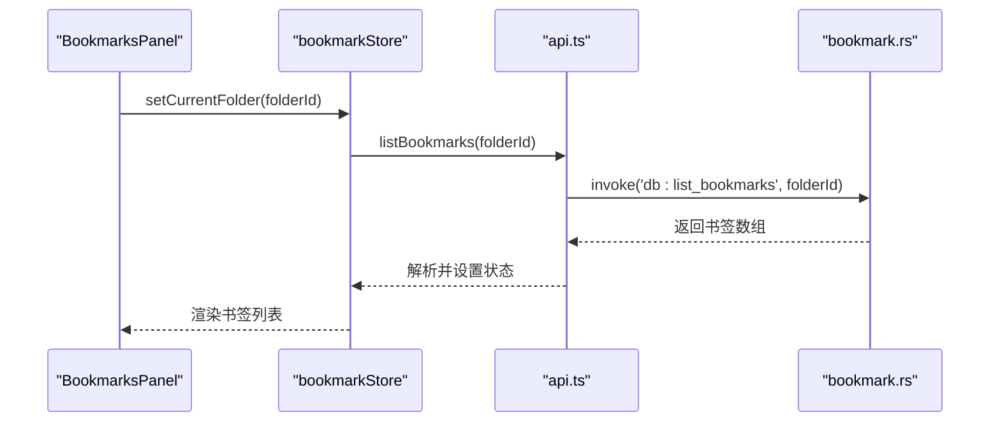
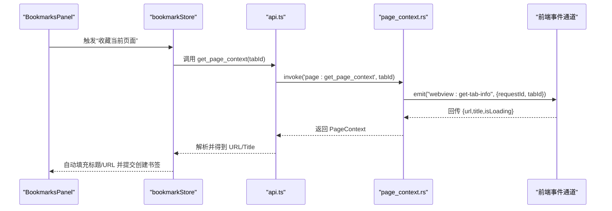
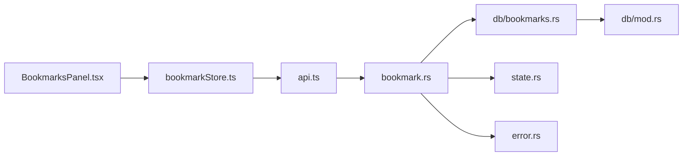

# 书签命令模块

<cite>
**本文引用的文件**
- [bookmark.rs](file://src-tauri/src/commands/bookmark.rs)
- [bookmarks.rs](file://src-tauri/src/db/bookmarks.rs)
- [mod.rs](file://src-tauri/src/db/mod.rs)
- [bookmarkStore.ts](file://src-web/src/stores/bookmarkStore.ts)
- [BookmarksPanel.tsx](file://src-web/src/components/sidebar/BookmarksPanel.tsx)
- [api.ts](file://src-web/src/lib/api.ts)
- [page_context.rs](file://src-tauri/src/commands/page_context.rs)
- [error.rs](file://src-tauri/src/error.rs)
- [state.rs](file://src-tauri/src/state.rs)
- [bookmark.ts](file://packages/shared/src/bookmark.ts)
</cite>

## 目录
1. [简介](#简介)
2. [项目结构](#项目结构)
3. [核心组件](#核心组件)
4. [架构总览](#架构总览)
5. [详细组件分析](#详细组件分析)
6. [依赖关系分析](#依赖关系分析)
7. [性能考虑](#性能考虑)
8. [故障排除指南](#故障排除指南)
9. [结论](#结论)
10. [附录](#附录)

## 简介
本文件为 CoSurf 书签命令模块的详细技术文档，聚焦于书签管理命令的实现与数据模型设计，涵盖书签的创建、查询、删除等核心操作；阐述书签与浏览器上下文的集成方式（页面信息提取、自动标签生成、重复检测机制）；并提供具体代码示例路径以展示 CRUD 操作、搜索过滤、批量管理的实现思路。同时包含书签同步策略、数据导出格式以及隐私保护措施的说明。

## 项目结构
书签模块横跨前端 React Store、IPC API 层与后端 Tauri 命令与数据库层，形成完整的数据流闭环：
- 前端 Store 负责状态管理与 UI 交互
- API 层封装 IPC 调用，统一返回值解析
- Tauri 命令层承接前端请求，调用数据库层
- 数据库层负责持久化与查询

图表来源
- [bookmark.rs:1-75](file://src-tauri/src/commands/bookmark.rs#L1-L75)
- [bookmarks.rs:1-185](file://src-tauri/src/db/bookmarks.rs#L1-L185)
- [mod.rs:1-272](file://src-tauri/src/db/mod.rs#L1-L272)
- [bookmarkStore.ts:1-138](file://src-web/src/stores/bookmarkStore.ts#L1-L138)
- [BookmarksPanel.tsx:1-289](file://src-web/src/components/sidebar/BookmarksPanel.tsx#L1-L289)
- [api.ts:1-445](file://src-web/src/lib/api.ts#L1-L445)
- [state.rs:1-81](file://src-tauri/src/state.rs#L1-L81)
- [error.rs:1-64](file://src-tauri/src/error.rs#L1-L64)

章节来源
- [bookmark.rs:1-75](file://src-tauri/src/commands/bookmark.rs#L1-L75)
- [bookmarks.rs:1-185](file://src-tauri/src/db/bookmarks.rs#L1-L185)
- [mod.rs:1-272](file://src-tauri/src/db/mod.rs#L1-L272)
- [bookmarkStore.ts:1-138](file://src-web/src/stores/bookmarkStore.ts#L1-L138)
- [BookmarksPanel.tsx:1-289](file://src-web/src/components/sidebar/BookmarksPanel.tsx#L1-L289)
- [api.ts:1-445](file://src-web/src/lib/api.ts#L1-L445)
- [state.rs:1-81](file://src-tauri/src/state.rs#L1-L81)
- [error.rs:1-64](file://src-tauri/src/error.rs#L1-L64)

## 核心组件
- Tauri 书签命令：提供 list_bookmarks、create_bookmark、delete_bookmark、list_bookmark_folders、create_bookmark_folder、delete_bookmark_folder 等命令接口
- 数据库层：定义 Bookmark、BookmarkFolder 结构体与 CRUD 操作，支持按文件夹分组排序
- 前端 Store：封装 IPC 调用，维护书签列表、文件夹树、当前文件夹、搜索条件等状态
- 页面上下文集成：通过 page_context 命令获取页面 URL、标题、域名、安全状态与内容摘要，辅助书签创建与自动标签生成
- 错误处理：统一的 AppError 与 ErrorResponse 映射，便于前端捕获与展示

章节来源
- [bookmark.rs:1-75](file://src-tauri/src/commands/bookmark.rs#L1-L75)
- [bookmarks.rs:1-185](file://src-tauri/src/db/bookmarks.rs#L1-L185)
- [bookmarkStore.ts:1-138](file://src-web/src/stores/bookmarkStore.ts#L1-L138)
- [page_context.rs:1-327](file://src-tauri/src/commands/page_context.rs#L1-L327)
- [error.rs:1-64](file://src-tauri/src/error.rs#L1-L64)

## 架构总览
书签命令模块采用“前端 Store -> IPC -> Tauri 命令 -> 数据库”的标准架构，数据模型在 Rust 与 TS 之间保持一致命名风格（驼峰），通过 IPC 层进行序列化/反序列化。

图表来源
- [BookmarksPanel.tsx:1-289](file://src-web/src/components/sidebar/BookmarksPanel.tsx#L1-L289)
- [bookmarkStore.ts:1-138](file://src-web/src/stores/bookmarkStore.ts#L1-L138)
- [api.ts:100-116](file://src-web/src/lib/api.ts#L100-L116)
- [bookmark.rs:1-75](file://src-tauri/src/commands/bookmark.rs#L1-L75)
- [bookmarks.rs:84-117](file://src-tauri/src/db/bookmarks.rs#L84-L117)
- [mod.rs:69-98](file://src-tauri/src/db/mod.rs#L69-L98)

## 详细组件分析

### 数据模型设计
- 书签实体（Rust/TS 一致）：包含 id、title、url、favicon（可选）、folderId（可选）、sort_order（排序）、created_at（创建时间）
- 文件夹实体：包含 id、name、parent_id（可选）、sort_order（排序）
- 共享接口：packages/shared/src/bookmark.ts 定义了前端使用的接口类型，便于跨包复用

图表来源
- [bookmarks.rs:7-29](file://src-tauri/src/db/bookmarks.rs#L7-L29)
- [mod.rs:69-84](file://src-tauri/src/db/mod.rs#L69-L84)
- [bookmark.ts:1-17](file://packages/shared/src/bookmark.ts#L1-L17)

章节来源
- [bookmarks.rs:7-29](file://src-tauri/src/db/bookmarks.rs#L7-L29)
- [mod.rs:69-84](file://src-tauri/src/db/mod.rs#L69-L84)
- [bookmark.ts:1-17](file://packages/shared/src/bookmark.ts#L1-L17)

### 书签 CRUD 命令实现
- 查询书签：支持按文件夹筛选，按 sort_order 升序排列
- 创建书签：自动生成 UUID、设置创建时间、在目标文件夹末尾追加排序
- 删除书签：根据 id 删除，未命中返回 Not Found 错误
- 文件夹管理：列出、创建、删除文件夹，删除文件夹会级联清理该文件夹下所有书签

图表来源
- [bookmark.rs:20-30](file://src-tauri/src/commands/bookmark.rs#L20-L30)
- [bookmarks.rs:84-109](file://src-tauri/src/db/bookmarks.rs#L84-L109)

章节来源
- [bookmark.rs:1-75](file://src-tauri/src/commands/bookmark.rs#L1-L75)
- [bookmarks.rs:47-117](file://src-tauri/src/db/bookmarks.rs#L47-L117)

### 前端状态与 UI 集成
- Store 负责：
  - 加载书签与文件夹、切换当前文件夹、搜索过滤
  - 新增/删除书签、新增/删除文件夹
  - 检测重复（按 URL 判断是否已收藏）
- Panel 负责：
  - 面包屑导航、新建文件夹、搜索输入、书签列表渲染
  - 右侧悬停操作（打开、删除）

图表来源
- [BookmarksPanel.tsx:41-76](file://src-web/src/components/sidebar/BookmarksPanel.tsx#L41-L76)
- [bookmarkStore.ts:48-76](file://src-web/src/stores/bookmarkStore.ts#L48-L76)
- [api.ts:100-101](file://src-web/src/lib/api.ts#L100-L101)
- [bookmark.rs:8-18](file://src-tauri/src/commands/bookmark.rs#L8-L18)

章节来源
- [bookmarkStore.ts:1-138](file://src-web/src/stores/bookmarkStore.ts#L1-L138)
- [BookmarksPanel.tsx:1-289](file://src-web/src/components/sidebar/BookmarksPanel.tsx#L1-L289)
- [api.ts:100-116](file://src-web/src/lib/api.ts#L100-L116)

### 浏览器上下文集成与自动标签生成
- 页面上下文命令：
  - get_page_context：从前端事件通道获取标签页 URL、标题、加载状态，解析域名与安全标志，生成内容摘要
  - inject_page_context：构建系统提示词，向 AI 注入页面上下文
  - summarize_page：提取页面文本并截断，供 AI 总结
- 与书签的关系：
  - 可用于“收藏当前页面”时自动填充标题与 URL
  - 可结合域名生成初始文件夹（如按域名首字母或主域名分类）
  - 可利用最近打开 URL 缓存避免重复创建

图表来源
- [page_context.rs:21-107](file://src-tauri/src/commands/page_context.rs#L21-L107)
- [BookmarksPanel.tsx:69-74](file://src-web/src/components/sidebar/BookmarksPanel.tsx#L69-L74)
- [bookmarkStore.ts:78-88](file://src-web/src/stores/bookmarkStore.ts#L78-L88)

章节来源
- [page_context.rs:1-327](file://src-tauri/src/commands/page_context.rs#L1-L327)
- [state.rs:14-22](file://src-tauri/src/state.rs#L14-L22)

### 重复检测机制
- 前端层面：通过 isBookmarked(url) 检查 URL 是否已存在
- 后端层面：可在 create_bookmark 前增加去重逻辑（建议在业务层实现，避免重复插入）
- 应用状态层面：recent_opened_urls 缓存用于去重（可用于其他场景）

章节来源
- [bookmarkStore.ts:127-129](file://src-web/src/stores/bookmarkStore.ts#L127-L129)
- [state.rs:18-19](file://src-tauri/src/state.rs#L18-L19)

### 搜索过滤与批量管理
- 搜索过滤：BookmarksPanel 内部对 title/url 进行大小写不敏感过滤
- 批量管理：当前实现以单条为主，批量操作可通过 Store 封装循环调用或扩展后端命令（例如批量删除）

章节来源
- [BookmarksPanel.tsx:62-68](file://src-web/src/components/sidebar/BookmarksPanel.tsx#L62-L68)
- [bookmarkStore.ts:101-125](file://src-web/src/stores/bookmarkStore.ts#L101-L125)

### 书签同步策略、数据导出格式与隐私保护
- 同步策略：当前模块未实现跨设备同步；可扩展为：
  - 本地 JSON 导出/导入：将 bookmarks 与 bookmark_folders 导出为结构化 JSON，包含 id、title、url、favicon、folderId、order、createdAt 等字段
  - 云端备份：通过外部服务或本地网络共享实现增量同步
- 数据导出格式：建议导出字段与数据库一致，便于导入还原
- 隐私保护：
  - 仅存储必要元数据（URL、标题、图标、创建时间），不存储页面内容
  - 支持删除书签时清理关联资源（如 favicon 缓存）
  - 可提供“清空历史/书签”的一键操作（在 UI 中暴露）

[本节为概念性说明，不直接分析具体文件]

## 依赖关系分析
- 前端依赖关系：
  - BookmarksPanel 依赖 bookmarkStore
  - bookmarkStore 依赖 api.ts 与数据库命令
- 后端依赖关系：
  - bookmark.rs 依赖 db/bookmarks.rs 与 state.rs
  - db/bookmarks.rs 依赖 db/mod.rs（SQLite 表结构与迁移）
  - 错误处理由 error.rs 提供统一映射

图表来源
- [BookmarksPanel.tsx:1-289](file://src-web/src/components/sidebar/BookmarksPanel.tsx#L1-L289)
- [bookmarkStore.ts:1-138](file://src-web/src/stores/bookmarkStore.ts#L1-L138)
- [api.ts:1-445](file://src-web/src/lib/api.ts#L1-L445)
- [bookmark.rs:1-75](file://src-tauri/src/commands/bookmark.rs#L1-L75)
- [bookmarks.rs:1-185](file://src-tauri/src/db/bookmarks.rs#L1-L185)
- [mod.rs:1-272](file://src-tauri/src/db/mod.rs#L1-L272)
- [state.rs:1-81](file://src-tauri/src/state.rs#L1-L81)
- [error.rs:1-64](file://src-tauri/src/error.rs#L1-L64)

章节来源
- [bookmark.rs:1-75](file://src-tauri/src/commands/bookmark.rs#L1-L75)
- [bookmarks.rs:1-185](file://src-tauri/src/db/bookmarks.rs#L1-L185)
- [mod.rs:1-272](file://src-tauri/src/db/mod.rs#L1-L272)
- [bookmarkStore.ts:1-138](file://src-web/src/stores/bookmarkStore.ts#L1-L138)
- [BookmarksPanel.tsx:1-289](file://src-web/src/components/sidebar/BookmarksPanel.tsx#L1-L289)
- [api.ts:1-445](file://src-web/src/lib/api.ts#L1-L445)
- [state.rs:1-81](file://src-tauri/src/state.rs#L1-L81)
- [error.rs:1-64](file://src-tauri/src/error.rs#L1-L64)

## 性能考虑
- 查询排序：按 sort_order 升序，避免全表扫描；建议在 folder_id 上建立索引（已在迁移中创建）
- 插入顺序：每次在目标文件夹末尾追加，复杂度 O(1) 获取最大排序号，O(1) 插入
- 前端渲染：搜索过滤在内存中进行，建议对大列表启用虚拟滚动
- IPC 解析：api.ts 对 N-API 返回的 JSON 字符串进行统一解析，减少前端样板代码

[本节提供一般性指导，不直接分析具体文件]

## 故障排除指南
- 常见错误码映射：
  - DATABASE_ERROR：数据库异常（如约束冲突、锁竞争）
  - NOT_FOUND：删除/更新时目标不存在
  - INTERNAL_ERROR：内部流程异常（如前端事件未返回）
- 前端排查：
  - Store 中捕获错误并记录日志
  - UI 层显示友好提示（如“删除失败”）
- 后端排查：
  - 检查数据库迁移是否成功
  - 确认命令锁状态（Mutex）未被死锁占用

章节来源
- [error.rs:47-61](file://src-tauri/src/error.rs#L47-L61)
- [bookmarkStore.ts:54-98](file://src-web/src/stores/bookmarkStore.ts#L54-L98)
- [bookmark.rs:12-17](file://src-tauri/src/commands/bookmark.rs#L12-L17)

## 结论
书签命令模块通过清晰的前后端分层与统一的数据模型，实现了稳定的 CRUD 能力，并与页面上下文集成，为用户提供了便捷的书签管理体验。未来可进一步增强批量操作、自动标签生成、跨设备同步与隐私保护能力，以满足更复杂的使用场景。

[本节为总结性内容，不直接分析具体文件]

## 附录

### 代码示例路径（不含具体代码内容）
- 书签创建（前端）：[bookmarkStore.ts:78-88](file://src-web/src/stores/bookmarkStore.ts#L78-L88)
- 书签删除（前端）：[bookmarkStore.ts:90-99](file://src-web/src/stores/bookmarkStore.ts#L90-L99)
- 书签查询（前端）：[bookmarkStore.ts:48-58](file://src-web/src/stores/bookmarkStore.ts#L48-L58)
- 书签创建（后端命令）：[bookmark.rs:20-30](file://src-tauri/src/commands/bookmark.rs#L20-L30)
- 书签删除（后端命令）：[bookmark.rs:32-39](file://src-tauri/src/commands/bookmark.rs#L32-L39)
- 书签查询（后端命令）：[bookmark.rs:8-18](file://src-tauri/src/commands/bookmark.rs#L8-L18)
- 书签模型与插入（数据库层）：[bookmarks.rs:84-109](file://src-tauri/src/db/bookmarks.rs#L84-L109)
- 数据库迁移与表结构（数据库层）：[mod.rs:69-98](file://src-tauri/src/db/mod.rs#L69-L98)
- IPC 封装（前端）：[api.ts:100-116](file://src-web/src/lib/api.ts#L100-L116)
- 页面上下文获取（后端）：[page_context.rs:21-107](file://src-tauri/src/commands/page_context.rs#L21-L107)
- 应用状态与去重缓存（后端）：[state.rs:14-19](file://src-tauri/src/state.rs#L14-L19)