# 命令系统

<cite>
**本文引用的文件**
- [src-tauri/src/lib.rs](file://src-tauri/src/lib.rs)
- [src-tauri/src/main.rs](file://src-tauri/src/main.rs)
- [src-tauri/src/state.rs](file://src-tauri/src/state.rs)
- [src-tauri/src/error.rs](file://src-tauri/src/error.rs)
- [src-tauri/tauri.conf.json](file://src-tauri/tauri.conf.json)
- [src-tauri/src/commands/mod.rs](file://src-tauri/src/commands/mod.rs)
- [src-tauri/src/commands/conversation.rs](file://src-tauri/src/commands/conversation.rs)
- [src-tauri/src/commands/message.rs](file://src-tauri/src/commands/message.rs)
- [src-tauri/src/commands/bookmark.rs](file://src-tauri/src/commands/bookmark.rs)
- [src-tauri/src/commands/settings.rs](file://src-tauri/src/commands/settings.rs)
- [src-tauri/src/commands/skills.rs](file://src-tauri/src/commands/skills.rs)
- [src-tauri/src/commands/browser_nav.rs](file://src-tauri/src/commands/browser_nav.rs)
- [src-tauri/src/commands/screenshot.rs](file://src-tauri/src/commands/screenshot.rs)
- [src-tauri/src/commands/ai.rs](file://src-tauri/src/commands/ai.rs)
- [src-tauri/src/commands/page_context.rs](file://src-tauri/src/commands/page_context.rs)
</cite>

## 目录
1. [简介](#简介)
2. [项目结构](#项目结构)
3. [核心组件](#核心组件)
4. [架构总览](#架构总览)
5. [详细组件分析](#详细组件分析)
6. [依赖关系分析](#依赖关系分析)
7. [性能考量](#性能考量)
8. [故障排查指南](#故障排查指南)
9. [结论](#结论)
10. [附录](#附录)

## 简介
本文件面向 CoSurf 的 Tauri 命令系统，系统性阐述命令处理器的架构设计与实现要点，覆盖命令注册机制、参数校验、返回值处理、异步执行模式、错误传播与事件通知。文档按模块划分，逐项说明对话、消息、书签、设置、Skills、浏览器导航、截图、AI 与页面上下文等命令的职责边界与协作关系，并给出最佳实践、性能优化与安全建议。

## 项目结构
CoSurf 的命令系统位于 Tauri 后端（Rust），通过统一入口集中注册，前端通过 Tauri 的 invoke 通道调用。核心入口与状态管理如下：
- 应用入口与命令注册：[src-tauri/src/lib.rs](file://src-tauri/src/lib.rs)
- 主程序入口：[src-tauri/src/main.rs](file://src-tauri/src/main.rs)
- 全局状态与共享资源：[src-tauri/src/state.rs](file://src-tauri/src/state.rs)
- 错误类型与统一错误响应：[src-tauri/src/error.rs](file://src-tauri/src/error.rs)
- 应用配置（含 CSP、插件等）：[src-tauri/tauri.conf.json](file://src-tauri/tauri.conf.json)

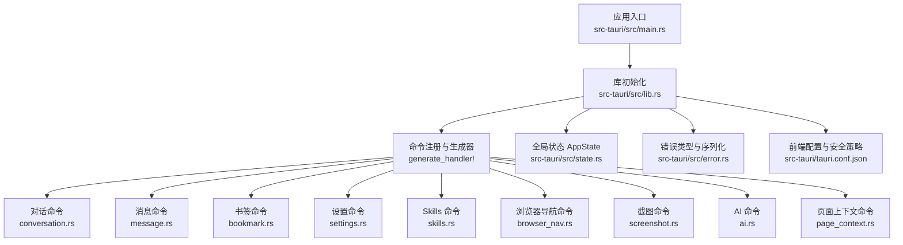

图表来源
- [src-tauri/src/lib.rs:108-214](file://src-tauri/src/lib.rs#L108-L214)
- [src-tauri/src/state.rs:9-77](file://src-tauri/src/state.rs#L9-L77)
- [src-tauri/src/error.rs:4-64](file://src-tauri/src/error.rs#L4-L64)
- [src-tauri/tauri.conf.json:1-72](file://src-tauri/tauri.conf.json#L1-L72)

章节来源
- [src-tauri/src/lib.rs:108-214](file://src-tauri/src/lib.rs#L108-L214)
- [src-tauri/src/main.rs:1-6](file://src-tauri/src/main.rs#L1-L6)
- [src-tauri/src/state.rs:9-77](file://src-tauri/src/state.rs#L9-L77)
- [src-tauri/src/error.rs:4-64](file://src-tauri/src/error.rs#L4-L64)
- [src-tauri/tauri.conf.json:1-72](file://src-tauri/tauri.conf.json#L1-L72)

## 核心组件
- 命令注册与生成器
  - 通过 generate_handler! 将各模块命令一次性注册到 Tauri，便于集中维护与扩展。
  - 参考：[src-tauri/src/lib.rs:108-214](file://src-tauri/src/lib.rs#L108-L214)
- 全局状态 AppState
  - 统一持有数据库句柄、应用数据目录、取消标志、活动标签页 ID、页面内容响应缓存、Skills 管理器、最近打开 URL 去重、MCP 工具注册表等。
  - 参考：[src-tauri/src/state.rs:9-77](file://src-tauri/src/state.rs#L9-L77)
- 错误体系
  - 使用 AppError 与 ErrorResponse，统一序列化为字符串或结构化对象，便于前端识别与展示。
  - 参考：[src-tauri/src/error.rs:4-64](file://src-tauri/src/error.rs#L4-L64)
- 前端安全与配置
  - CSP、插件、打包与签名等配置，保障命令通道与资源访问的安全边界。
  - 参考：[src-tauri/tauri.conf.json:29-70](file://src-tauri/tauri.conf.json#L29-L70)

章节来源
- [src-tauri/src/lib.rs:108-214](file://src-tauri/src/lib.rs#L108-L214)
- [src-tauri/src/state.rs:9-77](file://src-tauri/src/state.rs#L9-L77)
- [src-tauri/src/error.rs:4-64](file://src-tauri/src/error.rs#L4-L64)
- [src-tauri/tauri.conf.json:29-70](file://src-tauri/tauri.conf.json#L29-L70)

## 架构总览
命令系统采用“命令模块 + 全局状态 + 数据库 + 事件通知”的分层架构：
- 命令模块：按功能域拆分（对话、消息、书签、设置、Skills、浏览器、截图、AI、页面上下文）。
- 全局状态：提供线程安全的共享资源与标志位，支撑并发与跨模块协作。
- 数据库：持久化对话、消息、书签、设置、历史等数据。
- 事件通知：通过 Emitter 向前端推送状态变更与流式结果。

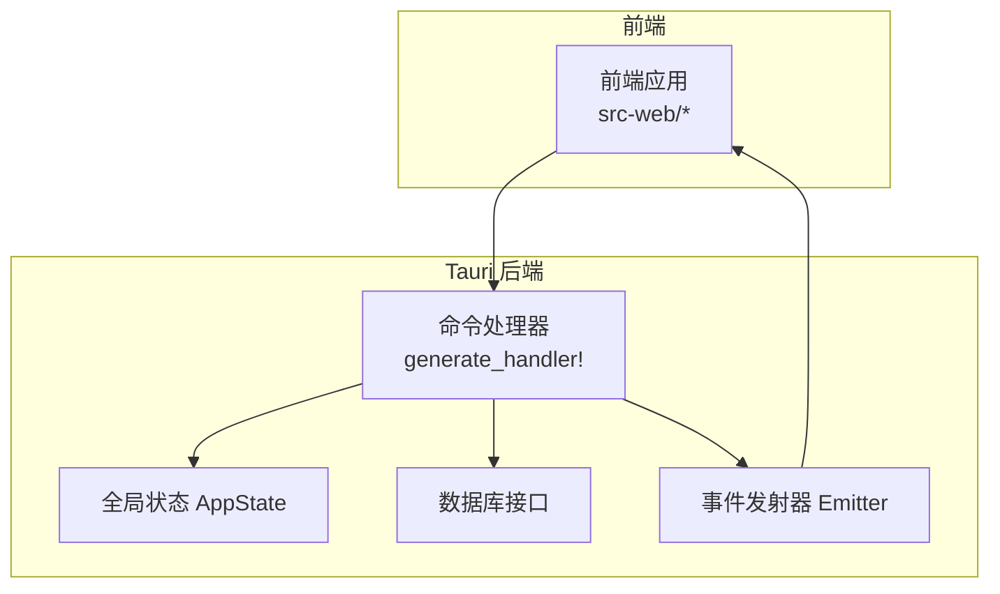

图表来源
- [src-tauri/src/lib.rs:108-214](file://src-tauri/src/lib.rs#L108-L214)
- [src-tauri/src/state.rs:9-77](file://src-tauri/src/state.rs#L9-L77)

章节来源
- [src-tauri/src/lib.rs:108-214](file://src-tauri/src/lib.rs#L108-L214)
- [src-tauri/src/state.rs:9-77](file://src-tauri/src/state.rs#L9-L77)

## 详细组件分析

### 命令注册机制与控制流
- 注册方式：在 lib.rs 中通过 generate_handler! 将各模块命令一次性注册，避免分散维护带来的遗漏。
- 控制流：前端发起 invoke，Tauri 路由至对应命令函数；命令函数读取 AppState、访问数据库、必要时通过 Emitter 发送事件；最终返回 Result 类型（成功或 ErrorResponse）。

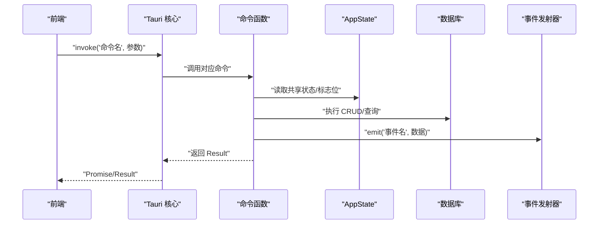

图表来源
- [src-tauri/src/lib.rs:108-214](file://src-tauri/src/lib.rs#L108-L214)
- [src-tauri/src/commands/ai.rs:16-274](file://src-tauri/src/commands/ai.rs#L16-L274)

章节来源
- [src-tauri/src/lib.rs:108-214](file://src-tauri/src/lib.rs#L108-L214)
- [src-tauri/src/commands/ai.rs:16-274](file://src-tauri/src/commands/ai.rs#L16-L274)

### 对话命令（会话生命周期）
- 职责：列出、获取、创建、更新、删除会话；获取会话及关联消息。
- 参数与返回：强类型请求/响应结构体，错误统一转换为 ErrorResponse。
- 并发与锁：命令内对数据库加锁，异常时返回 LOCK_ERROR。

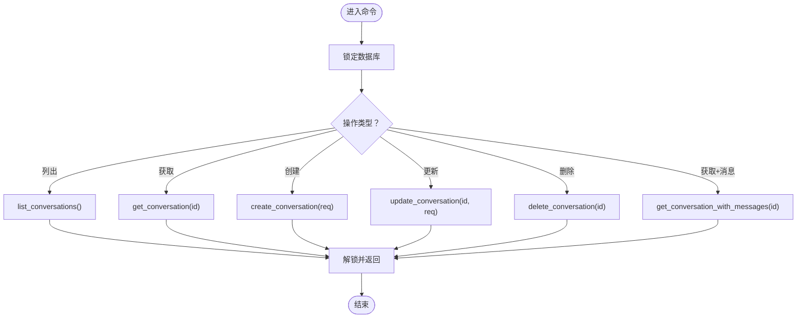

图表来源
- [src-tauri/src/commands/conversation.rs:8-73](file://src-tauri/src/commands/conversation.rs#L8-L73)

章节来源
- [src-tauri/src/commands/conversation.rs:8-73](file://src-tauri/src/commands/conversation.rs#L8-L73)

### 消息命令（消息 CRUD 与流式）
- 职责：消息列表、获取、创建、更新、删除；追加内容（流式）、完成流式、设置反馈。
- 流式处理：append_message_content 与 complete_message 配合前端事件，实现增量渲染与完成通知。
- 取消机制：通过 AppState.cancel_flag 支持停止生成。

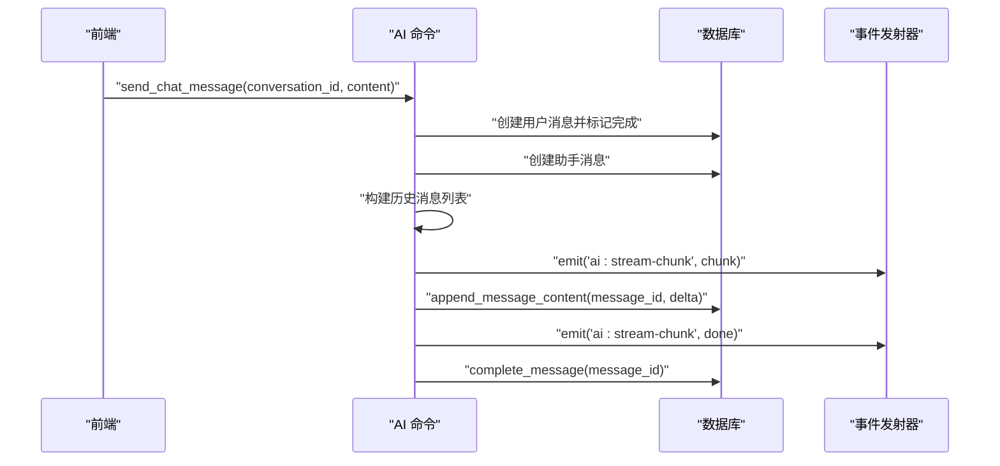

图表来源
- [src-tauri/src/commands/ai.rs:16-274](file://src-tauri/src/commands/ai.rs#L16-L274)
- [src-tauri/src/commands/message.rs:59-99](file://src-tauri/src/commands/message.rs#L59-L99)

章节来源
- [src-tauri/src/commands/ai.rs:16-274](file://src-tauri/src/commands/ai.rs#L16-L274)
- [src-tauri/src/commands/message.rs:59-99](file://src-tauri/src/commands/message.rs#L59-L99)

### 书签命令（收藏夹管理）
- 职责：列出书签、创建、删除；列出文件夹、创建、删除；支持按父级过滤。
- 参数：CreateBookmarkRequest、CreateFolderRequest 等结构体，保证参数一致性与可扩展性。

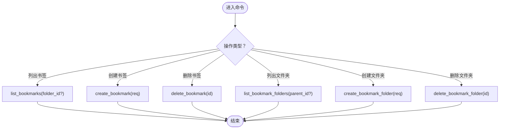

图表来源
- [src-tauri/src/commands/bookmark.rs:7-75](file://src-tauri/src/commands/bookmark.rs#L7-L75)

章节来源
- [src-tauri/src/commands/bookmark.rs:7-75](file://src-tauri/src/commands/bookmark.rs#L7-L75)

### 设置命令（应用配置）
- 职责：读取/设置通用设置；模型配置的增删改查与激活；Skills 目录管理；MCP 服务器配置与测试导入；IQA API Key 管理。
- 异步测试：test_mcp_server 支持 stdio 与 HTTP/SSE 多种传输模式，内置超时与错误处理。
- 安全：敏感配置（如 API Key）通过数据库存储，避免硬编码。

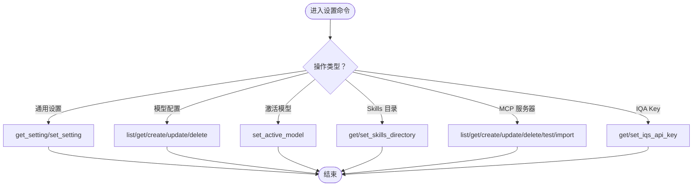

图表来源
- [src-tauri/src/commands/settings.rs:9-615](file://src-tauri/src/commands/settings.rs#L9-L615)

章节来源
- [src-tauri/src/commands/settings.rs:9-615](file://src-tauri/src/commands/settings.rs#L9-L615)

### Skills 命令（技能管理）
- 职责：列出、删除、启用/禁用、从 Markdown/目录导入、列出目录、读取技能内容。
- 状态：通过 AppState.skills_manager 管理，支持动态重载与同步示例技能。

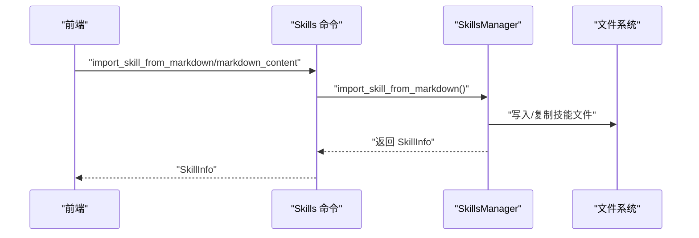

图表来源
- [src-tauri/src/commands/skills.rs:92-152](file://src-tauri/src/commands/skills.rs#L92-L152)
- [src-tauri/src/state.rs:25-77](file://src-tauri/src/state.rs#L25-L77)

章节来源
- [src-tauri/src/commands/skills.rs:92-152](file://src-tauri/src/commands/skills.rs#L92-L152)
- [src-tauri/src/state.rs:25-77](file://src-tauri/src/state.rs#L25-L77)

### 浏览器命令（导航与页面操作）
- 职责：导航、刷新、前进/后退、获取状态、关闭标签页；执行脚本、获取页面内容；元素选择模式、点击、输入、滚动；设置/获取活动标签页；获取 WebView 标题。
- 状态：使用全局 TabState 管理每个标签页的历史与当前 URL，支持回退/前进。
- 事件：通过 webview:* 事件与前端交互，驱动 WebView2/Iframe 行为。

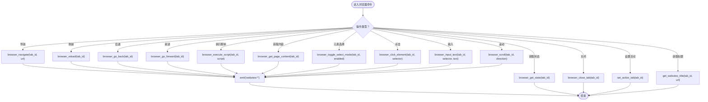

图表来源
- [src-tauri/src/commands/browser_nav.rs:32-532](file://src-tauri/src/commands/browser_nav.rs#L32-L532)

章节来源
- [src-tauri/src/commands/browser_nav.rs:32-532](file://src-tauri/src/commands/browser_nav.rs#L32-L532)

### 截图命令（屏幕捕获）
- 职责：全屏截图、从 base64 裁剪区域、保存到磁盘、复制到剪贴板。
- 事件：emit 截图事件到前端，携带 base64 与尺寸，前端负责展示与交互。

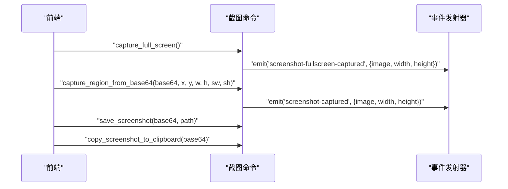

图表来源
- [src-tauri/src/commands/screenshot.rs:14-165](file://src-tauri/src/commands/screenshot.rs#L14-L165)

章节来源
- [src-tauri/src/commands/screenshot.rs:14-165](file://src-tauri/src/commands/screenshot.rs#L14-L165)

### AI 命令（对话生成与流式响应）
- 职责：发送消息、停止生成、追加流式块、完成流式、生成会话标题。
- 流式机制：send_chat_message 创建用户/助手消息，构建完整历史提示，异步调用流式生成，通过事件向前端推送增量内容与完成信号。
- 取消机制：通过 AppState.cancel_flag 支持中断生成。

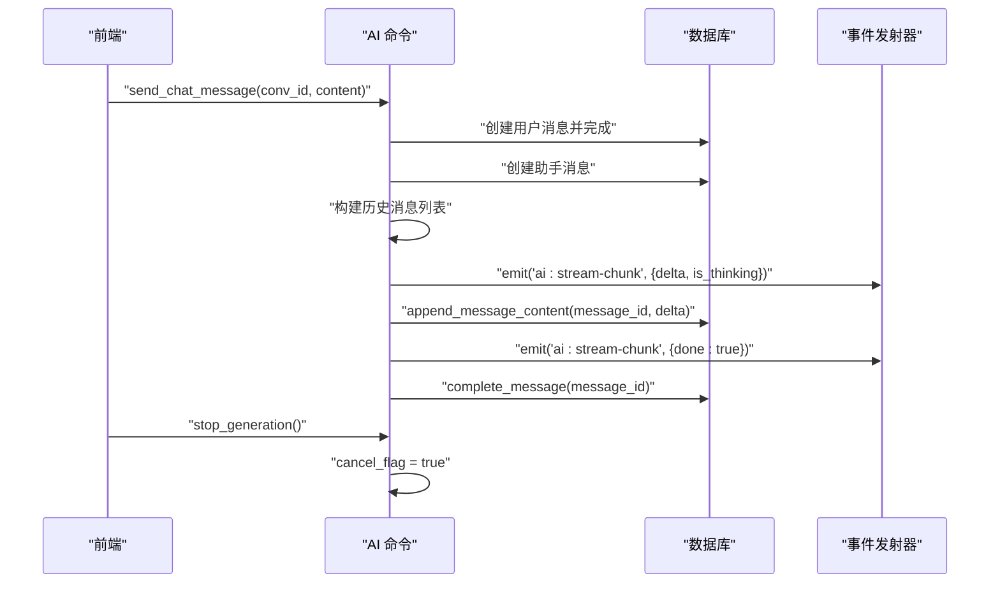

图表来源
- [src-tauri/src/commands/ai.rs:16-274](file://src-tauri/src/commands/ai.rs#L16-L274)
- [src-tauri/src/state.rs:12](file://src-tauri/src/state.rs#L12)

章节来源
- [src-tauri/src/commands/ai.rs:16-274](file://src-tauri/src/commands/ai.rs#L16-L274)
- [src-tauri/src/state.rs:12](file://src-tauri/src/state.rs#L12)

### 页面上下文命令（AI 用）
- 职责：获取页面上下文（URL、标题、域名、是否安全、内容摘要）、注入上下文提示词、总结页面内容、接收前端返回的页面内容、执行网页操作（点击、填写、关闭弹窗）。
- 协作：通过 AppState.page_content_responses 缓存前端返回的页面内容，避免阻塞主流程。

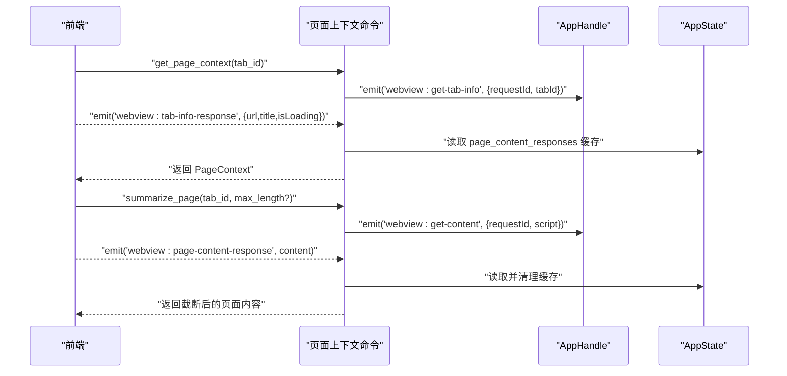

图表来源
- [src-tauri/src/commands/page_context.rs:21-327](file://src-tauri/src/commands/page_context.rs#L21-L327)
- [src-tauri/src/state.rs:14-15](file://src-tauri/src/state.rs#L14-L15)

章节来源
- [src-tauri/src/commands/page_context.rs:21-327](file://src-tauri/src/commands/page_context.rs#L21-L327)
- [src-tauri/src/state.rs:14-15](file://src-tauri/src/state.rs#L14-L15)

## 依赖关系分析
- 模块耦合
  - commands/mod.rs 汇聚各命令模块，lib.rs 通过 generate_handler! 统一注册，降低入口复杂度。
  - 命令与 AppState 强耦合，体现“状态外置、命令无状态”的设计原则。
  - 命令与数据库接口解耦，通过 state.db.lock() 访问，便于替换实现与测试。
- 外部依赖
  - 事件系统：Emitter 用于前后端解耦通信。
  - 插件生态：shell、dialog、fs、global-shortcut、http、notification、updater、window_state 等。
- 循环依赖
  - 未见直接循环依赖；命令模块之间通过 AppState 间接协作，避免强耦合。

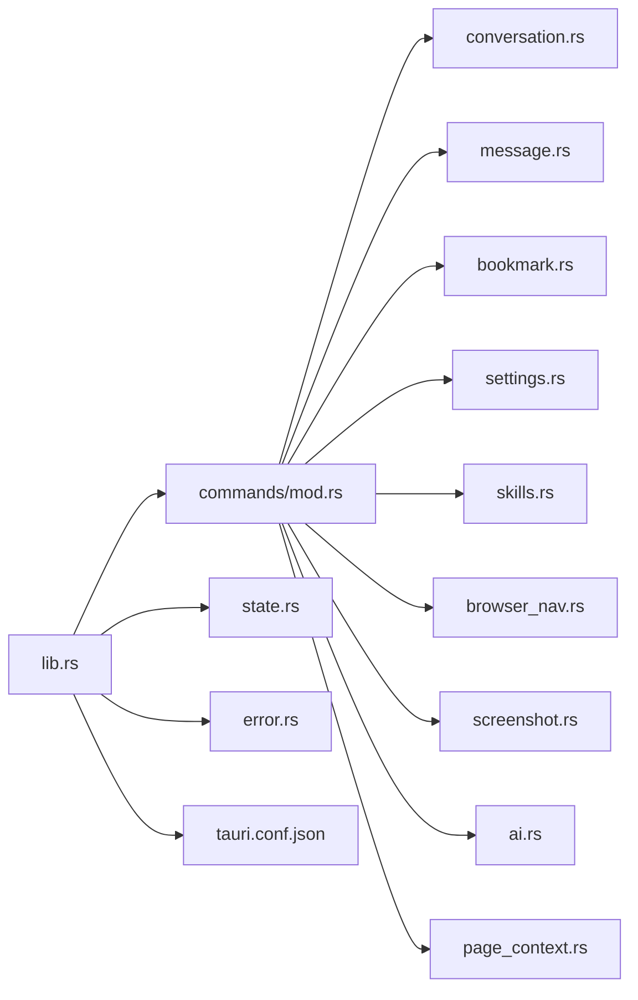

图表来源
- [src-tauri/src/commands/mod.rs:1-13](file://src-tauri/src/commands/mod.rs#L1-L13)
- [src-tauri/src/lib.rs:108-214](file://src-tauri/src/lib.rs#L108-L214)

章节来源
- [src-tauri/src/commands/mod.rs:1-13](file://src-tauri/src/commands/mod.rs#L1-L13)
- [src-tauri/src/lib.rs:108-214](file://src-tauri/src/lib.rs#L108-L214)

## 性能考量
- 异步与并发
  - AI 流式生成使用 tokio::spawn 分离 IO 与计算，避免阻塞主线程。
  - 截图与页面内容提取均通过事件与超时机制避免长时间阻塞。
- 锁与状态
  - 数据库访问通过 Mutex 包裹，命令内尽量缩短持锁时间，减少竞争。
  - AppState 中的 HashMap 与 Arc<Mutex<...>> 用于跨模块共享与并发安全。
- I/O 与网络
  - 浏览器标题获取设置短超时，失败时回退为主机名，提升鲁棒性。
  - MCP 测试连接设置超时，避免前端卡死。
- 内存与编码
  - 截图采用 PNG 编码与 base64 传输，注意内存占用；前端负责 UI 展示与交互。

## 故障排查指南
- 锁失败
  - 现象：LOCK_ERROR；原因：Mutex 获取失败或被异常持有。
  - 处理：检查命令执行链路，避免长时持锁；确认线程安全。
  - 参考：[src-tauri/src/commands/conversation.rs:9-15](file://src-tauri/src/commands/conversation.rs#L9-L15)、[src-tauri/src/commands/message.rs:7-14](file://src-tauri/src/commands/message.rs#L7-L14)
- 数据库错误
  - 现象：DATABASE_ERROR；原因：SQL 执行失败、约束冲突。
  - 处理：检查请求参数与表结构；在调用前做参数校验。
  - 参考：[src-tauri/src/error.rs:6-7](file://src-tauri/src/error.rs#L6-L7)
- HTTP/网络错误
  - 现象：HTTP_ERROR；原因：网络不可达、超时、证书问题。
  - 处理：增加重试与降级策略；检查代理与防火墙。
  - 参考：[src-tauri/src/error.rs:9-10](file://src-tauri/src/error.rs#L9-L10)
- JSON/序列化错误
  - 现象：JSON_ERROR；原因：请求/响应结构不匹配。
  - 处理：严格定义请求/响应结构体；前后端保持一致。
  - 参考：[src-tauri/src/error.rs:12-13](file://src-tauri/src/error.rs#L12-L13)
- AI Provider 错误
  - 现象：AI_PROVIDER_ERROR；原因：模型配置错误、鉴权失败。
  - 处理：检查模型配置与密钥；查看日志输出的模型调试信息。
  - 参考：[src-tauri/src/error.rs:18-19](file://src-tauri/src/error.rs#L18-L19)
- 事件未到达
  - 现象：前端未收到事件；原因：事件名不匹配、前端未监听。
  - 处理：核对事件名与监听逻辑；检查 CSP 与权限。
  - 参考：[src-tauri/src/commands/browser_nav.rs:66-71](file://src-tauri/src/commands/browser_nav.rs#L66-L71)、[src-tauri/src/commands/screenshot.rs:47-54](file://src-tauri/src/commands/screenshot.rs#L47-L54)

章节来源
- [src-tauri/src/commands/conversation.rs:9-15](file://src-tauri/src/commands/conversation.rs#L9-L15)
- [src-tauri/src/commands/message.rs:7-14](file://src-tauri/src/commands/message.rs#L7-L14)
- [src-tauri/src/error.rs:6-19](file://src-tauri/src/error.rs#L6-L19)
- [src-tauri/src/commands/browser_nav.rs:66-71](file://src-tauri/src/commands/browser_nav.rs#L66-L71)
- [src-tauri/src/commands/screenshot.rs:47-54](file://src-tauri/src/commands/screenshot.rs#L47-L54)

## 结论
CoSurf 的命令系统以模块化与统一注册为核心，结合全局状态与事件通知，实现了高内聚、低耦合的架构。命令层专注于业务语义与参数处理，状态层承载共享资源，错误层提供一致的错误表达。通过异步与超时机制，系统在复杂场景下仍保持稳定与可维护性。建议在扩展新命令时遵循现有模式：强类型参数、短持锁、事件驱动、错误统一、日志可观测。

## 附录
- 命令调用最佳实践
  - 参数校验：在命令入口进行基础校验，尽早失败。
  - 错误处理：使用 ErrorResponse 统一包装，前端据此展示与重试。
  - 事件命名：前后端约定一致的事件名与负载格式。
  - 日志：在关键路径打印调试信息，便于定位问题。
- 安全考虑
  - CSP 严格限制资源来源，避免 XSS 与不安全内容。
  - 敏感配置（如 API Key）仅在后端存储与使用。
  - 事件与命令通道需最小权限暴露，避免越权操作。
- 性能优化建议
  - 将耗时操作放入异步任务，避免阻塞主线程。
  - 合理使用缓存（如页面内容响应缓存），减少重复计算。
  - 对高频命令进行批处理或合并请求，降低 IPC 次数。