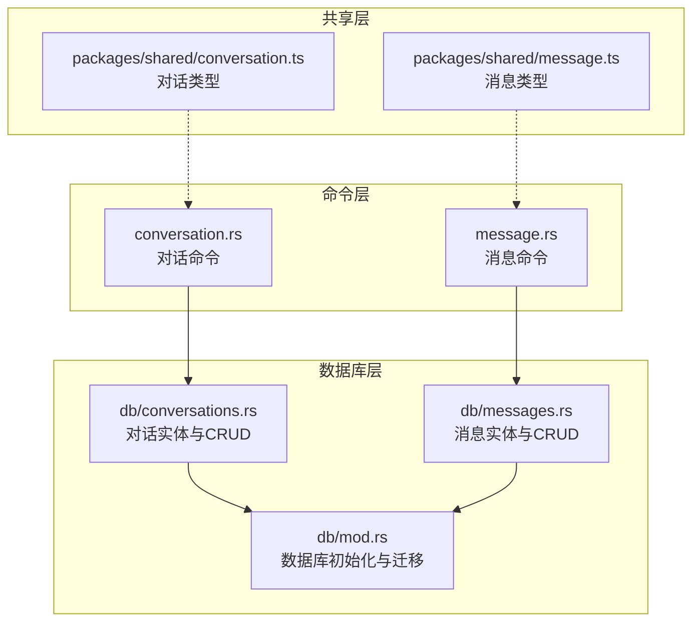
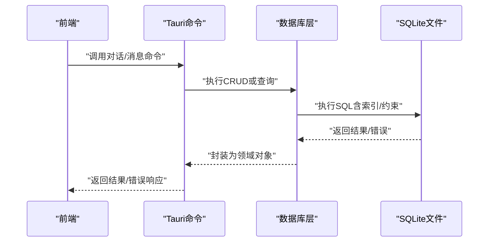
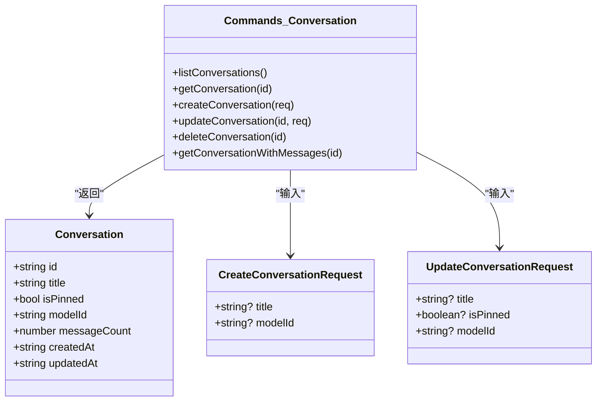
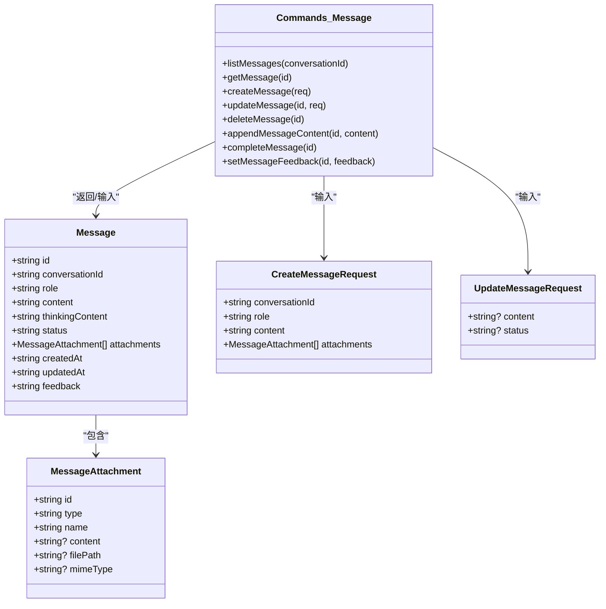
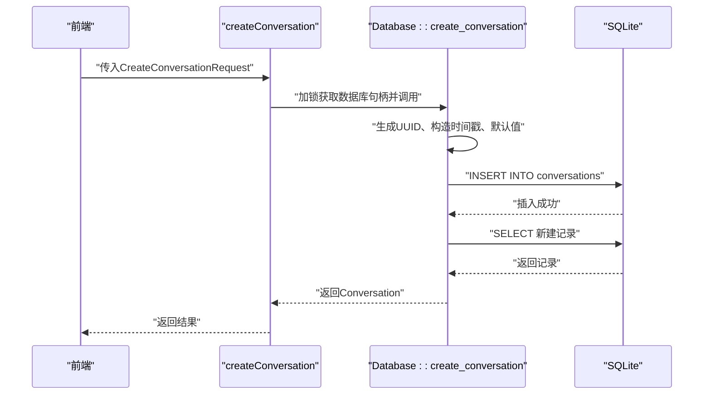
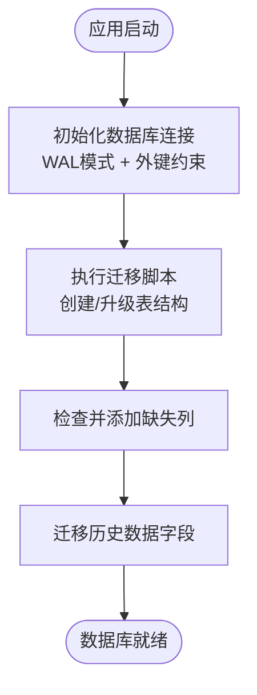
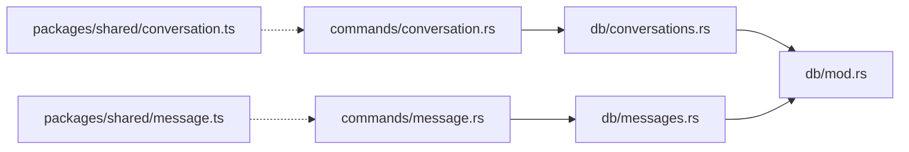

# 对话命令模块

<cite>
**本文档引用的文件**
- [conversation.rs](file://src-tauri/src/commands/conversation.rs)
- [messages.rs](file://src-tauri/src/db/messages.rs)
- [conversations.rs](file://src-tauri/src/db/conversations.rs)
- [mod.rs](file://src-tauri/src/db/mod.rs)
- [conversation.ts](file://packages/shared/src/conversation.ts)
- [message.ts](file://packages/shared/src/message.ts)
- [message.rs](file://src-tauri/src/commands/message.rs)
</cite>

## 目录
1. [简介](#简介)
2. [项目结构](#项目结构)
3. [核心组件](#核心组件)
4. [架构总览](#架构总览)
5. [详细组件分析](#详细组件分析)
6. [依赖关系分析](#依赖关系分析)
7. [性能考虑](#性能考虑)
8. [故障排除指南](#故障排除指南)
9. [结论](#结论)
10. [附录](#附录)

## 简介
本文件系统性梳理 CoSurf 对话命令模块的实现，重点覆盖以下方面：
- 对话生命周期管理命令：创建、查询、更新、删除
- 对话数据模型设计：会话元数据、时间戳、状态管理
- 对话命令与数据库层交互模式：SQL 查询优化、事务处理、数据一致性保证
- 具体实现示例：对话 CRUD 操作、批量处理、条件查询
- 数据迁移策略、备份恢复机制、性能监控指标

## 项目结构
对话命令模块位于 Tauri 后端，采用分层架构：
- 命令层：暴露给前端调用的 Tauri 命令函数
- 数据库层：基于 SQLite 的实体模型与持久化逻辑
- 共享层：前端 TypeScript 类型定义，确保前后端数据契约一致

图表来源
- [conversation.rs:1-73](file://src-tauri/src/commands/conversation.rs#L1-L73)
- [message.rs:1-99](file://src-tauri/src/commands/message.rs#L1-L99)
- [mod.rs:1-272](file://src-tauri/src/db/mod.rs#L1-L272)
- [conversations.rs:1-127](file://src-tauri/src/db/conversations.rs#L1-L127)
- [messages.rs:1-198](file://src-tauri/src/db/messages.rs#L1-L198)
- [conversation.ts:1-14](file://packages/shared/src/conversation.ts#L1-L14)
- [message.ts:1-35](file://packages/shared/src/message.ts#L1-L35)

章节来源
- [conversation.rs:1-73](file://src-tauri/src/commands/conversation.rs#L1-L73)
- [message.rs:1-99](file://src-tauri/src/commands/message.rs#L1-L99)
- [mod.rs:1-272](file://src-tauri/src/db/mod.rs#L1-L272)

## 核心组件
- 对话命令模块：提供 list、get、create、update、delete、带消息的获取等命令
- 消息命令模块：提供 list、get、create、update、delete、流式追加、完成、设置反馈等命令
- 数据库模块：统一初始化、迁移、索引与约束；提供对话与消息的 CRUD 能力
- 共享类型模块：定义对话与消息的数据结构，确保前后端一致

章节来源
- [conversation.rs:8-73](file://src-tauri/src/commands/conversation.rs#L8-L73)
- [message.rs:7-99](file://src-tauri/src/commands/message.rs#L7-L99)
- [conversations.rs:7-127](file://src-tauri/src/db/conversations.rs#L7-L127)
- [messages.rs:7-198](file://src-tauri/src/db/messages.rs#L7-L198)
- [conversation.ts:1-14](file://packages/shared/src/conversation.ts#L1-L14)
- [message.ts:1-35](file://packages/shared/src/message.ts#L1-L35)

## 架构总览
对话命令模块遵循“命令层 → 数据库层 → 存储层”的清晰分层，使用 SQLite 作为本地存储，并通过迁移脚本维护结构演进。

图表来源
- [conversation.rs:8-73](file://src-tauri/src/commands/conversation.rs#L8-L73)
- [message.rs:7-99](file://src-tauri/src/commands/message.rs#L7-L99)
- [conversations.rs:34-127](file://src-tauri/src/db/conversations.rs#L34-L127)
- [messages.rs:64-198](file://src-tauri/src/db/messages.rs#L64-L198)
- [mod.rs:41-148](file://src-tauri/src/db/mod.rs#L41-L148)

## 详细组件分析

### 对话命令与数据模型
- 对话实体包含：标识符、标题、置顶状态、模型标识、消息计数、创建与更新时间戳
- 请求模型：创建时可选标题与模型；更新时可选标题、置顶、模型
- 命令接口：列出、按 ID 获取、创建、更新、删除、获取对话及关联消息

图表来源
- [conversations.rs:7-32](file://src-tauri/src/db/conversations.rs#L7-L32)
- [conversation.rs:8-73](file://src-tauri/src/commands/conversation.rs#L8-L73)
- [conversation.ts:1-9](file://packages/shared/src/conversation.ts#L1-L9)

章节来源
- [conversations.rs:7-32](file://src-tauri/src/db/conversations.rs#L7-L32)
- [conversation.rs:8-73](file://src-tauri/src/commands/conversation.rs#L8-L73)
- [conversation.ts:1-9](file://packages/shared/src/conversation.ts#L1-L9)

### 消息命令与数据模型
- 消息实体包含：标识符、所属对话、角色（用户/助手/系统）、内容、思考内容、状态、附件、创建与更新时间戳、反馈
- 请求模型：创建时需对话标识、角色、内容与可选附件；更新时可选内容与状态
- 流式处理：支持增量追加内容（区分思考与回复），完成后标记完成状态
- 命令接口：列出、按 ID 获取、创建、更新、删除、流式追加、完成、设置反馈

图表来源
- [messages.rs:7-53](file://src-tauri/src/db/messages.rs#L7-L53)
- [message.rs:7-99](file://src-tauri/src/commands/message.rs#L7-L99)
- [message.ts:5-26](file://packages/shared/src/message.ts#L5-L26)

章节来源
- [messages.rs:7-53](file://src-tauri/src/db/messages.rs#L7-L53)
- [message.rs:7-99](file://src-tauri/src/commands/message.rs#L7-L99)
- [message.ts:5-26](file://packages/shared/src/message.ts#L5-L26)

### 对话与消息的命令调用流程
以“创建对话”为例，展示从前端到数据库的完整调用链路。

图表来源
- [conversation.rs:26-36](file://src-tauri/src/commands/conversation.rs#L26-L36)
- [conversations.rs:80-93](file://src-tauri/src/db/conversations.rs#L80-L93)

章节来源
- [conversation.rs:26-36](file://src-tauri/src/commands/conversation.rs#L26-L36)
- [conversations.rs:80-93](file://src-tauri/src/db/conversations.rs#L80-L93)

### 数据库层交互与一致性保障
- 初始化与迁移：打开数据库后启用 WAL 模式与外键约束，执行迁移脚本创建/升级表结构
- 索引与约束：对消息按对话 ID 建立索引；对话与消息间通过外键级联删除保证一致性
- 列扩展与数据迁移：动态检测并添加缺失列，针对历史数据进行字段拆分与迁移
- 并发控制：命令层通过互斥锁保护数据库访问，避免并发写冲突

图表来源
- [mod.rs:16-40](file://src-tauri/src/db/mod.rs#L16-L40)
- [mod.rs:41-148](file://src-tauri/src/db/mod.rs#L41-L148)
- [mod.rs:150-266](file://src-tauri/src/db/mod.rs#L150-L266)

章节来源
- [mod.rs:16-40](file://src-tauri/src/db/mod.rs#L16-L40)
- [mod.rs:41-148](file://src-tauri/src/db/mod.rs#L41-L148)
- [mod.rs:150-266](file://src-tauri/src/db/mod.rs#L150-L266)

### SQL 查询优化与事务处理
- 查询优化
  - 对消息按对话 ID 排序查询，利用索引提升性能
  - 使用参数化查询防止注入，减少解析开销
- 事务处理
  - 当前实现未显式开启事务块；单条写入语句由 SQLite 自动提交
  - 若需强一致性，可在业务关键路径上引入显式事务（建议）
- 数据一致性
  - 外键约束 + 级联删除确保删除对话时自动清理消息
  - 时间戳统一使用 UTC RFC3339 格式，便于排序与跨时区比较

章节来源
- [conversations.rs:34-58](file://src-tauri/src/db/conversations.rs#L34-L58)
- [messages.rs:64-94](file://src-tauri/src/db/messages.rs#L64-L94)
- [mod.rs:67-67](file://src-tauri/src/db/mod.rs#L67-L67)
- [mod.rs:64-64](file://src-tauri/src/db/mod.rs#L64-L64)

### 批量处理与条件查询
- 批量处理
  - 对话列表按置顶优先与更新时间倒序排列，适合前端分页展示
  - 消息列表按创建时间升序排列，适配聊天时间线展示
- 条件查询
  - 支持按对话 ID 精确查询消息集合
  - 支持按消息 ID 精确查询单条消息
- 扩展建议
  - 可增加分页参数（limit/offset 或游标分页）
  - 可增加过滤条件（如按状态、角色、时间范围）

章节来源
- [conversations.rs:34-58](file://src-tauri/src/db/conversations.rs#L34-L58)
- [messages.rs:64-94](file://src-tauri/src/db/messages.rs#L64-L94)

### 实现示例（代码片段路径）
- 创建对话
  - [create_conversation 调用链:26-36](file://src-tauri/src/commands/conversation.rs#L26-L36)
  - [数据库实现:80-93](file://src-tauri/src/db/conversations.rs#L80-L93)
- 获取对话详情
  - [get_conversation 调用链:17-24](file://src-tauri/src/commands/conversation.rs#L17-L24)
  - [数据库实现:60-78](file://src-tauri/src/db/conversations.rs#L60-L78)
- 更新对话
  - [update_conversation 调用链:38-49](file://src-tauri/src/commands/conversation.rs#L38-L49)
  - [数据库实现:95-109](file://src-tauri/src/db/conversations.rs#L95-L109)
- 删除对话
  - [delete_conversation 调用链:51-58](file://src-tauri/src/commands/conversation.rs#L51-L58)
  - [数据库实现:111-117](file://src-tauri/src/db/conversations.rs#L111-L117)
- 获取对话及消息
  - [get_conversation_with_messages 调用链:60-72](file://src-tauri/src/commands/conversation.rs#L60-L72)
  - [数据库实现:60-78](file://src-tauri/src/db/conversations.rs#L60-L78)
  - [消息列表实现:64-94](file://src-tauri/src/db/messages.rs#L64-L94)

## 依赖关系分析
- 命令层依赖数据库层提供的实体与方法
- 数据库层依赖 SQLite 连接与迁移脚本
- 共享类型层为前后端契约，确保序列化/反序列化一致

图表来源
- [conversation.rs:1-73](file://src-tauri/src/commands/conversation.rs#L1-L73)
- [message.rs:1-99](file://src-tauri/src/commands/message.rs#L1-L99)
- [conversations.rs:1-127](file://src-tauri/src/db/conversations.rs#L1-L127)
- [messages.rs:1-198](file://src-tauri/src/db/messages.rs#L1-L198)
- [mod.rs:1-272](file://src-tauri/src/db/mod.rs#L1-L272)
- [conversation.ts:1-14](file://packages/shared/src/conversation.ts#L1-L14)
- [message.ts:1-35](file://packages/shared/src/message.ts#L1-L35)

章节来源
- [conversation.rs:1-73](file://src-tauri/src/commands/conversation.rs#L1-L73)
- [message.rs:1-99](file://src-tauri/src/commands/message.rs#L1-L99)
- [conversations.rs:1-127](file://src-tauri/src/db/conversations.rs#L1-L127)
- [messages.rs:1-198](file://src-tauri/src/db/messages.rs#L1-L198)
- [mod.rs:1-272](file://src-tauri/src/db/mod.rs#L1-L272)
- [conversation.ts:1-14](file://packages/shared/src/conversation.ts#L1-L14)
- [message.ts:1-35](file://packages/shared/src/message.ts#L1-L35)

## 性能考虑
- 索引优化
  - 消息表按对话 ID 建立索引，显著降低按会话查询成本
- 查询模式
  - 列表查询按重要维度排序，利于前端分页与渲染
- 写入优化
  - 参数化 SQL 减少编译与解析开销
- 并发与锁
  - 命令层使用互斥锁保护数据库访问，避免竞态
- 建议
  - 对高频查询增加复合索引（如按状态+时间）
  - 对大文本字段（content/thinking_content）考虑分表或压缩
  - 在业务关键路径引入显式事务，确保多步写入原子性

章节来源
- [mod.rs:67-67](file://src-tauri/src/db/mod.rs#L67-L67)
- [conversations.rs:34-58](file://src-tauri/src/db/conversations.rs#L34-L58)
- [messages.rs:64-94](file://src-tauri/src/db/messages.rs#L64-L94)
- [conversation.rs:8-73](file://src-tauri/src/commands/conversation.rs#L8-L73)
- [message.rs:7-99](file://src-tauri/src/commands/message.rs#L7-L99)

## 故障排除指南
- 锁定错误
  - 现象：命令执行时报“LOCK_ERROR”
  - 原因：数据库互斥锁获取失败
  - 处理：重试或检查是否存在长时间持有锁的操作
- 资源不存在
  - 现象：查询/更新/删除返回“未找到”
  - 原因：ID 不存在或已被删除
  - 处理：校验 ID 有效性，确认外键约束下的级联删除行为
- 数据迁移异常
  - 现象：列缺失导致读取失败
  - 原因：旧版本数据库缺少新字段
  - 处理：依赖迁移脚本自动添加缺失列；必要时手动回滚并重新迁移
- 流式写入异常
  - 现象：追加内容后状态未更新
  - 原因：并发写入或未正确标记完成
  - 处理：确保追加与完成调用顺序正确，必要时引入事务

章节来源
- [conversation.rs:10-13](file://src-tauri/src/commands/conversation.rs#L10-L13)
- [conversation.rs:20-23](file://src-tauri/src/commands/conversation.rs#L20-L23)
- [messages.rs:152-166](file://src-tauri/src/db/messages.rs#L152-L166)
- [messages.rs:168-175](file://src-tauri/src/db/messages.rs#L168-L175)
- [mod.rs:150-170](file://src-tauri/src/db/mod.rs#L150-L170)
- [mod.rs:217-233](file://src-tauri/src/db/mod.rs#L217-L233)

## 结论
对话命令模块通过清晰的分层设计与完善的数据库迁移机制，提供了稳定可靠的对话与消息管理能力。当前实现已满足基本 CRUD 与流式处理需求，建议在高并发场景下引入显式事务与更细粒度的索引策略，以进一步提升一致性与性能。

## 附录
- 数据迁移策略
  - 动态检测并添加缺失列（如 thinking_content、feedback 等）
  - 历史数据字段拆分与迁移（如从混合内容中分离思考与回复）
- 备份与恢复
  - SQLite 文件即数据库，可直接复制 cosurf.db 进行备份
  - 恢复时替换目标文件并重启应用
- 性能监控指标
  - 查询耗时（按命令维度统计）
  - 写入吞吐（按 CRUD 维度统计）
  - 数据库大小与索引命中率（可结合 SQLite PRAGMA）