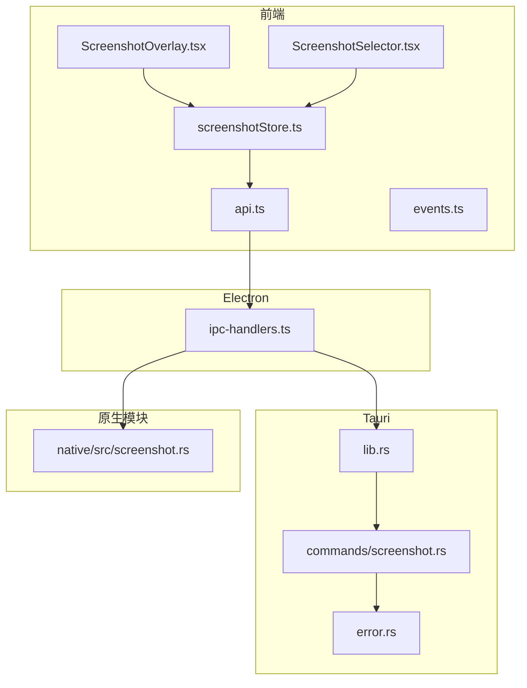
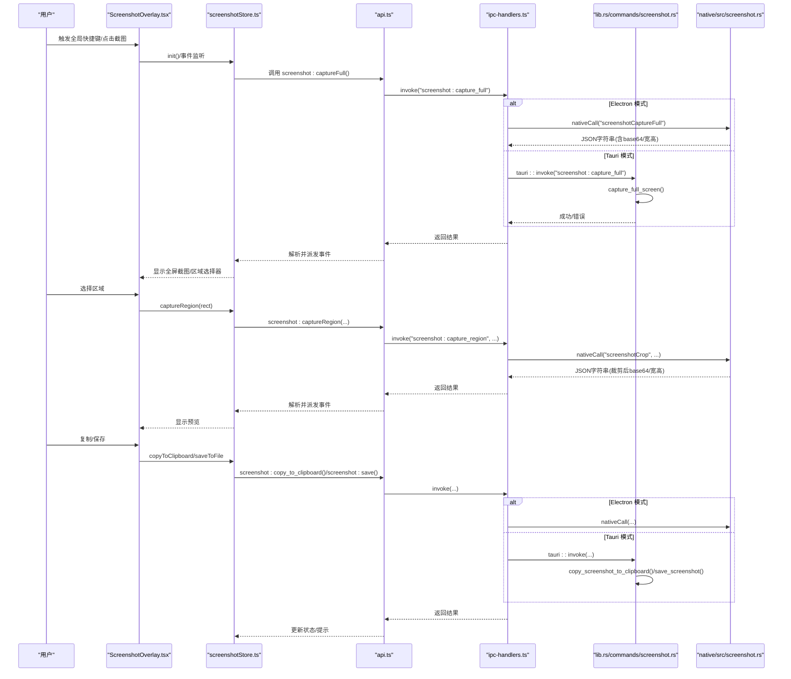
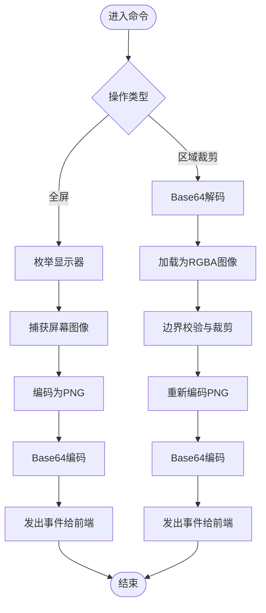
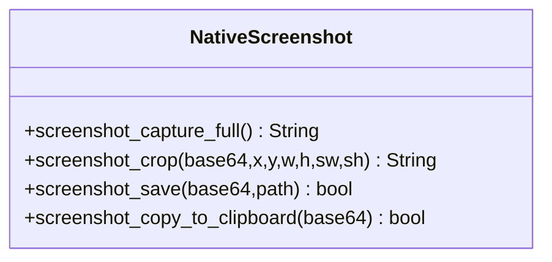
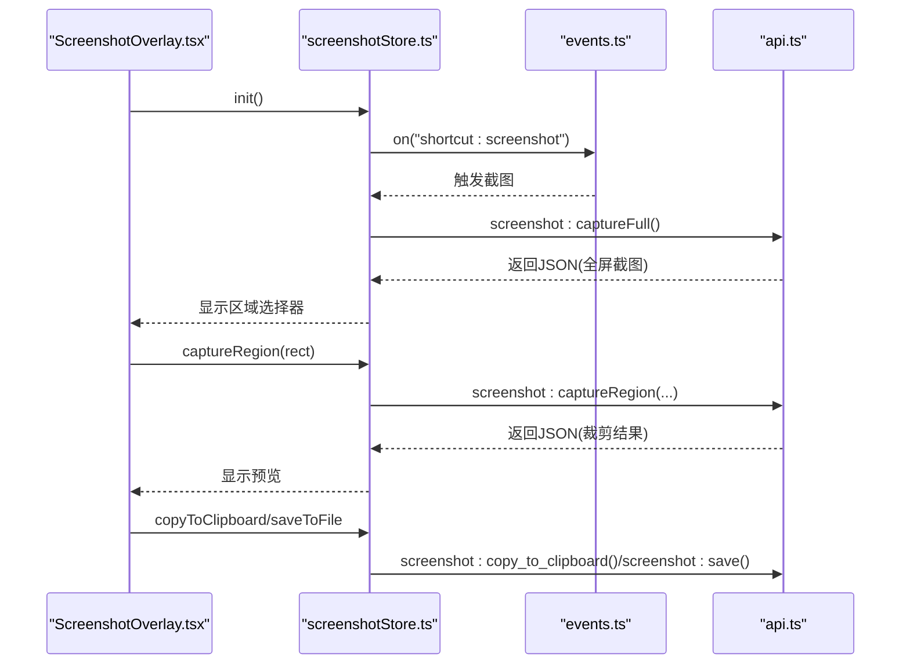
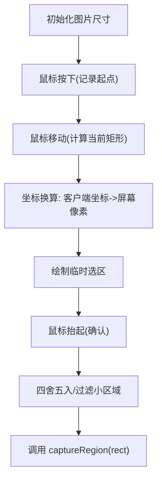
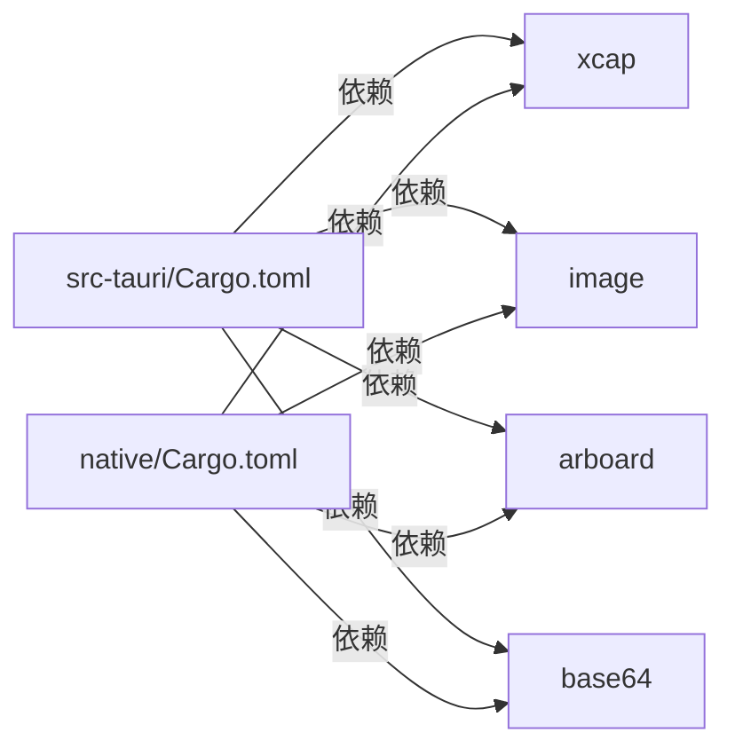

# 截图命令模块

<cite>
**本文引用的文件**
- [screenshot.rs](file://src-tauri/src/commands/screenshot.rs)
- [screenshot.rs](file://native/src/screenshot.rs)
- [lib.rs](file://src-tauri/src/lib.rs)
- [api.ts](file://src-web/src/lib/api.ts)
- [screenshotStore.ts](file://src-web/src/stores/screenshotStore.ts)
- [ScreenshotOverlay.tsx](file://src-web/src/components/ui/ScreenshotOverlay.tsx)
- [ScreenshotSelector.tsx](file://src-web/src/components/ui/ScreenshotSelector.tsx)
- [ipc-handlers.ts](file://electron/ipc-handlers.ts)
- [Cargo.toml](file://src-tauri/Cargo.toml)
- [Cargo.toml](file://native/Cargo.toml)
- [Cargo.toml](file://Cargo.toml)
- [error.rs](file://src-tauri/src/error.rs)
- [events.ts](file://src-web/src/lib/events.ts)
</cite>

## 目录
1. [简介](#简介)
2. [项目结构](#项目结构)
3. [核心组件](#核心组件)
4. [架构总览](#架构总览)
5. [详细组件分析](#详细组件分析)
6. [依赖关系分析](#依赖关系分析)
7. [性能考虑](#性能考虑)
8. [故障排除指南](#故障排除指南)
9. [结论](#结论)

## 简介
本文件为 CoSurf 截图命令模块的深度技术文档，覆盖全屏截图、区域选择、图像处理、文件保存与剪贴板复制等完整流程。文档详细阐述截图命令与系统 API 的交互方式（屏幕捕获、图像编码、文件系统操作），并给出坐标计算、缩放处理、质量控制与格式转换的实现要点。同时提供调用方式、参数配置与回调处理的示例路径，并总结性能优化策略、内存控制与用户体验改进建议。

## 项目结构
截图功能横跨前端 React 组件、状态管理、统一 API 层、Electron IPC、Rust 原生命令与 N-API 原生模块，以及 Tauri 插件系统。关键文件分布如下：
- 前端：React UI 组件负责用户交互与预览；Zustand 状态管理负责生命周期与事件协调；统一 API 层封装 IPC 调用。
- 后端：Tauri 命令处理全屏截图、区域裁剪、保存与复制；Electron IPC 将前端调用桥接到原生模块；原生模块使用 xcap、image、arboard 等库执行系统级操作。

**图表来源**
- [lib.rs:75-93](file://src-tauri/src/lib.rs#L75-L93)
- [screenshot.rs:14-58](file://src-tauri/src/commands/screenshot.rs#L14-L58)
- [api.ts:348-360](file://src-web/src/lib/api.ts#L348-L360)
- [ipc-handlers.ts:441-475](file://electron/ipc-handlers.ts#L441-L475)
- [screenshotStore.ts:38-93](file://src-web/src/stores/screenshotStore.ts#L38-L93)
- [ScreenshotOverlay.tsx:9-61](file://src-web/src/components/ui/ScreenshotOverlay.tsx#L9-L61)
- [ScreenshotSelector.tsx:12-50](file://src-web/src/components/ui/ScreenshotSelector.tsx#L12-L50)
- [error.rs:4-29](file://src-tauri/src/error.rs#L4-L29)
- [screenshot.rs:10-40](file://native/src/screenshot.rs#L10-L40)

**章节来源**
- [lib.rs:75-93](file://src-tauri/src/lib.rs#L75-L93)
- [screenshot.rs:14-58](file://src-tauri/src/commands/screenshot.rs#L14-L58)
- [api.ts:348-360](file://src-web/src/lib/api.ts#L348-L360)
- [ipc-handlers.ts:441-475](file://electron/ipc-handlers.ts#L441-L475)
- [screenshotStore.ts:38-93](file://src-web/src/stores/screenshotStore.ts#L38-L93)
- [ScreenshotOverlay.tsx:9-61](file://src-web/src/components/ui/ScreenshotOverlay.tsx#L9-L61)
- [ScreenshotSelector.tsx:12-50](file://src-web/src/components/ui/ScreenshotSelector.tsx#L12-L50)
- [error.rs:4-29](file://src-tauri/src/error.rs#L4-L29)
- [screenshot.rs:10-40](file://native/src/screenshot.rs#L10-L40)

## 核心组件
- Tauri 截图命令：提供全屏截图、基于 base64 的区域裁剪、保存到文件、复制到剪贴板四个命令，均返回统一错误包装类型。
- 原生模块（N-API）：在 Electron 环境下提供相同能力，返回 JSON 字符串结果，前端解析后继续流程。
- 前端状态与 UI：统一事件监听全局快捷键，触发全屏截图；渲染区域选择器；预览裁剪结果；提供复制与保存操作。
- Electron IPC：将前端调用映射到原生模块或 Tauri 命令，实现跨进程通信。
- 错误处理：统一的 AppError 与 ErrorResponse，便于前端识别与提示。

**章节来源**
- [screenshot.rs:14-165](file://src-tauri/src/commands/screenshot.rs#L14-L165)
- [screenshot.rs:10-129](file://native/src/screenshot.rs#L10-L129)
- [screenshotStore.ts:25-174](file://src-web/src/stores/screenshotStore.ts#L25-L174)
- [ScreenshotOverlay.tsx:9-153](file://src-web/src/components/ui/ScreenshotOverlay.tsx#L9-L153)
- [ScreenshotSelector.tsx:12-160](file://src-web/src/components/ui/ScreenshotSelector.tsx#L12-L160)
- [ipc-handlers.ts:441-475](file://electron/ipc-handlers.ts#L441-L475)
- [error.rs:41-61](file://src-tauri/src/error.rs#L41-L61)

## 架构总览
下图展示了从用户触发到最终输出的端到端流程，涵盖系统级 API 调用与跨语言边界：

**图表来源**
- [lib.rs:75-93](file://src-tauri/src/lib.rs#L75-L93)
- [screenshot.rs:14-165](file://src-tauri/src/commands/screenshot.rs#L14-L165)
- [api.ts:348-360](file://src-web/src/lib/api.ts#L348-L360)
- [ipc-handlers.ts:441-475](file://electron/ipc-handlers.ts#L441-L475)
- [screenshotStore.ts:38-174](file://src-web/src/stores/screenshotStore.ts#L38-L174)
- [ScreenshotOverlay.tsx:9-153](file://src-web/src/components/ui/ScreenshotOverlay.tsx#L9-L153)
- [ScreenshotSelector.tsx:12-160](file://src-web/src/components/ui/ScreenshotSelector.tsx#L12-L160)
- [screenshot.rs:10-129](file://native/src/screenshot.rs#L10-L129)

## 详细组件分析

### Tauri 截图命令
- 全屏截图：枚举显示器、捕获图像、编码为 PNG、Base64 编码、通过事件向前端发送宽高与图像数据。
- 区域裁剪：解码 base64、按屏幕尺寸进行边界校验与裁剪、重新编码 PNG 并返回。
- 保存截图：解码 base64、写入文件系统。
- 复制到剪贴板：解码 base64、转换为 RGBA 像素、通过 arboard 写入系统剪贴板。

**图表来源**
- [screenshot.rs:14-165](file://src-tauri/src/commands/screenshot.rs#L14-L165)

**章节来源**
- [screenshot.rs:14-165](file://src-tauri/src/commands/screenshot.rs#L14-L165)

### 原生模块（N-API）
- 全屏截图：调用 xcap 获取首屏图像，image 编码 PNG，返回包含 base64 与宽高的 JSON 字符串。
- 区域裁剪：与 Tauri 版本一致的裁剪逻辑，返回 JSON 字符串。
- 保存与复制：与 Tauri 版本一致的文件写入与剪贴板写入逻辑。

**图表来源**
- [screenshot.rs:10-129](file://native/src/screenshot.rs#L10-L129)

**章节来源**
- [screenshot.rs:10-129](file://native/src/screenshot.rs#L10-L129)

### 前端状态与 UI
- 全局快捷键：通过事件系统监听 "shortcut:screenshot"，触发全屏截图。
- 全屏截图完成：监听 "screenshot-fullscreen-captured"，显示区域选择器。
- 区域裁剪完成：监听 "screenshot-captured"，显示预览与操作按钮。
- 复制/保存：调用 api.ts 中的对应方法，更新状态与提示。

**图表来源**
- [screenshotStore.ts:38-174](file://src-web/src/stores/screenshotStore.ts#L38-L174)
- [events.ts:51-57](file://src-web/src/lib/events.ts#L51-L57)
- [api.ts:348-360](file://src-web/src/lib/api.ts#L348-L360)
- [ScreenshotOverlay.tsx:9-153](file://src-web/src/components/ui/ScreenshotOverlay.tsx#L9-L153)

**章节来源**
- [screenshotStore.ts:25-174](file://src-web/src/stores/screenshotStore.ts#L25-L174)
- [events.ts:51-57](file://src-web/src/lib/events.ts#L51-L57)
- [api.ts:348-360](file://src-web/src/lib/api.ts#L348-L360)
- [ScreenshotOverlay.tsx:9-153](file://src-web/src/components/ui/ScreenshotOverlay.tsx#L9-L153)

### 区域选择器与坐标换算
- 计算图片实际显示尺寸与缩放比，将鼠标坐标从页面坐标系转换为屏幕物理像素坐标。
- 支持拖拽绘制矩形，实时显示尺寸；确认时四舍五入并过滤过小区域。

**图表来源**
- [ScreenshotSelector.tsx:20-102](file://src-web/src/components/ui/ScreenshotSelector.tsx#L20-L102)

**章节来源**
- [ScreenshotSelector.tsx:20-102](file://src-web/src/components/ui/ScreenshotSelector.tsx#L20-L102)

### Electron IPC 映射
- 将前端调用映射到原生模块或 Tauri 命令，异常统一抛出，便于前端捕获与提示。

**章节来源**
- [ipc-handlers.ts:441-475](file://electron/ipc-handlers.ts#L441-L475)

## 依赖关系分析
- Rust 依赖：xcap（屏幕捕获）、image（图像编解码）、arboard（剪贴板）、base64（编码）、tauri 插件（对话框、FS、全局快捷键等）。
- 原生模块依赖：napi、tokio、image、xcap、arboard、base64。
- 前端依赖：React、Zustand、lucide-react、自定义事件与 API 封装。

**图表来源**
- [Cargo.toml:49-56](file://src-tauri/Cargo.toml#L49-L56)
- [Cargo.toml:54-57](file://native/Cargo.toml#L54-L57)

**章节来源**
- [Cargo.toml:49-56](file://src-tauri/Cargo.toml#L49-L56)
- [Cargo.toml:54-57](file://native/Cargo.toml#L54-L57)
- [Cargo.toml:23-28](file://Cargo.toml#L23-L28)

## 性能考虑
- 编码与传输：截图以 PNG 编码并通过 Base64 传输，适合小范围使用；大图建议考虑压缩或分块传输策略。
- 内存控制：前端仅在裁剪阶段持有完整图像；尽量避免重复解码/编码；及时清理状态与事件监听。
- 坐标换算：在 UI 层计算缩放比并缓存，减少重复 DOM 查询；节流/防抖鼠标事件。
- 并发与异步：全局快捷键触发截图采用异步任务，避免阻塞主线程；IPC 调用应避免频繁往返。
- 构建优化：启用 LTO、优化级别与符号剥离，减小二进制体积与提升运行效率。

[本节为通用性能指导，无需特定文件引用]

## 故障排除指南
- 全屏截图失败：检查显示器枚举与捕获权限；查看日志与错误包装中的具体原因。
- 区域裁剪异常：确认传入的屏幕尺寸与裁剪矩形是否越界；前端坐标换算是否正确。
- 保存失败：检查文件路径与写入权限；确认 base64 数据有效。
- 复制失败：检查剪贴板访问权限与系统支持情况。
- 事件未触发：确认全局快捷键注册与事件监听是否生效；检查前端事件派发与监听逻辑。

**章节来源**
- [error.rs:4-29](file://src-tauri/src/error.rs#L4-L29)
- [screenshotStore.ts:58-62](file://src-web/src/stores/screenshotStore.ts#L58-L62)
- [screenshotStore.ts:128-131](file://src-web/src/stores/screenshotStore.ts#L128-L131)

## 结论
CoSurf 截图模块通过清晰的前后端分离与跨语言桥接，实现了从系统级屏幕捕获到用户交互与文件/剪贴板输出的完整链路。模块在错误处理、事件驱动与状态管理方面设计合理，具备良好的可维护性与扩展性。建议在后续版本中引入更灵活的图像格式与压缩策略，进一步优化大图场景下的性能与内存占用。