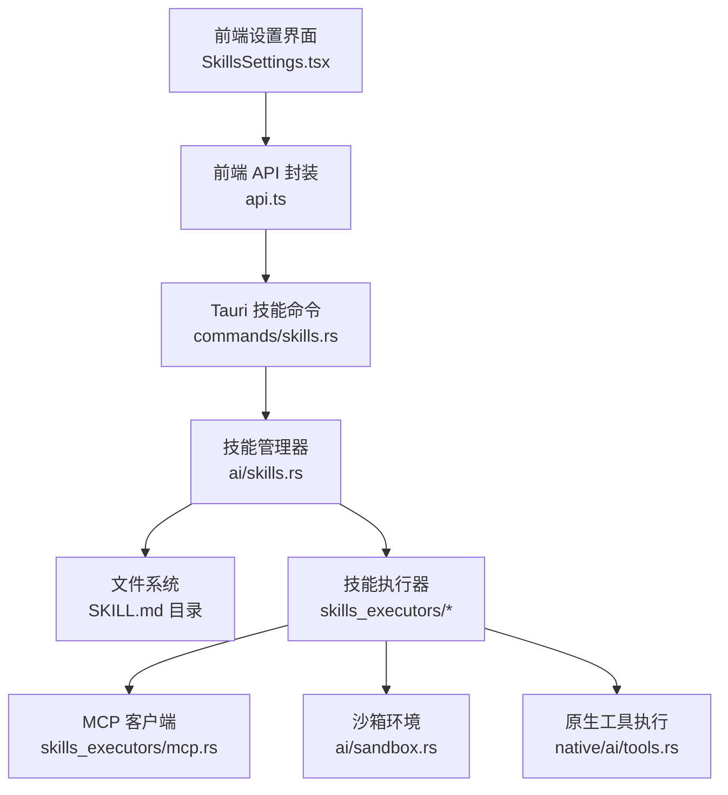
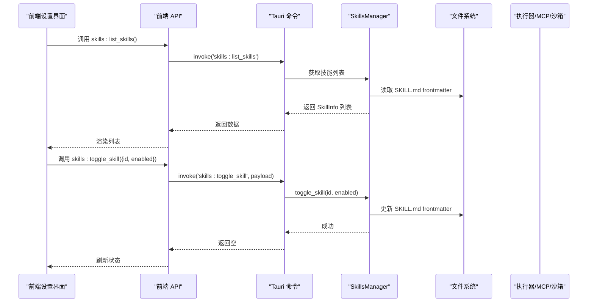
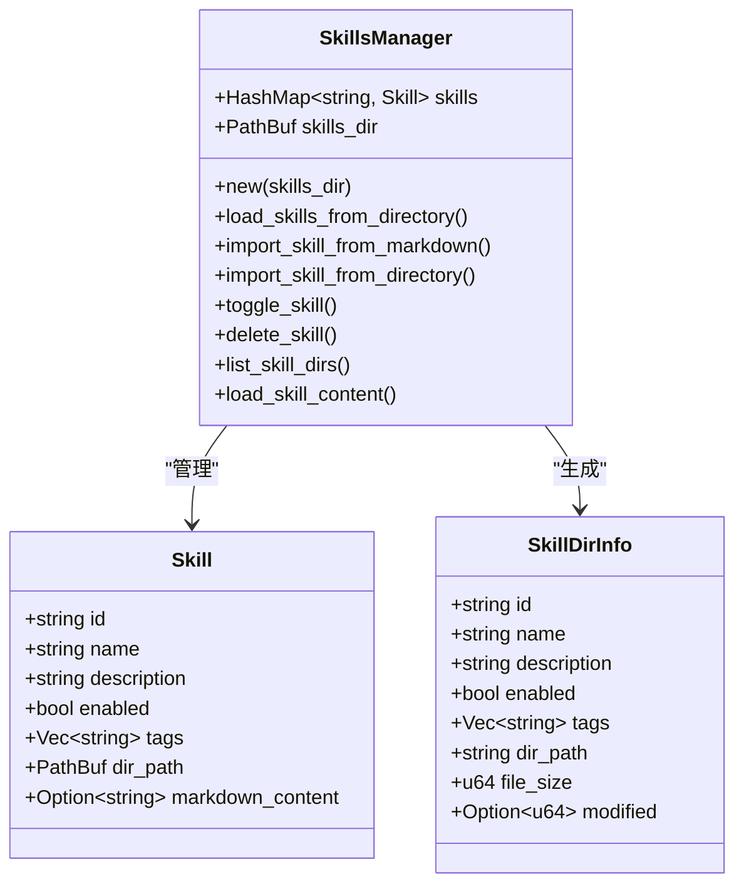
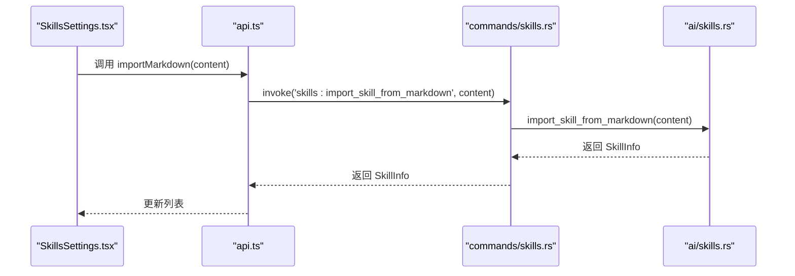
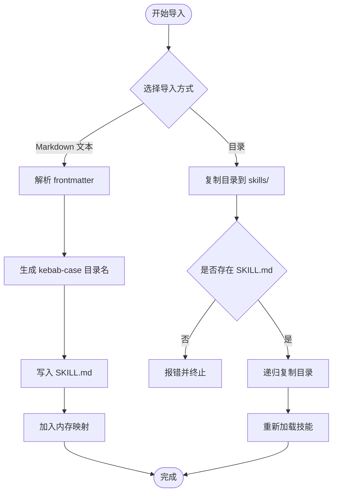
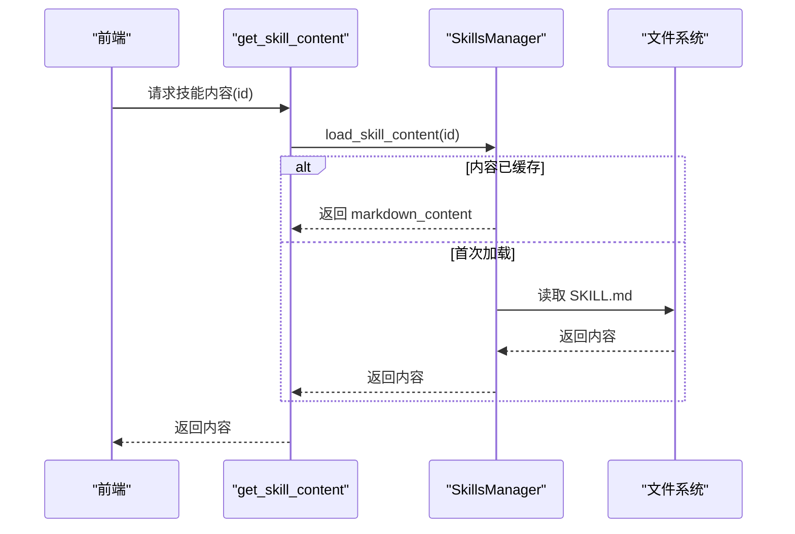
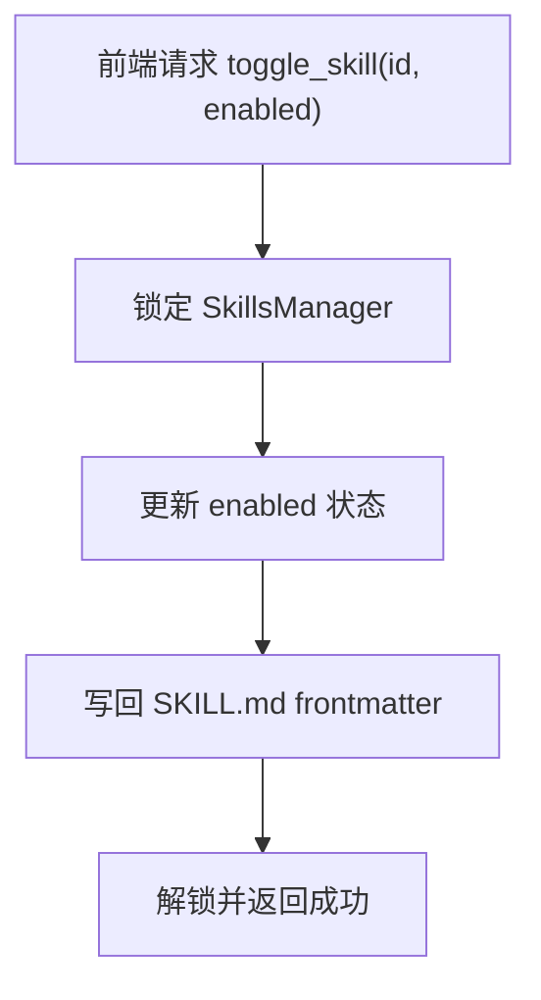
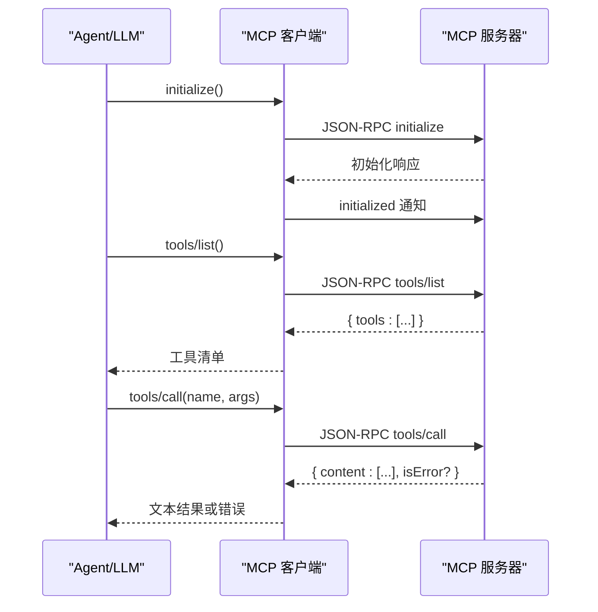
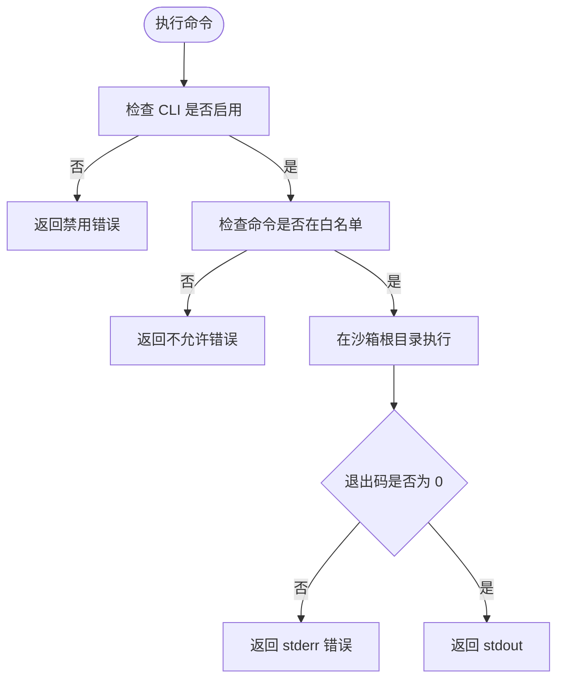
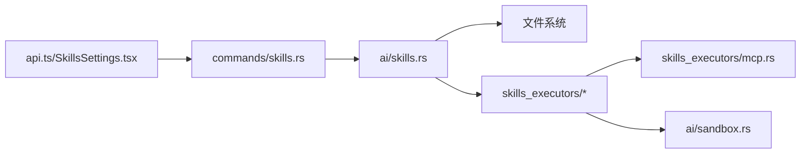

# 技能命令模块

<cite>
**本文引用的文件**
- [src-tauri/src/commands/skills.rs](file://src-tauri/src/commands/skills.rs)
- [src-tauri/src/ai/skills.rs](file://src-tauri/src/ai/skills.rs)
- [src-tauri/src/ai/skills_executors/mod.rs](file://src-tauri/src/ai/skills_executors/mod.rs)
- [src-tauri/src/ai/skills_executors/mcp.rs](file://src-tauri/src/ai/skills_executors/mcp.rs)
- [src-tauri/src/ai/sandbox.rs](file://src-tauri/src/ai/sandbox.rs)
- [src-tauri/src/ai/tools_impl/run_command.rs](file://src-tauri/src/ai/tools_impl/run_command.rs)
- [native/src/ai/tools.rs](file://native/src/ai/tools.rs)
- [src-web/src/lib/api.ts](file://src-web/src/lib/api.ts)
- [src-web/src/components/settings/SkillsSettings.tsx](file://src-web/src/components/settings/SkillsSettings.tsx)
- [examples/skills/python-calculator/SKILL.md](file://examples/skills/python-calculator/SKILL.md)
- [examples/skills/web-summarizer/SKILL.md](file://examples/skills/web-summarizer/SKILL.md)
</cite>

## 目录
1. [简介](#简介)
2. [项目结构](#项目结构)
3. [核心组件](#核心组件)
4. [架构总览](#架构总览)
5. [详细组件分析](#详细组件分析)
6. [依赖关系分析](#依赖关系分析)
7. [性能考虑](#性能考虑)
8. [故障排查指南](#故障排查指南)
9. [结论](#结论)
10. [附录](#附录)

## 简介
本文件面向 CoSurf 技能命令模块，系统性阐述技能管理命令的实现架构与数据模型，涵盖技能导入、查询、启用/禁用、执行控制等能力；同时说明技能与执行器的交互方式、沙箱隔离与资源限制、错误处理策略，并提供具体代码示例路径，帮助开发者快速理解与扩展。

## 项目结构
技能命令模块横跨 Tauri 后端、原生 Rust 能力层与前端设置界面，形成“命令层 → 管理器 → 执行器/沙箱”的分层架构。后端通过 Tauri 命令暴露技能 CRUD 与查询接口，管理器负责解析 SKILL.md、维护技能集合与目录信息，执行器负责与 MCP 服务器通信或在沙箱内执行受限命令，前端提供可视化导入、启用/禁用与内容预览。

**图表来源**
- [src-web/src/components/settings/SkillsSettings.tsx:1-549](file://src-web/src/components/settings/SkillsSettings.tsx#L1-L549)
- [src-web/src/lib/api.ts:371-412](file://src-web/src/lib/api.ts#L371-L412)
- [src-tauri/src/commands/skills.rs:1-152](file://src-tauri/src/commands/skills.rs#L1-L152)
- [src-tauri/src/ai/skills.rs:1-576](file://src-tauri/src/ai/skills.rs#L1-L576)
- [src-tauri/src/ai/skills_executors/mod.rs:1-6](file://src-tauri/src/ai/skills_executors/mod.rs#L1-L6)
- [src-tauri/src/ai/skills_executors/mcp.rs:1-558](file://src-tauri/src/ai/skills_executors/mcp.rs#L1-L558)
- [src-tauri/src/ai/sandbox.rs:1-251](file://src-tauri/src/ai/sandbox.rs#L1-L251)
- [native/src/ai/tools.rs:271-306](file://native/src/ai/tools.rs#L271-L306)

**章节来源**
- [src-tauri/src/commands/skills.rs:1-152](file://src-tauri/src/commands/skills.rs#L1-L152)
- [src-tauri/src/ai/skills.rs:1-576](file://src-tauri/src/ai/skills.rs#L1-L576)
- [src-tauri/src/ai/skills_executors/mod.rs:1-6](file://src-tauri/src/ai/skills_executors/mod.rs#L1-L6)
- [src-tauri/src/ai/skills_executors/mcp.rs:1-558](file://src-tauri/src/ai/skills_executors/mcp.rs#L1-L558)
- [src-tauri/src/ai/sandbox.rs:1-251](file://src-tauri/src/ai/sandbox.rs#L1-L251)
- [native/src/ai/tools.rs:271-306](file://native/src/ai/tools.rs#L271-L306)
- [src-web/src/lib/api.ts:371-412](file://src-web/src/lib/api.ts#L371-L412)
- [src-web/src/components/settings/SkillsSettings.tsx:1-549](file://src-web/src/components/settings/SkillsSettings.tsx#L1-L549)

## 核心组件
- 技能命令层（Tauri 命令）：提供 list_skills、delete_skill、toggle_skill、import_skill_from_markdown、import_skill_from_directory、list_skill_files、get_skill_content 等命令，封装状态访问与错误处理。
- 技能管理器：负责扫描 skills 目录、解析 SKILL.md frontmatter、懒加载完整内容、导入/删除/切换启用状态、生成目录信息。
- 技能执行器：当前聚焦 MCP 客户端，负责初始化连接、列举工具、调用工具与解析响应；命令工具函数提供跨平台命令解析与 PATH 增强。
- 沙箱环境：提供受限的 CLI 命令执行、网页内容/摘要/记忆的持久化与清理、白名单命令控制。
- 前端 API 与设置界面：通过 invoke 调用后端命令，提供技能列表、导入、启用/禁用、内容预览与目录浏览。

**章节来源**
- [src-tauri/src/commands/skills.rs:43-152](file://src-tauri/src/commands/skills.rs#L43-L152)
- [src-tauri/src/ai/skills.rs:84-576](file://src-tauri/src/ai/skills.rs#L84-L576)
- [src-tauri/src/ai/skills_executors/mcp.rs:92-558](file://src-tauri/src/ai/skills_executors/mcp.rs#L92-L558)
- [src-tauri/src/ai/skills_executors/command_utils.rs:1-95](file://src-tauri/src/ai/skills_executors/command_utils.rs#L1-L95)
- [src-tauri/src/ai/sandbox.rs:12-251](file://src-tauri/src/ai/sandbox.rs#L12-L251)
- [src-web/src/lib/api.ts:371-412](file://src-web/src/lib/api.ts#L371-L412)
- [src-web/src/components/settings/SkillsSettings.tsx:1-549](file://src-web/src/components/settings/SkillsSettings.tsx#L1-L549)

## 架构总览
技能命令模块采用“命令 → 管理器 → 执行器/沙箱”的分层设计。前端通过 API 层调用 Tauri 命令，命令层锁定 AppState 中的 SkillsManager，执行相应操作并返回结果。执行器负责与外部系统（MCP 服务）交互或在沙箱内执行受限命令，保障安全性与可控性。

**图表来源**
- [src-web/src/components/settings/SkillsSettings.tsx:1-549](file://src-web/src/components/settings/SkillsSettings.tsx#L1-L549)
- [src-web/src/lib/api.ts:371-412](file://src-web/src/lib/api.ts#L371-L412)
- [src-tauri/src/commands/skills.rs:43-90](file://src-tauri/src/commands/skills.rs#L43-L90)
- [src-tauri/src/ai/skills.rs:449-476](file://src-tauri/src/ai/skills.rs#L449-L476)

**章节来源**
- [src-tauri/src/commands/skills.rs:43-152](file://src-tauri/src/commands/skills.rs#L43-L152)
- [src-tauri/src/ai/skills.rs:296-357](file://src-tauri/src/ai/skills.rs#L296-L357)

## 详细组件分析

### 技能数据模型
- Skill：包含 id、name、description、enabled、tags、dir_path、markdown_content（懒加载）。frontmatter 由 SKILL.md 的 YAML 片段解析而来。
- SkillDirInfo：用于前端展示的目录信息，包含文件大小与修改时间等元数据。
- SkillMetadata：仅用于解析 frontmatter 的临时结构体。

**图表来源**
- [src-tauri/src/ai/skills.rs:24-88](file://src-tauri/src/ai/skills.rs#L24-L88)
- [src-tauri/src/ai/skills.rs:296-357](file://src-tauri/src/ai/skills.rs#L296-L357)

**章节来源**
- [src-tauri/src/ai/skills.rs:24-88](file://src-tauri/src/ai/skills.rs#L24-L88)
- [src-tauri/src/ai/skills.rs:521-549](file://src-tauri/src/ai/skills.rs#L521-L549)

### 技能命令与前端交互
- 前端通过 api.ts 的 invoke 调用后端命令，例如 skills:list_skills、skills:toggle_skill、skills:import_skill_from_markdown、skills:list_skill_files、skills:get_skill_content。
- 前端设置界面 SkillsSettings.tsx 负责渲染技能列表、导入弹窗、启用/禁用按钮、内容预览与删除确认。

**图表来源**
- [src-web/src/lib/api.ts:375-376](file://src-web/src/lib/api.ts#L375-L376)
- [src-tauri/src/commands/skills.rs:93-107](file://src-tauri/src/commands/skills.rs#L93-L107)
- [src-tauri/src/ai/skills.rs:412-447](file://src-tauri/src/ai/skills.rs#L412-L447)

**章节来源**
- [src-web/src/lib/api.ts:371-412](file://src-web/src/lib/api.ts#L371-L412)
- [src-web/src/components/settings/SkillsSettings.tsx:1-549](file://src-web/src/components/settings/SkillsSettings.tsx#L1-L549)
- [src-tauri/src/commands/skills.rs:93-152](file://src-tauri/src/commands/skills.rs#L93-L152)

### 技能导入与批量管理
- 从 Markdown 文本导入：解析 frontmatter，生成 kebab-case 目录名，写入 SKILL.md，并加入内存映射。
- 从目录导入：校验源目录下存在 SKILL.md，复制整个目录到 skills 目录，随后重新加载。
- 批量管理：通过 list_skill_files 获取目录列表，结合前端 UI 实现批量导入与删除。

**图表来源**
- [src-tauri/src/ai/skills.rs:412-447](file://src-tauri/src/ai/skills.rs#L412-L447)
- [src-tauri/src/ai/skills.rs:359-410](file://src-tauri/src/ai/skills.rs#L359-L410)

**章节来源**
- [src-tauri/src/ai/skills.rs:359-447](file://src-tauri/src/ai/skills.rs#L359-L447)

### 技能查询与懒加载
- 初始加载仅解析 frontmatter，避免大文件读取开销。
- 懒加载：按需读取完整 SKILL.md 内容，用于前端预览或工具暴露。

**图表来源**
- [src-tauri/src/commands/skills.rs:139-152](file://src-tauri/src/commands/skills.rs#L139-L152)
- [src-tauri/src/ai/skills.rs:261-272](file://src-tauri/src/ai/skills.rs#L261-L272)

**章节来源**
- [src-tauri/src/commands/skills.rs:139-152](file://src-tauri/src/commands/skills.rs#L139-L152)
- [src-tauri/src/ai/skills.rs:261-272](file://src-tauri/src/ai/skills.rs#L261-L272)

### 启用/禁用与状态持久化
- toggle_skill 更新内存中的 enabled 字段，并同步更新 SKILL.md frontmatter 的 enabled 值。
- 前端通过 skills:toggle_skill 触发，立即生效并在 UI 中反映。

**图表来源**
- [src-tauri/src/commands/skills.rs:76-90](file://src-tauri/src/commands/skills.rs#L76-L90)
- [src-tauri/src/ai/skills.rs:449-460](file://src-tauri/src/ai/skills.rs#L449-L460)

**章节来源**
- [src-tauri/src/commands/skills.rs:76-90](file://src-tauri/src/commands/skills.rs#L76-L90)
- [src-tauri/src/ai/skills.rs:449-460](file://src-tauri/src/ai/skills.rs#L449-L460)

### 技能执行器与 MCP 交互
- MCP 客户端支持 Streamable HTTP 与 SSE 两种传输模式，统一发送 JSON-RPC 请求并解析响应。
- 支持 initialize、tools/list、tools/call 等标准方法，工具调用返回文本内容或结构化 JSON。
- 前端可列出可用工具，后端负责与 MCP 服务器通信并返回结果。

**图表来源**
- [src-tauri/src/ai/skills_executors/mcp.rs:167-246](file://src-tauri/src/ai/skills_executors/mcp.rs#L167-L246)

**章节来源**
- [src-tauri/src/ai/skills_executors/mcp.rs:92-558](file://src-tauri/src/ai/skills_executors/mcp.rs#L92-L558)

### 沙箱隔离与资源限制
- 沙箱提供受限 CLI 命令执行：白名单命令、工作目录限制、失败时返回错误。
- 提供网页内容、摘要、记忆的持久化与清理能力，便于技能执行过程中的数据管理。
- 原生层提供命令超时与输出合并的执行工具，避免阻塞与乱码问题。

**图表来源**
- [src-tauri/src/ai/sandbox.rs:215-244](file://src-tauri/src/ai/sandbox.rs#L215-L244)
- [native/src/ai/tools.rs:271-295](file://native/src/ai/tools.rs#L271-L295)

**章节来源**
- [src-tauri/src/ai/sandbox.rs:12-251](file://src-tauri/src/ai/sandbox.rs#L12-L251)
- [native/src/ai/tools.rs:271-306](file://native/src/ai/tools.rs#L271-L306)

### 权限控制与安全策略
- 命令白名单：仅允许预设的安全命令执行，防止任意系统命令注入。
- 前端导入校验：导入目录必须包含 SKILL.md，否则拒绝导入。
- MCP 传输安全：支持自定义头部与 API Key，SSE 模式下通过 endpoint 限定 POST 地址。
- 原生工具执行：统一超时控制与输出合并，避免长时间阻塞。

**章节来源**
- [src-tauri/src/ai/sandbox.rs:215-244](file://src-tauri/src/ai/sandbox.rs#L215-L244)
- [src-tauri/src/ai/skills_executors/mcp.rs:111-144](file://src-tauri/src/ai/skills_executors/mcp.rs#L111-L144)
- [src-tauri/src/ai/skills.rs:359-410](file://src-tauri/src/ai/skills.rs#L359-L410)
- [native/src/ai/tools.rs:271-295](file://native/src/ai/tools.rs#L271-L295)

### 性能监控与版本管理机制
- 懒加载策略：仅在需要时读取 SKILL.md 正文，降低初始加载成本。
- 目录信息排序：按修改时间倒序，便于前端快速定位最新技能。
- 缓存与并发：参考重构文档中的缓存与并发限流思路，可在执行器层引入结果缓存与信号量控制，提升吞吐与稳定性。
- 版本管理：通过 SKILL.md 的修改时间字段记录版本变更，前端可据此提示更新。

**章节来源**
- [src-tauri/src/ai/skills.rs:261-272](file://src-tauri/src/ai/skills.rs#L261-L272)
- [src-tauri/src/ai/skills.rs:354-356](file://src-tauri/src/ai/skills.rs#L354-L356)
- [docs/技能引擎重构.md:536-584](file://docs/技能引擎重构.md#L536-L584)

## 依赖关系分析
- 命令层依赖状态中的 SkillsManager，通过互斥锁保证线程安全。
- 管理器依赖文件系统进行 SKILL.md 的读写与目录遍历。
- 执行器依赖 MCP 客户端与沙箱环境，前者负责外部工具调用，后者负责受限执行。
- 前端通过 API 封装与命令层解耦，便于替换后端实现。

**图表来源**
- [src-tauri/src/commands/skills.rs:1-152](file://src-tauri/src/commands/skills.rs#L1-L152)
- [src-tauri/src/ai/skills.rs:1-576](file://src-tauri/src/ai/skills.rs#L1-L576)
- [src-tauri/src/ai/skills_executors/mcp.rs:1-558](file://src-tauri/src/ai/skills_executors/mcp.rs#L1-L558)
- [src-tauri/src/ai/sandbox.rs:1-251](file://src-tauri/src/ai/sandbox.rs#L1-L251)
- [src-web/src/lib/api.ts:371-412](file://src-web/src/lib/api.ts#L371-L412)
- [src-web/src/components/settings/SkillsSettings.tsx:1-549](file://src-web/src/components/settings/SkillsSettings.tsx#L1-L549)

**章节来源**
- [src-tauri/src/commands/skills.rs:1-152](file://src-tauri/src/commands/skills.rs#L1-L152)
- [src-tauri/src/ai/skills.rs:1-576](file://src-tauri/src/ai/skills.rs#L1-L576)

## 性能考虑
- 懒加载：仅在需要时读取 SKILL.md 正文，减少 IO 与内存占用。
- 目录排序：按修改时间排序，提高前端检索效率。
- 并发与缓存：建议在执行器层引入并发信号量与结果缓存，避免重复执行与资源争用。
- 超时与输出：原生工具执行提供超时控制与输出合并，避免长时间阻塞与乱码。

[本节为通用指导，无需特定文件来源]

## 故障排查指南
- 导入失败：检查源目录是否包含 SKILL.md，确认 frontmatter 格式正确。
- 启用/禁用无效：确认后端已更新 SKILL.md frontmatter，前端刷新后重试。
- MCP 连接失败：检查服务器地址、传输模式（Streamable HTTP/SSE）、自定义头部与 API Key。
- 命令执行失败：确认命令在白名单中，查看 stderr 输出定位问题。
- 前端无响应：检查 invoke 调用链路与命令注册，确认后端日志无异常。

**章节来源**
- [src-tauri/src/ai/skills.rs:359-410](file://src-tauri/src/ai/skills.rs#L359-L410)
- [src-tauri/src/ai/skills_executors/mcp.rs:167-198](file://src-tauri/src/ai/skills_executors/mcp.rs#L167-L198)
- [src-tauri/src/ai/sandbox.rs:215-244](file://src-tauri/src/ai/sandbox.rs#L215-L244)
- [native/src/ai/tools.rs:271-295](file://native/src/ai/tools.rs#L271-L295)

## 结论
技能命令模块通过清晰的分层设计实现了“导入 → 查询 → 启用/禁用 → 执行”的完整闭环。管理器负责数据与目录层面的职责，执行器负责与外部系统交互，沙箱提供安全边界。前端通过统一 API 与命令层对接，形成良好的可扩展性与可维护性。后续可在执行器层引入缓存与并发控制，进一步提升性能与稳定性。

[本节为总结性内容，无需特定文件来源]

## 附录
- 示例技能文件（SKILL.md）展示了 frontmatter 与正文规范，可用于理解技能描述与使用说明的组织方式。
- 命令工具函数提供跨平台命令解析与 PATH 增强，有助于在不同操作系统上稳定执行外部命令。

**章节来源**
- [examples/skills/python-calculator/SKILL.md:1-39](file://examples/skills/python-calculator/SKILL.md#L1-L39)
- [examples/skills/web-summarizer/SKILL.md:1-57](file://examples/skills/web-summarizer/SKILL.md#L1-L57)
- [src-tauri/src/ai/skills_executors/command_utils.rs:1-95](file://src-tauri/src/ai/skills_executors/command_utils.rs#L1-L95)