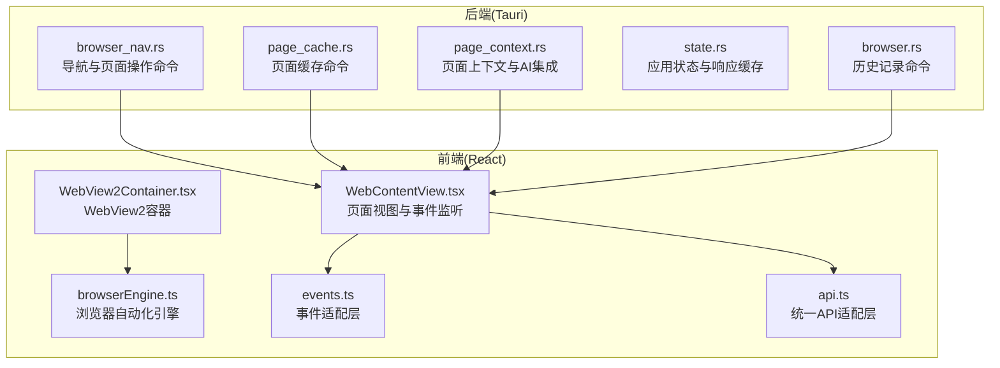
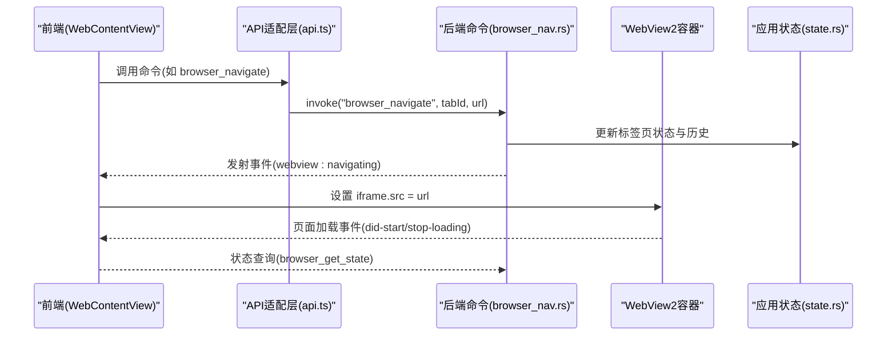
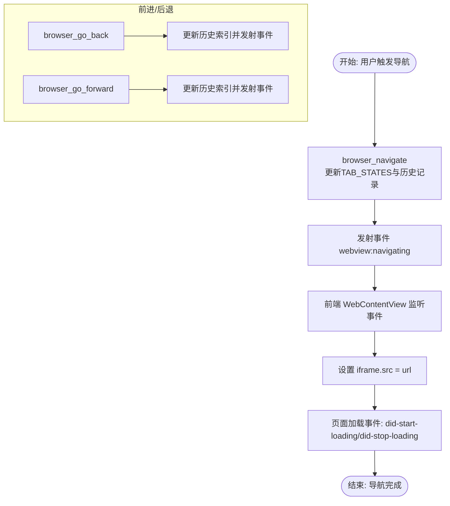
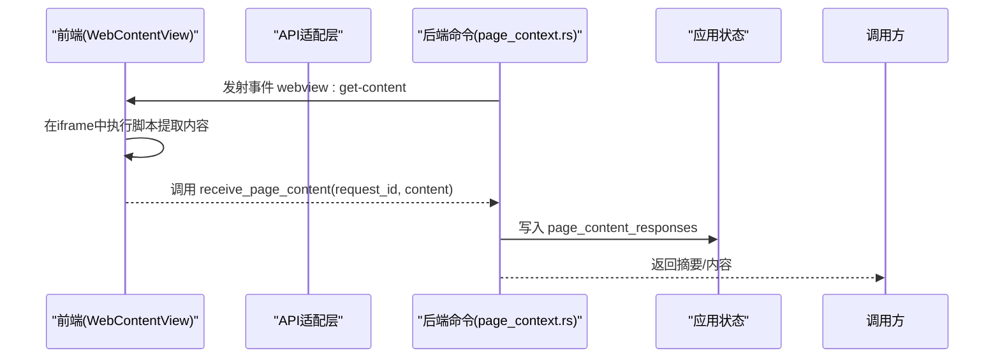
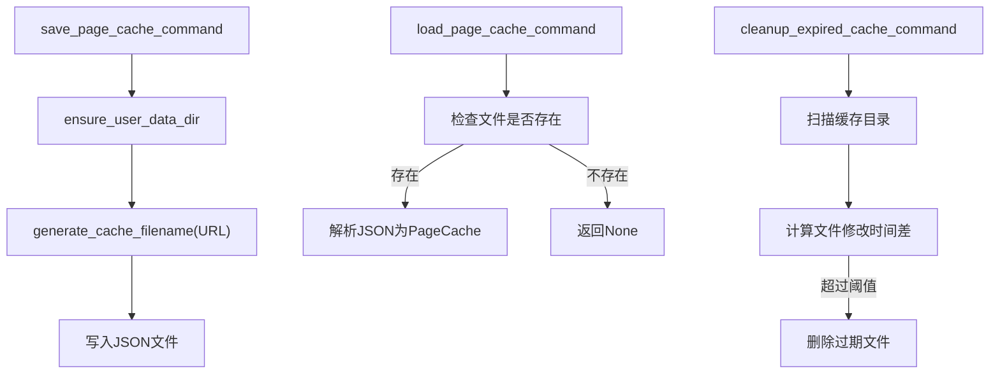
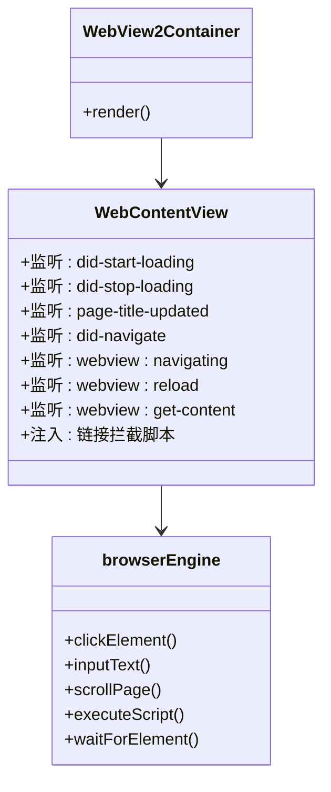
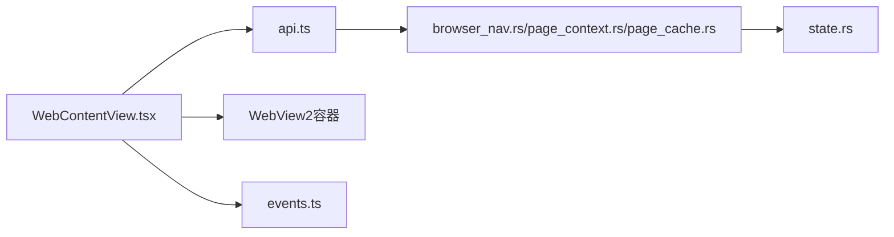

# 浏览器命令模块

<cite>
**本文档引用的文件**
- [browser.rs](file://src-tauri/src/commands/browser.rs)
- [browser_nav.rs](file://src-tauri/src/commands/browser_nav.rs)
- [page_cache.rs](file://src-tauri/src/commands/page_cache.rs)
- [page_context.rs](file://src-tauri/src/commands/page_context.rs)
- [state.rs](file://src-tauri/src/state.rs)
- [WebContentView.tsx](file://src-web/src/components/layout/WebContentView.tsx)
- [browserEngine.ts](file://src-web/src/lib/browserEngine.ts)
- [events.ts](file://src-web/src/lib/events.ts)
- [api.ts](file://src-web/src/lib/api.ts)
- [WebView2Container.tsx](file://src-web/src/components/layout/WebView2Container.tsx)
- [SUMMARIZE_PAGE_OPTIMIZATION.md](file://SUMMARIZE_PAGE_OPTIMIZATION.md)
</cite>

## 目录
1. [简介](#简介)
2. [项目结构](#项目结构)
3. [核心组件](#核心组件)
4. [架构总览](#架构总览)
5. [详细组件分析](#详细组件分析)
6. [依赖关系分析](#依赖关系分析)
7. [性能考量](#性能考量)
8. [故障排除指南](#故障排除指南)
9. [结论](#结论)

## 简介
本文件系统性梳理 CoSurf 浏览器命令模块的实现架构与运行机制，覆盖页面加载、导航控制、页面状态管理、与 WebView2 内核交互、JavaScript 注入与事件监听、导航命令实现（前进/后退/刷新/跳转/历史记录）、页面缓存策略、性能优化与内存管理最佳实践。文档同时提供调用方式、参数配置与状态查询的示例路径，并通过可视化图表帮助读者快速理解前后端协作流程。

## 项目结构
浏览器命令模块主要分布在以下两个层面：
- 后端（Tauri/Rust）：提供浏览器命令、页面上下文与缓存管理、状态持久化等能力
- 前端（React/TypeScript）：负责 WebView2 容器渲染、事件监听、页面内容提取、脚本注入与用户交互

**图表来源**
- [browser_nav.rs:1-532](file://src-tauri/src/commands/browser_nav.rs#L1-L532)
- [page_cache.rs:1-275](file://src-tauri/src/commands/page_cache.rs#L1-L275)
- [page_context.rs:1-327](file://src-tauri/src/commands/page_context.rs#L1-L327)
- [state.rs:1-81](file://src-tauri/src/state.rs#L1-L81)
- [WebView2Container.tsx:1-13](file://src-web/src/components/layout/WebView2Container.tsx#L1-L13)
- [WebContentView.tsx:1-1024](file://src-web/src/components/layout/WebContentView.tsx#L1-L1024)
- [browserEngine.ts:1-521](file://src-web/src/lib/browserEngine.ts#L1-L521)
- [events.ts:1-83](file://src-web/src/lib/events.ts#L1-L83)
- [api.ts:1-445](file://src-web/src/lib/api.ts#L1-L445)

**章节来源**
- [browser_nav.rs:1-532](file://src-tauri/src/commands/browser_nav.rs#L1-L532)
- [page_cache.rs:1-275](file://src-tauri/src/commands/page_cache.rs#L1-L275)
- [page_context.rs:1-327](file://src-tauri/src/commands/page_context.rs#L1-L327)
- [state.rs:1-81](file://src-tauri/src/state.rs#L1-L81)
- [WebView2Container.tsx:1-13](file://src-web/src/components/layout/WebView2Container.tsx#L1-L13)
- [WebContentView.tsx:1-1024](file://src-web/src/components/layout/WebContentView.tsx#L1-L1024)
- [browserEngine.ts:1-521](file://src-web/src/lib/browserEngine.ts#L1-L521)
- [events.ts:1-83](file://src-web/src/lib/events.ts#L1-L83)
- [api.ts:1-445](file://src-web/src/lib/api.ts#L1-L445)

## 核心组件
- 导航与页面操作命令：提供浏览器导航、前进/后退、刷新、脚本执行、页面内容提取、元素选择与点击、滚动等能力
- 页面上下文与AI集成：提供页面上下文构建、AI对话注入、页面总结等
- 页面缓存：提供页面内容的文件缓存、过期清理与命令接口
- 应用状态：维护页面内容响应缓存、活跃标签页ID等全局状态
- WebView2 容器与事件监听：负责页面渲染、事件监听、脚本注入与跨域处理

**章节来源**
- [browser_nav.rs:32-277](file://src-tauri/src/commands/browser_nav.rs#L32-L277)
- [page_context.rs:21-233](file://src-tauri/src/commands/page_context.rs#L21-L233)
- [page_cache.rs:10-159](file://src-tauri/src/commands/page_cache.rs#L10-L159)
- [state.rs:9-23](file://src-tauri/src/state.rs#L9-L23)
- [WebContentView.tsx:417-768](file://src-web/src/components/layout/WebContentView.tsx#L417-L768)

## 架构总览
浏览器命令模块采用“后端命令 + 前端事件监听”的架构，后端通过 Tauri 命令暴露能力，前端通过事件与 IPC 与 WebView2 交互，实现页面生命周期管理、JavaScript 注入与事件监听。

**图表来源**
- [WebContentView.tsx:654-742](file://src-web/src/components/layout/WebContentView.tsx#L654-L742)
- [browser_nav.rs:32-206](file://src-tauri/src/commands/browser_nav.rs#L32-L206)
- [state.rs:9-23](file://src-tauri/src/state.rs#L9-L23)
- [api.ts:293-320](file://src-web/src/lib/api.ts#L293-L320)

## 详细组件分析

### 导航与页面操作命令
- 导航控制：browser_navigate、browser_go_back、browser_go_forward、browser_reload、browser_get_state、browser_close_tab
- 页面内容与脚本：browser_execute_script、browser_get_page_content、browser_screenshot（占位）
- 元素交互：browser_toggle_select_mode、browser_click_element、browser_input_text、browser_scroll
- 标签页管理：set_active_tab、get_webview_title（HTTP 获取标题）

**图表来源**
- [browser_nav.rs:32-220](file://src-tauri/src/commands/browser_nav.rs#L32-L220)
- [WebContentView.tsx:654-742](file://src-web/src/components/layout/WebContentView.tsx#L654-L742)

**章节来源**
- [browser_nav.rs:32-220](file://src-tauri/src/commands/browser_nav.rs#L32-L220)
- [WebContentView.tsx:654-742](file://src-web/src/components/layout/WebContentView.tsx#L654-L742)

### 页面上下文与AI集成
- get_page_context：从前端获取标签页信息，构建页面上下文（URL、标题、域名、安全标识、摘要）
- inject_page_context：向 AI 对话注入页面上下文提示词
- summarize_page：提取页面内容并截断，返回给调用方
- receive_page_content：接收前端返回的页面内容，写入响应缓存

**图表来源**
- [page_context.rs:21-233](file://src-tauri/src/commands/page_context.rs#L21-L233)
- [WebContentView.tsx:677-735](file://src-web/src/components/layout/WebContentView.tsx#L677-L735)
- [state.rs:14-15](file://src-tauri/src/state.rs#L14-L15)

**章节来源**
- [page_context.rs:21-233](file://src-tauri/src/commands/page_context.rs#L21-L233)
- [WebContentView.tsx:677-735](file://src-web/src/components/layout/WebContentView.tsx#L677-L735)
- [state.rs:14-15](file://src-tauri/src/state.rs#L14-L15)

### 页面缓存策略
- PageCache 数据结构：url、title、content、timestamp、content_length
- 缓存目录：用户数据目录下的 pages 子目录，文件名为 URL 的 SHA256 哈希
- 命令接口：save_page_cache_command、load_page_cache_command、cleanup_expired_cache_command
- 过期清理：默认 24 小时，可配置最大年龄

**图表来源**
- [page_cache.rs:10-159](file://src-tauri/src/commands/page_cache.rs#L10-L159)

**章节来源**
- [page_cache.rs:10-159](file://src-tauri/src/commands/page_cache.rs#L10-L159)

### WebView2 容器与事件监听
- WebView2Container：使用 WebContentView 渲染页面
- WebContentView：监听 webview 事件（加载、标题更新、导航、新窗口），处理跨域与 shell.open 权限，注入链接拦截脚本
- browserEngine：提供元素选择、点击、输入、滚动、脚本执行等自动化能力

**图表来源**
- [WebView2Container.tsx:1-13](file://src-web/src/components/layout/WebView2Container.tsx#L1-L13)
- [WebContentView.tsx:1-1024](file://src-web/src/components/layout/WebContentView.tsx#L1-L1024)
- [browserEngine.ts:1-521](file://src-web/src/lib/browserEngine.ts#L1-L521)

**章节来源**
- [WebView2Container.tsx:1-13](file://src-web/src/components/layout/WebView2Container.tsx#L1-L13)
- [WebContentView.tsx:1-1024](file://src-web/src/components/layout/WebContentView.tsx#L1-L1024)
- [browserEngine.ts:1-521](file://src-web/src/lib/browserEngine.ts#L1-L521)

### 历史记录与数据库集成
- 列表/搜索/添加/清空/删除历史记录命令
- 与数据库交互，提供分页与错误处理

**章节来源**
- [browser.rs:8-64](file://src-tauri/src/commands/browser.rs#L8-L64)

## 依赖关系分析
- 后端命令依赖应用状态（AppState）进行全局状态管理
- 前端通过事件适配层(events.ts)与 API 适配层(api.ts)与后端通信
- WebView2 容器与页面视图负责与浏览器内核交互

**图表来源**
- [api.ts:293-343](file://src-web/src/lib/api.ts#L293-L343)
- [browser_nav.rs:1-532](file://src-tauri/src/commands/browser_nav.rs#L1-L532)
- [page_context.rs:1-327](file://src-tauri/src/commands/page_context.rs#L1-L327)
- [page_cache.rs:1-275](file://src-tauri/src/commands/page_cache.rs#L1-L275)
- [state.rs:1-81](file://src-tauri/src/state.rs#L1-L81)
- [WebContentView.tsx:1-1024](file://src-web/src/components/layout/WebContentView.tsx#L1-L1024)
- [events.ts:1-83](file://src-web/src/lib/events.ts#L1-L83)

**章节来源**
- [api.ts:293-343](file://src-web/src/lib/api.ts#L293-L343)
- [browser_nav.rs:1-532](file://src-tauri/src/commands/browser_nav.rs#L1-L532)
- [page_context.rs:1-327](file://src-tauri/src/commands/page_context.rs#L1-L327)
- [page_cache.rs:1-275](file://src-tauri/src/commands/page_cache.rs#L1-L275)
- [state.rs:1-81](file://src-tauri/src/state.rs#L1-L81)
- [WebContentView.tsx:1-1024](file://src-web/src/components/layout/WebContentView.tsx#L1-L1024)
- [events.ts:1-83](file://src-web/src/lib/events.ts#L1-L83)

## 性能考量
- 页面内容提取优化：通过请求-响应机制与超时控制，避免无限等待；跨域限制时返回空内容并提示
- 内存管理：响应处理后立即从缓存中删除，避免内存泄漏
- 缓存策略：对相同 URL 的内容进行文件缓存，设置合理过期时间，减少重复提取
- WebView2 焦点与加载优化：在标签激活时进行多级焦点处理与加载超时保护，提升用户体验

**章节来源**
- [SUMMARIZE_PAGE_OPTIMIZATION.md:89-101](file://SUMMARIZE_PAGE_OPTIMIZATION.md#L89-L101)
- [WebContentView.tsx:490-651](file://src-web/src/components/layout/WebContentView.tsx#L490-L651)
- [page_cache.rs:127-159](file://src-tauri/src/commands/page_cache.rs#L127-L159)

## 故障排除指南
- 页面内容提取失败
  - 现象：跨域限制导致无法访问 iframe 内容
  - 处理：前端捕获错误并发送空内容；后端返回用户友好提示
- 导航事件未生效
  - 现象：前端未收到 webview:navigating 事件
  - 处理：确认后端已发射事件并检查前端监听逻辑
- 标签页焦点问题
  - 现象：页面加载后无法获取焦点
  - 处理：使用 requestAnimationFrame 与多级焦点策略，必要时设置超时保护

**章节来源**
- [WebContentView.tsx:677-735](file://src-web/src/components/layout/WebContentView.tsx#L677-L735)
- [WebContentView.tsx:490-651](file://src-web/src/components/layout/WebContentView.tsx#L490-L651)
- [SUMMARIZE_PAGE_OPTIMIZATION.md:98-101](file://SUMMARIZE_PAGE_OPTIMIZATION.md#L98-L101)

## 结论
浏览器命令模块通过清晰的后端命令与前端事件监听架构，实现了对 WebView2 内核的高效控制与页面生命周期管理。结合页面上下文与缓存策略，模块在保证安全性的同时提升了性能与可用性。未来可在 IPC 直接通信、浏览器扩展集成与 Playwright 集成等方面进一步优化，以更好地应对跨域与复杂页面场景。