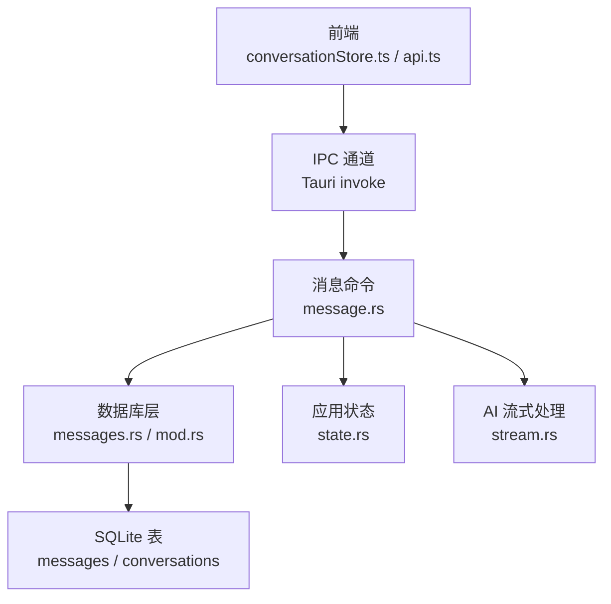
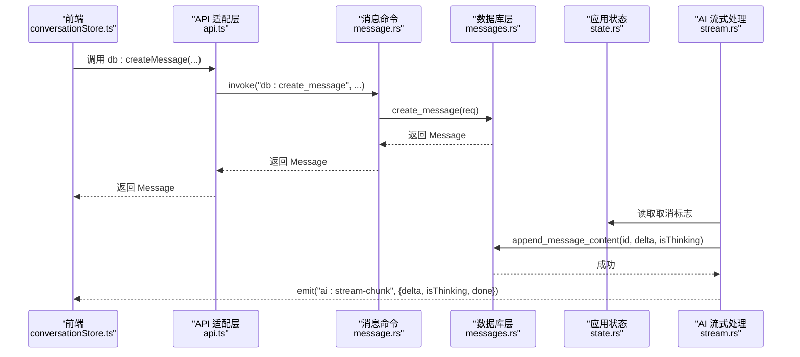
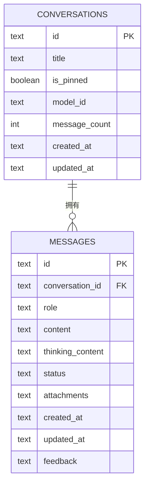
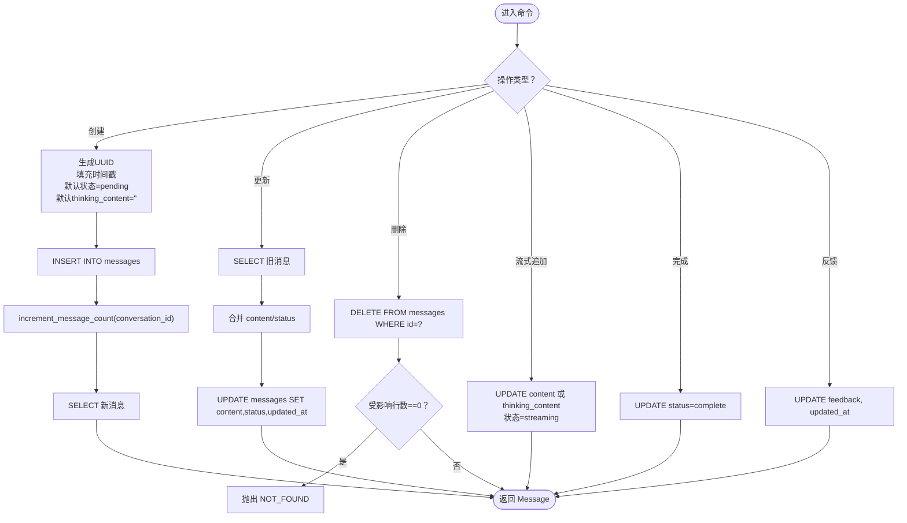
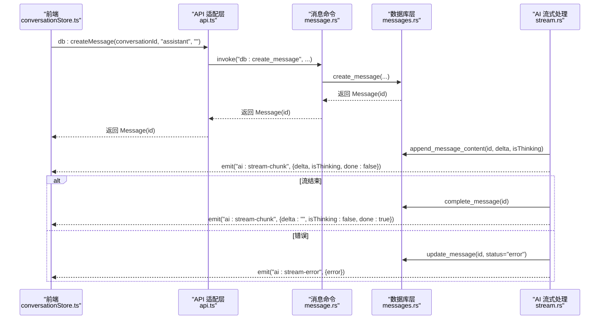
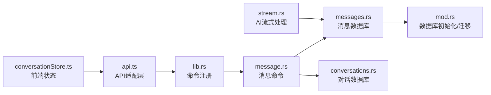

# 消息命令模块

<cite>
**本文引用的文件**
- [message.rs](file://src-tauri/src/commands/message.rs)
- [messages.rs](file://src-tauri/src/db/messages.rs)
- [mod.rs](file://src-tauri/src/db/mod.rs)
- [conversations.rs](file://src-tauri/src/db/conversations.rs)
- [lib.rs](file://src-tauri/src/lib.rs)
- [stream.rs](file://src-tauri/src/ai/stream.rs)
- [conversationStore.ts](file://src-web/src/stores/conversationStore.ts)
- [message.ts](file://packages/shared/src/message.ts)
- [api.ts](file://src-web/src/lib/api.ts)
- [error.rs](file://src-tauri/src/error.rs)
- [state.rs](file://src-tauri/src/state.rs)
</cite>

## 目录
1. [简介](#简介)
2. [项目结构](#项目结构)
3. [核心组件](#核心组件)
4. [架构总览](#架构总览)
5. [详细组件分析](#详细组件分析)
6. [依赖关系分析](#依赖关系分析)
7. [性能考虑](#性能考虑)
8. [故障排查指南](#故障排查指南)
9. [结论](#结论)
10. [附录](#附录)

## 简介
本文件面向 CoSurf 的消息命令模块，系统性阐述消息管理命令的实现架构与数据模型设计，覆盖消息的创建、查询、更新、删除等 CRUD 操作；解释消息与对话之间的关联机制（外键约束、级联删除、数据完整性）；并提供消息流式处理、实时同步与缓存策略的技术细节。文档同时给出关键流程的时序图与类图，帮助读者快速理解端到端的消息生命周期。

## 项目结构
消息命令模块位于 Rust 后端的 Tauri 命令体系中，数据库访问由独立的 SQLite 层负责，前端通过统一 API 适配层进行调用。整体分层如下：
- 前端层：Zustand 状态管理、事件监听、统一 API 适配层
- 后端层：Tauri 命令注册、消息命令处理器、数据库访问层、AI 流式处理
- 数据层：SQLite 表结构、迁移与约束、索引

图表来源
- [lib.rs:108-214](file://src-tauri/src/lib.rs#L108-L214)
- [message.rs:1-99](file://src-tauri/src/commands/message.rs#L1-L99)
- [messages.rs:64-198](file://src-tauri/src/db/messages.rs#L64-L198)
- [mod.rs:41-148](file://src-tauri/src/db/mod.rs#L41-L148)
- [stream.rs:77-283](file://src-tauri/src/ai/stream.rs#L77-L283)

章节来源
- [lib.rs:108-214](file://src-tauri/src/lib.rs#L108-L214)
- [message.rs:1-99](file://src-tauri/src/commands/message.rs#L1-L99)
- [messages.rs:64-198](file://src-tauri/src/db/messages.rs#L64-L198)
- [mod.rs:41-148](file://src-tauri/src/db/mod.rs#L41-L148)

## 核心组件
- 消息命令处理器：提供 list_messages、get_message、create_message、update_message、delete_message、append_message_content、complete_message、set_message_feedback 等命令。
- 数据库访问层：封装 SQL 查询、插入、更新、删除逻辑，并维护消息与对话的外键关系。
- AI 流式处理：负责将流式增量内容写入数据库并向前端广播，实现实时同步。
- 前端状态与 API：负责本地状态管理、事件订阅、消息持久化与标题自动生成。

章节来源
- [message.rs:7-99](file://src-tauri/src/commands/message.rs#L7-L99)
- [messages.rs:64-198](file://src-tauri/src/db/messages.rs#L64-L198)
- [stream.rs:641-778](file://src-tauri/src/ai/stream.rs#L641-L778)
- [conversationStore.ts:103-304](file://src-web/src/stores/conversationStore.ts#L103-L304)
- [api.ts:74-98](file://src-web/src/lib/api.ts#L74-L98)

## 架构总览
消息模块采用“命令-数据库-状态-事件”四层协作模式：
- 命令层：接收前端调用，校验参数，委托数据库层执行业务逻辑。
- 数据库层：负责消息与对话的增删改查、外键约束与索引优化。
- 状态层：持有数据库实例与取消标志，支撑 AI 流式处理的中断与完成标记。
- 事件层：将流式片段与错误事件推送到前端，实现前端实时渲染。

图表来源
- [conversationStore.ts:103-243](file://src-web/src/stores/conversationStore.ts#L103-L243)
- [api.ts:81-97](file://src-web/src/lib/api.ts#L81-L97)
- [message.rs:25-57](file://src-tauri/src/commands/message.rs#L25-L57)
- [messages.rs:122-135](file://src-tauri/src/db/messages.rs#L122-L135)
- [stream.rs:641-674](file://src-tauri/src/ai/stream.rs#L641-L674)
- [state.rs:9-23](file://src-tauri/src/state.rs#L9-L23)

## 详细组件分析

### 消息数据模型与表结构
消息数据模型在前后端保持一致，包含以下关键字段：
- 标识与归属：id、conversationId
- 角色与内容：role、content、thinkingContent
- 状态与反馈：status、feedback
- 时间戳：createdAt、updatedAt
- 附件：attachments（数组）

数据库表结构与约束：
- messages 表：主键 id，外键 conversation_id 引用 conversations(id)，级联删除；对 conversation_id 建有索引；status 与 role 设有 CHECK 约束。
- conversations 表：记录对话标题、置顶、模型、消息计数等信息；消息计数通过数据库层递增。

图表来源
- [mod.rs:54-67](file://src-tauri/src/db/mod.rs#L54-L67)
- [conversations.rs:34-125](file://src-tauri/src/db/conversations.rs#L34-L125)
- [messages.rs:22-36](file://src-tauri/src/db/messages.rs#L22-L36)

章节来源
- [message.ts:14-26](file://packages/shared/src/message.ts#L14-L26)
- [messages.rs:22-36](file://src-tauri/src/db/messages.rs#L22-L36)
- [mod.rs:54-67](file://src-tauri/src/db/mod.rs#L54-L67)

### 消息 CRUD 命令实现
- 列表与详情：list_messages 按 conversation_id 排序查询；get_message 按 id 查询并反序列化 attachments。
- 创建：create_message 生成 UUID、填充时间戳、默认状态为 pending、默认 thinking_content 为空、默认 feedback 为空；随后递增对话消息计数。
- 更新：update_message 支持 content 与 status 的可选更新，其余字段沿用旧值；统一更新 updated_at。
- 删除：delete_message 删除指定 id 的消息，若影响行数为 0 则抛出未找到错误。
- 流式追加：append_message_content 根据 isThinking 决定更新 content 或 thinking_content，同时将状态置为 streaming。
- 完成：complete_message 将状态置为 complete。
- 反馈：set_message_feedback 更新 feedback 并刷新 updated_at。

图表来源
- [message.rs:7-99](file://src-tauri/src/commands/message.rs#L7-L99)
- [messages.rs:122-196](file://src-tauri/src/db/messages.rs#L122-L196)

章节来源
- [message.rs:7-99](file://src-tauri/src/commands/message.rs#L7-L99)
- [messages.rs:64-198](file://src-tauri/src/db/messages.rs#L64-L198)

### 消息与对话的关联与完整性
- 外键约束：messages.conversation_id 引用 conversations.id，并设置 ON DELETE CASCADE，确保删除对话时自动删除其所有消息。
- 索引优化：messages 上对 conversation_id 建有索引，提升按对话查询的性能。
- 数据一致性：创建消息后通过 increment_message_count 原子性地更新对话的消息计数，保证统计准确。
- 级联删除：删除 conversations 时，相关消息将被自动清理，避免悬挂数据。

章节来源
- [mod.rs:64-67](file://src-tauri/src/db/mod.rs#L64-L67)
- [conversations.rs:119-125](file://src-tauri/src/db/conversations.rs#L119-L125)

### 流式处理与实时同步
- 前端行为：前端在发送消息时先本地创建一条临时 assistant 消息，然后通过 db.createMessage 持久化；随后监听 ai:stream-chunk 事件，将增量内容追加到本地消息列表；当 done=true 时标记为 complete 并停止监听。
- 后端行为：AI 流式处理在收到增量时，调用 save_chunk_to_db 将 delta 追加到数据库对应字段（content 或 thinking_content），并通过 emit_chunk 将事件广播到前端。
- 取消与错误：若用户取消生成，后端会发送完成信号并标记消息为 complete；若发生错误，会发送 ai:stream-error 事件并标记状态为 error。

图表来源
- [conversationStore.ts:103-243](file://src-web/src/stores/conversationStore.ts#L103-L243)
- [api.ts:81-97](file://src-web/src/lib/api.ts#L81-L97)
- [messages.rs:152-175](file://src-tauri/src/db/messages.rs#L152-L175)
- [stream.rs:641-714](file://src-tauri/src/ai/stream.rs#L641-L714)

章节来源
- [conversationStore.ts:103-304](file://src-web/src/stores/conversationStore.ts#L103-L304)
- [stream.rs:379-570](file://src-tauri/src/ai/stream.rs#L379-L570)

### 缓存策略与性能优化
- WAL 模式：数据库初始化时启用 WAL，提升并发读写性能。
- 外键约束：开启 foreign_keys=ON，确保参照完整性。
- 索引：messages(conversation_id) 索引加速按对话查询。
- 迁移与兼容：动态检查并添加缺失列（如 thinking_content、feedback），并迁移旧数据至新字段，保证向后兼容。
- 事务与原子性：命令层通过锁保护数据库访问，避免并发冲突；流式写入在单次事件内原子更新字段。

章节来源
- [mod.rs:24-25](file://src-tauri/src/db/mod.rs#L24-L25)
- [mod.rs:150-170](file://src-tauri/src/db/mod.rs#L150-L170)
- [mod.rs:217-233](file://src-tauri/src/db/mod.rs#L217-L233)
- [message.rs:9-13](file://src-tauri/src/commands/message.rs#L9-L13)

### 错误处理与状态管理
- 错误类型：统一映射为 ErrorResponse，包含 code 与 message，便于前端识别与展示。
- 状态标志：AppState 中的 cancel_flag 用于 AI 流式处理的取消控制。
- 命令层锁：命令函数通过 Mutex 保护数据库访问，避免并发问题。

章节来源
- [error.rs:41-63](file://src-tauri/src/error.rs#L41-L63)
- [state.rs:9-23](file://src-tauri/src/state.rs#L9-L23)
- [message.rs:9-13](file://src-tauri/src/commands/message.rs#L9-L13)

## 依赖关系分析
消息命令模块的关键依赖关系如下：
- 命令注册：lib.rs 中集中注册消息命令，供前端通过 invoke 调用。
- 数据访问：commands/message.rs 依赖 db/messages.rs 的结构体与方法。
- 数据库初始化：db/mod.rs 定义表结构、索引与迁移逻辑。
- AI 协作：stream.rs 通过 save_chunk_to_db 与 complete_message 与消息模块交互。
- 前端集成：conversationStore.ts 与 api.ts 作为消息模块的前端入口。

图表来源
- [lib.rs:108-214](file://src-tauri/src/lib.rs#L108-L214)
- [message.rs:1-99](file://src-tauri/src/commands/message.rs#L1-L99)
- [messages.rs:1-198](file://src-tauri/src/db/messages.rs#L1-L198)
- [conversations.rs:1-127](file://src-tauri/src/db/conversations.rs#L1-L127)
- [mod.rs:41-148](file://src-tauri/src/db/mod.rs#L41-L148)
- [stream.rs:641-778](file://src-tauri/src/ai/stream.rs#L641-L778)
- [conversationStore.ts:1-365](file://src-web/src/stores/conversationStore.ts#L1-L365)
- [api.ts:54-98](file://src-web/src/lib/api.ts#L54-L98)

章节来源
- [lib.rs:108-214](file://src-tauri/src/lib.rs#L108-L214)
- [message.rs:1-99](file://src-tauri/src/commands/message.rs#L1-L99)
- [messages.rs:1-198](file://src-tauri/src/db/messages.rs#L1-L198)
- [mod.rs:41-148](file://src-tauri/src/db/mod.rs#L41-L148)

## 性能考虑
- 查询优化：messages(conversation_id) 索引显著降低按对话检索消息的成本。
- 写入优化：WAL 模式减少写入阻塞，提高并发吞吐。
- 流式写入：增量追加 content 或 thinking_content，避免大对象频繁更新。
- 状态切换：流式过程中统一设置 status=streaming，完成后一次性标记 complete，减少中间状态写入。
- 前端渲染：本地预渲染临时 assistant 消息，结合事件流实现低延迟显示。

## 故障排查指南
- 未找到消息：当删除或更新不存在的消息时，数据库层会返回未找到错误；前端应提示用户刷新或检查消息 ID。
- 数据库锁：命令层对数据库访问加锁，若出现锁错误，需检查并发调用或长时间事务。
- 流式中断：若用户取消生成，后端会发送完成信号并标记 complete；前端应确保及时清理监听器。
- 错误事件：当 AI 服务异常时，后端会发送 ai:stream-error 事件；前端应展示错误信息并允许重试。
- 外键约束：删除对话时若仍有消息，需确认是否期望级联删除；否则应先迁移或删除消息。

章节来源
- [messages.rs:177-183](file://src-tauri/src/db/messages.rs#L177-L183)
- [message.rs:9-13](file://src-tauri/src/commands/message.rs#L9-L13)
- [stream.rs:547-568](file://src-tauri/src/ai/stream.rs#L547-L568)
- [mod.rs:64-67](file://src-tauri/src/db/mod.rs#L64-L67)

## 结论
消息命令模块通过清晰的分层设计与严格的约束保障，实现了消息的完整生命周期管理。配合 SQLite 的 WAL 模式与索引优化，以及前端的事件驱动渲染，系统在功能完备性与性能之间取得了良好平衡。流式处理与实时同步机制进一步提升了用户体验，而迁移与兼容策略确保了长期演进的稳定性。

## 附录
- 命令清单与用途
  - list_messages：按对话查询消息列表
  - get_message：按 id 查询消息详情
  - create_message：创建消息（默认 pending 状态）
  - update_message：更新消息内容或状态
  - delete_message：删除消息（未找到时返回错误）
  - append_message_content：流式追加内容（区分 thinking 与正文）
  - complete_message：标记消息完成
  - set_message_feedback：设置用户反馈（like/dislike/空）

章节来源
- [message.rs:7-99](file://src-tauri/src/commands/message.rs#L7-L99)
- [messages.rs:64-198](file://src-tauri/src/db/messages.rs#L64-L198)