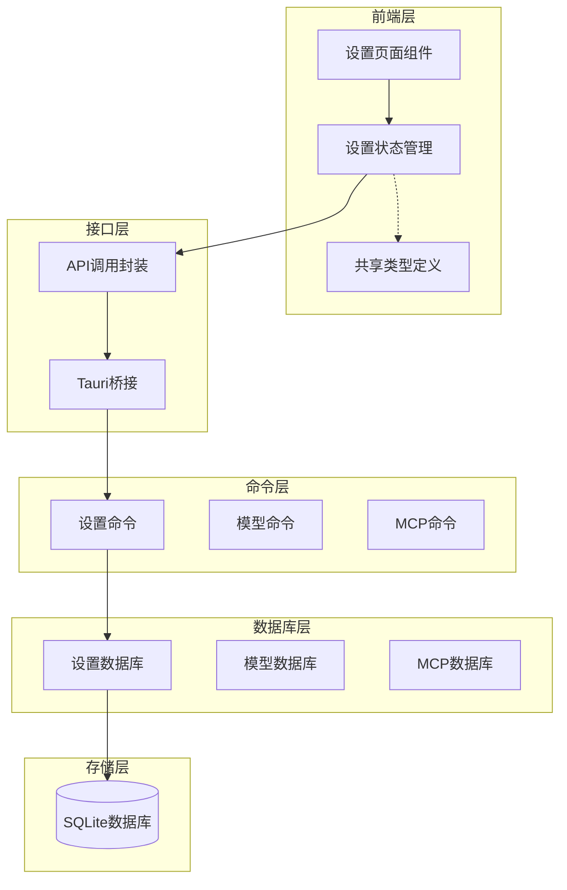
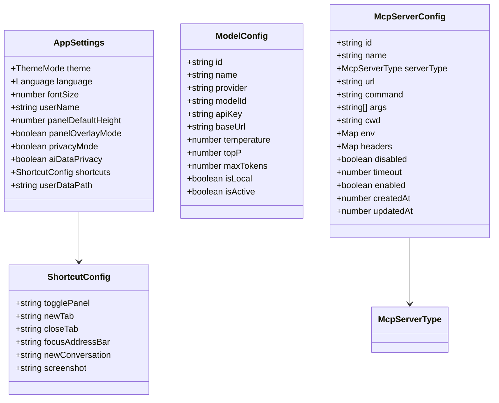
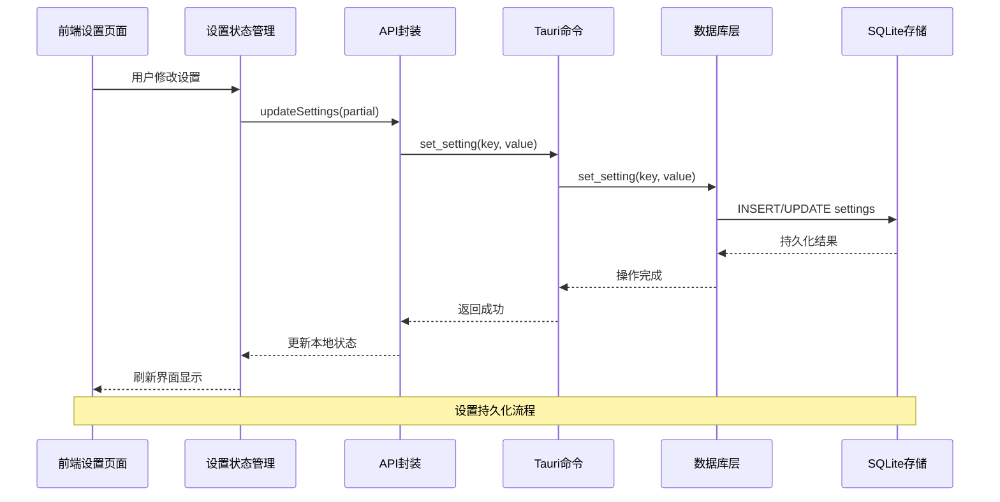
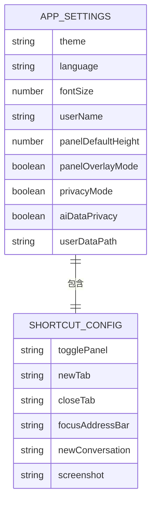
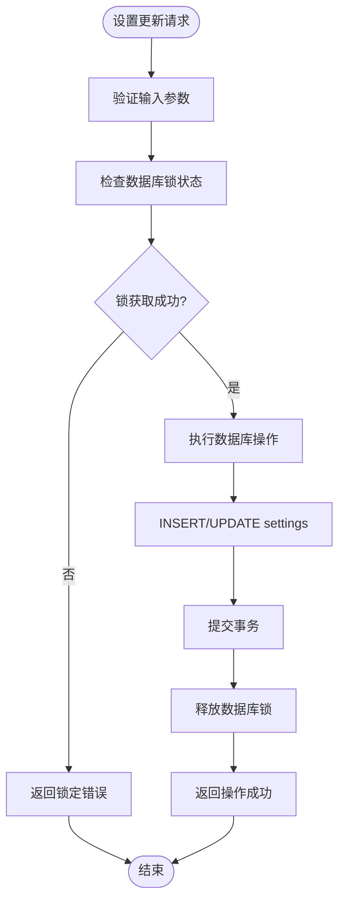
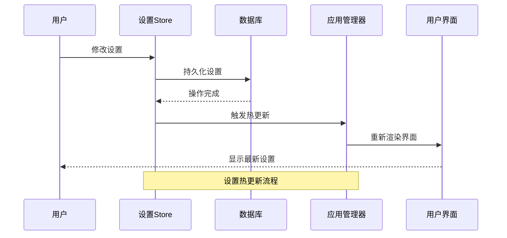
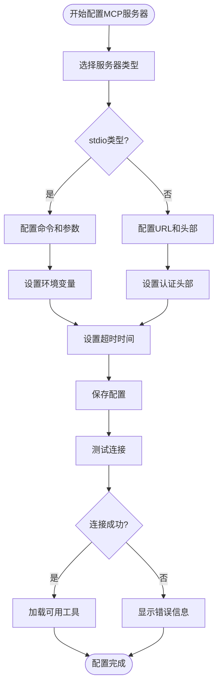
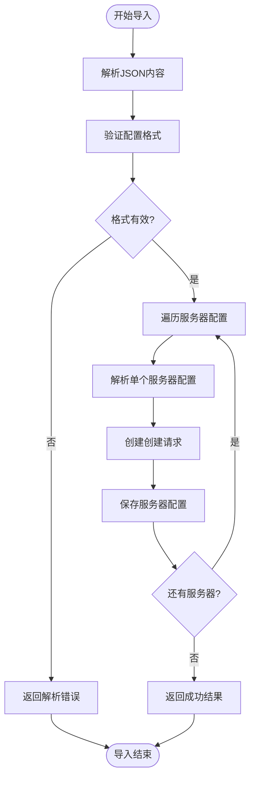
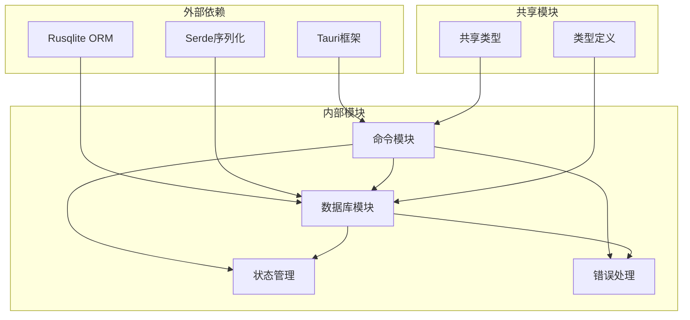

# 设置命令模块

<cite>
**本文档引用的文件**
- [settings.rs](file://src-tauri/src/commands/settings.rs)
- [settings.rs](file://src-tauri/src/db/settings.rs)
- [mod.rs](file://src-tauri/src/db/mod.rs)
- [lib.rs](file://src-tauri/src/lib.rs)
- [settings.ts](file://packages/shared/src/settings.ts)
- [settingsStore.ts](file://src-web/src/stores/settingsStore.ts)
- [SettingsPage.tsx](file://src-web/src/components/settings/SettingsPage.tsx)
- [McpServersSettings.tsx](file://src-web/src/components/settings/McpServersSettings.tsx)
- [AgentPromptsSettings.tsx](file://src-web/src/components/settings/AgentPromptsSettings.tsx)
</cite>

## 目录
1. [简介](#简介)
2. [项目结构](#项目结构)
3. [核心组件](#核心组件)
4. [架构概览](#架构概览)
5. [详细组件分析](#详细组件分析)
6. [依赖关系分析](#依赖关系分析)
7. [性能考虑](#性能考虑)
8. [故障排除指南](#故障排除指南)
9. [结论](#结论)

## 简介

CoSurf 设置命令模块是一个完整的应用配置管理系统，负责管理用户界面主题、语言设置、快捷键配置、AI模型配置、MCP服务器配置以及代理提示词等各类设置。该模块采用分层架构设计，通过Tauri命令系统提供跨平台的设置管理能力，支持设置的读取、更新、重置操作，并具备完善的配置持久化和热更新机制。

## 项目结构

设置命令模块分布在多个层次中，形成了清晰的分层架构：



**图表来源**
- [lib.rs:108-214](file://src-tauri/src/lib.rs#L108-L214)
- [settings.rs:1-615](file://src-tauri/src/commands/settings.rs#L1-L615)

**章节来源**
- [lib.rs:1-258](file://src-tauri/src/lib.rs#L1-L258)
- [settings.rs:1-615](file://src-tauri/src/commands/settings.rs#L1-L615)

## 核心组件

### 设置数据模型

设置系统采用统一的数据模型设计，支持多种配置类型的管理：



**图表来源**
- [settings.ts:5-47](file://packages/shared/src/settings.ts#L5-L47)
- [settings.rs:7-23](file://src-tauri/src/db/settings.rs#L7-L23)
- [settings.rs:72-114](file://src-tauri/src/db/settings.rs#L72-L114)

### 设置命令接口

设置命令模块提供了完整的CRUD操作接口：

| 命令类型 | 函数名 | 功能描述 |
|---------|--------|----------|
| 读取操作 | get_settings() | 获取所有设置 |
| 读取操作 | get_setting() | 获取单个设置项 |
| 更新操作 | set_setting() | 更新设置项 |
| 列表操作 | list_model_configs() | 列出所有模型配置 |
| 查询操作 | get_model_config() | 获取特定模型配置 |
| 激活操作 | set_active_model() | 设置活动模型 |
| 创建操作 | create_model_config() | 创建新模型配置 |
| 更新操作 | update_model_config() | 更新模型配置 |
| 删除操作 | delete_model_config() | 删除模型配置 |

**章节来源**
- [settings.rs:9-105](file://src-tauri/src/commands/settings.rs#L9-L105)
- [settings.rs:179-337](file://src-tauri/src/db/settings.rs#L179-L337)

## 架构概览

设置命令模块采用分层架构设计，确保了良好的可维护性和扩展性：



**图表来源**
- [settingsStore.ts:76-90](file://src-web/src/stores/settingsStore.ts#L76-L90)
- [settings.rs:27-34](file://src-tauri/src/commands/settings.rs#L27-L34)
- [settings.rs:190-197](file://src-tauri/src/db/settings.rs#L190-L197)

## 详细组件分析

### 设置数据模型设计

#### 应用设置模型

应用设置模型定义了用户界面和行为的基本配置：



**图表来源**
- [settings.ts:5-47](file://packages/shared/src/settings.ts#L5-L47)

#### 默认值管理

系统实现了完善的默认值管理机制：

| 设置项 | 默认值 | 类型 | 作用域 |
|--------|--------|------|--------|
| theme | "system" | ThemeMode | 全局 |
| language | "zh-CN" | Language | 全局 |
| fontSize | 14 | number | 全局 |
| userName | "CoCo" | string | 全局 |
| panelDefaultHeight | 300 | number | 全局 |
| panelOverlayMode | true | boolean | 全局 |
| privacyMode | false | boolean | 全局 |
| aiDataPrivacy | false | boolean | 全局 |

**章节来源**
- [settings.ts:28-47](file://packages/shared/src/settings.ts#L28-L47)

### 设置命令与数据库交互

#### 设置持久化机制

设置命令通过SQLite数据库实现配置的持久化存储：



**图表来源**
- [settings.rs:19-34](file://src-tauri/src/commands/settings.rs#L19-L34)
- [settings.rs:190-197](file://src-tauri/src/db/settings.rs#L190-L197)

#### 热更新机制

系统实现了智能的热更新机制，确保设置变更能够及时生效：



**图表来源**
- [settingsStore.ts:76-90](file://src-web/src/stores/settingsStore.ts#L76-L90)
- [settings.rs:121-165](file://src-tauri/src/commands/settings.rs#L121-L165)

### MCP服务器配置管理

#### MCP服务器类型定义

系统支持多种MCP服务器连接方式：

| 服务器类型 | 描述 | 适用场景 |
|-----------|------|----------|
| stdio | 本地进程通信 | 本地工具集成 |
| http | HTTP协议 | 远程Web服务 |
| streamableHttp | 流式HTTP | 实时数据传输 |
| sse | 服务器推送事件 | 实时事件订阅 |

#### MCP服务器配置流程



**图表来源**
- [settings.rs:265-486](file://src-tauri/src/commands/settings.rs#L265-L486)
- [settings.rs:72-114](file://src-tauri/src/db/settings.rs#L72-L114)

**章节来源**
- [settings.rs:197-306](file://src-tauri/src/commands/settings.rs#L197-L306)
- [settings.rs:27-69](file://src-tauri/src/db/settings.rs#L27-L69)

### 配置导入导出功能

#### JSON配置格式

系统支持标准的MCP JSON配置格式导入：

```json
{
  "mcpServers": {
    "iqs-mcp-server-search": {
      "type": "streamableHttp",
      "url": "https://iqs-mcp.aliyuncs.com/mcp-servers/iqs-mcp-server-search",
      "headers": {
        "X-API-Key": "your-api-key"
      }
    },
    "filesystem": {
      "type": "stdio",
      "command": "npx",
      "args": ["-y", "@modelcontextprotocol/server-filesystem", "/path/to/files"]
    }
  }
}
```

#### 导入处理流程



**图表来源**
- [settings.rs:508-614](file://src-tauri/src/commands/settings.rs#L508-L614)

**章节来源**
- [settings.rs:488-614](file://src-tauri/src/commands/settings.rs#L488-L614)

## 依赖关系分析

设置命令模块的依赖关系体现了清晰的分层架构：



**图表来源**
- [lib.rs:1-258](file://src-tauri/src/lib.rs#L1-L258)
- [settings.rs:1-6](file://src-tauri/src/db/settings.rs#L1-L6)

### 组件耦合度分析

设置模块采用了低耦合的设计原则：

- **命令层与数据库层解耦**：通过抽象接口实现松散耦合
- **前端与后端解耦**：通过Tauri桥接实现跨语言通信
- **配置与业务逻辑解耦**：通过统一的数据模型管理配置

**章节来源**
- [lib.rs:108-214](file://src-tauri/src/lib.rs#L108-L214)
- [settings.rs:179-539](file://src-tauri/src/db/settings.rs#L179-L539)

## 性能考虑

### 数据库优化策略

设置模块采用了多项性能优化措施：

1. **连接池管理**：通过数据库锁机制确保线程安全
2. **索引优化**：为常用查询字段建立索引
3. **批量操作**：支持批量设置更新操作
4. **延迟加载**：按需加载配置数据

### 内存管理

- **状态缓存**：前端Store缓存常用设置值
- **懒加载**：非活跃配置延迟加载
- **垃圾回收**：及时清理不再使用的配置引用

## 故障排除指南

### 常见问题及解决方案

#### 设置更新失败

**问题现象**：设置更新后未生效
**可能原因**：
- 数据库锁竞争
- 前端状态不同步
- 权限不足

**解决步骤**：
1. 检查数据库连接状态
2. 验证前端Store同步
3. 确认文件权限

#### MCP服务器连接失败

**问题现象**：MCP服务器无法连接
**可能原因**：
- 网络连接问题
- 认证信息错误
- 服务器配置不当

**诊断方法**：
1. 检查网络连通性
2. 验证API密钥
3. 测试服务器响应

**章节来源**
- [settings.rs:265-486](file://src-tauri/src/commands/settings.rs#L265-L486)
- [settingsStore.ts:161-199](file://src-web/src/stores/settingsStore.ts#L161-L199)

## 结论

CoSurf设置命令模块通过精心设计的分层架构和完善的错误处理机制，为应用提供了强大而灵活的配置管理能力。模块具有以下特点：

1. **完整性**：覆盖了应用的所有配置需求
2. **可扩展性**：支持新增配置类型和命令
3. **可靠性**：完善的错误处理和恢复机制
4. **易用性**：直观的API接口和配置界面

该模块为CoSurf应用的配置管理奠定了坚实的基础，支持用户根据个人需求定制应用行为，同时保证了系统的稳定性和性能表现。