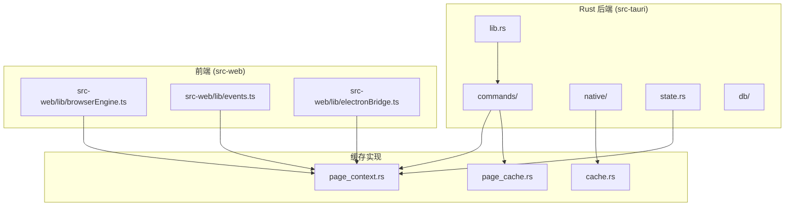
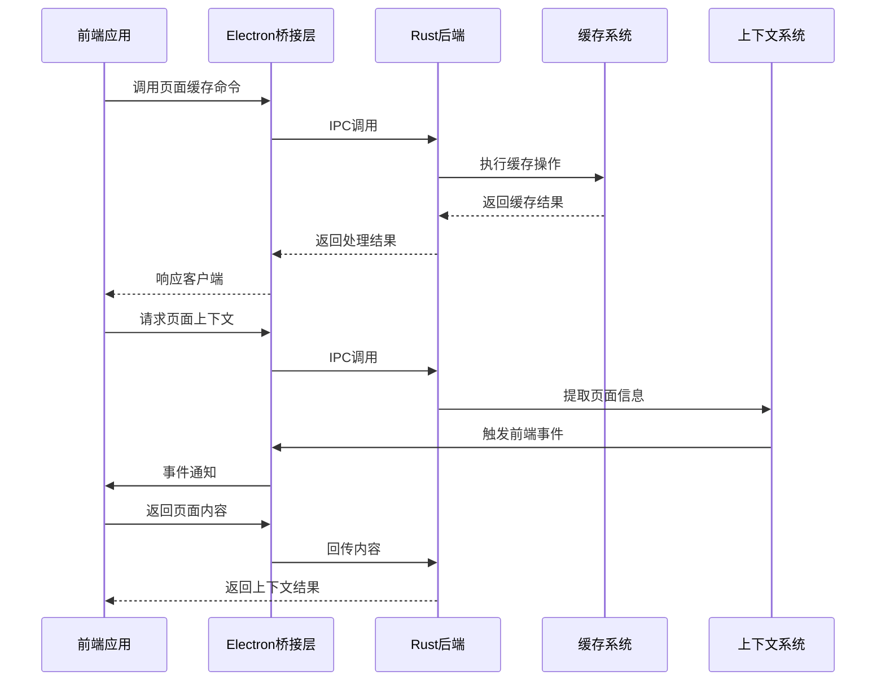
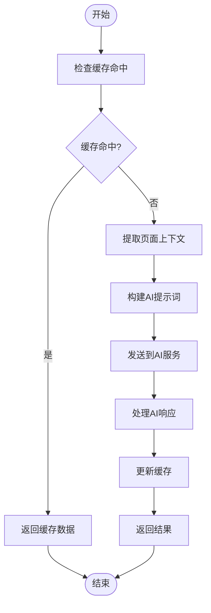
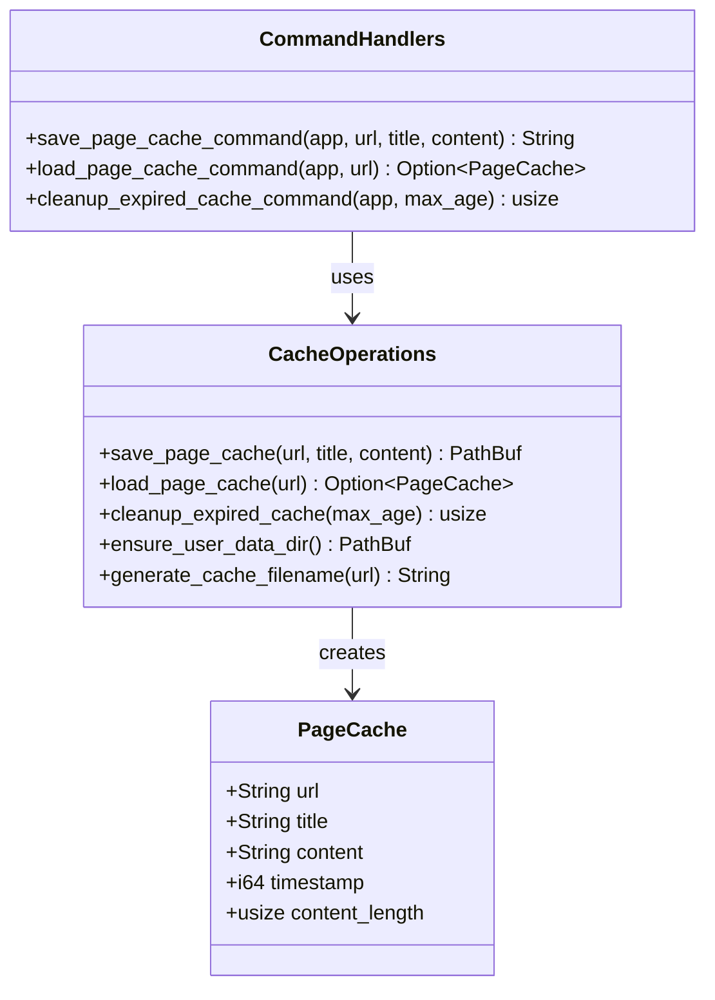
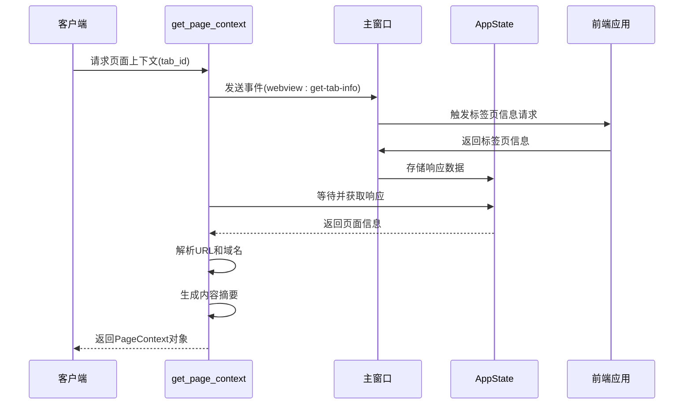
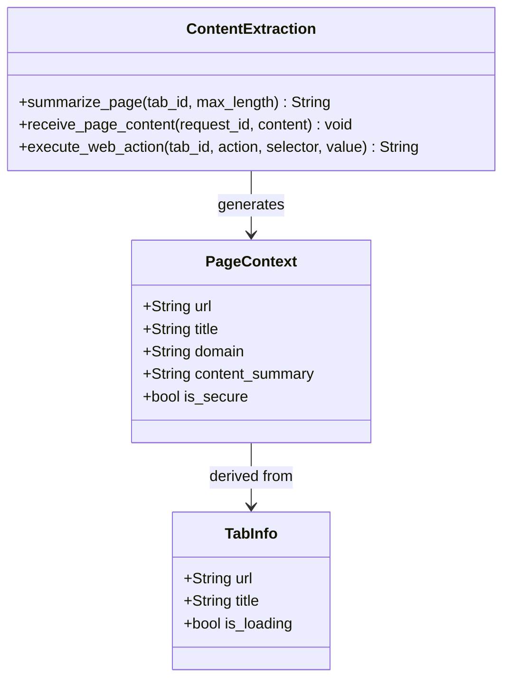
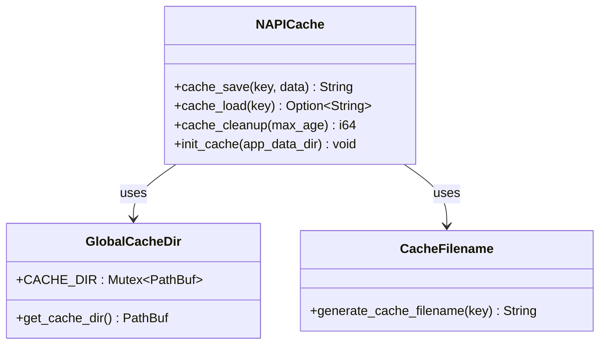
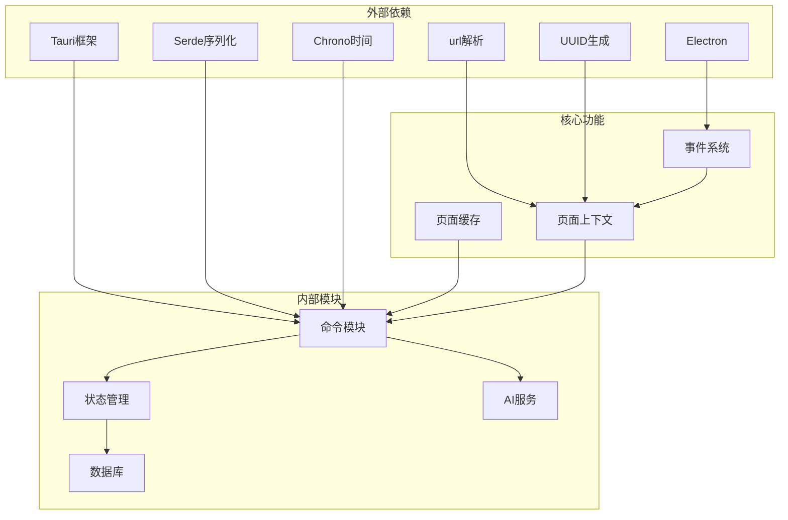

# 页面缓存和上下文命令模块

<cite>
**本文档引用的文件**
- [page_cache.rs](file://src-tauri/src/commands/page_cache.rs)
- [page_context.rs](file://src-tauri/src/commands/page_context.rs)
- [cache.rs](file://native/src/cache.rs)
- [state.rs](file://src-tauri/src/state.rs)
- [lib.rs](file://src-tauri/src/lib.rs)
- [mod.rs](file://src-tauri/src/db/mod.rs)
- [provider.rs](file://src-tauri/src/ai/provider.rs)
- [browserEngine.ts](file://src-web/src/lib/browserEngine.ts)
- [events.ts](file://src-web/src/lib/events.ts)
- [electronBridge.ts](file://src-web/src/lib/electronBridge.ts)
</cite>

## 目录
1. [简介](#简介)
2. [项目结构](#项目结构)
3. [核心组件](#核心组件)
4. [架构概览](#架构概览)
5. [详细组件分析](#详细组件分析)
6. [依赖关系分析](#依赖关系分析)
7. [性能考虑](#性能考虑)
8. [故障排除指南](#故障排除指南)
9. [结论](#结论)

## 简介

CoSurf 页面缓存和上下文命令模块是一个集成了页面内容缓存管理和页面上下文提取功能的系统。该模块提供了完整的页面缓存生命周期管理，包括缓存的创建、读取、更新和清理，同时实现了智能的页面上下文提取机制，为AI对话提供实时的页面信息。

该模块采用分层架构设计，将缓存逻辑与上下文提取功能分离，通过事件驱动的方式实现前后端的异步通信。系统支持多种缓存策略，包括基于时间的过期清理、基于大小的内存管理，以及智能的命中率优化机制。

## 项目结构

页面缓存和上下文命令模块主要分布在以下目录结构中：

**图表来源**
- [page_cache.rs:1-275](file://src-tauri/src/commands/page_cache.rs#L1-L275)
- [page_context.rs:1-327](file://src-tauri/src/commands/page_context.rs#L1-L327)
- [cache.rs:1-158](file://native/src/cache.rs#L1-L158)

**章节来源**
- [lib.rs:1-258](file://src-tauri/src/lib.rs#L1-L258)
- [state.rs:1-81](file://src-tauri/src/state.rs#L1-L81)

## 核心组件

### 页面缓存系统

页面缓存系统提供了完整的文件级缓存解决方案，支持基于URL的哈希命名和自动过期清理机制。

**主要特性：**
- **哈希命名策略**：使用SHA256算法对URL进行哈希，确保文件名的唯一性和稳定性
- **自动目录管理**：动态创建和管理缓存目录结构
- **JSON序列化**：统一的数据存储格式，便于跨平台兼容
- **智能过期清理**：支持基于时间的缓存清理策略

### 页面上下文系统

页面上下文系统实现了AI对话中的页面信息提取和注入功能，提供实时的页面状态反馈。

**核心功能：**
- **标签页信息提取**：通过事件机制从前端获取当前标签页的状态信息
- **内容摘要生成**：根据页面状态生成简洁的上下文摘要
- **AI上下文注入**：为AI对话提供结构化的页面信息提示词
- **内容提取服务**：支持页面内容的提取和截断处理

**章节来源**
- [page_cache.rs:9-17](file://src-tauri/src/commands/page_cache.rs#L9-L17)
- [page_context.rs:10-18](file://src-tauri/src/commands/page_context.rs#L10-L18)

## 架构概览

页面缓存和上下文命令模块采用事件驱动的异步架构，实现了前后端的松耦合通信。

**图表来源**
- [page_cache.rs:161-193](file://src-tauri/src/commands/page_cache.rs#L161-L193)
- [page_context.rs:20-107](file://src-tauri/src/commands/page_context.rs#L20-L107)
- [electronBridge.ts:32-46](file://src-web/src/lib/electronBridge.ts#L32-L46)

### 数据流架构

**图表来源**
- [page_cache.rs:91-124](file://src-tauri/src/commands/page_cache.rs#L91-L124)
- [page_context.rs:109-139](file://src-tauri/src/commands/page_context.rs#L109-L139)

## 详细组件分析

### 页面缓存命令实现

页面缓存命令提供了完整的CRUD操作接口，支持缓存的创建、读取、更新和清理。

#### 缓存数据结构

**图表来源**
- [page_cache.rs:9-17](file://src-tauri/src/commands/page_cache.rs#L9-L17)
- [page_cache.rs:54-89](file://src-tauri/src/commands/page_cache.rs#L54-L89)

#### 缓存策略实现

页面缓存采用了多层缓存策略，结合了文件系统缓存和内存缓存的优势：

**文件系统缓存策略：**
- **哈希命名**：使用SHA256算法确保URL到文件名的一一映射
- **目录结构**：采用层次化的目录组织，避免单个目录文件过多
- **自动清理**：基于时间戳的过期检测和清理机制

**内存缓存策略：**
- **响应缓存**：在AppState中维护页面内容响应的临时缓存
- **活跃标签页跟踪**：记录当前活跃的标签页ID，优化上下文提取
- **最近访问URL管理**：去重和频率控制机制

**章节来源**
- [page_cache.rs:19-44](file://src-tauri/src/commands/page_cache.rs#L19-L44)
- [page_cache.rs:126-159](file://src-tauri/src/commands/page_cache.rs#L126-L159)
- [state.rs:9-23](file://src-tauri/src/state.rs#L9-L23)

### 页面上下文命令实现

页面上下文命令实现了复杂的异步交互模式，通过事件驱动的方式实现前后端的协调工作。

#### 上下文提取流程

**图表来源**
- [page_context.rs:20-107](file://src-tauri/src/commands/page_context.rs#L20-L107)

#### 上下文数据结构

页面上下文系统使用了专门的数据结构来封装页面信息：

**图表来源**
- [page_context.rs:10-18](file://src-tauri/src/commands/page_context.rs#L10-L18)
- [page_context.rs:141-217](file://src-tauri/src/commands/page_context.rs#L141-L217)

**章节来源**
- [page_context.rs:109-139](file://src-tauri/src/commands/page_context.rs#L109-L139)
- [page_context.rs:219-233](file://src-tauri/src/commands/page_context.rs#L219-L233)

### N-API缓存实现

除了Rust原生的缓存实现外，系统还提供了JavaScript层面的N-API缓存接口，支持Node.js环境下的缓存操作。

#### N-API缓存接口

**图表来源**
- [cache.rs:60-81](file://native/src/cache.rs#L60-L81)
- [cache.rs:83-108](file://native/src/cache.rs#L83-L108)

**章节来源**
- [cache.rs:29-41](file://native/src/cache.rs#L29-L41)
- [cache.rs:110-157](file://native/src/cache.rs#L110-L157)

## 依赖关系分析

页面缓存和上下文命令模块的依赖关系体现了清晰的分层架构设计。

**图表来源**
- [lib.rs:41-107](file://src-tauri/src/lib.rs#L41-L107)
- [state.rs:25-80](file://src-tauri/src/state.rs#L25-L80)

### 命令注册机制

系统通过集中式的命令注册机制管理所有可用的命令：

**章节来源**
- [lib.rs:108-214](file://src-tauri/src/lib.rs#L108-L214)

## 性能考虑

### 缓存命中率优化

页面缓存系统采用了多种策略来优化缓存命中率：

**URL哈希优化：**
- 使用SHA256算法确保URL到文件名的唯一映射
- 避免特殊字符和路径分隔符问题
- 支持长URL的安全处理

**内存管理策略：**
- 限制活跃标签页数量，避免内存泄漏
- 实现响应缓存的超时机制
- 使用Arc和Mutex确保线程安全

### 异步处理优化

页面上下文系统采用了高效的异步处理模式：

**超时控制：**
- 上下文提取设置3秒超时，避免阻塞
- 内容提取设置5秒超时，平衡准确性
- 使用tokio::time::timeout确保及时响应

**事件驱动架构：**
- 基于事件的解耦通信
- 非阻塞的异步等待机制
- 响应式的结果处理

### 内存和磁盘空间管理

**自动清理机制：**
- 默认24小时过期时间
- 支持自定义过期时间配置
- 批量清理操作减少I/O开销

**资源限制：**
- 页面内容截断防止内存溢出
- 最近访问URL去重避免重复存储
- 目录结构扁平化提高文件系统性能

## 故障排除指南

### 常见问题诊断

**缓存文件读取失败：**
- 检查用户数据目录权限
- 验证JSON格式的有效性
- 确认文件编码格式

**上下文提取超时：**
- 检查前端事件监听器状态
- 验证标签页ID的有效性
- 确认网络连接状态

**内存泄漏问题：**
- 监控活跃标签页数量
- 检查响应缓存清理机制
- 验证Arc和Mutex的正确使用

### 调试建议

**日志分析：**
- 启用详细日志级别追踪
- 监控关键操作的执行时间
- 分析错误发生的上下文

**性能监控：**
- 监控缓存命中率变化
- 跟踪内存使用情况
- 分析I/O操作频率

**章节来源**
- [page_cache.rs:113-123](file://src-tauri/src/commands/page_cache.rs#L113-L123)
- [page_context.rs:44-63](file://src-tauri/src/commands/page_context.rs#L44-L63)

## 结论

CoSurf页面缓存和上下文命令模块展现了现代桌面应用中缓存系统和上下文管理的最佳实践。通过事件驱动的异步架构、多层缓存策略和智能的资源管理机制，该模块为AI对话提供了稳定可靠的页面信息支持。

**主要优势：**
- **架构清晰**：分层设计便于维护和扩展
- **性能优异**：多策略缓存和异步处理提升响应速度
- **可靠性强**：完善的错误处理和超时机制
- **可扩展性好**：模块化设计支持功能扩展

**未来改进方向：**
- 实现更智能的缓存预加载机制
- 增加缓存统计和监控功能
- 优化大文件缓存的处理效率
- 支持分布式缓存架构

该模块为CoSurf应用提供了坚实的技术基础，为用户提供了流畅的AI交互体验。