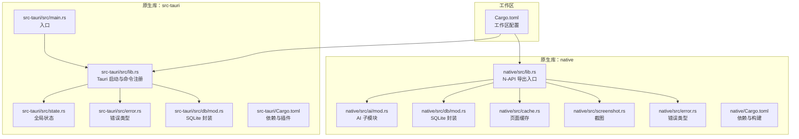
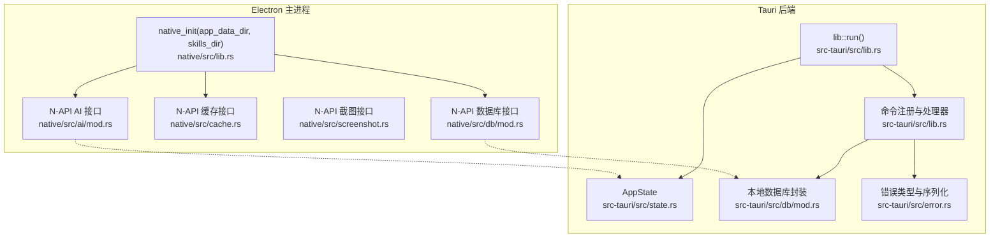
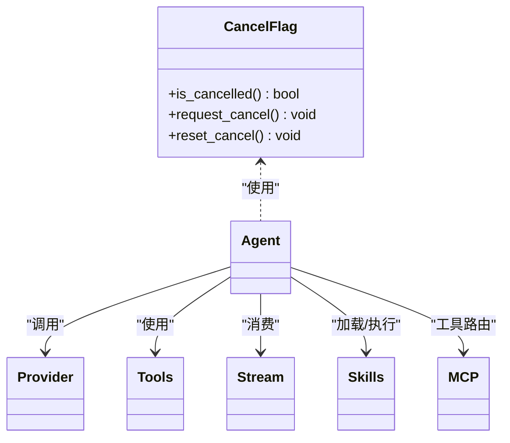
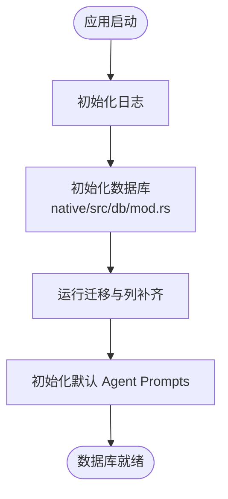
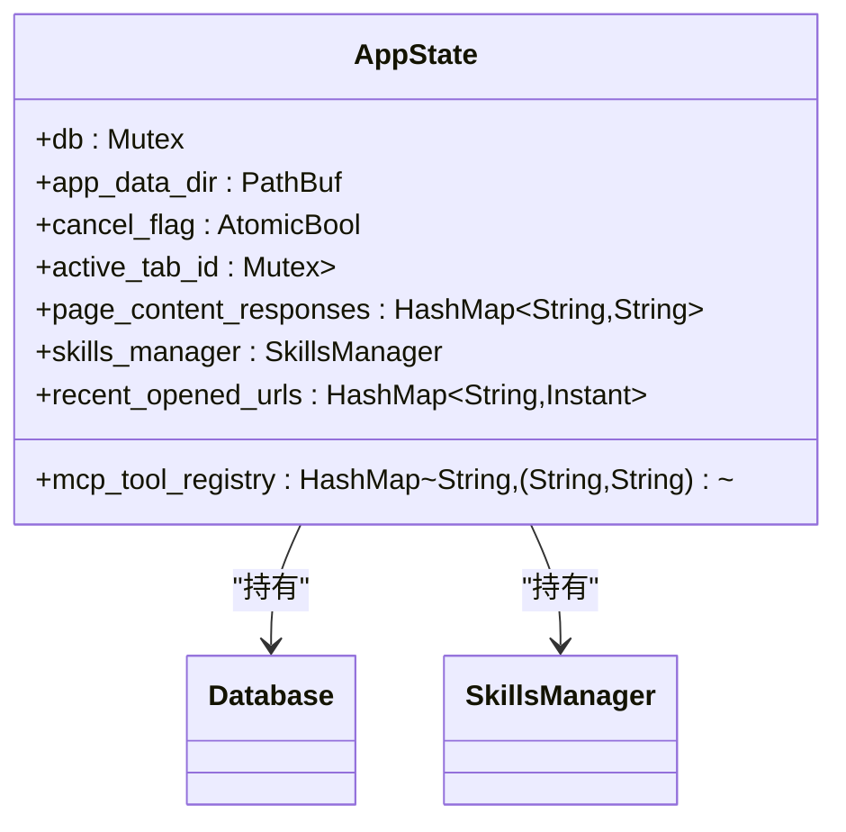
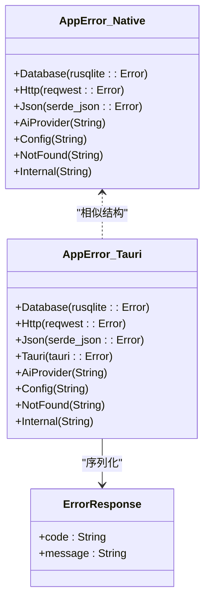
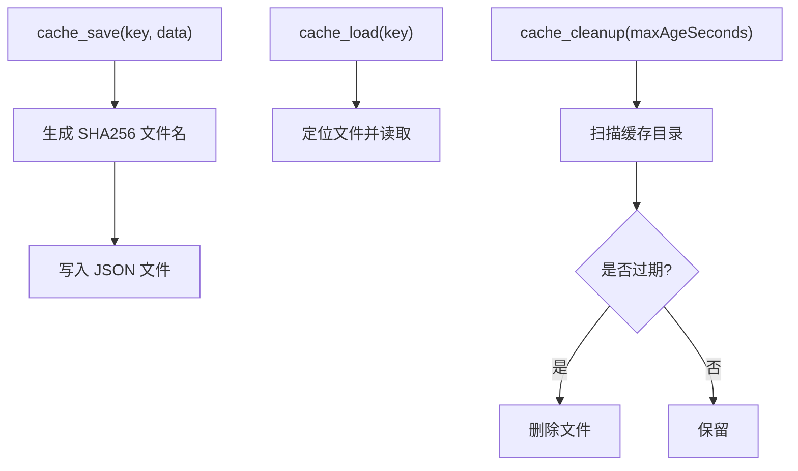
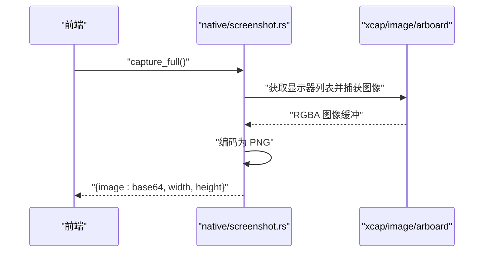
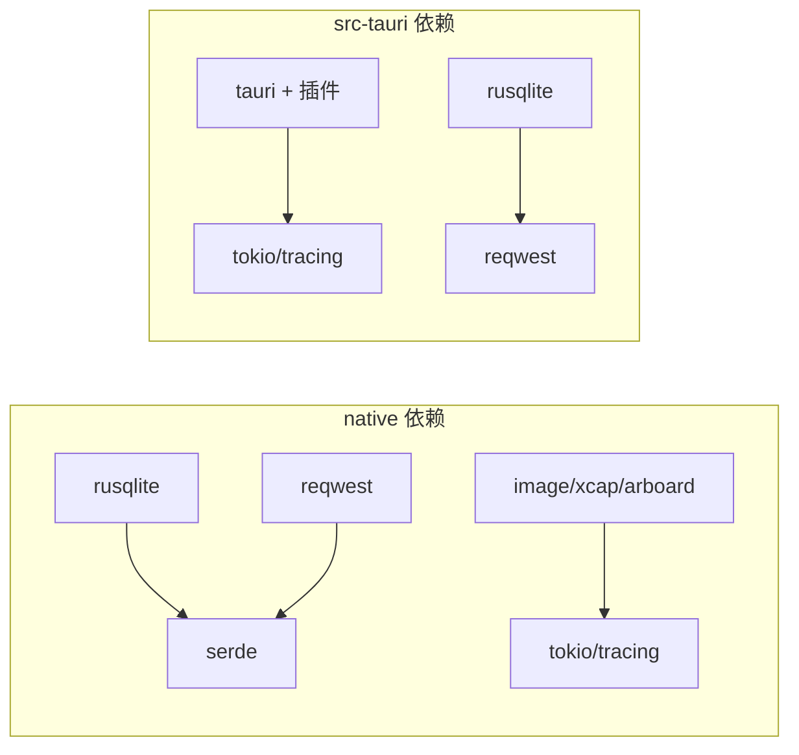
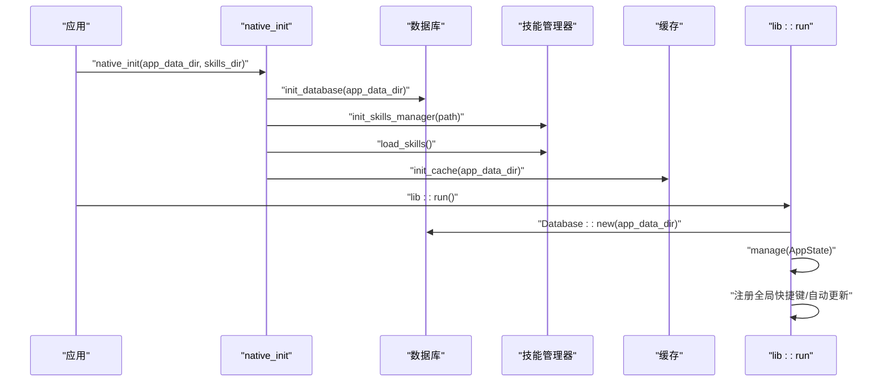

# 模块组织

<cite>
**本文引用的文件**
- [native/src/lib.rs](file://native/src/lib.rs)
- [src-tauri/src/lib.rs](file://src-tauri/src/lib.rs)
- [native/src/ai/mod.rs](file://native/src/ai/mod.rs)
- [native/src/db/mod.rs](file://native/src/db/mod.rs)
- [native/src/cache.rs](file://native/src/cache.rs)
- [native/src/screenshot.rs](file://native/src/screenshot.rs)
- [native/src/error.rs](file://native/src/error.rs)
- [src-tauri/src/state.rs](file://src-tauri/src/state.rs)
- [src-tauri/src/error.rs](file://src-tauri/src/error.rs)
- [src-tauri/src/db/mod.rs](file://src-tauri/src/db/mod.rs)
- [src-tauri/src/main.rs](file://src-tauri/src/main.rs)
- [native/Cargo.toml](file://native/Cargo.toml)
- [src-tauri/Cargo.toml](file://src-tauri/Cargo.toml)
- [Cargo.toml](file://Cargo.toml)
</cite>

## 目录
1. [简介](#简介)
2. [项目结构](#项目结构)
3. [核心组件](#核心组件)
4. [架构总览](#架构总览)
5. [详细组件分析](#详细组件分析)
6. [依赖分析](#依赖分析)
7. [性能考虑](#性能考虑)
8. [故障排查指南](#故障排查指南)
9. [结论](#结论)
10. [附录](#附录)

## 简介
本文件面向 CoSurf 的模块组织与实现，系统性梳理 Rust 模块系统的组织原则、模块间依赖关系、接口设计与内部可见性控制，并深入解析以下核心模块的职责与协作方式：
- AI 模块：负责智能代理与工具系统（含技能、MCP、流式输出等）
- 数据库模块：管理对话、消息、书签、历史、设置、模型配置等数据持久化
- 状态模块：维护全局应用状态（取消标志、活动标签、页面内容响应、技能管理器、MCP 工具注册表等）
- 错误模块：统一异常处理与错误类型转换
- 缓存模块：页面内容文件缓存与过期清理
- 截图模块：全屏截图、区域裁剪、保存与剪贴板复制

同时，文档阐述模块间的通信机制、数据流转、依赖注入模式；说明初始化顺序、生命周期管理与资源清理策略；并提供模块扩展指南、接口设计原则与测试策略，辅以实际代码示例路径与最佳实践。

## 项目结构
CoSurf 采用工作区（workspace）组织，核心分为两个原生库：
- native：Electron 主进程通过 N-API 调用的高性能 Rust 插件，提供数据库、AI、缓存、截图等能力
- src-tauri：Tauri 应用后端，负责窗口、命令、状态、数据库与错误处理等

**图表来源**
- [Cargo.toml:1-29](file://Cargo.toml#L1-L29)
- [native/src/lib.rs:1-64](file://native/src/lib.rs#L1-L64)
- [src-tauri/src/lib.rs:1-258](file://src-tauri/src/lib.rs#L1-L258)
- [native/src/ai/mod.rs:1-32](file://native/src/ai/mod.rs#L1-L32)
- [native/src/db/mod.rs:1-800](file://native/src/db/mod.rs#L1-L800)
- [native/src/cache.rs:1-158](file://native/src/cache.rs#L1-L158)
- [native/src/screenshot.rs:1-129](file://native/src/screenshot.rs#L1-L129)
- [native/src/error.rs:1-37](file://native/src/error.rs#L1-L37)
- [src-tauri/src/state.rs:1-77](file://src-tauri/src/state.rs#L1-L77)
- [src-tauri/src/error.rs:1-64](file://src-tauri/src/error.rs#L1-L64)
- [src-tauri/src/db/mod.rs:1-272](file://src-tauri/src/db/mod.rs#L1-L272)
- [src-tauri/src/main.rs:1-6](file://src-tauri/src/main.rs#L1-L6)
- [native/Cargo.toml:1-72](file://native/Cargo.toml#L1-L72)
- [src-tauri/Cargo.toml:1-70](file://src-tauri/Cargo.toml#L1-L70)

**章节来源**
- [Cargo.toml:1-29](file://Cargo.toml#L1-L29)
- [native/src/lib.rs:1-64](file://native/src/lib.rs#L1-L64)
- [src-tauri/src/lib.rs:1-258](file://src-tauri/src/lib.rs#L1-L258)

## 核心组件
- AI 模块（native）：提供 Provider、Tools、Stream、Skills、MCP、Agent 等子模块，暴露全局取消标志与取消控制函数，用于中断长耗时生成任务。该模块通过 N-API 导出给 Electron 主进程调用。
- 数据库模块（native）：封装 SQLite，提供会话、消息、书签、历史、设置、模型配置、MCP 服务器、Agent Prompts 等表的增删改查与迁移逻辑，并通过 N-API 暴露查询与写入接口。
- 状态模块（src-tauri）：集中管理数据库连接、应用数据目录、取消标志、活动标签、页面内容响应缓存、技能管理器、最近打开 URL 去重、MCP 工具注册表等，作为全局共享状态容器。
- 错误模块（native 与 src-tauri）：分别定义 AppError 枚举与错误到 IPC 的序列化映射，统一错误类型与对外表现形式。
- 缓存模块（native）：基于 SHA256 文件名的页面缓存，支持保存、加载与过期清理，避免重复抓取与解析。
- 截图模块（native）：提供全屏截图、区域裁剪、保存文件、复制到剪贴板等能力，返回 Base64 PNG 数据与尺寸信息。

**章节来源**
- [native/src/ai/mod.rs:1-32](file://native/src/ai/mod.rs#L1-L32)
- [native/src/db/mod.rs:1-800](file://native/src/db/mod.rs#L1-L800)
- [src-tauri/src/state.rs:1-77](file://src-tauri/src/state.rs#L1-L77)
- [native/src/error.rs:1-37](file://native/src/error.rs#L1-L37)
- [src-tauri/src/error.rs:1-64](file://src-tauri/src/error.rs#L1-L64)
- [native/src/cache.rs:1-158](file://native/src/cache.rs#L1-L158)
- [native/src/screenshot.rs:1-129](file://native/src/screenshot.rs#L1-L129)

## 架构总览
CoSurf 的模块组织遵循“分层与职责分离”原则：
- 外层（Electron 主进程）通过 N-API 调用 native 模块提供的能力（数据库、AI、缓存、截图）
- 内层（Tauri 后端）通过命令注册与状态管理协调前端交互、浏览器自动化、页面上下文与 AI 代理
- 错误模块在两端统一错误语义，保证跨边界的一致性
- 初始化流程在应用启动时完成：先初始化日志与数据库，再初始化技能管理器与缓存，最后在 Tauri setup 中建立全局状态与快捷键

**图表来源**
- [native/src/lib.rs:26-57](file://native/src/lib.rs#L26-L57)
- [native/src/db/mod.rs:245-252](file://native/src/db/mod.rs#L245-L252)
- [native/src/cache.rs:30-41](file://native/src/cache.rs#L30-L41)
- [native/src/screenshot.rs:10-40](file://native/src/screenshot.rs#L10-L40)
- [native/src/ai/mod.rs:15-31](file://native/src/ai/mod.rs#L15-L31)
- [src-tauri/src/lib.rs:16-107](file://src-tauri/src/lib.rs#L16-L107)
- [src-tauri/src/state.rs:9-23](file://src-tauri/src/state.rs#L9-L23)
- [src-tauri/src/db/mod.rs:11-13](file://src-tauri/src/db/mod.rs#L11-L13)
- [src-tauri/src/error.rs:4-29](file://src-tauri/src/error.rs#L4-L29)

## 详细组件分析

### AI 模块分析
职责与接口
- 提供全局取消标志与取消控制函数，用于中断长耗时生成
- 暴露 Provider、Tools、Stream、Skills、MCP、Agent 等子模块
- 在 native 层通过 N-API 导出，供 Electron 主进程调用

内部可见性与依赖
- 使用原子布尔变量作为取消标志，避免竞态
- 通过 lazy_static 或全局静态变量持有取消标志，便于跨模块访问
- 与数据库模块协作，读取/写入 Agent Prompts 与消息流

**图表来源**
- [native/src/ai/mod.rs:15-31](file://native/src/ai/mod.rs#L15-L31)

**章节来源**
- [native/src/ai/mod.rs:1-32](file://native/src/ai/mod.rs#L1-L32)

### 数据库模块分析
职责与接口
- 封装 SQLite 连接与迁移，创建/维护 conversations、messages、bookmarks、history、settings、model_configs、mcp_servers、agent_prompts 等表
- 提供 N-API 查询与写入接口，如列出/创建/更新会话、追加消息内容、设置/获取设置、书签与历史管理、模型配置等
- 支持动态列迁移与默认数据初始化（如 Agent Prompts）

初始化与生命周期
- 在 native 初始化时创建数据库文件并运行迁移
- 在 src-tauri 初始化时同样创建数据库并进行迁移与列补齐

**图表来源**
- [native/src/db/mod.rs:60-173](file://native/src/db/mod.rs#L60-L173)
- [native/src/db/mod.rs:190-241](file://native/src/db/mod.rs#L190-L241)
- [native/src/lib.rs:41-42](file://native/src/lib.rs#L41-L42)

**章节来源**
- [native/src/db/mod.rs:1-800](file://native/src/db/mod.rs#L1-L800)
- [src-tauri/src/db/mod.rs:41-148](file://src-tauri/src/db/mod.rs#L41-L148)

### 状态模块分析
职责与接口
- AppState 统一管理数据库连接、应用数据目录、取消标志、活动标签、页面内容响应缓存、技能管理器、最近打开 URL 去重、MCP 工具注册表
- 在 Tauri setup 中创建 AppState 并注入应用管理器，供命令处理器使用

依赖注入与线程安全
- 使用 Arc<Mutex<T>> 保证并发安全
- 技能管理器与数据库在构造时同步示例技能与加载已有技能

**图表来源**
- [src-tauri/src/state.rs:9-23](file://src-tauri/src/state.rs#L9-L23)

**章节来源**
- [src-tauri/src/state.rs:1-77](file://src-tauri/src/state.rs#L1-L77)

### 错误模块分析
职责与接口
- 定义 AppError 枚举，覆盖数据库、HTTP、JSON、AI Provider、配置、未找到、内部错误等场景
- 在 native 中实现 AppError -> napi::Error 的转换
- 在 src-tauri 中实现 AppError -> ErrorResponse 的序列化，便于 IPC 传递

**图表来源**
- [native/src/error.rs:5-27](file://native/src/error.rs#L5-L27)
- [src-tauri/src/error.rs:4-29](file://src-tauri/src/error.rs#L4-L29)
- [src-tauri/src/error.rs:41-61](file://src-tauri/src/error.rs#L41-L61)

**章节来源**
- [native/src/error.rs:1-37](file://native/src/error.rs#L1-L37)
- [src-tauri/src/error.rs:1-64](file://src-tauri/src/error.rs#L1-L64)

### 缓存模块分析
职责与接口
- 页面缓存：根据 key（通常为 URL）生成 SHA256 文件名，保存 JSON 内容
- 提供保存、加载与过期清理接口，支持自定义过期时间（秒）
- 初始化时创建缓存目录

**图表来源**
- [native/src/cache.rs:43-49](file://native/src/cache.rs#L43-L49)
- [native/src/cache.rs:64-81](file://native/src/cache.rs#L64-L81)
- [native/src/cache.rs:87-108](file://native/src/cache.rs#L87-L108)
- [native/src/cache.rs:115-157](file://native/src/cache.rs#L115-L157)

**章节来源**
- [native/src/cache.rs:1-158](file://native/src/cache.rs#L1-L158)

### 截图模块分析
职责与接口
- 全屏截图：返回包含 Base64 PNG 与尺寸的 JSON
- 区域裁剪：接收全屏 Base64，按屏幕坐标裁剪并返回新的 Base64 PNG
- 保存与复制：将 Base64 图像保存到文件或复制到剪贴板

**图表来源**
- [native/src/screenshot.rs:10-40](file://native/src/screenshot.rs#L10-L40)

**章节来源**
- [native/src/screenshot.rs:1-129](file://native/src/screenshot.rs#L1-L129)

## 依赖分析
- 工作区与构建
  - 工作区在根 Cargo.toml 中声明成员与共享依赖
  - native 与 src-tauri 分别在各自 Cargo.toml 中声明依赖与插件
- 关键外部依赖
  - 数据库：rusqlite（WAL、外键）
  - HTTP：reqwest、eventsource（流式）
  - 序列化：serde、serde_json、serde_yaml、markdown
  - 截图与图像：image、xcap、arboard
  - 日志与并发：tokio、tracing、lazy_static、uuid、chrono、regex、url、dirs
- 模块耦合
  - native 与 src-tauri 通过命令与状态共享数据，但 native 不依赖 Tauri 运行时
  - 错误模块在两端保持一致的错误语义，便于跨边界传播

**图表来源**
- [native/Cargo.toml:23-57](file://native/Cargo.toml#L23-L57)
- [src-tauri/Cargo.toml:21-47](file://src-tauri/Cargo.toml#L21-L47)

**章节来源**
- [Cargo.toml:1-29](file://Cargo.toml#L1-L29)
- [native/Cargo.toml:1-72](file://native/Cargo.toml#L1-L72)
- [src-tauri/Cargo.toml:1-70](file://src-tauri/Cargo.toml#L1-L70)

## 性能考虑
- 数据库
  - WAL 模式提升并发写入性能；外键约束保障一致性
  - 索引（如消息表的会话索引、历史表的时间索引）加速查询
- 缓存
  - 文件缓存避免重复抓取；SHA256 文件名减少冲突；定期清理过期文件
- 截图
  - 直接内存编码 PNG，避免中间临时文件；区域裁剪在内存中完成
- 日志与错误
  - 结构化日志便于问题定位；错误类型统一减少分支判断成本

[本节为通用性能讨论，无需具体文件分析]

## 故障排查指南
- 数据库未初始化
  - 现象：调用数据库接口报“未初始化”
  - 排查：确认 native_init 是否在应用启动时调用，且数据库路径可写
  - 参考路径：[native/src/lib.rs:41-42](file://native/src/lib.rs#L41-L42)
- 截图失败
  - 现象：全屏截图或区域裁剪返回错误
  - 排查：检查显示器枚举、Base64 解码、图像格式编码与剪贴板权限
  - 参考路径：[native/src/screenshot.rs:12-40](file://native/src/screenshot.rs#L12-L40)
- 缓存读写失败
  - 现象：cache_load 返回空，cache_save 抛错
  - 排查：确认缓存目录存在且可写；检查文件权限与磁盘空间
  - 参考路径：[native/src/cache.rs:30-41](file://native/src/cache.rs#L30-L41)
- 错误类型不一致导致 IPC 失败
  - 现象：前端收到非预期错误对象
  - 排查：src-tauri 使用 ErrorResponse 序列化，确保错误映射完整
  - 参考路径：[src-tauri/src/error.rs:47-61](file://src-tauri/src/error.rs#L47-L61)

**章节来源**
- [native/src/lib.rs:41-42](file://native/src/lib.rs#L41-L42)
- [native/src/screenshot.rs:12-40](file://native/src/screenshot.rs#L12-L40)
- [native/src/cache.rs:30-41](file://native/src/cache.rs#L30-L41)
- [src-tauri/src/error.rs:47-61](file://src-tauri/src/error.rs#L47-L61)

## 结论
CoSurf 的模块组织以“职责清晰、边界明确、可扩展性强”为目标，通过 native 与 src-tauri 的分工协作，实现了高性能与易用性的平衡。AI、数据库、状态、错误、缓存与截图六大模块各司其职，并通过 N-API 与命令系统实现稳定的数据流与控制流。建议在后续扩展中坚持统一的错误语义、严格的初始化顺序与完善的生命周期管理，持续优化性能与可维护性。

[本节为总结性内容，无需具体文件分析]

## 附录

### 模块初始化顺序与生命周期
- native 初始化
  - 初始化日志
  - 初始化数据库
  - 初始化技能目录与加载技能
  - 初始化缓存目录
- src-tauri 初始化
  - 创建数据库实例
  - 创建 AppState 并注入应用管理器
  - 注册全局快捷键与自动更新检查
  - 注册命令处理器

**图表来源**
- [native/src/lib.rs:28-56](file://native/src/lib.rs#L28-L56)
- [src-tauri/src/lib.rs:50-107](file://src-tauri/src/lib.rs#L50-L107)

**章节来源**
- [native/src/lib.rs:28-56](file://native/src/lib.rs#L28-L56)
- [src-tauri/src/lib.rs:50-107](file://src-tauri/src/lib.rs#L50-L107)

### 模块扩展指南与接口设计原则
- 扩展原则
  - 单一职责：每个模块只负责一个核心领域
  - 明确边界：通过 N-API 或命令接口暴露能力，避免直接依赖运行时
  - 可测试性：提供最小可测试单元，必要时引入 in-memory 数据库
  - 可观察性：使用结构化日志记录关键事件与错误
- 接口设计
  - 输入输出尽量使用 JSON 字符串或简单标量，降低跨边界复杂度
  - 对于大对象，优先使用文件缓存或流式传输
  - 错误统一转换为字符串或结构化对象，便于前端展示
- 测试策略
  - 单元测试：针对纯函数与数据结构
  - 集成测试：针对 N-API 与命令注册
  - 端到端测试：结合前端与真实浏览器环境验证 AI 代理与页面上下文

[本节为通用指导，无需具体文件分析]