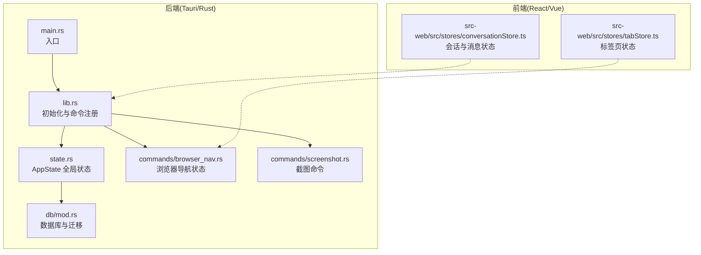
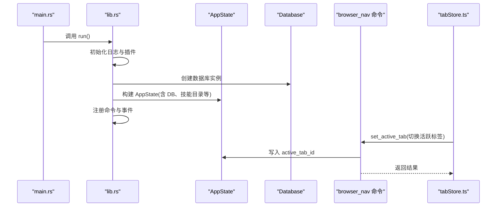
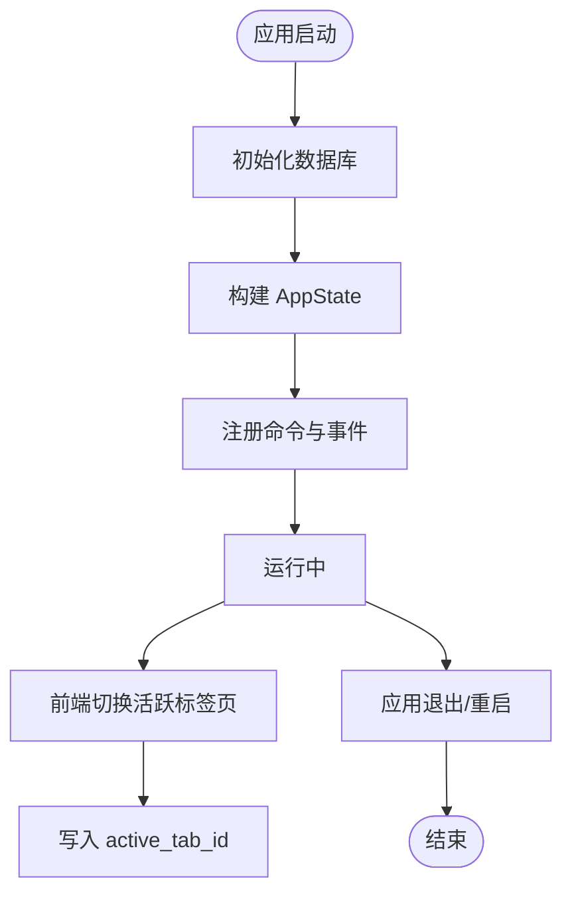
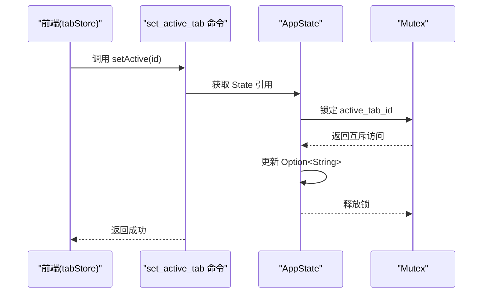
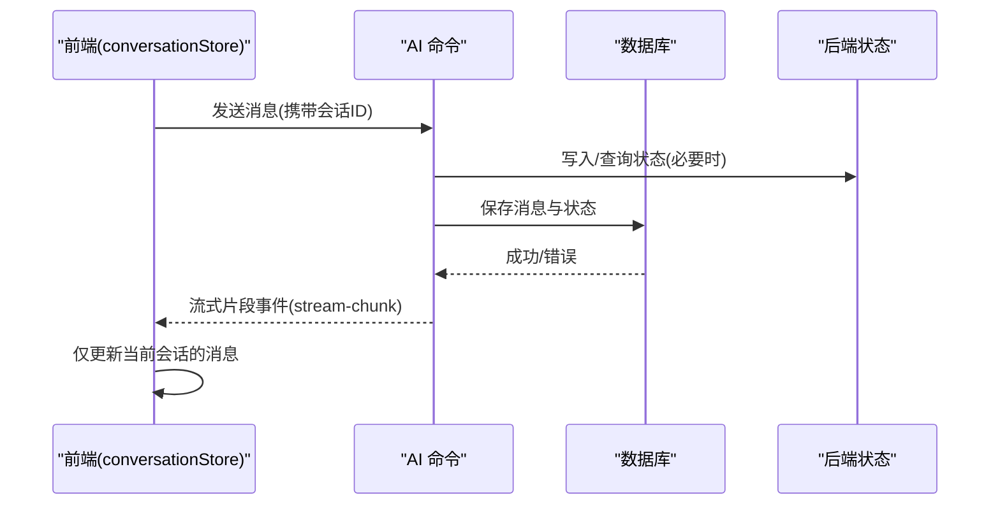
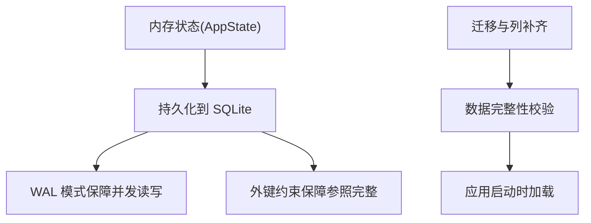
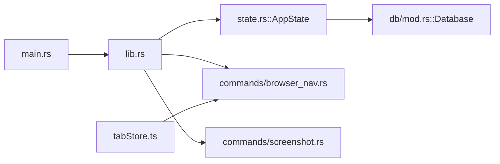

# 状态管理

<cite>
**本文引用的文件**
- [src-tauri/src/state.rs](file://src-tauri/src/state.rs)
- [src-tauri/src/lib.rs](file://src-tauri/src/lib.rs)
- [src-tauri/src/main.rs](file://src-tauri/src/main.rs)
- [src-tauri/src/db/mod.rs](file://src-tauri/src/db/mod.rs)
- [src-tauri/src/commands/browser_nav.rs](file://src-tauri/src/commands/browser_nav.rs)
- [src-tauri/src/commands/screenshot.rs](file://src-tauri/src/commands/screenshot.rs)
- [src-web/src/stores/tabStore.ts](file://src-web/src/stores/tabStore.ts)
- [src-web/src/stores/conversationStore.ts](file://src-web/src/stores/conversationStore.ts)
</cite>

## 目录
1. [简介](#简介)
2. [项目结构](#项目结构)
3. [核心组件](#核心组件)
4. [架构总览](#架构总览)
5. [详细组件分析](#详细组件分析)
6. [依赖关系分析](#依赖关系分析)
7. [性能考量](#性能考量)
8. [故障排查指南](#故障排查指南)
9. [结论](#结论)
10. [附录](#附录)

## 简介
本文件系统性梳理 CoSurf 的状态管理机制，围绕 AppState 设计理念、数据库与应用配置组织、状态生命周期、线程安全与并发控制、状态同步与一致性、持久化与恢复、监控与诊断、最佳实践与优化建议展开，并提供可直接定位到源码位置的参考路径，帮助开发者快速理解与扩展状态管理能力。

## 项目结构
CoSurf 的状态管理横跨后端 Rust（Tauri）与前端 TypeScript（Zustand）。后端负责全局状态与数据库持久化，前端负责 UI 交互态与会话态；二者通过命令通道与事件总线进行解耦协作。



图表来源
- [src-tauri/src/main.rs:1-6](file://src-tauri/src/main.rs#L1-L6)
- [src-tauri/src/lib.rs:15-107](file://src-tauri/src/lib.rs#L15-L107)
- [src-tauri/src/state.rs:9-23](file://src-tauri/src/state.rs#L9-L23)
- [src-tauri/src/db/mod.rs:11-30](file://src-tauri/src/db/mod.rs#L11-L30)
- [src-tauri/src/commands/browser_nav.rs:10-29](file://src-tauri/src/commands/browser_nav.rs#L10-L29)
- [src-tauri/src/commands/screenshot.rs:14-58](file://src-tauri/src/commands/screenshot.rs#L14-L58)
- [src-web/src/stores/tabStore.ts:38-229](file://src-web/src/stores/tabStore.ts#L38-L229)
- [src-web/src/stores/conversationStore.ts:27-364](file://src-web/src/stores/conversationStore.ts#L27-L364)

章节来源
- [src-tauri/src/main.rs:1-6](file://src-tauri/src/main.rs#L1-L6)
- [src-tauri/src/lib.rs:15-107](file://src-tauri/src/lib.rs#L15-L107)

## 核心组件
- AppState：后端全局状态容器，聚合数据库连接、应用数据目录、取消标志、活跃标签页 ID、页面内容响应缓存、Skills 管理器、最近打开 URL 去重映射、MCP 工具注册表等。
- Database：SQLite 连接封装，负责数据库初始化、WAL 模式、外键约束、迁移与列补全。
- 前端 Zustand Store：tabStore（标签页导航历史与活动态）、conversationStore（会话与消息流式渲染）。

章节来源
- [src-tauri/src/state.rs:9-23](file://src-tauri/src/state.rs#L9-L23)
- [src-tauri/src/db/mod.rs:11-30](file://src-tauri/src/db/mod.rs#L11-L30)
- [src-web/src/stores/tabStore.ts:6-20](file://src-web/src/stores/tabStore.ts#L6-L20)
- [src-web/src/stores/conversationStore.ts:8-25](file://src-web/src/stores/conversationStore.ts#L8-L25)

## 架构总览
后端通过 lib.rs 完成初始化：创建应用数据目录、初始化数据库、构建 AppState 并注入应用管理器；前端通过 Zustand 管理 UI 状态并通过命令与事件与后端交互。



图表来源
- [src-tauri/src/main.rs:3-5](file://src-tauri/src/main.rs#L3-L5)
- [src-tauri/src/lib.rs:50-73](file://src-tauri/src/lib.rs#L50-L73)
- [src-tauri/src/state.rs:26-79](file://src-tauri/src/state.rs#L26-L79)
- [src-tauri/src/db/mod.rs:16-30](file://src-tauri/src/db/mod.rs#L16-L30)
- [src-tauri/src/commands/browser_nav.rs:464-473](file://src-tauri/src/commands/browser_nav.rs#L464-L473)
- [src-web/src/stores/tabStore.ts:56-72](file://src-web/src/stores/tabStore.ts#L56-L72)

## 详细组件分析

### AppState 设计与职责
- 数据库连接：持有数据库互斥包装，提供统一连接句柄与迁移能力。
- 应用配置：应用数据目录路径，用于确定数据库与技能目录位置。
- 全局标志：取消标志用于中断长任务。
- 活跃标签页：Arc<Mutex<Option<String>>> 保护的活跃标签 ID，便于跨模块读写。
- 页面内容缓存：按请求 ID 缓存页面内容响应，避免重复抓取。
- Skills 管理器：延迟初始化与示例同步，确保技能目录可用。
- 最近打开 URL：时间戳去重，辅助去抖与历史管理。
- MCP 工具注册表：将 mcp_{server}_{tool} 映射到具体服务器与原始工具名，供调度分发。

```mermaid
classDiagram
class AppState {
+db : Mutex<Database>
+app_data_dir : PathBuf
+cancel_flag : Arc<AtomicBool>
+active_tab_id : Arc<Mutex<Option<String>>>
+page_content_responses : Arc~Mutex<HashMap~String,String~~>
+skills_manager : Arc~Mutex<SkillsManager~~>
+recent_opened_urls : Arc~Mutex<HashMap~String,Instant~~>
+mcp_tool_registry : Arc~Mutex<HashMap~String,(String,String)~~>
}
class Database {
+conn : Connection
+new(app_data_dir)
+run_migrations()
+ensure_thinking_content_column()
+ensure_mcp_server_columns()
}
AppState --> Database : "持有"
```

图表来源
- [src-tauri/src/state.rs:9-23](file://src-tauri/src/state.rs#L9-L23)
- [src-tauri/src/db/mod.rs:11-30](file://src-tauri/src/db/mod.rs#L11-L30)

章节来源
- [src-tauri/src/state.rs:9-23](file://src-tauri/src/state.rs#L9-L23)
- [src-tauri/src/state.rs:26-79](file://src-tauri/src/state.rs#L26-L79)

### 状态生命周期管理
- 初始化：lib.rs 在 setup 钩子中创建数据库、构建 AppState 并注入应用；同时注册全局快捷键与更新检查。
- 运行期更新：前端通过命令与事件驱动后端状态变更；例如切换活跃标签页写入 active_tab_id。
- 清理：应用退出时由 Tauri 生命周期管理资源释放；数据库连接随作用域释放。



图表来源
- [src-tauri/src/lib.rs:50-73](file://src-tauri/src/lib.rs#L50-L73)
- [src-tauri/src/commands/browser_nav.rs:464-473](file://src-tauri/src/commands/browser_nav.rs#L464-L473)
- [src-tauri/src/state.rs:72-73](file://src-tauri/src/state.rs#L72-L73)

章节来源
- [src-tauri/src/lib.rs:50-73](file://src-tauri/src/lib.rs#L50-L73)
- [src-tauri/src/commands/browser_nav.rs:464-473](file://src-tauri/src/commands/browser_nav.rs#L464-L473)

### 线程安全与并发控制
- 全局状态容器采用 Arc<Mutex<T>> 包装共享状态，确保跨线程安全访问。
- 局部状态（如浏览器导航）使用 lazy_static::lazy_static! + Mutex<HashMap<...>> 保护进程内共享状态。
- 前端状态使用 Zustand，内部以不可变更新策略降低竞态风险；与后端交互通过命令通道串行化。



图表来源
- [src-web/src/stores/tabStore.ts:65-72](file://src-web/src/stores/tabStore.ts#L65-L72)
- [src-tauri/src/commands/browser_nav.rs:464-473](file://src-tauri/src/commands/browser_nav.rs#L464-L473)
- [src-tauri/src/state.rs:13](file://src-tauri/src/state.rs#L13)

章节来源
- [src-tauri/src/state.rs:13](file://src-tauri/src/state.rs#L13)
- [src-tauri/src/commands/browser_nav.rs:464-473](file://src-tauri/src/commands/browser_nav.rs#L464-L473)
- [src-web/src/stores/tabStore.ts:65-72](file://src-web/src/stores/tabStore.ts#L65-L72)

### 状态一致性与同步
- 前后端一致性：前端 UI 状态与后端全局状态通过命令与事件对齐；例如前端切换标签页后立即通知后端，确保后续操作基于一致的活跃标签。
- 会话流式一致性：conversationStore 在收到“流式片段”事件时，仅对当前活跃会话进行增量更新，避免跨会话污染。
- 导航历史一致性：后端维护每个标签页的导航历史栈，支持后退/前进的原子性更新与边界检查。



图表来源
- [src-web/src/stores/conversationStore.ts:172-243](file://src-web/src/stores/conversationStore.ts#L172-L243)
- [src-tauri/src/db/mod.rs:42-148](file://src-tauri/src/db/mod.rs#L42-L148)

章节来源
- [src-web/src/stores/conversationStore.ts:172-243](file://src-web/src/stores/conversationStore.ts#L172-L243)
- [src-tauri/src/db/mod.rs:42-148](file://src-tauri/src/db/mod.rs#L42-L148)

### 状态持久化策略
- 内存状态：AppState 中的互斥容器（Mutex、Arc）承载运行时状态；页面内容响应、URL 去重、MCP 注册表等均驻留内存，提升访问性能。
- 磁盘存储：数据库负责会话、消息、书签、历史、设置、模型配置、MCP 服务器等结构化数据的持久化；迁移逻辑确保表结构演进与数据兼容。
- 恢复机制：应用启动时重建 AppState 并加载技能目录；数据库迁移确保历史数据可用。
- 数据完整性：启用 WAL 模式与外键约束；迁移阶段对缺失列进行补齐与数据转换。



图表来源
- [src-tauri/src/db/mod.rs:24-26](file://src-tauri/src/db/mod.rs#L24-L26)
- [src-tauri/src/db/mod.rs:149-170](file://src-tauri/src/db/mod.rs#L149-L170)
- [src-tauri/src/db/mod.rs:217-233](file://src-tauri/src/db/mod.rs#L217-L233)
- [src-tauri/src/db/mod.rs:235-266](file://src-tauri/src/db/mod.rs#L235-L266)

章节来源
- [src-tauri/src/db/mod.rs:24-26](file://src-tauri/src/db/mod.rs#L24-L26)
- [src-tauri/src/db/mod.rs:149-170](file://src-tauri/src/db/mod.rs#L149-L170)
- [src-tauri/src/db/mod.rs:217-233](file://src-tauri/src/db/mod.rs#L217-L233)
- [src-tauri/src/db/mod.rs:235-266](file://src-tauri/src/db/mod.rs#L235-L266)

### 状态监控与诊断
- 日志：初始化阶段输出数据库路径、技能目录、快捷键注册等关键信息，便于诊断。
- 截图事件：后端发出全屏截图事件，前端接收并处理，可用于 UI 诊断与反馈。
- 导航状态：后端维护每个标签页的导航历史与索引，前端据此判断可后退/前进状态。

章节来源
- [src-tauri/src/lib.rs:17-21](file://src-tauri/src/lib.rs#L17-L21)
- [src-tauri/src/lib.rs:75-93](file://src-tauri/src/lib.rs#L75-L93)
- [src-tauri/src/commands/screenshot.rs:47-57](file://src-tauri/src/commands/screenshot.rs#L47-L57)
- [src-tauri/src/commands/browser_nav.rs:10-29](file://src-tauri/src/commands/browser_nav.rs#L10-L29)

### 最佳实践与优化建议
- 使用 Arc<Mutex<T>> 管理跨线程共享状态，避免数据竞争。
- 将热点数据（如页面内容响应、URL 去重）放入内存缓存，减少数据库 IO。
- 严格区分前端 UI 状态与后端全局状态，通过命令与事件解耦。
- 在会话流式渲染中，仅对当前活跃会话进行状态更新，避免跨会话干扰。
- 启用 WAL 模式与外键约束，配合迁移逻辑保障数据一致性。
- 对于长耗时操作（如截图、网络请求），使用取消标志中断任务。

章节来源
- [src-tauri/src/state.rs:13](file://src-tauri/src/state.rs#L13)
- [src-tauri/src/commands/browser_nav.rs:464-473](file://src-tauri/src/commands/browser_nav.rs#L464-L473)
- [src-web/src/stores/conversationStore.ts:172-243](file://src-web/src/stores/conversationStore.ts#L172-L243)
- [src-tauri/src/db/mod.rs:24-26](file://src-tauri/src/db/mod.rs#L24-L26)

### 实际代码示例与扩展指南
- 初始化与注入 AppState
  - 参考路径：[lib.rs 初始化与注入:50-73](file://src-tauri/src/lib.rs#L50-L73)
- 切换活跃标签页
  - 参考路径：[browser_nav.rs set_active_tab:464-473](file://src-tauri/src/commands/browser_nav.rs#L464-L473)、[tabStore.ts setActiveTab:56-72](file://src-web/src/stores/tabStore.ts#L56-L72)
- 流式消息更新
  - 参考路径：[conversationStore.ts 流式片段处理:172-243](file://src-web/src/stores/conversationStore.ts#L172-L243)
- 数据库迁移与列补齐
  - 参考路径：[db/mod.rs 迁移与列补齐:42-148](file://src-tauri/src/db/mod.rs#L42-L148)、[db/mod.rs ensure_mcp_server_columns:235-266](file://src-tauri/src/db/mod.rs#L235-L266)
- 截图事件与前端接收
  - 参考路径：[commands/screenshot.rs 全屏截图:14-58](file://src-tauri/src/commands/screenshot.rs#L14-L58)

章节来源
- [src-tauri/src/lib.rs:50-73](file://src-tauri/src/lib.rs#L50-L73)
- [src-tauri/src/commands/browser_nav.rs:464-473](file://src-tauri/src/commands/browser_nav.rs#L464-L473)
- [src-web/src/stores/tabStore.ts:56-72](file://src-web/src/stores/tabStore.ts#L56-L72)
- [src-web/src/stores/conversationStore.ts:172-243](file://src-web/src/stores/conversationStore.ts#L172-L243)
- [src-tauri/src/db/mod.rs:42-148](file://src-tauri/src/db/mod.rs#L42-L148)
- [src-tauri/src/db/mod.rs:235-266](file://src-tauri/src/db/mod.rs#L235-L266)
- [src-tauri/src/commands/screenshot.rs:14-58](file://src-tauri/src/commands/screenshot.rs#L14-L58)

## 依赖关系分析
- 入口与初始化：main.rs -> lib.rs -> state.rs/new() -> db/mod.rs::Database::new()
- 命令注册：lib.rs -> commands/*（导航、截图、会话、消息等）
- 前后端状态：tabStore.ts 与 browser_nav.rs 通过命令与事件保持一致



图表来源
- [src-tauri/src/main.rs:3-5](file://src-tauri/src/main.rs#L3-L5)
- [src-tauri/src/lib.rs:50-73](file://src-tauri/src/lib.rs#L50-L73)
- [src-tauri/src/state.rs:26-79](file://src-tauri/src/state.rs#L26-L79)
- [src-tauri/src/db/mod.rs:16-30](file://src-tauri/src/db/mod.rs#L16-L30)
- [src-tauri/src/commands/browser_nav.rs:464-473](file://src-tauri/src/commands/browser_nav.rs#L464-L473)
- [src-tauri/src/commands/screenshot.rs:14-58](file://src-tauri/src/commands/screenshot.rs#L14-L58)
- [src-web/src/stores/tabStore.ts:56-72](file://src-web/src/stores/tabStore.ts#L56-L72)

章节来源
- [src-tauri/src/main.rs:3-5](file://src-tauri/src/main.rs#L3-L5)
- [src-tauri/src/lib.rs:50-73](file://src-tauri/src/lib.rs#L50-L73)

## 性能考量
- 内存缓存：页面内容响应与 URL 去重映射应限制容量与过期策略，避免内存膨胀。
- 数据库并发：WAL 模式提升并发读写吞吐；合理使用事务批量写入。
- 前端渲染：流式消息增量更新，避免整树重渲染；导航历史栈长度控制。
- I/O 优化：截图等高成本操作应异步执行并支持取消。

## 故障排查指南
- 初始化失败：检查应用数据目录权限与数据库文件路径。
  - 参考路径：[lib.rs 初始化日志与路径:50-73](file://src-tauri/src/lib.rs#L50-L73)
- 技能目录异常：确认技能目录存在且可写，必要时重建目录。
  - 参考路径：[state.rs 技能目录初始化:28-47](file://src-tauri/src/state.rs#L28-L47)
- 导航状态异常：检查标签页状态锁与历史栈边界。
  - 参考路径：[browser_nav.rs 导航状态:10-29](file://src-tauri/src/commands/browser_nav.rs#L10-L29)
- 数据库迁移失败：关注迁移日志与缺失列补齐。
  - 参考路径：[db/mod.rs 迁移与列补齐:149-170](file://src-tauri/src/db/mod.rs#L149-L170)

章节来源
- [src-tauri/src/lib.rs:50-73](file://src-tauri/src/lib.rs#L50-L73)
- [src-tauri/src/state.rs:28-47](file://src-tauri/src/state.rs#L28-L47)
- [src-tauri/src/commands/browser_nav.rs:10-29](file://src-tauri/src/commands/browser_nav.rs#L10-L29)
- [src-tauri/src/db/mod.rs:149-170](file://src-tauri/src/db/mod.rs#L149-L170)

## 结论
CoSurf 的状态管理以 AppState 为核心，结合数据库持久化与前端 Zustand 状态，实现了前后端解耦、线程安全与一致性保障。通过合理的内存缓存、数据库迁移与事件驱动机制，系统在性能与可靠性之间取得平衡。建议在扩展新状态时遵循现有模式：后端用 Arc<Mutex<T>> 管理共享状态，前端用不可变更新策略，命令与事件作为同步桥梁。

## 附录
- 快速定位
  - AppState 定义与初始化：[state.rs:9-79](file://src-tauri/src/state.rs#L9-L79)
  - 数据库初始化与迁移：[db/mod.rs:16-148](file://src-tauri/src/db/mod.rs#L16-L148)
  - 前端标签页状态：[tabStore.ts:38-229](file://src-web/src/stores/tabStore.ts#L38-L229)
  - 前端会话状态与流式更新：[conversationStore.ts:27-364](file://src-web/src/stores/conversationStore.ts#L27-L364)
  - 导航命令与活跃标签写入：[browser_nav.rs:464-473](file://src-tauri/src/commands/browser_nav.rs#L464-L473)
  - 截图命令与事件：[screenshot.rs:14-58](file://src-tauri/src/commands/screenshot.rs#L14-L58)