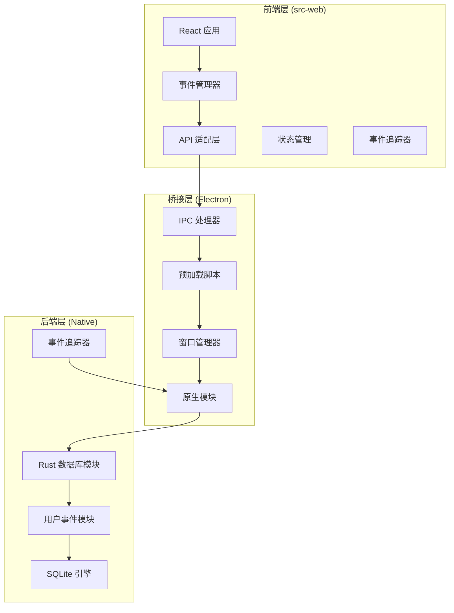
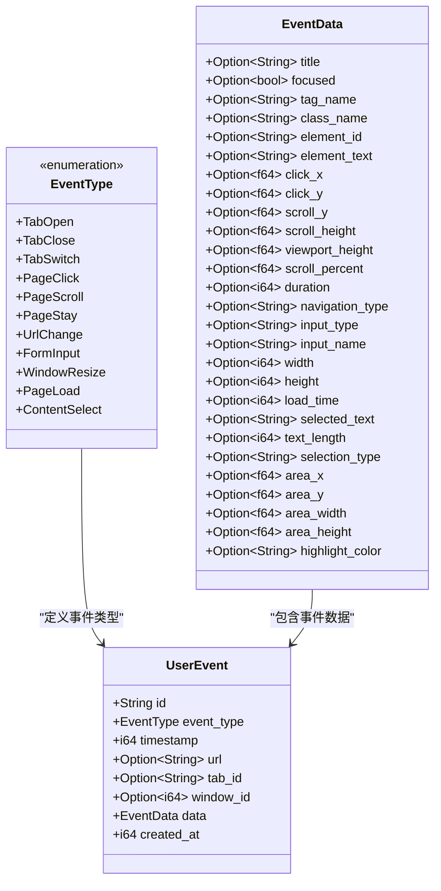
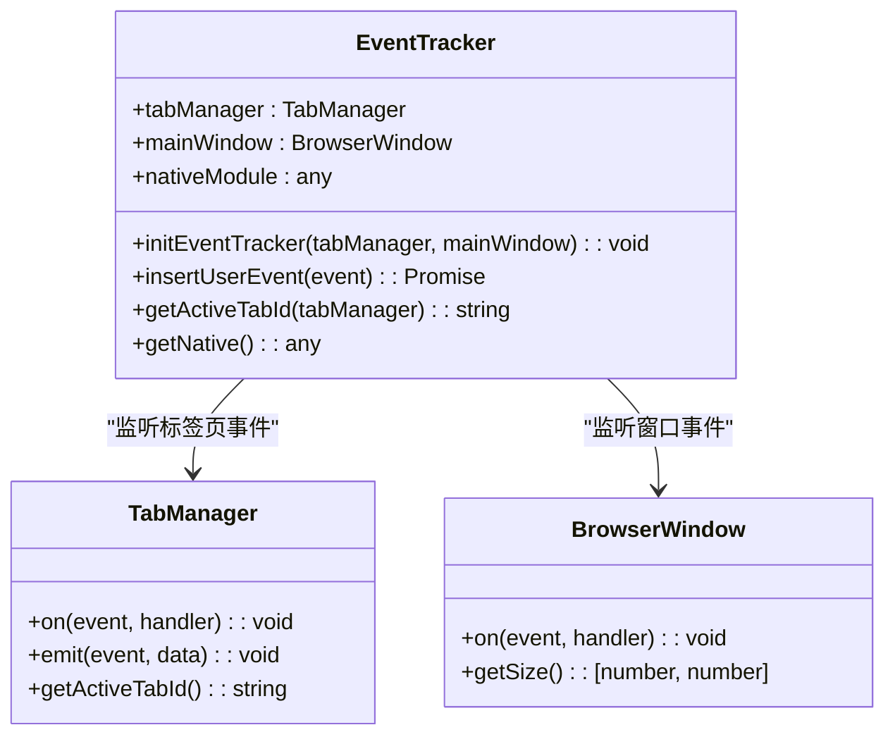
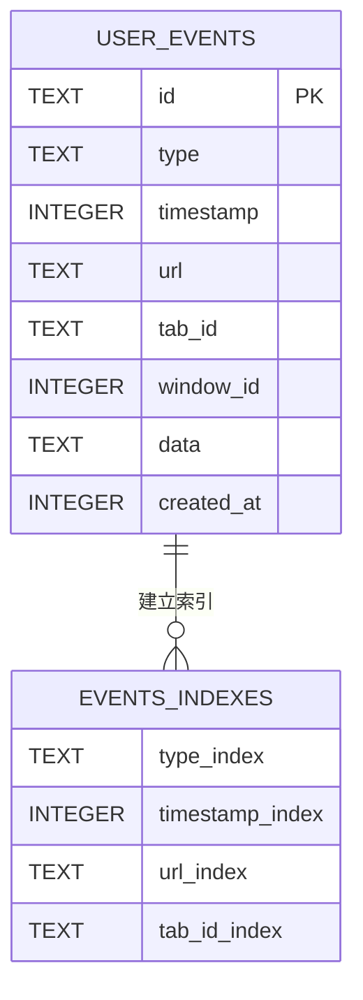
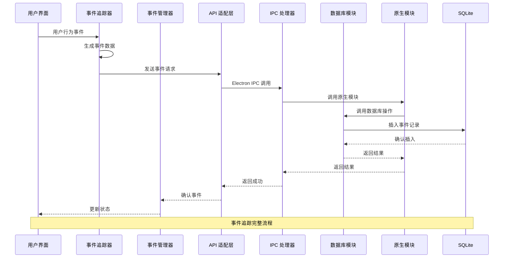
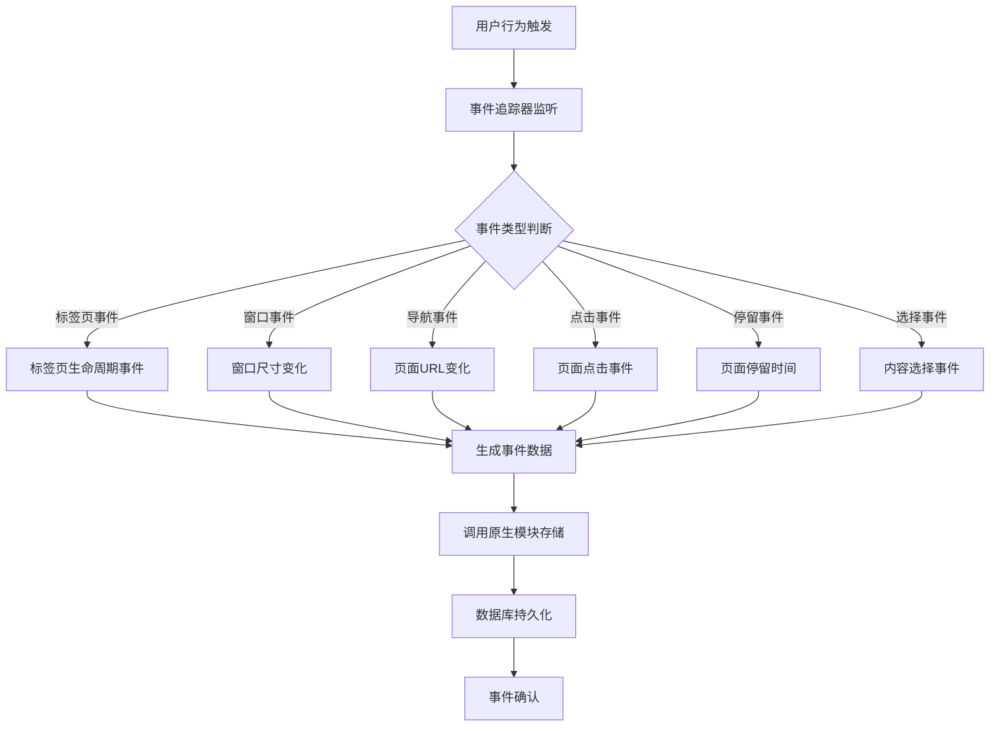
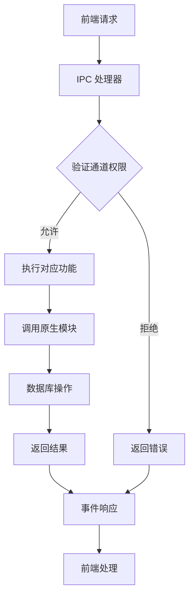
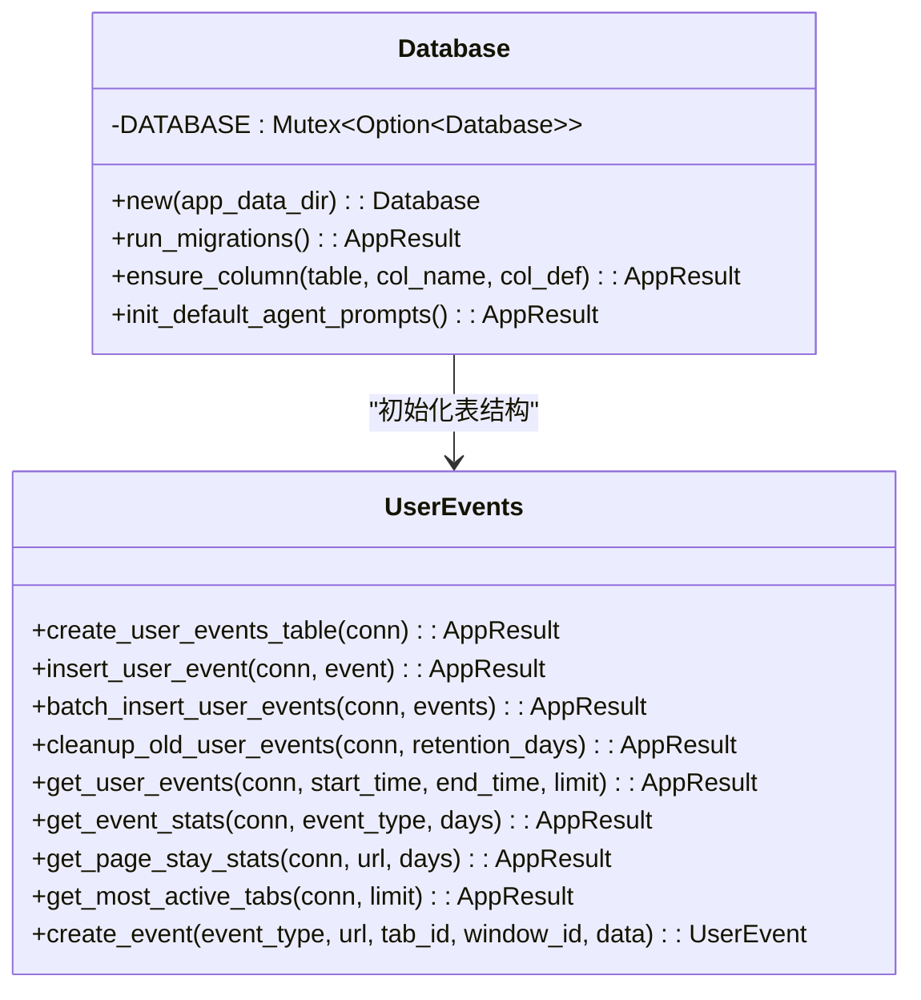
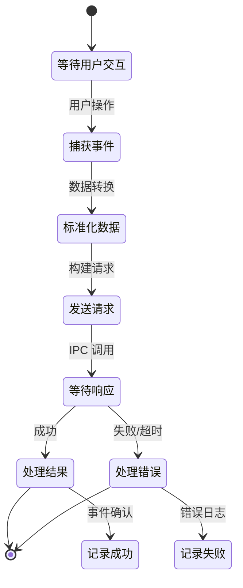
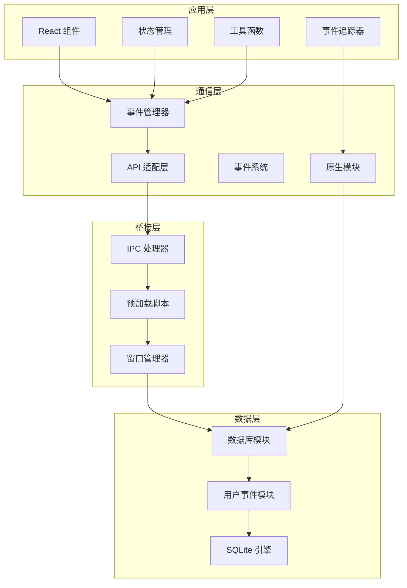

# 用户行为事件跟踪系统

<cite>
**本文档引用的文件**
- [event-tracker.ts](file://electron/modules/event-tracker.ts)
- [user_events.rs](file://native/src/db/user_events.rs)
- [mod.rs](file://native/src/db/mod.rs)
- [ipc-handlers.ts](file://electron/ipc-handlers.ts)
- [preload.ts](file://electron/preload.ts)
- [window-manager.ts](file://electron/window-manager.ts)
- [eventManager.ts](file://src-web/src/lib/eventManager.ts)
- [events.ts](file://src-web/src/lib/events.ts)
- [api.ts](file://src-web/src/lib/api.ts)
- [tabStore.ts](file://src-web/src/stores/tabStore.ts)
- [WebContentView.tsx](file://src-web/src/components/layout/WebContentView.tsx)
- [browserEngine.ts](file://src-web/src/lib/browserEngine.ts)
</cite>

## 更新摘要
**变更内容**
- 新增完整的 event-tracker 模块，提供原生事件追踪功能
- 增强 IPC 处理器，支持用户事件的实时追踪和存储
- 扩展数据库架构，增加用户事件表管理和统计分析功能
- 集成原生模块，实现高性能的事件存储和查询
- 完善前端事件处理机制，支持多种用户交互事件

## 目录
1. [简介](#简介)
2. [项目结构](#项目结构)
3. [核心组件](#核心组件)
4. [架构概览](#架构概览)
5. [详细组件分析](#详细组件分析)
6. [依赖关系分析](#依赖关系分析)
7. [性能考虑](#性能考虑)
8. [故障排除指南](#故障排除指南)
9. [结论](#结论)

## 简介

用户行为事件跟踪系统是一个完整的浏览器行为监控解决方案，旨在记录和分析用户在CoSurf应用中的各种交互行为。该系统通过多层次的架构设计，实现了从用户界面到数据库的完整事件追踪链路。

**更新** 新增了原生模块集成的事件追踪器，提供更高效、可靠的事件收集和存储能力。

系统主要功能包括：
- **多维度事件收集**：跟踪标签页操作、页面交互、用户输入等各类行为
- **实时数据存储**：使用SQLite数据库进行高效的数据持久化
- **智能数据清理**：自动清理过期数据，保持系统性能
- **灵活的查询接口**：提供丰富的统计和分析功能
- **跨平台兼容**：支持Electron和Web环境的统一事件处理
- **原生模块集成**：通过Rust原生模块提供高性能事件处理能力

## 项目结构

CoSurf项目采用现代化的分层架构，将用户行为事件跟踪系统集成在整体应用框架中：

**图表来源**
- [event-tracker.ts:72-220](file://electron/modules/event-tracker.ts#L72-L220)
- [ipc-handlers.ts:48-541](file://electron/ipc-handlers.ts#L48-L541)
- [user_events.rs:183-210](file://native/src/db/user_events.rs#L183-L210)

**章节来源**
- [event-tracker.ts:1-220](file://electron/modules/event-tracker.ts#L1-L220)
- [ipc-handlers.ts:1-742](file://electron/ipc-handlers.ts#L1-L742)
- [user_events.rs:1-481](file://native/src/db/user_events.rs#L1-L481)

## 核心组件

### 用户事件数据模型

系统定义了完整的用户行为事件数据结构，支持多种事件类型和灵活的数据存储：

**图表来源**
- [user_events.rs:12-181](file://native/src/db/user_events.rs#L12-L181)

### 事件追踪器模块

**新增** 事件追踪器是系统的核心组件，负责监听用户行为并实时追踪：

**图表来源**
- [event-tracker.ts:72-220](file://electron/modules/event-tracker.ts#L72-L220)

### 数据库架构

系统使用SQLite作为数据存储引擎，通过Rust的napi-rs实现跨语言调用：

**图表来源**
- [user_events.rs:183-210](file://native/src/db/user_events.rs#L183-L210)

**章节来源**
- [event-tracker.ts:38-67](file://electron/modules/event-tracker.ts#L38-L67)
- [user_events.rs:12-181](file://native/src/db/user_events.rs#L12-L181)
- [mod.rs:251-255](file://native/src/db/mod.rs#L251-L255)

## 架构概览

用户行为事件跟踪系统采用分层架构设计，实现了前后端分离和数据持久化的完整解决方案：

**图表来源**
- [event-tracker.ts:38-67](file://electron/modules/event-tracker.ts#L38-L67)
- [eventManager.ts:40-82](file://src-web/src/lib/eventManager.ts#L40-L82)
- [api.ts:13-19](file://src-web/src/lib/api.ts#L13-L19)

## 详细组件分析

### 事件追踪器 (Event Tracker)

**新增** 事件追踪器是系统的核心组件，提供了完整的用户行为追踪功能：

**图表来源**
- [event-tracker.ts:72-220](file://electron/modules/event-tracker.ts#L72-L220)

事件追踪器的主要特性：
- **多事件类型支持**：支持标签页、窗口、导航、点击、停留、内容选择等多种事件
- **实时事件处理**：事件发生时立即处理，确保数据完整性
- **原生模块集成**：通过原生模块实现高性能事件存储
- **自动清理机制**：定时清理过期事件数据
- **错误处理**：完善的错误捕获和处理机制

**章节来源**
- [event-tracker.ts:72-220](file://electron/modules/event-tracker.ts#L72-L220)

### IPC 通信层

IPC（进程间通信）层负责前端与Electron主进程之间的数据交换：

**图表来源**
- [ipc-handlers.ts:29-35](file://electron/ipc-handlers.ts#L29-L35)
- [preload.ts:190-235](file://electron/preload.ts#L190-L235)

IPC处理器的功能包括：
- **安全通道管理**：白名单机制控制允许的通信通道
- **方法调用转发**：将前端请求转发到相应的处理函数
- **错误异常处理**：统一的错误捕获和处理机制
- **流式数据传输**：支持AI对话等长时间运行的任务
- **用户事件处理**：专门处理用户行为事件的IPC调用

**章节来源**
- [ipc-handlers.ts:48-541](file://electron/ipc-handlers.ts#L48-L541)
- [preload.ts:30-138](file://electron/preload.ts#L30-L138)

### 数据库模块

数据库模块实现了完整的用户事件存储和查询功能：

**图表来源**
- [mod.rs:39-255](file://native/src/db/mod.rs#L39-L255)
- [user_events.rs:183-481](file://native/src/db/user_events.rs#L183-L481)

数据库模块的核心功能：
- **表结构管理**：自动创建和维护用户事件表结构
- **批量数据处理**：支持高性能的批量事件插入
- **数据清理策略**：自动清理超过保留期限的旧数据
- **统计分析功能**：提供事件统计和趋势分析接口
- **索引优化**：为常用查询字段建立索引，提高查询效率

**章节来源**
- [mod.rs:251-255](file://native/src/db/mod.rs#L251-L255)
- [user_events.rs:183-481](file://native/src/db/user_events.rs#L183-L481)

### 前端事件处理

前端组件负责捕获用户行为并将其转换为标准化的事件格式：

**图表来源**
- [WebContentView.tsx:137-151](file://src-web/src/components/layout/WebContentView.tsx#L137-L151)
- [browserEngine.ts:116-149](file://src-web/src/lib/browserEngine.ts#L116-L149)

前端事件处理的特点：
- **实时事件捕获**：直接监听DOM事件和用户操作
- **智能数据提取**：从页面中提取相关的上下文信息
- **跨域安全**：在跨域环境下提供安全的事件处理机制
- **性能优化**：通过事件节流和批处理提高系统性能

**章节来源**
- [WebContentView.tsx:17-108](file://src-web/src/components/layout/WebContentView.tsx#L17-L108)
- [browserEngine.ts:116-200](file://src-web/src/lib/browserEngine.ts#L116-L200)

## 依赖关系分析

系统各组件之间的依赖关系形成了清晰的层次结构：

**图表来源**
- [api.ts:1-50](file://src-web/src/lib/api.ts#L1-L50)
- [ipc-handlers.ts:1-47](file://electron/ipc-handlers.ts#L1-L47)
- [user_events.rs:1-12](file://native/src/db/user_events.rs#L1-L12)

**章节来源**
- [api.ts:1-435](file://src-web/src/lib/api.ts#L1-L435)
- [ipc-handlers.ts:1-742](file://electron/ipc-handlers.ts#L1-L742)
- [user_events.rs:1-481](file://native/src/db/user_events.rs#L1-L481)

## 性能考虑

用户行为事件跟踪系统在设计时充分考虑了性能优化：

### 数据库性能优化
- **索引策略**：为常用查询字段建立索引，提高查询效率
- **批量操作**：支持批量事件插入，减少数据库往返次数
- **连接池管理**：使用懒加载和连接复用机制
- **数据清理**：定期清理过期数据，保持数据库性能

### 内存管理
- **事件队列**：使用队列管理待处理事件，避免内存泄漏
- **超时机制**：自动清理超时的请求和响应
- **资源释放**：及时释放不再使用的事件监听器

### 网络优化
- **IPC 优化**：通过白名单机制减少不必要的通信
- **数据压缩**：对事件数据进行适当的压缩处理
- **异步处理**：采用异步模式处理耗时操作
- **原生模块优化**：通过Rust原生模块提供高性能事件处理

### 事件追踪优化
- **事件去重**：避免重复记录相同的用户行为
- **事件合并**：将相似的事件进行合并处理
- **异步存储**：事件记录采用异步方式进行，不影响用户体验
- **内存缓冲**：使用内存缓冲区暂存事件，定期批量写入数据库

## 故障排除指南

### 常见问题及解决方案

**问题1：事件未被记录**
- 检查事件管理器是否正确初始化
- 验证IPC通道权限设置
- 确认数据库连接状态
- 检查原生模块是否正确加载

**问题2：性能下降**
- 检查事件频率和数据大小
- 验证索引是否正确建立
- 监控数据库空间使用情况
- 检查事件追踪器的内存使用情况

**问题3：跨域事件处理失败**
- 确认页面同源策略设置
- 检查预加载脚本注入状态
- 验证事件监听器注册情况
- 检查原生模块的跨域访问权限

**问题4：原生模块加载失败**
- 确认原生模块文件是否存在
- 检查模块编译是否成功
- 验证模块版本兼容性
- 检查系统架构匹配情况

**章节来源**
- [eventManager.ts:98-105](file://src-web/src/lib/eventManager.ts#L98-L105)
- [ipc-handlers.ts:180-191](file://electron/ipc-handlers.ts#L180-L191)
- [user_events.rs:222-232](file://native/src/db/user_events.rs#L222-L232)

## 结论

用户行为事件跟踪系统通过精心设计的分层架构，实现了从用户界面到数据库的完整事件追踪解决方案。系统具有以下优势：

**技术优势**
- **模块化设计**：清晰的组件分离和职责划分
- **跨平台兼容**：统一的事件处理接口
- **高性能架构**：优化的数据库设计和通信机制
- **安全性保障**：严格的权限控制和错误处理
- **原生模块集成**：通过Rust原生模块提供高性能事件处理能力
- **实时事件追踪**：事件发生时立即处理，确保数据完整性

**应用场景**
- 用户行为分析和产品优化
- 个性化推荐和用户体验提升
- 系统使用统计和报告生成
- 用户体验监控和质量保证
- 用户行为模式识别和预测

**未来发展**
- 支持更多事件类型的扩展
- 增强实时分析和告警功能
- 优化大数据量下的性能表现
- 提供更丰富的统计分析工具
- 集成机器学习算法进行行为预测

**新增功能价值**
- **原生模块集成**：通过Rust原生模块提供更高的事件处理性能
- **完整的事件追踪器**：提供从事件捕获到存储的完整解决方案
- **增强的IPC处理**：支持更多类型的用户事件处理
- **改进的数据库架构**：优化的事件存储和查询机制

该系统为CoSurf应用提供了坚实的行为数据基础，为后续的功能扩展和数据分析奠定了良好的技术基础。新增的原生模块集成和完整的事件追踪器模块显著提升了系统的性能和可靠性，为用户提供更好的使用体验。