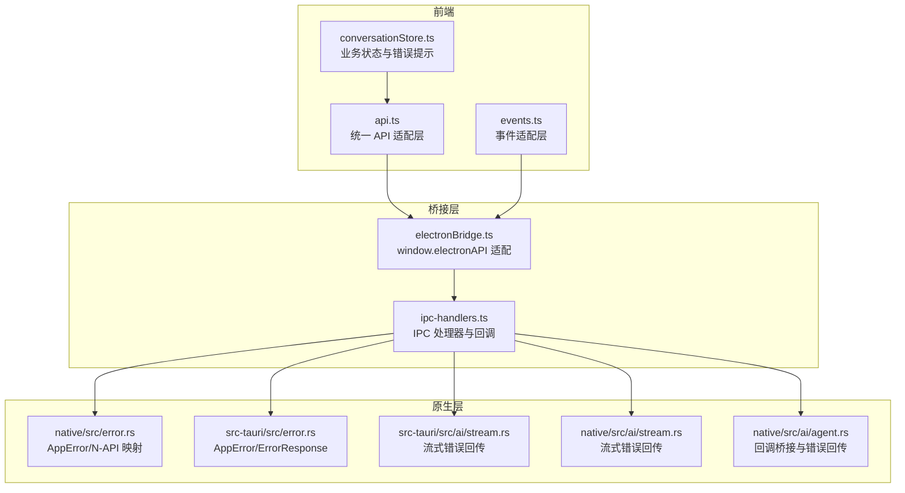
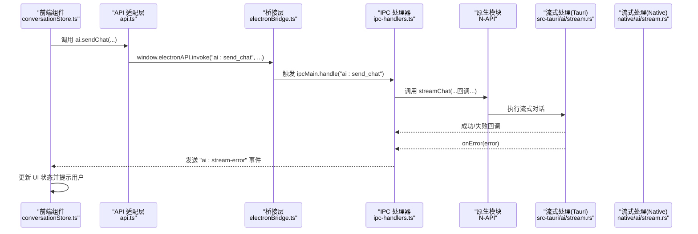
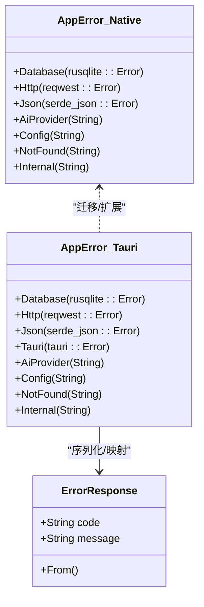
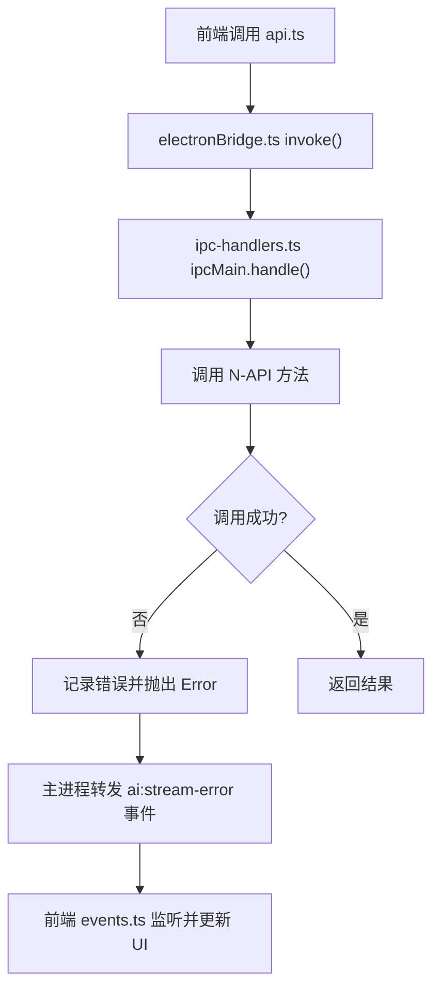
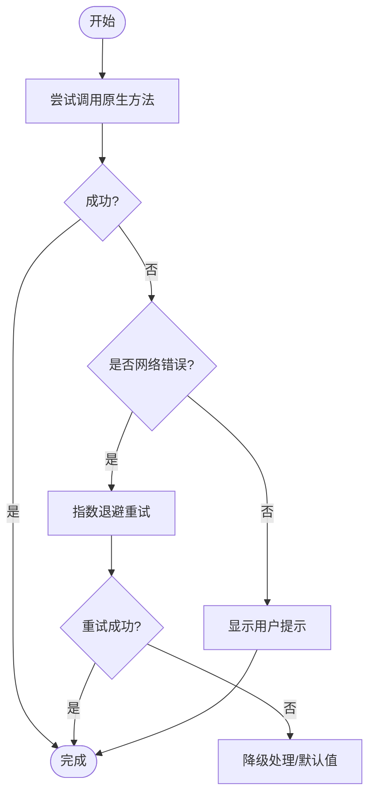
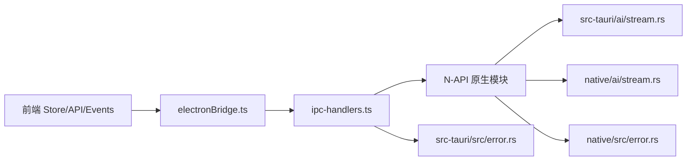

# 错误处理

<cite>
**本文引用的文件**
- [error.rs](file://src-tauri/src/error.rs)
- [error.rs](file://native/src/error.rs)
- [ipc-handlers.ts](file://electron/ipc-handlers.ts)
- [electronBridge.ts](file://src-web/src/lib/electronBridge.ts)
- [api.ts](file://src-web/src/lib/api.ts)
- [events.ts](file://src-web/src/lib/events.ts)
- [conversationStore.ts](file://src-web/src/stores/conversationStore.ts)
- [stream.rs](file://src-tauri/src/ai/stream.rs)
- [stream.rs](file://native/src/ai/stream.rs)
- [agent.rs](file://native/src/ai/agent.rs)
- [tauri.ts](file://src-web/src/lib/tauri.ts)
</cite>

## 目录
1. [简介](#简介)
2. [项目结构](#项目结构)
3. [核心组件](#核心组件)
4. [架构总览](#架构总览)
5. [详细组件分析](#详细组件分析)
6. [依赖关系分析](#依赖关系分析)
7. [性能考量](#性能考量)
8. [故障排除指南](#故障排除指南)
9. [结论](#结论)
10. [附录](#附录)

## 简介
本文件系统性梳理 CoSurf 的错误处理机制，覆盖自定义错误类型、错误码设计、错误传播链路（前端到后端再到 IPC 返回）、错误恢复策略（重试、降级、用户提示）、日志记录策略（级别、结构化、调试信息）、错误监控与报告（崩溃、性能指标、用户体验追踪），并总结常见错误场景的处理模式与最佳实践。

## 项目结构
CoSurf 当前采用 Electron 作为主进程桥接，前端通过统一的桥接层与主进程通信；原 Tauri 能力已迁移至 Electron。错误处理贯穿三层：
- 前端层：统一的 API/事件适配层，负责错误透传与用户提示
- 桥接层：Electron IPC 处理器，负责调用原生模块与事件分发
- 原生层：Rust 错误类型与回调错误回传，结合日志与事件通知

**图表来源**
- [api.ts:13-19](file://src-web/src/lib/api.ts#L13-L19)
- [electronBridge.ts:33-46](file://src-web/src/lib/electronBridge.ts#L33-L46)
- [ipc-handlers.ts:29-35](file://electron/ipc-handlers.ts#L29-L35)
- [error.rs:5-37](file://native/src/error.rs#L5-L37)
- [error.rs:4-63](file://src-tauri/src/error.rs#L4-L63)
- [stream.rs:396-570](file://src-tauri/src/ai/stream.rs#L396-L570)
- [stream.rs:428-463](file://native/src/ai/stream.rs#L428-L463)
- [agent.rs:76-99](file://native/src/ai/agent.rs#L76-L99)

**章节来源**
- [api.ts:1-429](file://src-web/src/lib/api.ts#L1-L429)
- [electronBridge.ts:1-100](file://src-web/src/lib/electronBridge.ts#L1-L100)
- [ipc-handlers.ts:1-712](file://electron/ipc-handlers.ts#L1-L712)
- [error.rs:1-37](file://native/src/error.rs#L1-L37)
- [error.rs:1-64](file://src-tauri/src/error.rs#L1-L64)
- [stream.rs:396-570](file://src-tauri/src/ai/stream.rs#L396-L570)
- [stream.rs:428-463](file://native/src/ai/stream.rs#L428-L463)
- [agent.rs:76-99](file://native/src/ai/agent.rs#L76-L99)

## 核心组件
- 自定义错误类型与错误码
  - 原生层（Electron/N-API）：定义 AppError 枚举，覆盖数据库、HTTP、JSON、AI Provider、配置、未找到、内部错误等；提供 N-API 错误映射。
  - Tauri 层：定义 AppError 并实现序列化，提供 ErrorResponse 结构，便于跨语言传输。
- IPC 错误传播
  - 主进程处理器对原生调用进行 try/catch，记录错误并抛出标准错误；流式回调中通过事件向前端回传错误。
- 前端错误恢复与提示
  - API 层统一解析原生返回的 JSON 字符串；事件层统一监听流式错误；业务 Store 在错误发生时更新 UI 状态并提示用户。
- 日志与调试
  - 原生层广泛使用 tracing 日志；主进程处理器记录调用与错误；前端 Store 记录关键交互与错误堆栈。

**章节来源**
- [error.rs:5-37](file://native/src/error.rs#L5-L37)
- [error.rs:4-63](file://src-tauri/src/error.rs#L4-L63)
- [ipc-handlers.ts:215-225](file://electron/ipc-handlers.ts#L215-L225)
- [ipc-handlers.ts:302-308](file://electron/ipc-handlers.ts#L302-L308)
- [api.ts:25-49](file://src-web/src/lib/api.ts#L25-L49)
- [events.ts:51-66](file://src-web/src/lib/events.ts#L51-L66)
- [conversationStore.ts:199-209](file://src-web/src/stores/conversationStore.ts#L199-L209)

## 架构总览
下面以“发送聊天消息”为例，展示从前端到原生再到 IPC 的完整错误传播链路。

**图表来源**
- [conversationStore.ts:176-242](file://src-web/src/stores/conversationStore.ts#L176-L242)
- [api.ts:254-260](file://src-web/src/lib/api.ts#L254-L260)
- [electronBridge.ts:33-46](file://src-web/src/lib/electronBridge.ts#L33-L46)
- [ipc-handlers.ts:231-315](file://electron/ipc-handlers.ts#L231-L315)
- [stream.rs:396-570](file://src-tauri/src/ai/stream.rs#L396-L570)

## 详细组件分析

### 自定义错误类型与错误码设计
- 原生层 AppError
  - 覆盖数据库、HTTP、JSON、AI Provider、配置、未找到、内部错误等；通过 thiserror 提供统一错误字符串表示；提供 N-API 错误映射。
- Tauri 层 AppError/ErrorResponse
  - 为 IPC 序列化提供实现；将具体错误映射为带语义的 code/message，便于前端识别与提示。
- 错误码设计建议
  - 建议在 ErrorResponse 中为每类错误分配稳定字符串码（如 DATABASE_ERROR、HTTP_ERROR、AI_PROVIDER_ERROR、NOT_FOUND、INTERNAL_ERROR），并与前端 UI 提示、日志标签保持一致。

**图表来源**
- [error.rs:5-37](file://native/src/error.rs#L5-L37)
- [error.rs:4-63](file://src-tauri/src/error.rs#L4-L63)

**章节来源**
- [error.rs:5-37](file://native/src/error.rs#L5-L37)
- [error.rs:4-63](file://src-tauri/src/error.rs#L4-L63)

### 错误传播机制（前端调用到后端处理再到 IPC 返回）
- 前端调用
  - API 适配层统一调用 window.electronAPI.invoke；事件层统一 on/once/removeAllListeners。
- 主进程处理
  - IPC 处理器对原生调用进行 try/catch，记录错误并抛出标准错误；流式回调中通过事件向前端回传错误。
- 原生回调
  - 原生模块通过回调将错误字符串回传到主进程，再由主进程转发到前端事件通道。

**图表来源**
- [api.ts:13-19](file://src-web/src/lib/api.ts#L13-L19)
- [electronBridge.ts:33-46](file://src-web/src/lib/electronBridge.ts#L33-L46)
- [ipc-handlers.ts:215-225](file://electron/ipc-handlers.ts#L215-L225)
- [ipc-handlers.ts:302-308](file://electron/ipc-handlers.ts#L302-L308)
- [events.ts:51-66](file://src-web/src/lib/events.ts#L51-L66)

**章节来源**
- [api.ts:13-19](file://src-web/src/lib/api.ts#L13-L19)
- [electronBridge.ts:33-46](file://src-web/src/lib/electronBridge.ts#L33-L46)
- [ipc-handlers.ts:215-225](file://electron/ipc-handlers.ts#L215-L225)
- [ipc-handlers.ts:302-308](file://electron/ipc-handlers.ts#L302-L308)
- [events.ts:51-66](file://src-web/src/lib/events.ts#L51-L66)

### 错误恢复策略
- 重试机制
  - 对网络类错误（HTTP_ERROR）可在外层调用处增加指数退避重试；对临时性 AI Provider 错误可在前端提示后允许用户重试。
- 降级处理
  - 当原生模块不可用时，前端应优雅降级（例如返回默认值或禁用相关功能）；主进程处理器对原生方法缺失进行保护并抛出明确错误。
- 用户提示
  - Store 在错误发生时追加错误文本并结束流式状态；前端根据错误码显示友好提示（如检查网络、API Key、模型配置）。

**图表来源**
- [ipc-handlers.ts:325-332](file://electron/ipc-handlers.ts#L325-L332)
- [conversationStore.ts:235-242](file://src-web/src/stores/conversationStore.ts#L235-L242)

**章节来源**
- [ipc-handlers.ts:325-332](file://electron/ipc-handlers.ts#L325-L332)
- [conversationStore.ts:235-242](file://src-web/src/stores/conversationStore.ts#L235-L242)

### 日志记录策略
- 日志级别
  - 原生层使用 tracing 的 info/warn/error；主进程记录调用、结果与错误；前端 Store 记录关键交互。
- 结构化日志
  - 建议在主进程与原生层统一输出 JSON 结构的日志字段（如时间戳、级别、模块、消息体片段、会话 ID、消息 ID）。
- 调试信息收集
  - 收集模型配置、请求参数摘要、错误堆栈、事件序列号；在前端 Store 中保留最近一次错误的上下文。

**章节来源**
- [stream.rs:396-404](file://src-tauri/src/ai/stream.rs#L396-L404)
- [stream.rs:440-451](file://native/src/ai/stream.rs#L440-L451)
- [ipc-handlers.ts:216-223](file://electron/ipc-handlers.ts#L216-L223)
- [conversationStore.ts:176-196](file://src-web/src/stores/conversationStore.ts#L176-L196)

### 错误监控与报告机制
- 崩溃报告
  - 建议在主进程与原生层捕获未处理异常并上报；前端 Store 记录错误事件与用户操作序列。
- 性能指标
  - 记录流式响应耗时、工具调用次数、错误率；在前端埋点统计用户点击与错误触发频率。
- 用户体验追踪
  - 记录错误类型分布、重试次数、降级触发次数；结合用户反馈完善错误提示文案。

（本节为通用指导，无需特定文件引用）

### 常见错误场景与处理模式
- 原生模块不可用
  - 现象：调用 invoke 抛错或返回默认值
  - 处理：前端降级、禁用相关功能、提示用户重启应用
- 流式对话错误
  - 现象：ai:stream-error 事件被触发
  - 处理：Store 追加错误提示、结束流式状态、允许用户重试
- 数据库/配置错误
  - 现象：DB 操作失败或配置缺失
  - 处理：前端提示检查配置项、引导用户前往设置页

**章节来源**
- [ipc-handlers.ts:14-35](file://electron/ipc-handlers.ts#L14-L35)
- [ipc-handlers.ts:302-308](file://electron/ipc-handlers.ts#L302-L308)
- [conversationStore.ts:235-242](file://src-web/src/stores/conversationStore.ts#L235-L242)

### 调试技巧与故障排除
- 启用详细日志
  - 在主进程与原生层开启 info/warn/error 日志；前端 Store 输出关键事件与状态变化
- 复现最小化步骤
  - 通过事件序列与参数快照定位问题；优先复现网络错误与配置错误
- 错误码对照
  - 使用 ErrorResponse.code 与前端提示文案建立映射表，便于快速诊断

**章节来源**
- [error.rs:47-61](file://src-tauri/src/error.rs#L47-L61)
- [events.ts:51-66](file://src-web/src/lib/events.ts#L51-L66)

## 依赖关系分析
- 前端依赖桥接层与事件层，后者依赖主进程处理器；主进程处理器依赖原生模块与流式处理模块；原生模块依赖错误类型与日志库。
- IPC 错误传播路径清晰：主进程 try/catch -> 回调 onError -> 事件 ai:stream-error -> 前端 Store 更新 UI。

**图表来源**
- [conversationStore.ts:176-242](file://src-web/src/stores/conversationStore.ts#L176-L242)
- [electronBridge.ts:33-46](file://src-web/src/lib/electronBridge.ts#L33-L46)
- [ipc-handlers.ts:231-315](file://electron/ipc-handlers.ts#L231-L315)
- [stream.rs:396-570](file://src-tauri/src/ai/stream.rs#L396-L570)
- [stream.rs:428-463](file://native/src/ai/stream.rs#L428-L463)
- [error.rs:4-63](file://src-tauri/src/error.rs#L4-L63)
- [error.rs:5-37](file://native/src/error.rs#L5-L37)

**章节来源**
- [conversationStore.ts:176-242](file://src-web/src/stores/conversationStore.ts#L176-L242)
- [electronBridge.ts:33-46](file://src-web/src/lib/electronBridge.ts#L33-L46)
- [ipc-handlers.ts:231-315](file://electron/ipc-handlers.ts#L231-L315)
- [stream.rs:396-570](file://src-tauri/src/ai/stream.rs#L396-L570)
- [stream.rs:428-463](file://native/src/ai/stream.rs#L428-L463)
- [error.rs:4-63](file://src-tauri/src/error.rs#L4-L63)
- [error.rs:5-37](file://native/src/error.rs#L5-L37)

## 性能考量
- 流式错误回传避免阻塞主线程；前端应及时取消监听与清理回调，防止内存泄漏。
- 对网络错误进行指数退避与上限控制，避免频繁重试导致资源浪费。
- 在原生层对大消息进行分片处理与超时控制，减少长时间占用。

（本节为通用指导，无需特定文件引用）

## 故障排除指南
- 检查原生模块是否加载成功（前端 electronBridge.ts invoke 返回错误时）
- 查看主进程日志（ipc-handlers.ts 中的 console 输出）
- 在前端 Store 中确认事件监听是否正确（events.ts）
- 若为 AI Provider 错误，检查模型配置、API Key、网络连通性

**章节来源**
- [electronBridge.ts:33-46](file://src-web/src/lib/electronBridge.ts#L33-L46)
- [ipc-handlers.ts:216-223](file://electron/ipc-handlers.ts#L216-L223)
- [events.ts:51-66](file://src-web/src/lib/events.ts#L51-L66)
- [conversationStore.ts:235-242](file://src-web/src/stores/conversationStore.ts#L235-L242)

## 结论
CoSurf 的错误处理机制以 Electron 为主干，结合原生层的统一错误类型与流式回调，实现了从前端到原生的闭环错误传播。通过结构化日志与事件驱动的错误提示，系统具备良好的可观测性与可维护性。建议进一步完善错误码映射、统一错误上报与可视化监控，持续提升用户体验与稳定性。

## 附录
- 代码示例路径（不含具体代码内容）
  - 自定义错误类型定义与映射
    - [原生错误类型:5-37](file://native/src/error.rs#L5-L37)
    - [Tauri 错误类型与 ErrorResponse:4-63](file://src-tauri/src/error.rs#L4-L63)
  - IPC 错误传播与事件回传
    - [主进程处理器错误捕获与事件发送:215-225](file://electron/ipc-handlers.ts#L215-L225)
    - [流式错误回调与事件发送:302-308](file://electron/ipc-handlers.ts#L302-L308)
  - 前端错误恢复与提示
    - [API 适配层统一解析:25-49](file://src-web/src/lib/api.ts#L25-L49)
    - [事件监听与错误处理:51-66](file://src-web/src/lib/events.ts#L51-L66)
    - [Store 中的错误提示与状态更新:199-209](file://src-web/src/stores/conversationStore.ts#L199-L209)
  - 原生层日志与错误回传
    - [Tauri 流式错误回传:552-567](file://src-tauri/src/ai/stream.rs#L552-L567)
    - [Native 流式错误回传:440-451](file://native/src/ai/stream.rs#L440-L451)
    - [原生回调桥接与错误回传:76-99](file://native/src/ai/agent.rs#L76-L99)
  - 已弃用 Tauri 适配层
    - [已弃用的 Tauri 适配层:6-12](file://src-web/src/lib/tauri.ts#L6-L12)