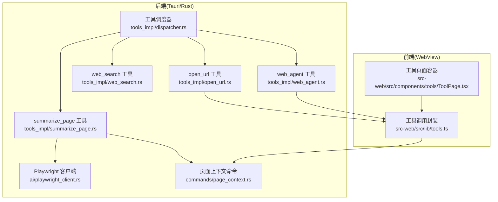
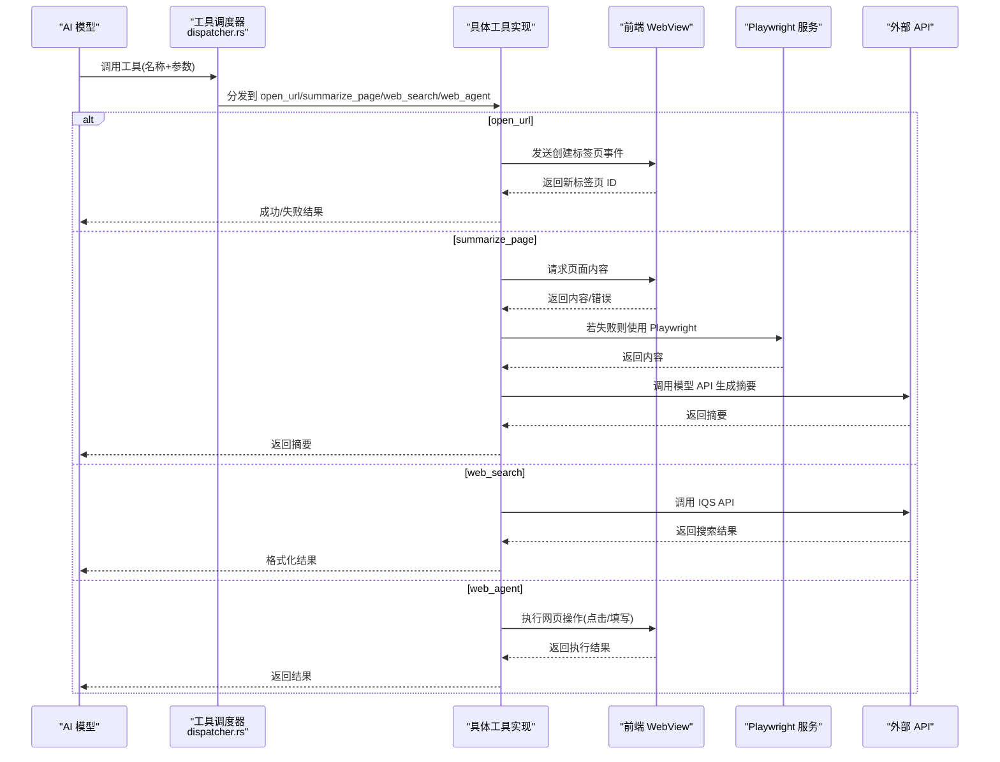
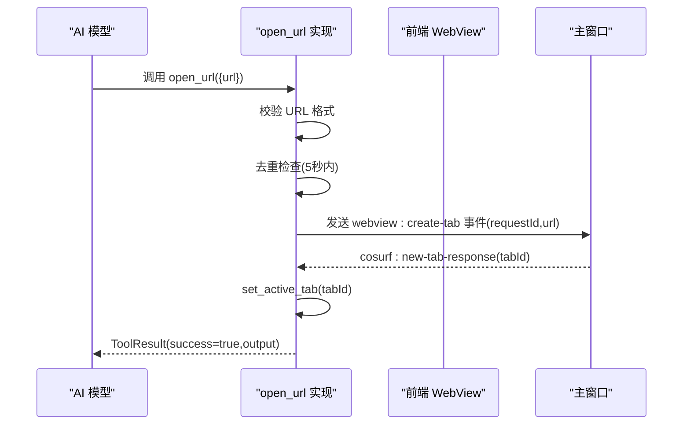
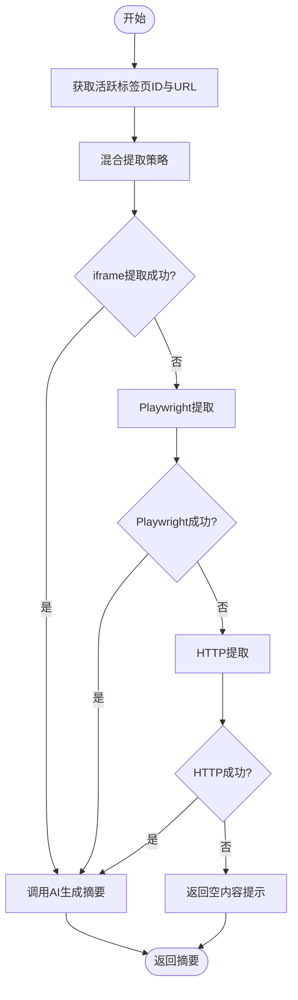
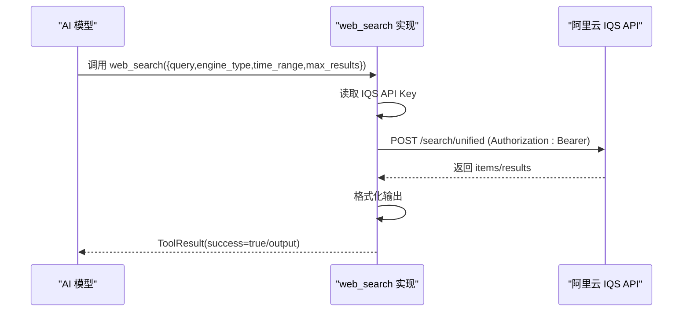
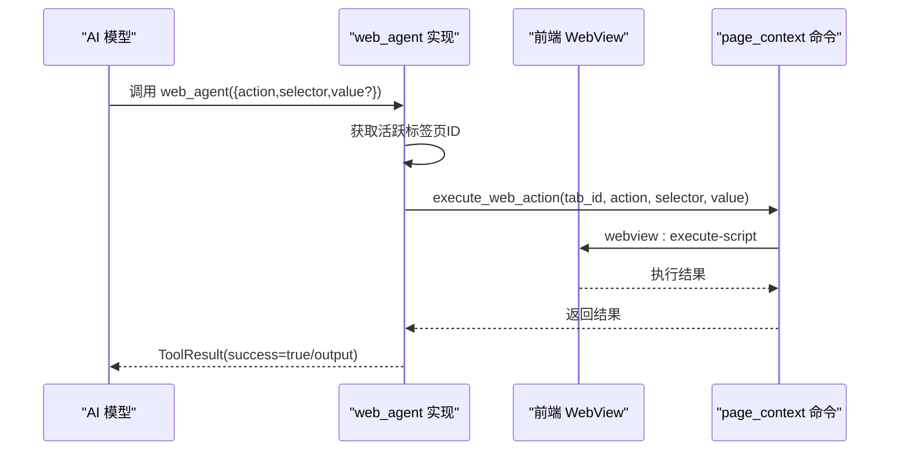
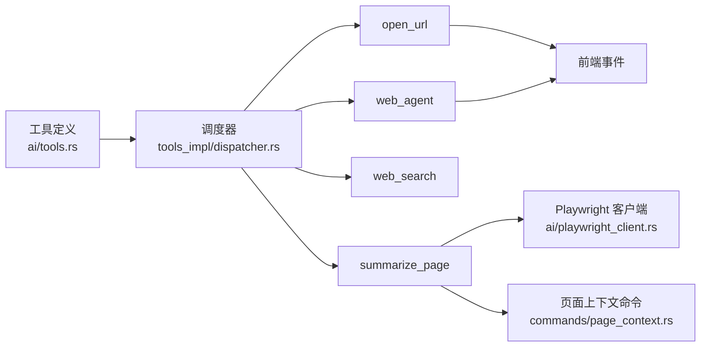

# 内置工具

<cite>
**本文引用的文件**
- [src-tauri/src/ai/tools.rs](file://src-tauri/src/ai/tools.rs)
- [src-tauri/src/ai/tools_impl/mod.rs](file://src-tauri/src/ai/tools_impl/mod.rs)
- [src-tauri/src/ai/tools_impl/dispatcher.rs](file://src-tauri/src/ai/tools_impl/dispatcher.rs)
- [src-tauri/src/ai/tools_impl/open_url.rs](file://src-tauri/src/ai/tools_impl/open_url.rs)
- [src-tauri/src/ai/tools_impl/summarize_page.rs](file://src-tauri/src/ai/tools_impl/summarize_page.rs)
- [src-tauri/src/ai/tools_impl/web_search.rs](file://src-tauri/src/ai/tools_impl/web_search.rs)
- [src-tauri/src/ai/tools_impl/web_agent.rs](file://src-tauri/src/ai/tools_impl/web_agent.rs)
- [src-tauri/src/ai/playwright_client.rs](file://src-tauri/src/ai/playwright_client.rs)
- [src-tauri/src/commands/page_context.rs](file://src-tauri/src/commands/page_context.rs)
- [src-web/src/lib/tools.ts](file://src-web/src/lib/tools.ts)
- [src-web/src/components/tools/ToolPage.tsx](file://src-web/src/components/tools/ToolPage.tsx)
- [BROWSER_AUTOMATION_GUIDE.md](file://BROWSER_AUTOMATION_GUIDE.md)
- [SUMMARIZE_PAGE_OPTIMIZATION.md](file://SUMMARIZE_PAGE_OPTIMIZATION.md)
- [examples/skills/web-summarizer/ SKILL.md](file://examples/skills/web-summarizer/ SKILL.md)
- [examples/alibabacloud-iqs-search-skill.md](file://examples/alibabacloud-iqs-search-skill.md)
</cite>

## 目录
1. [简介](#简介)
2. [项目结构](#项目结构)
3. [核心组件](#核心组件)
4. [架构总览](#架构总览)
5. [详细组件分析](#详细组件分析)
6. [依赖分析](#依赖分析)
7. [性能考量](#性能考量)
8. [故障排查指南](#故障排查指南)
9. [结论](#结论)
10. [附录](#附录)

## 简介
本文件面向 CoSurf 内置工具系统，聚焦四个核心工具的实现与使用：open_url、summarize_page、web_search、web_agent。文档覆盖：
- URL 解析与新标签页创建（open_url）
- 页面内容提取与摘要生成（summarize_page）
- 搜索引擎集成与结果解析（web_search）
- 网页元素操作与自动化（web_agent）
- 工具调用的参数、返回值、错误处理与异常机制
- 前后端协作流程与关键事件/命令映射

## 项目结构
CoSurf 的工具体系由 Rust 后端与 TypeScript 前端协同构成：
- 后端（Tauri/Rust）负责工具调度、事件监听、与前端通信、调用 Playwright 服务、与外部 API 交互
- 前端（React/Vue）负责页面内容提取、脚本执行、UI 交互，并通过事件/命令与后端通信

**图表来源**
- [src-tauri/src/ai/tools_impl/dispatcher.rs:14-55](file://src-tauri/src/ai/tools_impl/dispatcher.rs#L14-L55)
- [src-tauri/src/ai/tools_impl/open_url.rs:17-100](file://src-tauri/src/ai/tools_impl/open_url.rs#L17-L100)
- [src-tauri/src/ai/tools_impl/summarize_page.rs:17-55](file://src-tauri/src/ai/tools_impl/summarize_page.rs#L17-L55)
- [src-tauri/src/ai/tools_impl/web_search.rs:15-179](file://src-tauri/src/ai/tools_impl/web_search.rs#L15-L179)
- [src-tauri/src/ai/tools_impl/web_agent.rs:13-49](file://src-tauri/src/ai/tools_impl/web_agent.rs#L13-L49)
- [src-tauri/src/ai/playwright_client.rs:40-177](file://src-tauri/src/ai/playwright_client.rs#L40-L177)
- [src-tauri/src/commands/page_context.rs:21-327](file://src-tauri/src/commands/page_context.rs#L21-L327)
- [src-web/src/lib/tools.ts:39-124](file://src-web/src/lib/tools.ts#L39-L124)
- [src-web/src/components/tools/ToolPage.tsx:8-37](file://src-web/src/components/tools/ToolPage.tsx#L8-L37)

**章节来源**
- [src-tauri/src/ai/tools.rs:19-195](file://src-tauri/src/ai/tools.rs#L19-L195)
- [src-tauri/src/ai/tools_impl/mod.rs:1-14](file://src-tauri/src/ai/tools_impl/mod.rs#L1-L14)

## 核心组件
- 工具定义与参数规范：BuiltInTool 枚举、参数 JSON Schema、OpenAI function calling 格式
- 工具调度器：根据工具名分发到具体实现，支持内置工具、Skill 工具与 MCP 工具
- 事件与命令：后端通过事件/命令与前端通信，前端负责页面内容提取与脚本执行

**章节来源**
- [src-tauri/src/ai/tools.rs:19-195](file://src-tauri/src/ai/tools.rs#L19-L195)
- [src-tauri/src/ai/tools_impl/dispatcher.rs:14-55](file://src-tauri/src/ai/tools_impl/dispatcher.rs#L14-L55)

## 架构总览
工具调用的总体流程如下：

**图表来源**
- [src-tauri/src/ai/tools_impl/dispatcher.rs:34-54](file://src-tauri/src/ai/tools_impl/dispatcher.rs#L34-L54)
- [src-tauri/src/ai/tools_impl/open_url.rs:66-100](file://src-tauri/src/ai/tools_impl/open_url.rs#L66-L100)
- [src-tauri/src/ai/tools_impl/summarize_page.rs:14-55](file://src-tauri/src/ai/tools_impl/summarize_page.rs#L14-L55)
- [src-tauri/src/ai/tools_impl/web_search.rs:66-179](file://src-tauri/src/ai/tools_impl/web_search.rs#L66-L179)
- [src-tauri/src/ai/tools_impl/web_agent.rs:36-48](file://src-tauri/src/ai/tools_impl/web_agent.rs#L36-L48)
- [src-tauri/src/ai/playwright_client.rs:148-177](file://src-tauri/src/ai/playwright_client.rs#L148-L177)

## 详细组件分析

### open_url 工具
- 功能概述
  - 校验 URL 格式（必须以 http:// 或 https:// 开头）
  - 去重：5 秒内相同 URL 的重复请求将被识别并提示无需重复打开
  - 通知前端创建新标签页并导航，等待前端返回新标签页 ID，随后激活该标签页
  - 超时与错误处理：前端响应超时（15 秒）或主窗口不存在时返回错误
- 参数与返回
  - 参数：url（字符串，必填）
  - 返回：ToolResult（包含工具调用 ID、输出文本、成功标志）
- 关键实现要点
  - 事件监听与响应匹配：使用 cosurf:new-tab-response 事件，携带 requestId
  - 标签页去重：AppState 中 recent_opened_urls 记录最近打开的 URL 及时间戳
  - 前端交互：通过 webview:create-tab 事件创建标签页，再通过 set_active_tab 激活

**图表来源**
- [src-tauri/src/ai/tools_impl/open_url.rs:17-100](file://src-tauri/src/ai/tools_impl/open_url.rs#L17-L100)
- [src-tauri/src/ai/tools_impl/open_url.rs:103-145](file://src-tauri/src/ai/tools_impl/open_url.rs#L103-L145)

**章节来源**
- [src-tauri/src/ai/tools.rs:97-108](file://src-tauri/src/ai/tools.rs#L97-L108)
- [src-tauri/src/ai/tools_impl/open_url.rs:17-100](file://src-tauri/src/ai/tools_impl/open_url.rs#L17-L100)
- [src-tauri/src/ai/tools_impl/open_url.rs:103-145](file://src-tauri/src/ai/tools_impl/open_url.rs#L103-L145)

### summarize_page 工具
- 功能概述
  - 获取当前活跃标签页 ID 与 URL
  - 混合策略提取页面内容：iframe -> Playwright -> HTTP fallback
  - 使用 AI 模型生成摘要，支持 max_length 控制摘要长度
- 参数与返回
  - 参数：max_length（整数，可选，默认 500）
  - 返回：ToolResult（success=false 时输出友好提示，说明跨域/反爬限制）
- 内容提取策略
  - iframe 提取：向前端发送 webview:get-content 事件，等待 cosurf:page-content-response
  - Playwright 提取：通过 Playwright 服务启动会话、导航、获取内容
  - HTTP 提取：对目标 URL 发起 HTTP 请求，提取 HTML 文本
- 错误与异常
  - 超时：前端等待 10 秒，后端等待 3 秒；超时返回错误
  - 跨域/反爬：iframe 返回空内容，提示用户改用系统浏览器或使用 web_agent

**图表来源**
- [src-tauri/src/ai/tools_impl/summarize_page.rs:16-55](file://src-tauri/src/ai/tools_impl/summarize_page.rs#L16-L55)
- [src-tauri/src/ai/tools_impl/summarize_page.rs:140-202](file://src-tauri/src/ai/tools_impl/summarize_page.rs#L140-L202)
- [src-tauri/src/ai/playwright_client.rs:148-177](file://src-tauri/src/ai/playwright_client.rs#L148-L177)

**章节来源**
- [src-tauri/src/ai/tools.rs:65-75](file://src-tauri/src/ai/tools.rs#L65-L75)
- [src-tauri/src/ai/tools_impl/summarize_page.rs:16-55](file://src-tauri/src/ai/tools_impl/summarize_page.rs#L16-L55)
- [src-tauri/src/ai/tools_impl/summarize_page.rs:140-202](file://src-tauri/src/ai/tools_impl/summarize_page.rs#L140-L202)
- [src-tauri/src/ai/tools_impl/summarize_page.rs:295-340](file://src-tauri/src/ai/tools_impl/summarize_page.rs#L295-L340)
- [src-tauri/src/ai/playwright_client.rs:40-177](file://src-tauri/src/ai/playwright_client.rs#L40-L177)

### web_search 工具
- 功能概述
  - 使用阿里云 IQS API 进行联网搜索
  - 支持引擎类型、时间范围、最大结果数等参数
- 参数与返回
  - 参数：query（字符串，必填）、engine_type（枚举，默认 Generic）、time_range（枚举，默认 OneWeek）、max_results（整数，默认 5，范围 1-20）
  - 返回：ToolResult（成功时格式化结果列表，失败时返回错误信息）
- 关键实现要点
  - IQS API 端点：统一搜索接口
  - 认证：Authorization: Bearer {api_key}
  - 结果解析：优先 items，兼容 results；若为空返回“未找到相关结果”
  - 未配置 API Key：提示用户在设置中配置

**图表来源**
- [src-tauri/src/ai/tools_impl/web_search.rs:15-179](file://src-tauri/src/ai/tools_impl/web_search.rs#L15-L179)

**章节来源**
- [src-tauri/src/ai/tools.rs:127-157](file://src-tauri/src/ai/tools.rs#L127-L157)
- [src-tauri/src/ai/tools_impl/web_search.rs:15-179](file://src-tauri/src/ai/tools_impl/web_search.rs#L15-L179)
- [examples/alibabacloud-iqs-search-skill.md:1-146](file://examples/alibabacloud-iqs-search-skill.md#L1-L146)

### web_agent 工具
- 功能概述
  - 在当前页面执行自动化操作：点击、填写表单、关闭弹窗等
  - 通过现有 execute_web_action 命令实现，复用页面上下文命令
- 参数与返回
  - 参数：action（枚举 click/fill/select/scroll/wait）、selector（CSS 选择器，必填）、value（填写值，仅 fill 需要）
  - 返回：ToolResult（success=true，输出操作结果）
- 关键实现要点
  - 获取活跃标签页 ID
  - 调用 page_context::execute_web_action 执行脚本
  - 前端执行对应 DOM 操作（点击、输入、关闭弹窗等）

**图表来源**
- [src-tauri/src/ai/tools_impl/web_agent.rs:13-49](file://src-tauri/src/ai/tools_impl/web_agent.rs#L13-L49)
- [src-tauri/src/commands/page_context.rs:236-327](file://src-tauri/src/commands/page_context.rs#L236-L327)

**章节来源**
- [src-tauri/src/ai/tools.rs:76-96](file://src-tauri/src/ai/tools.rs#L76-L96)
- [src-tauri/src/ai/tools_impl/web_agent.rs:13-49](file://src-tauri/src/ai/tools_impl/web_agent.rs#L13-L49)
- [src-tauri/src/commands/page_context.rs:236-327](file://src-tauri/src/commands/page_context.rs#L236-L327)
- [BROWSER_AUTOMATION_GUIDE.md:1-365](file://BROWSER_AUTOMATION_GUIDE.md#L1-L365)

## 依赖分析
- 工具注册与发现
  - BuiltInTool 提供 OpenAI function schema，get_available_tools_schemas 与 get_available_tools_schemas_async 统一暴露内置工具
  - 支持 Skills 与 MCP 工具的动态发现与注册
- 调度与路由
  - dispatcher 根据工具名分发到 open_url、web_search、summarize_page、web_agent
  - 支持 skill_* 与 mcp_* 命名空间的工具
- 前后端通信
  - open_url：webview:create-tab 与 cosurf:new-tab-response
  - summarize_page：webview:get-content 与 cosurf:page-content-response
  - web_agent：webview:execute-script
- 外部依赖
  - Playwright 服务：通过本地 HTTP 接口与 Rust 客户端交互
  - IQS API：阿里云统一搜索接口

**图表来源**
- [src-tauri/src/ai/tools.rs:197-225](file://src-tauri/src/ai/tools.rs#L197-L225)
- [src-tauri/src/ai/tools_impl/dispatcher.rs:34-54](file://src-tauri/src/ai/tools_impl/dispatcher.rs#L34-L54)
- [src-tauri/src/ai/playwright_client.rs:40-177](file://src-tauri/src/ai/playwright_client.rs#L40-L177)
- [src-tauri/src/commands/page_context.rs:21-327](file://src-tauri/src/commands/page_context.rs#L21-L327)

**章节来源**
- [src-tauri/src/ai/tools.rs:197-225](file://src-tauri/src/ai/tools.rs#L197-L225)
- [src-tauri/src/ai/tools_impl/dispatcher.rs:22-54](file://src-tauri/src/ai/tools_impl/dispatcher.rs#L22-L54)

## 性能考量
- 超时与重试
  - open_url：前端响应超时 15 秒
  - summarize_page：iframe 提取等待 10 秒，URL 获取等待 3 秒
  - web_search：HTTP 客户端超时 30 秒
- 资源隔离
  - Playwright 采用独立会话，自动关闭，避免资源泄漏
- 内容截断
  - summarize_page 默认截断至 max_length，避免长文本影响模型性能

[本节为通用指导，无需列出具体文件来源]

## 故障排查指南
- open_url
  - 症状：重复打开同一 URL
    - 处理：系统自动去重并提示“最近已打开”
  - 症状：前端无响应或超时
    - 处理：检查 cosurf:new-tab-response 事件是否正确监听，确认主窗口存在
- summarize_page
  - 症状：返回“无法自动提取页面内容”
    - 处理：检查是否为跨域/反爬限制；改用系统浏览器打开后手动复制内容；或使用 web_agent 自动化
  - 症状：超时
    - 处理：页面加载缓慢或网络不佳，适当延长等待或改用其他提取方式
- web_search
  - 症状：返回“未配置 IQS API Key”
    - 处理：在设置中配置 ALIYUN_IQS_API_KEY
  - 症状：HTTP 错误码
    - 处理：检查 API Key、网络连通性与请求参数
- web_agent
  - 症状：找不到元素
    - 处理：确认 CSS 选择器正确；必要时使用等待元素后再操作
  - 症状：操作无效
    - 处理：检查页面是否允许脚本注入，或是否存在事件监听器

**章节来源**
- [src-tauri/src/ai/tools_impl/open_url.rs:40-64](file://src-tauri/src/ai/tools_impl/open_url.rs#L40-L64)
- [src-tauri/src/ai/tools_impl/summarize_page.rs:36-54](file://src-tauri/src/ai/tools_impl/summarize_page.rs#L36-L54)
- [src-tauri/src/ai/tools_impl/web_search.rs:56-62](file://src-tauri/src/ai/tools_impl/web_search.rs#L56-L62)
- [src-tauri/src/commands/page_context.rs:236-327](file://src-tauri/src/commands/page_context.rs#L236-L327)

## 结论
CoSurf 内置工具系统通过清晰的工具定义、统一的调度器与前后端事件/命令机制，实现了 URL 打开、页面内容提取与摘要、联网搜索以及网页自动化操作。针对跨域与反爬限制，系统提供了混合提取策略与 Playwright 降级方案；同时通过超时控制与错误提示提升稳定性与可诊断性。

[本节为总结性内容，无需列出具体文件来源]

## 附录

### 使用示例与参数说明
- open_url
  - 示例：调用 open_url({ url: "https://example.com" })
  - 参数：url（字符串，必填）
  - 返回：ToolResult（success、output 包含打开结果）
- summarize_page
  - 示例：调用 summarize_page({ max_length: 500 })
  - 参数：max_length（整数，可选，默认 500）
  - 返回：ToolResult（success=true 时为摘要文本）
- web_search
  - 示例：调用 web_search({ query: "AI 最新进展", engine_type: "Generic", time_range: "OneWeek", max_results: 5 })
  - 参数：query（字符串，必填）、engine_type（枚举，默认 Generic）、time_range（枚举，默认 OneWeek）、max_results（整数，默认 5，范围 1-20）
  - 返回：ToolResult（success=true 时为格式化结果列表）
- web_agent
  - 示例：调用 web_agent({ action: "click", selector: "#submit" })
  - 参数：action（枚举，必填，click/fill/select/scroll/wait）、selector（字符串，必填）、value（字符串，仅 fill 需要）
  - 返回：ToolResult（success=true 时为操作结果）

**章节来源**
- [src-tauri/src/ai/tools.rs:63-182](file://src-tauri/src/ai/tools.rs#L63-L182)
- [src-tauri/src/ai/tools_impl/open_url.rs:22-38](file://src-tauri/src/ai/tools_impl/open_url.rs#L22-L38)
- [src-tauri/src/ai/tools_impl/summarize_page.rs:22-26](file://src-tauri/src/ai/tools_impl/summarize_page.rs#L22-L26)
- [src-tauri/src/ai/tools_impl/web_search.rs:20-36](file://src-tauri/src/ai/tools_impl/web_search.rs#L20-L36)
- [src-tauri/src/ai/tools_impl/web_agent.rs:16-30](file://src-tauri/src/ai/tools_impl/web_agent.rs#L16-L30)

### 相关技能与最佳实践
- 网页内容总结技能（SKILL）展示了 open_url、summarize_page、translate、export_markdown 的组合使用
- 浏览器自动化指南提供了 web_agent 的常见操作模式与最佳实践

**章节来源**
- [examples/skills/web-summarizer/ SKILL.md:1-57](file://examples/skills/web-summarizer/ SKILL.md#L1-L57)
- [BROWSER_AUTOMATION_GUIDE.md:1-365](file://BROWSER_AUTOMATION_GUIDE.md#L1-L365)