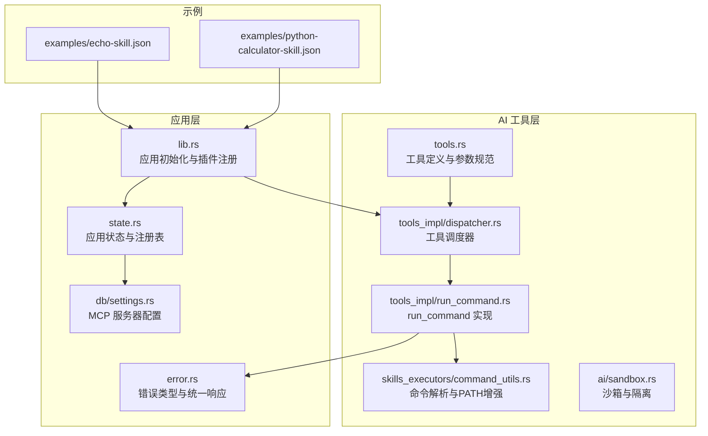
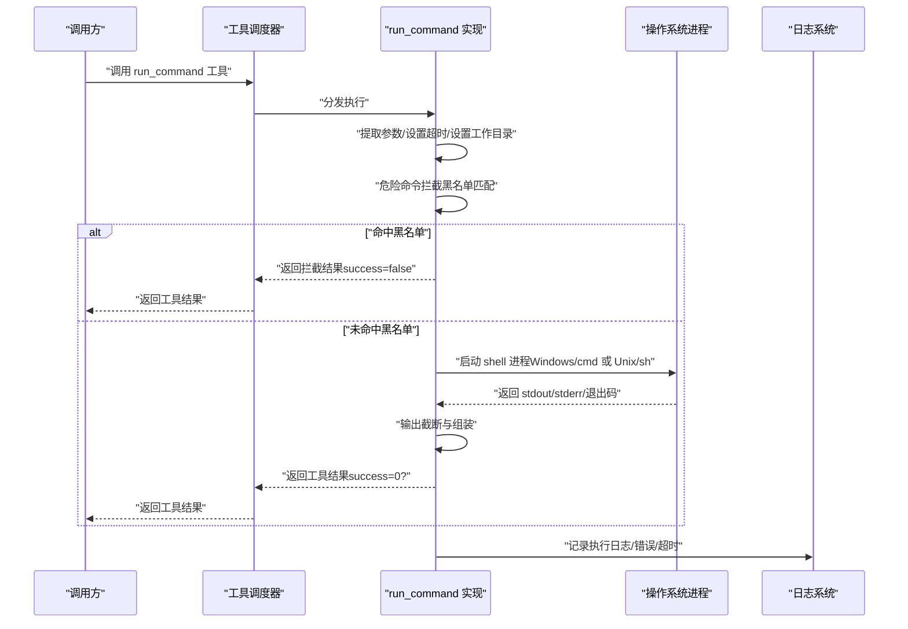
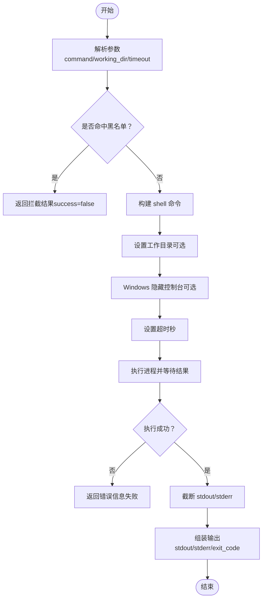
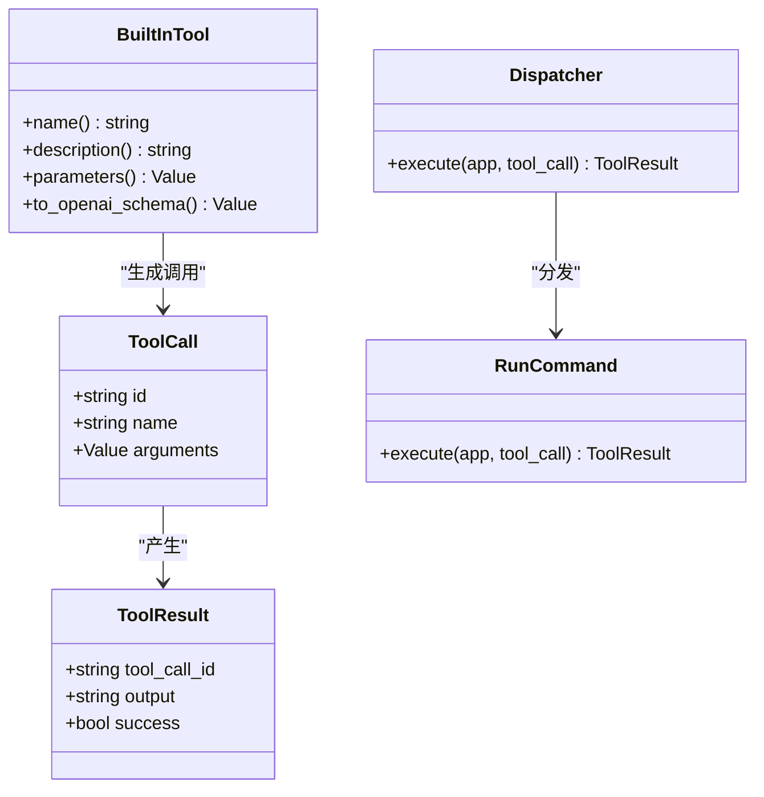
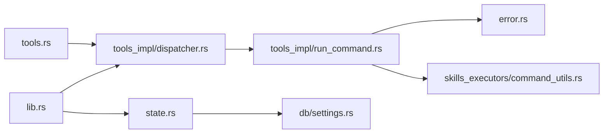

# 命令执行工具

<cite>
**本文引用的文件**
- [run_command.rs](file://src-tauri/src/ai/tools_impl/run_command.rs)
- [tools.rs](file://src-tauri/src/ai/tools.rs)
- [dispatcher.rs](file://src-tauri/src/ai/tools_impl/dispatcher.rs)
- [command_utils.rs](file://src-tauri/src/ai/skills_executors/command_utils.rs)
- [sandbox.rs](file://src-tauri/src/ai/sandbox.rs)
- [error.rs](file://src-tauri/src/error.rs)
- [lib.rs](file://src-tauri/src/lib.rs)
- [state.rs](file://src-tauri/src/state.rs)
- [settings.rs](file://src-tauri/src/db/settings.rs)
- [echo-skill.json](file://examples/echo-skill.json)
- [python-calculator-skill.json](file://examples/python-calculator-skill.json)
</cite>

## 目录
1. [简介](#简介)
2. [项目结构](#项目结构)
3. [核心组件](#核心组件)
4. [架构总览](#架构总览)
5. [组件详解](#组件详解)
6. [依赖关系分析](#依赖关系分析)
7. [性能与资源特性](#性能与资源特性)
8. [故障排查指南](#故障排查指南)
9. [结论](#结论)
10. [附录：使用示例与最佳实践](#附录使用示例与最佳实践)

## 简介
本文件面向 CoSurf 的“命令执行”能力，系统性梳理 run_command 工具的实现原理与安全机制，覆盖命令解析、进程启动、输出捕获、超时控制、安全拦截、日志与监控、错误处理与异常策略，并给出使用示例与最佳实践。同时补充了沙箱与隔离思路、白名单与路径增强等安全要点，帮助读者在保障系统安全的前提下高效使用命令执行能力。

## 项目结构
围绕命令执行相关的代码主要分布在以下模块：
- 工具定义与参数规范：tools.rs
- 工具调度器：tools_impl/dispatcher.rs
- run_command 实现：tools_impl/run_command.rs
- 命令解析与 PATH 增强：skills_executors/command_utils.rs
- 沙箱与隔离：ai/sandbox.rs
- 错误类型与统一错误响应：error.rs
- 应用初始化与插件注册：lib.rs
- 应用状态与注册表：state.rs
- MCP 服务器配置：db/settings.rs
- 示例技能：examples/*.json

**图表来源**
- [tools.rs:1-418](file://src-tauri/src/ai/tools.rs#L1-L418)
- [dispatcher.rs:1-238](file://src-tauri/src/ai/tools_impl/dispatcher.rs#L1-L238)
- [run_command.rs:1-161](file://src-tauri/src/ai/tools_impl/run_command.rs#L1-L161)
- [command_utils.rs:1-95](file://src-tauri/src/ai/skills_executors/command_utils.rs#L1-L95)
- [sandbox.rs:1-251](file://src-tauri/src/ai/sandbox.rs#L1-L251)
- [lib.rs:1-258](file://src-tauri/src/lib.rs#L1-L258)
- [state.rs:1-77](file://src-tauri/src/state.rs#L1-L77)
- [settings.rs:1-540](file://src-tauri/src/db/settings.rs#L1-L540)
- [error.rs:1-64](file://src-tauri/src/error.rs#L1-L64)
- [echo-skill.json:1-28](file://examples/echo-skill.json#L1-L28)
- [python-calculator-skill.json:1-27](file://examples/python-calculator-skill.json#L1-L27)

**章节来源**
- [lib.rs:1-258](file://src-tauri/src/lib.rs#L1-L258)
- [tools.rs:1-418](file://src-tauri/src/ai/tools.rs#L1-L418)
- [dispatcher.rs:1-238](file://src-tauri/src/ai/tools_impl/dispatcher.rs#L1-L238)
- [run_command.rs:1-161](file://src-tauri/src/ai/tools_impl/run_command.rs#L1-L161)
- [command_utils.rs:1-95](file://src-tauri/src/ai/skills_executors/command_utils.rs#L1-L95)
- [sandbox.rs:1-251](file://src-tauri/src/ai/sandbox.rs#L1-L251)
- [error.rs:1-64](file://src-tauri/src/error.rs#L1-L64)
- [state.rs:1-77](file://src-tauri/src/state.rs#L1-L77)
- [settings.rs:1-540](file://src-tauri/src/db/settings.rs#L1-L540)
- [echo-skill.json:1-28](file://examples/echo-skill.json#L1-L28)
- [python-calculator-skill.json:1-27](file://examples/python-calculator-skill.json#L1-L27)

## 核心组件
- 工具定义与参数规范：定义 run_command 的参数结构（命令、工作目录、超时）、描述与 OpenAI function schema，确保前端/模型侧正确构造调用。
- 工具调度器：根据工具名分发到具体实现；run_command 调用 tools_impl/run_command::execute。
- run_command 实现：负责参数提取、危险命令拦截、跨平台命令执行、超时控制、输出截断与组装、成功/失败判定。
- 命令解析与 PATH 增强：在 Windows 上识别内建命令与 .cmd 包装器，统一通过 cmd /c 执行；构建增强的 PATH，提升工具发现概率。
- 沙箱与隔离：提供受限的 CLI 执行能力（白名单命令）、工作目录隔离、资源清理；为更广泛的隔离提供参考设计。
- 错误处理：统一 AppError 与 ErrorResponse，保证错误信息可序列化并在 IPC 层稳定传递。
- 应用初始化与状态：注册插件、初始化数据库与应用状态，维护 MCP 工具注册表，支撑工具链生态。

**章节来源**
- [tools.rs:158-182](file://src-tauri/src/ai/tools.rs#L158-L182)
- [dispatcher.rs:14-55](file://src-tauri/src/ai/tools_impl/dispatcher.rs#L14-L55)
- [run_command.rs:35-150](file://src-tauri/src/ai/tools_impl/run_command.rs#L35-L150)
- [command_utils.rs:5-95](file://src-tauri/src/ai/skills_executors/command_utils.rs#L5-L95)
- [sandbox.rs:12-46](file://src-tauri/src/ai/sandbox.rs#L12-L46)
- [error.rs:4-64](file://src-tauri/src/error.rs#L4-L64)
- [lib.rs:41-217](file://src-tauri/src/lib.rs#L41-L217)
- [state.rs:9-77](file://src-tauri/src/state.rs#L9-L77)

## 架构总览
下图展示 run_command 从被调用到执行完成的关键交互流程，包括参数校验、安全拦截、进程执行、超时处理与结果组装。

**图表来源**
- [dispatcher.rs:34-54](file://src-tauri/src/ai/tools_impl/dispatcher.rs#L34-L54)
- [run_command.rs:35-150](file://src-tauri/src/ai/tools_impl/run_command.rs#L35-L150)

## 组件详解

### run_command 工具实现
- 参数解析与校验
  - 必填：command
  - 可选：working_dir、timeout（默认 30 秒，最大 120 秒）
- 危险命令拦截
  - 黑名单前缀匹配（不区分大小写），覆盖破坏性命令与典型风险模式
  - 命中后立即返回拦截结果，避免执行
- 跨平台执行
  - Windows：cmd /C
  - Unix 系列：sh -c
  - Windows 上隐藏控制台窗口，避免弹窗干扰
- 超时控制
  - 使用异步超时包装，超时后返回超时信息并终止进程
- 输出捕获与截断
  - 截断 stdout（最大 8000 字符）、stderr（最大 4000 字符）
  - 组装输出：分别标注 stdout/stderr/exit_code
- 成功判定
  - 以退出码 0 为成功标志

**图表来源**
- [run_command.rs:35-150](file://src-tauri/src/ai/tools_impl/run_command.rs#L35-L150)

**章节来源**
- [run_command.rs:16-20](file://src-tauri/src/ai/tools_impl/run_command.rs#L16-L20)
- [run_command.rs:22-32](file://src-tauri/src/ai/tools_impl/run_command.rs#L22-L32)
- [run_command.rs:35-150](file://src-tauri/src/ai/tools_impl/run_command.rs#L35-L150)
- [tools.rs:158-182](file://src-tauri/src/ai/tools.rs#L158-L182)

### 工具调度与参数规范
- 工具注册与分发
  - dispatcher 根据工具名分发到对应实现；run_command 映射到 tools_impl/run_command::execute
- 参数 schema
  - OpenAI function calling 格式，包含 command、working_dir、timeout 的约束与默认值
- 与外部生态集成
  - 支持通过 MCP 服务器注册的工具；支持 Skills 系统的延迟加载

**图表来源**
- [tools.rs:4-17](file://src-tauri/src/ai/tools.rs#L4-L17)
- [tools.rs:19-61](file://src-tauri/src/ai/tools.rs#L19-L61)
- [dispatcher.rs:14-55](file://src-tauri/src/ai/tools_impl/dispatcher.rs#L14-L55)
- [run_command.rs:35-150](file://src-tauri/src/ai/tools_impl/run_command.rs#L35-L150)

**章节来源**
- [tools.rs:197-225](file://src-tauri/src/ai/tools.rs#L197-L225)
- [dispatcher.rs:14-55](file://src-tauri/src/ai/tools_impl/dispatcher.rs#L14-L55)

### 命令解析与 PATH 增强
- Windows 特殊处理
  - 识别内建命令与 .cmd 包装器，统一通过 cmd /c 执行
- PATH 增强
  - 聚合系统 PATH 与常见运行时安装目录（Node.js、Python、Volta、fnm、nvm 等）
  - 跨平台拼接分隔符（Windows 分号、Unix 冒号）

**章节来源**
- [command_utils.rs:5-95](file://src-tauri/src/ai/skills_executors/command_utils.rs#L5-L95)

### 沙箱与隔离（参考设计）
- 配置项
  - 根目录、是否允许 CLI、允许的命令白名单
- 功能
  - 保存/加载网页内容、摘要、记忆；清理过期内容
  - 受限 CLI 执行：白名单检查、工作目录隔离、失败即报错
- 设计意义
  - 为更广泛的命令执行提供隔离与资源管理参考

**章节来源**
- [sandbox.rs:12-46](file://src-tauri/src/ai/sandbox.rs#L12-L46)
- [sandbox.rs:215-244](file://src-tauri/src/ai/sandbox.rs#L215-L244)

### 错误处理与统一响应
- 错误类型
  - 数据库、HTTP、JSON、Tauri、AI Provider、配置、未找到、内部错误
- 统一序列化
  - AppError 实现序列化，便于 IPC 传输
- 错误映射
  - AppError -> ErrorResponse（code/message）

**章节来源**
- [error.rs:4-64](file://src-tauri/src/error.rs#L4-L64)

### 应用初始化与状态
- 插件注册：shell、dialog、fs、global_shortcut、http、notification、updater、window_state
- 初始化数据库与应用状态，注册全局快捷键
- 状态管理：cancel_flag、active_tab_id、page_content_responses、skills_manager、mcp_tool_registry

**章节来源**
- [lib.rs:41-107](file://src-tauri/src/lib.rs#L41-L107)
- [state.rs:9-77](file://src-tauri/src/state.rs#L9-L77)

## 依赖关系分析
- run_command 依赖
  - 工具定义与参数规范（tools.rs）
  - 日志系统（tracing）
  - 异步进程执行（tokio::process::Command）
  - 超时控制（tokio::time::timeout）
  - 错误类型（error.rs）
- 调度与状态
  - dispatcher 依赖 state.rs 中的注册表与配置
  - lib.rs 负责插件与应用生命周期

**图表来源**
- [tools.rs:1-418](file://src-tauri/src/ai/tools.rs#L1-L418)
- [dispatcher.rs:1-238](file://src-tauri/src/ai/tools_impl/dispatcher.rs#L1-L238)
- [run_command.rs:1-161](file://src-tauri/src/ai/tools_impl/run_command.rs#L1-L161)
- [error.rs:1-64](file://src-tauri/src/error.rs#L1-L64)
- [command_utils.rs:1-95](file://src-tauri/src/ai/skills_executors/command_utils.rs#L1-L95)
- [lib.rs:1-258](file://src-tauri/src/lib.rs#L1-L258)
- [state.rs:1-77](file://src-tauri/src/state.rs#L1-L77)
- [settings.rs:1-540](file://src-tauri/src/db/settings.rs#L1-L540)

**章节来源**
- [lib.rs:41-217](file://src-tauri/src/lib.rs#L41-L217)
- [dispatcher.rs:14-55](file://src-tauri/src/ai/tools_impl/dispatcher.rs#L14-L55)
- [run_command.rs:35-150](file://src-tauri/src/ai/tools_impl/run_command.rs#L35-L150)

## 性能与资源特性
- 超时控制：默认 30 秒，最大 120 秒，避免长时间阻塞
- 输出截断：stdout 8000 字符、stderr 4000 字符，降低内存与传输压力
- 进程启动：按平台选择 shell，Windows 隐藏控制台窗口，减少 UI 干扰
- 资源清理：沙箱模块提供定期清理逻辑，避免磁盘膨胀

**章节来源**
- [run_command.rs:16-20](file://src-tauri/src/ai/tools_impl/run_command.rs#L16-L20)
- [run_command.rs:152-160](file://src-tauri/src/ai/tools_impl/run_command.rs#L152-L160)
- [sandbox.rs:94-119](file://src-tauri/src/ai/sandbox.rs#L94-L119)

## 故障排查指南
- 常见问题与处理
  - 命令执行失败：检查命令语法、工作目录权限、PATH 设置
  - 超时：适当提高 timeout，或优化命令本身；确认是否存在死循环或网络阻塞
  - 权限不足：在沙箱或受限环境中执行；必要时调整系统权限
  - 输出缺失：确认 stdout/stderr 是否被重定向；检查截断阈值
- 日志定位
  - 关注执行开始、退出码、stdout/stderr 长度、超时与拦截日志
- 错误类型
  - 使用 AppError/ErrorResponse 诊断数据库、HTTP、JSON、Tauri、内部错误

**章节来源**
- [run_command.rs:101-149](file://src-tauri/src/ai/tools_impl/run_command.rs#L101-L149)
- [error.rs:4-64](file://src-tauri/src/error.rs#L4-L64)

## 结论
run_command 工具在保障安全的前提下提供了跨平台命令执行能力：通过参数规范、危险命令拦截、超时控制与输出截断，有效降低了风险与资源消耗；结合调度器与状态管理，能够融入更广泛的 AI 工具链生态。建议在生产使用中配合沙箱与白名单策略，严格控制命令范围与执行环境，持续监控日志与错误，确保系统稳定与安全。

## 附录：使用示例与最佳实践

### 使用示例
- 基本命令执行
  - 参数：command（必填）、working_dir（可选）、timeout（可选，默认 30 秒）
  - 返回：包含 stdout、stderr、exit_code 的组合输出，success 标识是否为 0
- 示例技能参考
  - echo 技能：演示 CLI 技能的基本结构与参数模板
  - Python 计算器：演示脚本型技能的安全执行模式（仅允许基础运算）

**章节来源**
- [tools.rs:158-182](file://src-tauri/src/ai/tools.rs#L158-L182)
- [echo-skill.json:1-28](file://examples/echo-skill.json#L1-L28)
- [python-calculator-skill.json:1-27](file://examples/python-calculator-skill.json#L1-L27)

### 最佳实践
- 安全
  - 优先使用沙箱与白名单；避免执行高危命令
  - 严格控制 working_dir，限定在受信目录
- 性能
  - 合理设置 timeout，避免长时间阻塞
  - 控制命令复杂度，避免大量输出
- 可靠性
  - 监控日志与错误，建立告警机制
  - 对外暴露的工具接口应具备完善的参数校验与默认值
- 可维护性
  - 将复杂命令封装为脚本或工具，减少直接注入风险
  - 使用 Skills/MCP 生态扩展能力，保持核心安全边界清晰