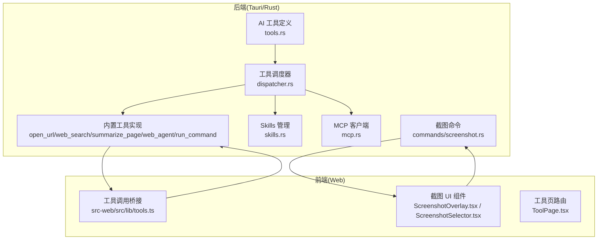
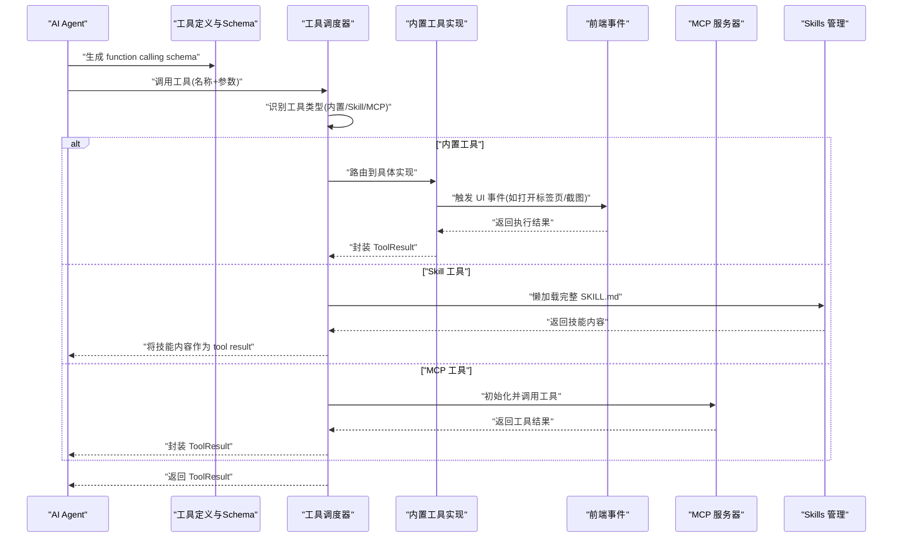
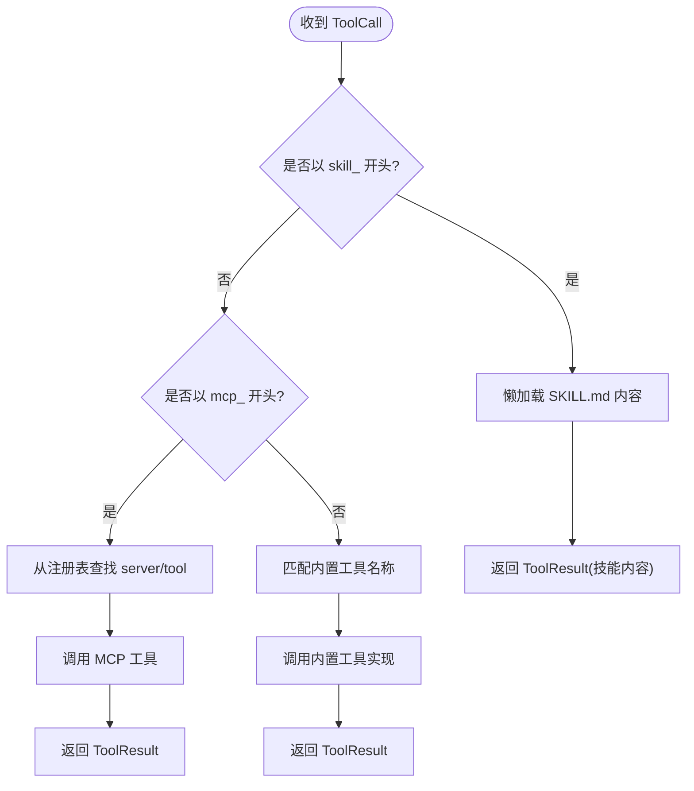
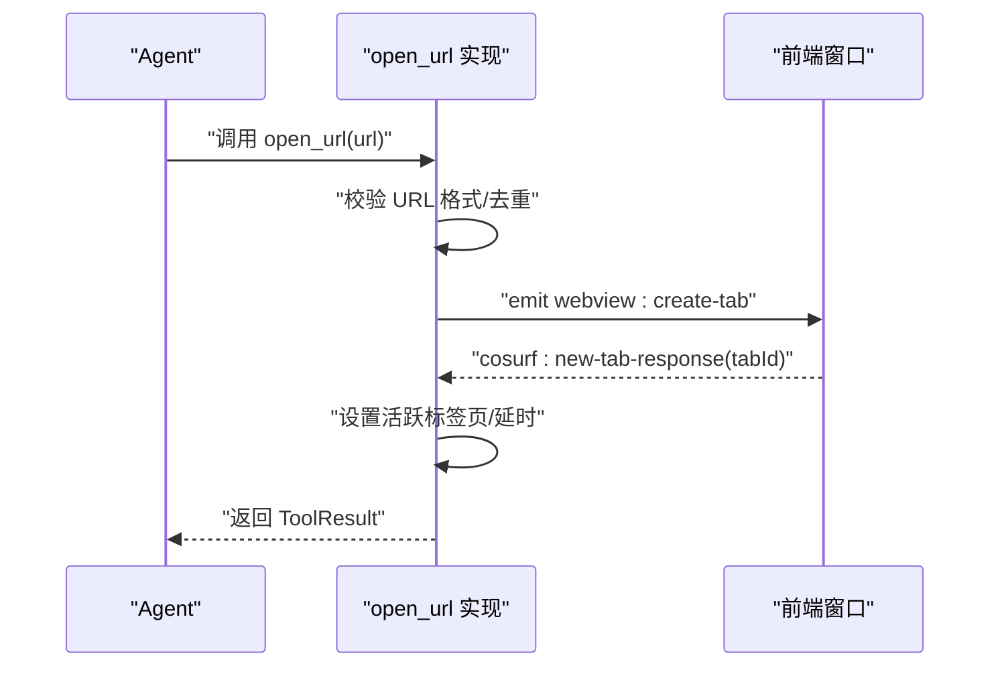
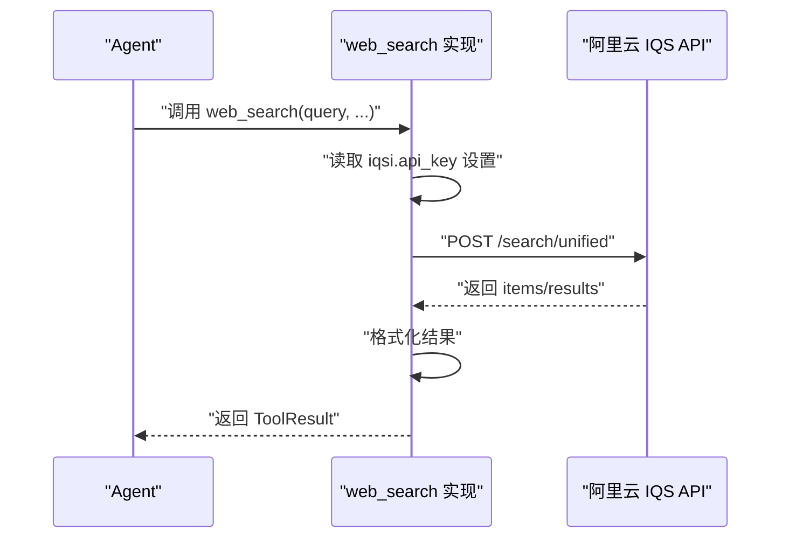
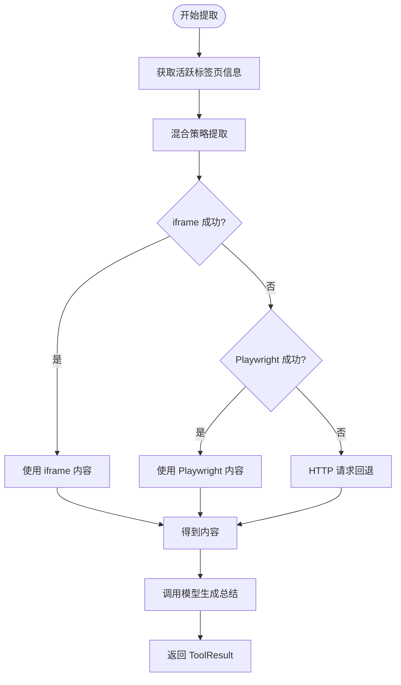
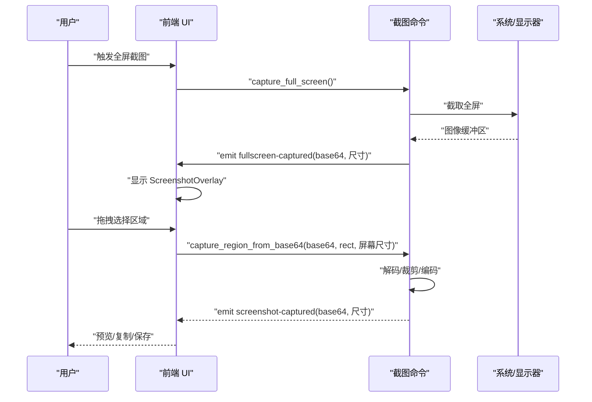
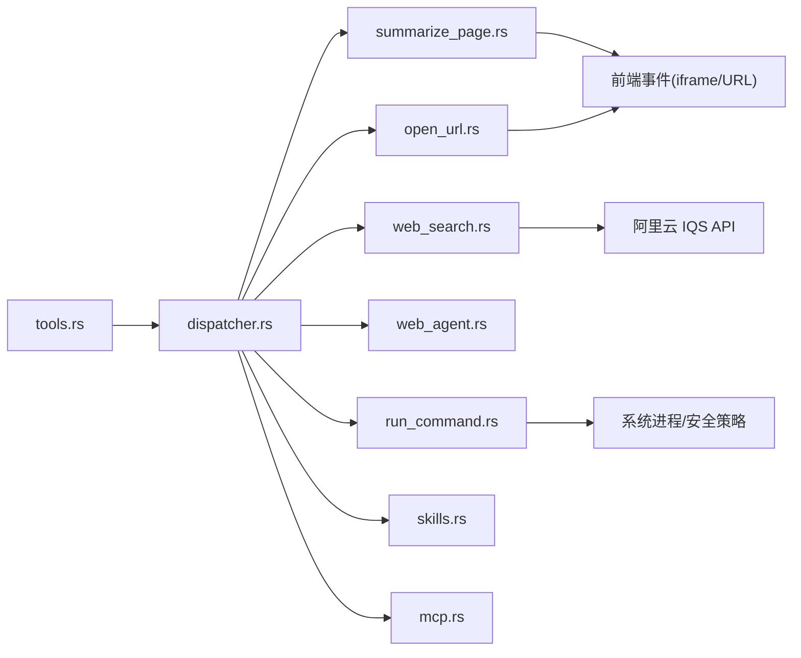

# 工具和实用程序

<cite>
**本文引用的文件**
- [src-tauri/src/ai/tools.rs](file://src-tauri/src/ai/tools.rs)
- [src-tauri/src/ai/tools_impl/mod.rs](file://src-tauri/src/ai/tools_impl/mod.rs)
- [src-tauri/src/ai/tools_impl/dispatcher.rs](file://src-tauri/src/ai/tools_impl/dispatcher.rs)
- [src-tauri/src/ai/tools_impl/open_url.rs](file://src-tauri/src/ai/tools_impl/open_url.rs)
- [src-tauri/src/ai/tools_impl/web_search.rs](file://src-tauri/src/ai/tools_impl/web_search.rs)
- [src-tauri/src/ai/tools_impl/summarize_page.rs](file://src-tauri/src/ai/tools_impl/summarize_page.rs)
- [src-tauri/src/ai/tools_impl/web_agent.rs](file://src-tauri/src/ai/tools_impl/web_agent.rs)
- [src-tauri/src/ai/tools_impl/run_command.rs](file://src-tauri/src/ai/tools_impl/run_command.rs)
- [src-tauri/src/ai/skills.rs](file://src-tauri/src/ai/skills.rs)
- [src-tauri/src/ai/skills_executors/mcp.rs](file://src-tauri/src/ai/skills_executors/mcp.rs)
- [src-tauri/src/commands/screenshot.rs](file://src-tauri/src/commands/screenshot.rs)
- [src-web/src/lib/tools.ts](file://src-web/src/lib/tools.ts)
- [src-web/src/components/ui/ScreenshotOverlay.tsx](file://src-web/src/components/ui/ScreenshotOverlay.tsx)
- [src-web/src/components/ui/ScreenshotSelector.tsx](file://src-web/src/components/ui/ScreenshotSelector.tsx)
- [src-web/src/components/tools/ToolPage.tsx](file://src-web/src/components/tools/ToolPage.tsx)
</cite>

## 目录
1. [简介](#简介)
2. [项目结构](#项目结构)
3. [核心组件](#核心组件)
4. [架构总览](#架构总览)
5. [详细组件分析](#详细组件分析)
6. [依赖关系分析](#依赖关系分析)
7. [性能考量](#性能考量)
8. [故障排查指南](#故障排查指南)
9. [结论](#结论)
10. [附录](#附录)

## 简介
本文件面向 CoSurf 工具与实用程序系统，系统性梳理内置工具的设计与实现，包括 open_url（打开网页标签页）、summarize_page（页面内容总结）、web_search（联网搜索）、run_command（系统命令执行）、web_agent（网页元素操作）等；同时阐述工具调度器的实现机制（工具路由、MCP 工具集成、Skills 工具调用）、页面总结工具的技术细节（内容提取、摘要算法、文本处理）、网页搜索工具的实现（阿里云 IQS API 集成、参数配置、结果处理）、命令执行工具的安全机制与权限控制，以及截图工具的实现细节（全屏截图与区域截图）。最后提供工具开发指南、错误处理与重试机制说明。

## 项目结构
CoSurf 采用前后端分离与多语言协作的架构：
- Rust 后端（Tauri）负责 AI 工具调度、MCP 通信、Skills 管理、命令执行、截图等核心能力
- Web 前端（React/Vite）负责 UI、事件通信、截图交互与工具调用桥接
- Playwright 服务用于无头浏览器内容提取与自动化

图表来源
- [src-tauri/src/ai/tools.rs:1-418](file://src-tauri/src/ai/tools.rs#L1-L418)
- [src-tauri/src/ai/tools_impl/dispatcher.rs:1-238](file://src-tauri/src/ai/tools_impl/dispatcher.rs#L1-L238)
- [src-tauri/src/ai/tools_impl/mod.rs:1-14](file://src-tauri/src/ai/tools_impl/mod.rs#L1-L14)
- [src-tauri/src/ai/skills.rs:1-567](file://src-tauri/src/ai/skills.rs#L1-L567)
- [src-tauri/src/ai/skills_executors/mcp.rs:1-555](file://src-tauri/src/ai/skills_executors/mcp.rs#L1-L555)
- [src-tauri/src/commands/screenshot.rs:1-165](file://src-tauri/src/commands/screenshot.rs#L1-L165)
- [src-web/src/lib/tools.ts:1-125](file://src-web/src/lib/tools.ts#L1-L125)
- [src-web/src/components/ui/ScreenshotOverlay.tsx:1-153](file://src-web/src/components/ui/ScreenshotOverlay.tsx#L1-L153)
- [src-web/src/components/ui/ScreenshotSelector.tsx:1-160](file://src-web/src/components/ui/ScreenshotSelector.tsx#L1-L160)

章节来源
- [src-tauri/src/ai/tools.rs:1-418](file://src-tauri/src/ai/tools.rs#L1-L418)
- [src-tauri/src/ai/tools_impl/mod.rs:1-14](file://src-tauri/src/ai/tools_impl/mod.rs#L1-L14)
- [src-web/src/lib/tools.ts:1-125](file://src-web/src/lib/tools.ts#L1-L125)

## 核心组件
- 工具定义与 Schema：统一描述工具名称、描述、参数与 OpenAI function calling 格式，支持内置工具与外部扩展（Skills、MCP）
- 工具调度器：根据工具名路由到对应实现，支持技能懒加载与 MCP 直连调用
- 内置工具：open_url、web_search、summarize_page、web_agent、run_command
- MCP 客户端：遵循 Model Context Protocol，支持 Streamable HTTP 与 SSE 传输
- Skills 管理：渐进式加载，仅在模型选择时懒加载完整内容
- 截图命令：全屏截图、区域截图、复制到剪贴板、保存到文件

章节来源
- [src-tauri/src/ai/tools.rs:19-225](file://src-tauri/src/ai/tools.rs#L19-L225)
- [src-tauri/src/ai/tools_impl/dispatcher.rs:11-55](file://src-tauri/src/ai/tools_impl/dispatcher.rs#L11-L55)
- [src-tauri/src/ai/skills.rs:84-286](file://src-tauri/src/ai/skills.rs#L84-L286)
- [src-tauri/src/ai/skills_executors/mcp.rs:92-101](file://src-tauri/src/ai/skills_executors/mcp.rs#L92-L101)
- [src-tauri/src/commands/screenshot.rs:13-165](file://src-tauri/src/commands/screenshot.rs#L13-L165)

## 架构总览
工具链路从 AI 模型到具体执行的端到端流程如下：

图表来源
- [src-tauri/src/ai/tools.rs:197-225](file://src-tauri/src/ai/tools.rs#L197-L225)
- [src-tauri/src/ai/tools_impl/dispatcher.rs:11-55](file://src-tauri/src/ai/tools_impl/dispatcher.rs#L11-L55)
- [src-tauri/src/ai/skills.rs:252-263](file://src-tauri/src/ai/skills.rs#L252-L263)
- [src-tauri/src/ai/skills_executors/mcp.rs:167-198](file://src-tauri/src/ai/skills_executors/mcp.rs#L167-L198)

## 详细组件分析

### 工具调度器与路由机制
- 工具识别优先级：以“skill_”前缀识别 Skills、以“mcp_”前缀识别 MCP、其余走内置工具枚举
- 内置工具路由：open_url、web_search、summarize_page、web_agent、run_command
- MCP 工具发现：从数据库列出启用的 MCP 服务器，按传输类型（Streamable HTTP/SSE）拉取 tools/list，注册为独立 function，名称格式为“mcp_{server}_{tool}”
- Skills 工具：仅暴露简短 description，模型调用 skill_{id} 后，调度器懒加载完整 SKILL.md 作为 tool result 返回

图表来源
- [src-tauri/src/ai/tools_impl/dispatcher.rs:22-54](file://src-tauri/src/ai/tools_impl/dispatcher.rs#L22-L54)
- [src-tauri/src/ai/tools.rs:274-396](file://src-tauri/src/ai/tools.rs#L274-L396)

章节来源
- [src-tauri/src/ai/tools_impl/dispatcher.rs:11-204](file://src-tauri/src/ai/tools_impl/dispatcher.rs#L11-L204)
- [src-tauri/src/ai/tools.rs:227-396](file://src-tauri/src/ai/tools.rs#L227-L396)

### open_url 工具（打开网页标签页）
- 参数校验：要求以 http:// 或 https:// 开头
- 去重保护：5 秒内相同 URL 不重复打开
- 事件驱动：向前端发出创建标签页事件，等待响应并设置为活跃标签页
- 超时与错误：等待新标签 ID 超时 15 秒，主窗口不存在时返回错误

图表来源
- [src-tauri/src/ai/tools_impl/open_url.rs:16-100](file://src-tauri/src/ai/tools_impl/open_url.rs#L16-L100)

章节来源
- [src-tauri/src/ai/tools_impl/open_url.rs:16-146](file://src-tauri/src/ai/tools_impl/open_url.rs#L16-L146)

### web_search 工具（联网搜索，阿里云 IQS）
- 参数：query、engine_type、time_range、max_results
- API 集成：调用阿里云 IQS 统一搜索接口，Authorization 使用 Bearer Token
- 结果处理：解析 items/results 字段，格式化输出；未配置 API Key 时返回引导信息
- 错误处理：HTTP 状态非成功时返回错误文本；响应格式异常时提示

图表来源
- [src-tauri/src/ai/tools_impl/web_search.rs:14-179](file://src-tauri/src/ai/tools_impl/web_search.rs#L14-L179)

章节来源
- [src-tauri/src/ai/tools_impl/web_search.rs:14-179](file://src-tauri/src/ai/tools_impl/web_search.rs#L14-L179)

### summarize_page 工具（页面内容总结）
- 多策略提取：iframe -> Playwright -> HTTP fallback
- 前端交互：通过事件请求页面内容，等待 cosurf:page-content-response；若跨域则返回空内容
- AI 总结：构建系统提示词与用户消息，调用模型非流式接口获取总结
- 错误提示：当所有提取方式失败时，给出安全防护与替代方案建议

图表来源
- [src-tauri/src/ai/tools_impl/summarize_page.rs:16-55](file://src-tauri/src/ai/tools_impl/summarize_page.rs#L16-L55)
- [src-tauri/src/ai/tools_impl/summarize_page.rs:140-202](file://src-tauri/src/ai/tools_impl/summarize_page.rs#L140-L202)
- [src-tauri/src/ai/tools_impl/summarize_page.rs:358-427](file://src-tauri/src/ai/tools_impl/summarize_page.rs#L358-L427)

章节来源
- [src-tauri/src/ai/tools_impl/summarize_page.rs:16-428](file://src-tauri/src/ai/tools_impl/summarize_page.rs#L16-L428)

### web_agent 工具（网页元素操作）
- 参数：action（click/fill/select/scroll/wait）、selector、value（fill 时使用）
- 执行：获取当前活跃标签页 ID，调用 page_context::execute_web_action 命令
- 错误：无活跃标签页时返回错误

章节来源
- [src-tauri/src/ai/tools_impl/web_agent.rs:12-79](file://src-tauri/src/ai/tools_impl/web_agent.rs#L12-L79)

### run_command 工具（系统命令执行）
- 参数：command、working_dir、timeout
- 安全机制：黑名单拦截危险命令（如 rm -rf /、格式化磁盘等）、输出截断（stdout 8000 字符、stderr 半长）、超时保护（默认 30 秒，最大 120 秒）
- 平台差异：Windows 隐藏控制台窗口；非 Windows 使用 sh -c
- 结果：组合 stdout/stderr/exit_code，success 依据退出码

章节来源
- [src-tauri/src/ai/tools_impl/run_command.rs:34-161](file://src-tauri/src/ai/tools_impl/run_command.rs#L34-L161)

### MCP 工具集成
- 传输模式：Streamable HTTP（直接 POST JSON-RPC）、SSE（先 GET 获取 endpoint 再 POST）
- 工具发现：从数据库列出启用的 MCP 服务器，超时 15 秒，注册为“mcp_{server}_{tool}”
- 调用流程：初始化连接、tools/list、tools/call，解析 JSON-RPC 响应，支持 SSE 流式解析
- 错误处理：连接失败、超时、工具错误均返回友好提示

章节来源
- [src-tauri/src/ai/tools.rs:274-396](file://src-tauri/src/ai/tools.rs#L274-L396)
- [src-tauri/src/ai/skills_executors/mcp.rs:167-246](file://src-tauri/src/ai/skills_executors/mcp.rs#L167-L246)

### Skills 工具调用
- 渐进式加载：初始仅解析 SKILL.md frontmatter，模型调用 skill_{id} 后才懒加载完整内容
- 注册：在 Agent Loop 中以“skill_{id}”形式暴露，description 仅用于模型决策
- 管理：支持导入/导出、启用/禁用、目录结构管理

章节来源
- [src-tauri/src/ai/tools.rs:227-272](file://src-tauri/src/ai/tools.rs#L227-L272)
- [src-tauri/src/ai/skills.rs:84-286](file://src-tauri/src/ai/skills.rs#L84-L286)

### 截图工具实现
- 全屏截图：调用原生库截取屏幕，编码为 PNG 并以 base64 形式通过事件发送到前端
- 区域截图：前端展示全屏截图，用户拖拽选择区域，后端按物理像素裁剪并返回
- 剪贴板与保存：支持复制到剪贴板与保存到文件
- 前端交互：Overlay 展示预览与操作栏，Selector 提供拖拽选择与尺寸提示

图表来源
- [src-tauri/src/commands/screenshot.rs:13-119](file://src-tauri/src/commands/screenshot.rs#L13-L119)
- [src-web/src/components/ui/ScreenshotOverlay.tsx:9-153](file://src-web/src/components/ui/ScreenshotOverlay.tsx#L9-L153)
- [src-web/src/components/ui/ScreenshotSelector.tsx:12-160](file://src-web/src/components/ui/ScreenshotSelector.tsx#L12-L160)

章节来源
- [src-tauri/src/commands/screenshot.rs:13-165](file://src-tauri/src/commands/screenshot.rs#L13-L165)
- [src-web/src/components/ui/ScreenshotOverlay.tsx:9-153](file://src-web/src/components/ui/ScreenshotOverlay.tsx#L9-L153)
- [src-web/src/components/ui/ScreenshotSelector.tsx:12-160](file://src-web/src/components/ui/ScreenshotSelector.tsx#L12-L160)

## 依赖关系分析
- 工具定义与调度：tools.rs 定义工具枚举与 Schema，dispatcher.rs 路由到具体实现
- 外部集成：web_search 依赖阿里云 IQS API；run_command 依赖系统进程；MCP 依赖网络与 JSON-RPC
- 前后端通信：工具实现通过事件与前端交互（如 open_url、summarize_page），截图通过命令与 UI 组件配合
- 并发与锁：Skills 管理器与 MCP 注册表使用互斥锁保护共享状态

图表来源
- [src-tauri/src/ai/tools.rs:19-225](file://src-tauri/src/ai/tools.rs#L19-L225)
- [src-tauri/src/ai/tools_impl/dispatcher.rs:11-55](file://src-tauri/src/ai/tools_impl/dispatcher.rs#L11-L55)
- [src-tauri/src/ai/tools_impl/summarize_page.rs:16-55](file://src-tauri/src/ai/tools_impl/summarize_page.rs#L16-L55)
- [src-tauri/src/ai/tools_impl/open_url.rs:16-100](file://src-tauri/src/ai/tools_impl/open_url.rs#L16-L100)
- [src-tauri/src/ai/tools_impl/web_search.rs:14-179](file://src-tauri/src/ai/tools_impl/web_search.rs#L14-L179)
- [src-tauri/src/ai/tools_impl/run_command.rs:34-161](file://src-tauri/src/ai/tools_impl/run_command.rs#L34-L161)
- [src-tauri/src/ai/skills.rs:84-286](file://src-tauri/src/ai/skills.rs#L84-L286)
- [src-tauri/src/ai/skills_executors/mcp.rs:167-246](file://src-tauri/src/ai/skills_executors/mcp.rs#L167-L246)

章节来源
- [src-tauri/src/ai/tools.rs:19-225](file://src-tauri/src/ai/tools.rs#L19-L225)
- [src-tauri/src/ai/tools_impl/dispatcher.rs:11-55](file://src-tauri/src/ai/tools_impl/dispatcher.rs#L11-L55)

## 性能考量
- 工具发现与注册：MCP 工具发现带 15 秒超时，避免阻塞 Agent Loop
- 内容提取：summarize_page 采用混合策略，优先 iframe，失败再降级到 Playwright 与 HTTP，减少无效请求
- 输出截断：run_command 对 stdout/stderr 截断，防止超长文本影响后续处理
- 事件等待：open_url、summarize_page 等等待前端响应设置合理超时，避免长时间阻塞
- 并发与锁：Skills 与 MCP 注册表使用锁保护，避免竞态条件

## 故障排查指南
- open_url
  - 现象：URL 格式错误或重复请求
  - 排查：确认 URL 以 http:// 或 https:// 开头；检查 5 秒去重逻辑
  - 关键日志：URL 校验、重复请求提示、等待新标签 ID 超时
- web_search
  - 现象：返回未配置 API Key 或 IQS 请求失败
  - 排查：检查设置项 iqsi.api_key；确认网络与鉴权头
  - 关键日志：请求状态、错误文本、响应格式异常
- summarize_page
  - 现象：提取内容为空或跨域限制
  - 排查：确认前端 iframe 可用；尝试 Playwright 或 HTTP 回退；检查 about:blank 与内部 URL
  - 关键日志：各提取阶段失败、跨域提示
- web_agent
  - 现象：无活跃标签页或选择器无效
  - 排查：确认当前标签页存在；检查 CSS 选择器
- run_command
  - 现象：命令被拦截、超时或执行失败
  - 排查：检查黑名单匹配、工作目录、超时设置；查看 stdout/stderr
- 截图
  - 现象：全屏截图失败、区域选择无效、复制/保存失败
  - 排查：确认显示器枚举、图像解码/编码、剪贴板权限

章节来源
- [src-tauri/src/ai/tools_impl/open_url.rs:22-100](file://src-tauri/src/ai/tools_impl/open_url.rs#L22-L100)
- [src-tauri/src/ai/tools_impl/web_search.rs:56-106](file://src-tauri/src/ai/tools_impl/web_search.rs#L56-L106)
- [src-tauri/src/ai/tools_impl/summarize_page.rs:36-54](file://src-tauri/src/ai/tools_impl/summarize_page.rs#L36-L54)
- [src-tauri/src/ai/tools_impl/web_agent.rs:51-79](file://src-tauri/src/ai/tools_impl/web_agent.rs#L51-L79)
- [src-tauri/src/ai/tools_impl/run_command.rs:56-161](file://src-tauri/src/ai/tools_impl/run_command.rs#L56-L161)
- [src-tauri/src/commands/screenshot.rs:13-165](file://src-tauri/src/commands/screenshot.rs#L13-L165)

## 结论
CoSurf 工具与实用程序系统通过清晰的工具定义、灵活的调度器与多层内容提取策略，实现了从网页浏览、内容总结、联网搜索到命令执行与截图的完整能力闭环。MCP 与 Skills 的集成进一步扩展了工具生态，既保证了安全性（命令黑名单、超时与输出截断、跨域限制提示），又提供了良好的可扩展性与用户体验。

## 附录

### 工具开发指南（扩展新工具）
- 新增内置工具
  - 在 tools.rs 中添加枚举项与参数 Schema
  - 在 tools_impl/mod.rs 中新增实现模块并在 dispatcher.rs 中注册路由
  - 若涉及前端交互，通过事件与前端通信（参考 open_url/summarize_page）
- 新增 MCP 工具
  - 在设置中启用 MCP 服务器，Agent Loop 会自动发现并注册
  - 工具命名规则：mcp_{server}_{tool}，通过注册表路由
- 新增 Skills 工具
  - 在 skills 目录下创建 SKILL.md（含 frontmatter），Agent Loop 会暴露 skill_{id}
  - 模型调用后懒加载完整内容作为 tool result
- 新增截图功能
  - 使用现有命令与 UI 组件，或复用 ScreenshotOverlay/ScreenshotSelector 的交互模式

章节来源
- [src-tauri/src/ai/tools.rs:19-225](file://src-tauri/src/ai/tools.rs#L19-L225)
- [src-tauri/src/ai/tools_impl/dispatcher.rs:33-54](file://src-tauri/src/ai/tools_impl/dispatcher.rs#L33-L54)
- [src-tauri/src/ai/skills.rs:84-286](file://src-tauri/src/ai/skills.rs#L84-L286)
- [src-tauri/src/ai/skills_executors/mcp.rs:386-395](file://src-tauri/src/ai/skills_executors/mcp.rs#L386-L395)