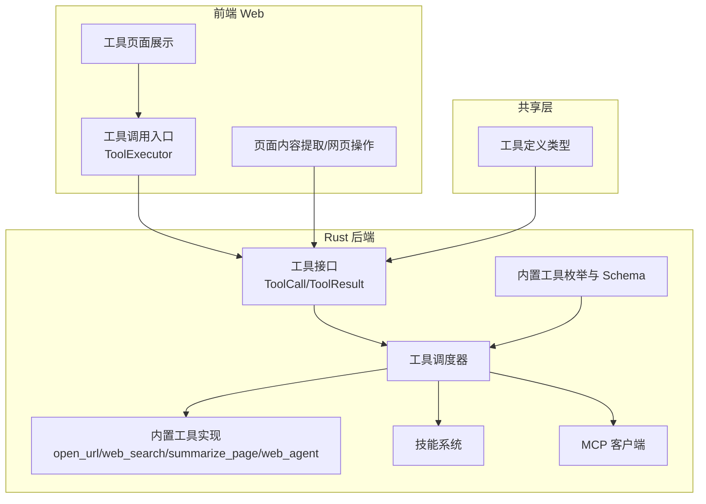
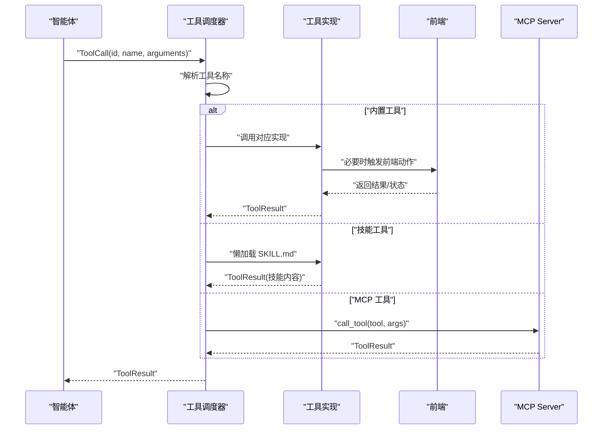
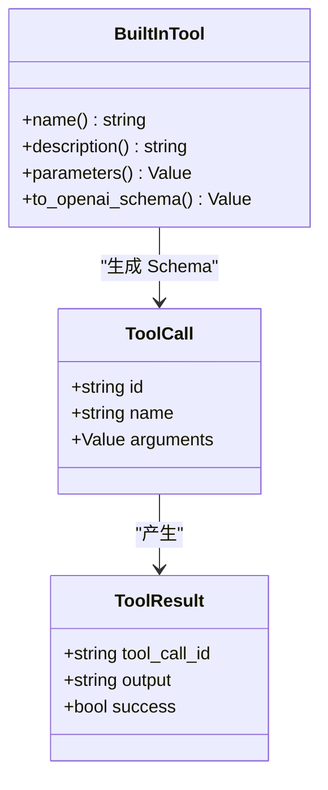
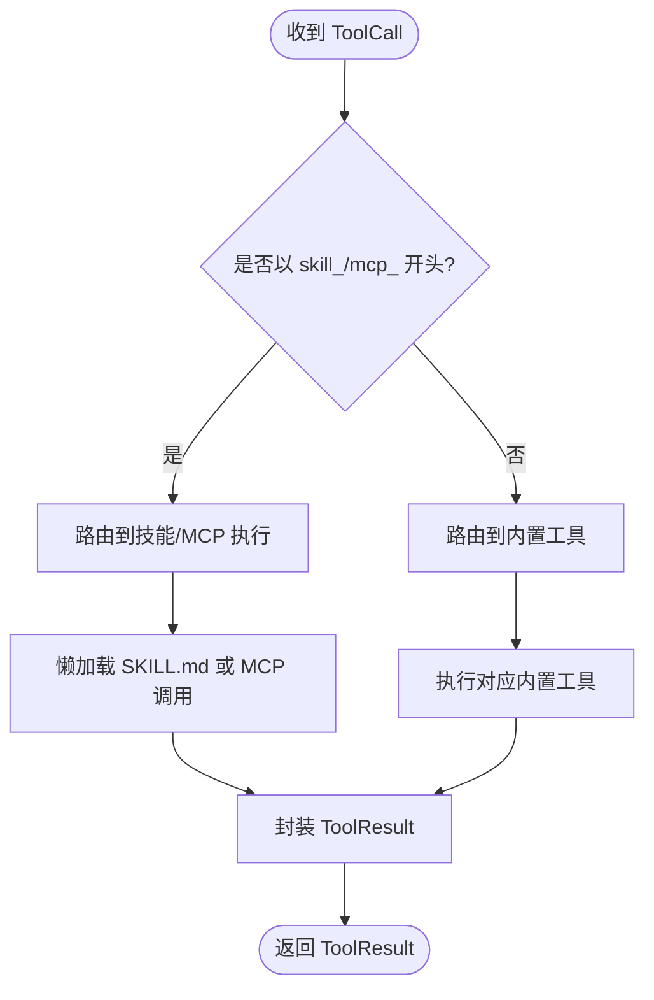
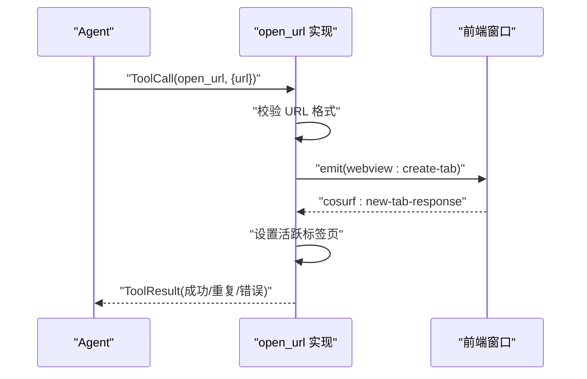
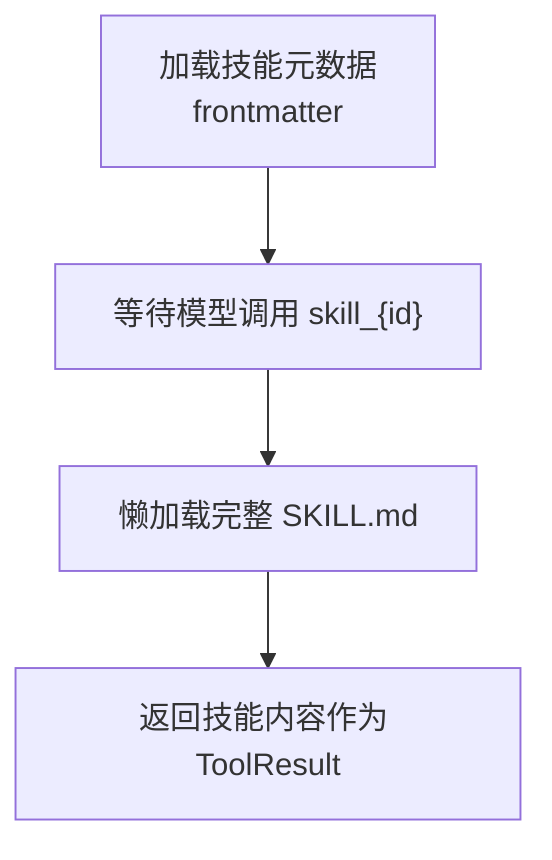
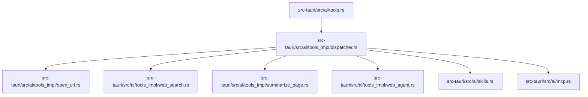

# 工具开发指南

<cite>
**本文档引用的文件**
- [native\src\ai\tools.rs](file://native\src\ai\tools.rs)
- [src-tauri\src\ai\tools.rs](file://src-tauri\src\ai\tools.rs)
- [src-tauri\src\ai\tools_impl\mod.rs](file://src-tauri\src\ai\tools_impl\mod.rs)
- [src-tauri\src\ai\tools_impl\dispatcher.rs](file://src-tauri\src\ai\tools_impl\dispatcher.rs)
- [src-tauri\src\ai\tools_impl\open_url.rs](file://src-tauri\src\ai\tools_impl\open_url.rs)
- [src-tauri\src\ai\tools_impl\web_search.rs](file://src-tauri\src\ai\tools_impl\web_search.rs)
- [src-tauri\src\ai\tools_impl\summarize_page.rs](file://src-tauri\src\ai\tools_impl\summarize_page.rs)
- [src-tauri\src\ai\tools_impl\web_agent.rs](file://src-tauri\src\ai\tools_impl\web_agent.rs)
- [src-tauri\src\ai\skills.rs](file://src-tauri\src\ai\skills.rs)
- [src-tauri\src\ai\mcp.rs](file://src-tauri\src\ai\mcp.rs)
- [packages\shared\src\tool.ts](file://packages\shared\src\tool.ts)
- [src-web\src\lib\tools.ts](file://src-web\src\lib\tools.ts)
- [src-web\src\components\tools\ToolPage.tsx](file://src-web\src\components\tools\ToolPage.tsx)
- [src-web\src\components\tools\JsonTools.tsx](file://src-web\src\components\tools\JsonTools.tsx)
- [examples\skills\python-calculator\SKILL.md](file://examples\skills\python-calculator\SKILL.md)
</cite>

## 目录
1. [简介](#简介)
2. [项目结构](#项目结构)
3. [核心组件](#核心组件)
4. [架构总览](#架构总览)
5. [详细组件分析](#详细组件分析)
6. [依赖关系分析](#依赖关系分析)
7. [性能考虑](#性能考虑)
8. [故障排除指南](#故障排除指南)
9. [结论](#结论)
10. [附录](#附录)

## 简介
本指南面向希望在 CoSurf 工具系统中开发新工具的工程师，涵盖工具接口设计、实现规范、开发流程、与 Agent Loop 的集成方式、测试与调试策略、最佳实践以及常见问题与解决方案。CoSurf 的工具体系由 Rust 后端（Tauri 主进程）与前端 Web 层协同组成，支持内置工具、技能（Skills）、MCP 工具等多种来源，并通过统一的工具调用与结果格式对接到智能体循环。

## 项目结构
CoSurf 的工具系统主要分布在以下层次：
- Rust 后端（主进程）：定义工具接口、内置工具实现、调度器、技能与 MCP 集成
- 前端 Web 层：工具调用入口、页面内容提取与网页操作、工具页面展示
- 共享层：跨平台共享的工具定义类型

**图表来源**
- [src-tauri\src\ai\tools.rs:1-621](file://src-tauri\src\ai\tools.rs#L1-L621)
- [src-tauri\src\ai\tools_impl\dispatcher.rs:1-238](file://src-tauri\src\ai\tools_impl\dispatcher.rs#L1-L238)
- [src-tauri\src\ai\skills.rs:1-576](file://src-tauri\src\ai\skills.rs#L1-L576)
- [src-tauri\src\ai\mcp.rs:1-151](file://src-tauri\src\ai\mcp.rs#L1-L151)
- [src-web\src\lib\tools.ts:1-125](file://src-web\src\lib\tools.ts#L1-L125)
- [packages\shared\src\tool.ts:1-88](file://packages\shared\src\tool.ts#L1-L88)

**章节来源**
- [src-tauri\src\ai\tools.rs:1-621](file://src-tauri\src\ai\tools.rs#L1-L621)
- [src-tauri\src\ai\tools_impl\mod.rs:1-14](file://src-tauri\src\ai\tools_impl\mod.rs#L1-L14)
- [src-web\src\lib\tools.ts:1-125](file://src-web\src\lib\tools.ts#L1-L125)
- [packages\shared\src\tool.ts:1-88](file://packages\shared\src\tool.ts#L1-L88)

## 核心组件
- 工具调用与结果
  - ToolCall：包含工具调用 ID、名称与参数
  - ToolResult：包含工具调用 ID、输出文本与成功标志
- 内置工具与 Schema
  - 内置工具枚举（如 summarize_page、web_agent、open_url、translate、export_markdown、web_search、run_command）
  - 自动生成 OpenAI function calling 格式的 Schema
- 工具调度器
  - 根据工具名称路由到对应实现，支持技能与 MCP 工具
- 技能系统
  - 渐进式加载：仅暴露描述，调用时懒加载完整 SKILL.md 内容
- MCP 集成
  - 动态发现与注册 MCP Server 工具，按命名规则映射到 Agent Loop

**章节来源**
- [native\src\ai\tools.rs:1-352](file://native\src\ai\tools.rs#L1-L352)
- [src-tauri\src\ai\tools.rs:1-621](file://src-tauri\src\ai\tools.rs#L1-L621)
- [src-tauri\src\ai\tools_impl\dispatcher.rs:1-238](file://src-tauri\src\ai\tools_impl\dispatcher.rs#L1-L238)
- [src-tauri\src\ai\skills.rs:1-576](file://src-tauri\src\ai\skills.rs#L1-L576)
- [src-tauri\src\ai\mcp.rs:1-151](file://src-tauri\src\ai\mcp.rs#L1-L151)

## 架构总览
CoSurf 的工具系统采用“后端统一调度 + 前端交互”的双层架构：
- 后端负责工具定义、Schema 生成、调度与执行、错误处理与日志
- 前端负责页面内容提取、网页自动化、工具页面展示与用户交互
- 共享层提供跨平台的工具定义类型

**图表来源**
- [src-tauri\src\ai\tools_impl\dispatcher.rs:1-238](file://src-tauri\src\ai\tools_impl\dispatcher.rs#L1-L238)
- [src-tauri\src\ai\tools.rs:197-225](file://src-tauri\src\ai\tools.rs#L197-L225)
- [src-tauri\src\ai\skills.rs:261-272](file://src-tauri\src\ai\skills.rs#L261-L272)
- [src-tauri\src\ai\mcp.rs:116-141](file://src-tauri\src\ai\mcp.rs#L116-L141)

## 详细组件分析

### 工具接口与 Schema
- ToolCall/ToolResult
  - 统一的工具调用与结果格式，便于前后端与 Agent Loop 一致处理
- 内置工具 Schema
  - 自动生成 OpenAI function calling 格式，包含名称、描述与参数 JSON Schema
  - 支持参数校验与默认值约束
- 工具名称规范
  - 内置工具：如 summarize_page、web_agent、open_url、translate、export_markdown、web_search、run_command
  - 技能工具：skill_{id}
  - MCP 工具：mcp_{server}_{tool}

**图表来源**
- [native\src\ai\tools.rs:7-21](file://native\src\ai\tools.rs#L7-L21)
- [src-tauri\src\ai\tools.rs:3-19](file://src-tauri\src\ai\tools.rs#L3-L19)
- [src-tauri\src\ai\tools.rs:38-195](file://src-tauri\src\ai\tools.rs#L38-L195)

**章节来源**
- [native\src\ai\tools.rs:7-21](file://native\src\ai\tools.rs#L7-L21)
- [src-tauri\src\ai\tools.rs:3-19](file://src-tauri\src\ai\tools.rs#L3-L19)
- [src-tauri\src\ai\tools.rs:38-195](file://src-tauri\src\ai\tools.rs#L38-L195)

### 工具调度器与执行流程
- 路由规则
  - 以 skill_ 前缀识别技能工具，懒加载 SKILL.md 内容
  - 以 mcp_ 前缀识别 MCP 工具，通过注册表查找服务器与原始工具名
  - 其他名称路由到内置工具实现
- 异常处理
  - 未知工具返回错误结果
  - MCP 工具缺失或服务器断开返回友好提示
- 日志与可观测性
  - 关键步骤记录工具名称、ID、参数与结果

**图表来源**
- [src-tauri\src\ai\tools_impl\dispatcher.rs:11-55](file://src-tauri\src\ai\tools_impl\dispatcher.rs#L11-L55)
- [src-tauri\src\ai\tools_impl\dispatcher.rs:61-119](file://src-tauri\src\ai\tools_impl\dispatcher.rs#L61-L119)
- [src-tauri\src\ai\tools_impl\dispatcher.rs:125-204](file://src-tauri\src\ai\tools_impl\dispatcher.rs#L125-L204)

**章节来源**
- [src-tauri\src\ai\tools_impl\dispatcher.rs:1-238](file://src-tauri\src\ai\tools_impl\dispatcher.rs#L1-L238)

### 内置工具实现

#### 打开网页 open_url
- 参数校验：URL 必须以 http:// 或 https:// 开头
- 去重保护：相同 URL 在 5 秒内不重复打开
- 前端协作：通过事件创建新标签页并设置为活跃
- 超时与错误：等待新标签 ID 超时返回友好提示

**图表来源**
- [src-tauri\src\ai\tools_impl\open_url.rs:16-100](file://src-tauri\src\ai\tools_impl\open_url.rs#L16-L100)
- [src-tauri\src\ai\tools_impl\open_url.rs:102-146](file://src-tauri\src\ai\tools_impl\open_url.rs#L102-L146)

**章节来源**
- [src-tauri\src\ai\tools_impl\open_url.rs:1-146](file://src-tauri\src\ai\tools_impl\open_url.rs#L1-L146)

#### 网络搜索 web_search
- 配置获取：从数据库读取 IQS API Key
- 请求构建：构造阿里云 IQS API 请求体
- 结果解析：兼容 items/results 两种格式
- 错误处理：API 失败返回详细错误信息

**章节来源**
- [src-tauri\src\ai\tools_impl\web_search.rs:1-179](file://src-tauri\src\ai\tools_impl\web_search.rs#L1-L179)

#### 页面总结 summarize_page
- 多策略提取：iframe -> Playwright -> HTTP 降级
- 前端协作：获取标签页 URL 与页面内容
- AI 总结：调用模型生成摘要，支持最大长度限制
- 友好提示：跨域/反爬场景提供替代方案

**章节来源**
- [src-tauri\src\ai\tools_impl\summarize_page.rs:1-428](file://src-tauri\src\ai\tools_impl\summarize_page.rs#L1-L428)

#### 网页自动化 web_agent
- 参数解析：action、selector、value
- 标签页定位：从全局状态获取活跃标签页 ID
- 命令执行：复用现有页面上下文命令

**章节来源**
- [src-tauri\src\ai\tools_impl\web_agent.rs:1-79](file://src-tauri\src\ai\tools_impl\web_agent.rs#L1-L79)

### 技能系统（Skills）
- 渐进式加载：初始仅解析 SKILL.md frontmatter，调用时懒加载完整内容
- 目录结构：skills/{skill-id}/SKILL.md
- 管理能力：导入/导出/启用/禁用/删除技能
- 与 Agent Loop 集成：技能工具以 skill_{id} 形式暴露，返回 SKILL.md 内容供模型决策

**图表来源**
- [src-tauri\src\ai\skills.rs:261-272](file://src-tauri\src\ai\skills.rs#L261-L272)
- [src-tauri\src\ai\tools_impl\dispatcher.rs:61-119](file://src-tauri\src\ai\tools_impl\dispatcher.rs#L61-L119)

**章节来源**
- [src-tauri\src\ai\skills.rs:1-576](file://src-tauri\src\ai\skills.rs#L1-L576)
- [examples\skills\python-calculator\SKILL.md:1-39](file://examples\skills\python-calculator\SKILL.md#L1-L39)

### MCP 工具集成
- 工具发现：连接 MCP Server，拉取 tools/list
- 命名映射：mcp_{server_safe_name}_{tool_name}
- 注册表：保存 server_name 与原始 tool_name，供执行时查找
- 执行调用：初始化客户端，调用具体工具并返回结果

**章节来源**
- [src-tauri\src\ai\tools.rs:274-454](file://src-tauri\src\ai\tools.rs#L274-L454)
- [src-tauri\src\ai\tools.rs:456-621](file://src-tauri\src\ai\tools.rs#L456-L621)
- [src-tauri\src\ai\tools_impl\dispatcher.rs:125-204](file://src-tauri\src\ai\tools_impl\dispatcher.rs#L125-L204)
- [src-tauri\src\ai\mcp.rs:1-151](file://src-tauri\src\ai\mcp.rs#L1-L151)

### 前端工具集成
- 工具调用入口：ToolExecutor 将工具调用转发到后端
- 页面内容提取：监听 cosurf:page-content-response 事件
- 网页操作：通过页面上下文命令执行点击/填写等操作
- 工具页面：ToolPage 根据 URL 分发到不同工具页面（当前包含 JSON 工具）

**章节来源**
- [src-web\src\lib\tools.ts:1-125](file://src-web\src\lib\tools.ts#L1-L125)
- [src-web\src\components\tools\ToolPage.tsx:1-59](file://src-web\src\components\tools\ToolPage.tsx#L1-L59)
- [src-web\src\components\tools\JsonTools.tsx:1-940](file://src-web\src\components\tools\JsonTools.tsx#L1-L940)

## 依赖关系分析

**图表来源**
- [src-tauri\src\ai\tools.rs:1-621](file://src-tauri\src\ai\tools.rs#L1-L621)
- [src-tauri\src\ai\tools_impl\dispatcher.rs:1-238](file://src-tauri\src\ai\tools_impl\dispatcher.rs#L1-L238)
- [src-tauri\src\ai\tools_impl\open_url.rs:1-146](file://src-tauri\src\ai\tools_impl\open_url.rs#L1-L146)
- [src-tauri\src\ai\tools_impl\web_search.rs:1-179](file://src-tauri\src\ai\tools_impl\web_search.rs#L1-L179)
- [src-tauri\src\ai\tools_impl\summarize_page.rs:1-428](file://src-tauri\src\ai\tools_impl\summarize_page.rs#L1-L428)
- [src-tauri\src\ai\tools_impl\web_agent.rs:1-79](file://src-tauri\src\ai\tools_impl\web_agent.rs#L1-L79)
- [src-tauri\src\ai\skills.rs:1-576](file://src-tauri\src\ai\skills.rs#L1-L576)
- [src-tauri\src\ai\mcp.rs:1-151](file://src-tauri\src\ai\mcp.rs#L1-L151)

**章节来源**
- [src-tauri\src\ai\tools_impl\mod.rs:1-14](file://src-tauri\src\ai\tools_impl\mod.rs#L1-L14)

## 性能考虑
- 超时控制
  - 命令执行：默认超时 30 秒，最大 120 秒
  - MCP 工具发现：连接与工具列表拉取设置超时保护
  - 页面内容提取：iframe/Playwright/HTTP 各自设置合理超时
- 去重与缓存
  - open_url 对相同 URL 的短时间重复请求进行去重
  - 技能内容懒加载，避免重复 IO
- 并发与锁
  - 数据库与全局状态访问使用互斥锁，避免竞态
- 网络与模型调用
  - IQS API 请求设置超时与错误重试策略
  - AI 总结请求使用非流式接口，减少复杂度

[本节为通用指导，无需特定文件引用]

## 故障排除指南
- 工具未找到
  - 检查工具名称是否符合内置/技能/MCP 命名规范
  - 确认技能已启用且 MCP 服务器在线
- URL 格式错误
  - open_url 参数必须以 http:// 或 https:// 开头
- MCP 工具执行失败
  - 检查 MCP 服务器配置与网络连通性
  - 确认工具名称与输入参数 Schema 匹配
- 页面内容提取失败
  - 跨域/反爬策略导致 iframe 提取为空
  - 降级到 Playwright 或 HTTP 方案
- 前端无响应
  - 确认事件名称与监听逻辑一致（如 cosurf:new-tab-response）
  - 检查超时时间设置

**章节来源**
- [src-tauri\src\ai\tools_impl\dispatcher.rs:125-204](file://src-tauri\src\ai\tools_impl\dispatcher.rs#L125-L204)
- [src-tauri\src\ai\tools_impl\open_url.rs:33-38](file://src-tauri\src\ai\tools_impl\open_url.rs#L33-L38)
- [src-tauri\src\ai\tools_impl\summarize_page.rs:140-202](file://src-tauri\src\ai\tools_impl\summarize_page.rs#L140-L202)

## 结论
CoSurf 的工具系统通过统一的接口与调度机制，将内置工具、技能与 MCP 工具无缝整合到智能体循环中。开发者只需遵循工具接口规范、实现参数校验与错误处理、正确注册与命名工具，并在前端完成必要的事件交互，即可快速扩展工具生态。建议优先采用渐进式加载与超时控制策略，提升系统稳定性与用户体验。

[本节为总结性内容，无需特定文件引用]

## 附录

### 新工具开发流程
- 接口定义
  - 定义 ToolCall/ToolResult 结构（参考现有实现）
  - 为新工具编写 OpenAI function calling 格式的 Schema
- 实现步骤
  - 在 tools_impl 下新增模块并实现 execute 函数
  - 在调度器中注册工具名称与实现映射
  - 如涉及前端交互，补充事件监听与响应
- 参数验证与错误处理
  - 对必填参数进行校验，提供明确错误信息
  - 对外部调用（网络/命令）设置超时与重试
- 测试与调试
  - 单元测试：针对参数解析与边界条件
  - 集成测试：与 Agent Loop 串联调用
  - 性能测试：关注超时与并发场景
- 最佳实践
  - 使用 tracing 记录关键日志
  - 保持错误信息对用户友好
  - 遵循统一的工具命名与 Schema 设计

**章节来源**
- [native\src\ai\tools.rs:123-134](file://native\src\ai\tools.rs#L123-L134)
- [src-tauri\src\ai\tools.rs:184-195](file://src-tauri\src\ai\tools.rs#L184-L195)
- [src-tauri\src\ai\tools_impl\dispatcher.rs:11-55](file://src-tauri\src\ai\tools_impl\dispatcher.rs#L11-L55)

### 工具与 Agent Loop 集成要点
- 工具声明
  - 通过 get_available_tools_schemas/get_available_tools_schemas_async 暴露工具 Schema
- 参数传递
  - ToolCall.arguments 为 JSON 值，按 Schema 校验
- 结果返回
  - ToolResult.output 为字符串，success 标识执行状态
- 技能与 MCP
  - 技能工具以 skill_{id} 暴露，MCP 工具以 mcp_{server}_{tool} 暴露

**章节来源**
- [src-tauri\src\ai\tools.rs:197-225](file://src-tauri\src\ai\tools.rs#L197-L225)
- [src-tauri\src\ai\tools.rs:227-272](file://src-tauri\src\ai\tools.rs#L227-L272)
- [src-tauri\src\ai\tools.rs:274-454](file://src-tauri\src\ai\tools.rs#L274-L454)

### 测试与调试策略
- 单元测试
  - 验证参数解析与默认值
  - 模拟错误场景（超时/网络失败/无效参数）
- 集成测试
  - 与 Agent Loop 串联，验证工具调用链路
- 性能测试
  - 命令执行、MCP 工具发现、页面内容提取的超时与并发
- 调试技巧
  - 使用 tracing 输出关键日志
  - 前端事件名称与负载结构核对
  - 逐步缩小问题范围（Schema -> 调度器 -> 实现）

**章节来源**
- [src-tauri\src\ai\tools_impl\open_url.rs:102-146](file://src-tauri\src\ai\tools_impl\open_url.rs#L102-L146)
- [src-tauri\src\ai\tools_impl\summarize_page.rs:227-293](file://src-tauri\src\ai\tools_impl\summarize_page.rs#L227-L293)

### 常见问题与解决方案
- 问：工具名称不生效
  - 答：确认是否以 skill_/mcp_ 前缀正确命名，或在调度器中注册
- 问：MCP 工具找不到
  - 答：检查 MCP 服务器配置、工具列表拉取与注册表
- 问：页面总结为空
  - 答：检查跨域/反爬策略，尝试 Playwright 或 HTTP 方案
- 问：前端无响应
  - 答：核对事件名称与超时设置，确认监听逻辑

**章节来源**
- [src-tauri\src\ai\tools_impl\dispatcher.rs:125-204](file://src-tauri\src\ai\tools_impl\dispatcher.rs#L125-L204)
- [src-tauri\src\ai\tools_impl\summarize_page.rs:140-202](file://src-tauri\src\ai\tools_impl\summarize_page.rs#L140-L202)