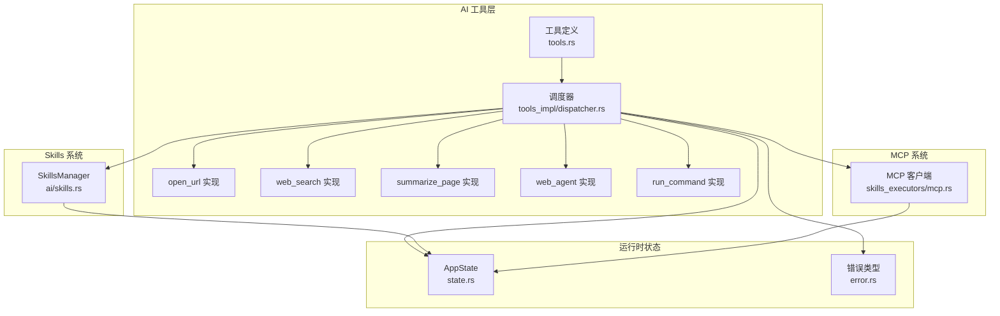
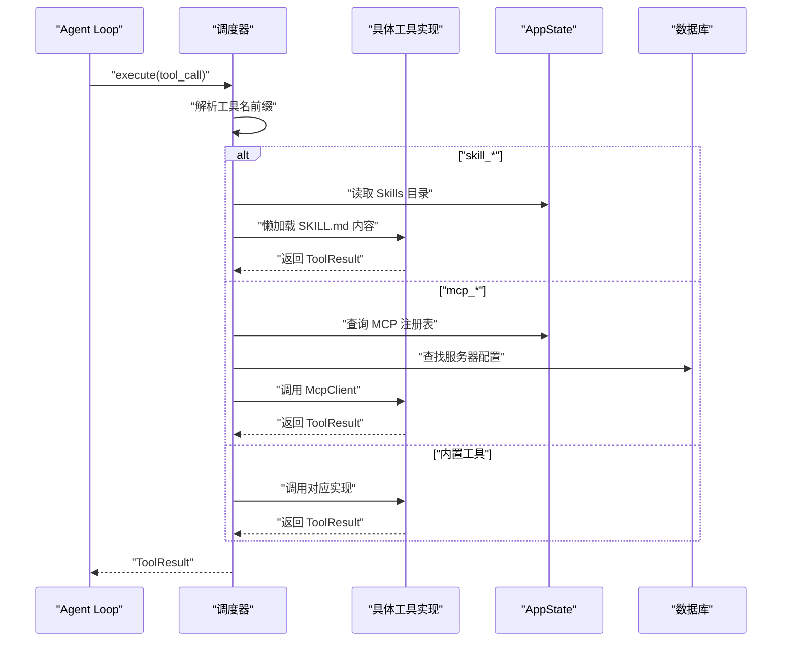
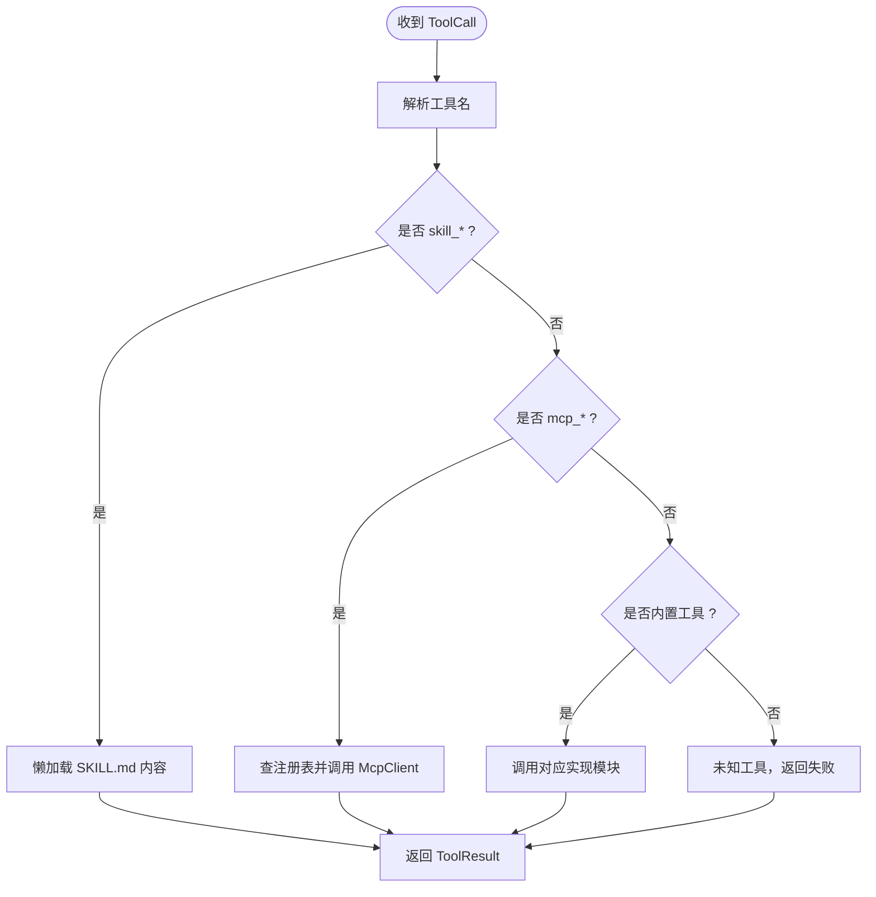
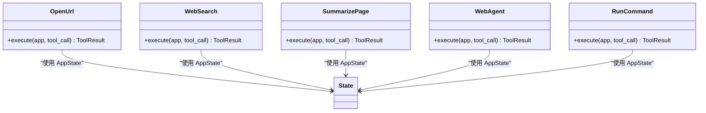
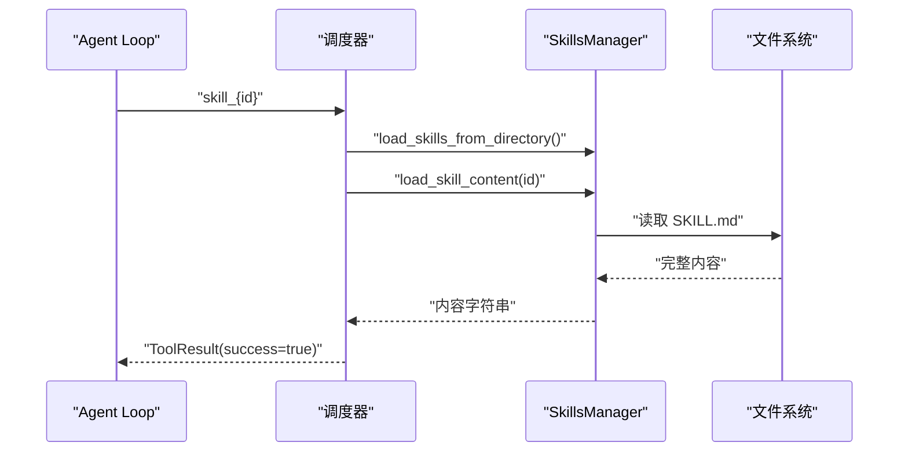
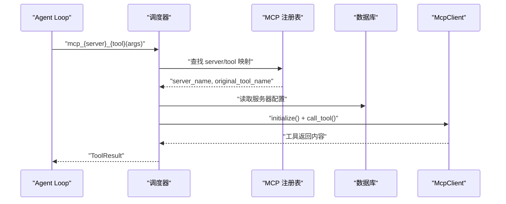
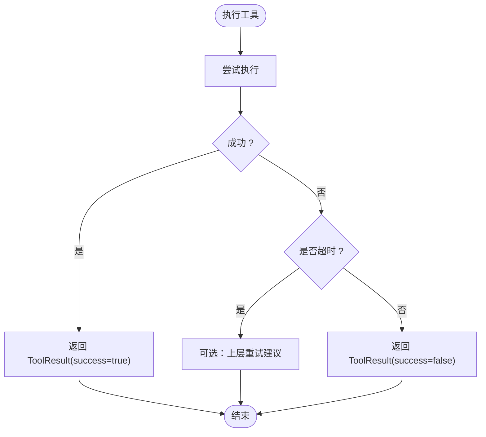
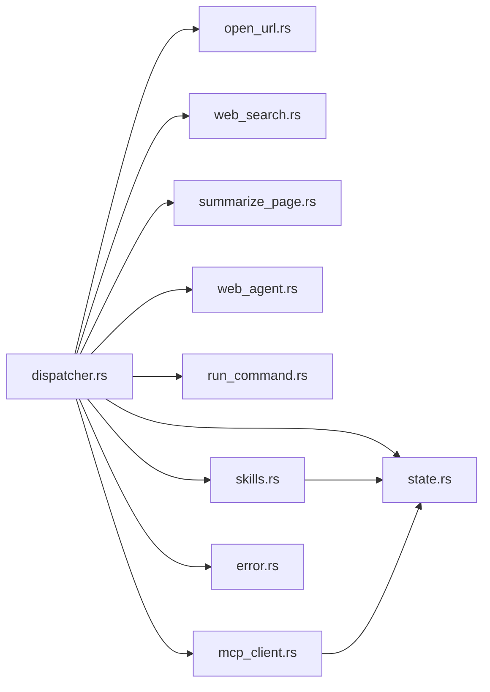

# 工具调度器

<cite>
**本文引用的文件**
- [tools.rs](file://src-tauri/src/ai/tools.rs)
- [skills.rs](file://src-tauri/src/ai/skills.rs)
- [mcp.rs](file://src-tauri/src/ai/mcp.rs)
- [dispatcher.rs](file://src-tauri/src/ai/tools_impl/dispatcher.rs)
- [open_url.rs](file://src-tauri/src/ai/tools_impl/open_url.rs)
- [web_search.rs](file://src-tauri/src/ai/tools_impl/web_search.rs)
- [summarize_page.rs](file://src-tauri/src/ai/tools_impl/summarize_page.rs)
- [web_agent.rs](file://src-tauri/src/ai/tools_impl/web_agent.rs)
- [run_command.rs](file://src-tauri/src/ai/tools_impl/run_command.rs)
- [mcp_client.rs](file://src-tauri/src/ai/skills_executors/mcp.rs)
- [command_utils.rs](file://src-tauri/src/ai/skills_executors/command_utils.rs)
- [tools_mod.rs](file://src-tauri/src/ai/tools_impl/mod.rs)
- [error.rs](file://src-tauri/src/error.rs)
- [state.rs](file://src-tauri/src/state.rs)
</cite>

## 目录
1. [简介](#简介)
2. [项目结构](#项目结构)
3. [核心组件](#核心组件)
4. [架构总览](#架构总览)
5. [详细组件分析](#详细组件分析)
6. [依赖关系分析](#依赖关系分析)
7. [性能考量](#性能考量)
8. [故障排查指南](#故障排查指南)
9. [结论](#结论)
10. [附录：扩展指南](#附录扩展指南)

## 简介
本文件面向 CoSurf 工具调度器，系统性阐述其架构与实现原理，重点覆盖：
- 工具路由机制与名称解析
- 工具类型识别与处理流程（内置工具、Skill 工具、MCP 工具）
- 懒加载机制（尤其是 Skill 工具的延迟加载与内容读取）
- 错误处理与重试策略（工具不存在、执行失败、超时等）
- 扩展指南（新增工具类型与自定义处理逻辑）
- 性能优化与并发处理能力

## 项目结构
工具调度器位于 Rust 后端（Tauri），采用“模块化+分层”的组织方式：
- 工具定义与模式：tools.rs
- 工具调度器：tools_impl/dispatcher.rs
- 内置工具实现：open_url、web_search、summarize_page、web_agent、run_command
- Skills 管理与懒加载：ai/skills.rs
- MCP 客户端与传输：ai/skills_executors/mcp.rs
- 错误类型与状态：error.rs、state.rs

**图表来源**
- [tools.rs:1-621](file://src-tauri/src/ai/tools.rs#L1-L621)
- [dispatcher.rs:1-238](file://src-tauri/src/ai/tools_impl/dispatcher.rs#L1-L238)
- [skills.rs:1-576](file://src-tauri/src/ai/skills.rs#L1-L576)
- [mcp_client.rs:1-558](file://src-tauri/src/ai/skills_executors/mcp.rs#L1-L558)
- [state.rs:1-81](file://src-tauri/src/state.rs#L1-L81)
- [error.rs:1-64](file://src-tauri/src/error.rs#L1-L64)

**章节来源**
- [tools.rs:1-621](file://src-tauri/src/ai/tools.rs#L1-L621)
- [tools_mod.rs:1-14](file://src-tauri/src/ai/tools_impl/mod.rs#L1-L14)
- [dispatcher.rs:1-238](file://src-tauri/src/ai/tools_impl/dispatcher.rs#L1-L238)
- [skills.rs:1-576](file://src-tauri/src/ai/skills.rs#L1-L576)
- [mcp_client.rs:1-558](file://src-tauri/src/ai/skills_executors/mcp.rs#L1-L558)
- [state.rs:1-81](file://src-tauri/src/state.rs#L1-L81)
- [error.rs:1-64](file://src-tauri/src/error.rs#L1-L64)

## 核心组件
- 工具定义与模式
  - ToolCall/ToolResult：统一的工具调用与结果结构
  - BuiltInTool：内置工具枚举及其 OpenAI Schema 生成
- 工具路由与调度
  - execute：根据工具名分发至对应实现；支持 skill_* 与 mcp_* 前缀
- Skills 系统
  - SkillsManager：目录扫描、元数据解析、懒加载完整内容
- MCP 客户端
  - McpClient：支持 Streamable HTTP、SSE、JSON-RPC 协议
- 运行时状态
  - AppState：数据库、活跃标签页、最近打开 URL、MCP 注册表、SkillsManager 等

**章节来源**
- [tools.rs:1-621](file://src-tauri/src/ai/tools.rs#L1-L621)
- [dispatcher.rs:1-238](file://src-tauri/src/ai/tools_impl/dispatcher.rs#L1-L238)
- [skills.rs:1-576](file://src-tauri/src/ai/skills.rs#L1-L576)
- [mcp_client.rs:1-558](file://src-tauri/src/ai/skills_executors/mcp.rs#L1-L558)
- [state.rs:1-81](file://src-tauri/src/state.rs#L1-L81)

## 架构总览
调度器采用“名称解析 + 分发 + 懒加载 + 异常处理”的流水线式设计：
- 工具名称解析：内置工具名、Skill 前缀（skill_）、MCP 前缀（mcp_）
- 路由分发：dispatcher 根据前缀选择对应执行器
- 懒加载：Skill 工具仅在被调用时读取完整内容
- 异常处理：统一错误类型与日志，超时与失败返回 ToolResult.success=false

**图表来源**
- [dispatcher.rs:14-55](file://src-tauri/src/ai/tools_impl/dispatcher.rs#L14-L55)
- [skills.rs:262-272](file://src-tauri/src/ai/skills.rs#L262-L272)
- [mcp_client.rs:200-246](file://src-tauri/src/ai/skills_executors/mcp.rs#L200-L246)
- [state.rs:9-23](file://src-tauri/src/state.rs#L9-L23)

**章节来源**
- [dispatcher.rs:1-238](file://src-tauri/src/ai/tools_impl/dispatcher.rs#L1-L238)
- [state.rs:1-81](file://src-tauri/src/state.rs#L1-L81)

## 详细组件分析

### 工具路由与名称解析
- 内置工具：open_url、web_search、summarize_page、web_agent、run_command
- Skill 工具：skill_{id}，由调度器检测前缀后转交 SkillsManager 懒加载
- MCP 工具：mcp_{server}_{tool}，通过注册表映射到具体服务器与原始工具名

**图表来源**
- [dispatcher.rs:22-54](file://src-tauri/src/ai/tools_impl/dispatcher.rs#L22-L54)
- [tools.rs:227-272](file://src-tauri/src/ai/tools.rs#L227-L272)
- [tools.rs:274-413](file://src-tauri/src/ai/tools.rs#L274-L413)

**章节来源**
- [dispatcher.rs:1-238](file://src-tauri/src/ai/tools_impl/dispatcher.rs#L1-L238)
- [tools.rs:1-621](file://src-tauri/src/ai/tools.rs#L1-L621)

### 内置工具实现要点
- open_url：参数校验、URL 去重、前端事件交互、超时等待新标签页
- web_search：阿里云 IQS API 调用、参数解析、结果格式化
- summarize_page：混合内容提取策略（iframe/Playwright/HTTP fallback）、AI 总结
- web_agent：调用现有页面上下文命令，执行点击/填写等操作
- run_command：安全检查（黑名单）、超时控制、输出截断

**图表来源**
- [open_url.rs:17-100](file://src-tauri/src/ai/tools_impl/open_url.rs#L17-L100)
- [web_search.rs:15-179](file://src-tauri/src/ai/tools_impl/web_search.rs#L15-L179)
- [summarize_page.rs:17-55](file://src-tauri/src/ai/tools_impl/summarize_page.rs#L17-L55)
- [web_agent.rs:13-49](file://src-tauri/src/ai/tools_impl/web_agent.rs#L13-L49)
- [run_command.rs:35-161](file://src-tauri/src/ai/tools_impl/run_command.rs#L35-L161)

**章节来源**
- [open_url.rs:1-146](file://src-tauri/src/ai/tools_impl/open_url.rs#L1-L146)
- [web_search.rs:1-179](file://src-tauri/src/ai/tools_impl/web_search.rs#L1-L179)
- [summarize_page.rs:1-428](file://src-tauri/src/ai/tools_impl/summarize_page.rs#L1-L428)
- [web_agent.rs:1-79](file://src-tauri/src/ai/tools_impl/web_agent.rs#L1-L79)
- [run_command.rs:1-161](file://src-tauri/src/ai/tools_impl/run_command.rs#L1-L161)

### Skills 系统与懒加载
- 目录结构：skills/{skill-id}/SKILL.md
- 初始加载：仅解析 frontmatter（name/description/tags），不读取正文
- 懒加载：当模型调用 skill_{id} 时，才读取完整 SKILL.md 内容返回给 Agent Loop

**图表来源**
- [dispatcher.rs:61-119](file://src-tauri/src/ai/tools_impl/dispatcher.rs#L61-L119)
- [skills.rs:262-272](file://src-tauri/src/ai/skills.rs#L262-L272)

**章节来源**
- [skills.rs:1-576](file://src-tauri/src/ai/skills.rs#L1-L576)
- [dispatcher.rs:57-119](file://src-tauri/src/ai/tools_impl/dispatcher.rs#L57-L119)

### MCP 工具集成
- 工具发现：连接各 MCP Server，拉取 tools/list，注册到全局注册表
- 调用流程：根据 mcp_{server}_{tool} 查表，定位服务器与原始工具名，直接调用
- 传输协议：Streamable HTTP、SSE、JSON-RPC 2.0

**图表来源**
- [tools.rs:274-413](file://src-tauri/src/ai/tools.rs#L274-L413)
- [dispatcher.rs:125-204](file://src-tauri/src/ai/tools_impl/dispatcher.rs#L125-L204)
- [mcp_client.rs:168-246](file://src-tauri/src/ai/skills_executors/mcp.rs#L168-L246)

**章节来源**
- [tools.rs:274-454](file://src-tauri/src/ai/tools.rs#L274-L454)
- [dispatcher.rs:121-204](file://src-tauri/src/ai/tools_impl/dispatcher.rs#L121-L204)
- [mcp_client.rs:1-558](file://src-tauri/src/ai/skills_executors/mcp.rs#L1-L558)

### 错误处理与重试策略
- 统一错误类型：AppError，序列化为 IPC 友好格式
- 超时控制：MCP 工具列表拉取、Skill 内容读取、前端事件等待等均设置超时
- 失败回退：内置工具返回 ToolResult.success=false，Agent Loop 自行决策
- 重试建议：对于瞬时网络错误，可在上层 Agent Loop 层实现有限重试

**图表来源**
- [error.rs:1-64](file://src-tauri/src/error.rs#L1-L64)
- [dispatcher.rs:136-203](file://src-tauri/src/ai/tools_impl/dispatcher.rs#L136-L203)
- [open_url.rs:132-144](file://src-tauri/src/ai/tools_impl/open_url.rs#L132-L144)
- [summarize_page.rs:280-292](file://src-tauri/src/ai/tools_impl/summarize_page.rs#L280-L292)

**章节来源**
- [error.rs:1-64](file://src-tauri/src/error.rs#L1-L64)
- [dispatcher.rs:1-238](file://src-tauri/src/ai/tools_impl/dispatcher.rs#L1-L238)
- [open_url.rs:103-145](file://src-tauri/src/ai/tools_impl/open_url.rs#L103-L145)
- [summarize_page.rs:228-293](file://src-tauri/src/ai/tools_impl/summarize_page.rs#L228-L293)

## 依赖关系分析
- dispatcher 对内置工具模块、SkillsManager、McpClient、AppState、DB 存在直接依赖
- 内置工具实现依赖 AppState 与前端事件通信
- SkillsManager 依赖文件系统与数据库配置
- McpClient 依赖网络库与 JSON-RPC 协议栈

**图表来源**
- [dispatcher.rs:1-238](file://src-tauri/src/ai/tools_impl/dispatcher.rs#L1-L238)
- [skills.rs:1-576](file://src-tauri/src/ai/skills.rs#L1-L576)
- [mcp_client.rs:1-558](file://src-tauri/src/ai/skills_executors/mcp.rs#L1-L558)
- [state.rs:1-81](file://src-tauri/src/state.rs#L1-L81)
- [error.rs:1-64](file://src-tauri/src/error.rs#L1-L64)

**章节来源**
- [dispatcher.rs:1-238](file://src-tauri/src/ai/tools_impl/dispatcher.rs#L1-L238)
- [state.rs:1-81](file://src-tauri/src/state.rs#L1-L81)

## 性能考量
- 懒加载优化：SkillsManager 仅在首次调用 skill_* 时读取完整内容，避免启动时大量 IO
- 并发与锁：AppState 使用 Mutex 保护共享状态；注意避免长时间持有锁
- 超时与背压：MCP 工具列表拉取、前端事件等待、命令执行均设置超时，防止阻塞
- 输出截断：run_command 对 stdout/stderr 截断，避免超长文本影响性能
- 内容提取策略：summarize_page 采用多路降级策略，提升成功率与鲁棒性

[本节为通用性能讨论，不直接分析具体文件]

## 故障排查指南
- 工具不存在
  - 现象：返回 ToolResult.success=false，输出提示未知工具
  - 排查：确认工具名前缀与注册情况（内置、Skill、MCP）
- 技能加载失败
  - 现象：返回 ToolResult.success=false，输出技能加载错误
  - 排查：检查 SKILL.md 文件完整性与目录权限
- MCP 工具不可用
  - 现象：返回 ToolResult.success=false，提示服务器断开或未找到
  - 排查：确认服务器配置、网络连通性、注册表是否更新
- 前端事件超时
  - 现象：open_url、summarize_page 等等待前端响应超时
  - 排查：检查前端事件监听与响应逻辑，适当延长超时时间
- 命令执行失败/超时
  - 现象：run_command 返回失败，可能被安全策略拦截
  - 排查：检查命令黑名单、工作目录、超时设置

**章节来源**
- [dispatcher.rs:50-54](file://src-tauri/src/ai/tools_impl/dispatcher.rs#L50-L54)
- [dispatcher.rs:85-92](file://src-tauri/src/ai/tools_impl/dispatcher.rs#L85-L92)
- [dispatcher.rs:142-150](file://src-tauri/src/ai/tools_impl/dispatcher.rs#L142-L150)
- [open_url.rs:132-144](file://src-tauri/src/ai/tools_impl/open_url.rs#L132-L144)
- [run_command.rs:141-149](file://src-tauri/src/ai/tools_impl/run_command.rs#L141-L149)

## 结论
工具调度器通过清晰的名称解析与分发机制，结合 Skills 懒加载与 MCP 工具生态，实现了灵活、可扩展且健壮的工具执行框架。内置工具覆盖常见网页自动化与系统操作场景，配合 MCP 生态可无缝接入外部能力。通过超时控制、错误回退与输出截断等策略，系统在复杂网络环境下仍能保持稳定。

[本节为总结性内容，不直接分析具体文件]

## 附录：扩展指南
- 新增内置工具
  - 在 tools.rs 中定义工具枚举与参数 Schema，并在 dispatcher.rs 中添加分支
  - 在 tools_impl/mod.rs 中导出新模块并在对应文件中实现 execute
- 新增 Skill 工具
  - 在 skills 目录下创建 {skill-id}/SKILL.md，遵循 frontmatter 规范
  - Agent Loop 通过 skill_{id} 调用，调度器自动懒加载
- 新增 MCP 工具
  - 在设置中配置 MCP Server（HTTP/Streamable HTTP/SSE/STDIO）
  - 调度器自动拉取 tools/list 并注册到注册表，Agent Loop 通过 mcp_{server}_{tool} 调用
- 自定义工具处理逻辑
  - 在 dispatcher.rs 中扩展路由分支，或在对应工具实现中增强参数校验与错误处理
  - 注意超时与锁的使用，避免阻塞主线程

**章节来源**
- [tools.rs:197-225](file://src-tauri/src/ai/tools.rs#L197-L225)
- [dispatcher.rs:34-54](file://src-tauri/src/ai/tools_impl/dispatcher.rs#L34-L54)
- [tools_mod.rs:1-14](file://src-tauri/src/ai/tools_impl/mod.rs#L1-L14)
- [skills.rs:103-170](file://src-tauri/src/ai/skills.rs#L103-L170)
- [tools.rs:274-413](file://src-tauri/src/ai/tools.rs#L274-L413)