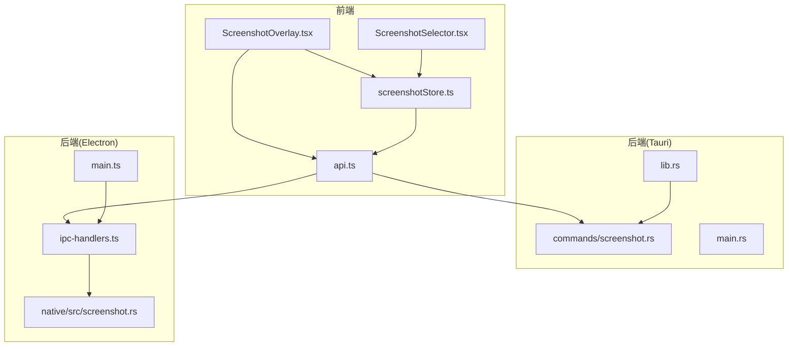
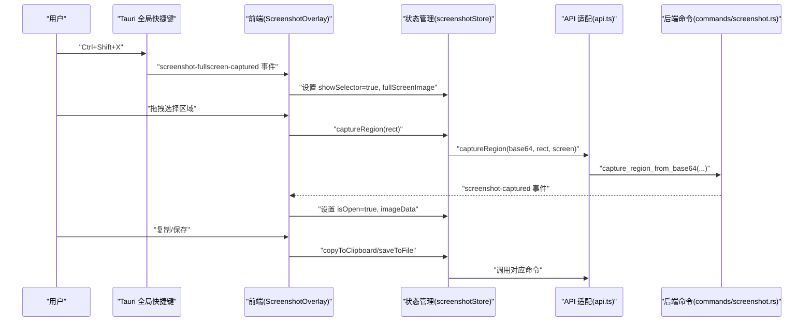
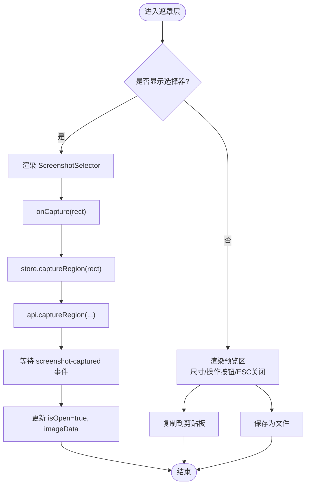
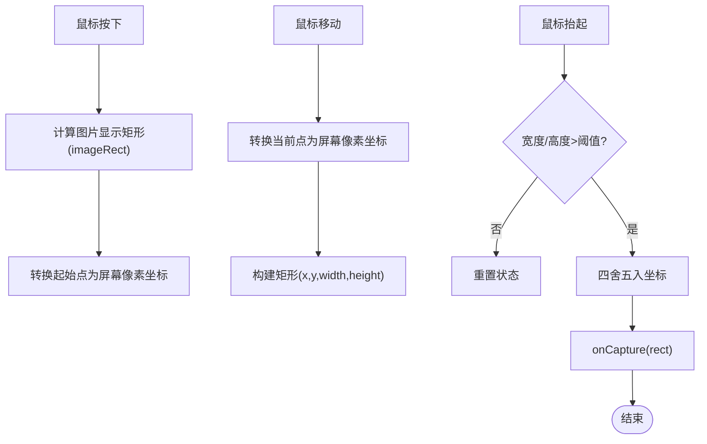
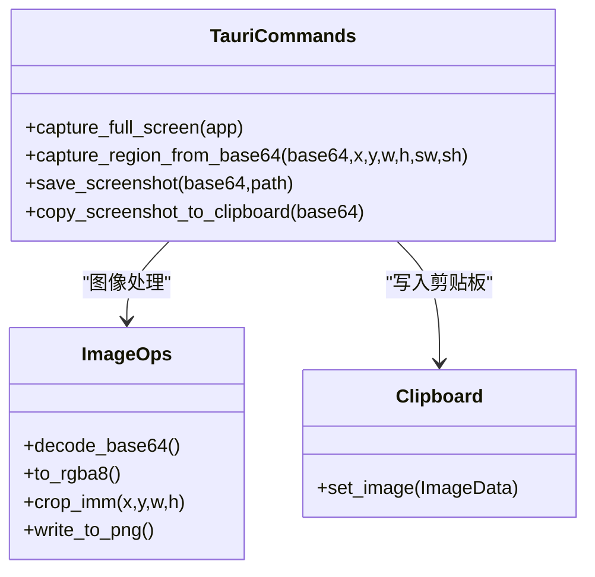
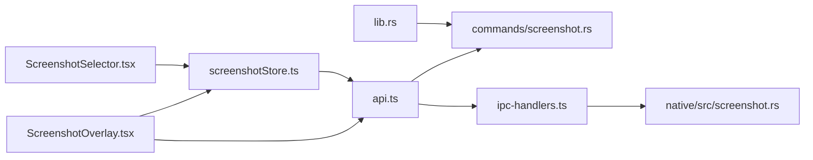

# 截图工具

<cite>
**本文引用的文件列表**
- [ScreenshotOverlay.tsx](file://src-web/src/components/ui/ScreenshotOverlay.tsx)
- [ScreenshotSelector.tsx](file://src-web/src/components/ui/ScreenshotSelector.tsx)
- [screenshotStore.ts](file://src-web/src/stores/screenshotStore.ts)
- [api.ts](file://src-web/src/lib/api.ts)
- [screenshot.rs（Tauri）](file://src-tauri/src/commands/screenshot.rs)
- [lib.rs（Tauri）](file://src-tauri/src/lib.rs)
- [main.rs（Tauri）](file://src-tauri/src/main.rs)
- [screenshot.rs（Native）](file://native/src/screenshot.rs)
- [main.ts（Electron）](file://electron/main.ts)
- [ipc-handlers.ts（Electron）](file://electron/ipc-handlers.ts)
</cite>

## 目录
1. [简介](#简介)
2. [项目结构](#项目结构)
3. [核心组件](#核心组件)
4. [架构总览](#架构总览)
5. [详细组件分析](#详细组件分析)
6. [依赖关系分析](#依赖关系分析)
7. [性能考量](#性能考量)
8. [故障排查指南](#故障排查指南)
9. [结论](#结论)
10. [附录](#附录)

## 简介
本文件系统性地解析 CoSurf 截图工具的实现，覆盖全屏截图与区域截图的工作流程、屏幕捕获与图像处理、坐标计算与转换、截图选择器的交互设计、前端 UI 组件、截图数据的处理与存储、以及快捷键与用户体验优化。目标读者既包括需要快速上手的使用者，也包括希望理解实现细节的开发者。

## 项目结构
截图工具由前端 React 组件与后端命令两部分协作完成：
- 前端负责 UI 展示、事件监听、用户交互与状态管理
- 后端负责系统级屏幕捕获、图像解码/编码、区域裁剪、剪贴板与文件写入

图表来源
- [ScreenshotOverlay.tsx:1-153](file://src-web/src/components/ui/ScreenshotOverlay.tsx#L1-L153)
- [ScreenshotSelector.tsx:1-160](file://src-web/src/components/ui/ScreenshotSelector.tsx#L1-L160)
- [screenshotStore.ts:1-128](file://src-web/src/stores/screenshotStore.ts#L1-L128)
- [api.ts:344-356](file://src-web/src/lib/api.ts#L344-L356)
- [lib.rs（Tauri）:75-93](file://src-tauri/src/lib.rs#L75-L93)
- [screenshot.rs（Tauri）:14-58](file://src-tauri/src/commands/screenshot.rs#L14-L58)
- [main.ts（Electron）:90-100](file://electron/main.ts#L90-L100)
- [ipc-handlers.ts（Electron）:434-464](file://electron/ipc-handlers.ts#L434-L464)
- [screenshot.rs（Native）:10-40](file://native/src/screenshot.rs#L10-L40)

章节来源
- [ScreenshotOverlay.tsx:1-153](file://src-web/src/components/ui/ScreenshotOverlay.tsx#L1-L153)
- [ScreenshotSelector.tsx:1-160](file://src-web/src/components/ui/ScreenshotSelector.tsx#L1-L160)
- [screenshotStore.ts:1-128](file://src-web/src/stores/screenshotStore.ts#L1-L128)
- [api.ts:344-356](file://src-web/src/lib/api.ts#L344-L356)
- [lib.rs（Tauri）:75-93](file://src-tauri/src/lib.rs#L75-L93)
- [screenshot.rs（Tauri）:14-58](file://src-tauri/src/commands/screenshot.rs#L14-L58)
- [main.ts（Electron）:90-100](file://electron/main.ts#L90-L100)
- [ipc-handlers.ts（Electron）:434-464](file://electron/ipc-handlers.ts#L434-L464)
- [screenshot.rs（Native）:10-40](file://native/src/screenshot.rs#L10-L40)

## 核心组件
- 截图遮罩层与预览：负责全屏截图后的预览展示、复制到剪贴板、保存为文件、关闭等操作
- 区域选择器：在全屏截图基础上进行拖拽选择，计算真实屏幕坐标并触发裁剪
- 截图状态管理：集中管理截图状态、事件监听、复制/保存流程
- API 适配层：统一前端调用后端命令的接口，兼容 Tauri 与 Electron
- 后端命令：全屏捕获、区域裁剪、保存、复制到剪贴板

章节来源
- [ScreenshotOverlay.tsx:9-152](file://src-web/src/components/ui/ScreenshotOverlay.tsx#L9-L152)
- [ScreenshotSelector.tsx:12-159](file://src-web/src/components/ui/ScreenshotSelector.tsx#L12-L159)
- [screenshotStore.ts:25-127](file://src-web/src/stores/screenshotStore.ts#L25-L127)
- [api.ts:344-356](file://src-web/src/lib/api.ts#L344-L356)
- [screenshot.rs（Tauri）:14-164](file://src-tauri/src/commands/screenshot.rs#L14-L164)
- [screenshot.rs（Native）:10-129](file://native/src/screenshot.rs#L10-L129)

## 架构总览
整体工作流如下：
- 用户按下全局快捷键触发截图
- 后端捕获全屏图像，以 Base64 PNG 形式回传前端
- 前端显示遮罩层与区域选择器
- 用户拖拽选择区域，前端计算真实屏幕坐标并调用后端裁剪
- 后端裁剪后以 Base64 PNG 返回前端，前端展示预览并支持复制/保存

图表来源
- [lib.rs（Tauri）:75-93](file://src-tauri/src/lib.rs#L75-L93)
- [ScreenshotOverlay.tsx:28-61](file://src-web/src/components/ui/ScreenshotOverlay.tsx#L28-L61)
- [screenshotStore.ts:69-86](file://src-web/src/stores/screenshotStore.ts#L69-L86)
- [api.ts:348-349](file://src-web/src/lib/api.ts#L348-L349)
- [screenshot.rs（Tauri）:62-119](file://src-tauri/src/commands/screenshot.rs#L62-L119)

## 详细组件分析

### 截图遮罩层与预览（ScreenshotOverlay）
- 功能要点
  - 监听全屏截图完成事件，切换到选择器或进入预览态
  - ESC 键关闭遮罩层
  - 预览区显示尺寸信息与操作按钮（复制到剪贴板、保存为文件、取消）
  - 支持 Toast 提示反馈
- 关键交互
  - 通过状态管理器控制 isOpen/showSelector/fullScreenImage/imageData
  - 调用 API 执行复制/保存，并在成功后自动关闭

图表来源
- [ScreenshotOverlay.tsx:9-61](file://src-web/src/components/ui/ScreenshotOverlay.tsx#L9-L61)
- [screenshotStore.ts:69-86](file://src-web/src/stores/screenshotStore.ts#L69-L86)
- [api.ts:348-349](file://src-web/src/lib/api.ts#L348-L349)

章节来源
- [ScreenshotOverlay.tsx:9-152](file://src-web/src/components/ui/ScreenshotOverlay.tsx#L9-L152)
- [screenshotStore.ts:25-127](file://src-web/src/stores/screenshotStore.ts#L25-L127)

### 区域选择器（ScreenshotSelector）
- 功能要点
  - 全屏截图作为背景，支持 ESC 取消
  - 鼠标拖拽绘制矩形，实时显示尺寸
  - 将屏幕坐标转换为图片物理像素坐标，再映射到真实屏幕分辨率
  - 防止过小区域被提交（阈值判断）
- 坐标计算
  - 将鼠标坐标从视口坐标系转换为图片显示坐标系
  - 将图片坐标乘以缩放比（screenWidth/imageRect.width）得到真实屏幕像素坐标
  - 最终裁剪区域以四舍五入后的整数坐标提交

图表来源
- [ScreenshotSelector.tsx:61-102](file://src-web/src/components/ui/ScreenshotSelector.tsx#L61-L102)
- [ScreenshotSelector.tsx:21-50](file://src-web/src/components/ui/ScreenshotSelector.tsx#L21-L50)

章节来源
- [ScreenshotSelector.tsx:12-159](file://src-web/src/components/ui/ScreenshotSelector.tsx#L12-L159)

### 截图状态管理（screenshotStore）
- 负责：
  - 初始化事件监听，接收全屏截图与裁剪完成事件
  - 触发后端裁剪命令
  - 复制到剪贴板与保存文件的流程控制与错误处理
  - Toast 提示与自动关闭
- 关键流程
  - 接收 fullscreen-captured：设置 showSelector=true，准备选择器
  - 接收 captured：设置 isOpen=true，进入预览态
  - captureRegion：调用 api.captureRegion 并处理异常
  - copyToClipboard/saveToFile：弹出对话框、调用后端命令、提示与关闭

章节来源
- [screenshotStore.ts:25-127](file://src-web/src/stores/screenshotStore.ts#L25-L127)

### API 适配层（api.ts）
- 统一封装前端对后端命令的调用，提供：
  - captureFull：触发全屏截图
  - captureRegion：基于 Base64 全屏图裁剪区域
  - save：保存为文件
  - copyToClipboard：复制到剪贴板
- 该层同时兼容 Tauri 与 Electron（通过不同通道名），前端无需关心底层差异

章节来源
- [api.ts:344-356](file://src-web/src/lib/api.ts#L344-L356)

### 后端命令（Tauri）
- 全屏截图：使用 xcap 获取 Monitor，截取图像并编码为 PNG，Base64 发送到前端
- 区域裁剪：解码 Base64，使用 image 库裁剪，再编码为 PNG，返回给前端
- 保存：解码 Base64 写入文件
- 复制到剪贴板：解码为 RGBA，使用 arboard 写入系统剪贴板

图表来源
- [screenshot.rs（Tauri）:14-164](file://src-tauri/src/commands/screenshot.rs#L14-L164)

章节来源
- [screenshot.rs（Tauri）:14-164](file://src-tauri/src/commands/screenshot.rs#L14-L164)

### 后端命令（Electron/Native）
- 与 Tauri 版本功能一致，但通过 Electron IPC 与原生模块交互
- 提供截图捕获、裁剪、保存、复制到剪贴板的 N-API 接口

章节来源
- [ipc-handlers.ts（Electron）:434-464](file://electron/ipc-handlers.ts#L434-L464)
- [screenshot.rs（Native）:10-129](file://native/src/screenshot.rs#L10-L129)

## 依赖关系分析
- 前端依赖
  - ScreenshotOverlay 依赖 screenshotStore 与 api.ts
  - ScreenshotSelector 依赖图片尺寸与屏幕分辨率，进行坐标转换
- 后端依赖
  - Tauri：xcap 获取屏幕图像，image 编解码，arboard 写剪贴板
  - Electron：通过 IPC 将调用转发至原生模块

图表来源
- [ScreenshotOverlay.tsx:1-25](file://src-web/src/components/ui/ScreenshotOverlay.tsx#L1-L25)
- [ScreenshotSelector.tsx:1-18](file://src-web/src/components/ui/ScreenshotSelector.tsx#L1-L18)
- [screenshotStore.ts:1-23](file://src-web/src/stores/screenshotStore.ts#L1-L23)
- [api.ts:344-356](file://src-web/src/lib/api.ts#L344-L356)
- [lib.rs（Tauri）:202-205](file://src-tauri/src/lib.rs#L202-L205)
- [ipc-handlers.ts（Electron）:434-464](file://electron/ipc-handlers.ts#L434-L464)
- [screenshot.rs（Native）:10-40](file://native/src/screenshot.rs#L10-L40)

章节来源
- [ScreenshotOverlay.tsx:1-25](file://src-web/src/components/ui/ScreenshotOverlay.tsx#L1-L25)
- [ScreenshotSelector.tsx:1-18](file://src-web/src/components/ui/ScreenshotSelector.tsx#L1-L18)
- [screenshotStore.ts:1-23](file://src-web/src/stores/screenshotStore.ts#L1-L23)
- [api.ts:344-356](file://src-web/src/lib/api.ts#L344-L356)
- [lib.rs（Tauri）:202-205](file://src-tauri/src/lib.rs#L202-L205)
- [ipc-handlers.ts（Electron）:434-464](file://electron/ipc-handlers.ts#L434-L464)
- [screenshot.rs（Native）:10-40](file://native/src/screenshot.rs#L10-L40)

## 性能考量
- 图像处理
  - Base64 编解码与 PNG 编码/解码在后端完成，前端仅传递字符串，避免大对象跨进程传输
  - 裁剪采用即时裁剪，避免不必要的中间缓冲
- 坐标转换
  - 通过 imageRect 与屏幕分辨率的比例换算，减少重复计算
  - 四舍五入避免浮点误差导致的裁剪异常
- 事件驱动
  - 使用事件驱动的前后端通信，避免阻塞主线程
- 存储与内存
  - 保存文件直接写入磁盘，复制到剪贴板使用系统级接口，避免额外内存占用
- 可选优化建议
  - 对于高分辨率屏幕，可考虑在前端先缩放显示，降低渲染压力
  - 对频繁调用的裁剪操作，可引入本地缓存策略（需评估内存占用）

[本节为通用性能讨论，不直接分析具体文件]

## 故障排查指南
- 全屏截图失败
  - 检查全局快捷键是否被其他程序占用
  - 查看后端日志，确认 xcap 是否能获取到显示器
- 区域选择无效
  - 确认图片加载完成后再开始选择
  - 检查 imageRect 计算逻辑，确保在 resize 事件后及时更新
- 裁剪结果异常
  - 检查坐标转换比例是否正确
  - 确保裁剪区域不越界
- 复制/保存失败
  - 检查剪贴板权限与文件路径权限
  - 查看后端错误日志定位具体原因

章节来源
- [lib.rs（Tauri）:75-93](file://src-tauri/src/lib.rs#L75-L93)
- [screenshotStore.ts:82-85](file://src-web/src/stores/screenshotStore.ts#L82-L85)
- [screenshot.rs（Tauri）:74-118](file://src-tauri/src/commands/screenshot.rs#L74-L118)

## 结论
CoSurf 截图工具通过清晰的前后端分层与事件驱动机制，实现了从全屏捕获到区域裁剪再到复制/保存的一体化体验。前端负责直观的用户交互与状态管理，后端专注于高性能的图像处理与系统集成。整体架构简洁可靠，具备良好的扩展性与可维护性。

[本节为总结性内容，不直接分析具体文件]

## 附录

### 快捷键与操作指南
- 全局快捷键
  - Windows/Linux: Ctrl+Shift+X
  - macOS: Command+Shift+X
- 截图操作
  - 按下快捷键后，全屏截图完成，出现遮罩层与区域选择器
  - 拖拽鼠标选择区域，松开即触发裁剪
  - 预览区支持复制到剪贴板与保存为文件
  - ESC 键可随时取消

章节来源
- [lib.rs（Tauri）:75-93](file://src-tauri/src/lib.rs#L75-L93)
- [ScreenshotOverlay.tsx:39-46](file://src-web/src/components/ui/ScreenshotOverlay.tsx#L39-L46)
- [ScreenshotSelector.tsx:52-59](file://src-web/src/components/ui/ScreenshotSelector.tsx#L52-L59)

### 技术实现要点
- 坐标系统
  - 屏幕坐标 → 图片显示坐标 → 图片像素坐标 → 真实屏幕坐标
- 数据流转
  - Base64 PNG 在前端与后端之间传递，避免二进制大对象传输
- 错误处理
  - 前端通过 Toast 提示，后端通过日志记录与错误返回

章节来源
- [ScreenshotSelector.tsx:61-102](file://src-web/src/components/ui/ScreenshotSelector.tsx#L61-L102)
- [screenshotStore.ts:82-126](file://src-web/src/stores/screenshotStore.ts#L82-L126)
- [screenshot.rs（Tauri）:74-118](file://src-tauri/src/commands/screenshot.rs#L74-L118)