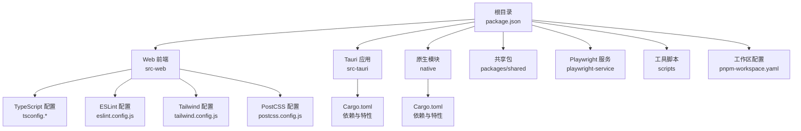
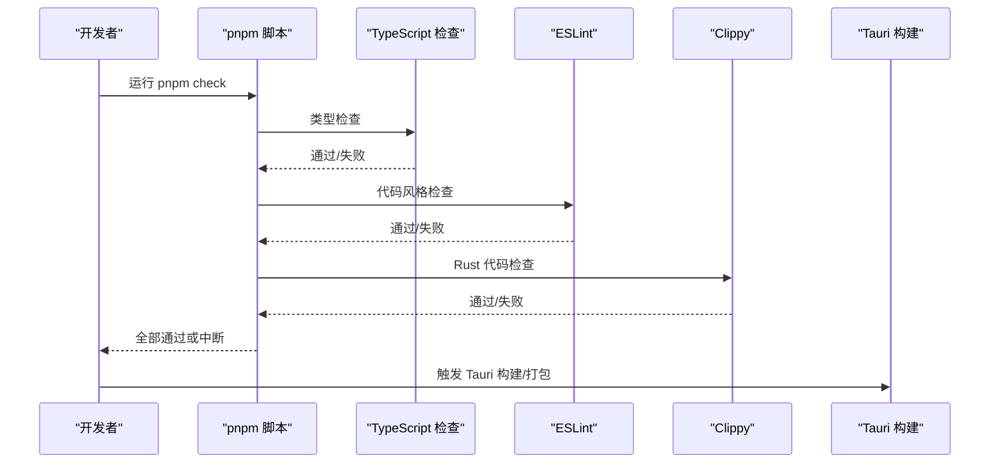
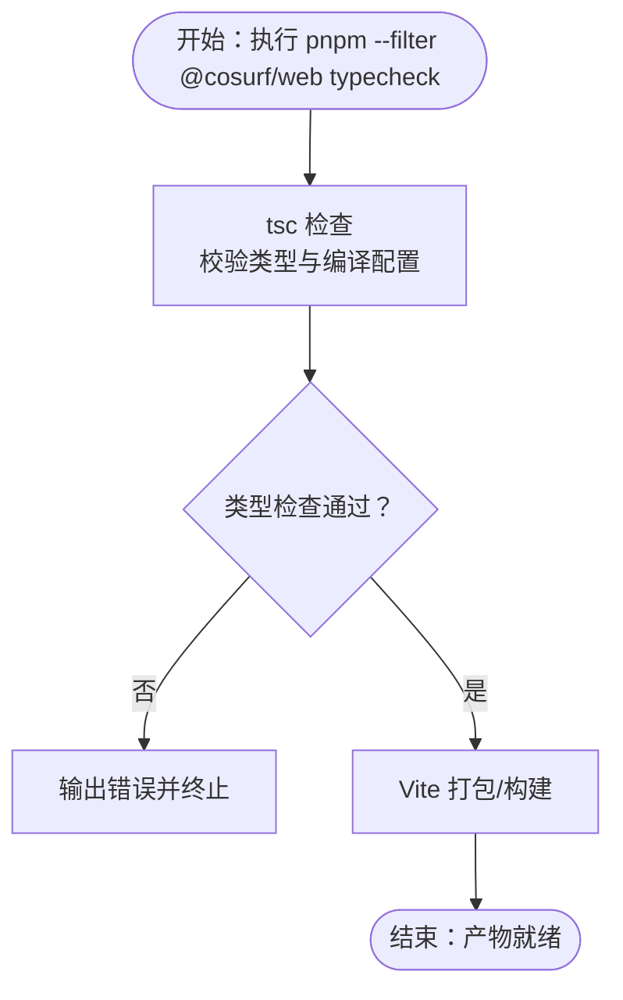
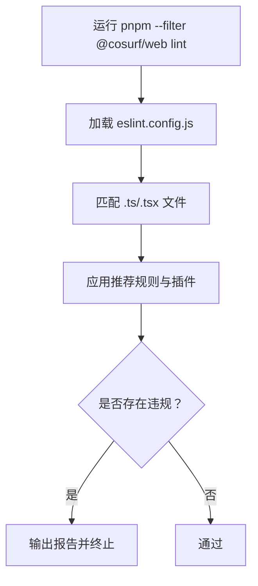
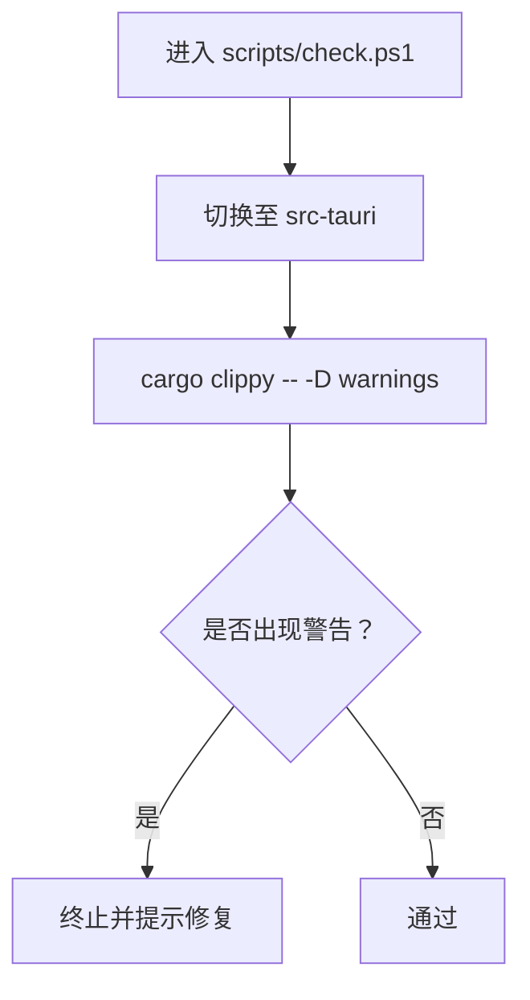
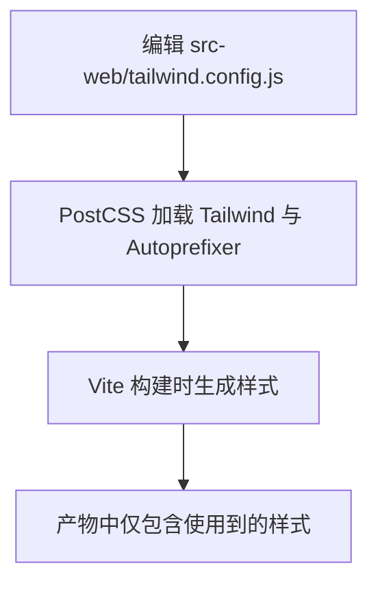
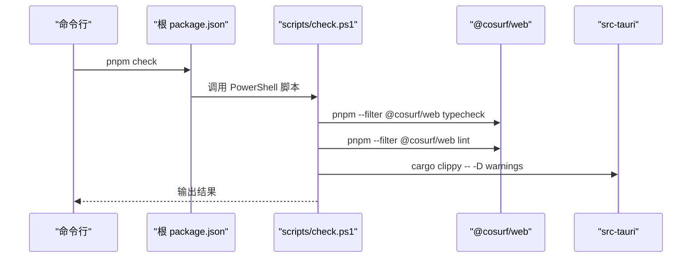
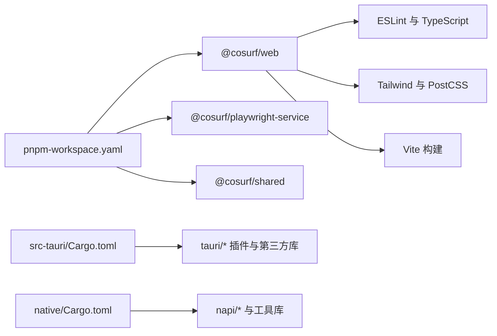

# 代码质量与检查

<cite>
**本文引用的文件**
- [package.json](file://package.json)
- [pnpm-workspace.yaml](file://pnpm-workspace.yaml)
- [scripts/check.ps1](file://scripts/check.ps1)
- [src-web/package.json](file://src-web/package.json)
- [src-web/eslint.config.js](file://src-web/eslint.config.js)
- [src-web/tailwind.config.js](file://src-web/tailwind.config.js)
- [src-web/postcss.config.js](file://src-web/postcss.config.js)
- [src-web/tsconfig.json](file://src-web/tsconfig.json)
- [src-web/vite.config.ts](file://src-web/vite.config.ts)
- [electron/tsconfig.json](file://electron/tsconfig.json)
- [src-tauri/Cargo.toml](file://src-tauri/Cargo.toml)
- [native/Cargo.toml](file://native/Cargo.toml)
- [Cargo.toml](file://Cargo.toml)
- [rust-toolchain.toml](file://rust-toolchain.toml)
- [src-tauri/tauri.conf.json](file://src-tauri/tauri.conf.json)
</cite>

## 目录
1. [简介](#简介)
2. [项目结构](#项目结构)
3. [核心组件](#核心组件)
4. [架构总览](#架构总览)
5. [详细组件分析](#详细组件分析)
6. [依赖分析](#依赖分析)
7. [性能考虑](#性能考虑)
8. [故障排查指南](#故障排查指南)
9. [结论](#结论)
10. [附录](#附录)

## 简介
本指南面向 CoSurf 项目的开发者与维护者，系统化梳理代码质量与检查体系，覆盖以下方面：
- TypeScript 类型检查与构建：通过 tsc 与 Vite 协作保障类型安全与产物正确性
- ESLint 规则与风格：统一前端代码风格与 React Hooks 最佳实践
- Rust Clippy：在 Tauri 与原生模块中启用严格警告级别，提升代码健壮性
- 样式规范：Tailwind 与 PostCSS 配置，确保一致的设计语言与可维护性
- 提交前检查流程：pnpm check 脚本与 PowerShell 组合脚本的执行顺序与作用
- 代码审查标准：PR 模板、审查清单与合并策略建议
- 性能检查与优化：打包体积分析、内存与运行时性能测试方法
- 安全检查：依赖漏洞扫描、安全审计与敏感信息防护
- 质量度量与持续改进：关键指标与改进路径

## 项目结构
CoSurf 采用多包工作区（pnpm workspaces）组织，主要由以下部分构成：
- Web 前端：React + TypeScript + Vite，位于 src-web
- Tauri 应用：桌面端主程序，位于 src-tauri
- 原生模块：Rust 编写的高性能插件，位于 native
- 共享包：跨包复用的通用逻辑，位于 packages/shared
- Playwright 服务：浏览器自动化能力，位于 playwright-service
- 工具脚本：统一的检查与开发脚本，位于 scripts

图表来源
- [package.json:14-29](file://package.json#L14-L29)
- [pnpm-workspace.yaml:1-5](file://pnpm-workspace.yaml#L1-L5)
- [src-web/tsconfig.json:1-8](file://src-web/tsconfig.json#L1-L8)
- [src-web/eslint.config.js:1-29](file://src-web/eslint.config.js#L1-L29)
- [src-web/tailwind.config.js:1-95](file://src-web/tailwind.config.js#L1-L95)
- [src-web/postcss.config.js:1-14](file://src-web/postcss.config.js#L1-L14)
- [src-tauri/Cargo.toml:1-70](file://src-tauri/Cargo.toml#L1-L70)
- [native/Cargo.toml:1-72](file://native/Cargo.toml#L1-L72)

章节来源
- [package.json:14-29](file://package.json#L14-L29)
- [pnpm-workspace.yaml:1-5](file://pnpm-workspace.yaml#L1-L5)

## 核心组件
本节聚焦代码质量相关的核心组件及其职责。

- TypeScript 类型检查与构建
  - Web 前端通过 tsc 与 Vite 协同进行增量编译与最终打包，保证类型安全与产物一致性
  - Electron 主进程与渲染进程分别拥有独立 tsconfig，确保不同运行环境下的类型约束
- ESLint 规则与风格
  - 使用 TypeScript ESLint 推荐规则集，结合 React Hooks 与 React Refresh 插件，强化 React 生态最佳实践
- Rust Clippy
  - 在 Tauri 与原生模块中启用 Clippy，并以“将警告视为错误”的方式强制提升代码质量
- 样式规范
  - Tailwind 与 PostCSS 配置集中管理主题色板、字体族、动画与关键帧，确保设计一致性
- 提交前检查
  - pnpm check 脚本串联类型检查、ESLint 与 Clippy，形成统一的本地质量门禁

章节来源
- [src-web/package.json:7-12](file://src-web/package.json#L7-L12)
- [src-web/tsconfig.json:1-8](file://src-web/tsconfig.json#L1-L8)
- [electron/tsconfig.json:1-25](file://electron/tsconfig.json#L1-L25)
- [src-web/eslint.config.js:1-29](file://src-web/eslint.config.js#L1-L29)
- [scripts/check.ps1:1-17](file://scripts/check.ps1#L1-L17)
- [src-web/tailwind.config.js:1-95](file://src-web/tailwind.config.js#L1-L95)
- [src-web/postcss.config.js:1-14](file://src-web/postcss.config.js#L1-L14)

## 架构总览
下图展示从提交到构建的关键质量检查链路，涵盖前端类型检查、ESLint、Rust Clippy 以及 Tauri 打包前的准备。

图表来源
- [scripts/check.ps1:5-14](file://scripts/check.ps1#L5-L14)
- [package.json:25](file://package.json#L25)
- [src-tauri/tauri.conf.json:6-10](file://src-tauri/tauri.conf.json#L6-L10)

## 详细组件分析

### TypeScript 类型检查与构建
- Web 前端
  - 使用 tsc -b 进行增量构建，随后由 Vite 执行最终打包，确保类型安全与产物优化
  - tsconfig.json 通过 references 将应用与 Node 环境配置拆分，便于隔离与复用
- Electron
  - 主进程与预加载脚本各自拥有独立 tsconfig，分别约束 CommonJS 与 DOM/Node 环境差异
- Tauri 与原生模块
  - 通过 Cargo.toml 管理依赖与发布配置，配合 rust-toolchain.toml 固定工具链版本，确保 Clippy 与格式化工具可用

图表来源
- [src-web/package.json:10-11](file://src-web/package.json#L10-L11)
- [src-web/tsconfig.json:1-8](file://src-web/tsconfig.json#L1-L8)
- [electron/tsconfig.json:1-25](file://electron/tsconfig.json#L1-L25)

章节来源
- [src-web/package.json:7-12](file://src-web/package.json#L7-L12)
- [src-web/tsconfig.json:1-8](file://src-web/tsconfig.json#L1-L8)
- [electron/tsconfig.json:1-25](file://electron/tsconfig.json#L1-L25)

### ESLint 规则与风格
- 规则集
  - 基于 TypeScript ESLint 推荐规则，启用 React Hooks 推荐规则与 React Refresh 限制，减少常见问题
- 文件范围
  - 仅对 .ts/.tsx 文件生效，忽略 dist 输出目录
- 语言环境
  - 默认浏览器全局变量，避免误报与漏报

图表来源
- [src-web/eslint.config.js:7-28](file://src-web/eslint.config.js#L7-L28)
- [src-web/package.json:10](file://src-web/package.json#L10)

章节来源
- [src-web/eslint.config.js:1-29](file://src-web/eslint.config.js#L1-L29)
- [src-web/package.json:10](file://src-web/package.json#L10)

### Rust Clippy 使用与配置
- 工具链
  - rust-toolchain.toml 明确安装 clippy 与 rustfmt，确保团队工具链一致
- 执行位置
  - Tauri 与原生模块分别在对应 Cargo.toml 中进行依赖与特性管理；检查流程通过脚本在 src-tauri 目录下执行 cargo clippy 并将警告视为错误
- 产物优化
  - 通过工作区 Cargo.toml 与各 crate Cargo.toml 的 profile.release 配置，启用 LTO、优化等级与符号裁剪，兼顾体积与性能

图表来源
- [scripts/check.ps1:11-14](file://scripts/check.ps1#L11-L14)
- [rust-toolchain.toml:1-4](file://rust-toolchain.toml#L1-L4)
- [Cargo.toml:23-29](file://Cargo.toml#L23-L29)
- [src-tauri/Cargo.toml:68-72](file://src-tauri/Cargo.toml#L68-L72)
- [native/Cargo.toml:68-72](file://native/Cargo.toml#L68-L72)

章节来源
- [scripts/check.ps1:1-17](file://scripts/check.ps1#L1-L17)
- [rust-toolchain.toml:1-4](file://rust-toolchain.toml#L1-L4)
- [Cargo.toml:23-29](file://Cargo.toml#L23-L29)
- [src-tauri/Cargo.toml:68-72](file://src-tauri/Cargo.toml#L68-L72)
- [native/Cargo.toml:68-72](file://native/Cargo.toml#L68-L72)

### 样式规范与 Tailwind 配置
- Tailwind 配置
  - 内容扫描范围覆盖 HTML 与源码目录，确保未使用的类名被移除
  - 主题扩展包括品牌色板、表面与边框、内容色、字体族、动画与关键帧，统一视觉语言
- PostCSS 集成
  - 自动注入 Tailwind 与 Autoprefixer，简化构建流程
- Vite 集成
  - 通过 Vite 配置启用 HMR 与环境变量前缀，屏蔽无关目录监听

图表来源
- [src-web/tailwind.config.js:7-94](file://src-web/tailwind.config.js#L7-L94)
- [src-web/postcss.config.js:6-13](file://src-web/postcss.config.js#L6-L13)
- [src-web/vite.config.ts:14-35](file://src-web/vite.config.ts#L14-L35)

章节来源
- [src-web/tailwind.config.js:1-95](file://src-web/tailwind.config.js#L1-L95)
- [src-web/postcss.config.js:1-14](file://src-web/postcss.config.js#L1-L14)
- [src-web/vite.config.ts:1-36](file://src-web/vite.config.ts#L1-L36)

### 提交前检查流程（pnpm check）
- 脚本入口
  - 根目录 package.json 定义了 check 脚本，调用 PowerShell 脚本执行统一检查
- 检查顺序
  1) TypeScript 类型检查
  2) ESLint 风格检查
  3) Rust Clippy 检查（在 src-tauri 目录执行）
- 行为特征
  - 任一环节失败即终止，确保问题在本地被及时发现

图表来源
- [package.json:25](file://package.json#L25)
- [scripts/check.ps1:5-14](file://scripts/check.ps1#L5-L14)

章节来源
- [package.json:25](file://package.json#L25)
- [scripts/check.ps1:1-17](file://scripts/check.ps1#L1-L17)

### 代码审查标准与流程
- PR 模板建议
  - 标题：简明描述变更目的与范围
  - 摘要：概述变更动机、影响面与风险点
  - 测试：列出新增/修改的测试用例与验证方法
  - 性能：是否引入性能回归，如何评估
  - 安全：是否涉及敏感数据或权限变更
  - 文档：是否需要更新设计文档或用户手册
- 审查清单
  - 代码风格：ESLint 与 Tailwind 使用是否符合规范
  - 类型安全：TypeScript 是否无未处理的 any 或潜在错误
  - Rust 代码：Clippy 是否通过，是否存在不安全用法
  - 可维护性：复杂度、命名、注释是否清晰
  - 兼容性：对现有功能是否有破坏性变更
- 合并策略
  - 至少一名维护者批准
  - CI 通过（含 pnpm check）
  - 无未解决评论
  - Squash 或 Rebase 合并，保持历史整洁

[本节为通用实践建议，不直接分析具体文件，故无章节来源]

## 依赖分析
- 工作区与包管理
  - pnpm-workspace.yaml 声明 src-web、playwright-service 与 packages/* 为工作区成员，实现跨包依赖与统一脚本
- 前端依赖
  - src-web/package.json 明确 ESLint、Tailwind、TypeScript 与 Vite 版本，确保团队一致性
- Rust 依赖
  - src-tauri 与 native 的 Cargo.toml 管理 Tauri 插件、HTTP 客户端、数据库与图像处理等依赖，统一通过工作区 Cargo.toml 的 workspace.dependencies 进行版本对齐

图表来源
- [pnpm-workspace.yaml:1-5](file://pnpm-workspace.yaml#L1-L5)
- [src-web/package.json:27-42](file://src-web/package.json#L27-L42)
- [src-tauri/Cargo.toml:21-70](file://src-tauri/Cargo.toml#L21-L70)
- [native/Cargo.toml:11-72](file://native/Cargo.toml#L11-L72)

章节来源
- [pnpm-workspace.yaml:1-5](file://pnpm-workspace.yaml#L1-L5)
- [src-web/package.json:27-42](file://src-web/package.json#L27-L42)
- [src-tauri/Cargo.toml:1-70](file://src-tauri/Cargo.toml#L1-L70)
- [native/Cargo.toml:1-72](file://native/Cargo.toml#L1-L72)

## 性能考虑
- 打包体积分析
  - 使用 Vite 的构建产物与 sourcemap（可通过环境变量控制）进行体积分析，识别大依赖与重复模块
  - 结合浏览器性能面板与网络面板，定位首屏加载瓶颈
- 内存使用监控
  - 在 Electron/Chromium 环境下启用内存快照与堆分析，关注页面缓存、消息流与截图处理的内存峰值
- 运行时性能测试
  - 对 AI 技能执行、页面摘要与搜索等关键路径进行基准测试，记录吞吐与延迟
- Rust 优化
  - 启用 LTO、优化等级与符号裁剪，减少二进制体积与启动时间
  - 对高并发场景使用 tokio 的异步运行时，避免阻塞主线程

[本节提供通用指导，不直接分析具体文件，故无章节来源]

## 故障排查指南
- TypeScript 类型检查失败
  - 检查 tsconfig.references 与 tsc -b 的增量构建状态
  - 关注未声明的模块或缺失的类型定义
- ESLint 报错
  - 根据规则提示修正命名、Hook 使用与刷新策略
  - 忽略特定文件需谨慎，优先通过配置修复
- Clippy 警告
  - 将警告视为错误，逐条修复；对不可规避的场景使用 #[allow(clippy::...)] 注解并附注说明
- Tailwind 样式未生效
  - 确认 tailwind.config.js 的 content 路径包含目标文件
  - 清理构建缓存后重试
- Tauri 构建异常
  - 检查 tauri.conf.json 的 beforeBuildCommand 与前端构建产物路径
  - 确保 Rust 工具链版本与 rust-toolchain.toml 一致

章节来源
- [src-web/tsconfig.json:1-8](file://src-web/tsconfig.json#L1-L8)
- [src-web/eslint.config.js:20-26](file://src-web/eslint.config.js#L20-L26)
- [scripts/check.ps1:11-14](file://scripts/check.ps1#L11-L14)
- [src-web/tailwind.config.js:9-12](file://src-web/tailwind.config.js#L9-L12)
- [src-tauri/tauri.conf.json:6-10](file://src-tauri/tauri.conf.json#L6-L10)
- [rust-toolchain.toml:1-4](file://rust-toolchain.toml#L1-L4)

## 结论
通过统一的脚本化检查流程（pnpm check）、严格的 ESLint 与 Clippy 配置、完善的 TypeScript 与 Tailwind 管理，CoSurf 在前端、Rust 与桌面端构建层面建立了坚实的质量基线。建议持续：
- 将 pnpm check 纳入 CI，作为合并前置条件
- 定期回顾与微调 ESLint 与 Clippy 规则，平衡严格性与开发效率
- 建立性能回归检测机制，结合实际业务路径进行基准测试
- 强化安全审计与依赖扫描，确保供应链安全

[本节为总结性内容，不直接分析具体文件，故无章节来源]

## 附录
- 常用命令速查
  - 运行统一检查：pnpm check
  - 前端类型检查：pnpm --filter @cosurf/web typecheck
  - 前端 ESLint：pnpm --filter @cosurf/web lint
  - Rust Clippy：在 src-tauri 目录执行 cargo clippy -- -D warnings
  - 开发模式：pnpm dev 或 pnpm dev:tauri
  - 构建模式：pnpm build 或 pnpm build:tauri
- 质量度量指标建议
  - ESLint 规则违规数量趋势
  - TypeScript 未使用/未处理错误数量
  - Clippy 警告数量与修复周期
  - 包体大小与关键路径加载时间
  - 安全依赖漏洞扫描覆盖率与修复率

[本节为参考性内容，不直接分析具体文件，故无章节来源]