# 原生模块开发指南

<cite>
**本文档引用的文件**
- [Cargo.toml](file://native/Cargo.toml)
- [lib.rs](file://native/src/lib.rs)
- [build.rs](file://native/build.rs)
- [main.ts](file://electron/main.ts)
- [ipc-handlers.ts](file://electron/ipc-handlers.ts)
- [mod.rs](file://native/src/db/mod.rs)
- [screenshot.rs](file://native/src/screenshot.rs)
- [cache.rs](file://native/src/cache.rs)
- [agent.rs](file://native/src/ai/agent.rs)
- [tools.rs](file://native/src/ai/tools.rs)
- [error.rs](file://native/src/error.rs)
- [build.ps1](file://scripts/build.ps1)
- [README.md](file://README.md)
- [check_native_exports.js](file://check_native_exports.js)
</cite>

## 目录
1. [简介](#简介)
2. [项目结构](#项目结构)
3. [核心组件](#核心组件)
4. [架构概览](#架构概览)
5. [详细组件分析](#详细组件分析)
6. [依赖关系分析](#依赖关系分析)
7. [性能考虑](#性能考虑)
8. [故障排除指南](#故障排除指南)
9. [结论](#结论)

## 简介

CoSurf 是一个基于 Electron 的 AI 阅读伴侣桌面应用程序，采用 Rust 原生模块提供高性能计算能力。该原生模块通过 N-API 框架为 JavaScript 提供底层功能，包括 SQLite 数据库操作、AI Agent 调度、技能管理、截图功能和页面缓存等核心功能。

该项目展现了现代桌面应用开发的最佳实践，结合了前端 React 技术栈与后端 Rust 引擎的优势，为用户提供流畅的 AI 阅读体验。

## 项目结构

CoSurf 项目采用模块化的组织方式，主要分为以下几个核心部分：

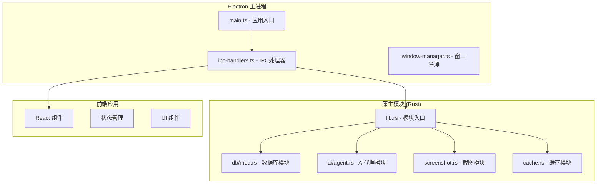

**图表来源**
- [main.ts:1-236](file://electron/main.ts#L1-L236)
- [lib.rs:1-126](file://native/src/lib.rs#L1-L126)

**章节来源**
- [README.md:213-326](file://README.md#L213-L326)

## 核心组件

### 原生模块初始化流程

原生模块通过 `native_init` 函数进行初始化，该函数负责设置日志系统、初始化数据库、配置技能管理器和缓存系统。

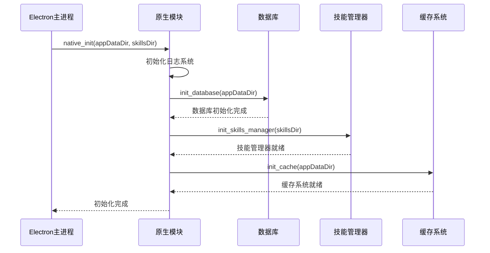

**图表来源**
- [lib.rs:27-97](file://native/src/lib.rs#L27-L97)

### 数据库模块设计

数据库模块采用模块化设计，支持多种数据表操作，包括对话、消息、书签、历史记录等。

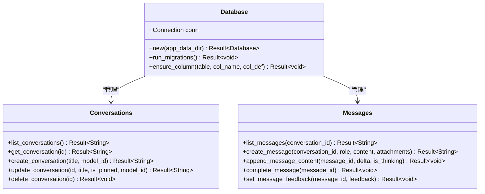

**图表来源**
- [mod.rs:39-250](file://native/src/db/mod.rs#L39-L250)

**章节来源**
- [lib.rs:15-19](file://native/src/lib.rs#L15-L19)
- [mod.rs:260-518](file://native/src/db/mod.rs#L260-L518)

## 架构概览

CoSurf 采用了分层架构设计，确保各组件之间的职责清晰分离：

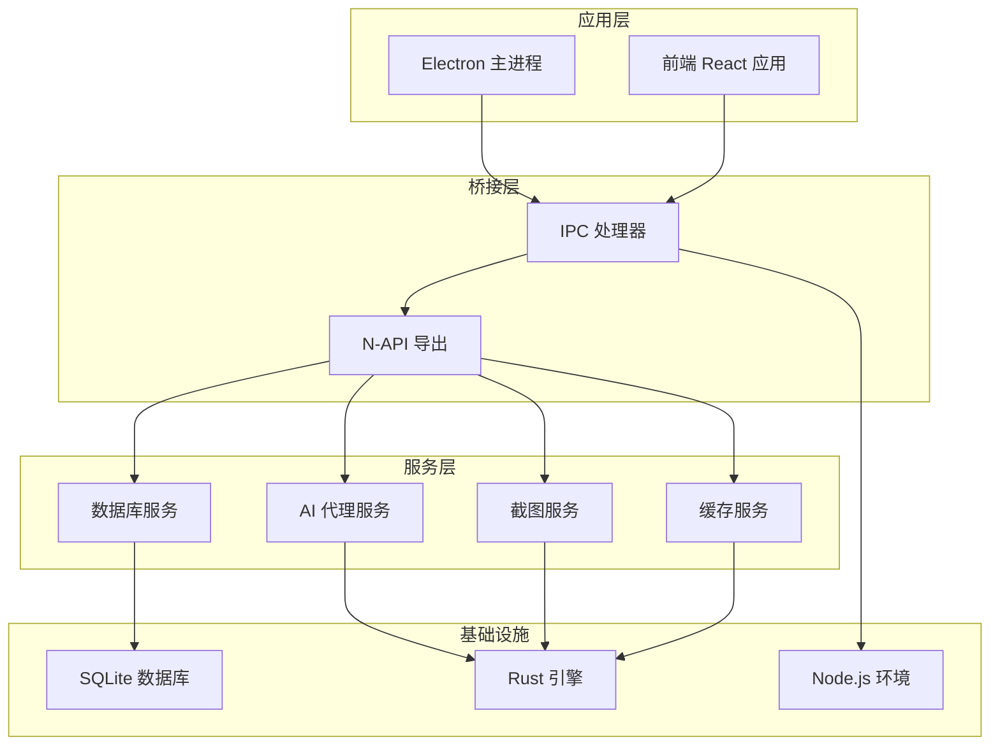

**图表来源**
- [main.ts:94-114](file://electron/main.ts#L94-L114)
- [ipc-handlers.ts:48-527](file://electron/ipc-handlers.ts#L48-L527)

## 详细组件分析

### AI 代理模块

AI 代理模块是整个系统的核心，负责处理流式对话、工具调用和 Agent Loop 执行。

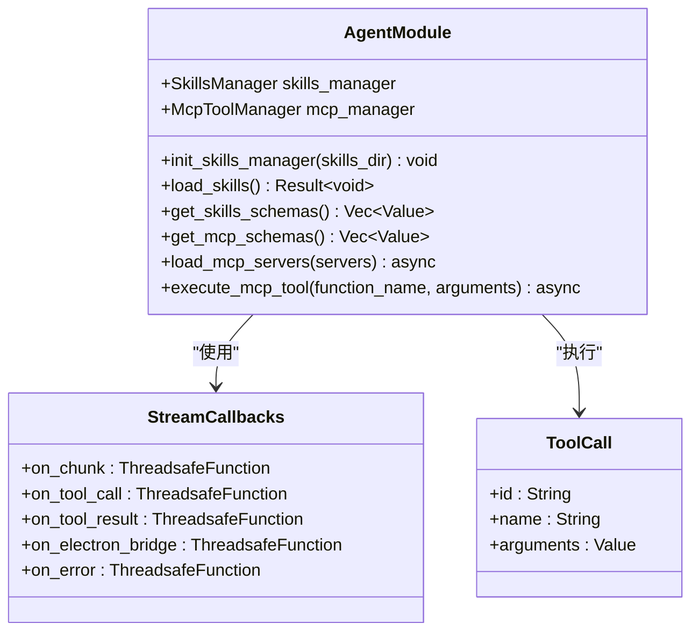

**图表来源**
- [agent.rs:18-102](file://native/src/ai/agent.rs#L18-L102)

#### 流式对话处理流程

AI 代理模块实现了复杂的流式对话处理机制，支持多轮对话和工具调用：

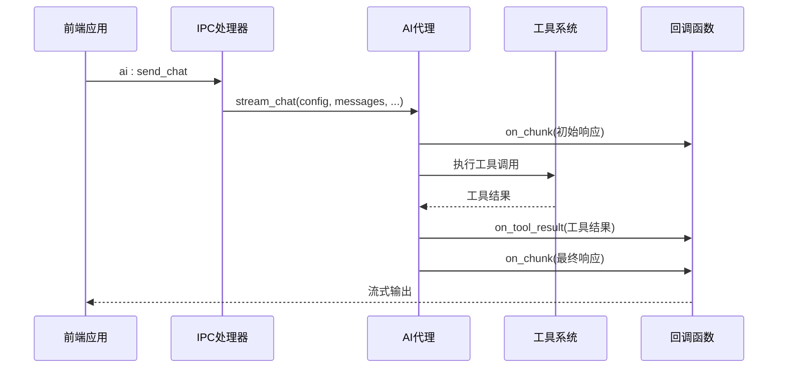

**图表来源**
- [agent.rs:115-176](file://native/src/ai/agent.rs#L115-L176)
- [ipc-handlers.ts:233-317](file://electron/ipc-handlers.ts#L233-L317)

**章节来源**
- [agent.rs:108-200](file://native/src/ai/agent.rs#L108-L200)
- [tools.rs:136-154](file://native/src/ai/tools.rs#L136-L154)

### 截图功能模块

截图模块提供了完整的屏幕截图解决方案，支持全屏截图、区域裁剪和多种输出格式。

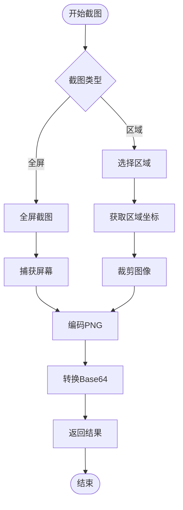

**图表来源**
- [screenshot.rs:11-40](file://native/src/screenshot.rs#L11-L40)

#### 截图功能实现细节

截图模块使用了多个第三方库来实现完整的功能：

- **xcap**: 屏幕捕获
- **image**: 图像处理和编码
- **base64**: Base64 编码
- **arboard**: 剪贴板操作

**章节来源**
- [screenshot.rs:1-129](file://native/src/screenshot.rs#L1-L129)

### 页面缓存模块

页面缓存模块提供了高效的文件缓存机制，使用 SHA256 哈希作为文件名，支持过期清理功能。

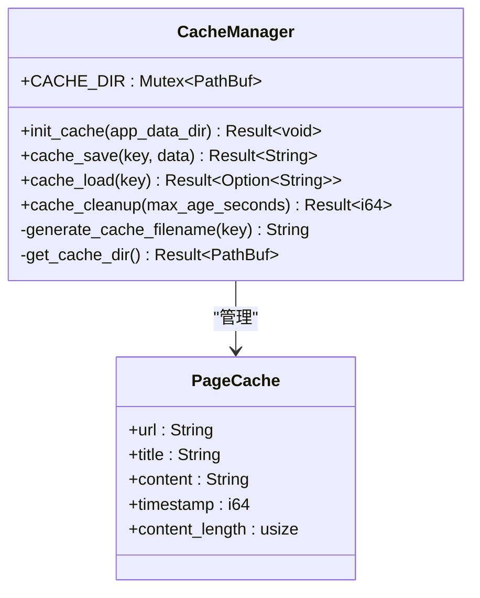

**图表来源**
- [cache.rs:20-158](file://native/src/cache.rs#L20-L158)

**章节来源**
- [cache.rs:29-158](file://native/src/cache.rs#L29-L158)

## 依赖关系分析

### Rust 依赖管理

原生模块使用 Cargo 进行依赖管理，主要依赖包括：

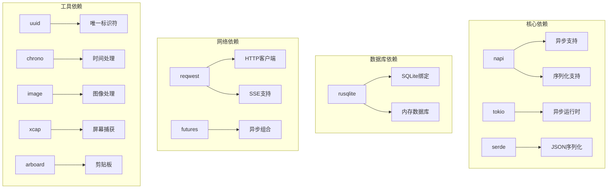

**图表来源**
- [Cargo.toml:11-66](file://native/Cargo.toml#L11-L66)

### 构建系统配置

项目使用 napi-build 进行原生模块构建，支持多种平台和架构：

**章节来源**
- [Cargo.toml:1-72](file://native/Cargo.toml#L1-L72)
- [build.rs:1-6](file://native/build.rs#L1-L6)

## 性能考虑

### 内存管理优化

原生模块采用了多种内存管理策略来确保高性能运行：

1. **懒加载**: 使用 `lazy_static` 实现延迟初始化
2. **连接池**: 数据库连接使用 `Mutex` 进行安全访问
3. **异步处理**: 使用 Tokio 运行时处理并发操作
4. **缓存策略**: 页面缓存使用 SHA256 哈希避免重复计算

### 线程安全设计

模块间通信采用了线程安全的设计模式：

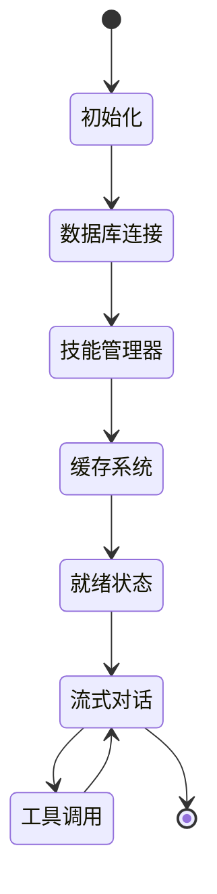

**图表来源**
- [lib.rs:28-97](file://native/src/lib.rs#L28-L97)

## 故障排除指南

### 常见问题诊断

#### 原生模块加载失败

当原生模块无法加载时，可以通过以下方式进行诊断：

1. **检查模块文件**: 确认 `cosurf-native.node` 文件存在
2. **验证依赖**: 使用 `check_native_exports.js` 检查导出的方法
3. **查看日志**: 检查 Electron 主进程的日志输出

#### 数据库连接问题

如果遇到数据库连接问题，可以检查：

1. **权限问题**: 确认应用数据目录的写入权限
2. **文件锁定**: 检查是否有其他进程占用数据库文件
3. **迁移失败**: 查看数据库迁移日志

**章节来源**
- [check_native_exports.js:1-24](file://check_native_exports.js#L1-L24)

### 错误处理机制

原生模块实现了完善的错误处理机制：

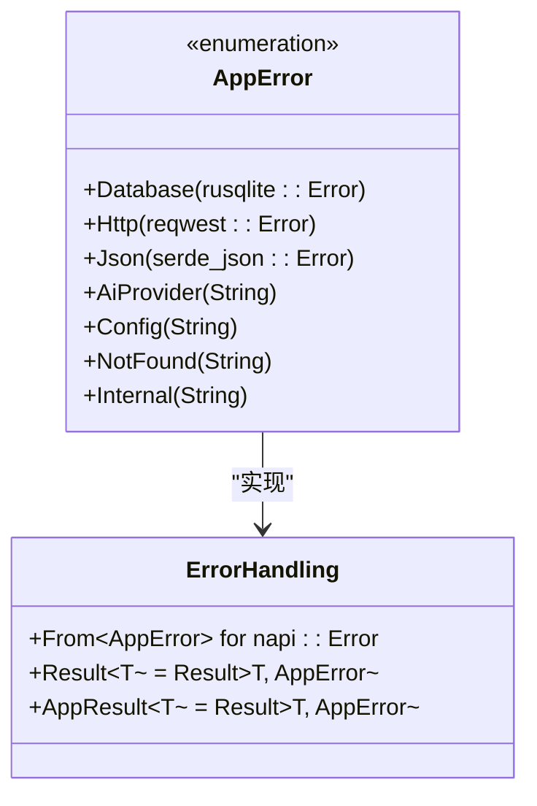

**图表来源**
- [error.rs:5-37](file://native/src/error.rs#L5-L37)

**章节来源**
- [error.rs:1-37](file://native/src/error.rs#L1-L37)

## 结论

CoSurf 的原生模块开发展现了现代桌面应用开发的最佳实践。通过精心设计的模块化架构、完善的错误处理机制和高性能的实现方案，该模块为 Electron 应用提供了强大的底层支持。

### 主要优势

1. **高性能**: Rust 原生代码提供了卓越的性能表现
2. **类型安全**: 强类型的 Rust 代码减少了运行时错误
3. **模块化设计**: 清晰的模块边界便于维护和扩展
4. **跨平台支持**: 通过 N-API 实现了良好的跨平台兼容性

### 未来发展方向

1. **功能扩展**: 可以添加更多 AI 工具和技能
2. **性能优化**: 进一步优化内存使用和处理速度
3. **安全性增强**: 加强输入验证和安全防护
4. **用户体验改进**: 提供更好的错误提示和调试工具

该原生模块为类似的桌面 AI 应用开发提供了优秀的参考模板，展示了如何有效地结合前端技术和后端引擎来构建高质量的应用程序。