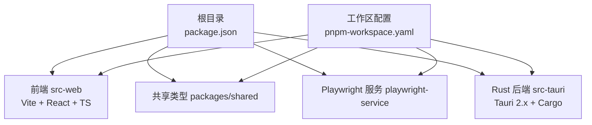
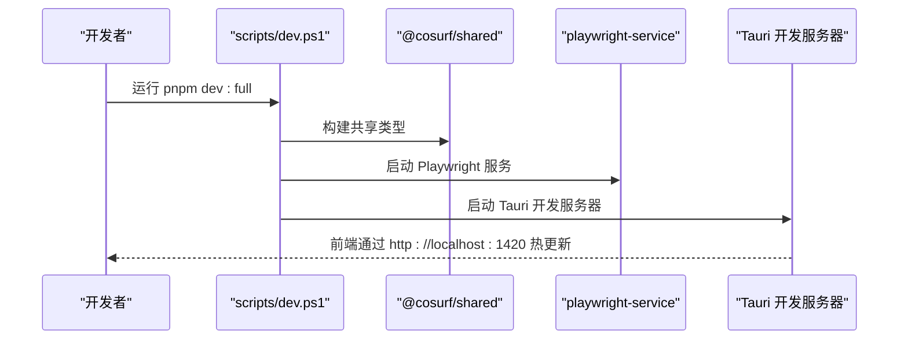
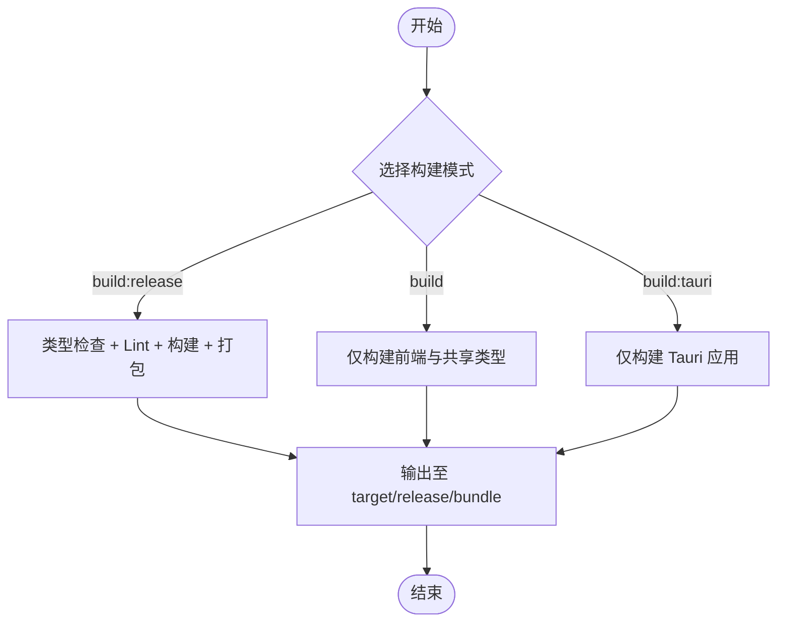
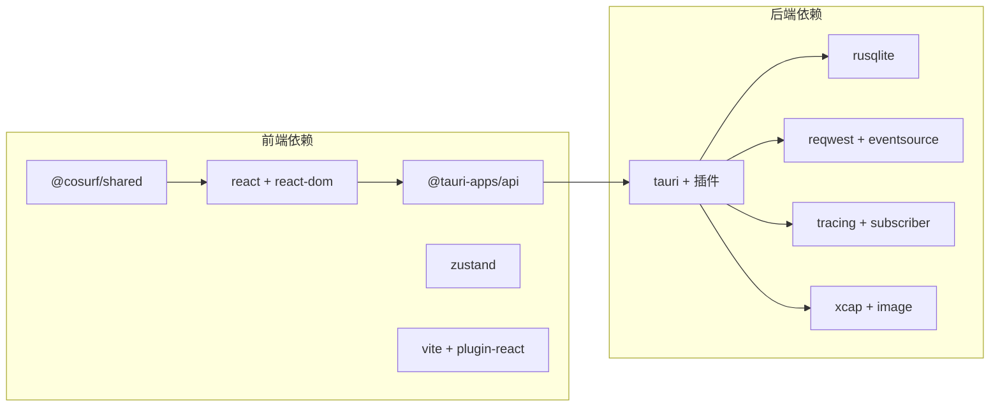

# 开发指南

<cite>
**本文引用的文件**
- [package.json](file://package.json)
- [pnpm-workspace.yaml](file://pnpm-workspace.yaml)
- [README.md](file://README.md)
- [scripts/dev.ps1](file://scripts/dev.ps1)
- [scripts/build.ps1](file://scripts/build.ps1)
- [scripts/check.ps1](file://scripts/check.ps1)
- [src-web/package.json](file://src-web/package.json)
- [src-web/vite.config.ts](file://src-web/vite.config.ts)
- [src-web/tsconfig.json](file://src-web/tsconfig.json)
- [src-tauri/Cargo.toml](file://src-tauri/Cargo.toml)
- [src-tauri/tauri.conf.json](file://src-tauri/tauri.conf.json)
- [src-tauri/src/lib.rs](file://src-tauri/src/lib.rs)
- [src-tauri/src/main.rs](file://src-tauri/src/main.rs)
- [src-tauri/src/state.rs](file://src-tauri/src/state.rs)
- [src-tauri/src/error.rs](file://src-tauri/src/error.rs)
</cite>

## 目录
1. [简介](#简介)
2. [项目结构](#项目结构)
3. [核心组件](#核心组件)
4. [架构总览](#架构总览)
5. [详细组件分析](#详细组件分析)
6. [依赖关系分析](#依赖关系分析)
7. [性能考虑](#性能考虑)
8. [故障排查指南](#故障排查指南)
9. [结论](#结论)
10. [附录](#附录)

## 简介
本指南面向 CoSurf 项目的开发者，覆盖开发环境搭建、开发模式与调试、构建与发布、代码质量检查、贡献流程以及常见问题排查。CoSurf 是一款基于 Tauri 2.x + Rust 后端、React + TypeScript 前端的桌面应用，具备 AI Agent Loop、MCP 协议集成、流式对话、页面上下文感知与浏览器自动化等能力。

## 项目结构
- 工作区采用 pnpm workspace，包含前端、共享类型、Playwright 服务与 Rust 后端。
- 前端位于 src-web，使用 Vite 6 + React 18 + TypeScript；后端位于 src-tauri，使用 Tauri 2.x + Rust。
- 顶层脚本提供开发、构建与全量检查流程。



图表来源
- [package.json:14-30](file://package.json#L14-L30)
- [pnpm-workspace.yaml:1-5](file://pnpm-workspace.yaml#L1-L5)

章节来源
- [package.json:14-30](file://package.json#L14-L30)
- [pnpm-workspace.yaml:1-5](file://pnpm-workspace.yaml#L1-L5)
- [README.md:213-328](file://README.md#L213-L328)

## 核心组件
- 前端（src-web）：React + TypeScript + Vite，负责 UI、状态管理（Zustand）、与后端通过 Tauri 命令交互。
- 后端（src-tauri）：Tauri + Rust，提供命令接口、AI 能力（Agent Loop、MCP、工具调度）、数据库（SQLite）、页面上下文与截图等能力。
- 共享类型（packages/shared）：跨前端与后端的类型定义，确保前后端契约一致。
- Playwright 服务（playwright-service）：可选的浏览器自动化服务，支持与 AI Agent 协同。

章节来源
- [src-web/package.json:1-44](file://src-web/package.json#L1-L44)
- [src-tauri/Cargo.toml:1-70](file://src-tauri/Cargo.toml#L1-L70)
- [README.md:305-328](file://README.md#L305-L328)

## 架构总览
CoSurf 采用“前端（React/Vite）+ 后端（Tauri/Rust）”的桌面应用架构。前端通过 Tauri 暴露的命令与后端交互，后端通过 SQLite 存储数据，并通过 AI 模型与 MCP 服务协作完成复杂任务。

```mermaid
graph TB
subgraph "前端src-web"
FE["React 应用<br/>Vite 开发服务器"]
end
subgraph "后端src-tauri"
TAURI["Tauri 应用"]
RUST["Rust 命令与 AI 模块"]
DB["SQLite 数据库"]
end
FE <- --> |"Tauri 命令调用"| TAURI
TAURI --> RUST
RUST --> DB
```

图表来源
- [src-tauri/tauri.conf.json:6-11](file://src-tauri/tauri.conf.json#L6-L11)
- [src-tauri/src/lib.rs:108-214](file://src-tauri/src/lib.rs#L108-L214)

章节来源
- [src-tauri/tauri.conf.json:6-11](file://src-tauri/tauri.conf.json#L6-L11)
- [src-tauri/src/lib.rs:108-214](file://src-tauri/src/lib.rs#L108-L214)

## 详细组件分析

### 开发环境搭建
- 环境要求
  - Node.js >= 20.0.0
  - pnpm >= 9.0.0
  - Rust >= 1.88.0（Tauri 会自动安装）
  - Windows 10/11（WebView2 已内置）
- 安装步骤
  - 克隆仓库并安装依赖：pnpm install
  - 首次使用：pnpm dev:full 启动完整开发环境（共享类型构建、Playwright 服务、Tauri 开发服务器）

章节来源
- [README.md:119-137](file://README.md#L119-L137)
- [README.md:144-149](file://README.md#L144-L149)
- [scripts/dev.ps1:5-12](file://scripts/dev.ps1#L5-L12)

### 开发模式与差异
- pnpm dev：仅启动前端 Vite 开发服务器（端口 1420），适合纯前端开发。
- pnpm dev:tauri：启动 Tauri 开发服务器，前端通过 devUrl 访问 localhost:1420。
- pnpm dev:full：完整开发模式，按顺序执行：
  1) 构建共享类型
  2) 启动 Playwright 服务
  3) 启动 Tauri 开发服务器



图表来源
- [scripts/dev.ps1:5-12](file://scripts/dev.ps1#L5-L12)
- [src-tauri/tauri.conf.json:9-10](file://src-tauri/tauri.conf.json#L9-L10)

章节来源
- [README.md:170-180](file://README.md#L170-L180)
- [scripts/dev.ps1:5-12](file://scripts/dev.ps1#L5-L12)
- [src-web/vite.config.ts:14-28](file://src-web/vite.config.ts#L14-L28)

### 调试技巧
- 前端调试
  - 打开开发者工具：Ctrl + Shift + I
  - 流式输出日志：控制台搜索 “[ConversationStore]”
  - AIPanel 渲染日志：搜索 “[AIPanel]”
- 后端调试
  - 设置 RUST_LOG=debug 查看详细日志
  - Agent Loop 日志：搜索 “Agent Loop iteration”
  - 工具执行日志：搜索 “Found X tool calls”
  - MCP 通信日志：搜索 “MCP tool call response”
  - 数据库：使用 DB Browser for SQLite 查看数据

章节来源
- [README.md:534-546](file://README.md#L534-L546)

### 构建与发布
- pnpm build:release：完整构建（包含类型检查与 Lint），随后使用 electron-builder 打包。
- pnpm build：仅构建前端与共享类型，不进行全量检查。
- pnpm build:tauri：使用 Tauri CLI 构建桌面应用。
- 输出产物位于 src-tauri/target/release/bundle/，包含 NSIS 安装包与 MSI 安装包。



图表来源
- [package.json:18-20](file://package.json#L18-L20)
- [scripts/build.ps1:57-74](file://scripts/build.ps1#L57-L74)

章节来源
- [README.md:187-202](file://README.md#L187-L202)
- [package.json:18-20](file://package.json#L18-L20)
- [scripts/build.ps1:57-74](file://scripts/build.ps1#L57-L74)

### 代码检查与质量保证
- pnpm check：执行全量检查，依次为 TypeScript 类型检查、ESLint、Rust Clippy。
- 建议在提交前运行 pnpm check，确保质量。

章节来源
- [README.md:204-211](file://README.md#L204-L211)
- [scripts/check.ps1:5-14](file://scripts/check.ps1#L5-L14)

### 贡献指南
- Fork 流程：Fork 仓库后创建特性分支。
- 分支管理：以 feature/ 开头的分支命名。
- 提交规范：遵循 Conventional Commits。
- Pull Request 流程：在 Fork 分支上提交更改并发起 PR。
- 质量要求：提交前运行 pnpm check。

章节来源
- [README.md:576-597](file://README.md#L576-L597)

## 依赖关系分析
- 前端依赖
  - @cosurf/shared：共享类型
  - @tauri-apps/api：Tauri API 封装
  - react、react-dom、zustand：UI 与状态管理
  - vite、@vitejs/plugin-react：构建与开发服务器
- 后端依赖
  - tauri、tauri-plugin-*：桌面框架与插件
  - rusqlite：SQLite 数据库
  - reqwest、reqwest-eventsource：HTTP 与 SSE
  - tracing/tracing-subscriber：日志
  - xcap/image：截图
  - serde、tokio、futures 等：序列化、异步与工具



图表来源
- [src-web/package.json:14-26](file://src-web/package.json#L14-L26)
- [src-tauri/Cargo.toml:21-70](file://src-tauri/Cargo.toml#L21-L70)

章节来源
- [src-web/package.json:14-26](file://src-web/package.json#L14-L26)
- [src-tauri/Cargo.toml:21-70](file://src-tauri/Cargo.toml#L21-L70)

## 性能考虑
- 前端
  - Vite 以 esbuild 作为最小化器，生产构建目标为 chrome120，兼顾兼容性与体积。
  - 通过 sourcemap 控制调试成本（VITE_DEBUG 控制）。
- 后端
  - 使用 tokio 异步运行时，合理拆分任务避免阻塞主线程。
  - 日志通过 tracing-subscriber 控制级别，避免在生产环境产生过多开销。
- 数据库
  - SQLite 事务批处理与索引设计有助于提升查询与写入性能。
- 流式输出
  - SSE 流式响应减少等待时间，提升用户体验。

章节来源
- [src-web/vite.config.ts:30-34](file://src-web/vite.config.ts#L30-L34)
- [src-tauri/src/lib.rs:17-21](file://src-tauri/src/lib.rs#L17-L21)

## 故障排查指南
- 端口冲突
  - 若 1420 端口被占用，可在 src-web/vite.config.ts 中修改 server.port。
- WebView2 问题
  - 确保 Windows 已安装最新版本的 WebView2 Runtime。
- Rust 编译失败
  - 关闭所有 CoSurf 进程后再重试，避免旧进程锁定可执行文件。
- MCP 工具调用无结果
  - 检查 MCP Server 是否正常运行及设置中的连接参数是否正确。
- 日志定位
  - RUST_LOG=debug 查看详细日志
  - Agent Loop：搜索 “Agent Loop iteration”
  - 工具调用：搜索 “Found X tool calls”
  - MCP 通信：搜索 “MCP tool call response”

章节来源
- [README.md:548-556](file://README.md#L548-L556)
- [README.md:534-546](file://README.md#L534-L546)
- [src-web/vite.config.ts:14-28](file://src-web/vite.config.ts#L14-L28)

## 结论
本指南提供了 CoSurf 从环境搭建到开发、调试、构建、发布与质量保障的全流程说明。建议在开发过程中结合前端与后端日志定位问题，并在提交前执行全量检查，确保代码质量与稳定性。

## 附录

### 常用命令速查
- 开发
  - pnpm dev：前端开发服务器
  - pnpm dev:tauri：Tauri 开发服务器
  - pnpm dev:full：完整开发模式
- 构建
  - pnpm build：仅构建前端与共享类型
  - pnpm build:tauri：构建 Tauri 应用
  - pnpm build:release：完整构建并打包
- 质量
  - pnpm check：TypeScript 类型检查 + ESLint + Cargo Clippy
  - pnpm lint/typecheck：前端 Lint 与类型检查

章节来源
- [package.json:14-29](file://package.json#L14-L29)
- [scripts/check.ps1:5-14](file://scripts/check.ps1#L5-L14)
- [src-web/package.json:7-12](file://src-web/package.json#L7-L12)