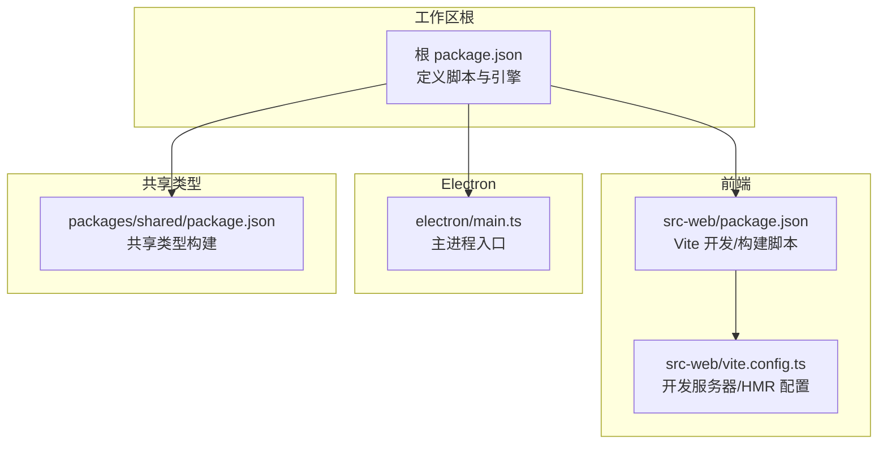
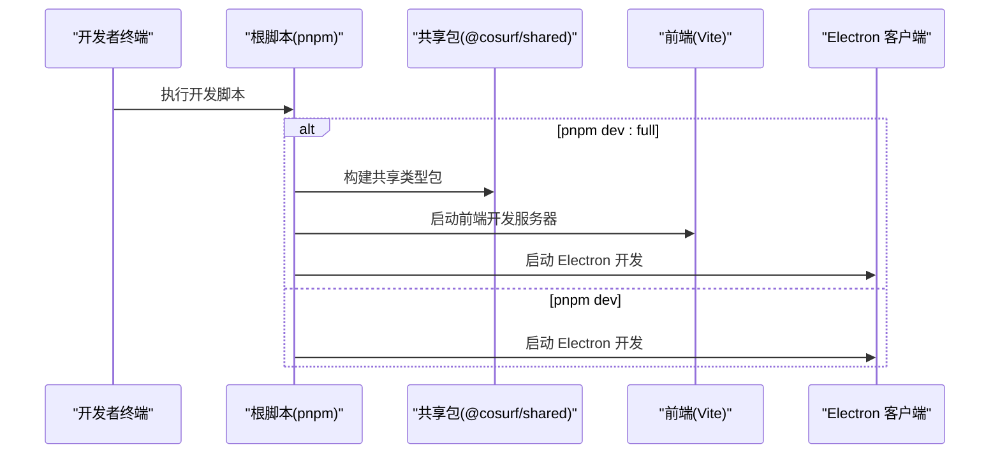
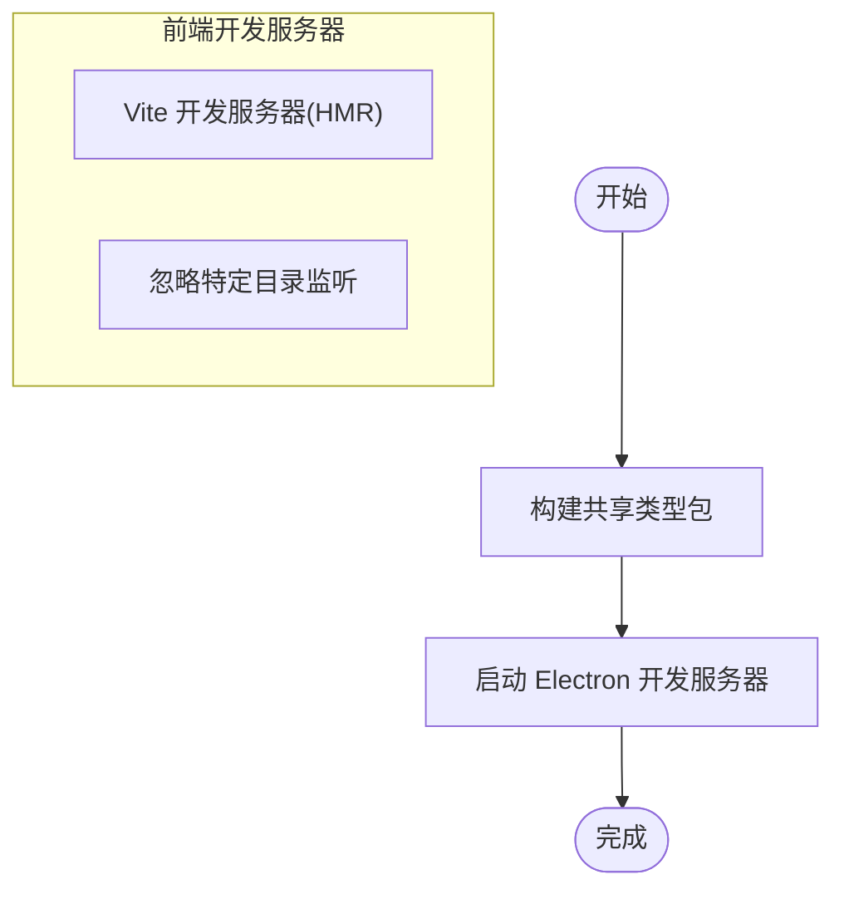
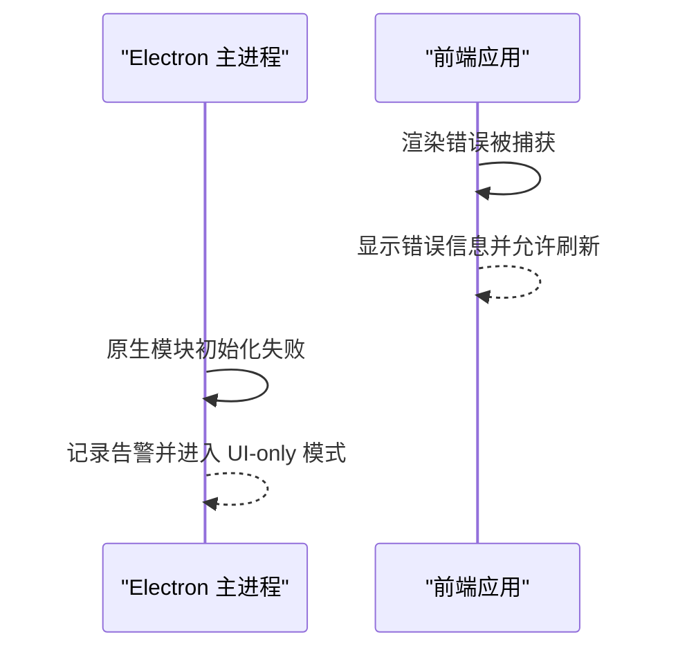
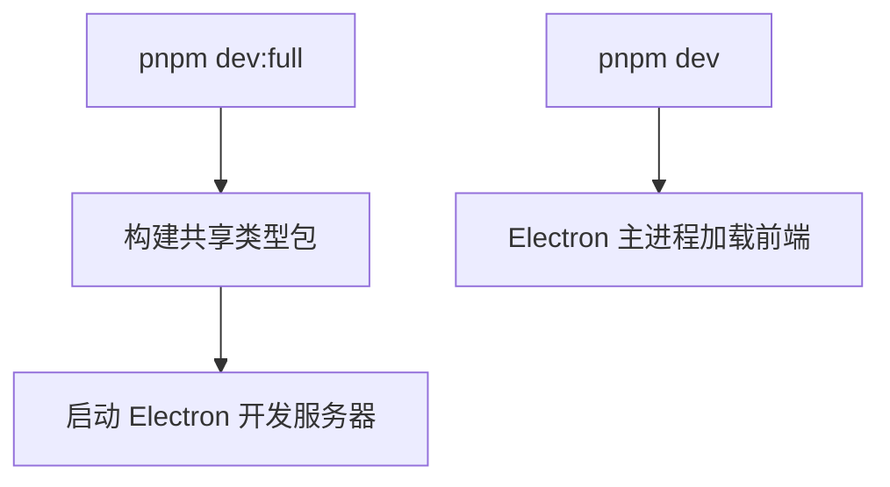
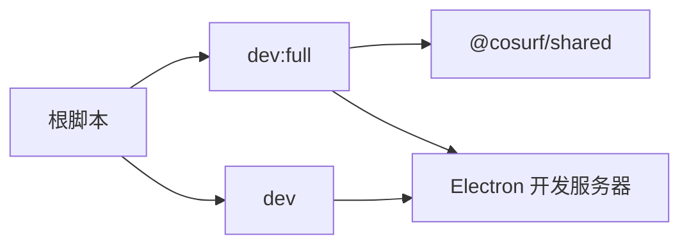

# 开发流程

<cite>
**本文引用的文件**
- [scripts/dev.ps1](file://scripts/dev.ps1)
- [scripts/check.ps1](file://scripts/check.ps1)
- [package.json](file://package.json)
- [src-web/vite.config.ts](file://src-web/vite.config.ts)
- [src-web/package.json](file://src-web/package.json)
- [electron/main.ts](file://electron/main.ts)
- [playwright-service/package.json](file://playwright-service/package.json)
- [playwright-service/src/index.ts](file://playwright-service/src/index.ts)
- [src-web/src/main.tsx](file://src-web/src/main.tsx)
- [Cargo.toml](file://Cargo.toml)
</cite>

## 更新摘要
**所做更改**
- 移除了 Tauri 相关的开发模式说明和配置
- 移除了 Playwright 服务的开发流程说明
- 简化为两步开发流程：构建共享类型 → 启动 Electron 开发服务器
- 更新了开发脚本工作原理，移除了并行启动机制
- 删除了与 Tauri 和 Playwright 相关的架构图和流程图
- 更新了故障排查指南，移除了 Tauri 和 Playwright 相关问题

## 目录
1. [简介](#简介)
2. [项目结构](#项目结构)
3. [核心组件](#核心组件)
4. [架构总览](#架构总览)
5. [详细组件分析](#详细组件分析)
6. [依赖关系分析](#依赖关系分析)
7. [性能考量](#性能考量)
8. [故障排查指南](#故障排查指南)
9. [结论](#结论)
10. [附录](#附录)

## 简介
本指南面向 CoSurf 项目的开发者，系统性讲解简化的两步开发模式的使用场景与操作步骤：
- pnpm dev：启动 Electron 开发服务器（前端热重载）
- pnpm dev:full：Windows PowerShell 脚本，按顺序构建共享类型包 → 启动 Electron 开发服务器

同时解释开发脚本的工作原理、文件监听与自动重启机制、错误处理与异常恢复、调试最佳实践、热重载原理与限制，以及何时需要手动重启开发服务器。

## 项目结构
CoSurf 采用多包工作区（pnpm workspaces），包含：
- Web 前端（React + Vite）位于 src-web
- Electron 客户端位于 electron
- 共享类型库位于 packages/shared

**图表来源**
- [package.json:14-29](file://package.json#L14-L29)
- [src-web/vite.config.ts:1-36](file://src-web/vite.config.ts#L1-L36)
- [packages/shared/package.json](file://packages/shared/package.json)
- [electron/main.ts:121-148](file://electron/main.ts#L121-L148)

**章节来源**
- [package.json:14-29](file://package.json#L14-L29)
- [src-web/vite.config.ts:1-36](file://src-web/vite.config.ts#L1-L36)
- [packages/shared/package.json](file://packages/shared/package.json)
- [electron/main.ts:121-148](file://electron/main.ts#L121-L148)

## 核心组件
- 开发脚本与模式
  - pnpm dev：启动 Electron 开发服务器（electron-vite dev），适合快速迭代前端与主进程交互。
  - pnpm dev:full：Windows PowerShell 脚本，按顺序构建共享类型包，再启动 Electron 开发服务器。
- 前端开发服务器（Vite）
  - 默认端口与 HMR 配置，支持跨主机连接（通过环境变量控制）。
- Electron 主进程
  - 开发模式下加载 Vite dev server；支持自定义协议、全局快捷键、原生模块初始化。
- 错误边界与容错
  - 前端应用内置错误边界，捕获渲染错误并允许刷新恢复。

**章节来源**
- [package.json:14-29](file://package.json#L14-L29)
- [src-web/vite.config.ts:14-28](file://src-web/vite.config.ts#L14-L28)
- [electron/main.ts:57-64](file://electron/main.ts#L57-L64)
- [src-web/src/main.tsx:6-43](file://src-web/src/main.tsx#L6-L43)

## 架构总览
下图展示两种主要开发模式的启动路径与组件交互：

**图表来源**
- [scripts/dev.ps1:5-12](file://scripts/dev.ps1#L5-L12)
- [package.json:14-29](file://package.json#L14-L29)

## 详细组件分析

### 开发模式与选择标准
- pnpm dev（Electron）
  - 适用场景：需要与 Electron 主进程紧密联调、测试原生模块与 IPC、或优先 Electron 平台。
  - 特点：主进程直接加载 Vite dev server，支持打开 DevTools，便于调试。
- pnpm dev:full（Windows）
  - 适用场景：需要先构建共享类型包，再启动 Electron 开发服务器的场景。
  - 特点：按顺序构建共享类型包 → 启动 Electron 开发服务器。

**章节来源**
- [package.json:14-29](file://package.json#L14-L29)
- [scripts/dev.ps1:5-12](file://scripts/dev.ps1#L5-L12)
- [electron/main.ts:57-64](file://electron/main.ts#L57-L64)

### 开发脚本工作原理与执行流程
- 根脚本
  - 定义了 dev、dev:full 等脚本，分别委托给 electron-vite、PowerShell 脚本等。
- Windows 全量开发脚本（dev.ps1）
  - 步骤一：构建共享类型包（@cosurf/shared）。
  - 步骤二：启动 Electron 开发服务器（npm run dev）。
  - 顺序执行：避免并行启动带来的复杂性和潜在冲突。
- 前端开发服务器（Vite）
  - 默认端口与 HMR 配置；可通过环境变量启用跨主机 HMR；忽略对原生与 Electron 目录的文件监听，减少不必要的重建。

**图表来源**
- [scripts/dev.ps1:5-12](file://scripts/dev.ps1#L5-L12)
- [src-web/vite.config.ts:25-27](file://src-web/vite.config.ts#L25-L27)

**章节来源**
- [package.json:14-29](file://package.json#L14-L29)
- [scripts/dev.ps1:5-12](file://scripts/dev.ps1#L5-L12)
- [src-web/vite.config.ts:25-27](file://src-web/vite.config.ts#L25-L27)

### 文件监听与自动重启机制
- Vite 监听策略
  - 忽_ignore src-tauri、native、electron 目录，避免前端开发被原生/桌面层改动触发重建。
  - HMR 可跨主机启用（通过环境变量），用于容器化或远程开发场景。
- Electron
  - 主进程根据是否打包判断加载本地 Vite dev server 或打包后的静态页面；DevTools 可在开发模式打开。

**章节来源**
- [src-web/vite.config.ts:25-28](file://src-web/vite.config.ts#L25-L28)
- [electron/main.ts:57-64](file://electron/main.ts#L57-L64)

### 错误处理与异常恢复
- 前端错误边界
  - 捕获渲染期错误，展示错误信息并允许刷新恢复。
- Electron
  - 主进程加载失败会输出警告；原生模块初始化失败进入 UI-only 模式并记录告警。

**图表来源**
- [electron/main.ts:85-87](file://electron/main.ts#L85-L87)
- [src-web/src/main.tsx:6-43](file://src-web/src/main.tsx#L6-L43)

**章节来源**
- [electron/main.ts:85-87](file://electron/main.ts#L85-L87)
- [src-web/src/main.tsx:6-43](file://src-web/src/main.tsx#L6-L43)

### 调试最佳实践
- 断点设置
  - 前端：在 Vite 开发服务器中设置断点；若需跨主机 HMR，请确认环境变量已正确设置。
  - Electron：打开 DevTools（开发模式自动开启），在主进程/渲染进程分别设置断点。
- 变量检查
  - 使用控制台与断点检查关键状态（如应用数据目录、技能目录、窗口状态）。
- 性能分析
  - 前端：利用浏览器性能面板分析 HMR 与渲染性能。
  - Electron：关注主进程事件循环与 IPC 调用频率。
- 日志与可观测性
  - Electron 主进程输出关键日志，便于定位问题。

**章节来源**
- [src-web/vite.config.ts:14-28](file://src-web/vite.config.ts#L14-L28)
- [electron/main.ts:60-61](file://electron/main.ts#L60-L61)

### 热重载（HMR）原理与限制
- 原理
  - Vite 在开发模式下建立 WebSocket，监听文件变更，增量更新模块并注入到运行时。
  - 当设置跨主机 HMR 时，通过环境变量指定协议、主机与端口，实现远程或容器内协作。
- 限制
  - 忽略某些目录（如 src-tauri、native、electron）的监听，避免无关改动触发前端重建。
  - 对于主进程或原生模块的改动，需要手动重启对应进程。
- 何时手动重启
  - 修改了主进程入口、原生模块、或配置文件时，应停止并重启相应进程。

**章节来源**
- [src-web/vite.config.ts:14-28](file://src-web/vite.config.ts#L14-L28)
- [src-web/vite.config.ts:25-27](file://src-web/vite.config.ts#L25-L27)

### 开发时的文件监听与自动重启机制
- Vite
  - 监听 src 目录变化，忽略桌面与原生目录；HMR 注入模块更新。
- Electron
  - 主进程根据是否打包决定加载方式；DevTools 可在开发模式打开。

**章节来源**
- [src-web/vite.config.ts:25-27](file://src-web/vite.config.ts#L25-L27)
- [electron/main.ts:57-64](file://electron/main.ts#L57-L64)

### 开发脚本与模式的执行流程
- pnpm dev:full（Windows）
  - 构建共享类型包 → 启动 Electron 开发服务器。
- pnpm dev
  - Electron 主进程加载前端开发服务器或打包页面。

**图表来源**
- [scripts/dev.ps1:5-12](file://scripts/dev.ps1#L5-L12)
- [package.json:14-29](file://package.json#L14-L29)

## 依赖关系分析
- 脚本依赖
  - 根脚本依赖各子包的开发脚本与构建脚本。
- 前端与桌面客户端
  - Electron 主进程在开发模式加载 Vite dev server。
- 共享类型
  - 共享包在 Electron 前端构建前先行构建，保证类型一致性。

**图表来源**
- [package.json:14-29](file://package.json#L14-L29)
- [scripts/dev.ps1:5-12](file://scripts/dev.ps1#L5-L12)

**章节来源**
- [package.json:14-29](file://package.json#L14-L29)
- [scripts/dev.ps1:5-12](file://scripts/dev.ps1#L5-L12)

## 性能考量
- 减少无关重建
  - Vite 已忽略桌面与原生目录监听，避免频繁重建影响开发效率。
- HMR 优化
  - 合理拆分模块，避免大范围热更新；仅在必要时调整 HMR 配置。
- 服务启动顺序
  - 先构建共享类型，再启动 Electron 开发服务器，确保依赖就绪。
- 资源释放
  - Electron 主进程优雅退出，释放系统资源。

**章节来源**
- [src-web/vite.config.ts:25-27](file://src-web/vite.config.ts#L25-L27)
- [scripts/dev.ps1:5-12](file://scripts/dev.ps1#L5-L12)
- [electron/main.ts:228-232](file://electron/main.ts#L228-L232)

## 故障排查指南
- Electron 开发无法启动
  - 确认开发模式下加载的是 Vite dev server；检查 DevTools 输出；原生模块初始化失败会降级为 UI-only 模式。
- 前端错误
  - 利用错误边界查看错误详情；必要时刷新页面恢复。
- 全量开发（dev:full）失败
  - 分步执行：先构建共享包，再启动 Electron 开发服务器；逐个排查。

**章节来源**
- [electron/main.ts:57-64](file://electron/main.ts#L57-L64)
- [src-web/src/main.tsx:6-43](file://src-web/src/main.tsx#L6-L43)
- [scripts/dev.ps1:5-12](file://scripts/dev.ps1#L5-L12)

## 结论
- 选择开发模式时，优先考虑目标平台与功能需求：Electron 适合快速联调主进程与原生模块。
- 简化的两步开发流程有助于减少复杂性，提升开发效率。
- 熟悉脚本执行顺序与依赖关系，有助于快速定位问题与提升效率。
- 合理利用 HMR、错误边界与优雅退出机制，可显著改善开发体验与稳定性。

## 附录
- 常用脚本与用途
  - pnpm dev：Electron 开发
  - pnpm dev:full：Windows 全量开发（构建共享类型包 → 启动 Electron 开发服务器）
- 环境变量参考
  - Vite：VITE_DEBUG 控制 SourceMap；TAURI_DEV_HOST/ELECTRON_DEV_HOST 控制 HMR 主机
- 关键配置参考
  - Vite HMR 与监听忽略规则
  - Electron 开发模式加载逻辑与 DevTools

**章节来源**
- [package.json:14-29](file://package.json#L14-L29)
- [src-web/vite.config.ts:5-28](file://src-web/vite.config.ts#L5-L28)
- [electron/main.ts:57-64](file://electron/main.ts#L57-L64)