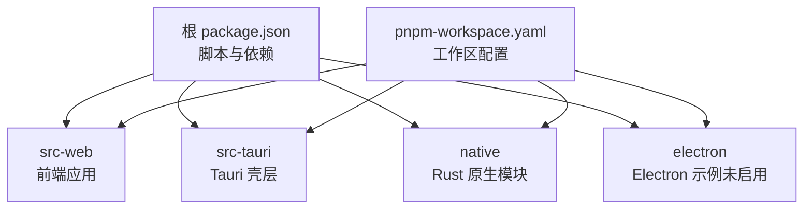
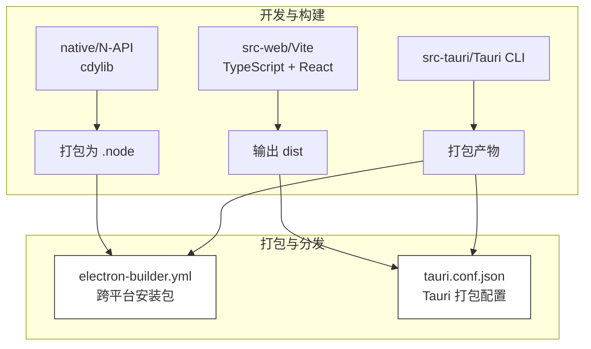
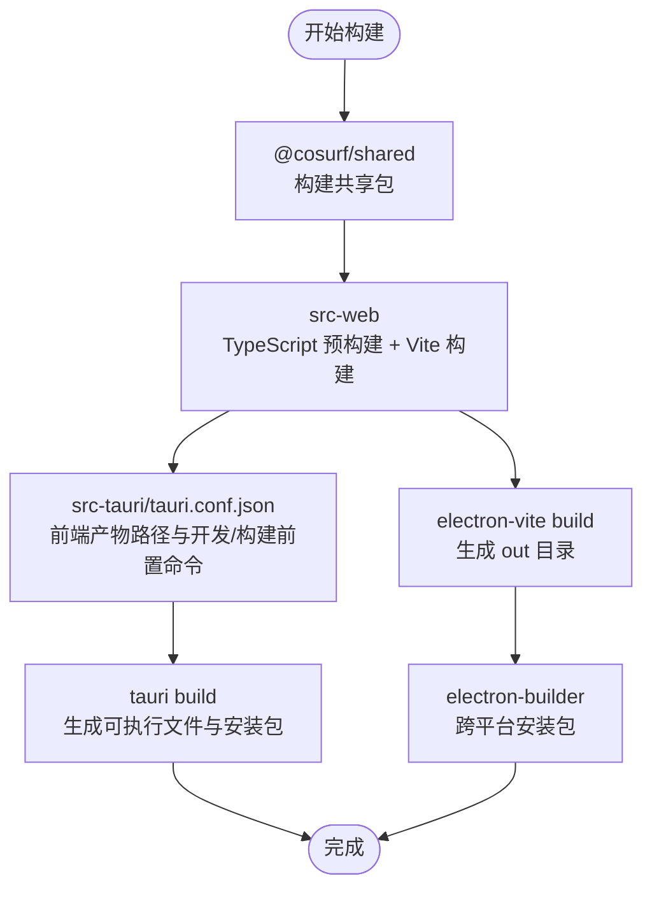
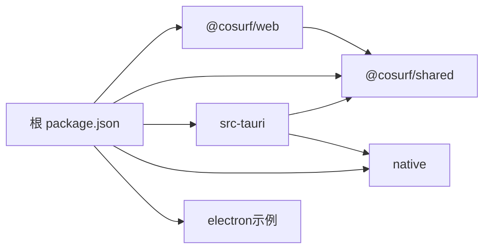

# 构建与部署

<cite>
**本文引用的文件**
- [package.json](file://package.json)
- [pnpm-workspace.yaml](file://pnpm-workspace.yaml)
- [electron-builder.yml](file://electron-builder.yml)
- [src-tauri/tauri.conf.json](file://src-tauri/tauri.conf.json)
- [Cargo.toml（工作区根）](file://Cargo.toml)
- [src-web/package.json](file://src-web/package.json)
- [src-web/vite.config.ts](file://src-web/vite.config.ts)
- [scripts/build.ps1](file://scripts/build.ps1)
- [scripts/dev.ps1](file://scripts/dev.ps1)
- [src-tauri/Cargo.toml](file://src-tauri/Cargo.toml)
- [native/Cargo.toml](file://native/Cargo.toml)
- [src-tauri/updater.json](file://src-tauri/updater.json)
</cite>

## 目录
1. [简介](#简介)
2. [项目结构](#项目结构)
3. [核心组件](#核心组件)
4. [架构总览](#架构总览)
5. [详细组件分析](#详细组件分析)
6. [依赖关系分析](#依赖关系分析)
7. [性能考量](#性能考量)
8. [故障排查指南](#故障排查指南)
9. [结论](#结论)
10. [附录](#附录)

## 简介
本指南面向 CoSurf 项目的构建与部署，覆盖以下主题：
- 构建命令与差异：pnpm build:release、pnpm build、pnpm build:tauri、pnpm build:electron（如存在）及其适用场景
- 构建阶段详解：前端资源打包、TypeScript 编译、Rust 二进制编译、原生模块打包、资源文件处理
- 部署配置：electron-builder.yml、Tauri 应用签名与打包、图标与元数据
- 平台部署：Windows、macOS、Linux 的特定要求与注意事项
- 持续集成与自动化：如何在 CI 中运行构建与打包（当前仓库未包含 GitHub Actions 文件）
- 版本管理与发布：语义化版本、变更日志与发布说明建议

## 项目结构
CoSurf 采用多包工作区（pnpm workspaces），包含：
- Web 前端（React + Vite）位于 src-web
- Tauri 原生壳层位于 src-tauri
- Rust 原生模块位于 native
- Electron 相关代码位于 electron（当前未在根 package.json 中定义 Electron 构建脚本）

图表来源
- [package.json:14-30](file://package.json#L14-L30)
- [pnpm-workspace.yaml:1-5](file://pnpm-workspace.yaml#L1-L5)

章节来源
- [package.json:14-30](file://package.json#L14-L30)
- [pnpm-workspace.yaml:1-5](file://pnpm-workspace.yaml#L1-L5)

## 核心组件
- 构建脚本与命令
  - pnpm build:release：调用 electron-vite 构建后，使用 electron-builder 进行跨平台打包
  - pnpm build：调用 electron-vite 构建前端产物
  - pnpm build:tauri：调用 tauri build 构建 Tauri 应用（含 Windows 安装器与独立可执行文件）
  - pnpm build:electron：当前仓库未定义该脚本；如需 Electron 构建，请在根 package.json 中添加对应脚本
- 前端构建
  - src-web 使用 Vite + React，TypeScript 通过 tsc -b 预构建
- 原生模块
  - native 使用 N-API（napi）导出 cdylib，供 Electron 或其他 Node 环境使用
- Tauri 壳层
  - src-tauri 作为 Tauri 应用入口，负责窗口、权限、打包与更新
- 打包与分发
  - electron-builder.yml 控制 Electron 安装包目标平台与产物命名
  - src-tauri/tauri.conf.json 控制 Tauri 打包目标、图标、CSP、更新插件等

章节来源
- [package.json:14-30](file://package.json#L14-L30)
- [src-web/package.json:7-13](file://src-web/package.json#L7-L13)
- [src-tauri/tauri.conf.json:6-11](file://src-tauri/tauri.conf.json#L6-L11)
- [electron-builder.yml:1-74](file://electron-builder.yml#L1-L74)

## 架构总览
下图展示从开发到发布的整体流程，涵盖前端构建、原生模块、Tauri 打包与 Electron 打包。

图表来源
- [src-web/vite.config.ts:30-35](file://src-web/vite.config.ts#L30-L35)
- [native/Cargo.toml:8-9](file://native/Cargo.toml#L8-L9)
- [electron-builder.yml:16-21](file://electron-builder.yml#L16-L21)
- [src-tauri/tauri.conf.json:6-11](file://src-tauri/tauri.conf.json#L6-L11)

## 详细组件分析

### 构建命令与适用场景
- pnpm build:release
  - 行为：先构建前端，再调用 electron-builder 进行跨平台打包
  - 适用场景：需要生成 Electron 安装包（Windows NSIS/MSI、macOS DMG、Linux AppImage）
  - 关键配置：electron-builder.yml
- pnpm build
  - 行为：仅构建前端产物（Vite + TypeScript）
  - 适用场景：仅需前端产物或后续自定义打包
- pnpm build:tauri
  - 行为：调用 tauri build，生成 Tauri 可执行文件与安装包（Windows MSI/NSIS）
  - 适用场景：构建 Tauri 原生桌面应用
- pnpm build:electron
  - 当前状态：未在根 package.json 中定义
  - 建议：如需 Electron 构建，请在根 package.json 的 scripts 字段中添加相应脚本，并参考 electron-builder.yml 的目标平台进行配置

章节来源
- [package.json:14-30](file://package.json#L14-L30)
- [electron-builder.yml:23-68](file://electron-builder.yml#L23-L68)
- [src-tauri/tauri.conf.json:33-64](file://src-tauri/tauri.conf.json#L33-L64)

### 构建阶段详解
- 前端资源打包（src-web）
  - TypeScript 预构建：tsc -b
  - Vite 构建：target chrome120，最小化与可选 SourceMap
  - 开发服务器：端口 1420，支持热更新与 HMR
- TypeScript 编译
  - src-web 使用 tsc -b 进行增量编译，避免重复类型检查
- Rust 二进制编译
  - src-tauri：Tauri 应用二进制与静态库
  - native：N-API cdylib，供 Node/Electron 使用
  - 工作区统一版本与发布配置见 Cargo.toml（工作区根）
- 资源文件处理
  - electron-builder.yml extraResources 将原生模块按平台打包
  - src-tauri/tauri.conf.json 指定图标与打包目标

图表来源
- [scripts/build.ps1:44-54](file://scripts/build.ps1#L44-L54)
- [src-tauri/tauri.conf.json:6-11](file://src-tauri/tauri.conf.json#L6-L11)
- [package.json:18-20](file://package.json#L18-L20)

章节来源
- [src-web/vite.config.ts:30-35](file://src-web/vite.config.ts#L30-L35)
- [src-web/package.json:7-13](file://src-web/package.json#L7-L13)
- [src-tauri/tauri.conf.json:6-11](file://src-tauri/tauri.conf.json#L6-L11)
- [package.json:18-20](file://package.json#L18-L20)

### 部署配置

#### electron-builder.yml
- 基本信息：appId、productName、copyright
- 输出目录：buildResources、output
- 文件与资源：files、extraResources（原生模块按平台打包）
- 平台目标与产物命名：
  - Windows：nsis、msi（x64）
  - macOS：dmg（x64、arm64）
  - Linux：AppImage（x64）
- 发布：GitHub Releases（provider: github）

章节来源
- [electron-builder.yml:4-74](file://electron-builder.yml#L4-L74)

#### Tauri 应用配置（tauri.conf.json）
- 前端产物路径与开发/构建前置命令
- 窗口与安全策略（CSP）
- 打包目标与图标
- 更新插件（updater）配置

章节来源
- [src-tauri/tauri.conf.json:6-71](file://src-tauri/tauri.conf.json#L6-L71)

#### 原生模块与打包
- native/Cargo.toml 指定 cdylib，electron-builder.yml extraResources 将其按平台复制到最终包内
- src-tauri/Cargo.toml 依赖 tauri 插件生态，用于系统能力扩展

章节来源
- [native/Cargo.toml:8-9](file://native/Cargo.toml#L8-L9)
- [electron-builder.yml:16-21](file://electron-builder.yml#L16-L21)
- [src-tauri/Cargo.toml:21-31](file://src-tauri/Cargo.toml#L21-L31)

### 平台部署指南

#### Windows
- Tauri：生成 MSI/NSIS 安装包，支持多语言安装界面
- Electron：支持 NSIS/MSI（x64），可配置桌面与开始菜单快捷方式
- 注意事项：确保已安装 WebView2（Tauri 配置中包含自动安装引导器）

章节来源
- [src-tauri/tauri.conf.json:33-64](file://src-tauri/tauri.conf.json#L33-L64)
- [electron-builder.yml:23-48](file://electron-builder.yml#L23-L48)

#### macOS
- Tauri：生成 DMG（x64、arm64），启用 Hardened Runtime
- Electron：生成 DMG（x64、arm64）

章节来源
- [src-tauri/tauri.conf.json:49-63](file://src-tauri/tauri.conf.json#L49-L63)
- [electron-builder.yml:49-68](file://electron-builder.yml#L49-L68)

#### Linux
- Tauri：生成 AppImage（x64）
- Electron：生成 AppImage（x64）

章节来源
- [src-tauri/tauri.conf.json:61-64](file://src-tauri/tauri.conf.json#L61-L64)
- [electron-builder.yml:61-68](file://electron-builder.yml#L61-L68)

### 持续集成与自动化部署
- 当前仓库未包含 .github/workflows 目录与 YAML 配置文件
- 建议在 CI 中执行以下步骤：
  - 安装 Node.js 与 pnpm（满足 engines 要求）
  - 安装 Rust 工具链与目标
  - 运行 pnpm install（使用锁定文件）
  - 分别执行 pnpm build 与 pnpm build:tauri 或 pnpm build:release
  - 将产物上传至发布页面（GitHub Releases）
- 如需 Electron 自动化，请在根 package.json 中添加 build:electron 脚本，并在 CI 中调用

章节来源
- [package.json:42-46](file://package.json#L42-L46)
- [scripts/build.ps1:35-40](file://scripts/build.ps1#L35-L40)

### 版本管理与发布流程
- 版本号来源：工作区根 Cargo.toml 与各包 package.json 的 version 字段
- 建议流程：
  - 使用语义化版本（SemVer）
  - 在发布前更新 CHANGELOG（可使用工具生成）
  - 编写发布说明（Release Notes），包含重大变更、修复与已知问题
  - 在 GitHub 创建 Release，上传安装包与更新元数据（Tauri Updater）

章节来源
- [Cargo.toml:5-11](file://Cargo.toml#L5-L11)
- [package.json:2-4](file://package.json#L2-L4)
- [src-tauri/updater.json:1-11](file://src-tauri/updater.json#L1-L11)

## 依赖关系分析

图表来源
- [pnpm-workspace.yaml:1-5](file://pnpm-workspace.yaml#L1-L5)
- [src-web/package.json:14-15](file://src-web/package.json#L14-L15)

章节来源
- [pnpm-workspace.yaml:1-5](file://pnpm-workspace.yaml#L1-L5)
- [src-web/package.json:14-15](file://src-web/package.json#L14-L15)

## 性能考量
- 生产构建优化
  - Vite 构建 target chrome120，最小化与 SourceMap 可控
  - Rust 采用 LTO、strip、优化级别“s”等发布配置
- 原生模块体积
  - 建议在 CI 中对 native 进行 release 构建，减少包体大小
- 打包体积
  - electron-builder.yml 中排除 node_modules，仅打包必要资源

章节来源
- [src-web/vite.config.ts:30-35](file://src-web/vite.config.ts#L30-L35)
- [native/Cargo.toml:68-72](file://native/Cargo.toml#L68-L72)
- [electron-builder.yml:12-14](file://electron-builder.yml#L12-L14)

## 故障排查指南
- 构建前置条件缺失
  - PowerShell 脚本会检测 Node.js、pnpm、Rust（rustc、cargo）是否安装
  - 若缺失，请根据提示安装并重试
- 依赖安装失败
  - 优先使用锁定文件安装；若失败则回退到普通安装
- 原生模块未被正确打包
  - 检查 electron-builder.yml extraResources 是否匹配平台产物名
  - 确认 native 的 cdylib 已在 release 模式构建
- Tauri 打包失败
  - 确认 src-tauri/tauri.conf.json 中前端产物路径与构建命令正确
  - 检查图标与证书配置（Windows 签名）

章节来源
- [scripts/build.ps1:11-26](file://scripts/build.ps1#L11-L26)
- [scripts/build.ps1:35-40](file://scripts/build.ps1#L35-L40)
- [electron-builder.yml:16-21](file://electron-builder.yml#L16-L21)
- [src-tauri/tauri.conf.json:6-11](file://src-tauri/tauri.conf.json#L6-L11)

## 结论
- 若目标为 Tauri 原生桌面应用，优先使用 pnpm build:tauri
- 若目标为 Electron 安装包，使用 pnpm build:release
- 前端构建与原生模块需分别在各自工作区完成
- CI 中建议固定 Node.js 与 Rust 版本，使用锁定文件安装依赖
- 发布前完善版本号、变更日志与发布说明

## 附录

### 命令速查
- 开发：pnpm dev、pnpm dev:tauri、pnpm dev:full
- 构建：pnpm build、pnpm build:tauri、pnpm build:release
- 清理：pnpm clean
- 其他：pnpm lint、pnpm typecheck、pnpm test、pnpm check

章节来源
- [package.json:14-30](file://package.json#L14-L30)