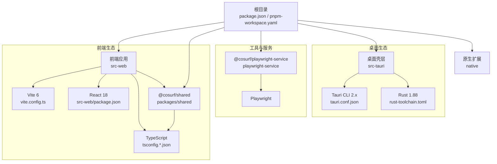
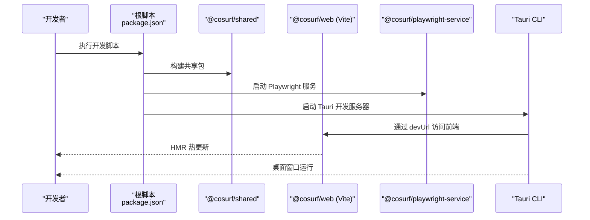
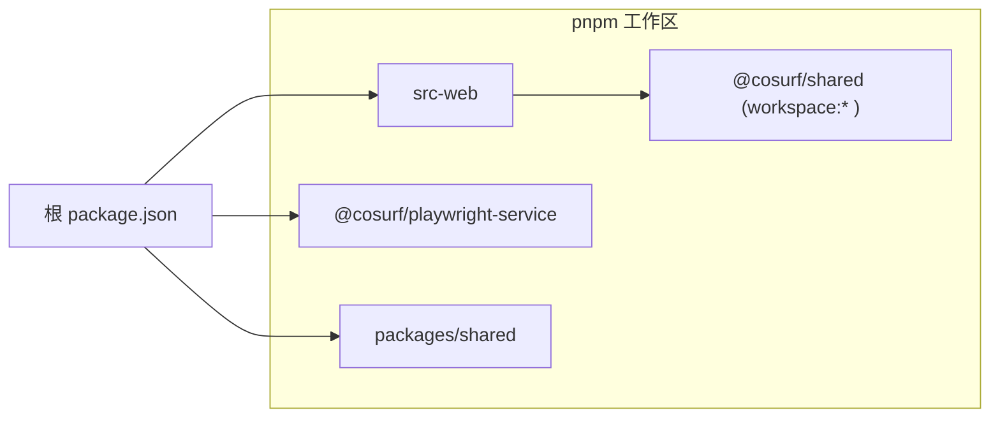

# 环境搭建

<cite>
**本文引用的文件**
- [package.json](file://package.json)
- [pnpm-workspace.yaml](file://pnpm-workspace.yaml)
- [Cargo.toml](file://Cargo.toml)
- [rust-toolchain.toml](file://rust-toolchain.toml)
- [src-tauri/Cargo.toml](file://src-tauri/Cargo.toml)
- [src-tauri/tauri.conf.json](file://src-tauri/tauri.conf.json)
- [src-web/package.json](file://src-web/package.json)
- [src-web/vite.config.ts](file://src-web/vite.config.ts)
- [src-web/tsconfig.json](file://src-web/tsconfig.json)
- [src-web/tsconfig.app.json](file://src-web/tsconfig.app.json)
- [playwright-service/package.json](file://playwright-service/package.json)
- [packages/shared/package.json](file://packages/shared/package.json)
- [scripts/dev.ps1](file://scripts/dev.ps1)
- [scripts/check.ps1](file://scripts/check.ps1)
</cite>

## 目录
1. [简介](#简介)
2. [项目结构](#项目结构)
3. [核心组件](#核心组件)
4. [架构总览](#架构总览)
5. [详细组件分析](#详细组件分析)
6. [依赖分析](#依赖分析)
7. [性能考虑](#性能考虑)
8. [故障排除指南](#故障排除指南)
9. [结论](#结论)
10. [附录](#附录)

## 简介
本指南面向希望在本地搭建 CoSurf 开发环境的开发者，覆盖 Windows、macOS、Linux 三大平台。你将获得：
- 前置条件与版本要求：Node.js、pnpm、Rust 工具链、WebView2 Runtime
- 技术栈要求：Tauri 2.x、Vite 6、React 18、TypeScript、Rust 1.88 稳定版
- 平台化安装步骤与注意事项
- 如何验证安装成功（关键命令）
- pnpm workspace 配置与使用
- 常见问题排查（PATH、权限、网络代理）

## 项目结构
CoSurf 采用多包工作区（workspace）组织方式，前端基于 Vite + React，后端基于 Tauri 2.x + Rust，同时包含共享包与 Playwright 服务。

图表来源
- [pnpm-workspace.yaml:1-5](file://pnpm-workspace.yaml#L1-L5)
- [src-web/vite.config.ts:1-36](file://src-web/vite.config.ts#L1-L36)
- [src-web/package.json:1-44](file://src-web/package.json#L1-L44)
- [src-tauri/tauri.conf.json:1-72](file://src-tauri/tauri.conf.json#L1-L72)
- [rust-toolchain.toml:1-4](file://rust-toolchain.toml#L1-L4)
- [playwright-service/package.json:1-24](file://playwright-service/package.json#L1-L24)
- [packages/shared/package.json:1-17](file://packages/shared/package.json#L1-L17)

章节来源
- [pnpm-workspace.yaml:1-5](file://pnpm-workspace.yaml#L1-L5)
- [package.json:1-48](file://package.json#L1-L48)

## 核心组件
- Node.js 与包管理器
  - Node.js 最低版本要求由根 package.json 的 engines 字段定义
  - 使用 pnpm 作为包管理器，版本要求由根 package.json 的 engines 字段定义
  - 根 package.json 指定 packageManager 为 pnpm@9.x
- 前端技术栈
  - Vite 6、React 18、TypeScript、TailwindCSS、ESLint、PostCSS
  - src-web/package.json 明确依赖范围
- 桌面端技术栈
  - Tauri 2.x（CLI 2.x），Rust 1.88 稳定版
  - src-tauri/Cargo.toml 指定 tauri 2.5 及相关插件版本
- 共享包与服务
  - @cosurf/shared 提供跨包共享类型与工具
  - @cosurf/playwright-service 提供浏览器自动化服务

章节来源
- [package.json:31-47](file://package.json#L31-L47)
- [src-web/package.json:14-42](file://src-web/package.json#L14-L42)
- [src-tauri/Cargo.toml:21-31](file://src-tauri/Cargo.toml#L21-L31)
- [rust-toolchain.toml:1-4](file://rust-toolchain.toml#L1-L4)
- [packages/shared/package.json:1-17](file://packages/shared/package.json#L1-L17)
- [playwright-service/package.json:1-24](file://playwright-service/package.json#L1-L24)

## 架构总览
下图展示开发时的启动流程与依赖关系，体现前端、桌面壳层与服务之间的协作。

图表来源
- [package.json:14-29](file://package.json#L14-L29)
- [scripts/dev.ps1:1-13](file://scripts/dev.ps1#L1-L13)
- [src-tauri/tauri.conf.json:6-11](file://src-tauri/tauri.conf.json#L6-L11)
- [src-web/vite.config.ts:14-28](file://src-web/vite.config.ts#L14-L28)

章节来源
- [scripts/dev.ps1:1-13](file://scripts/dev.ps1#L1-L13)
- [src-tauri/tauri.conf.json:6-11](file://src-tauri/tauri.conf.json#L6-L11)
- [src-web/vite.config.ts:14-28](file://src-web/vite.config.ts#L14-L28)

## 详细组件分析

### 前端开发环境（Vite + React + TypeScript）
- Vite 6
  - 通过 src-web/vite.config.ts 配置开发服务器端口、HMR、别名与构建目标
  - 构建目标设置为 chrome120，确保现代浏览器兼容性
- React 18
  - src-web/package.json 明确依赖 react 与 react-dom
- TypeScript
  - tsconfig.json 采用引用型配置，tsconfig.app.json 设置严格模式与模块解析策略
- TailwindCSS
  - tailwind.config.js 定义主题、动画与内容扫描路径
- ESLint 与 PostCSS
  - src-web/package.json 中包含相关 devDependencies

章节来源
- [src-web/vite.config.ts:1-36](file://src-web/vite.config.ts#L1-L36)
- [src-web/tsconfig.json:1-8](file://src-web/tsconfig.json#L1-L8)
- [src-web/tsconfig.app.json:1-26](file://src-web/tsconfig.app.json#L1-L26)
- [src-web/package.json:14-42](file://src-web/package.json#L14-L42)
- [src-web/tailwind.config.js:1-95](file://src-web/tailwind.config.js#L1-L95)

### 桌面端开发环境（Tauri 2.x + Rust）
- Tauri CLI 与配置
  - src-tauri/tauri.conf.json 定义产品名称、窗口属性、安全 CSP、打包目标与 WebView2 安装模式
  - build.beforeDevCommand 与 beforeBuildCommand 调用 pnpm workspace 进行预构建
- Rust 工具链
  - rust-toolchain.toml 指定 channel 为 1.88.0，并启用 rustfmt、clippy
  - src-tauri/Cargo.toml 指定 tauri 2.5 与常用插件版本
- WebView2 Runtime
  - tauri.conf.json 的 windows.webviewInstallMode 配置为嵌入式引导安装，确保首次运行时自动安装

章节来源
- [src-tauri/tauri.conf.json:1-72](file://src-tauri/tauri.conf.json#L1-L72)
- [src-tauri/Cargo.toml:1-70](file://src-tauri/Cargo.toml#L1-L70)
- [rust-toolchain.toml:1-4](file://rust-toolchain.toml#L1-L4)

### 共享包与 Playwright 服务
- @cosurf/shared
  - packages/shared/package.json 提供类型与工具的构建脚本
- @cosurf/playwright-service
  - playwright-service/package.json 定义 Playwright 与 Fastify 依赖，提供开发与运行脚本

章节来源
- [packages/shared/package.json:1-17](file://packages/shared/package.json#L1-L17)
- [playwright-service/package.json:1-24](file://playwright-service/package.json#L1-L24)

## 依赖分析
- pnpm workspace
  - packages 列表包含 src-web、playwright-service 与 packages/*
  - 通过 workspace:* 在依赖中引用共享包
- 根级依赖
  - @tauri-apps/cli、vite、electron、electron-vite、typescript 等
- Rust 工作区
  - workspace.members 包含 src-tauri 与 native，统一版本与特性

图表来源
- [pnpm-workspace.yaml:1-5](file://pnpm-workspace.yaml#L1-L5)
- [src-web/package.json:14-16](file://src-web/package.json#L14-L16)
- [packages/shared/package.json:1-17](file://packages/shared/package.json#L1-L17)

章节来源
- [pnpm-workspace.yaml:1-5](file://pnpm-workspace.yaml#L1-L5)
- [src-web/package.json:14-16](file://src-web/package.json#L14-L16)
- [Cargo.toml:1-3](file://Cargo.toml#L1-L3)

## 性能考虑
- 构建目标与最小化
  - Vite 构建目标为 chrome120，有助于利用现代浏览器优化
  - 生产构建启用 esbuild 最小化与可选 SourceMap
- Rust 发布配置
  - Cargo.toml 的 release profile 启用 LTO、单代码单元、裁剪与优化级别 s
- 开发体验
  - Vite HMR 仅监听前端源码，忽略 src-tauri/native/electron 目录，减少不必要的重载

章节来源
- [src-web/vite.config.ts:30-34](file://src-web/vite.config.ts#L30-L34)
- [Cargo.toml:23-29](file://Cargo.toml#L23-L29)

## 故障排除指南
- Node.js 与 pnpm 版本不匹配
  - 症状：安装或运行报错，提示 Node 或 pnpm 版本过低
  - 排查：确认 package.json 中 engines 与 packageManager 的版本要求
  - 处理：升级到满足 engines 的 Node.js 与 pnpm 版本
- PATH 未包含 pnpm 或 Rust 工具链
  - 症状：无法识别 pnpm、cargo、rustc
  - 排查：检查系统 PATH 是否包含 pnpm 与 Rust 工具链安装路径
  - 处理：将 pnpm 与 Rust 工具链 bin 目录加入 PATH 并重启终端
- 权限问题（Windows/macOS/Linux）
  - 症状：安装失败、无法写入系统目录
  - 排查：以管理员权限运行安装程序或调整用户目录权限
  - 处理：使用用户级安装或在终端中提升权限
- 网络代理导致依赖下载失败
  - 症状：pnpm install、cargo fetch 超时
  - 排查：检查系统代理设置
  - 处理：配置 pnpm registry 与代理，或使用国内镜像源
- WebView2 未安装或版本过旧
  - 症状：Tauri 应用启动时报 WebView2 缺失
  - 排查：查看 tauri.conf.json 的 webviewInstallMode 配置
  - 处理：允许嵌入式引导安装或手动安装最新 WebView2 Runtime
- Rust 组件编译失败
  - 症状：cargo build 报错
  - 排查：确认 rust-toolchain.toml 的 channel 与组件
  - 处理：使用 rustup 安装指定通道与组件；清理缓存后重试
- 开发脚本无法启动
  - 症状：pnpm dev:tauri 或 scripts/dev.ps1 失败
  - 排查：检查 tauri.conf.json 的 beforeDevCommand 与 src-web 构建产物
  - 处理：先执行 @cosurf/shared 与 @cosurf/web 的构建，再启动 Tauri 开发服务器

章节来源
- [package.json:42-47](file://package.json#L42-L47)
- [src-tauri/tauri.conf.json:55-58](file://src-tauri/tauri.conf.json#L55-L58)
- [rust-toolchain.toml:1-4](file://rust-toolchain.toml#L1-L4)
- [scripts/dev.ps1:1-13](file://scripts/dev.ps1#L1-L13)

## 结论
通过遵循本指南，你可以在 Windows、macOS、Linux 上完成 CoSurf 的环境搭建。重点在于满足 Node.js 与 pnpm 的最低版本要求、安装 Rust 工具链与 WebView2 Runtime，并正确配置 pnpm workspace 与 Tauri 开发流程。遇到问题时，优先检查版本匹配、PATH、权限与网络代理，并参考故障排除章节进行定位与修复。

## 附录

### 平台化安装步骤与注意事项

- Windows
  - 安装 Node.js（满足 engines 要求）
  - 安装 pnpm（满足 engines 要求）
  - 安装 Rust 工具链（rustup，默认通道即 1.88.0）
  - 安装 WebView2 Runtime（或依赖 Tauri 自动安装）
  - 安装依赖并启动：在仓库根目录执行 pnpm 安装与开发脚本
  - 注意：若需使用 PowerShell 脚本，请确保执行策略允许运行脚本
- macOS
  - 安装 Node.js 与 pnpm（满足版本要求）
  - 安装 Rust 工具链（rustup）
  - 安装 Xcode Command Line Tools（用于编译原生依赖）
  - 安装 WebView2 Runtime（通过 Tauri 自动安装）
  - 执行 pnpm 安装与开发脚本
- Linux
  - 安装 Node.js 与 pnpm（满足版本要求）
  - 安装 Rust 工具链（rustup）
  - 安装必要系统依赖（如编译 Rust 与 Tauri 所需的库）
  - 安装 WebView2 Runtime（通过 Tauri 自动安装）
  - 执行 pnpm 安装与开发脚本

章节来源
- [package.json:42-47](file://package.json#L42-L47)
- [rust-toolchain.toml:1-4](file://rust-toolchain.toml#L1-L4)
- [src-tauri/tauri.conf.json:55-58](file://src-tauri/tauri.conf.json#L55-L58)

### 验证环境安装是否正确的关键命令
- 检查 Node.js 与 pnpm 版本
  - node -v
  - pnpm -v
- 检查 Rust 工具链
  - rustc --version
  - cargo --version
- 检查 WebView2（可选）
  - 在 Tauri 应用中首次运行以触发自动安装
- 验证前端开发服务器
  - 在 src-web 目录执行开发命令，确认 Vite 启动并可访问
- 验证 Tauri 开发服务器
  - 在根目录执行 Tauri 开发命令，确认桌面窗口启动
- 运行全量检查脚本
  - 在根目录执行检查脚本，确保 TypeScript 类型检查、ESLint 与 Rust clippy 通过

章节来源
- [package.json:14-29](file://package.json#L14-L29)
- [scripts/check.ps1:1-17](file://scripts/check.ps1#L1-L17)
- [src-web/vite.config.ts:14-28](file://src-web/vite.config.ts#L14-L28)
- [src-tauri/tauri.conf.json:6-11](file://src-tauri/tauri.conf.json#L6-L11)

### pnpm workspace 的配置与使用
- 工作区配置
  - pnpm-workspace.yaml 声明了 packages 列表，包含 src-web、playwright-service 与 packages/*
- 依赖引用
  - src-web/package.json 通过 workspace:* 引用 @cosurf/shared
- 构建顺序
  - tauri.conf.json 的 beforeDevCommand 与 beforeBuildCommand 会先构建 @cosurf/shared 再启动前端开发
- 常见操作
  - 在根目录执行 pnpm install 安装所有包
  - 使用 pnpm --filter 选择性运行脚本（如 @cosurf/web、@cosurf/shared、@cosurf/playwright-service）

章节来源
- [pnpm-workspace.yaml:1-5](file://pnpm-workspace.yaml#L1-L5)
- [src-web/package.json:14-16](file://src-web/package.json#L14-L16)
- [src-tauri/tauri.conf.json:9-10](file://src-tauri/tauri.conf.json#L9-L10)