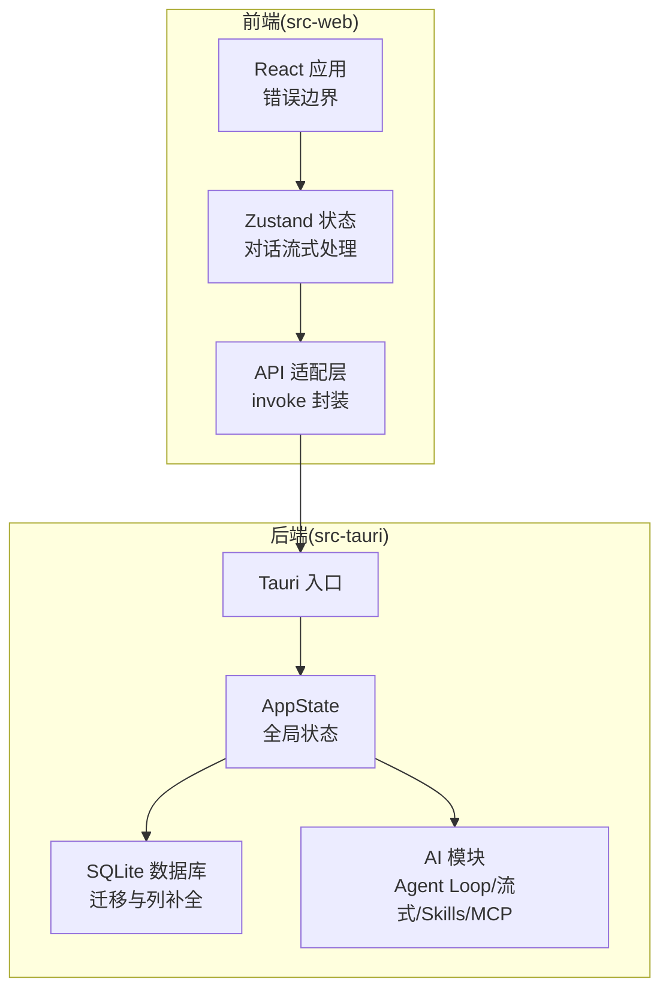
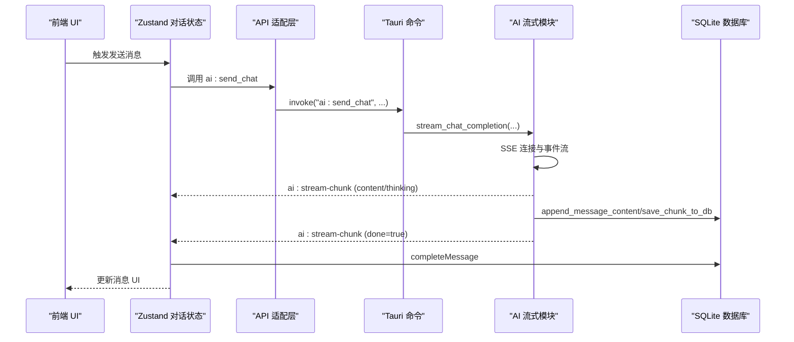
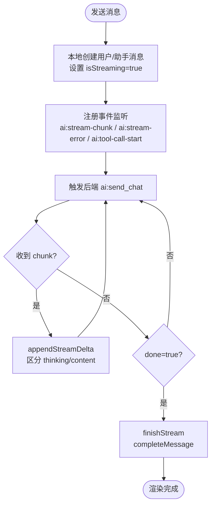
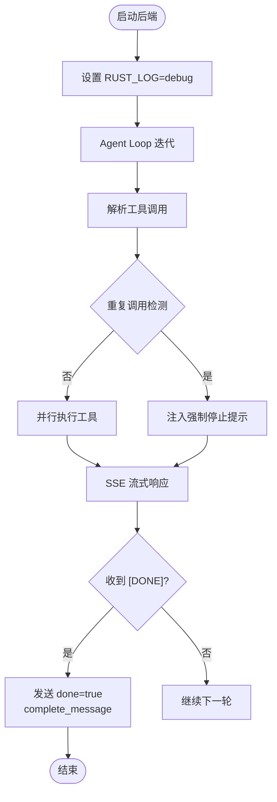
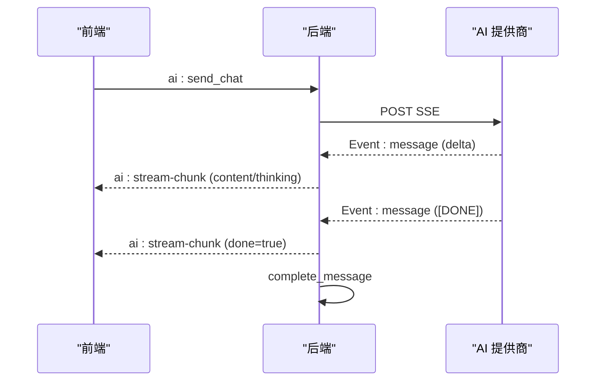
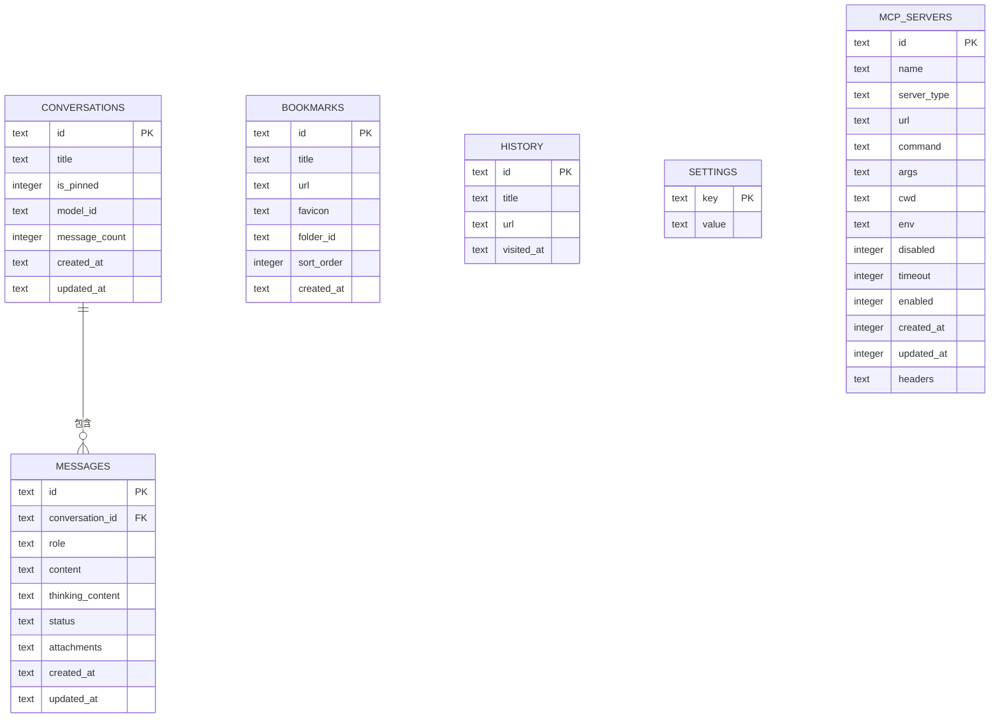
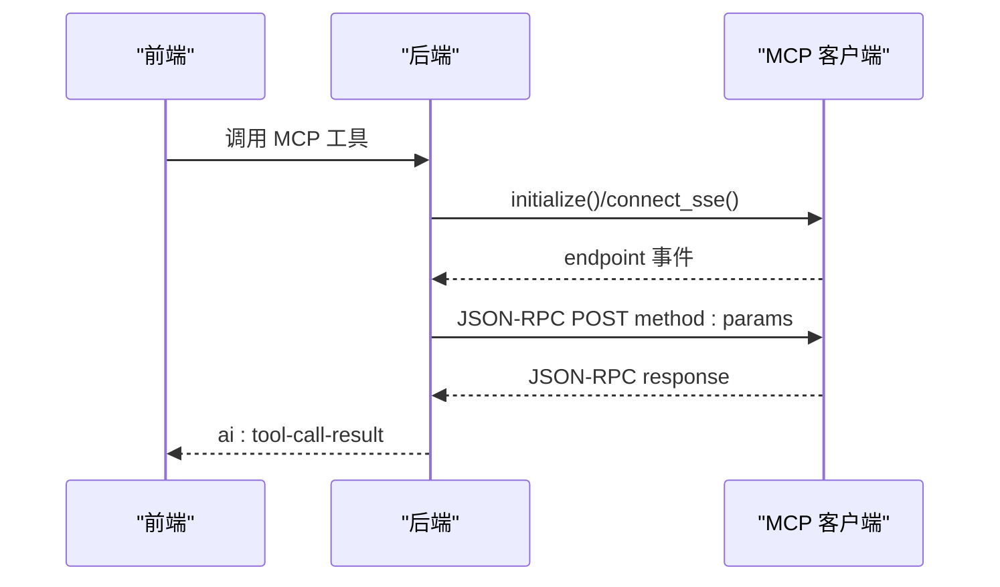
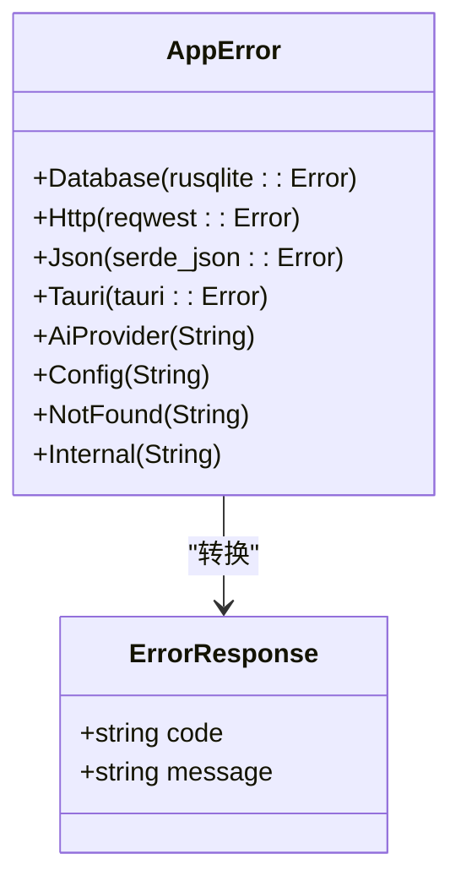
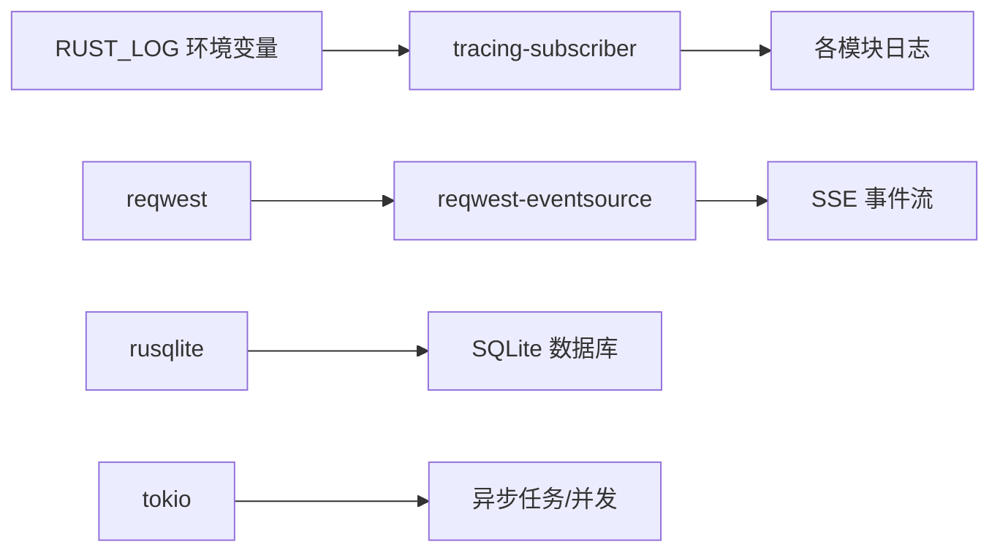

# 调试技巧

<cite>
**本文引用的文件**
- [README.md](file://README.md)
- [Cargo.toml](file://Cargo.toml)
- [src-web/src/main.tsx](file://src-web/src/main.tsx)
- [src-web/src/stores/conversationStore.ts](file://src-web/src/stores/conversationStore.ts)
- [src-web/src/lib/api.ts](file://src-web/src/lib/api.ts)
- [src-tauri/src/main.rs](file://src-tauri/src/main.rs)
- [src-tauri/src/state.rs](file://src-tauri/src/state.rs)
- [src-tauri/src/error.rs](file://src-tauri/src/error.rs)
- [src-tauri/src/db/mod.rs](file://src-tauri/src/db/mod.rs)
- [src-tauri/src/ai/stream.rs](file://src-tauri/src/ai/stream.rs)
- [src-tauri/src/ai/mcp.rs](file://src-tauri/src/ai/mcp.rs)
- [src-tauri/src/ai/skills_executors/mcp.rs](file://src-tauri/src/ai/skills_executors/mcp.rs)
- [electron/main.ts](file://electron/main.ts)
</cite>

## 目录
1. [简介](#简介)
2. [项目结构](#项目结构)
3. [核心组件](#核心组件)
4. [架构总览](#架构总览)
5. [详细组件分析](#详细组件分析)
6. [依赖关系分析](#依赖关系分析)
7. [性能考量](#性能考量)
8. [故障排查指南](#故障排查指南)
9. [结论](#结论)
10. [附录](#附录)

## 简介
本指南面向 CoSurf 项目的开发者与维护者，提供覆盖前端、后端、流式对话、数据库与错误处理的系统化调试方法。重点涵盖：
- 前端调试：浏览器开发者工具、React 错误边界、Zustand 状态调试
- 后端调试：RUST_LOG 环境变量、Agent Loop 日志、MCP 通信日志
- 流式对话：SSE 事件监控、WebSocket 连接状态、实时数据流分析
- 数据库调试：SQL 执行与优化、数据一致性检查、事务回滚调试
- 错误处理：前端错误边界、后端错误传播、日志记录与错误报告
- 常见场景：内存泄漏检测、性能瓶颈分析、并发问题排查

## 项目结构
CoSurf 采用桌面应用架构，前端基于 React/Vite，后端基于 Tauri/Rust，状态管理使用 Zustand，数据库使用 SQLite。关键模块包括：
- 前端：src-web（React + Zustand + Tauri Bridge）
- 后端：src-tauri（Tauri 命令 + Rust AI/数据库/MCP）
- 通用：packages/shared（共享类型）
- 可选：playwright-service（自动化服务）

图表来源
- [src-web/src/main.tsx:6-51](file://src-web/src/main.tsx#L6-L51)
- [src-web/src/stores/conversationStore.ts:1-365](file://src-web/src/stores/conversationStore.ts#L1-365)
- [src-web/src/lib/api.ts:12-19](file://src-web/src/lib/api.ts#L12-L19)
- [src-tauri/src/main.rs:1-6](file://src-tauri/src/main.rs#L1-L6)
- [src-tauri/src/state.rs:9-23](file://src-tauri/src/state.rs#L9-L23)
- [src-tauri/src/db/mod.rs:11-30](file://src-tauri/src/db/mod.rs#L11-L30)
- [src-tauri/src/ai/stream.rs:77-283](file://src-tauri/src/ai/stream.rs#L77-L283)

章节来源
- [README.md:213-328](file://README.md#L213-L328)

## 核心组件
- 前端错误边界：提供全局错误捕获与展示，便于定位前端异常。
- Zustand 对话状态：负责流式消息的接收、拼接与完成态标记。
- Tauri API 适配层：统一封装 invoke 调用，屏蔽底层 IPC 细节。
- 后端状态 AppState：持有数据库、取消标志、MCP 工具注册表等全局资源。
- 数据库层：SQLite 迁移、索引与列补全，保障数据一致性。
- AI 流式对话：SSE 接收、工具调用累积、thinking 内容分离、错误传播。
- MCP 客户端：支持 stdio/SSE/HTTP 传输，JSON-RPC 2.0 通信。

章节来源
- [src-web/src/main.tsx:6-51](file://src-web/src/main.tsx#L6-L51)
- [src-web/src/stores/conversationStore.ts:103-242](file://src-web/src/stores/conversationStore.ts#L103-L242)
- [src-web/src/lib/api.ts:12-19](file://src-web/src/lib/api.ts#L12-L19)
- [src-tauri/src/state.rs:9-23](file://src-tauri/src/state.rs#L9-L23)
- [src-tauri/src/db/mod.rs:41-148](file://src-tauri/src/db/mod.rs#L41-L148)
- [src-tauri/src/ai/stream.rs:77-283](file://src-tauri/src/ai/stream.rs#L77-L283)
- [src-tauri/src/ai/mcp.rs:45-151](file://src-tauri/src/ai/mcp.rs#L45-L151)

## 架构总览
前端通过 Tauri 桥接到后端，后端通过 SSE 与 AI 提供商交互，期间进行工具调用与 MCP 通信，最终将流式数据回传前端并持久化到 SQLite。

图表来源
- [src-web/src/stores/conversationStore.ts:172-242](file://src-web/src/stores/conversationStore.ts#L172-L242)
- [src-web/src/lib/api.ts:250-267](file://src-web/src/lib/api.ts#L250-L267)
- [src-tauri/src/ai/stream.rs:357-602](file://src-tauri/src/ai/stream.rs#L357-L602)
- [src-tauri/src/db/mod.rs:64-65](file://src-tauri/src/db/mod.rs#L64-L65)

## 详细组件分析

### 前端调试：React 错误边界与 Zustand 状态
- 错误边界：捕获前端渲染错误，打印堆栈并在页面展示，便于快速定位问题。
- 对话状态调试：
  - 控制台搜索关键词：ConversationStore、AIPanel 日志
  - 监听 ai:stream-chunk、ai:stream-error、ai:tool-call-start 事件
  - 关注 isStreaming、messages 结构变化，确认 thinking/content 区分与完成态
- API 适配层：封装 invoke，便于替换为 Electron IPC 或其他桥接方案。

图表来源
- [src-web/src/stores/conversationStore.ts:103-304](file://src-web/src/stores/conversationStore.ts#L103-L304)
- [src-web/src/lib/api.ts:250-267](file://src-web/src/lib/api.ts#L250-L267)

章节来源
- [src-web/src/main.tsx:6-51](file://src-web/src/main.tsx#L6-L51)
- [src-web/src/stores/conversationStore.ts:172-242](file://src-web/src/stores/conversationStore.ts#L172-L242)
- [README.md:534-546](file://README.md#L534-L546)

### 后端调试：RUST_LOG 与 Agent Loop
- 日志级别：设置 RUST_LOG=debug，查看 Agent Loop 迭代、工具调用、SSE 事件与 MCP 通信。
- 关键日志关键词：
  - Agent Loop iteration：迭代计数与消息数量
  - Found X tool calls：工具调用解析
  - SSE [DONE]/SSE stream error：SSE 生命周期与错误
  - MCP tool call response：MCP 工具调用响应
- 数据库：使用 DB Browser for SQLite 检查 conversations/messages/bookmarks/history/settings/mcp_servers 表。

图表来源
- [src-tauri/src/ai/stream.rs:84-283](file://src-tauri/src/ai/stream.rs#L84-L283)
- [src-tauri/src/ai/stream.rs:379-570](file://src-tauri/src/ai/stream.rs#L379-L570)

章节来源
- [README.md:541-546](file://README.md#L541-L546)
- [Cargo.toml:18-19](file://Cargo.toml#L18-L19)

### 流式对话调试：SSE 与 WebSocket
- SSE 监控：
  - 观察 ai:stream-chunk 事件的 delta、is_thinking、done 字段
  - 注意 [DONE] 与流结束但未收到 [DONE] 的差异处理
  - 检查工具调用累积（tool_calls）与暂停信号（done=false）
- WebSocket：
  - 若使用 WebSocket 作为替代通道，需在前端监听 onopen/onmessage/onerror/onclose
  - 对比 SSE 的事件驱动模型，关注连接超时、重连策略与消息去重
- 实时数据流分析：
  - 统计 chunk 数量、thinking/content 字符数、工具调用数量
  - 标记完成态与错误态，确保 UI 与 DB 一致

图表来源
- [src-tauri/src/ai/stream.rs:357-602](file://src-tauri/src/ai/stream.rs#L357-L602)
- [src-web/src/stores/conversationStore.ts:172-217](file://src-web/src/stores/conversationStore.ts#L172-L217)

章节来源
- [src-tauri/src/ai/stream.rs:357-602](file://src-tauri/src/ai/stream.rs#L357-L602)
- [src-web/src/stores/conversationStore.ts:172-217](file://src-web/src/stores/conversationStore.ts#L172-L217)

### 数据库调试：SQLite 与一致性
- 迁移与索引：
  - WAL 模式、外键约束启用
  - conversations/messages/bookmarks/history/settings/mcp_servers 表结构
  - 索引：messages(conversation_id)、history(visited_at DESC)
- 列补全与迁移：
  - thinking_content 字段补全与旧数据迁移
  - mcp_servers 新增列（server_type/url/cwd/timeout/enabled/headers）补全
  - messages 表 feedback 列补全
- 一致性检查：
  - 对比前端 UI 与 DB 数据，确认 status/complete/error 一致
  - 使用 EXPLAIN QUERY PLAN 分析慢查询，必要时补充索引
- 事务回滚调试：
  - 将大事务拆分为小事务，避免长时间锁表
  - 使用 BEGIN/COMMIT/ROLLBACK 检查中间状态，定位失败点

图表来源
- [src-tauri/src/db/mod.rs:44-132](file://src-tauri/src/db/mod.rs#L44-L132)

章节来源
- [src-tauri/src/db/mod.rs:41-148](file://src-tauri/src/db/mod.rs#L41-L148)

### MCP 通信调试：客户端与传输
- 传输模式：
  - stdio：子进程启动 MCP Server，适合本地工具
  - SSE：Server-Sent Events，需解析 endpoint 事件
  - Streamable HTTP：HTTP 流式，遵循 JSON-RPC 2.0
- 日志关键词：SSE: Connecting/endpoint、JSON-RPC 调用、工具调用响应
- 常见问题：
  - SSE endpoint 未在时限内返回
  - HTTP 流中断或非标准响应
  - 工具参数解析失败导致调用错误

图表来源
- [src-tauri/src/ai/skills_executors/mcp.rs:307-432](file://src-tauri/src/ai/skills_executors/mcp.rs#L307-L432)
- [src-tauri/src/ai/mcp.rs:62-104](file://src-tauri/src/ai/mcp.rs#L62-L104)

章节来源
- [src-tauri/src/ai/mcp.rs:45-151](file://src-tauri/src/ai/mcp.rs#L45-L151)
- [src-tauri/src/ai/skills_executors/mcp.rs:307-432](file://src-tauri/src/ai/skills_executors/mcp.rs#L307-L432)

### 错误处理与异常捕获
- 前端：
  - 错误边界捕获渲染错误，记录错误信息与堆栈
  - 对话状态在异常时发送 ai:stream-error，并标记完成
- 后端：
  - AppError 枚举覆盖数据库/HTTP/JSON/Tauri/AI/配置/内部错误
  - ErrorResponse 将错误映射为统一结构，便于前端展示
  - SSE 流错误时发送 ai:stream-error，并将消息状态置为 error

图表来源
- [src-tauri/src/error.rs:4-63](file://src-tauri/src/error.rs#L4-L63)

章节来源
- [src-web/src/main.tsx:6-51](file://src-web/src/main.tsx#L6-L51)
- [src-tauri/src/error.rs:47-61](file://src-tauri/src/error.rs#L47-L61)
- [src-tauri/src/ai/stream.rs:547-568](file://src-tauri/src/ai/stream.rs#L547-L568)

## 依赖关系分析
- 日志依赖：tracing/tracing-subscriber，通过 env-filter 控制日志级别
- 网络：reqwest + reqwest-eventsource，SSE 事件流
- 数据库：rusqlite，WAL 模式与外键约束
- 并发：Tokio 异步运行时，原子布尔取消标志

图表来源
- [Cargo.toml:18-19](file://Cargo.toml#L18-L19)
- [src-tauri/src/ai/stream.rs:2-3](file://src-tauri/src/ai/stream.rs#L2-L3)
- [src-tauri/src/db/mod.rs:24-25](file://src-tauri/src/db/mod.rs#L24-L25)

章节来源
- [Cargo.toml:13-29](file://Cargo.toml#L13-L29)

## 性能考量
- 前端：
  - 避免不必要的重渲染：合理拆分组件、使用浅比较、减少订阅范围
  - 流式渲染：按块增量更新，避免一次性拼接大量字符串
- 后端：
  - SSE 流：及时清理累积的 tool_calls，避免内存膨胀
  - 工具调用：并行执行但限制并发度，避免资源争用
  - 数据库：批量写入、索引优化、避免长事务
- 并发：
  - 使用 AtomicBool 控制取消，避免阻塞主线程
  - 合理设置超时与重试策略

## 故障排查指南
- 常见问题与解决
  - 端口冲突：修改前端开发端口（Vite 配置）
  - WebView2 问题：确保系统已安装最新 WebView2 Runtime
  - Rust 编译失败：关闭占用进程后重试
  - MCP 工具调用无结果：检查 MCP Server 连接参数与传输模式
- 日志定位
  - 前端：搜索 ConversationStore、AIPanel 相关日志
  - 后端：搜索 Agent Loop、工具调用、SSE、MCP 通信日志
- 数据库检查
  - 使用 DB Browser for SQLite 查看表结构与数据
  - 关注 status 字段与完成态一致性

章节来源
- [README.md:548-557](file://README.md#L548-L557)

## 结论
通过结合前端错误边界、Zustand 状态调试、RUST_LOG 日志、SSE 事件监控与 SQLite 数据库一致性检查，可以系统化地定位与解决 CoSurf 的各类问题。针对 MCP 与 Agent Loop 的调试，建议优先从日志与事件流入手，逐步缩小范围至具体工具或传输层。

## 附录
- 开发模式与启动
  - 前端：Vite 开发服务器（HMR）
  - 后端：Tauri 自动编译与热重载
- Electron 主进程（可选）
  - 主窗口创建、原生模块初始化、IPC 处理器注册、全局快捷键

章节来源
- [README.md:170-186](file://README.md#L170-L186)
- [electron/main.ts:32-148](file://electron/main.ts#L32-L148)