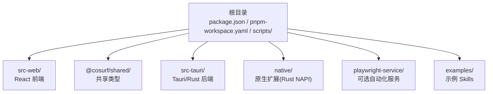
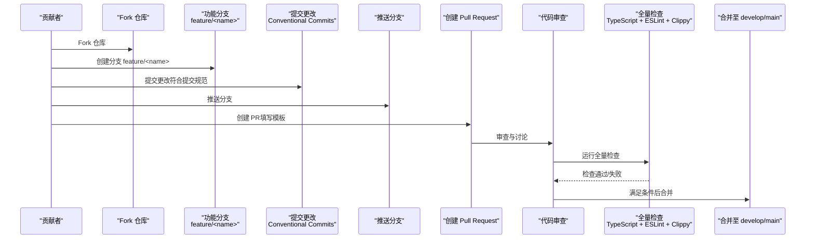
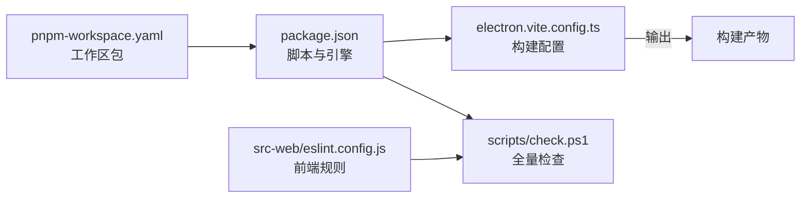

# 贡献指南

<cite>
**本文引用的文件**
- [README.md](file://README.md)
- [package.json](file://package.json)
- [Cargo.toml](file://Cargo.toml)
- [scripts/check.ps1](file://scripts/check.ps1)
- [scripts/dev.ps1](file://scripts/dev.ps1)
- [src-web/eslint.config.js](file://src-web/eslint.config.js)
- [electron.vite.config.ts](file://electron.vite.config.ts)
- [pnpm-workspace.yaml](file://pnpm-workspace.yaml)
- [SUMMARIZE_PAGE_OPTIMIZATION.md](file://SUMMARIZE_PAGE_OPTIMIZATION.md)
- [BROWSER_AUTOMATION_GUIDE.md](file://BROWSER_AUTOMATION_GUIDE.md)
</cite>

## 目录
1. [简介](#简介)
2. [项目结构](#项目结构)
3. [核心组件](#核心组件)
4. [架构总览](#架构总览)
5. [详细组件分析](#详细组件分析)
6. [依赖分析](#依赖分析)
7. [性能考量](#性能考量)
8. [故障排查指南](#故障排查指南)
9. [结论](#结论)
10. [附录](#附录)

## 简介
本指南面向所有希望参与 CoSurf 项目的贡献者，涵盖从 Fork 仓库、创建功能分支、提交代码、创建 Pull Request 的完整流程；说明分支管理策略（main、develop、feature）的命名规范与使用规则；给出代码提交规范（Conventional Commits）与类型分类；提供 Pull Request 的创建与审查流程（模板填写、代码审查要求、测试验证、合并条件）；解释问题报告与功能请求的流程（Issue 模板、问题分类、优先级评估）；说明文档贡献方式（文档更新、示例添加、翻译贡献）；并提供社区参与指导（讨论参与、技术支持、反馈收集）。最后包含新贡献者的入门指导与常见问题解答。

## 项目结构
CoSurf 采用多包工作区（pnpm workspace）组织，前端为 React/Vite，后端为 Tauri/Rust，同时包含共享类型包、Playwright 服务以及示例技能等模块。开发与构建脚本集中在根目录的 package.json 与 scripts 目录中，便于统一执行类型检查、ESLint、Clippy 与全量检查。

图表来源
- [pnpm-workspace.yaml:1-5](file://pnpm-workspace.yaml#L1-L5)
- [package.json:14-30](file://package.json#L14-L30)

章节来源
- [pnpm-workspace.yaml:1-5](file://pnpm-workspace.yaml#L1-L5)
- [package.json:14-30](file://package.json#L14-L30)
- [README.md:213-328](file://README.md#L213-L328)

## 核心组件
- 贡献流程与规范
  - Fork 仓库、创建功能分支、提交更改、推送分支、创建 Pull Request 的标准流程已在项目文档中明确。
  - 提交信息遵循 Conventional Commits 规范，类型包括 feat、fix、docs、style、refactor、perf、test、build、ci、chore、revert 等。
- 分支管理策略
  - main：稳定发布分支，合并来自 develop 的功能。
  - develop：日常开发分支，合并来自 feature 的功能。
  - feature：功能开发分支，命名规范为 feature/<name>，完成后合并至 develop。
- 代码质量与检查
  - 全量检查脚本会依次执行 TypeScript 类型检查、ESLint 与 Rust Clippy，并在遇到错误时停止。
  - 开发模式脚本负责构建共享类型、启动 Playwright 服务与 Tauri 开发服务器。
- 提交流程与审查
  - PR 创建后需通过代码审查、测试验证与必要的文档更新，满足合并条件方可合入。

章节来源
- [README.md:576-598](file://README.md#L576-L598)
- [scripts/check.ps1:1-17](file://scripts/check.ps1#L1-L17)
- [scripts/dev.ps1:1-13](file://scripts/dev.ps1#L1-L13)

## 架构总览
贡献相关的关键流程与工具如下：

图表来源
- [README.md:576-598](file://README.md#L576-L598)
- [scripts/check.ps1:1-17](file://scripts/check.ps1#L1-L17)

## 详细组件分析

### 分支管理策略
- main 分支
  - 用途：稳定发布，保持可部署状态。
  - 合并来源：通常从 develop 合并。
- develop 分支
  - 用途：日常开发，集成来自 feature 的功能。
  - 合并来源：feature/<name>。
- feature 分支
  - 命名规范：feature/<name>，其中 name 语义化描述功能。
  - 合并策略：完成开发并通过审查后合并至 develop。

章节来源
- [README.md:580-587](file://README.md#L580-L587)

### 提交信息规范（Conventional Commits）
- 类型分类
  - feat：新增功能
  - fix：修复缺陷
  - docs：仅文档变更
  - style：不影响代码含义的更改（空白、格式化等）
  - refactor：既不修复错误也不添加功能的重构
  - perf：性能优化
  - test：增加/修改测试
  - build、ci、chore、revert：构建流程、CI、常规维护与回滚
- 描述规范
  - 使用祈使句，简明扼要描述变更内容。
  - 如涉及问题编号，可在正文末尾引用（例如：Closes #123）。
- 示例路径
  - 提交信息规范与类型说明参见项目贡献章节。

章节来源
- [README.md:588-592](file://README.md#L588-L592)

### Pull Request 创建与审查流程
- PR 模板与填写
  - 建议在创建 PR 时按模板填写标题、描述、变更动机、测试验证情况与相关 Issue 编号。
- 代码审查要求
  - 代码风格与逻辑需通过审查，确保可读性与一致性。
  - 前端遵循 ESLint 规则，后端遵循 Clippy 与 Rust API Guidelines。
- 测试验证
  - 在本地运行全量检查（TypeScript 类型检查 + ESLint + Clippy）。
  - 若涉及浏览器自动化或页面总结等复杂功能，参考相关优化与指南文档进行验证。
- 合并条件
  - 通过审查、测试通过、文档更新（如有必要）后方可合入。

章节来源
- [README.md:588-598](file://README.md#L588-L598)
- [scripts/check.ps1:1-17](file://scripts/check.ps1#L1-L17)
- [src-web/eslint.config.js:1-29](file://src-web/eslint.config.js#L1-L29)
- [SUMMARIZE_PAGE_OPTIMIZATION.md:1-156](file://SUMMARIZE_PAGE_OPTIMIZATION.md#L1-L156)
- [BROWSER_AUTOMATION_GUIDE.md:1-365](file://BROWSER_AUTOMATION_GUIDE.md#L1-L365)

### 问题报告与功能请求
- Issue 模板
  - 建议使用模板填写标题、环境信息、复现步骤、期望行为与实际行为。
- 问题分类
  - bug、enhancement、question、help wanted 等。
- 优先级评估
  - 依据影响范围、紧急程度与资源投入进行评估。
- 文档与示例
  - 提供最小可复现示例与相关日志，有助于快速定位问题。

章节来源
- [README.md:576-598](file://README.md#L576-L598)

### 文档贡献方式
- 文档更新
  - 包括用户文档、技术文档与最佳实践指南。
- 示例添加
  - 示例技能、自动化场景与页面总结优化案例等。
- 翻译贡献
  - 保持与最新版本一致，避免遗漏关键变更。

章节来源
- [README.md:576-598](file://README.md#L576-L598)
- [SUMMARIZE_PAGE_OPTIMIZATION.md:1-156](file://SUMMARIZE_PAGE_OPTIMIZATION.md#L1-L156)
- [BROWSER_AUTOMATION_GUIDE.md:1-365](file://BROWSER_AUTOMATION_GUIDE.md#L1-L365)

### 社区参与指导
- 讨论参与
  - 通过 Issue/PR 讨论功能设计与实现细节。
- 技术支持
  - 提供环境信息、日志与复现步骤，便于他人协助。
- 反馈收集
  - 关注用户反馈，及时修复与优化。

章节来源
- [README.md:576-598](file://README.md#L576-L598)

### 新贡献者入门指导
- 环境准备
  - Node.js、pnpm、Rust 等基础依赖与版本要求。
- 克隆与安装
  - 使用 pnpm 安装工作区依赖。
- 开发模式
  - 使用提供的脚本启动前端与后端开发环境。
- 全量检查
  - 在提交前运行全量检查，确保类型、风格与代码质量。

章节来源
- [README.md:117-212](file://README.md#L117-L212)
- [scripts/dev.ps1:1-13](file://scripts/dev.ps1#L1-L13)
- [scripts/check.ps1:1-17](file://scripts/check.ps1#L1-L17)

### 常见问题解答
- 端口冲突
  - 若 1420 端口被占用，可在前端配置中调整端口。
- WebView2 问题
  - 确保系统已安装最新 WebView2 Runtime。
- Rust 编译失败
  - 关闭所有 CoSurf 进程后重试，避免进程锁导致的编译失败。
- MCP 工具调用无结果
  - 检查 MCP Server 是否正常运行及设置中的连接参数。

章节来源
- [README.md:548-557](file://README.md#L548-L557)

## 依赖分析
- 工作区与包管理
  - pnpm workspace 组织 src-web、playwright-service 与 packages/*。
- 构建与开发
  - electron-vite 配置分别构建主进程、preload 与渲染进程；Vite 端口默认 1420。
- 质量工具
  - TypeScript 类型检查、ESLint 与 Rust Clippy 作为全量检查的核心工具。

图表来源
- [package.json:14-30](file://package.json#L14-L30)
- [pnpm-workspace.yaml:1-5](file://pnpm-workspace.yaml#L1-L5)
- [electron.vite.config.ts:14-74](file://electron.vite.config.ts#L14-L74)
- [scripts/check.ps1:1-17](file://scripts/check.ps1#L1-L17)
- [src-web/eslint.config.js:1-29](file://src-web/eslint.config.js#L1-L29)

章节来源
- [package.json:14-30](file://package.json#L14-L30)
- [pnpm-workspace.yaml:1-5](file://pnpm-workspace.yaml#L1-L5)
- [electron.vite.config.ts:14-74](file://electron.vite.config.ts#L14-L74)
- [scripts/check.ps1:1-17](file://scripts/check.ps1#L1-L17)
- [src-web/eslint.config.js:1-29](file://src-web/eslint.config.js#L1-L29)

## 性能考量
- 构建优化
  - Rust 发布配置启用 LTO、优化级别与符号剥离，减小二进制体积。
- 前端开发体验
  - Vite 热更新与 HMR 提升开发效率；如遇端口冲突可调整配置。
- 自动化与页面总结
  - 页面总结优化文档提供了请求-响应机制、超时控制与缓存清理等策略，有助于提升稳定性与性能。

章节来源
- [Cargo.toml:23-29](file://Cargo.toml#L23-L29)
- [electron.vite.config.ts:64-67](file://electron.vite.config.ts#L64-L67)
- [SUMMARIZE_PAGE_OPTIMIZATION.md:87-102](file://SUMMARIZE_PAGE_OPTIMIZATION.md#L87-L102)

## 故障排查指南
- 端口冲突
  - 修改前端配置中的端口后重试。
- WebView2 问题
  - 确认系统已安装最新 WebView2 Runtime。
- Rust 编译失败
  - 关闭所有 CoSurf 进程后重试编译。
- MCP 工具调用无结果
  - 检查 MCP Server 是否正常运行与连接参数是否正确。
- 全量检查失败
  - 逐项修正类型错误、ESLint 规则与 Clippy 警告。

章节来源
- [README.md:548-557](file://README.md#L548-L557)
- [scripts/check.ps1:1-17](file://scripts/check.ps1#L1-L17)

## 结论
本指南为 CoSurf 项目的贡献者提供了从入门到协作的完整路径：明确的分支策略、严格的提交规范、完善的 PR 审查与测试流程、清晰的问题报告与功能请求机制，以及文档与社区参与的指导。建议贡献者在提交前运行全量检查，确保代码质量与可维护性，并在 PR 中充分说明变更动机与验证情况，以便高效协作与快速交付。

## 附录
- 快速参考
  - 环境要求与安装：参见“快速开始”章节。
  - 开发模式与构建：参见“开发模式”与“构建发布版本”章节。
  - 全量检查：参见“全量检查”章节与 scripts/check.ps1。

章节来源
- [README.md:117-212](file://README.md#L117-L212)
- [README.md:204-212](file://README.md#L204-L212)
- [scripts/check.ps1:1-17](file://scripts/check.ps1#L1-L17)