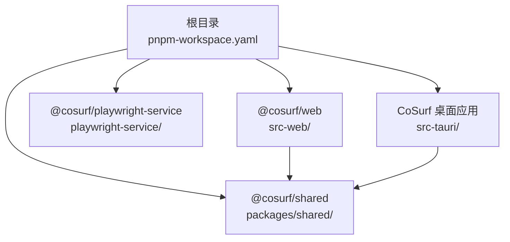
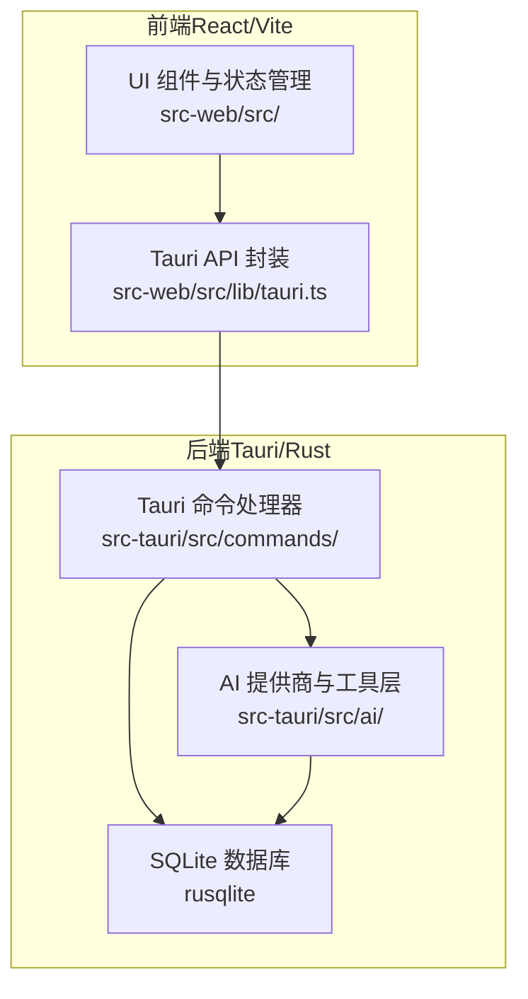
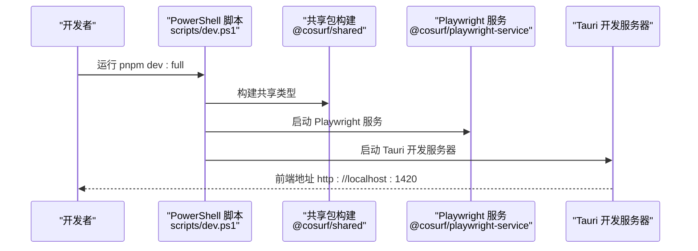
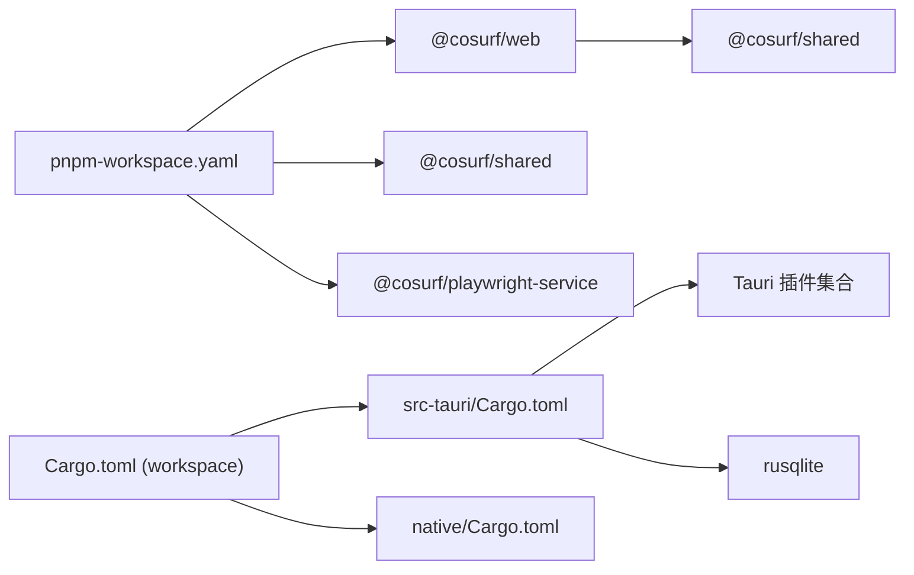

# 快速开始

<cite>
**本文引用的文件**
- [README.md](file://README.md)
- [package.json](file://package.json)
- [pnpm-workspace.yaml](file://pnpm-workspace.yaml)
- [Cargo.toml](file://Cargo.toml)
- [src-tauri/Cargo.toml](file://src-tauri/Cargo.toml)
- [src-tauri/tauri.conf.json](file://src-tauri/tauri.conf.json)
- [src-web/vite.config.ts](file://src-web/vite.config.ts)
- [src-web/package.json](file://src-web/package.json)
- [scripts/dev.ps1](file://scripts/dev.ps1)
- [scripts/build.ps1](file://scripts/build.ps1)
- [scripts/check.ps1](file://scripts/check.ps1)
- [src-tauri/src/main.rs](file://src-tauri/src/main.rs)
- [src-web/src/App.tsx](file://src-web/src/App.tsx)
</cite>

## 目录
1. [简介](#简介)
2. [项目结构](#项目结构)
3. [核心组件](#核心组件)
4. [架构总览](#架构总览)
5. [详细组件分析](#详细组件分析)
6. [依赖分析](#依赖分析)
7. [性能考虑](#性能考虑)
8. [故障排除指南](#故障排除指南)
9. [结论](#结论)
10. [附录](#附录)

## 简介
CoSurf 是一款 AI 驱动的桌面阅读伴侣，结合 React 前端与 Tauri/Rust 后端，提供流式对话、Agent Loop、MCP 工具链、页面上下文感知与多模型支持。本“快速开始”面向首次使用者，覆盖环境准备、安装、启动、配置与基本操作，并给出常见问题排查。

## 项目结构
- 工作区采用 pnpm workspaces，包含前端、共享包、可选的 Playwright 服务与 Rust 后端。
- 前端位于 src-web，使用 Vite 6 + React 18；后端位于 src-tauri，使用 Tauri 2.x + Rust 1.88。
- 顶层脚本通过 PowerShell 脚本协调多包构建与开发流程。

图表来源
- [pnpm-workspace.yaml:1-5](file://pnpm-workspace.yaml#L1-L5)
- [src-web/package.json:1-44](file://src-web/package.json#L1-L44)
- [package.json:1-48](file://package.json#L1-L48)

章节来源
- [README.md:213-328](file://README.md#L213-L328)
- [pnpm-workspace.yaml:1-5](file://pnpm-workspace.yaml#L1-L5)

## 核心组件
- 前端（React/Vite）：负责 UI 布局、对话面板、设置页面、状态管理与与后端的 IPC 通信。
- 后端（Tauri/Rust）：提供 Tauri 命令、SQLite 数据持久化、AI 提供商适配、MCP 客户端、工具调度与 Agent Loop。
- 共享包（@cosurf/shared）：跨前端与后端的类型定义与工具接口。
- 可选服务（Playwright）：提供浏览器自动化能力（可选）。

章节来源
- [README.md:53-116](file://README.md#L53-L116)
- [src-web/package.json:14-26](file://src-web/package.json#L14-L26)
- [src-tauri/Cargo.toml:21-70](file://src-tauri/Cargo.toml#L21-L70)

## 架构总览
CoSurf 采用“前端（React）+ 后端（Tauri/Rust）+ 共享类型”的三层架构。前端通过 Tauri 暴露的命令与后端交互，后端通过 SQLite 存储数据，通过 AI 提供商或 MCP 工具扩展能力。

图表来源
- [README.md:55-100](file://README.md#L55-L100)
- [src-tauri/tauri.conf.json:6-11](file://src-tauri/tauri.conf.json#L6-L11)
- [src-web/package.json:14-26](file://src-web/package.json#L14-L26)

## 详细组件分析

### 环境要求与系统依赖
- 运行时
  - Node.js >= 20.0.0
  - pnpm >= 9.0.0
  - Rust >= 1.88.0（Tauri 会自动安装）
  - Windows 10/11（WebView2 已内置）
- 开发时依赖
  - Tauri CLI、Electron、Vite、TypeScript、ESLint、Rust 工具链

章节来源
- [README.md:119-125](file://README.md#L119-L125)
- [package.json:42-47](file://package.json#L42-L47)
- [src-tauri/Cargo.toml:1-70](file://src-tauri/Cargo.toml#L1-L70)

### 安装步骤
- 克隆项目与安装依赖
  - 克隆仓库并进入目录
  - 安装工作区依赖
- 首次使用
  - 启动完整开发环境（推荐）
  - 配置 AI 模型（添加模型、填写 API Key、设置活跃模型）
  - 开始对话与体验 Agent Loop

章节来源
- [README.md:126-143](file://README.md#L126-L143)
- [README.md:144-170](file://README.md#L144-L170)

### 开发模式与生产模式
- 开发模式
  - pnpm dev：仅启动前端 Vite 开发服务器（端口 1420）
  - pnpm dev:full / pnpm dev:tauri：完整开发模式，同时启动前端与 Tauri 后端
- 生产模式
  - pnpm build / pnpm build:tauri：构建 Tauri 应用
  - pnpm build:release：完整发布构建（包含类型检查与打包）

章节来源
- [README.md:170-202](file://README.md#L170-L202)
- [package.json:14-30](file://package.json#L14-L30)
- [src-tauri/tauri.conf.json:6-11](file://src-tauri/tauri.conf.json#L6-L11)

### 首次使用全流程
- 启动应用
  - 使用完整开发模式启动
- 配置 AI 模型
  - 打开设置 → 模型标签页 → 添加模型 → 填写 API Key → 设为活跃模型
- 开始对话
  - 打开 AI 面板，输入问题，体验流式输出与 Agent Loop
- 示例任务
  - 打开特定网站并总结内容、联网搜索、翻译等

章节来源
- [README.md:144-170](file://README.md#L144-L170)
- [README.md:375-422](file://README.md#L375-L422)

### 关键流程图：完整开发启动序列

图表来源
- [scripts/dev.ps1:1-13](file://scripts/dev.ps1#L1-L13)
- [package.json:17](file://package.json#L17)

## 依赖分析
- 工作区与包管理
  - pnpm workspace 管理 @cosurf/web、@cosurf/shared、@cosurf/playwright-service
  - 顶层 engines 限制 Node/pnpm 版本
- Rust 工作区
  - workspace 成员包含 src-tauri 与 native
  - 顶层 Cargo.toml 定义工作区依赖与发布配置
- 前端依赖
  - React 18、Zustand、Tailwind CSS、@tauri-apps/api 等
- Tauri 依赖
  - 多个官方插件（shell、dialog、fs、global-shortcut、http、notification、updater、window-state）
  - rusqlite、reqwest、regex、dirs 等

图表来源
- [pnpm-workspace.yaml:1-5](file://pnpm-workspace.yaml#L1-L5)
- [Cargo.toml:1-29](file://Cargo.toml#L1-L29)
- [src-tauri/Cargo.toml:21-70](file://src-tauri/Cargo.toml#L21-L70)
- [src-web/package.json:14-26](file://src-web/package.json#L14-L26)

章节来源
- [pnpm-workspace.yaml:1-5](file://pnpm-workspace.yaml#L1-L5)
- [Cargo.toml:1-29](file://Cargo.toml#L1-L29)
- [src-tauri/Cargo.toml:21-70](file://src-tauri/Cargo.toml#L21-L70)
- [src-web/package.json:14-26](file://src-web/package.json#L14-L26)

## 性能考虑
- 开发阶段启用热模块替换（HMR），修改前端代码后自动刷新
- Rust 后端在开发模式下自动重新编译，减少手工干预
- 生产构建启用 LTO、优化与符号剥离，减小体积并提升运行效率
- 前端构建目标针对现代浏览器，最小化与 SourceMap 可按需开启

章节来源
- [README.md:182-186](file://README.md#L182-L186)
- [Cargo.toml:23-29](file://Cargo.toml#L23-L29)
- [src-web/vite.config.ts:30-35](file://src-web/vite.config.ts#L30-L35)

## 故障排除指南
- 端口冲突
  - 前端开发端口为 1420，若被占用请修改前端配置中的端口
- WebView2 问题
  - 确保系统已安装最新 WebView2 Runtime
- Rust 编译失败
  - 关闭所有正在运行的 CoSurf 进程后重试
- MCP 工具调用无结果
  - 检查 MCP Server 是否正常运行及设置中的连接参数
- 构建失败
  - 使用全量检查脚本先运行类型检查、ESLint 与 Clippy，定位问题后再构建

章节来源
- [README.md:548-557](file://README.md#L548-L557)
- [scripts/check.ps1:1-17](file://scripts/check.ps1#L1-L17)

## 结论
通过本快速开始指南，你可以在 Windows 环境下完成 CoSurf 的环境准备、安装与首次使用。建议优先使用完整开发模式（pnpm dev:full）以获得最佳开发体验，并在需要时切换到生产构建（pnpm build:release）生成安装包。

## 附录

### 常用命令速查
- 开发
  - pnpm dev：前端开发服务器
  - pnpm dev:full：完整开发模式
  - pnpm dev:tauri：仅 Tauri 开发
- 构建
  - pnpm build：前端构建
  - pnpm build:tauri：Tauri 构建
  - pnpm build:release：完整发布构建
- 质量检查
  - pnpm check：全量检查（类型 + ESLint + Clippy）
- 其他
  - pnpm clean：清理依赖与构建产物

章节来源
- [README.md:170-212](file://README.md#L170-L212)
- [package.json:14-30](file://package.json#L14-L30)
- [scripts/check.ps1:1-17](file://scripts/check.ps1#L1-L17)

### 配置要点
- 前端开发服务器端口与 HMR
  - 端口：1420；严格端口；可配置 host
- Tauri 开发/构建前置命令
  - beforeDevCommand：构建共享类型与前端开发
  - beforeBuildCommand：构建共享类型与前端生产
- 前端构建目标
  - 面向现代浏览器，按需启用 SourceMap

章节来源
- [src-web/vite.config.ts:14-28](file://src-web/vite.config.ts#L14-L28)
- [src-tauri/tauri.conf.json:6-11](file://src-tauri/tauri.conf.json#L6-L11)
- [src-web/tsconfig.app.json:1-26](file://src-web/tsconfig.app.json#L1-L26)