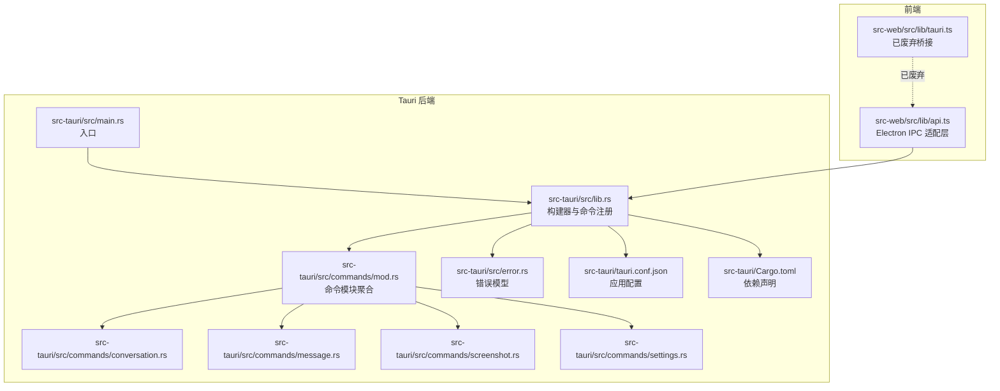
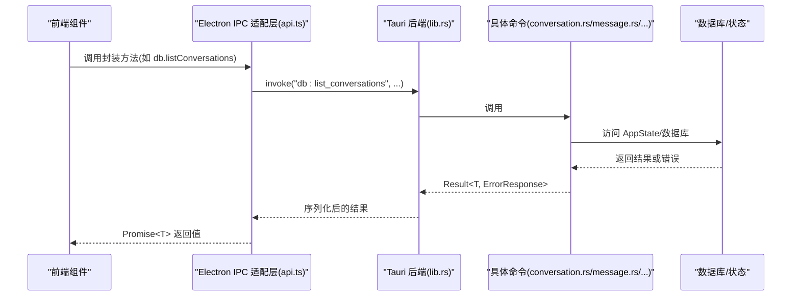
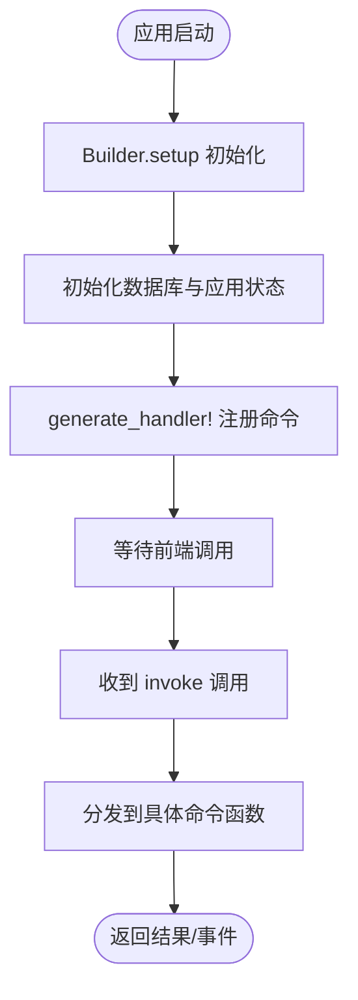
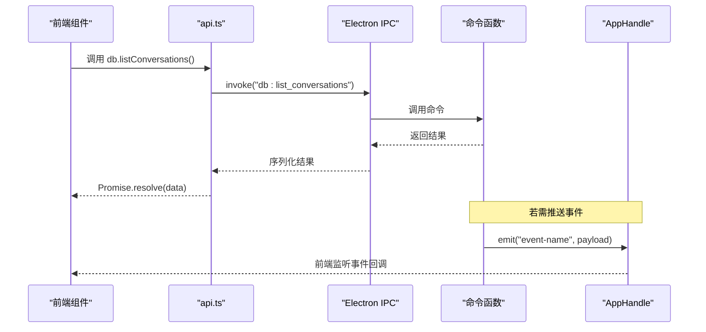
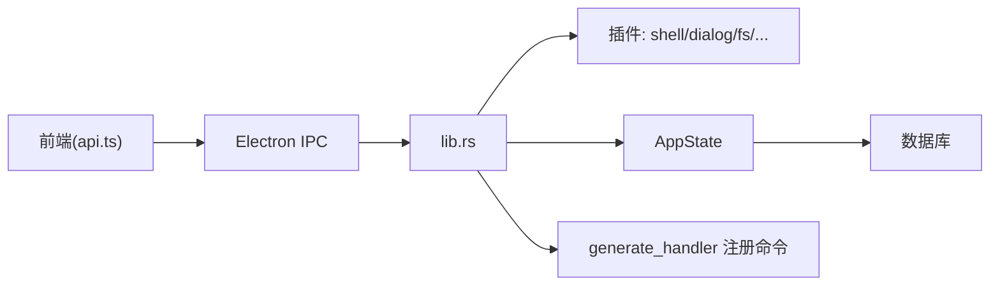

# 命令扩展开发

<cite>
**本文引用的文件**
- [src-tauri/src/lib.rs](file://src-tauri/src/lib.rs)
- [src-tauri/src/main.rs](file://src-tauri/src/main.rs)
- [src-tauri/src/commands/mod.rs](file://src-tauri/src/commands/mod.rs)
- [src-tauri/Cargo.toml](file://src-tauri/Cargo.toml)
- [src-tauri/tauri.conf.json](file://src-tauri/tauri.conf.json)
- [src-tauri/src/commands/conversation.rs](file://src-tauri/src/commands/conversation.rs)
- [src-tauri/src/commands/message.rs](file://src-tauri/src/commands/message.rs)
- [src-tauri/src/commands/screenshot.rs](file://src-tauri/src/commands/screenshot.rs)
- [src-tauri/src/commands/settings.rs](file://src-tauri/src/commands/settings.rs)
- [src-tauri/src/error.rs](file://src-tauri/src/error.rs)
- [src-web/src/lib/tauri.ts](file://src-web/src/lib/tauri.ts)
- [src-web/src/lib/api.ts](file://src-web/src/lib/api.ts)
</cite>

## 目录
1. [简介](#简介)
2. [项目结构](#项目结构)
3. [核心组件](#核心组件)
4. [架构总览](#架构总览)
5. [详细组件分析](#详细组件分析)
6. [依赖关系分析](#依赖关系分析)
7. [性能考量](#性能考量)
8. [故障排查指南](#故障排查指南)
9. [结论](#结论)
10. [附录](#附录)

## 简介
本指南面向希望为 CoSurf 的 Tauri 后端新增命令扩展的开发者。文档基于仓库现有实现，系统讲解命令函数的实现方式、#[tauri::command] 宏的使用、参数校验与返回值处理、命令模块组织与注册流程、命令生命周期管理、与前端的交互方式（invoke 调用、事件监听、错误处理）、安全注意事项、测试与调试方法以及性能优化建议。由于当前前端桥接已迁移至 Electron，文档同时给出与 Electron IPC 的对应映射，帮助读者正确对接。

## 项目结构
CoSurf 的 Tauri 后端位于 src-tauri 目录，采用模块化组织命令，入口在 lib.rs 中集中注册。前端通过 Electron IPC 与后端通信，而非直接使用 Tauri invoke。

**图表来源**
- [src-tauri/src/main.rs:1-6](file://src-tauri/src/main.rs#L1-L6)
- [src-tauri/src/lib.rs:1-258](file://src-tauri/src/lib.rs#L1-L258)
- [src-tauri/src/commands/mod.rs:1-13](file://src-tauri/src/commands/mod.rs#L1-L13)
- [src-tauri/src/commands/conversation.rs:1-73](file://src-tauri/src/commands/conversation.rs#L1-L73)
- [src-tauri/src/commands/message.rs:1-99](file://src-tauri/src/commands/message.rs#L1-L99)
- [src-tauri/src/commands/screenshot.rs:1-165](file://src-tauri/src/commands/screenshot.rs#L1-L165)
- [src-tauri/src/commands/settings.rs:1-615](file://src-tauri/src/commands/settings.rs#L1-L615)
- [src-tauri/src/error.rs:1-64](file://src-tauri/src/error.rs#L1-L64)
- [src-tauri/tauri.conf.json:1-72](file://src-tauri/tauri.conf.json#L1-L72)
- [src-tauri/Cargo.toml:1-70](file://src-tauri/Cargo.toml#L1-L70)
- [src-web/src/lib/tauri.ts:1-20](file://src-web/src/lib/tauri.ts#L1-L20)
- [src-web/src/lib/api.ts:1-429](file://src-web/src/lib/api.ts#L1-L429)

**章节来源**
- [src-tauri/src/lib.rs:1-258](file://src-tauri/src/lib.rs#L1-L258)
- [src-tauri/src/commands/mod.rs:1-13](file://src-tauri/src/commands/mod.rs#L1-L13)
- [src-tauri/Cargo.toml:1-70](file://src-tauri/Cargo.toml#L1-L70)
- [src-tauri/tauri.conf.json:1-72](file://src-tauri/tauri.conf.json#L1-L72)

## 核心组件
- 命令注册中心：在 lib.rs 的 Builder.setup 中集中注册所有命令，使用 generate_handler! 宏一次性注入。
- 命令模块组织：commands/mod.rs 聚合各功能域命令模块（对话、消息、书签、设置、截图、页面上下文等）。
- 错误模型：统一的 AppError 与 ErrorResponse，便于前端识别错误类型与消息。
- 前端桥接：当前前端已废弃 Tauri invoke，改用 Electron IPC 适配层 api.ts。

**章节来源**
- [src-tauri/src/lib.rs:108-214](file://src-tauri/src/lib.rs#L108-L214)
- [src-tauri/src/commands/mod.rs:1-13](file://src-tauri/src/commands/mod.rs#L1-L13)
- [src-tauri/src/error.rs:1-64](file://src-tauri/src/error.rs#L1-L64)
- [src-web/src/lib/tauri.ts:1-20](file://src-web/src/lib/tauri.ts#L1-L20)
- [src-web/src/lib/api.ts:1-429](file://src-web/src/lib/api.ts#L1-L429)

## 架构总览
下图展示了命令从注册到执行的关键路径，以及与前端的交互方式。

**图表来源**
- [src-tauri/src/lib.rs:108-214](file://src-tauri/src/lib.rs#L108-L214)
- [src-tauri/src/commands/conversation.rs:1-73](file://src-tauri/src/commands/conversation.rs#L1-L73)
- [src-tauri/src/commands/message.rs:1-99](file://src-tauri/src/commands/message.rs#L1-L99)
- [src-web/src/lib/api.ts:1-429](file://src-web/src/lib/api.ts#L1-L429)

## 详细组件分析

### 命令函数实现与 #[tauri::command] 宏
- 参数接收：常见模式为使用 State<'_, AppState> 获取共享状态，或直接接收简单参数（如 String、结构体）。
- 返回值：统一返回 Result<T, ErrorResponse>，其中 T 通常为自定义结构体或基本类型。
- 异步命令：对于耗时操作（如截图），使用 async fn 并通过 AppHandle 触发事件。

示例参考：
- 对话命令：[list_conversations:8-15](file://src-tauri/src/commands/conversation.rs#L8-L15)，[create_conversation:26-36](file://src-tauri/src/commands/conversation.rs#L26-L36)
- 消息命令：[append_message_content:59-71](file://src-tauri/src/commands/message.rs#L59-L71)，[complete_message:73-84](file://src-tauri/src/commands/message.rs#L73-L84)
- 截图命令：[capture_full_screen:13-58](file://src-tauri/src/commands/screenshot.rs#L13-L58)，[capture_region_from_base64:60-119](file://src-tauri/src/commands/screenshot.rs#L60-L119)

**章节来源**
- [src-tauri/src/commands/conversation.rs:1-73](file://src-tauri/src/commands/conversation.rs#L1-L73)
- [src-tauri/src/commands/message.rs:1-99](file://src-tauri/src/commands/message.rs#L1-L99)
- [src-tauri/src/commands/screenshot.rs:1-165](file://src-tauri/src/commands/screenshot.rs#L1-L165)

### 参数验证与返回值处理
- 参数校验：在命令内部对输入进行必要校验（如空值、范围、格式），并在失败时返回 ErrorResponse。
- 锁竞争处理：通过 AppState 内部互斥访问数据库，命令中捕获锁错误并转换为统一错误。
- 错误映射：AppError 通过 From 实现映射到 ErrorResponse，前端可据此区分错误类型。

示例参考：
- 锁错误映射：[conversation.rs:9-14](file://src-tauri/src/commands/conversation.rs#L9-L14)
- 错误映射实现：[error.rs:47-61](file://src-tauri/src/error.rs#L47-L61)

**章节来源**
- [src-tauri/src/commands/conversation.rs:8-15](file://src-tauri/src/commands/conversation.rs#L8-L15)
- [src-tauri/src/error.rs:1-64](file://src-tauri/src/error.rs#L1-L64)

### 命令模块组织与注册流程
- 模块导入：commands/mod.rs 聚合各子模块，保持清晰的功能边界。
- 注册流程：lib.rs 中通过 generate_handler! 宏集中注册，避免遗漏。
- 生命周期：在 Builder.setup 中完成初始化（数据库、状态、插件），随后进入命令服务阶段。

**图表来源**
- [src-tauri/src/lib.rs:50-107](file://src-tauri/src/lib.rs#L50-L107)
- [src-tauri/src/lib.rs:108-214](file://src-tauri/src/lib.rs#L108-L214)

**章节来源**
- [src-tauri/src/commands/mod.rs:1-13](file://src-tauri/src/commands/mod.rs#L1-L13)
- [src-tauri/src/lib.rs:108-214](file://src-tauri/src/lib.rs#L108-L214)

### 命令生命周期管理
- 初始化阶段：setup 中完成数据库连接、状态管理器注入、插件注册（如全局快捷键）。
- 执行阶段：命令函数被调用，执行业务逻辑，必要时通过 AppHandle emit 事件。
- 清理阶段：应用关闭时由 Tauri 运行时负责资源回收；命令自身不承担清理职责。

示例参考：
- 全局快捷键注册与截图事件触发：[lib.rs:75-93](file://src-tauri/src/lib.rs#L75-L93)，[screenshot.rs:47-54](file://src-tauri/src/commands/screenshot.rs#L47-L54)

**章节来源**
- [src-tauri/src/lib.rs:50-107](file://src-tauri/src/lib.rs#L50-L107)
- [src-tauri/src/commands/screenshot.rs:13-58](file://src-tauri/src/commands/screenshot.rs#L13-L58)

### 与前端的交互方式
- invoke 调用：前端通过 Electron IPC 适配层 api.ts 调用后端命令，通道名与命令注册一致。
- 事件监听：后端可通过 AppHandle.emit 主动向前端推送事件（如截图完成）。
- 错误处理：前端捕获 Promise 拒绝，解析 ErrorResponse.code 与 message 进行提示。

**图表来源**
- [src-web/src/lib/api.ts:12-19](file://src-web/src/lib/api.ts#L12-L19)
- [src-tauri/src/commands/screenshot.rs:47-54](file://src-tauri/src/commands/screenshot.rs#L47-L54)

**章节来源**
- [src-web/src/lib/api.ts:1-429](file://src-web/src/lib/api.ts#L1-L429)
- [src-tauri/src/commands/screenshot.rs:13-58](file://src-tauri/src/commands/screenshot.rs#L13-L58)

### 新增命令扩展示例

#### 示例一：简单查询命令（对话列表）
- 目标：实现一个仅读取数据库的命令，返回集合。
- 关键点：使用 State 获取 AppState，加锁访问数据库，返回 Result<Vec<T>, ErrorResponse>。
- 参考实现：[conversation.rs:8-15](file://src-tauri/src/commands/conversation.rs#L8-L15)

**章节来源**
- [src-tauri/src/commands/conversation.rs:8-15](file://src-tauri/src/commands/conversation.rs#L8-L15)

#### 示例二：复杂业务命令（MCP 服务器测试）
- 目标：异步启动外部进程或发起网络请求，返回 JSON 结果。
- 关键点：async fn + tokio::process::Command 或 reqwest；注意超时与错误处理。
- 参考实现：[settings.rs:264-306](file://src-tauri/src/commands/settings.rs#L264-L306)，[settings.rs:308-486](file://src-tauri/src/commands/settings.rs#L308-L486)

**章节来源**
- [src-tauri/src/commands/settings.rs:264-306](file://src-tauri/src/commands/settings.rs#L264-L306)
- [src-tauri/src/commands/settings.rs:308-486](file://src-tauri/src/commands/settings.rs#L308-L486)

#### 示例三：文件操作命令（截图保存）
- 目标：接收 base64 数据并写入文件。
- 关键点：参数校验（base64 解码失败、写入失败），返回 Result<(), ErrorResponse>。
- 参考实现：[screenshot.rs:121-133](file://src-tauri/src/commands/screenshot.rs#L121-L133)

**章节来源**
- [src-tauri/src/commands/screenshot.rs:121-133](file://src-tauri/src/commands/screenshot.rs#L121-L133)

### 安全考虑
- 权限控制：命令应尽量只暴露必要的能力，避免直接开放系统级权限。
- 输入验证：对路径、URL、命令行参数进行白名单/黑名单校验，防止注入与越权。
- 资源限制：对外部进程与网络请求设置超时与并发上限，避免资源耗尽。
- 错误隔离：统一错误模型，避免泄露内部异常细节。

参考实现：
- 错误模型与映射：[error.rs:1-64](file://src-tauri/src/error.rs#L1-L64)
- 外部进程与超时：[settings.rs:308-486](file://src-tauri/src/commands/settings.rs#L308-L486)

**章节来源**
- [src-tauri/src/error.rs:1-64](file://src-tauri/src/error.rs#L1-L64)
- [src-tauri/src/commands/settings.rs:308-486](file://src-tauri/src/commands/settings.rs#L308-L486)

### 测试与调试方法
- 单元测试：针对命令内部逻辑（参数校验、错误分支）编写测试。
- 集成测试：通过 Electron IPC 适配层模拟前端调用，验证端到端流程。
- 日志追踪：利用 tracing 输出关键路径日志，定位问题。
- 性能分析：对耗时命令（如截图、网络请求）进行基准测试与火焰图分析。

参考实现：
- 日志初始化与事件：[lib.rs:17-21](file://src-tauri/src/lib.rs#L17-L21)，[lib.rs:220-257](file://src-tauri/src/lib.rs#L220-L257)

**章节来源**
- [src-tauri/src/lib.rs:17-21](file://src-tauri/src/lib.rs#L17-L21)
- [src-tauri/src/lib.rs:220-257](file://src-tauri/src/lib.rs#L220-L257)

## 依赖关系分析
- 插件生态：通过 tauri::Builder 注册 shell、dialog、fs、global-shortcut、http、notification、updater、window-state 等插件。
- 数据库与状态：命令通过 AppState 访问数据库与全局状态，避免重复初始化。
- 前端桥接：当前前端已废弃 Tauri invoke，统一走 Electron IPC 适配层。

**图表来源**
- [src-tauri/src/lib.rs:41-49](file://src-tauri/src/lib.rs#L41-L49)
- [src-tauri/src/lib.rs:108-214](file://src-tauri/src/lib.rs#L108-L214)
- [src-web/src/lib/api.ts:12-19](file://src-web/src/lib/api.ts#L12-L19)

**章节来源**
- [src-tauri/src/lib.rs:41-49](file://src-tauri/src/lib.rs#L41-L49)
- [src-tauri/Cargo.toml:21-30](file://src-tauri/Cargo.toml#L21-L30)

## 性能考量
- 异步优先：耗时操作使用 async fn，避免阻塞主线程。
- 锁粒度：合理使用互斥锁，减少持有时间；必要时拆分状态模块。
- 序列化开销：避免在命令中进行大对象的频繁序列化；前端统一解析。
- 缓存策略：对热点数据引入内存缓存，降低数据库压力。
- I/O 优化：批量写入、压缩传输（如截图编码）。

[本节为通用指导，无需特定文件引用]

## 故障排查指南
- 命令未注册：确认命令已在 generate_handler! 中注册，且模块路径正确。
- 锁错误：命令内部捕获锁错误并返回统一错误，检查 AppState 是否正确注入。
- 网络/进程超时：为外部调用设置合理超时，避免长时间阻塞。
- 前端无响应：确认 Electron IPC 通道名与命令签名一致，查看 api.ts 封装是否正确。

**章节来源**
- [src-tauri/src/lib.rs:108-214](file://src-tauri/src/lib.rs#L108-L214)
- [src-tauri/src/error.rs:47-61](file://src-tauri/src/error.rs#L47-L61)
- [src-web/src/lib/api.ts:12-19](file://src-web/src/lib/api.ts#L12-L19)

## 结论
通过模块化组织与集中注册机制，CoSurf 的 Tauri 命令体系具备良好的可维护性与扩展性。新增命令时，遵循统一的错误模型、参数校验与异步处理规范，即可快速集成到现有架构中。当前前端已迁移至 Electron IPC，新增命令需确保通道名与前端封装一致，以便无缝对接。

[本节为总结性内容，无需特定文件引用]

## 附录

### 命令命名与通道约定
- 命令注册：在 lib.rs 的 generate_handler! 中添加新命令。
- 前端通道：前端 api.ts 中以“db:”、“ai:”、“agent:”等前缀命名通道，与命令功能域对应。

**章节来源**
- [src-tauri/src/lib.rs:108-214](file://src-tauri/src/lib.rs#L108-L214)
- [src-web/src/lib/api.ts:54-245](file://src-web/src/lib/api.ts#L54-L245)