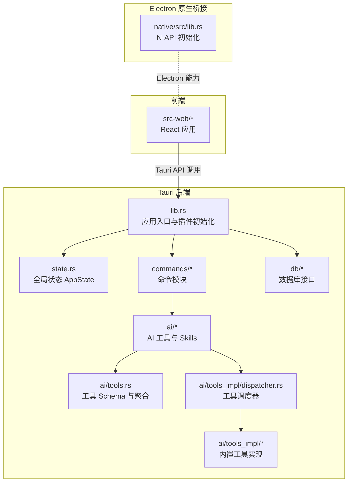
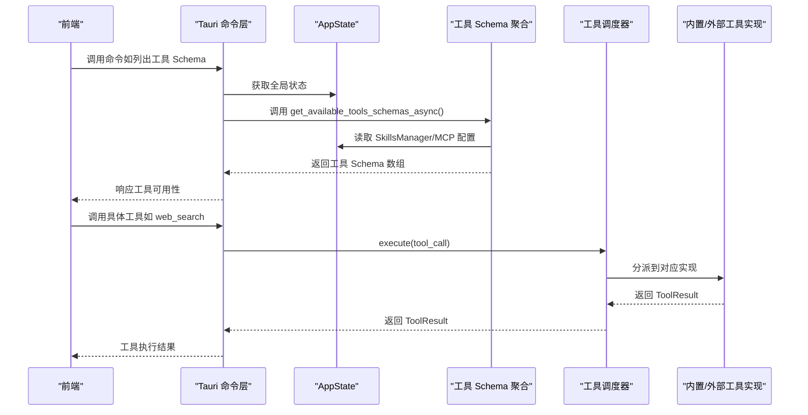
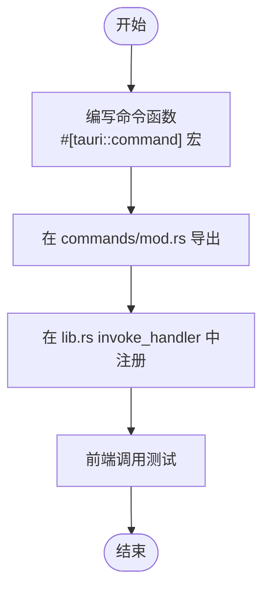
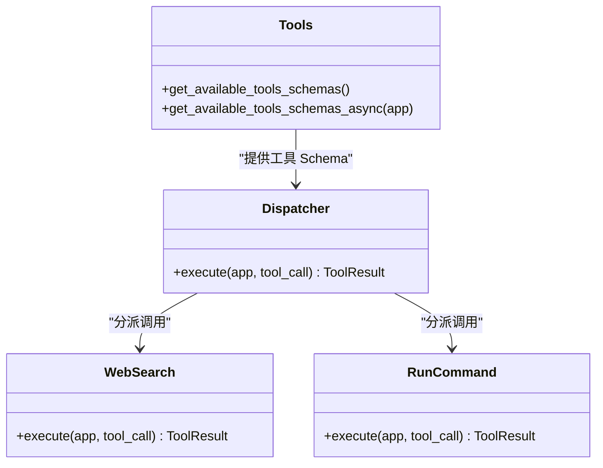
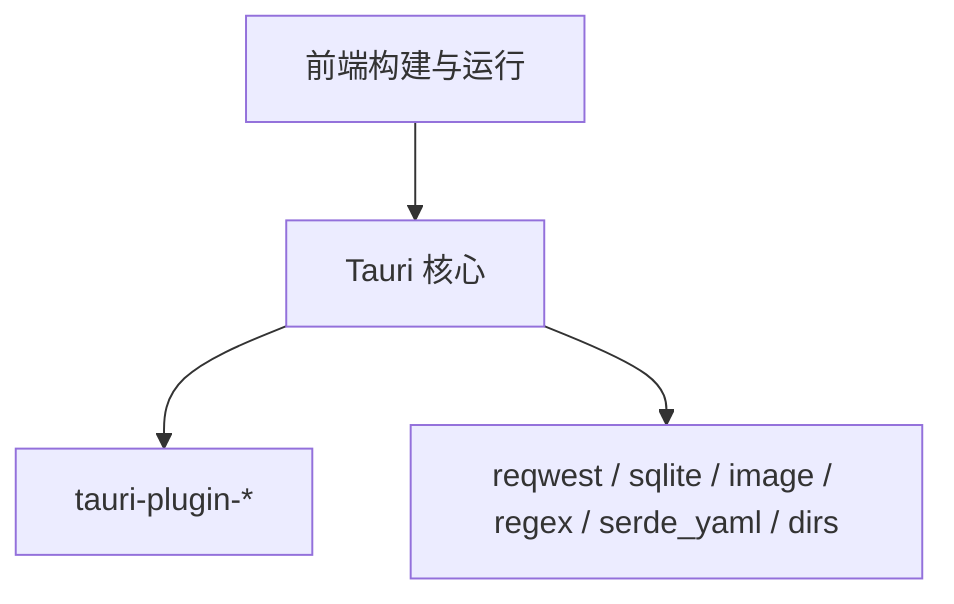

# 扩展开发

<cite>
**本文引用的文件**
- [src-tauri/src/lib.rs](file://src-tauri/src/lib.rs)
- [src-tauri/src/main.rs](file://src-tauri/src/main.rs)
- [src-tauri/Cargo.toml](file://src-tauri/Cargo.toml)
- [src-tauri/tauri.conf.json](file://src-tauri/tauri.conf.json)
- [src-tauri/src/state.rs](file://src-tauri/src/state.rs)
- [src-tauri/src/commands/mod.rs](file://src-tauri/src/commands/mod.rs)
- [src-tauri/src/commands/skills.rs](file://src-tauri/src/commands/skills.rs)
- [src-tauri/src/ai/tools.rs](file://src-tauri/src/ai/tools.rs)
- [src-tauri/src/ai/tools_impl/mod.rs](file://src-tauri/src/ai/tools_impl/mod.rs)
- [src-tauri/src/ai/tools_impl/dispatcher.rs](file://src-tauri/src/ai/tools_impl/dispatcher.rs)
- [src-tauri/src/ai/tools_impl/web_search.rs](file://src-tauri/src/ai/tools_impl/web_search.rs)
- [src-tauri/src/ai/tools_impl/run_command.rs](file://src-tauri/src/ai/tools_impl/run_command.rs)
- [src-tauri/src/ai/skills.rs](file://src-tauri/src/ai/skills.rs)
- [native/src/lib.rs](file://native/src/lib.rs)
- [examples/skills/python-calculator/SKILL.md](file://examples/skills/python-calculator/SKILL.md)
</cite>

## 目录
1. [简介](#简介)
2. [项目结构](#项目结构)
3. [核心组件](#核心组件)
4. [架构总览](#架构总览)
5. [详细组件分析](#详细组件分析)
6. [依赖关系分析](#依赖关系分析)
7. [性能考量](#性能考量)
8. [故障排查指南](#故障排查指南)
9. [结论](#结论)
10. [附录](#附录)

## 简介
本指南面向希望为 CoSurf 扩展开发的开发者，围绕以下主题提供系统化的实操指导：
- 新增 Tauri 命令：命令函数实现、#[tauri::command] 宏使用、模块导出与注册流程
- 自定义工具开发：工具 schema 定义、实现文件创建、调度器注册、系统提示词更新
- 插件开发最佳实践：模块化设计、错误处理、性能优化、安全考虑
- 第三方集成：外部 API（如 IQS）、数据库连接、文件系统访问
- 扩展示例：简单工具扩展、复杂功能模块、外部服务集成
- 测试与调试：本地调试、日志追踪、错误定位
- 打包与分发：Tauri 打包配置、签名与安装器
- 兼容性与问题解答：跨平台差异、常见问题与解决方案

## 项目结构
CoSurf 采用前后端分离与多后端协同的架构：
- Tauri 后端（Rust）：命令注册、AI 工具与 Skills 管理、数据库与状态管理
- Web 前端（React/Vite）：用户界面、事件与 API 交互
- Electron 原生桥接（Rust N-API）：为 Electron 提供高性能原生能力（数据库、AI、截图、缓存）

图表来源
- [src-tauri/src/lib.rs:1-258](file://src-tauri/src/lib.rs#L1-L258)
- [src-tauri/src/state.rs:1-77](file://src-tauri/src/state.rs#L1-L77)
- [src-tauri/src/commands/mod.rs:1-13](file://src-tauri/src/commands/mod.rs#L1-L13)
- [src-tauri/src/ai/tools.rs:1-418](file://src-tauri/src/ai/tools.rs#L1-L418)
- [src-tauri/src/ai/tools_impl/dispatcher.rs:1-238](file://src-tauri/src/ai/tools_impl/dispatcher.rs#L1-L238)
- [src-tauri/src/ai/tools_impl/mod.rs:1-14](file://src-tauri/src/ai/tools_impl/mod.rs#L1-L14)
- [native/src/lib.rs:1-64](file://native/src/lib.rs#L1-L64)

章节来源
- [src-tauri/src/lib.rs:1-258](file://src-tauri/src/lib.rs#L1-L258)
- [src-tauri/src/main.rs:1-6](file://src-tauri/src/main.rs#L1-L6)
- [src-tauri/Cargo.toml:1-70](file://src-tauri/Cargo.toml#L1-L70)
- [src-tauri/tauri.conf.json:1-72](file://src-tauri/tauri.conf.json#L1-L72)

## 核心组件
- 应用入口与插件初始化：负责插件注册、数据库初始化、全局状态注入、快捷键绑定与自动更新检查
- 命令系统：集中注册各类命令（对话、消息、书签、设置、AI、浏览器、页面上下文、截图、Skills 等）
- 全局状态 AppState：封装数据库、应用数据目录、取消标志、活动标签、页面内容缓存、Skills 管理器、MCP 工具注册表等
- AI 工具体系：内置工具枚举与 Schema、异步聚合工具 Schema（含 Skills 与 MCP）、工具调度器
- Skills 管理：目录结构化管理、Frontmatter 解析、懒加载、导入/导出/切换/删除
- Electron 原生桥接：通过 N-API 初始化数据库、Skills 管理器与缓存

章节来源
- [src-tauri/src/lib.rs:15-258](file://src-tauri/src/lib.rs#L15-L258)
- [src-tauri/src/state.rs:9-77](file://src-tauri/src/state.rs#L9-L77)
- [src-tauri/src/ai/tools.rs:197-225](file://src-tauri/src/ai/tools.rs#L197-L225)
- [src-tauri/src/ai/skills.rs:84-508](file://src-tauri/src/ai/skills.rs#L84-L508)
- [native/src/lib.rs:27-57](file://native/src/lib.rs#L27-L57)

## 架构总览
下图展示了 Tauri 命令到工具执行的关键链路，以及 Skills 与 MCP 工具的发现与路由。

图表来源
- [src-tauri/src/lib.rs:108-214](file://src-tauri/src/lib.rs#L108-L214)
- [src-tauri/src/ai/tools.rs:210-225](file://src-tauri/src/ai/tools.rs#L210-L225)
- [src-tauri/src/ai/tools_impl/dispatcher.rs:11-55](file://src-tauri/src/ai/tools_impl/dispatcher.rs#L11-L55)
- [src-tauri/src/ai/tools_impl/web_search.rs:14-179](file://src-tauri/src/ai/tools_impl/web_search.rs#L14-L179)

## 详细组件分析

### 新增 Tauri 命令：实现步骤与注册流程
- 命令函数实现
  - 在命令模块中新增函数，使用 #[tauri::command] 宏声明
  - 接收 State 或 AppHandle 等依赖，返回 AppResult<T>
  - 使用 tracing::info 记录关键日志
- 模块导出
  - 在命令模块的 mod.rs 中导出新模块或函数
- 注册流程
  - 在 lib.rs 的 invoke_handler 中添加生成的命令列表项
  - 重启应用使新命令生效

图表来源
- [src-tauri/src/commands/mod.rs:1-13](file://src-tauri/src/commands/mod.rs#L1-L13)
- [src-tauri/src/lib.rs:108-214](file://src-tauri/src/lib.rs#L108-L214)

章节来源
- [src-tauri/src/commands/mod.rs:1-13](file://src-tauri/src/commands/mod.rs#L1-L13)
- [src-tauri/src/lib.rs:108-214](file://src-tauri/src/lib.rs#L108-L214)

### 自定义工具开发：Schema、实现与调度
- 工具 Schema 定义
  - 在 ai/tools.rs 中定义工具枚举与参数 Schema，并提供 to_openai_schema
  - get_available_tools_schemas/get_available_tools_schemas_async 聚合内置、Skills 与 MCP 工具
- 实现文件创建
  - 在 ai/tools_impl 下新增实现模块（如 new_tool.rs），导出 execute 函数
  - 在 ai/tools_impl/mod.rs 中导出 execute
- 调度器注册
  - 在 dispatcher.rs 的 execute 分支中增加新工具的匹配逻辑
  - 若为 MCP 工具，确保在工具 Schema 聚合阶段正确注册到 mcp_tool_registry
- 系统提示词更新
  - 在 prompts 目录下的相应文件中补充工具描述与使用建议，提升模型调用准确性

图表来源
- [src-tauri/src/ai/tools.rs:197-225](file://src-tauri/src/ai/tools.rs#L197-L225)
- [src-tauri/src/ai/tools_impl/dispatcher.rs:11-55](file://src-tauri/src/ai/tools_impl/dispatcher.rs#L11-L55)
- [src-tauri/src/ai/tools_impl/web_search.rs:14-179](file://src-tauri/src/ai/tools_impl/web_search.rs#L14-L179)
- [src-tauri/src/ai/tools_impl/run_command.rs:34-161](file://src-tauri/src/ai/tools_impl/run_command.rs#L34-L161)

章节来源
- [src-tauri/src/ai/tools.rs:197-225](file://src-tauri/src/ai/tools.rs#L197-L225)
- [src-tauri/src/ai/tools_impl/dispatcher.rs:11-55](file://src-tauri/src/ai/tools_impl/dispatcher.rs#L11-L55)
- [src-tauri/src/ai/tools_impl/web_search.rs:14-179](file://src-tauri/src/ai/tools_impl/web_search.rs#L14-L179)
- [src-tauri/src/ai/tools_impl/run_command.rs:34-161](file://src-tauri/src/ai/tools_impl/run_command.rs#L34-L161)

### 插件开发最佳实践
- 模块化设计
  - 将工具按功能拆分为独立模块，便于维护与扩展
  - 使用统一的工具调用结构 ToolCall/ToolResult，保证一致性
- 错误处理
  - 使用 AppError/AppResult 统一封装错误，记录详细日志
  - 对外部依赖（如网络、文件系统）进行超时与降级处理
- 性能优化
  - Skills 采用懒加载策略，仅在模型调用时读取完整内容
  - MCP 工具 Schema 一次性拉取并缓存到 mcp_tool_registry，减少重复发现
- 安全考虑
  - run_command 工具实现黑名单拦截与超时控制
  - 严格校验输入参数与输出长度，避免过长文本影响性能

章节来源
- [src-tauri/src/ai/skills.rs:252-263](file://src-tauri/src/ai/skills.rs#L252-L263)
- [src-tauri/src/ai/tools_impl/dispatcher.rs:121-204](file://src-tauri/src/ai/tools_impl/dispatcher.rs#L121-L204)
- [src-tauri/src/ai/tools_impl/run_command.rs:22-32](file://src-tauri/src/ai/tools_impl/run_command.rs#L22-L32)

### 第三方集成方法
- 外部 API 集成（以 IQS 为例）
  - 在工具实现中发起 HTTP 请求，携带鉴权头与超时控制
  - 解析响应并格式化输出，兼容多种返回结构
- 数据库连接
  - 通过 AppState 中的 Database 管理器进行 CRUD 操作
  - 在初始化阶段完成数据库迁移与目录准备
- 文件系统访问
  - 使用 tauri-plugin-fs 或标准库进行文件读写
  - 注意权限与路径规范化，避免跨平台差异

章节来源
- [src-tauri/src/ai/tools_impl/web_search.rs:66-109](file://src-tauri/src/ai/tools_impl/web_search.rs#L66-L109)
- [src-tauri/src/state.rs:25-77](file://src-tauri/src/state.rs#L25-L77)

### 扩展示例
- 简单工具扩展：新增一个内置工具（如 new_tool），定义 Schema、实现 execute、在调度器中注册
- 复杂功能模块：基于 Skills 系统，创建目录结构与 SKILL.md，利用懒加载机制在 Agent Loop 中动态决策
- 外部服务集成：通过 MCP 工具发现机制，将第三方服务工具注册为独立 function，实现无缝调用

章节来源
- [src-tauri/src/ai/tools.rs:227-272](file://src-tauri/src/ai/tools.rs#L227-L272)
- [src-tauri/src/ai/tools_impl/dispatcher.rs:121-204](file://src-tauri/src/ai/tools_impl/dispatcher.rs#L121-L204)
- [examples/skills/python-calculator/SKILL.md:1-39](file://examples/skills/python-calculator/SKILL.md#L1-L39)

## 依赖关系分析
- Tauri 核心依赖与插件：shell、dialog、fs、global-shortcut、http、notification、updater、window-state
- 第三方库：reqwest、tokio、serde、sqlite、图像处理、HTML 解析、Markdown 解析、目录处理等
- 前端与构建：Vite、React、Tailwind、Electron 桥接

图表来源
- [src-tauri/Cargo.toml:21-70](file://src-tauri/Cargo.toml#L21-L70)
- [src-tauri/tauri.conf.json:6-11](file://src-tauri/tauri.conf.json#L6-L11)

章节来源
- [src-tauri/Cargo.toml:21-70](file://src-tauri/Cargo.toml#L21-L70)
- [src-tauri/tauri.conf.json:6-11](file://src-tauri/tauri.conf.json#L6-L11)

## 性能考量
- 工具调用链路尽量短路：内置工具优先，避免不必要的网络往返
- 异步与并发：使用 tokio 运行时与超时控制，防止阻塞
- 缓存与懒加载：Skills 内容懒加载、MCP 工具 Schema 缓存
- 输出截断：对长输出进行截断，避免内存与序列化压力

## 故障排查指南
- 日志追踪
  - 使用 tracing::info/warn/error 记录关键路径与错误
  - 关注初始化阶段（数据库、Skills、MCP）的日志输出
- 常见问题
  - 命令未注册：确认在 lib.rs 的 invoke_handler 中已添加
  - 工具不可见：检查工具 Schema 聚合逻辑与 MCP 服务器连通性
  - Skills 不生效：确认目录结构与 SKILL.md frontmatter 正确
  - 外部 API 失败：检查鉴权头、超时与响应格式
- 调试技巧
  - 使用 tracing-subscriber 的环境变量过滤日志级别
  - 在开发模式下通过 devUrl 连接前端热更新

章节来源
- [src-tauri/src/lib.rs:17-21](file://src-tauri/src/lib.rs#L17-L21)
- [src-tauri/src/ai/tools_impl/web_search.rs:98-106](file://src-tauri/src/ai/tools_impl/web_search.rs#L98-L106)
- [src-tauri/src/ai/skills.rs:222-250](file://src-tauri/src/ai/skills.rs#L222-L250)

## 结论
通过本指南，开发者可以系统地为 CoSurf 新增 Tauri 命令、扩展 AI 工具、管理 Skills 与 MCP 工具，并安全高效地集成第三方服务。遵循模块化、错误处理、性能与安全的最佳实践，可确保扩展的稳定性与可维护性。

## 附录

### 扩展开发清单
- 新增命令
  - 实现函数并在命令模块导出
  - 在 lib.rs 的 invoke_handler 中注册
- 新增工具
  - 定义 Schema 与参数
  - 实现 execute 并在调度器中注册
  - 如为 MCP 工具，确保 Schema 聚合与注册表更新
- Skills 扩展
  - 创建目录与 SKILL.md，frontmatter 包含 name/description/tags
  - 使用懒加载机制在 Agent Loop 中动态决策
- 第三方集成
  - 外部 API：鉴权、超时、响应解析与格式化
  - 数据库：通过 AppState 的 Database 管理器
  - 文件系统：路径规范化与权限控制

### 打包与分发
- Tauri 打包配置
  - 前端构建路径与命令在 tauri.conf.json 中配置
  - bundle.targets 指定安装包类型（如 MSI/NSIS）
- 签名与证书
  - Windows 安装器可配置证书指纹与哈希算法
- 版本与更新
  - 通过插件 updater 配置端点与公钥，实现静默更新

章节来源
- [src-tauri/tauri.conf.json:6-11](file://src-tauri/tauri.conf.json#L6-L11)
- [src-tauri/tauri.conf.json:33-71](file://src-tauri/tauri.conf.json#L33-L71)