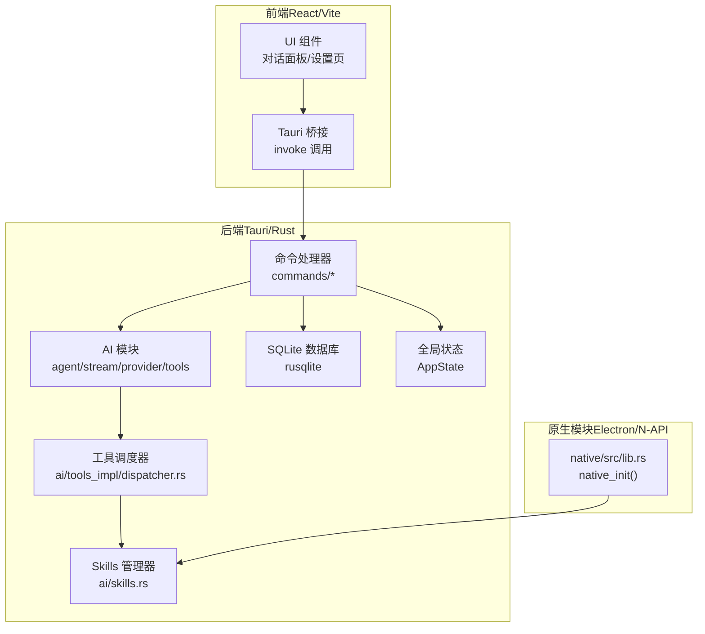
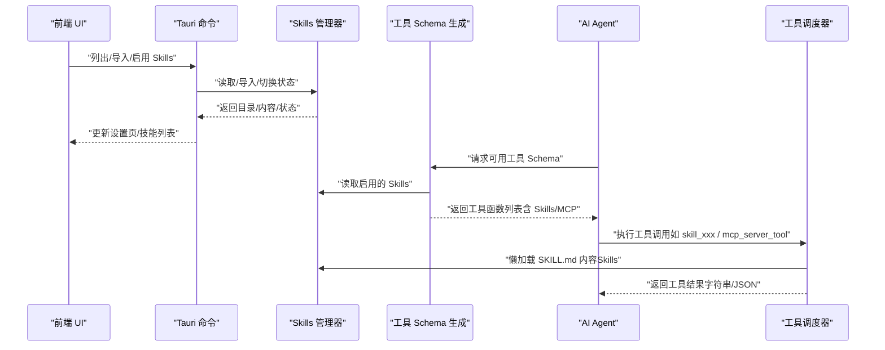
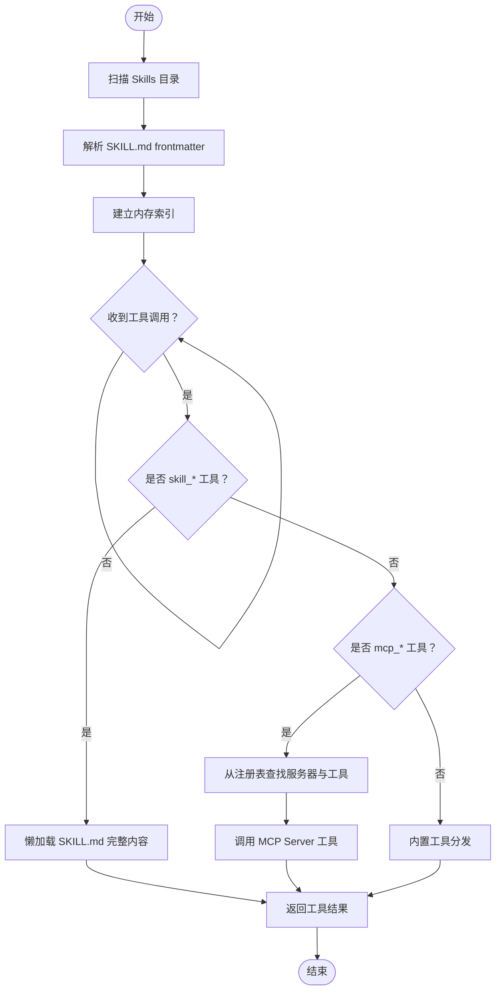
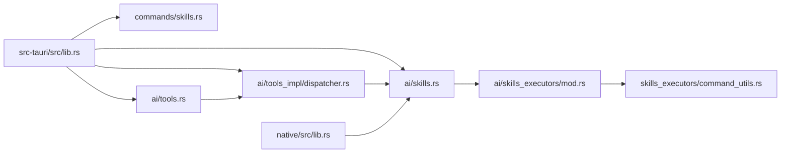

# 插件开发

<cite>
**本文引用的文件**
- [README.md](file://README.md)
- [Cargo.toml](file://Cargo.toml)
- [src-tauri/src/lib.rs](file://src-tauri/src/lib.rs)
- [src-tauri/src/ai/skills.rs](file://src-tauri/src/ai/skills.rs)
- [src-tauri/src/ai/skills_executors/mod.rs](file://src-tauri/src/ai/skills_executors/mod.rs)
- [src-tauri/src/ai/skills_executors/command_utils.rs](file://src-tauri/src/ai/skills_executors/command_utils.rs)
- [src-tauri/src/commands/skills.rs](file://src-tauri/src/commands/skills.rs)
- [src-tauri/src/ai/tools.rs](file://src-tauri/src/ai/tools.rs)
- [src-tauri/src/ai/tools_impl/dispatcher.rs](file://src-tauri/src/ai/tools_impl/dispatcher.rs)
- [src-tauri/src/ai/mcp.rs](file://src-tauri/src/ai/mcp.rs)
- [native/src/lib.rs](file://native/src/lib.rs)
- [examples/skills/python-calculator/echo-skill.json](file://examples/echo-skill.json)
- [examples/skills/python-calculator/python-calculator-skill.json](file://examples/python-calculator-skill.json)
- [examples/alibabacloud-iqs-search-skill.json](file://examples/alibabacloud-iqs-search-skill.json)
</cite>

## 目录
1. [简介](#简介)
2. [项目结构](#项目结构)
3. [核心组件](#核心组件)
4. [架构总览](#架构总览)
5. [组件详解](#组件详解)
6. [依赖关系分析](#依赖关系分析)
7. [性能考量](#性能考量)
8. [故障排查指南](#故障排查指南)
9. [结论](#结论)
10. [附录](#附录)

## 简介
本指南面向希望为 CoSurf 开发“插件”（在本项目中称为 Skills）的开发者，系统讲解插件体系的架构设计、生命周期管理、模块化组织方式，以及如何开发和集成三类插件：CLI 插件、脚本插件（Script）、MCP 插件。文档还涵盖插件的加载与注册机制、与核心系统的集成（API 接口、事件通信、状态共享）、配置管理、测试与调试、性能监控与安全机制。

CoSurf 的“插件”并非传统浏览器扩展，而是通过统一的 Skills 管理器与工具调度器，将外部能力（命令行、脚本、MCP 工具）纳入 AI Agent 的工具集，实现“按需发现、按需调用”的可扩展能力体系。

## 项目结构
CoSurf 采用前后端分离与多模块协作的架构：
- 前端（React/Vite）负责 UI 与交互，通过 Tauri 桥接调用后端命令。
- 后端（Tauri/Rust）提供命令处理、数据库、AI Agent、工具调度、Skills 管理等核心能力。
- 原生模块（Electron/N-API）在 Electron 主进程中提供高性能能力（数据库、缓存、截图、Skills 管理等）。

图表来源
- [src-tauri/src/lib.rs:108-214](file://src-tauri/src/lib.rs#L108-L214)
- [src-tauri/src/ai/skills.rs:84-97](file://src-tauri/src/ai/skills.rs#L84-L97)
- [src-tauri/src/ai/tools_impl/dispatcher.rs:11-55](file://src-tauri/src/ai/tools_impl/dispatcher.rs#L11-L55)
- [native/src/lib.rs:28-57](file://native/src/lib.rs#L28-L57)

章节来源
- [README.md:213-328](file://README.md#L213-L328)
- [src-tauri/src/lib.rs:108-214](file://src-tauri/src/lib.rs#L108-L214)

## 核心组件
- Skills 管理器：负责 Skills 的发现、导入、启用/禁用、懒加载与持久化。
- 工具调度器：根据工具名称分发到内置工具、MCP 工具或 Skills 工具。
- 工具 Schema 生成：向 AI 模型暴露可用工具的函数签名与参数说明。
- 命令接口：前端通过 Tauri 命令与后端交互，实现 Skills 的 CRUD 与内容读取。
- 原生模块：在 Electron 主进程中初始化数据库、Skills 管理器与缓存。

章节来源
- [src-tauri/src/ai/skills.rs:84-508](file://src-tauri/src/ai/skills.rs#L84-L508)
- [src-tauri/src/ai/tools_impl/dispatcher.rs:11-238](file://src-tauri/src/ai/tools_impl/dispatcher.rs#L11-L238)
- [src-tauri/src/ai/tools.rs:197-418](file://src-tauri/src/ai/tools.rs#L197-L418)
- [src-tauri/src/commands/skills.rs:42-152](file://src-tauri/src/commands/skills.rs#L42-L152)
- [native/src/lib.rs:28-57](file://native/src/lib.rs#L28-L57)

## 架构总览
下图展示了插件（Skills）从发现、注册到调用的全链路：

图表来源
- [src-tauri/src/commands/skills.rs:42-152](file://src-tauri/src/commands/skills.rs#L42-L152)
- [src-tauri/src/ai/skills.rs:172-280](file://src-tauri/src/ai/skills.rs#L172-L280)
- [src-tauri/src/ai/tools.rs:210-272](file://src-tauri/src/ai/tools.rs#L210-L272)
- [src-tauri/src/ai/tools_impl/dispatcher.rs:11-119](file://src-tauri/src/ai/tools_impl/dispatcher.rs#L11-L119)

## 组件详解

### 插件接口规范与生命周期
- 接口规范
  - Skills 通过目录结构组织，每个技能一个目录，包含 SKILL.md（包含 YAML frontmatter 与正文）。
  - frontmatter 定义 name、description、enabled、tags 等元数据；正文为技能说明与使用指南。
  - 工具 Schema 生成阶段仅暴露 description，不暴露正文内容，实现“渐进式加载”。
- 生命周期
  - 初始化：应用启动时加载 Skills 目录，解析 frontmatter，建立内存索引。
  - 运行期：根据 Agent Loop 的工具调用，按需懒加载 SKILL.md 完整内容。
  - 管理期：支持导入（从目录/从 Markdown）、启用/禁用、删除、查看内容。

章节来源
- [src-tauri/src/ai/skills.rs:24-82](file://src-tauri/src/ai/skills.rs#L24-L82)
- [src-tauri/src/ai/skills.rs:172-250](file://src-tauri/src/ai/skills.rs#L172-L250)
- [src-tauri/src/ai/skills.rs:252-263](file://src-tauri/src/ai/skills.rs#L252-L263)

### 不同类型插件的开发与配置

#### CLI 插件
- 设计思路
  - 通过命令行工具执行外部程序，适合系统命令、批处理、脚本包装等场景。
  - 参数模板化，支持变量替换与确认流程。
- 配置要点
  - 在配置对象中声明 type 为 cli，提供 command、args_template、timeout、require_confirmation 等字段。
  - 参数 schema 定义 properties 与 required 字段，便于模型正确构造参数。
- 示例参考
  - [examples/echo-skill.json:1-28](file://examples/echo-skill.json#L1-L28)

章节来源
- [examples/echo-skill.json:8-26](file://examples/echo-skill.json#L8-L26)

#### 脚本插件（Script）
- 设计思路
  - 通过嵌入式脚本语言（如 Python、JavaScript）执行业务逻辑，适合数据处理、网络请求、文件操作等。
  - 支持从文件读取或直接内联脚本源码。
- 配置要点
  - 在配置对象中声明 type 为 script，提供 language、source（是否为文件）、parameters 等。
  - parameters 定义输入参数的类型、枚举、默认值与必填项。
- 示例参考
  - [examples/python-calculator-skill.json:1-27](file://examples/python-calculator-skill.json#L1-L27)
  - [examples/alibabacloud-iqs-search-skill.json:1-45](file://examples/alibabacloud-iqs-search-skill.json#L1-L45)

章节来源
- [examples/python-calculator-skill.json:8-26](file://examples/python-calculator-skill.json#L8-L26)
- [examples/alibabacloud-iqs-search-skill.json:8-44](file://examples/alibabacloud-iqs-search-skill.json#L8-L44)

#### MCP 插件
- 设计思路
  - 通过 MCP 协议对接外部工具服务器，自动发现工具并注册为 Agent 的函数。
  - 支持 stdio、SSE、Streamable HTTP 三种传输模式（stdio 在 Agent 中暂不直接调用）。
- 配置要点
  - 在设置中添加 MCP Server，选择类型与连接参数（URL、headers 等）。
  - 工具 Schema 由服务器 tools/list 返回，自动注册为 mcp_{server}_{tool} 的函数名。
- 示例参考
  - README 中的 MCP 配置说明与示例。

章节来源
- [README.md:439-467](file://README.md#L439-L467)
- [src-tauri/src/ai/tools.rs:274-396](file://src-tauri/src/ai/tools.rs#L274-L396)
- [src-tauri/src/ai/tools_impl/dispatcher.rs:121-204](file://src-tauri/src/ai/tools_impl/dispatcher.rs#L121-L204)

### 插件的加载与注册机制
- 发现与解析
  - 读取 Skills 目录，逐个解析 SKILL.md 的 frontmatter，建立内存映射。
- 动态加载
  - 工具调用时按需读取 SKILL.md 完整内容，作为工具结果返回给 Agent。
- 版本与依赖
  - 通过目录名与 frontmatter 控制版本与依赖关系；导入时可覆盖现有目录。
- 依赖解析
  - CLI 插件依赖系统 PATH 与常见运行时安装位置，提供增强 PATH 构建与命令解析工具。

图表来源
- [src-tauri/src/ai/skills.rs:172-280](file://src-tauri/src/ai/skills.rs#L172-L280)
- [src-tauri/src/ai/tools_impl/dispatcher.rs:11-119](file://src-tauri/src/ai/tools_impl/dispatcher.rs#L11-L119)
- [src-tauri/src/ai/tools_impl/dispatcher.rs:121-204](file://src-tauri/src/ai/tools_impl/dispatcher.rs#L121-L204)

章节来源
- [src-tauri/src/ai/skills.rs:172-280](file://src-tauri/src/ai/skills.rs#L172-L280)
- [src-tauri/src/ai/tools_impl/dispatcher.rs:11-238](file://src-tauri/src/ai/tools_impl/dispatcher.rs#L11-L238)
- [src-tauri/src/ai/skills_executors/command_utils.rs:4-95](file://src-tauri/src/ai/skills_executors/command_utils.rs#L4-L95)

### 插件与核心系统的集成
- API 接口
  - 前端通过 Tauri 命令与后端交互，实现 Skills 的 CRUD、内容读取、目录列表等功能。
- 事件通信
  - 后端通过事件机制（如更新可用工具 Schema）通知前端 UI。
- 状态共享
  - 全局 AppState 管理数据库、Skills 管理器、MCP 工具注册表等共享状态。

章节来源
- [src-tauri/src/lib.rs:108-214](file://src-tauri/src/lib.rs#L108-L214)
- [src-tauri/src/commands/skills.rs:42-152](file://src-tauri/src/commands/skills.rs#L42-L152)

### 具体扩展示例

#### 计算器插件（Python）
- 目标：实现数学表达式计算，支持基础运算、幂、取模、平方根、三角函数与常数。
- 开发要点
  - 在 SKILL.md 中定义使用说明与支持操作。
  - 在配置中声明 type 为 script，language 为 python，提供参数 schema（如 expression）。
- 参考
  - [examples/python-calculator/echo-skill.json:1-28](file://examples/echo-skill.json#L1-L28)

章节来源
- [examples/echo-skill.json:8-26](file://examples/echo-skill.json#L8-L26)

#### 搜索插件（阿里云 IQS）
- 目标：通过阿里云 IQS API 实现实时网页搜索与结果提取。
- 开发要点
  - 在配置中声明 type 为 script，language 为 javascript。
  - 从环境变量或配置文件读取 API Key，构建请求并格式化输出。
  - 定义参数 schema（query、engine_type、time_range、max_results）。
- 参考
  - [examples/alibabacloud-iqs-search-skill.json:1-45](file://examples/alibabacloud-iqs-search-skill.json#L1-L45)

章节来源
- [examples/alibabacloud-iqs-search-skill.json:8-44](file://examples/alibabacloud-iqs-search-skill.json#L8-L44)

#### 数据处理插件（通用）
- 目标：读取输入参数，执行数据清洗、转换、聚合等处理，输出结构化结果。
- 开发要点
  - 在 SKILL.md 中明确输入/输出格式与处理流程。
  - 在配置中定义 parameters schema，确保模型能正确构造参数。
  - 在脚本中实现健壮的错误处理与日志输出。

章节来源
- [src-tauri/src/ai/skills.rs:403-438](file://src-tauri/src/ai/skills.rs#L403-L438)

### 配置管理
- 参数定义
  - 使用 JSON Schema 定义参数类型、枚举、默认值与必填项。
- 环境变量
  - CLI/脚本插件可通过环境变量注入敏感配置（如 API Key）。
- 配置文件
  - Skills 目录结构与 SKILL.md frontmatter 作为配置载体；MCP Server 配置持久化至数据库。
- 运行时调整
  - 通过设置页启用/禁用 Skills，或导入新的技能目录/Markdown。

章节来源
- [src-tauri/src/commands/skills.rs:92-152](file://src-tauri/src/commands/skills.rs#L92-L152)
- [src-tauri/src/ai/skills.rs:350-401](file://src-tauri/src/ai/skills.rs#L350-L401)
- [README.md:439-467](file://README.md#L439-L467)

### 测试策略、调试技巧与性能监控
- 测试策略
  - 单元测试：针对 Skills 管理器的导入、解析、懒加载逻辑。
  - 集成测试：验证工具 Schema 生成、工具调度与 MCP 工具调用链路。
  - 端到端测试：通过前端设置页导入/启用 Skills，观察 Agent 行为。
- 调试技巧
  - 后端日志：设置 RUST_LOG=debug，关注 Agent Loop、工具执行、MCP 通信日志。
  - 前端日志：在控制台搜索 ConversationStore/AIPanel 相关日志。
  - 数据库：使用 DB Browser for SQLite 查看设置与 MCP 配置。
- 性能监控
  - 工具调用耗时统计与超时控制（如命令执行超时）。
  - MCP 工具发现与调用增加超时保护，避免阻塞 Agent 循环。

章节来源
- [README.md:534-556](file://README.md#L534-L556)

### 安全机制
- 沙箱执行
  - CLI/脚本插件执行时建议限制工作目录与超时，避免长时间阻塞。
- 权限控制
  - MCP Server 配置支持 headers，可用于鉴权；工具调用前校验服务器可用性。
- 资源隔离
  - 命令执行增强 PATH 与内建命令适配，减少跨路径污染风险。
  - 原生模块在 Electron 主进程中初始化，避免前端直接访问底层资源。

章节来源
- [src-tauri/src/ai/skills_executors/command_utils.rs:4-95](file://src-tauri/src/ai/skills_executors/command_utils.rs#L4-L95)
- [src-tauri/src/ai/tools.rs:158-180](file://src-tauri/src/ai/tools.rs#L158-L180)

## 依赖关系分析

图表来源
- [src-tauri/src/lib.rs:108-214](file://src-tauri/src/lib.rs#L108-L214)
- [src-tauri/src/commands/skills.rs:1-152](file://src-tauri/src/commands/skills.rs#L1-L152)
- [src-tauri/src/ai/skills.rs:1-567](file://src-tauri/src/ai/skills.rs#L1-L567)
- [src-tauri/src/ai/tools.rs:1-418](file://src-tauri/src/ai/tools.rs#L1-L418)
- [src-tauri/src/ai/tools_impl/dispatcher.rs:1-238](file://src-tauri/src/ai/tools_impl/dispatcher.rs#L1-L238)
- [src-tauri/src/ai/skills_executors/mod.rs:1-6](file://src-tauri/src/ai/skills_executors/mod.rs#L1-L6)
- [src-tauri/src/ai/skills_executors/command_utils.rs:1-95](file://src-tauri/src/ai/skills_executors/command_utils.rs#L1-L95)
- [native/src/lib.rs:1-64](file://native/src/lib.rs#L1-L64)

章节来源
- [Cargo.toml:1-29](file://Cargo.toml#L1-L29)
- [src-tauri/src/lib.rs:108-214](file://src-tauri/src/lib.rs#L108-L214)

## 性能考量
- 懒加载策略：Skills 内容仅在调用时加载，降低启动与工具发现成本。
- 超时保护：MCP 工具发现与调用设置超时，避免阻塞 Agent 循环。
- 路由优化：工具调度器按前缀快速分发，减少匹配开销。
- 资源复用：Skills 管理器实例化一次，避免重复扫描目录。

## 故障排查指南
- 端口冲突
  - 前端开发端口被占用时，修改 Vite 配置中的端口。
- WebView2 问题
  - 确保系统已安装最新 WebView2 Runtime。
- Rust 编译失败
  - 关闭所有 CoSurf 进程后重试，避免文件锁导致的编译失败。
- MCP 工具调用无结果
  - 检查 MCP Server 是否正常运行、连接参数是否正确、传输类型是否受支持。

章节来源
- [README.md:548-556](file://README.md#L548-L556)

## 结论
CoSurf 的插件体系以 Skills 为核心，结合工具 Schema 生成与工具调度器，实现了对 CLI、脚本与 MCP 能力的统一接入。通过渐进式加载与超时保护，既保证了灵活性，也兼顾了性能与稳定性。开发者可依据本文档的接口规范与示例，快速扩展新的插件能力，并将其无缝集成到 AI Agent 的工具集中。

## 附录
- 原生模块初始化流程（Electron 主进程）
  - 初始化日志、数据库、Skills 管理器与缓存。
  - 参考：[native/src/lib.rs:28-57](file://native/src/lib.rs#L28-L57)

章节来源
- [native/src/lib.rs:28-57](file://native/src/lib.rs#L28-L57)