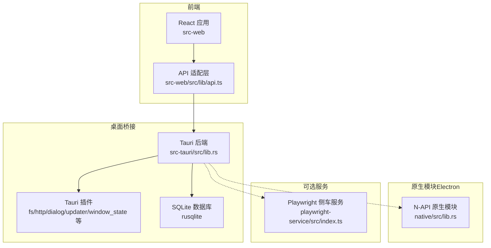
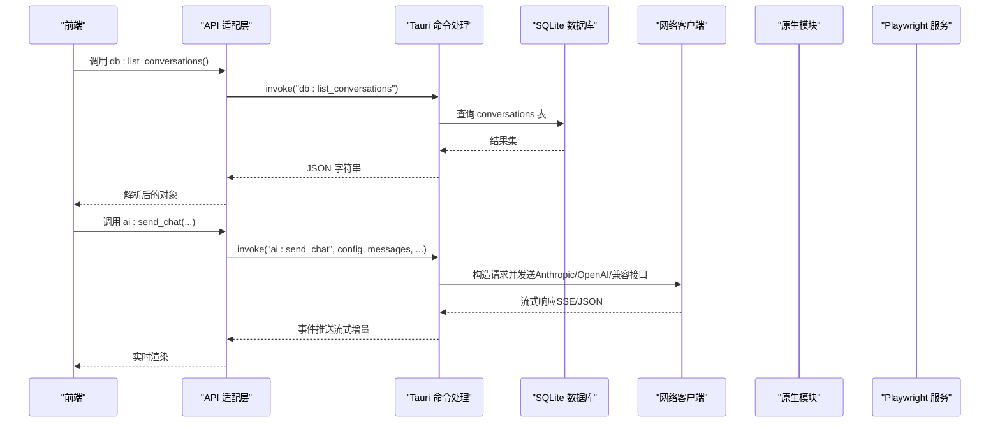
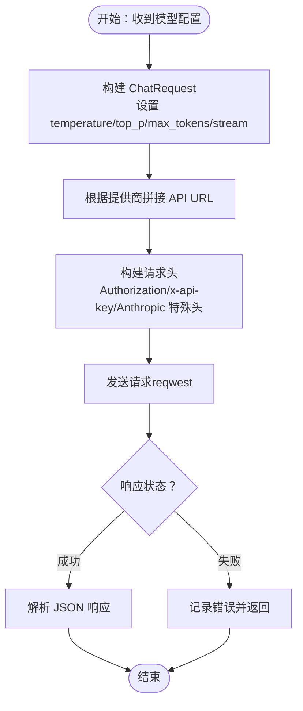
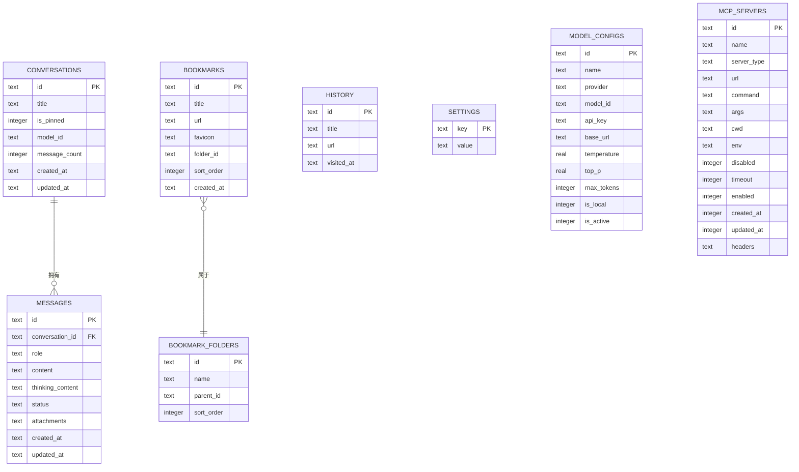
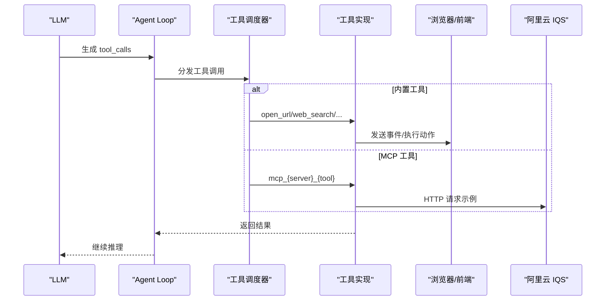
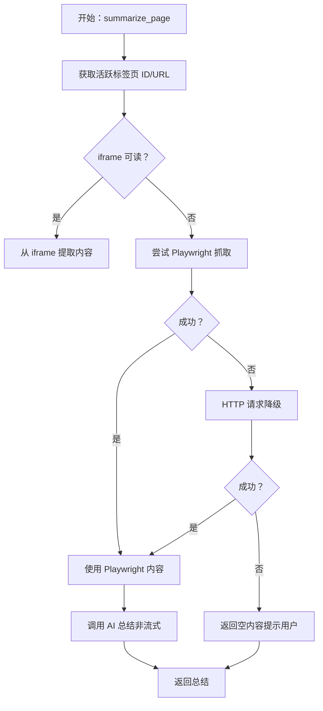
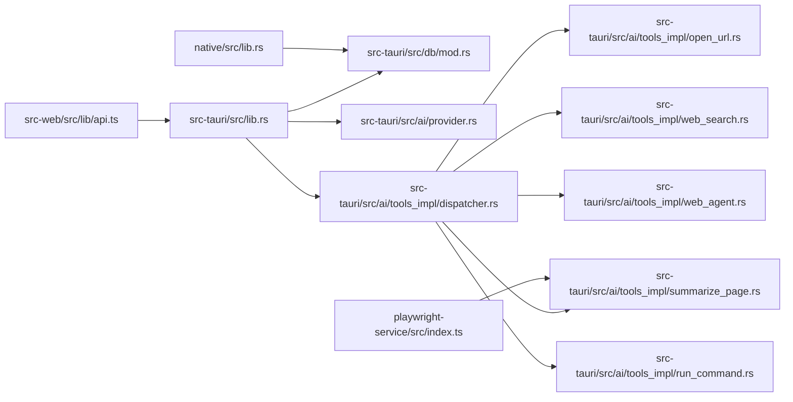

# 第三方集成

<cite>
**本文引用的文件**
- [README.md](file://README.md)
- [src-tauri/src/lib.rs](file://src-tauri/src/lib.rs)
- [src-tauri/src/main.rs](file://src-tauri/src/main.rs)
- [src-tauri/src/db/mod.rs](file://src-tauri/src/db/mod.rs)
- [src-tauri/src/ai/provider.rs](file://src-tauri/src/ai/provider.rs)
- [src-tauri/src/ai/mcp.rs](file://src-tauri/src/ai/mcp.rs)
- [src-tauri/src/ai/tools_impl/dispatcher.rs](file://src-tauri/src/ai/tools_impl/dispatcher.rs)
- [src-tauri/src/ai/tools_impl/web_search.rs](file://src-tauri/src/ai/tools_impl/web_search.rs)
- [src-tauri/src/ai/tools_impl/open_url.rs](file://src-tauri/src/ai/tools_impl/open_url.rs)
- [src-tauri/src/ai/tools_impl/summarize_page.rs](file://src-tauri/src/ai/tools_impl/summarize_page.rs)
- [src-tauri/src/ai/tools_impl/web_agent.rs](file://src-tauri/src/ai/tools_impl/web_agent.rs)
- [src-tauri/src/ai/tools_impl/run_command.rs](file://src-tauri/src/ai/tools_impl/run_command.rs)
- [src-web/src/lib/api.ts](file://src-web/src/lib/api.ts)
- [native/src/lib.rs](file://native/src/lib.rs)
- [playwright-service/src/index.ts](file://playwright-service/src/index.ts)
</cite>

## 目录
1. [简介](#简介)
2. [项目结构](#项目结构)
3. [核心组件](#核心组件)
4. [架构总览](#架构总览)
5. [详细组件分析](#详细组件分析)
6. [依赖关系分析](#依赖关系分析)
7. [性能考量](#性能考量)
8. [故障排查指南](#故障排查指南)
9. [结论](#结论)
10. [附录](#附录)

## 简介
本指南面向希望在 CoSurf 中进行第三方集成的开发者，系统讲解如何对接外部服务（AI 模型、MCP 服务器、云搜索等）、数据库（SQLite）、文件系统、以及网络服务（HTTP/WS/代理/超时）。文档覆盖客户端实现、认证机制、请求处理与响应解析、数据库连接池与事务、文件访问与权限、网络服务集成、错误处理与重试、安全与性能优化，并给出具体集成案例与最佳实践。

## 项目结构
CoSurf 采用“前端 React + 后端 Tauri/Rust + 原生模块（Electron）”的混合架构。前端通过统一 API 适配层调用后端命令；后端通过 Tauri 插件与原生能力交互；数据库采用 SQLite（rusqlite），默认 WAL 模式；AI 侧支持多模型与 MCP 协议；可选 Playwright 服务用于网页自动化。

图表来源
- [src-tauri/src/lib.rs:41-107](file://src-tauri/src/lib.rs#L41-L107)
- [src-web/src/lib/api.ts:12-19](file://src-web/src/lib/api.ts#L12-L19)
- [native/src/lib.rs:28-96](file://native/src/lib.rs#L28-L96)
- [playwright-service/src/index.ts:7-28](file://playwright-service/src/index.ts#L7-L28)

章节来源
- [README.md:53-116](file://README.md#L53-L116)
- [src-tauri/src/lib.rs:41-107](file://src-tauri/src/lib.rs#L41-L107)
- [src-web/src/lib/api.ts:12-19](file://src-web/src/lib/api.ts#L12-L19)
- [native/src/lib.rs:28-96](file://native/src/lib.rs#L28-L96)
- [playwright-service/src/index.ts:7-28](file://playwright-service/src/index.ts#L7-L28)

## 核心组件
- API 适配层：封装前端与后端的 IPC/命令调用，统一参数与返回值解析。
- Tauri 命令注册：集中注册数据库、AI、浏览器、截图、技能等命令。
- 数据库层：SQLite 初始化、迁移、索引与列演进。
- AI 提供商抽象：统一 Chat 请求构建、头部注入与不同提供商差异处理。
- MCP 客户端：支持 stdio/SSE/Streamable HTTP 三种传输模式。
- 工具调度器：内置工具、MCP 工具与 Skills 的路由分发。
- 网络工具：阿里云 IQS 搜索、页面内容提取（iframe/Playwright/HTTP 降级）。
- 原生模块：Electron 主进程加载，初始化数据库、Skills、MCP 服务器与缓存。
- 可选服务：Playwright 侧车服务，提供 HTTP API 与优雅关闭。

章节来源
- [src-web/src/lib/api.ts:54-249](file://src-web/src/lib/api.ts#L54-L249)
- [src-tauri/src/lib.rs:108-214](file://src-tauri/src/lib.rs#L108-L214)
- [src-tauri/src/db/mod.rs:41-148](file://src-tauri/src/db/mod.rs#L41-L148)
- [src-tauri/src/ai/provider.rs:91-135](file://src-tauri/src/ai/provider.rs#L91-L135)
- [src-tauri/src/ai/mcp.rs:45-151](file://src-tauri/src/ai/mcp.rs#L45-L151)
- [src-tauri/src/ai/tools_impl/dispatcher.rs:14-55](file://src-tauri/src/ai/tools_impl/dispatcher.rs#L14-L55)
- [src-tauri/src/ai/tools_impl/web_search.rs:15-179](file://src-tauri/src/ai/tools_impl/web_search.rs#L15-L179)
- [src-tauri/src/ai/tools_impl/summarize_page.rs:16-55](file://src-tauri/src/ai/tools_impl/summarize_page.rs#L16-L55)
- [native/src/lib.rs:28-96](file://native/src/lib.rs#L28-L96)
- [playwright-service/src/index.ts:7-28](file://playwright-service/src/index.ts#L7-L28)

## 架构总览
CoSurf 的第三方集成围绕“命令通道 + 数据层 + AI 层 + 可选服务”的结构展开。前端通过 API 适配层发起命令，后端在 Tauri 中注册的命令处理函数中完成业务逻辑（数据库读写、网络请求、工具调用、事件广播），必要时调用原生模块或可选服务。

图表来源
- [src-web/src/lib/api.ts:54-249](file://src-web/src/lib/api.ts#L54-L249)
- [src-tauri/src/lib.rs:108-214](file://src-tauri/src/lib.rs#L108-L214)
- [src-tauri/src/db/mod.rs:41-148](file://src-tauri/src/db/mod.rs#L41-L148)
- [src-tauri/src/ai/provider.rs:91-135](file://src-tauri/src/ai/provider.rs#L91-L135)

## 详细组件分析

### API 客户端与认证机制
- 统一适配层：封装 invoke 调用，统一参数与返回值解析（字符串 JSON 自动解析）。
- 认证头注入：根据提供商类型注入 Authorization 或 x-api-key，并按 Anthropic 规范附加工具 Beta 头。
- 请求构建：统一 ChatRequest 结构，支持温度、top_p、max_tokens、流式开关。

图表来源
- [src-tauri/src/ai/provider.rs:91-135](file://src-tauri/src/ai/provider.rs#L91-L135)

章节来源
- [src-web/src/lib/api.ts:12-34](file://src-web/src/lib/api.ts#L12-L34)
- [src-tauri/src/ai/provider.rs:91-135](file://src-tauri/src/ai/provider.rs#L91-L135)

### 请求处理与响应解析
- 流式响应：支持 choices[].delta.content/thinking/tool_calls 的增量解析。
- 工具调用：解析 tool_calls 增量，拼接函数名与参数，交由工具调度器执行。
- 非流式总结：针对页面总结场景，构造 system/user 消息，非流式获取结果。

章节来源
- [src-tauri/src/ai/provider.rs:36-87](file://src-tauri/src/ai/provider.rs#L36-L87)
- [src-tauri/src/ai/tools_impl/summarize_page.rs:358-427](file://src-tauri/src/ai/tools_impl/summarize_page.rs#L358-L427)

### 数据库集成（SQLite）
- 初始化与迁移：WAL 模式、外键约束、索引；动态列演进（thinking_content、feedback、mcp_servers 新列）。
- 表结构：conversations/messages/bookmarks/history/settings/model_configs/mcp_servers。
- 事务与并发：rusqlite 默认事务语义；通过锁保护共享状态（如活跃标签页、MCP 注册表）。

图表来源
- [src-tauri/src/db/mod.rs:42-133](file://src-tauri/src/db/mod.rs#L42-L133)

章节来源
- [src-tauri/src/db/mod.rs:150-266](file://src-tauri/src/db/mod.rs#L150-L266)

### 文件系统集成
- 原生模块初始化：在 Electron 主进程中初始化数据库、Skills 目录与缓存。
- MCP 服务器自动加载：从数据库读取启用的服务器配置，异步加载至 Agent。
- 权限与安全：命令执行工具内置黑名单与超时控制，避免高危操作。

章节来源
- [native/src/lib.rs:28-96](file://native/src/lib.rs#L28-L96)
- [src-tauri/src/ai/tools_impl/run_command.rs:34-161](file://src-tauri/src/ai/tools_impl/run_command.rs#L34-L161)

### 网络服务集成
- HTTP 客户端：reqwest（超时、UA、JSON 体）。
- WebSocket/流式：SSE 支持（事件源），MCP 支持 SSE/Streamable HTTP 传输。
- 代理与超时：通过 reqwest builder 配置超时；MCP 服务器配置支持 headers 与 timeout。
- 代理配置：可通过 headers 注入自定义代理头（需服务端支持）。

章节来源
- [src-tauri/src/ai/provider.rs:117-135](file://src-tauri/src/ai/provider.rs#L117-L135)
- [src-tauri/src/ai/mcp.rs:27-43](file://src-tauri/src/ai/mcp.rs#L27-L43)
- [src-tauri/src/ai/tools_impl/web_search.rs:67-93](file://src-tauri/src/ai/tools_impl/web_search.rs#L67-L93)

### AI 服务集成案例
- OpenAI/Anthropic/Gemini 等：统一 ChatCompletions/Messages API，自动注入认证头。
- 流式对话：SSE 推送增量，前端实时渲染。
- 工具调用：内置 open_url、web_search、summarize_page、web_agent、run_command；MCP 工具直通注册。

图表来源
- [src-tauri/src/ai/tools_impl/dispatcher.rs:14-55](file://src-tauri/src/ai/tools_impl/dispatcher.rs#L14-L55)
- [src-tauri/src/ai/tools_impl/web_search.rs:66-111](file://src-tauri/src/ai/tools_impl/web_search.rs#L66-L111)
- [src-tauri/src/ai/tools_impl/open_url.rs:66-99](file://src-tauri/src/ai/tools_impl/open_url.rs#L66-L99)

章节来源
- [README.md:375-422](file://README.md#L375-L422)
- [src-tauri/src/ai/tools_impl/dispatcher.rs:14-55](file://src-tauri/src/ai/tools_impl/dispatcher.rs#L14-L55)

### 云存储/第三方工具集成
- MCP 协议：支持 stdio/SSE/Streamable HTTP 三种传输，自动发现工具并注册为 function。
- 示例：文件系统 MCP Server、远程工具 MCP Server。
- 配置持久化：MCP Server 配置存储于 SQLite，重启保留。

章节来源
- [README.md:439-466](file://README.md#L439-L466)
- [src-tauri/src/ai/mcp.rs:45-151](file://src-tauri/src/ai/mcp.rs#L45-L151)
- [src-tauri/src/db/mod.rs:114-132](file://src-tauri/src/db/mod.rs#L114-L132)

### 页面内容提取与总结（网页自动化）
- 混合策略：iframe -> Playwright -> HTTP 降级，适配 CSP/X-Frame-Options。
- Playwright 侧车服务：可选的 HTTP API，支持 markdown 内容抓取。
- 总结流程：提取内容 -> 构造 system/user 消息 -> 非流式调用 -> 返回总结。

图表来源
- [src-tauri/src/ai/tools_impl/summarize_page.rs:140-202](file://src-tauri/src/ai/tools_impl/summarize_page.rs#L140-L202)
- [src-tauri/src/ai/tools_impl/summarize_page.rs:295-340](file://src-tauri/src/ai/tools_impl/summarize_page.rs#L295-L340)
- [src-tauri/src/ai/tools_impl/summarize_page.rs:358-427](file://src-tauri/src/ai/tools_impl/summarize_page.rs#L358-L427)

章节来源
- [src-tauri/src/ai/tools_impl/summarize_page.rs:16-55](file://src-tauri/src/ai/tools_impl/summarize_page.rs#L16-L55)
- [playwright-service/src/index.ts:7-28](file://playwright-service/src/index.ts#L7-L28)

### 技能系统（Skills）集成
- 类型：CLI、脚本（Python/JS/PowerShell）、MCP。
- 懒加载：模型调用 skill_{id} 后，读取完整 SKILL.md 内容，指导后续工具选择。
- 目录管理：数据库记录 Skills 目录，支持导入/切换/禁用。

章节来源
- [README.md:468-482](file://README.md#L468-L482)
- [src-tauri/src/ai/tools_impl/dispatcher.rs:61-119](file://src-tauri/src/ai/tools_impl/dispatcher.rs#L61-L119)
- [src-web/src/lib/api.ts:157-177](file://src-web/src/lib/api.ts#L157-L177)

## 依赖关系分析
- 前端依赖：API 适配层依赖 Tauri invoke；IPC 通道与事件名约定（如 cosurf:new-tab-response）。
- 后端依赖：命令处理函数依赖数据库、网络客户端、状态共享（AppState）。
- 原生模块依赖：Electron 主进程生命周期，加载数据库与 MCP 服务器配置。
- 可选服务：Playwright 侧车服务通过 HTTP 提供浏览器能力，优雅关闭信号处理。

图表来源
- [src-web/src/lib/api.ts:54-249](file://src-web/src/lib/api.ts#L54-L249)
- [src-tauri/src/lib.rs:108-214](file://src-tauri/src/lib.rs#L108-L214)
- [src-tauri/src/db/mod.rs:41-148](file://src-tauri/src/db/mod.rs#L41-L148)
- [src-tauri/src/ai/tools_impl/dispatcher.rs:14-55](file://src-tauri/src/ai/tools_impl/dispatcher.rs#L14-L55)
- [native/src/lib.rs:28-96](file://native/src/lib.rs#L28-L96)
- [playwright-service/src/index.ts:7-28](file://playwright-service/src/index.ts#L7-L28)

章节来源
- [src-web/src/lib/api.ts:54-249](file://src-web/src/lib/api.ts#L54-L249)
- [src-tauri/src/lib.rs:108-214](file://src-tauri/src/lib.rs#L108-L214)
- [src-tauri/src/ai/tools_impl/dispatcher.rs:14-55](file://src-tauri/src/ai/tools_impl/dispatcher.rs#L14-L55)

## 性能考量
- 数据库
  - WAL 模式提升并发读写性能。
  - 合理索引：messages(conversation_id)、history(visited_at DESC)。
  - 列演进：按需添加字段，避免频繁 ALTER。
- 网络
  - 合理设置超时（HTTP/Playwright/Iframe），避免阻塞。
  - 流式响应（SSE）降低前端等待时间。
- 工具执行
  - 命令执行设置超时与输出截断，防止卡顿与内存膨胀。
  - 重复请求去重（open_url）减少无效操作。
- 原生模块
  - 异步加载 MCP 服务器，避免阻塞主线程。
  - 缓存初始化与懒加载策略。

章节来源
- [src-tauri/src/db/mod.rs:24-26](file://src-tauri/src/db/mod.rs#L24-L26)
- [src-tauri/src/ai/tools_impl/open_url.rs:40-64](file://src-tauri/src/ai/tools_impl/open_url.rs#L40-L64)
- [src-tauri/src/ai/tools_impl/run_command.rs:16-21](file://src-tauri/src/ai/tools_impl/run_command.rs#L16-L21)
- [native/src/lib.rs:66-90](file://native/src/lib.rs#L66-L90)

## 故障排查指南
- 端口冲突
  - 前端开发端口被占用时调整 Vite 配置；后端服务端口冲突时检查可选服务配置。
- WebView2 问题
  - 确保系统已安装最新 WebView2 Runtime。
- Rust 编译失败
  - 关闭所有 CoSurf 进程后重试，避免文件锁。
- MCP 工具调用无结果
  - 检查 MCP Server 是否正常运行、连接参数与传输类型（stdio/SSE/Streamable HTTP）。
- IQS 搜索失败
  - 确认已配置 API Key，检查网络连通性与超时设置。
- 页面内容提取失败
  - CSP/X-Frame-Options 限制导致跨域读取失败，使用 Playwright 或系统浏览器手动复制内容。

章节来源
- [README.md:548-556](file://README.md#L548-L556)
- [src-tauri/src/ai/tools_impl/web_search.rs:56-62](file://src-tauri/src/ai/tools_impl/web_search.rs#L56-L62)
- [src-tauri/src/ai/tools_impl/summarize_page.rs:36-44](file://src-tauri/src/ai/tools_impl/summarize_page.rs#L36-L44)

## 结论
CoSurf 的第三方集成以“命令通道 + 数据层 + AI 层 + 可选服务”为核心，结合统一 API 适配层与 Tauri 插件生态，实现了对 AI 模型、MCP 服务器、云搜索、网页自动化与系统命令的灵活接入。通过合理的超时与安全策略、数据库索引与列演进、以及流式响应与混合提取策略，能够在保证性能与安全的前提下，满足多样化的第三方集成需求。

## 附录
- 快速开始与开发模式参见项目自述文件。
- 常用命令注册清单与数据库 CRUD 方法参见 API 适配层与命令注册。

章节来源
- [README.md:117-212](file://README.md#L117-L212)
- [src-web/src/lib/api.ts:54-249](file://src-web/src/lib/api.ts#L54-L249)
- [src-tauri/src/lib.rs:108-214](file://src-tauri/src/lib.rs#L108-L214)