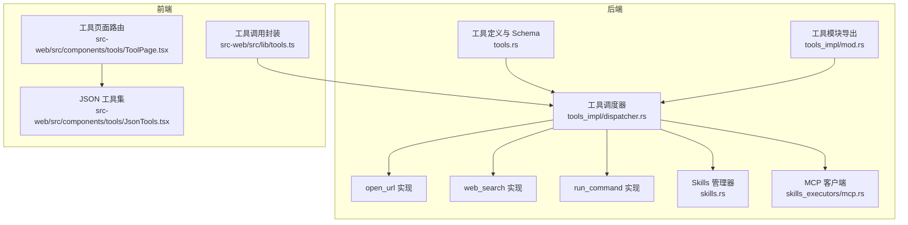
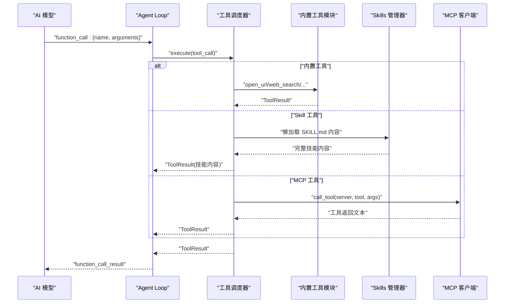
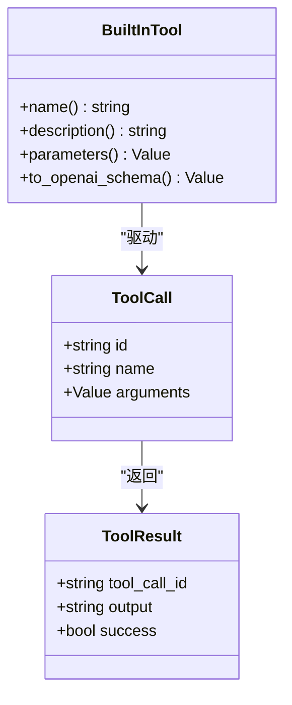
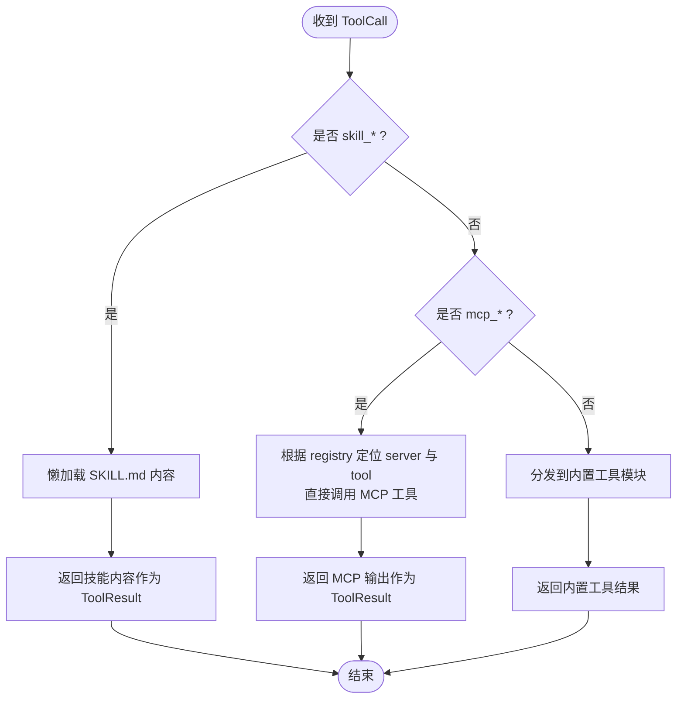
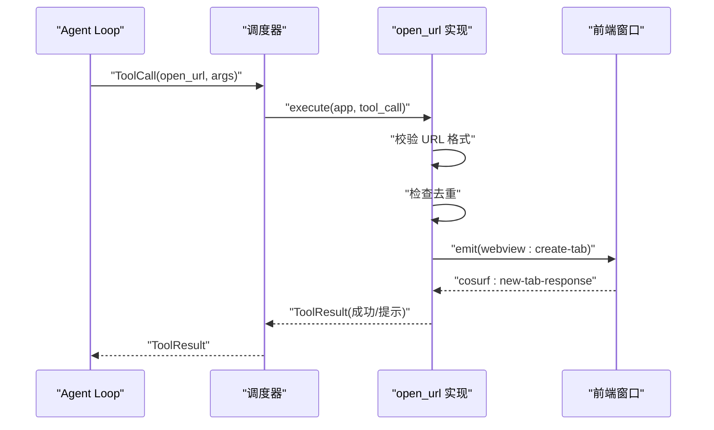
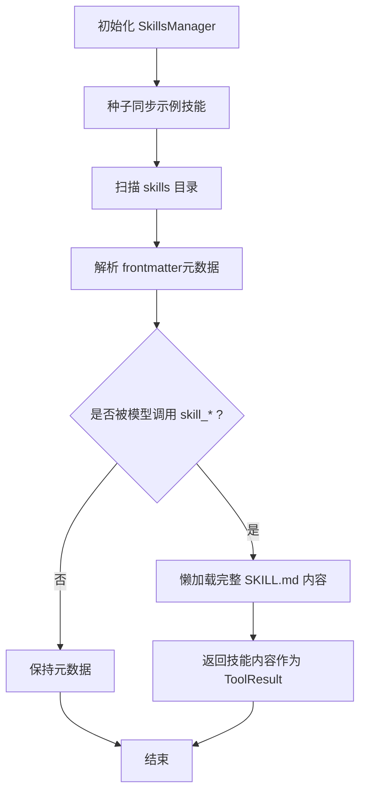
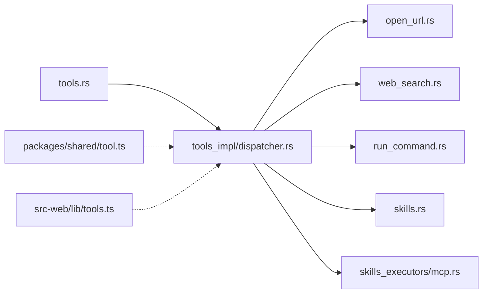

# 自定义工具开发

<cite>
**本文引用的文件**
- [src-tauri/src/ai/tools.rs](file://src-tauri/src/ai/tools.rs)
- [src-tauri/src/ai/tools_impl/mod.rs](file://src-tauri/src/ai/tools_impl/mod.rs)
- [src-tauri/src/ai/tools_impl/dispatcher.rs](file://src-tauri/src/ai/tools_impl/dispatcher.rs)
- [src-tauri/src/ai/tools_impl/open_url.rs](file://src-tauri/src/ai/tools_impl/open_url.rs)
- [src-tauri/src/ai/tools_impl/web_search.rs](file://src-tauri/src/ai/tools_impl/web_search.rs)
- [src-tauri/src/ai/tools_impl/run_command.rs](file://src-tauri/src/ai/tools_impl/run_command.rs)
- [src-tauri/src/ai/skills.rs](file://src-tauri/src/ai/skills.rs)
- [src-tauri/src/ai/skills_executors/mcp.rs](file://src-tauri/src/ai/skills_executors/mcp.rs)
- [src-tauri/src/ai/skills_executors/mod.rs](file://src-tauri/src/ai/skills_executors/mod.rs)
- [packages/shared/src/tool.ts](file://packages/shared/src/tool.ts)
- [src-web/src/lib/tools.ts](file://src-web/src/lib/tools.ts)
- [src-web/src/components/tools/ToolPage.tsx](file://src-web/src/components/tools/ToolPage.tsx)
- [src-web/src/components/tools/JsonTools.tsx](file://src-web/src/components/tools/JsonTools.tsx)
- [examples/skills/alibaba-iqs-search/SKILL.md](file://examples/skills/alibaba-iqs-search/SKILL.md)
- [examples/skills/python-calculator/SKILL.md](file://examples/skills/python-calculator/SKILL.md)
- [examples/skills/web-summarizer/SKILL.md](file://examples/skills/web-summarizer/SKILL.md)
</cite>

## 目录
1. [简介](#简介)
2. [项目结构](#项目结构)
3. [核心组件](#核心组件)
4. [架构总览](#架构总览)
5. [详细组件分析](#详细组件分析)
6. [依赖关系分析](#依赖关系分析)
7. [性能考量](#性能考量)
8. [故障排查指南](#故障排查指南)
9. [结论](#结论)
10. [附录](#附录)

## 简介
本指南面向希望在 CoSurf 中开发“自定义工具”的工程师与高级用户。文档围绕工具接口定义、schema 结构、执行流程与调度机制展开，同时给出工具实现步骤、与 AI Agent 的集成方式、扩展示例、配置管理、测试与安全注意事项等，帮助读者快速构建稳定、可维护且安全的工具。

## 项目结构
CoSurf 的工具体系由 Rust 后端的“内置工具 + 技能工具 + MCP 工具”三部分组成，并通过统一的调度器进行路由；前端提供工具调用与展示能力。

**图表来源**
- [src-tauri/src/ai/tools.rs:1-418](file://src-tauri/src/ai/tools.rs#L1-L418)
- [src-tauri/src/ai/tools_impl/dispatcher.rs:1-238](file://src-tauri/src/ai/tools_impl/dispatcher.rs#L1-L238)
- [src-tauri/src/ai/tools_impl/mod.rs:1-14](file://src-tauri/src/ai/tools_impl/mod.rs#L1-L14)
- [src-tauri/src/ai/skills.rs:1-567](file://src-tauri/src/ai/skills.rs#L1-L567)
- [src-tauri/src/ai/skills_executors/mcp.rs:1-555](file://src-tauri/src/ai/skills_executors/mcp.rs#L1-L555)
- [src-web/src/lib/tools.ts:1-125](file://src-web/src/lib/tools.ts#L1-L125)
- [src-web/src/components/tools/ToolPage.tsx:1-59](file://src-web/src/components/tools/ToolPage.tsx#L1-L59)
- [src-web/src/components/tools/JsonTools.tsx:1-940](file://src-web/src/components/tools/JsonTools.tsx#L1-L940)

**章节来源**
- [src-tauri/src/ai/tools.rs:1-418](file://src-tauri/src/ai/tools.rs#L1-L418)
- [src-tauri/src/ai/tools_impl/dispatcher.rs:1-238](file://src-tauri/src/ai/tools_impl/dispatcher.rs#L1-L238)
- [src-tauri/src/ai/tools_impl/mod.rs:1-14](file://src-tauri/src/ai/tools_impl/mod.rs#L1-L14)
- [src-tauri/src/ai/skills.rs:1-567](file://src-tauri/src/ai/skills.rs#L1-L567)
- [src-tauri/src/ai/skills_executors/mcp.rs:1-555](file://src-tauri/src/ai/skills_executors/mcp.rs#L1-L555)
- [src-web/src/lib/tools.ts:1-125](file://src-web/src/lib/tools.ts#L1-L125)
- [src-web/src/components/tools/ToolPage.tsx:1-59](file://src-web/src/components/tools/ToolPage.tsx#L1-L59)
- [src-web/src/components/tools/JsonTools.tsx:1-940](file://src-web/src/components/tools/JsonTools.tsx#L1-L940)

## 核心组件
- 工具接口与 Schema
  - 工具调用与结果的数据结构定义，以及内置工具的 OpenAI function calling 格式的 schema 生成逻辑。
  - 支持同步与异步两种 schema 获取方式：同步仅内置工具；异步包含 Skills 与 MCP 工具。
- 工具调度器
  - 根据工具名进行路由：内置工具、Skill 工具（懒加载）、MCP 工具（直接调用）。
- 内置工具实现
  - open_url：打开 URL，前端交互与去重控制。
  - web_search：调用阿里云 IQS API 获取搜索结果。
  - run_command：跨平台执行命令，含超时、输出截断与危险命令拦截。
- Skills 管理器
  - 渐进式加载：仅解析 frontmatter，实际内容按需懒加载。
  - 支持示例技能导入、目录扫描、启用状态管理、文件变更持久化。
- MCP 客户端
  - 支持 Streamable HTTP 与 SSE 两种传输模式，遵循 JSON-RPC 2.0。
  - 提供工具发现与调用能力，返回标准化文本结果。

**章节来源**
- [src-tauri/src/ai/tools.rs:1-418](file://src-tauri/src/ai/tools.rs#L1-L418)
- [src-tauri/src/ai/tools_impl/dispatcher.rs:1-238](file://src-tauri/src/ai/tools_impl/dispatcher.rs#L1-L238)
- [src-tauri/src/ai/tools_impl/open_url.rs:1-146](file://src-tauri/src/ai/tools_impl/open_url.rs#L1-L146)
- [src-tauri/src/ai/tools_impl/web_search.rs:1-179](file://src-tauri/src/ai/tools_impl/web_search.rs#L1-L179)
- [src-tauri/src/ai/tools_impl/run_command.rs:1-161](file://src-tauri/src/ai/tools_impl/run_command.rs#L1-L161)
- [src-tauri/src/ai/skills.rs:1-567](file://src-tauri/src/ai/skills.rs#L1-L567)
- [src-tauri/src/ai/skills_executors/mcp.rs:1-555](file://src-tauri/src/ai/skills_executors/mcp.rs#L1-L555)

## 架构总览
下图展示了工具从“被模型选择”到“执行与返回结果”的整体流程，涵盖内置工具、Skills 与 MCP 工具三种来源。

**图表来源**
- [src-tauri/src/ai/tools.rs:197-225](file://src-tauri/src/ai/tools.rs#L197-L225)
- [src-tauri/src/ai/tools_impl/dispatcher.rs:11-55](file://src-tauri/src/ai/tools_impl/dispatcher.rs#L11-L55)
- [src-tauri/src/ai/skills.rs:252-263](file://src-tauri/src/ai/skills.rs#L252-L263)
- [src-tauri/src/ai/skills_executors/mcp.rs:200-246](file://src-tauri/src/ai/skills_executors/mcp.rs#L200-L246)

## 详细组件分析

### 工具接口与 Schema
- 数据结构
  - ToolCall：包含工具调用 ID、名称与参数。
  - ToolResult：包含工具调用 ID、输出文本与成功标记。
- 内置工具枚举 BuiltInTool
  - 提供名称、描述与参数 schema（OpenAI function calling 格式）。
  - 支持同步与异步 schema 获取：异步版本还会合并 Skills 与 MCP 工具。
- 异步工具发现与注册
  - Skills：仅暴露 description，模型调用 skill_{id} 后，调度器懒加载完整内容。
  - MCP：连接服务器拉取 tools/list，将每个工具注册为独立 function，命名规则为 mcp_{server}_{tool}，并建立 registry 供调度器路由。

**图表来源**
- [src-tauri/src/ai/tools.rs:4-195](file://src-tauri/src/ai/tools.rs#L4-L195)

**章节来源**
- [src-tauri/src/ai/tools.rs:1-418](file://src-tauri/src/ai/tools.rs#L1-L418)

### 工具调度器
- 路由规则
  - 以“skill_”前缀识别 Skill 工具，懒加载完整内容。
  - 以“mcp_”前缀识别 MCP 工具，通过 registry 查找对应 server 与原始工具名，直接调用。
  - 其他名称映射到内置工具模块。
- 错误处理
  - 未知工具名返回错误。
  - MCP 工具执行失败时返回包含错误信息的结果。

**图表来源**
- [src-tauri/src/ai/tools_impl/dispatcher.rs:11-204](file://src-tauri/src/ai/tools_impl/dispatcher.rs#L11-L204)

**章节来源**
- [src-tauri/src/ai/tools_impl/dispatcher.rs:1-238](file://src-tauri/src/ai/tools_impl/dispatcher.rs#L1-L238)

### 内置工具实现

#### open_url 工具
- 功能要点
  - 参数校验（URL 必须以 http/https 开头）。
  - 去重控制：相同 URL 在 5 秒内重复请求会被拦截并提示。
  - 与前端交互：通过事件创建新标签页，等待前端返回新标签页 ID 并激活。
- 安全与稳定性
  - 通过 AppState 中的 recent_opened_urls 防抖。
  - 超时等待新标签页响应（15 秒）。

**图表来源**
- [src-tauri/src/ai/tools_impl/open_url.rs:16-100](file://src-tauri/src/ai/tools_impl/open_url.rs#L16-L100)
- [src-tauri/src/ai/tools_impl/dispatcher.rs:102-145](file://src-tauri/src/ai/tools_impl/dispatcher.rs#L102-L145)

**章节来源**
- [src-tauri/src/ai/tools_impl/open_url.rs:1-146](file://src-tauri/src/ai/tools_impl/open_url.rs#L1-L146)

#### web_search 工具
- 功能要点
  - 从设置中读取 IQS API Key。
  - 调用阿里云 IQS Unified Search 接口，解析返回的 items/results。
  - 格式化输出为易读的结果列表。
- 错误处理
  - 未配置 API Key 时返回明确提示。
  - HTTP 失败与格式异常均返回可读错误信息。

**章节来源**
- [src-tauri/src/ai/tools_impl/web_search.rs:1-179](file://src-tauri/src/ai/tools_impl/web_search.rs#L1-L179)

#### run_command 工具
- 功能要点
  - 跨平台执行命令（Windows 使用 cmd /C，类 Unix 使用 sh -c）。
  - 超时控制（默认 30 秒，可配置）。
  - 输出截断（stdout 8000 字符，stderr 更短）。
  - 危险命令拦截（黑名单匹配）。
- 安全机制
  - 隐藏窗口（Windows）。
  - 严格超时与输出长度限制，防止资源耗尽。

**章节来源**
- [src-tauri/src/ai/tools_impl/run_command.rs:1-161](file://src-tauri/src/ai/tools_impl/run_command.rs#L1-L161)

### Skills 管理器
- 渐进式加载
  - 初始仅解析 SKILL.md frontmatter，正文内容按需懒加载。
- 目录与导入
  - 支持从目录或 Markdown 文本导入技能，自动创建目录与 frontmatter。
  - 支持示例技能种子同步。
- 启用与持久化
  - 切换 enabled 状态会更新 SKILL.md frontmatter。
- 目录信息
  - 提供前端展示所需的目录信息（文件大小、修改时间等）。

**图表来源**
- [src-tauri/src/ai/skills.rs:99-170](file://src-tauri/src/ai/skills.rs#L99-L170)
- [src-tauri/src/ai/skills.rs:252-263](file://src-tauri/src/ai/skills.rs#L252-L263)

**章节来源**
- [src-tauri/src/ai/skills.rs:1-567](file://src-tauri/src/ai/skills.rs#L1-L567)

### MCP 客户端
- 传输模式
  - Streamable HTTP：直接 POST JSON-RPC 到 URL，支持 application/json 与 text/event-stream。
  - SSE：先 GET 建立 SSE，读取 endpoint，再 POST 到 endpoint。
- 协议与错误
  - 遵循 JSON-RPC 2.0，解析 result/error。
  - 对 MCP 工具返回的 isError 字段进行检查。
- 工具发现与调用
  - list_tools 获取工具清单，call_tool 执行具体工具。

**章节来源**
- [src-tauri/src/ai/skills_executors/mcp.rs:1-555](file://src-tauri/src/ai/skills_executors/mcp.rs#L1-L555)

### 前端工具集成
- 工具调用封装
  - 提供页面总结与网页操作的封装，便于在对话中直接调用。
- 工具页面路由
  - 支持 cosurf://tools/* 路由，解析工具 ID 并渲染对应页面。
- JSON 工具集
  - 提供 JSON 解析、编辑、验证与树形视图等实用工具。

**章节来源**
- [src-web/src/lib/tools.ts:1-125](file://src-web/src/lib/tools.ts#L1-L125)
- [src-web/src/components/tools/ToolPage.tsx:1-59](file://src-web/src/components/tools/ToolPage.tsx#L1-L59)
- [src-web/src/components/tools/JsonTools.tsx:1-940](file://src-web/src/components/tools/JsonTools.tsx#L1-L940)

## 依赖关系分析
- 模块耦合
  - tools.rs 与 tools_impl/* 通过统一的 execute 入口解耦。
  - dispatcher.rs 与各工具模块松耦合，仅依赖工具名称与参数。
  - Skills 与 MCP 通过异步发现机制与调度器解耦。
- 外部依赖
  - web_search 依赖阿里云 IQS API。
  - MCP 客户端依赖 reqwest 与 JSON-RPC 协议。
  - run_command 依赖系统进程执行。

**图表来源**
- [src-tauri/src/ai/tools.rs:197-225](file://src-tauri/src/ai/tools.rs#L197-L225)
- [src-tauri/src/ai/tools_impl/dispatcher.rs:1-238](file://src-tauri/src/ai/tools_impl/dispatcher.rs#L1-L238)
- [src-tauri/src/ai/tools_impl/open_url.rs:1-146](file://src-tauri/src/ai/tools_impl/open_url.rs#L1-L146)
- [src-tauri/src/ai/tools_impl/web_search.rs:1-179](file://src-tauri/src/ai/tools_impl/web_search.rs#L1-L179)
- [src-tauri/src/ai/tools_impl/run_command.rs:1-161](file://src-tauri/src/ai/tools_impl/run_command.rs#L1-L161)
- [src-tauri/src/ai/skills.rs:1-567](file://src-tauri/src/ai/skills.rs#L1-L567)
- [src-tauri/src/ai/skills_executors/mcp.rs:1-555](file://src-tauri/src/ai/skills_executors/mcp.rs#L1-L555)
- [packages/shared/src/tool.ts:1-88](file://packages/shared/src/tool.ts#L1-L88)
- [src-web/src/lib/tools.ts:1-125](file://src-web/src/lib/tools.ts#L1-L125)

**章节来源**
- [src-tauri/src/ai/tools.rs:1-418](file://src-tauri/src/ai/tools.rs#L1-L418)
- [src-tauri/src/ai/tools_impl/mod.rs:1-14](file://src-tauri/src/ai/tools_impl/mod.rs#L1-L14)

## 性能考量
- 工具发现与加载
  - Skills 采用渐进式加载，仅在模型调用 skill_* 时才读取完整内容，降低初始开销。
  - MCP 工具发现带超时保护（15 秒），避免阻塞 Agent Loop。
- I/O 与网络
  - web_search 与 MCP 工具调用均设置合理超时，避免长时间阻塞。
  - open_url 通过去重与超时等待减少无效请求与前端等待。
- 输出与内存
  - run_command 对 stdout/stderr 输出进行截断，防止超长文本占用内存。
  - dispatcher 在返回 ToolResult 时仅传递必要字段，避免冗余序列化。

[本节为通用指导，无需列出章节来源]

## 故障排查指南
- 未配置 IQS API Key
  - 现象：web_search 返回配置错误提示。
  - 处理：在设置中配置 ALIYUN_IQS_API_KEY。
- MCP 工具不可用
  - 现象：MCP 工具未注册或执行失败。
  - 处理：确认 MCP 服务器连通性、URL 与认证头配置；检查工具发现超时与 registry 是否更新。
- open_url 重复打开
  - 现象：短时间内重复打开同一 URL 返回提示。
  - 处理：等待 5 秒后再尝试，或检查前端响应是否正常。
- run_command 超时或被拦截
  - 现象：命令执行超时或返回拦截信息。
  - 处理：缩短命令复杂度、调整 timeout、避免危险命令。

**章节来源**
- [src-tauri/src/ai/tools_impl/web_search.rs:56-62](file://src-tauri/src/ai/tools_impl/web_search.rs#L56-L62)
- [src-tauri/src/ai/tools_impl/dispatcher.rs:125-204](file://src-tauri/src/ai/tools_impl/dispatcher.rs#L125-L204)
- [src-tauri/src/ai/tools_impl/open_url.rs:40-64](file://src-tauri/src/ai/tools_impl/open_url.rs#L40-L64)
- [src-tauri/src/ai/tools_impl/run_command.rs:96-149](file://src-tauri/src/ai/tools_impl/run_command.rs#L96-L149)

## 结论
CoSurf 的工具体系通过统一的工具接口、灵活的调度器与渐进式加载策略，实现了内置工具、Skills 与 MCP 工具的无缝集成。借助清晰的 schema 定义与严格的错误处理，开发者可以快速扩展新的工具，同时保证系统的安全性与稳定性。

[本节为总结性内容，无需列出章节来源]

## 附录

### 工具实现步骤（Rust 后端）
- 创建工具文件
  - 在 tools_impl 目录新增实现模块（如 new_tool.rs）。
  - 在 tools_impl/mod.rs 中导出模块并重新导出 execute 入口。
- 实现执行函数
  - 定义 execute(app, tool_call) -> AppResult<ToolResult>。
  - 解析参数、执行业务逻辑、构造 ToolResult。
- 注册与路由
  - 在 dispatcher.rs 的 match 分支中添加新工具分支。
  - 如需异步发现，参考 tools.rs 的 get_available_tools_schemas_async 与 get_mcp_tools_schemas_async。
- 参数与 schema
  - 在 tools.rs 的 BuiltInTool::parameters 中定义参数 schema。
  - 如为 Skills/MCP 工具，遵循渐进式加载与直接调用的约定。

**章节来源**
- [src-tauri/src/ai/tools_impl/mod.rs:1-14](file://src-tauri/src/ai/tools_impl/mod.rs#L1-L14)
- [src-tauri/src/ai/tools_impl/dispatcher.rs:34-54](file://src-tauri/src/ai/tools_impl/dispatcher.rs#L34-L54)
- [src-tauri/src/ai/tools.rs:63-182](file://src-tauri/src/ai/tools.rs#L63-L182)

### 工具与 AI Agent 的集成
- 系统提示词更新
  - 可通过 tools.rs 的 BuiltInTool::description 与 to_openai_schema 为模型提供更准确的工具描述。
  - Skills 与 MCP 工具通过异步发现注入到模型可用工具列表。
- 工具调用序列
  - Agent Loop 根据模型选择的工具名称路由至对应实现，返回 ToolResult。
- 结果解析
  - 内置工具返回结构化文本；MCP 工具返回标准化文本；Skills 工具返回完整技能内容供后续决策。

**章节来源**
- [src-tauri/src/ai/tools.rs:184-225](file://src-tauri/src/ai/tools.rs#L184-L225)
- [src-tauri/src/ai/tools_impl/dispatcher.rs:57-119](file://src-tauri/src/ai/tools_impl/dispatcher.rs#L57-L119)

### 扩展示例
- 网络请求工具
  - 参考 web_search 的 HTTP 客户端与错误处理模式，结合自定义 API Key 与超时设置。
- 文件操作工具
  - 可在 Rust 层实现文件读写、目录遍历等，注意权限与路径安全。
- 系统命令工具
  - 参考 run_command 的跨平台执行、超时与输出截断策略，严格控制危险命令。

**章节来源**
- [src-tauri/src/ai/tools_impl/web_search.rs:66-106](file://src-tauri/src/ai/tools_impl/web_search.rs#L66-L106)
- [src-tauri/src/ai/tools_impl/run_command.rs:34-150](file://src-tauri/src/ai/tools_impl/run_command.rs#L34-L150)

### 配置管理
- 参数验证
  - 在工具实现中对必填参数与取值范围进行校验。
- 默认值设置
  - 参考 BuiltInTool::parameters 中的 default 字段。
- 运行时配置
  - 通过设置项（如 IQS API Key）动态注入，避免硬编码。

**章节来源**
- [src-tauri/src/ai/tools.rs:158-182](file://src-tauri/src/ai/tools.rs#L158-L182)
- [src-tauri/src/ai/tools_impl/web_search.rs:42-64](file://src-tauri/src/ai/tools_impl/web_search.rs#L42-L64)

### 测试方法
- 单元测试
  - 对工具参数解析与边界条件进行测试（如超时、空输出、危险命令）。
- 集成测试
  - 模拟 Agent Loop 的工具调用序列，验证调度器路由与结果返回。
- 前端联调
  - 通过 src-web 的工具调用封装验证 UI 与后端交互。

[本节为通用指导，无需列出章节来源]

### 安全考虑
- 命令执行安全
  - run_command 的危险命令黑名单与超时限制。
- 网络请求安全
  - web_search 与 MCP 客户端的超时与错误处理。
- 前端交互安全
  - open_url 的去重与超时等待，避免滥用。

**章节来源**
- [src-tauri/src/ai/tools_impl/run_command.rs:22-67](file://src-tauri/src/ai/tools_impl/run_command.rs#L22-L67)
- [src-tauri/src/ai/tools_impl/web_search.rs:85-106](file://src-tauri/src/ai/tools_impl/web_search.rs#L85-L106)
- [src-tauri/src/ai/tools_impl/open_url.rs:40-64](file://src-tauri/src/ai/tools_impl/open_url.rs#L40-L64)

### 示例技能参考
- 阿里云 IQS 搜索：演示了搜索工具的使用场景与参数说明。
- Python 计算器：展示了数学计算工具的设计思路。
- 网页内容总结：展示了 open_url、summarize_page、translate、export_markdown 的组合使用。

**章节来源**
- [examples/skills/alibaba-iqs-search/SKILL.md:1-49](file://examples/skills/alibaba-iqs-search/SKILL.md#L1-L49)
- [examples/skills/python-calculator/SKILL.md:1-39](file://examples/skills/python-calculator/SKILL.md#L1-L39)
- [examples/skills/web-summarizer/SKILL.md:1-57](file://examples/skills/web-summarizer/SKILL.md#L1-L57)