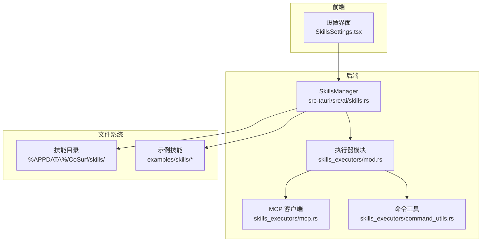
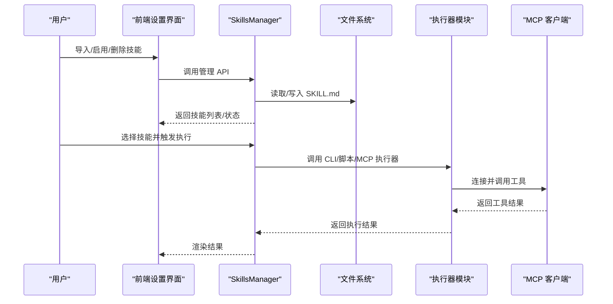
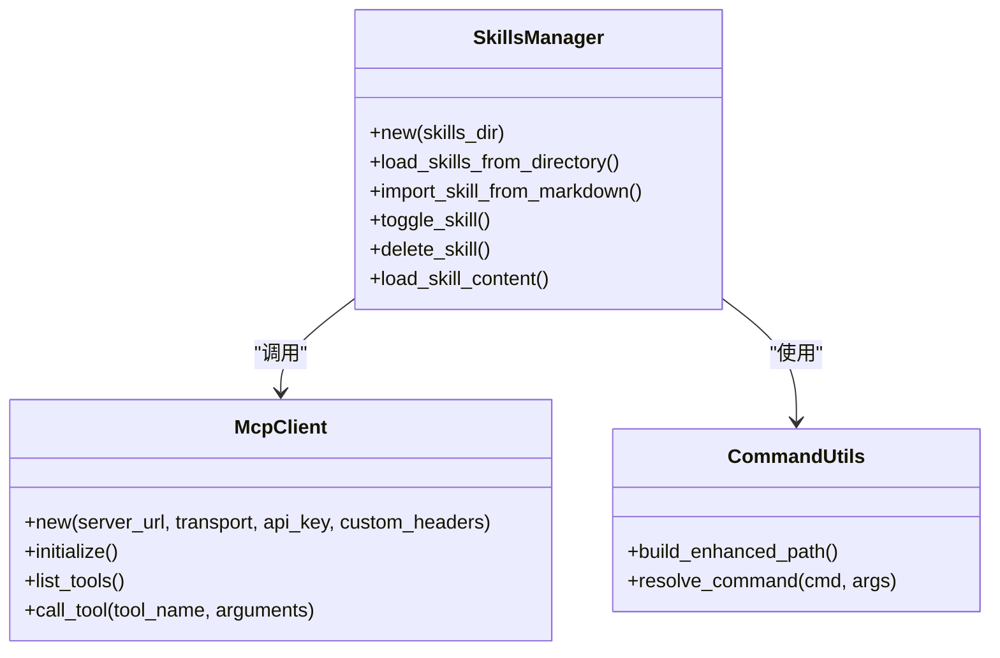

# 技能开发指南

<cite>
**本文引用的文件**
- [README.md](file://README.md)
- [SKILL.md](file://examples/skills/python-calculator/SKILL.md)
- [SKILL.md](file://examples/skills/web-summarizer/SKILL.md)
- [skills.rs](file://src-tauri/src/ai/skills.rs)
- [skills.rs](file://native/src/ai/skills.rs)
- [mcp.rs](file://src-tauri/src/ai/skills_executors/mcp.rs)
- [command_utils.rs](file://src-tauri/src/ai/skills_executors/command_utils.rs)
- [SkillsSettings.tsx](file://src-web/src/components/settings/SkillsSettings.tsx)
- [echo-skill.json](file://examples/echo-skill.json)
- [python-calculator-skill.json](file://examples/python-calculator-skill.json)
- [alibabacloud-iqs-search-skill.json](file://examples/alibabacloud-iqs-search-skill.json)
- [mod.rs](file://src-tauri/src/ai/skills_executors/mod.rs)
</cite>

## 目录
1. [简介](#简介)
2. [项目结构](#项目结构)
3. [核心组件](#核心组件)
4. [架构总览](#架构总览)
5. [详细组件分析](#详细组件分析)
6. [依赖关系分析](#依赖关系分析)
7. [性能考虑](#性能考虑)
8. [故障排查指南](#故障排查指南)
9. [结论](#结论)
10. [附录](#附录)

## 简介
本指南面向希望为 CoSurf 开发自定义技能（Skills）的开发者，涵盖从 SKILL.md 编写规范、Frontmatter 字段定义、Markdown 内容结构，到技能配置选项、实现最佳实践、测试方法、发布与分发，以及常见问题解决。CoSurf 的技能系统支持多种类型：CLI 技能、Python/脚本技能、MCP 技能，并通过 Agent Loop 与 AI 模型协同工作。

## 项目结构
CoSurf 的技能系统由前端设置界面、后端 Rust 管理器、MCP 客户端与命令工具组成，配合示例技能与 JSON 配置文件，形成完整的技能生命周期管理。

图表来源
- [SkillsSettings.tsx:1-550](file://src-web/src/components/settings/SkillsSettings.tsx#L1-550)
- [skills.rs:1-576](file://src-tauri/src/ai/skills.rs#L1-576)
- [mod.rs:1-6](file://src-tauri/src/ai/skills_executors/mod.rs#L1-6)
- [mcp.rs:1-558](file://src-tauri/src/ai/skills_executors/mcp.rs#L1-558)
- [command_utils.rs:1-95](file://src-tauri/src/ai/skills_executors/command_utils.rs#L1-95)

章节来源
- [README.md:468-516](file://README.md#L468-L516)
- [SkillsSettings.tsx:1-550](file://src-web/src/components/settings/SkillsSettings.tsx#L1-550)
- [skills.rs:1-576](file://src-tauri/src/ai/skills.rs#L1-576)

## 核心组件
- 技能管理器（SkillsManager）：负责扫描技能目录、解析 SKILL.md Frontmatter、按需懒加载完整内容、导入/导出/删除技能、启用/禁用技能。
- 执行器模块：提供 MCP 客户端与命令工具，支持 CLI/脚本技能的执行（当前以 Agent Loop 驱动为主）。
- 前端设置界面：提供技能目录配置、导入/预览/删除/启用/禁用等操作入口。
- 示例技能与 JSON 配置：提供 CLI、Python 脚本、MCP 技能的参考实现。

章节来源
- [skills.rs:84-576](file://src-tauri/src/ai/skills.rs#L84-L576)
- [mod.rs:1-6](file://src-tauri/src/ai/skills_executors/mod.rs#L1-6)
- [SkillsSettings.tsx:1-550](file://src-web/src/components/settings/SkillsSettings.tsx#L1-550)
- [echo-skill.json:1-28](file://examples/echo-skill.json#L1-28)
- [python-calculator-skill.json:1-27](file://examples/python-calculator-skill.json#L1-27)
- [alibabacloud-iqs-search-skill.json:1-45](file://examples/alibabacloud-iqs-search-skill.json#L1-45)

## 架构总览
技能系统采用“渐进式加载”策略：启动时仅解析 SKILL.md 的 Frontmatter，真正使用时再懒加载完整 Markdown 内容；MCP 技能通过 MCP 客户端与远端服务通信；CLI/脚本技能通过命令工具增强 PATH 与跨平台命令解析。

图表来源
- [SkillsSettings.tsx:1-550](file://src-web/src/components/settings/SkillsSettings.tsx#L1-550)
- [skills.rs:261-272](file://src-tauri/src/ai/skills.rs#L261-L272)
- [mcp.rs:167-198](file://src-tauri/src/ai/skills_executors/mcp.rs#L167-L198)

章节来源
- [README.md:468-516](file://README.md#L468-L516)
- [skills.rs:1-16](file://src-tauri/src/ai/skills.rs#L1-L16)

## 详细组件分析

### SKILL.md 编写规范与 Frontmatter 字段
- Frontmatter 必须使用 YAML 格式，以三连字符包裹。
- 必填字段：name、description。
- 可选字段：enabled（布尔，默认启用）、tags（字符串数组）。
- 正文内容：用于指导 AI 如何调用工具或执行步骤，模型将据此决定后续动作。

章节来源
- [skills.rs:51-60](file://src-tauri/src/ai/skills.rs#L51-L60)
- [skills.rs:241-244](file://src-tauri/src/ai/skills.rs#L241-L244)
- [SKILL.md:1-39](file://examples/skills/python-calculator/SKILL.md#L1-L39)
- [SKILL.md:1-57](file://examples/skills/web-summarizer/SKILL.md#L1-L57)

### 技能配置选项（JSON 配置）
- id：技能唯一标识（建议使用短横线命名）。
- name、description：技能名称与描述。
- type：技能类型（cli、script、mcp）。
- enabled：是否启用。
- tags：标签数组。
- config：具体配置对象，包含：
  - cli/script/mcp 的特定参数（如命令、参数模板、脚本源码、超时等）。
  - parameters：JSON Schema，定义参数类型、必填项、枚举值、示例等。

章节来源
- [echo-skill.json:1-28](file://examples/echo-skill.json#L1-28)
- [python-calculator-skill.json:1-27](file://examples/python-calculator-skill.json#L1-27)
- [alibabacloud-iqs-search-skill.json:1-45](file://examples/alibabacloud-iqs-search-skill.json#L1-45)

### 技能实现最佳实践
- 代码组织
  - CLI/脚本技能：将可执行命令与参数模板分离，便于测试与维护。
  - MCP 技能：通过标准化的 JSON-RPC 2.0 与远端服务交互，确保错误处理与超时控制。
- 错误处理
  - 对网络请求、文件读写、命令执行进行异常捕获与错误映射。
  - 对 MCP 工具调用返回的 isError 字段进行检查，必要时抛出业务错误。
- 日志记录
  - 使用 tracing 记录关键流程（初始化、工具调用、响应解析）。
  - 前端通过控制台搜索特定日志前缀定位问题。
- 性能优化
  - 懒加载 SKILL.md 内容，避免启动时大量 IO。
  - 增强 PATH 环境变量，减少跨平台命令查找失败。
  - 对频繁调用的工具结果进行缓存（可选）。

章节来源
- [mcp.rs:167-198](file://src-tauri/src/ai/skills_executors/mcp.rs#L167-L198)
- [mcp.rs:200-246](file://src-tauri/src/ai/skills_executors/mcp.rs#L200-L246)
- [command_utils.rs:4-95](file://src-tauri/src/ai/skills_executors/command_utils.rs#L4-L95)
- [skills.rs:261-272](file://src-tauri/src/ai/skills.rs#L261-L272)

### 技能开发模板与示例

#### CLI 技能模板
- 配置要点：command、args_template、timeout、require_confirmation。
- 参数占位符：通过模板渲染传入动态参数。
- 示例参考：echo-skill.json。

章节来源
- [echo-skill.json:1-28](file://examples/echo-skill.json#L1-28)

#### Python 脚本技能模板
- 配置要点：language（python）、source（脚本源码或文件）、is_file（是否为文件）、parameters（JSON Schema）。
- 安全性：避免使用危险函数，严格限制内置函数。
- 示例参考：python-calculator-skill.json。

章节来源
- [python-calculator-skill.json:1-27](file://examples/python-calculator-skill.json#L1-27)

#### MCP 技能模板
- 配置要点：MCP 服务器地址、传输模式（Streamable HTTP/SSE）、工具清单与调用。
- 连接流程：initialize → tools/list → tools/call。
- 示例参考：alibabacloud-iqs-search-skill.json（演示脚本技能，MCP 技能同理）。

章节来源
- [mcp.rs:167-198](file://src-tauri/src/ai/skills_executors/mcp.rs#L167-L198)
- [mcp.rs:248-258](file://src-tauri/src/ai/skills_executors/mcp.rs#L248-L258)
- [alibabacloud-iqs-search-skill.json:1-45](file://examples/alibabacloud-iqs-search-skill.json#L1-45)

### 技能测试方法
- 单元测试
  - 验证 CLI/脚本/MCP 执行器的基本行为与错误处理。
  - 使用异步测试框架（如 tokio）模拟调用链路。
- 集成测试
  - 导入示例技能，执行并断言输出符合预期。
  - 验证启用/禁用、删除、目录变更等管理操作。
- 用户验收测试
  - 在前端设置界面完成导入、启用、预览、删除全流程。
  - 验证 Agent Loop 调用技能时的交互与结果呈现。

章节来源
- [SkillsSettings.tsx:137-223](file://src-web/src/components/settings/SkillsSettings.tsx#L137-L223)
- [echo-skill.json:1-28](file://examples/echo-skill.json#L1-28)
- [python-calculator-skill.json:1-27](file://examples/python-calculator-skill.json#L1-27)

### 技能发布与分发
- 本地分发：将技能目录放置于应用数据目录下的 skills 子目录，重启应用后自动加载。
- 设置界面导入：支持从文件夹导入（包含 SKILL.md）或直接粘贴 Markdown 内容导入。
- 社区分享：将高质量技能提交至示例目录，供其他用户学习与使用。

章节来源
- [README.md:478-482](file://README.md#L478-L482)
- [SkillsSettings.tsx:137-173](file://src-web/src/components/settings/SkillsSettings.tsx#L137-L173)

## 依赖关系分析

图表来源
- [skills.rs:84-576](file://src-tauri/src/ai/skills.rs#L84-L576)
- [mcp.rs:92-101](file://src-tauri/src/ai/skills_executors/mcp.rs#L92-L101)
- [command_utils.rs:4-95](file://src-tauri/src/ai/skills_executors/command_utils.rs#L4-L95)

章节来源
- [skills.rs:84-576](file://src-tauri/src/ai/skills.rs#L84-L576)
- [mcp.rs:1-558](file://src-tauri/src/ai/skills_executors/mcp.rs#L1-L558)
- [command_utils.rs:1-95](file://src-tauri/src/ai/skills_executors/command_utils.rs#L1-95)

## 性能考虑
- 懒加载策略：仅在需要时读取 SKILL.md 完整内容，降低启动时 IO 压力。
- 路径增强：自动合并常见运行时安装路径，减少命令查找失败与重试。
- 超时与重试：为网络请求与工具执行设置合理超时，避免阻塞主线程。
- 缓存与并发：可引入缓存层与并发执行（在保证安全的前提下）。

章节来源
- [skills.rs:261-272](file://src-tauri/src/ai/skills.rs#L261-L272)
- [command_utils.rs:4-95](file://src-tauri/src/ai/skills_executors/command_utils.rs#L4-L95)
- [mcp.rs:146-150](file://src-tauri/src/ai/skills_executors/mcp.rs#L146-L150)

## 故障排查指南
- 端口冲突：若开发端口被占用，调整前端配置中的端口号。
- WebView2 问题：确保系统已安装最新 WebView2 Runtime。
- Rust 编译失败：关闭占用进程后重试编译。
- MCP 工具调用无结果：检查 MCP Server 是否正常运行与连接参数是否正确。
- 前端日志：通过控制台搜索特定日志前缀定位问题（如 ConversationStore、AIPanel）。
- 后端日志：设置 RUST_LOG=debug 查看详细日志，关注 Agent Loop、工具执行、MCP 通信等关键节点。

章节来源
- [README.md:548-556](file://README.md#L548-L556)
- [README.md:534-546](file://README.md#L534-L546)

## 结论
CoSurf 的技能系统通过清晰的文件结构、标准化的配置与强大的执行器模块，为开发者提供了灵活且可扩展的能力扩展方案。遵循本文的编写规范、最佳实践与测试流程，可以高效地开发出高质量的技能，并顺利集成到 AI Agent Loop 中，提升整体用户体验。

## 附录

### SKILL.md 内容结构示例（概念性）
- Frontmatter：name、description、enabled、tags
- 正文：使用说明、执行步骤、可用工具、注意事项、示例

章节来源
- [SKILL.md:1-39](file://examples/skills/python-calculator/SKILL.md#L1-L39)
- [SKILL.md:1-57](file://examples/skills/web-summarizer/SKILL.md#L1-L57)