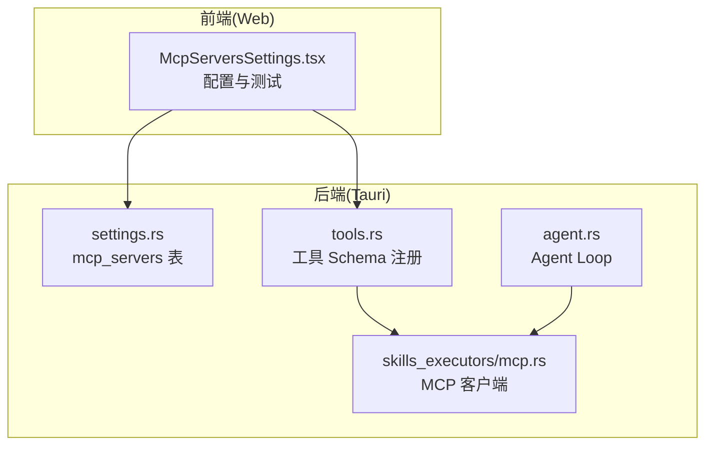
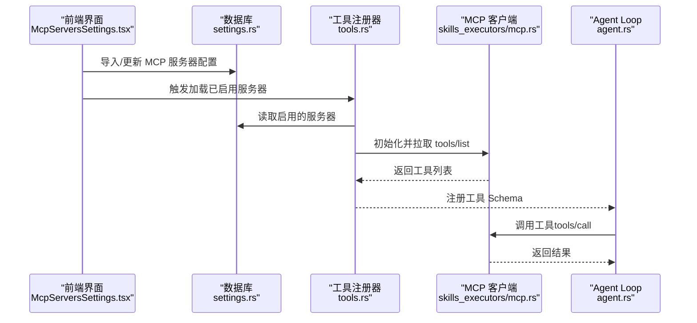
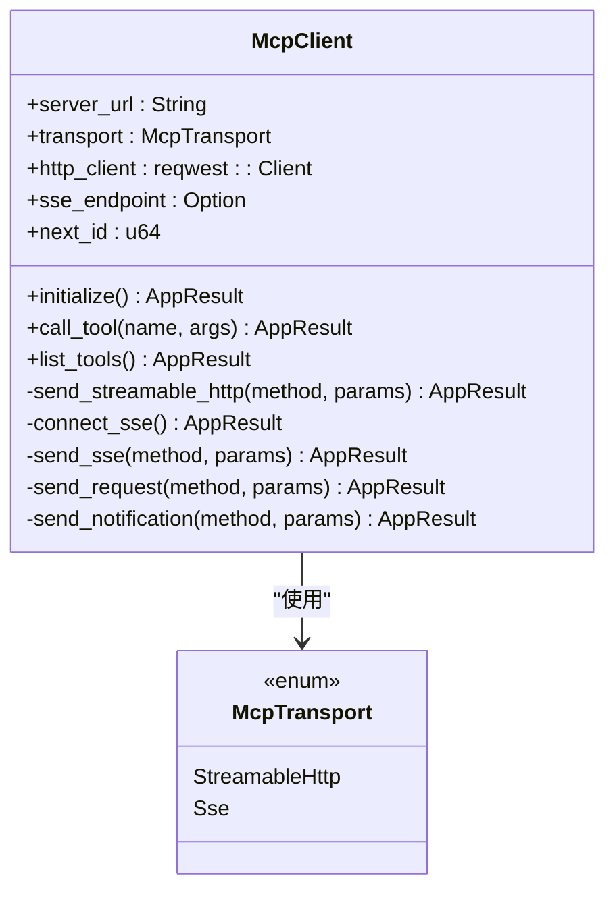
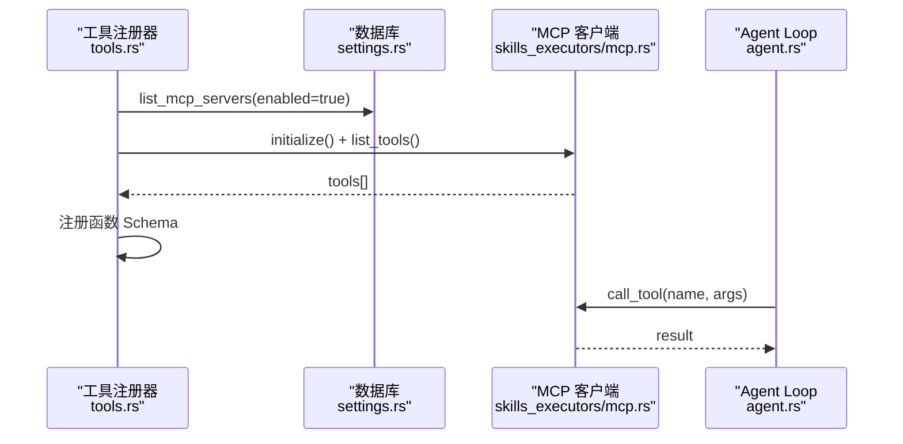
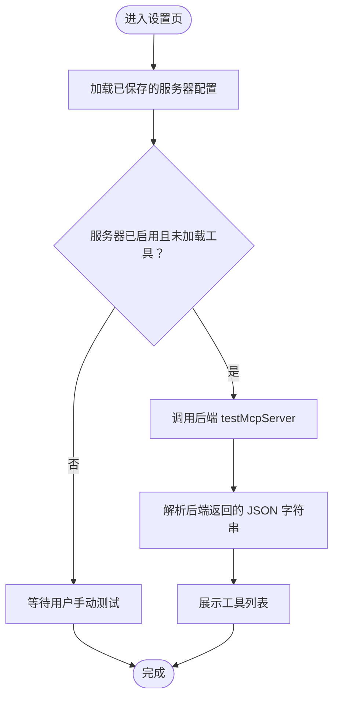
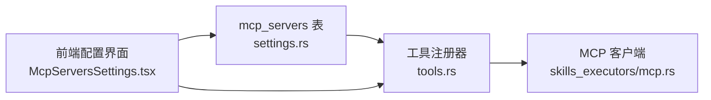

# MCP 执行器

<cite>
**本文引用的文件**
- [mcp.rs](file://src-tauri/src/ai/skills_executors/mcp.rs)
- [mcp.rs](file://native/src/ai/mcp.rs)
- [mcp.rs](file://src-tauri/src/ai/mcp.rs)
- [agent.rs](file://src-tauri/src/ai/agent.rs)
- [tools.rs](file://src-tauri/src/ai/tools.rs)
- [settings.rs](file://src-tauri/src/db/settings.rs)
- [mod.rs](file://src-tauri/src/db/mod.rs)
- [McpServersSettings.tsx](file://src-web/src/components/settings/McpServersSettings.tsx)
- [ai.rs](file://src-tauri/src/commands/ai.rs)
</cite>

## 目录
1. [简介](#简介)
2. [项目结构](#项目结构)
3. [核心组件](#核心组件)
4. [架构总览](#架构总览)
5. [详细组件分析](#详细组件分析)
6. [依赖关系分析](#依赖关系分析)
7. [性能考量](#性能考量)
8. [故障排查指南](#故障排查指南)
9. [结论](#结论)
10. [附录](#附录)

## 简介
本文件面向 CoSurf 的 MCP（Model Context Protocol）执行器，系统性阐述其架构设计、协议实现与与 Agent Loop 的集成方式。重点覆盖：
- MCP 客户端连接建立、协议握手、工具发现与调用流程
- 传输层抽象（Streamable HTTP、SSE）、错误处理与超时控制
- 工具 Schema 注册、参数校验与结果序列化
- 与 Agent Loop 的集成：工具注册、调用参数转换、异步执行模式
- MCP 服务器配置、连接测试、性能监控与故障排除

## 项目结构
CoSurf 的 MCP 执行器主要分布在 Tauri 后端与 Web 前端两部分：
- 后端（Rust）：实现 MCP 客户端、工具注册、Agent Loop 集成、数据库与命令接口
- 前端（React）：MCP 服务器配置界面，支持导入/编辑/测试工具列表

图表来源
- [McpServersSettings.tsx:81-184](file://src-web/src/components/settings/McpServersSettings.tsx#L81-L184)
- [settings.rs:378-539](file://src-tauri/src/db/settings.rs#L378-L539)
- [tools.rs:274-413](file://src-tauri/src/ai/tools.rs#L274-L413)
- [agent.rs:55-139](file://src-tauri/src/ai/agent.rs#L55-L139)
- [mcp.rs:92-198](file://src-tauri/src/ai/skills_executors/mcp.rs#L92-L198)

章节来源
- [McpServersSettings.tsx:81-184](file://src-web/src/components/settings/McpServersSettings.tsx#L81-L184)
- [settings.rs:114-129](file://src-tauri/src/db/settings.rs#L114-L129)
- [tools.rs:274-413](file://src-tauri/src/ai/tools.rs#L274-L413)
- [agent.rs:55-139](file://src-tauri/src/ai/agent.rs#L55-L139)
- [mcp.rs:92-198](file://src-tauri/src/ai/skills_executors/mcp.rs#L92-L198)

## 核心组件
- MCP 客户端（Tauri 后端）：负责与 MCP Server 建立连接、发送 JSON-RPC 请求、解析响应、支持 Streamable HTTP 与 SSE 两种传输模式
- 工具注册器：从数据库加载启用的 MCP 服务器，动态拉取 tools/list，并将每个工具注册为 Agent Loop 的函数
- Agent Loop：ReAct 式的智能代理循环，结合内置工具与 MCP 工具进行推理与行动
- 前端配置界面：提供 MCP 服务器的导入、编辑、测试与工具列表展示

章节来源
- [mcp.rs:92-198](file://src-tauri/src/ai/skills_executors/mcp.rs#L92-L198)
- [tools.rs:274-413](file://src-tauri/src/ai/tools.rs#L274-L413)
- [agent.rs:55-139](file://src-tauri/src/ai/agent.rs#L55-L139)
- [McpServersSettings.tsx:81-184](file://src-web/src/components/settings/McpServersSettings.tsx#L81-L184)

## 架构总览
下图展示了 MCP 执行器在 CoSurf 中的整体交互：前端配置 MCP 服务器，后端加载配置并注册工具，Agent Loop 在推理过程中调用 MCP 工具。

图表来源
- [McpServersSettings.tsx:104-184](file://src-web/src/components/settings/McpServersSettings.tsx#L104-L184)
- [settings.rs:378-539](file://src-tauri/src/db/settings.rs#L378-L539)
- [tools.rs:274-413](file://src-tauri/src/ai/tools.rs#L274-L413)
- [mcp.rs:167-198](file://src-tauri/src/ai/skills_executors/mcp.rs#L167-L198)
- [agent.rs:214-228](file://src-tauri/src/ai/agent.rs#L214-L228)

## 详细组件分析

### MCP 客户端（Tauri 后端）
- 传输模式
  - Streamable HTTP：直接 POST JSON-RPC 到服务器 URL，支持 application/json 与 text/event-stream
  - SSE：先发起 GET 建立 SSE 连接，从事件流中提取 endpoint，再 POST JSON-RPC 到 endpoint
- 协议握手
  - initialize：发送协议版本、客户端信息与能力声明
  - initialized：发送通知表明已就绪
- 工具发现与调用
  - tools/list：获取工具清单
  - tools/call：调用具体工具，解析 result 或错误
- 错误处理与超时
  - 对 HTTP/SSE 响应状态码进行检查
  - SSE 读取 endpoint 与响应时设置超时
  - JSON-RPC 错误与工具级错误（isError）统一处理

图表来源
- [mcp.rs:80-101](file://src-tauri/src/ai/skills_executors/mcp.rs#L80-L101)
- [mcp.rs:167-198](file://src-tauri/src/ai/skills_executors/mcp.rs#L167-L198)

章节来源
- [mcp.rs:92-198](file://src-tauri/src/ai/skills_executors/mcp.rs#L92-L198)
- [mcp.rs:260-305](file://src-tauri/src/ai/skills_executors/mcp.rs#L260-L305)
- [mcp.rs:307-461](file://src-tauri/src/ai/skills_executors/mcp.rs#L307-L461)
- [mcp.rs:524-556](file://src-tauri/src/ai/skills_executors/mcp.rs#L524-L556)

### 工具注册与 Agent 集成
- 工具注册
  - 从数据库读取启用的 MCP 服务器，按类型选择传输模式
  - 连接服务器并拉取 tools/list，将每个工具注册为独立函数
  - 命名规则：mcp_{server_safe_name}_{tool_name}
- Agent Loop 集成
  - Agent 在每轮推理中根据工具 Schema 生成函数调用
  - 调用 MCP 工具时，将参数传入并接收标准化结果

图表来源
- [tools.rs:274-413](file://src-tauri/src/ai/tools.rs#L274-L413)
- [settings.rs:378-539](file://src-tauri/src/db/settings.rs#L378-L539)
- [mcp.rs:167-198](file://src-tauri/src/ai/skills_executors/mcp.rs#L167-L198)
- [agent.rs:214-228](file://src-tauri/src/ai/agent.rs#L214-L228)

章节来源
- [tools.rs:274-413](file://src-tauri/src/ai/tools.rs#L274-L413)
- [agent.rs:71-139](file://src-tauri/src/ai/agent.rs#L71-L139)

### 前端 MCP 服务器配置与测试
- 支持导入/编辑/删除 MCP 服务器配置
- 自动加载启用服务器并测试连接，解析后端返回的工具列表
- 展示工具名称、描述与输入 Schema

图表来源
- [McpServersSettings.tsx:104-184](file://src-web/src/components/settings/McpServersSettings.tsx#L104-L184)

章节来源
- [McpServersSettings.tsx:81-184](file://src-web/src/components/settings/McpServersSettings.tsx#L81-L184)

## 依赖关系分析
- 数据库层
  - mcp_servers 表存储服务器类型、URL、命令、参数、环境变量、超时、启用状态与 headers
- 工具注册依赖
  - 从数据库读取配置，按类型构造 McpClient，调用 initialize 与 list_tools
- 前后端交互
  - 前端通过命令触发后端加载与测试，后端返回 JSON 字符串，前端解析并展示

图表来源
- [settings.rs:114-129](file://src-tauri/src/db/settings.rs#L114-L129)
- [tools.rs:274-413](file://src-tauri/src/ai/tools.rs#L274-L413)
- [mcp.rs:92-198](file://src-tauri/src/ai/skills_executors/mcp.rs#L92-L198)
- [McpServersSettings.tsx:81-184](file://src-web/src/components/settings/McpServersSettings.tsx#L81-L184)

章节来源
- [settings.rs:114-129](file://src-tauri/src/db/settings.rs#L114-L129)
- [tools.rs:274-413](file://src-tauri/src/ai/tools.rs#L274-L413)
- [mcp.rs:92-198](file://src-tauri/src/ai/skills_executors/mcp.rs#L92-L198)
- [McpServersSettings.tsx:81-184](file://src-web/src/components/settings/McpServersSettings.tsx#L81-L184)

## 性能考量
- 连接与超时
  - HTTP 客户端默认超时 60 秒；工具列表与 stdio 连接分别设置 15 秒与 5 秒超时，避免阻塞
- SSE 流式处理
  - SSE endpoint 读取与 JSON-RPC 响应解析均设置超时，防止长时间占用
- 并发与异步
  - 工具注册与测试采用异步与超时保护，避免阻塞 UI 与主流程
- 结果序列化
  - 工具调用结果优先提取 content 文本，否则回退为美化后的 JSON 字符串，便于前端展示

章节来源
- [mcp.rs:146-150](file://src-tauri/src/ai/skills_executors/mcp.rs#L146-L150)
- [tools.rs:377-395](file://src-tauri/src/ai/tools.rs#L377-L395)
- [tools.rs:477-620](file://src-tauri/src/ai/tools.rs#L477-L620)

## 故障排查指南
- 连接测试
  - 前端“测试连接”按钮触发后端 testMcpServer，后端返回 JSON 字符串；若解析失败，检查服务器 URL、headers 与网络可达性
- SSE 端点获取
  - 若 SSE endpoint 读取超时或为空，确认服务器支持 SSE 并正确返回 endpoint 事件
- 工具调用
  - 若工具返回 isError，检查工具参数与服务器权限；若返回非标准格式，前端将回退为美化 JSON 展示
- 数据库配置
  - 确认 mcp_servers 表中的 server_type、url、headers、enabled 等字段正确；必要时通过导入/编辑功能修正
- 日志与调试
  - 后端日志包含请求 ID、响应状态与内容类型，有助于定位问题

章节来源
- [McpServersSettings.tsx:291-338](file://src-web/src/components/settings/McpServersSettings.tsx#L291-L338)
- [mcp.rs:307-414](file://src-tauri/src/ai/skills_executors/mcp.rs#L307-L414)
- [mcp.rs:462-522](file://src-tauri/src/ai/skills_executors/mcp.rs#L462-L522)
- [settings.rs:378-539](file://src-tauri/src/db/settings.rs#L378-L539)

## 结论
CoSurf 的 MCP 执行器通过清晰的传输层抽象与严格的协议实现，实现了与 MCP Server 的稳定交互。配合前端配置界面与后端工具注册机制，MCP 工具被无缝集成到 Agent Loop 中，形成可扩展、可观测、易维护的智能代理能力体系。建议在生产环境中持续关注超时与错误处理策略，确保工具调用的稳定性与用户体验。

## 附录

### MCP 服务器配置要点
- 服务器类型
  - 支持 stdio、http、streamableHttp、sse
- 关键字段
  - url：HTTP/SSE/StreamableHttp 必填
  - headers：可携带认证信息（如 X-API-Key）
  - command/args/cwd/env：stdio 模式必填
  - enabled/disabled：控制启用状态
  - timeout：连接与工具调用超时控制

章节来源
- [settings.rs:27-43](file://src-tauri/src/db/settings.rs#L27-L43)
- [settings.rs:71-114](file://src-tauri/src/db/settings.rs#L71-L114)
- [settings.rs:378-539](file://src-tauri/src/db/settings.rs#L378-L539)