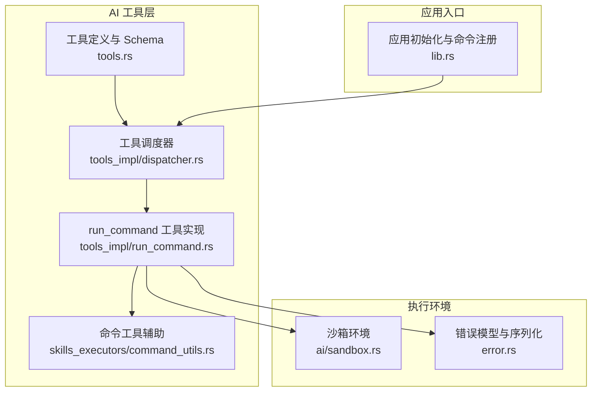
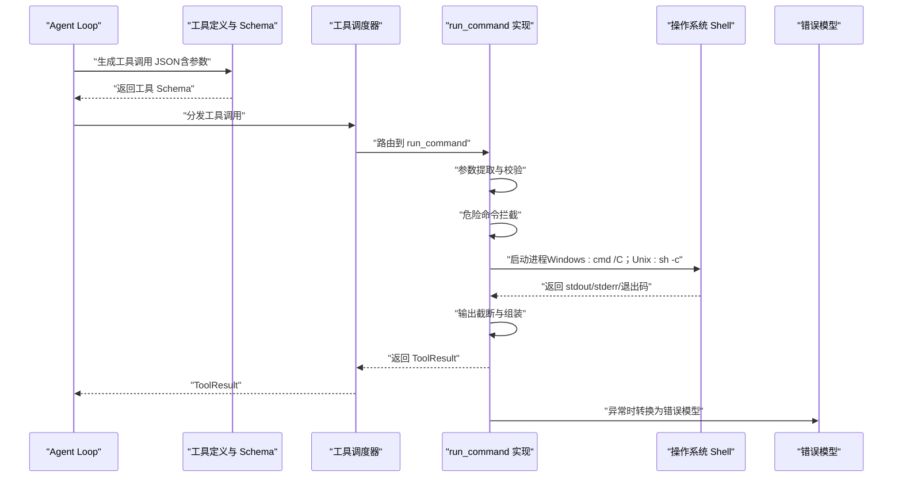
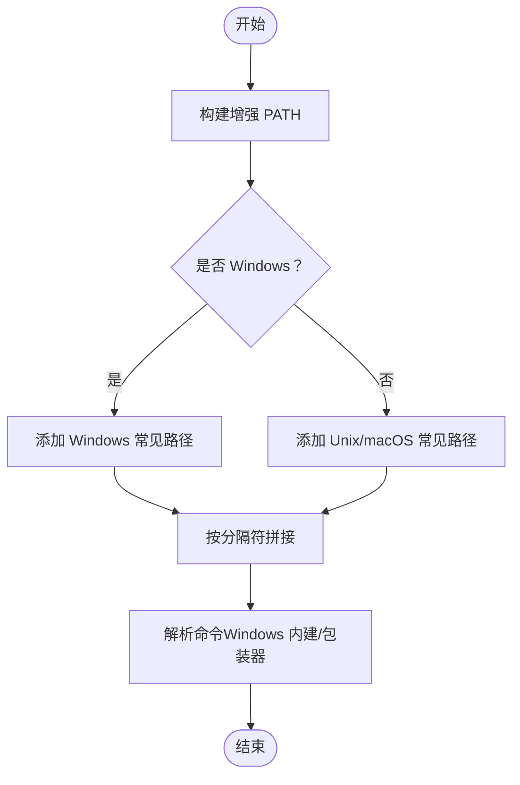
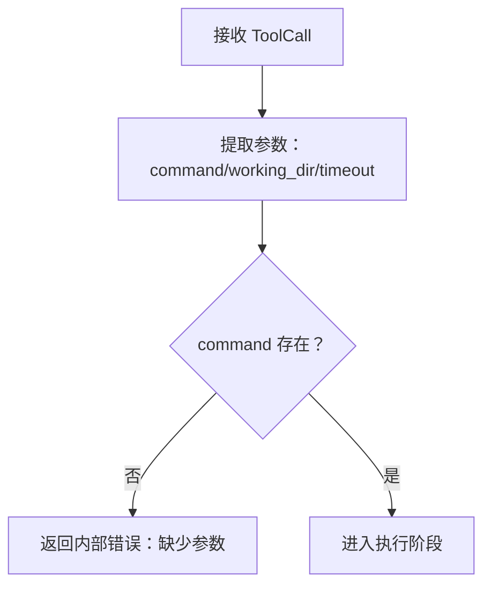
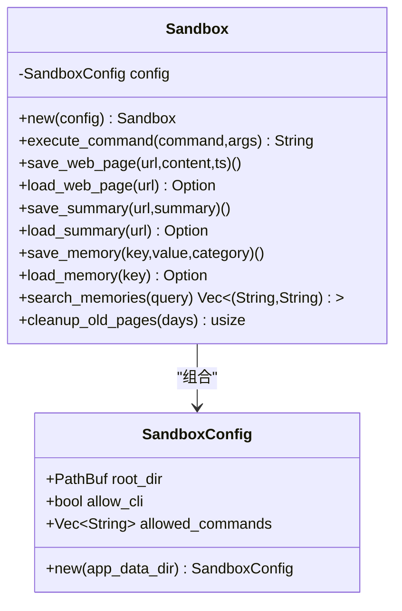
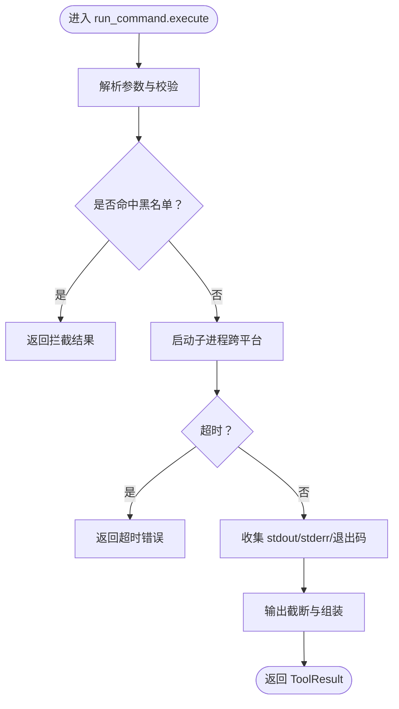
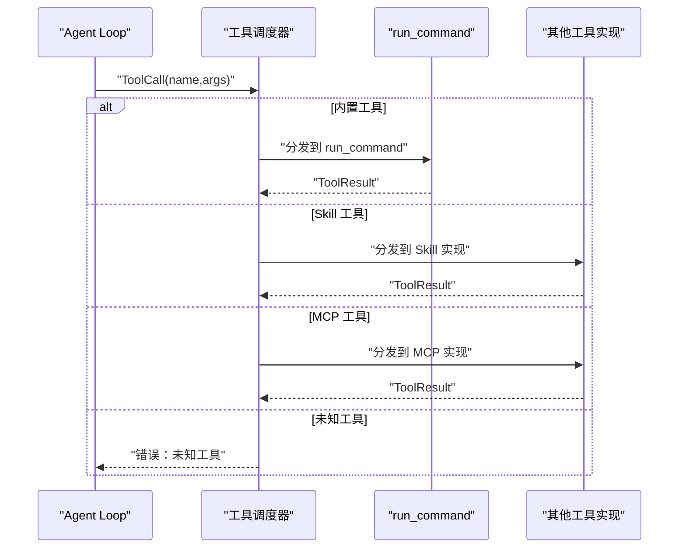
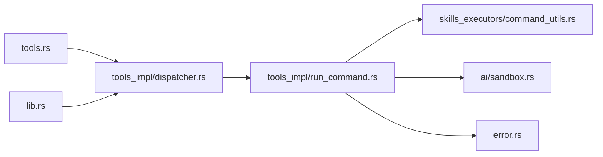

# 命令工具

<cite>
**本文引用的文件**
- [src-tauri/src/ai/tools_impl/run_command.rs](file://src-tauri/src/ai/tools_impl/run_command.rs)
- [src-tauri/src/ai/sandbox.rs](file://src-tauri/src/ai/sandbox.rs)
- [src-tauri/src/ai/tools.rs](file://src-tauri/src/ai/tools.rs)
- [src-tauri/src/ai/tools_impl/dispatcher.rs](file://src-tauri/src/ai/tools_impl/dispatcher.rs)
- [src-tauri/src/ai/skills_executors/command_utils.rs](file://src-tauri/src/ai/skills_executors/command_utils.rs)
- [src-tauri/src/error.rs](file://src-tauri/src/error.rs)
- [src-tauri/src/lib.rs](file://src-tauri/src/lib.rs)
- [examples/echo-skill.json](file://examples/echo-skill.json)
- [examples/python-calculator-skill.json](file://examples/python-calculator-skill.json)
- [examples/echo-skill.md](file://examples/echo-skill.md)
- [examples/python-calculator-skill.md](file://examples/python-calculator-skill.md)
</cite>

## 目录
1. [简介](#简介)
2. [项目结构](#项目结构)
3. [核心组件](#核心组件)
4. [架构总览](#架构总览)
5. [详细组件分析](#详细组件分析)
6. [依赖关系分析](#依赖关系分析)
7. [性能考量](#性能考量)
8. [故障排查指南](#故障排查指南)
9. [结论](#结论)
10. [附录](#附录)

## 简介
本文件面向 CoSurf 命令工具模块，系统性阐述其设计理念与实现细节，覆盖命令解析器、参数验证器、执行环境管理；深入说明命令执行的安全机制（路径验证、权限检查、资源限制、超时控制）；解释与系统命令行接口的集成方式（进程启动、标准输入输出处理、信号处理）；并给出错误处理策略（异常捕获、错误分类、用户友好的错误信息）。最后提供使用示例与最佳实践，包括安全命令编写指南、性能优化技巧与调试方法。

## 项目结构
命令工具位于 Tauri 后端 Rust 源码树中，围绕“工具调度器”“内置工具实现”“沙箱环境”“命令工具辅助”等模块协同工作，形成从工具注册、参数校验、执行到结果返回的完整链路。

**图表来源**
- [src-tauri/src/ai/tools.rs:1-195](file://src-tauri/src/ai/tools.rs#L1-L195)
- [src-tauri/src/ai/tools_impl/dispatcher.rs:1-55](file://src-tauri/src/ai/tools_impl/dispatcher.rs#L1-L55)
- [src-tauri/src/ai/tools_impl/run_command.rs:1-161](file://src-tauri/src/ai/tools_impl/run_command.rs#L1-L161)
- [src-tauri/src/ai/skills_executors/command_utils.rs:1-95](file://src-tauri/src/ai/skills_executors/command_utils.rs#L1-L95)
- [src-tauri/src/ai/sandbox.rs:1-251](file://src-tauri/src/ai/sandbox.rs#L1-L251)
- [src-tauri/src/error.rs:1-64](file://src-tauri/src/error.rs#L1-L64)
- [src-tauri/src/lib.rs:108-214](file://src-tauri/src/lib.rs#L108-L214)

**章节来源**
- [src-tauri/src/ai/tools.rs:1-195](file://src-tauri/src/ai/tools.rs#L1-L195)
- [src-tauri/src/ai/tools_impl/dispatcher.rs:1-55](file://src-tauri/src/ai/tools_impl/dispatcher.rs#L1-L55)
- [src-tauri/src/ai/tools_impl/run_command.rs:1-161](file://src-tauri/src/ai/tools_impl/run_command.rs#L1-L161)
- [src-tauri/src/ai/skills_executors/command_utils.rs:1-95](file://src-tauri/src/ai/skills_executors/command_utils.rs#L1-L95)
- [src-tauri/src/ai/sandbox.rs:1-251](file://src-tauri/src/ai/sandbox.rs#L1-L251)
- [src-tauri/src/error.rs:1-64](file://src-tauri/src/error.rs#L1-L64)
- [src-tauri/src/lib.rs:108-214](file://src-tauri/src/lib.rs#L108-L214)

## 核心组件
- 工具定义与 Schema：统一描述工具名称、参数与 OpenAI function calling 格式，确保模型侧正确调用。
- 工具调度器：根据工具名分发到具体实现，支持内置工具、Skill 工具与 MCP 工具。
- run_command 工具实现：封装跨平台命令执行、超时控制、输出截断、危险命令拦截与错误处理。
- 命令工具辅助：构建增强 PATH、解析 Windows 特殊命令包装，保证在不同平台正确执行。
- 沙箱环境：提供受限的执行目录与白名单命令，隔离潜在风险。
- 错误模型：统一错误类型与序列化，便于前端展示与日志追踪。

**章节来源**
- [src-tauri/src/ai/tools.rs:197-225](file://src-tauri/src/ai/tools.rs#L197-L225)
- [src-tauri/src/ai/tools_impl/dispatcher.rs:11-55](file://src-tauri/src/ai/tools_impl/dispatcher.rs#L11-L55)
- [src-tauri/src/ai/tools_impl/run_command.rs:34-161](file://src-tauri/src/ai/tools_impl/run_command.rs#L34-L161)
- [src-tauri/src/ai/skills_executors/command_utils.rs:4-95](file://src-tauri/src/ai/skills_executors/command_utils.rs#L4-L95)
- [src-tauri/src/ai/sandbox.rs:12-46](file://src-tauri/src/ai/sandbox.rs#L12-L46)
- [src-tauri/src/error.rs:4-64](file://src-tauri/src/error.rs#L4-L64)

## 架构总览
下图展示了从 Agent Loop 到命令执行的端到端流程，包括参数校验、调度、执行与结果返回。

**图表来源**
- [src-tauri/src/ai/tools.rs:158-182](file://src-tauri/src/ai/tools.rs#L158-L182)
- [src-tauri/src/ai/tools_impl/dispatcher.rs:33-54](file://src-tauri/src/ai/tools_impl/dispatcher.rs#L33-L54)
- [src-tauri/src/ai/tools_impl/run_command.rs:34-161](file://src-tauri/src/ai/tools_impl/run_command.rs#L34-L161)
- [src-tauri/src/error.rs:4-64](file://src-tauri/src/error.rs#L4-L64)

## 详细组件分析

### 组件一：命令解析器与 PATH 增强
- 功能要点
  - 构建增强 PATH：在 Windows 上优先探测常见运行时安装目录（如 nvm、volta、fnm、Python 等），在 macOS/Linux 上探测 ~/.nvm、~/.volta、~/.fnm 等；最终按平台分隔符拼接。
  - 命令解析：Windows 上对内建命令与 .cmd 包装器通过 cmd /c 执行，避免交互式窗口弹出。
- 设计动机
  - 提升跨平台兼容性与可用性，减少用户配置成本。
  - 避免 Windows 上命令行弹窗影响用户体验。
- 复杂度与性能
  - PATH 构建涉及多次文件系统存在性检查，但仅在初始化阶段执行，开销可控。
  - 命令解析为 O(1) 操作，无额外 IO。

**图表来源**
- [src-tauri/src/ai/skills_executors/command_utils.rs:4-95](file://src-tauri/src/ai/skills_executors/command_utils.rs#L4-L95)

**章节来源**
- [src-tauri/src/ai/skills_executors/command_utils.rs:4-95](file://src-tauri/src/ai/skills_executors/command_utils.rs#L4-L95)

### 组件二：参数验证器与工具 Schema
- 功能要点
  - 工具 Schema 定义：run_command 的参数包括 command、working_dir、timeout，并提供 OpenAI function calling 格式。
  - 参数提取与校验：从 ToolCall.arguments 中提取必要字段，缺失则报错。
- 设计动机
  - 保证模型侧调用参数与后端实现一致，降低调用失败率。
- 复杂度与性能
  - JSON 解析与字符串匹配为线性复杂度，常数很小。

**图表来源**
- [src-tauri/src/ai/tools.rs:158-182](file://src-tauri/src/ai/tools.rs#L158-L182)
- [src-tauri/src/ai/tools_impl/run_command.rs:39-50](file://src-tauri/src/ai/tools_impl/run_command.rs#L39-L50)

**章节来源**
- [src-tauri/src/ai/tools.rs:158-182](file://src-tauri/src/ai/tools.rs#L158-L182)
- [src-tauri/src/ai/tools_impl/run_command.rs:39-50](file://src-tauri/src/ai/tools_impl/run_command.rs#L39-L50)

### 组件三：执行环境管理与沙箱
- 功能要点
  - 沙箱配置：定义根目录与允许的命令白名单；自动创建 web_pages、summaries、memories、history 等子目录。
  - 受限命令执行：仅允许白名单命令，且在沙箱根目录执行，避免越权访问。
- 设计动机
  - 通过最小权限原则与受限目录，降低命令执行带来的安全风险。
- 复杂度与性能
  - 文件系统操作为 O(1) 次数级，受目录数量与文件大小影响较小。

**图表来源**
- [src-tauri/src/ai/sandbox.rs:12-46](file://src-tauri/src/ai/sandbox.rs#L12-L46)
- [src-tauri/src/ai/sandbox.rs:215-244](file://src-tauri/src/ai/sandbox.rs#L215-L244)

**章节来源**
- [src-tauri/src/ai/sandbox.rs:12-46](file://src-tauri/src/ai/sandbox.rs#L12-L46)
- [src-tauri/src/ai/sandbox.rs:215-244](file://src-tauri/src/ai/sandbox.rs#L215-L244)

### 组件四：命令执行与安全机制
- 功能要点
  - 跨平台执行：Windows 使用 cmd /C，类 Unix 使用 sh -c。
  - 危险命令拦截：黑名单前缀匹配（如 rm -rf /、格式化磁盘、fork bomb 等）。
  - 超时控制：默认 30 秒，可由调用方传入，最大 120 秒。
  - 输出截断：stdout 最大 8000 字符，stderr 最大 4000 字符，避免内存膨胀。
  - 标准输出处理：收集 stdout/stderr/退出码，组装为统一结果。
  - Windows 特性：隐藏控制台窗口，避免弹窗干扰。
- 设计动机
  - 在易用性与安全性之间取得平衡，既满足日常开发需求，又有效防范高危命令。
- 复杂度与性能
  - 异步进程执行与超时控制为 O(1)，输出截断为线性，整体开销可控。

**图表来源**
- [src-tauri/src/ai/tools_impl/run_command.rs:34-161](file://src-tauri/src/ai/tools_impl/run_command.rs#L34-L161)

**章节来源**
- [src-tauri/src/ai/tools_impl/run_command.rs:34-161](file://src-tauri/src/ai/tools_impl/run_command.rs#L34-L161)

### 组件五：工具调度器与集成点
- 功能要点
  - 分发逻辑：识别内置工具、Skill 工具（skill_{id}）、MCP 工具（mcp_{server}_{tool}），分别路由到对应实现。
  - 错误处理：未知工具名返回内部错误。
- 设计动机
  - 统一入口，便于扩展与维护；与 Agent Loop 无缝对接。
- 集成点
  - 与应用初始化中的命令注册配合，确保工具可用。

**图表来源**
- [src-tauri/src/ai/tools_impl/dispatcher.rs:11-55](file://src-tauri/src/ai/tools_impl/dispatcher.rs#L11-L55)

**章节来源**
- [src-tauri/src/ai/tools_impl/dispatcher.rs:11-55](file://src-tauri/src/ai/tools_impl/dispatcher.rs#L11-L55)
- [src-tauri/src/lib.rs:108-214](file://src-tauri/src/lib.rs#L108-L214)

## 依赖关系分析
- 模块耦合
  - tools.rs 与 tools_impl/dispatcher.rs：通过工具名进行弱耦合分发。
  - run_command.rs 依赖 tools.rs 的 ToolCall/ToolResult 结构，依赖 error.rs 的错误模型。
  - run_command.rs 与 skills_executors/command_utils.rs：前者使用后者提供的命令解析与 PATH 增强。
  - run_command.rs 与 sandbox.rs：在受限环境中执行命令（若启用沙箱）。
- 外部依赖
  - tokio::process::Command：跨平台进程执行。
  - tracing：日志记录与可观测性。
  - tauri::AppHandle：应用上下文与 IPC。

**图表来源**
- [src-tauri/src/ai/tools.rs:1-195](file://src-tauri/src/ai/tools.rs#L1-L195)
- [src-tauri/src/ai/tools_impl/dispatcher.rs:1-55](file://src-tauri/src/ai/tools_impl/dispatcher.rs#L1-L55)
- [src-tauri/src/ai/tools_impl/run_command.rs:1-161](file://src-tauri/src/ai/tools_impl/run_command.rs#L1-L161)
- [src-tauri/src/ai/skills_executors/command_utils.rs:1-95](file://src-tauri/src/ai/skills_executors/command_utils.rs#L1-L95)
- [src-tauri/src/ai/sandbox.rs:1-251](file://src-tauri/src/ai/sandbox.rs#L1-L251)
- [src-tauri/src/error.rs:1-64](file://src-tauri/src/error.rs#L1-L64)
- [src-tauri/src/lib.rs:108-214](file://src-tauri/src/lib.rs#L108-L214)

**章节来源**
- [src-tauri/src/ai/tools.rs:1-195](file://src-tauri/src/ai/tools.rs#L1-L195)
- [src-tauri/src/ai/tools_impl/dispatcher.rs:1-55](file://src-tauri/src/ai/tools_impl/dispatcher.rs#L1-L55)
- [src-tauri/src/ai/tools_impl/run_command.rs:1-161](file://src-tauri/src/ai/tools_impl/run_command.rs#L1-L161)
- [src-tauri/src/ai/skills_executors/command_utils.rs:1-95](file://src-tauri/src/ai/skills_executors/command_utils.rs#L1-L95)
- [src-tauri/src/ai/sandbox.rs:1-251](file://src-tauri/src/ai/sandbox.rs#L1-L251)
- [src-tauri/src/error.rs:1-64](file://src-tauri/src/error.rs#L1-L64)
- [src-tauri/src/lib.rs:108-214](file://src-tauri/src/lib.rs#L108-L214)

## 性能考量
- 超时控制：默认 30 秒，最大 120 秒，避免长时间阻塞；建议根据任务复杂度调整。
- 输出截断：stdout 8000 字符、stderr 4000 字符，防止内存占用过高；超出部分带截断提示。
- 异步执行：基于 tokio::process::Command 与超时包装，避免阻塞主线程。
- 跨平台差异：Windows 隐藏控制台窗口，减少 UI 干扰；类 Unix 使用 shell -c，保持一致性。
- 沙箱白名单：仅允许有限命令，降低系统调用开销与风险。

[本节为通用性能讨论，无需特定文件来源]

## 故障排查指南
- 常见问题与定位
  - 缺少参数：当未提供 command 时，返回内部错误；检查工具 Schema 与调用参数。
  - 命令被拦截：命中黑名单将直接返回拦截结果；检查命令内容与黑名单条目。
  - 执行失败：子进程启动或执行失败时，返回失败结果与错误信息；查看 stderr。
  - 超时：超过 timeout 秒后强制终止；适当提高超时或优化命令。
- 错误模型
  - 统一的 AppError 枚举与序列化，便于前端展示与日志追踪。
- 建议排查步骤
  - 启用更详细的日志级别，观察工具调用与执行过程。
  - 使用最小化命令复现问题，逐步缩小范围。
  - 检查 PATH 与工作目录设置，确认命令可被找到。

**章节来源**
- [src-tauri/src/ai/tools_impl/run_command.rs:133-149](file://src-tauri/src/ai/tools_impl/run_command.rs#L133-L149)
- [src-tauri/src/error.rs:4-64](file://src-tauri/src/error.rs#L4-L64)

## 结论
CoSurf 命令工具模块通过“工具定义—调度—实现—安全—错误处理”的完整闭环，实现了跨平台、可配置、可扩展的命令执行能力。其安全机制（黑名单、超时、输出截断、沙箱白名单）与可观测性（日志、错误模型）共同保障了系统的稳定性与可靠性。结合示例技能与最佳实践，用户可以安全高效地编写与使用命令工具。

[本节为总结性内容，无需特定文件来源]

## 附录

### 使用示例与最佳实践
- 示例一：回显技能（echo）
  - 配置要点：command 为 echo，args_template 支持参数模板替换；timeout 5 秒。
  - 使用场景：验证 Skills 系统与命令工具链路。
  - 参考文件：
    - [examples/echo-skill.json:8-14](file://examples/echo-skill.json#L8-L14)
    - [examples/echo-skill.md:18-24](file://examples/echo-skill.md#L18-L24)
- 示例二：Python 计算器（python-calculator）
  - 配置要点：language 为 python，source 为内联脚本，禁用内置函数，仅允许 math 模块；timeout 10 秒。
  - 使用场景：安全执行数学表达式计算。
  - 参考文件：
    - [examples/python-calculator-skill.json:8-14](file://examples/python-calculator-skill.json#L8-L14)
    - [examples/python-calculator-skill.md:19-57](file://examples/python-calculator-skill.md#L19-L57)
- 最佳实践
  - 安全命令编写
    - 优先使用沙箱白名单命令，避免 rm、format、dd 等高危命令。
    - 明确 working_dir，限定执行范围。
    - 为长耗时命令设置合理 timeout，避免阻塞。
  - 性能优化
    - 控制输出长度，避免大量日志导致内存压力。
    - 合理拆分命令，减少单次执行时间。
  - 调试方法
    - 提升日志级别，关注工具调用与执行阶段的关键节点。
    - 使用最小化命令快速定位问题，逐步增加复杂度。

**章节来源**
- [examples/echo-skill.json:8-14](file://examples/echo-skill.json#L8-L14)
- [examples/echo-skill.md:18-24](file://examples/echo-skill.md#L18-L24)
- [examples/python-calculator-skill.json:8-14](file://examples/python-calculator-skill.json#L8-L14)
- [examples/python-calculator-skill.md:19-57](file://examples/python-calculator-skill.md#L19-L57)