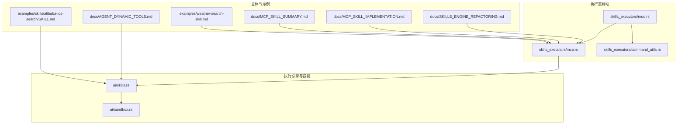
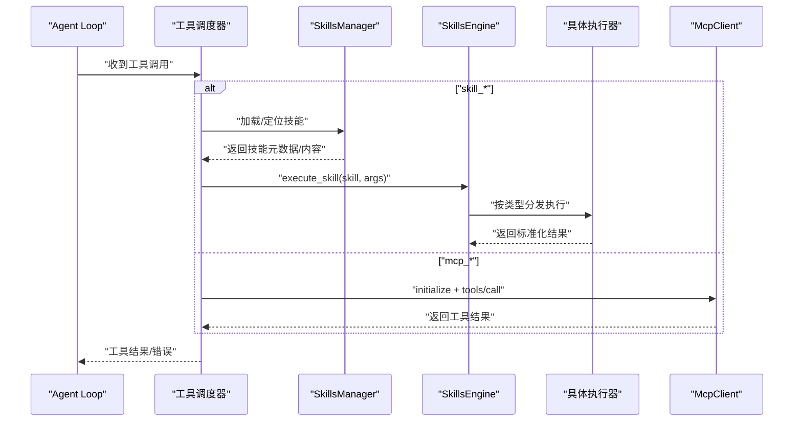
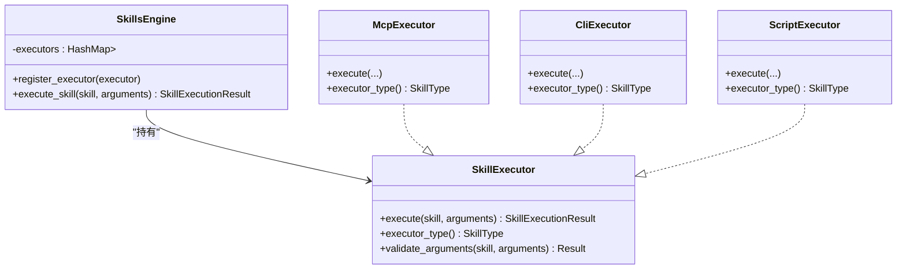
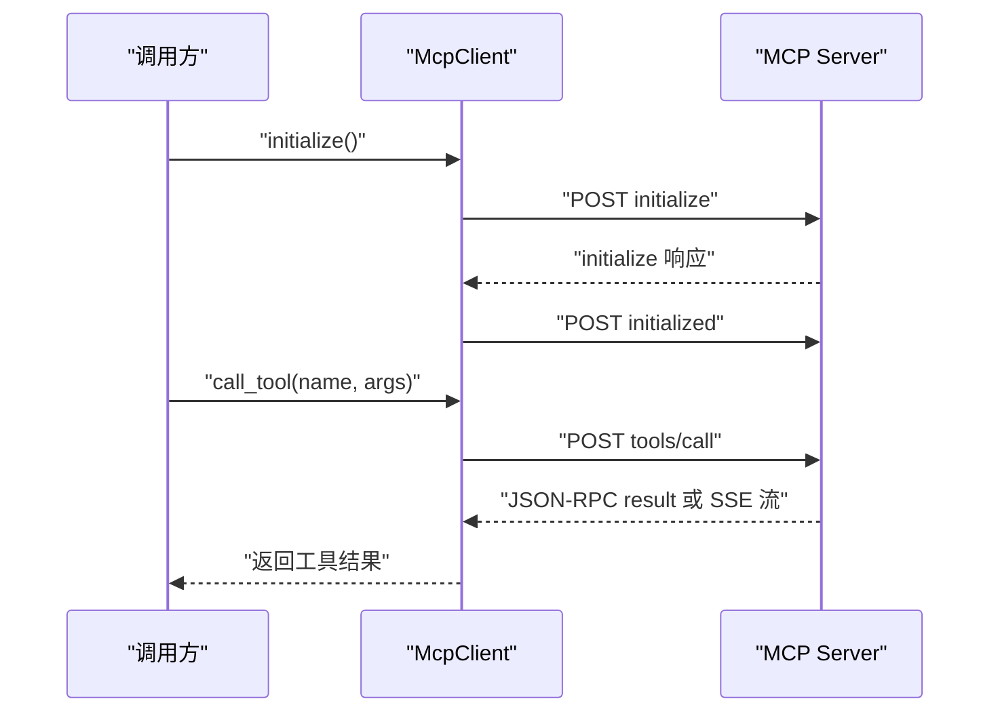
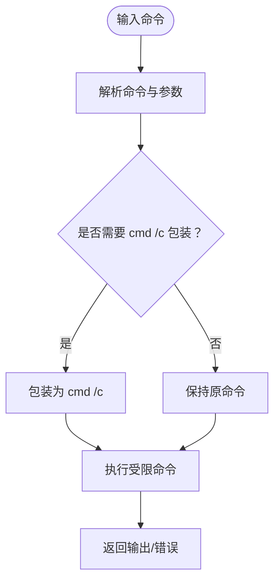
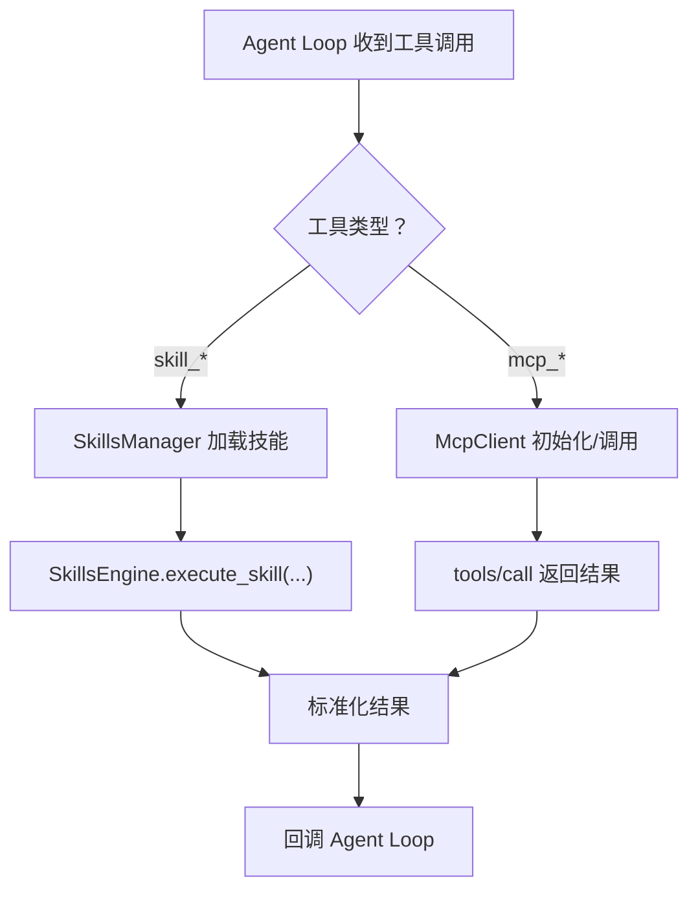
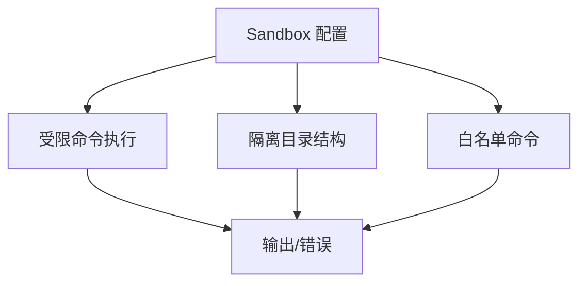
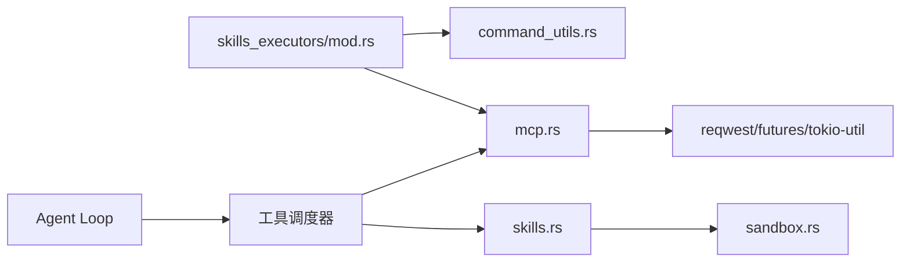

# 技能执行器

<cite>
**本文引用的文件**
- [mcp.rs](file://src-tauri/src/ai/skills_executors/mcp.rs)
- [mod.rs](file://src-tauri/src/ai/skills_executors/mod.rs)
- [command_utils.rs](file://src-tauri/src/ai/skills_executors/command_utils.rs)
- [sandbox.rs](file://src-tauri/src/ai/sandbox.rs)
- [skills.rs](file://src-tauri/src/ai/skills.rs)
- [SKILLS_ENGINE_REFACTORING.md](file://docs/SKILLS_ENGINE_REFACTORING.md)
- [MCP_SKILL_IMPLEMENTATION.md](file://docs/MCP_SKILL_IMPLEMENTATION.md)
- [MCP_SKILL_SUMMARY.md](file://docs/MCP_SKILL_SUMMARY.md)
- [AGENT_DYNAMIC_TOOLS.md](file://docs/AGENT_DYNAMIC_TOOLS.md)
- [agent.rs](file://native/src/ai/agent.rs)
- [SKILL.md（阿里云 IQS 搜索）](file://examples/skills/alibaba-iqs-search/SKILL.md)
- [weather-search-skill.md](file://examples/weather-search-skill.md)
</cite>

## 目录
1. [简介](#简介)
2. [项目结构](#项目结构)
3. [核心组件](#核心组件)
4. [架构总览](#架构总览)
5. [详细组件分析](#详细组件分析)
6. [依赖关系分析](#依赖关系分析)
7. [性能考量](#性能考量)
8. [故障排查指南](#故障排查指南)
9. [结论](#结论)
10. [附录](#附录)

## 简介
本文件面向 CoSurf 技能执行器的技术文档，聚焦于执行器的架构设计与实现原理，涵盖执行器工厂模式、动态加载机制、生命周期管理；详解三种执行器：CommandExecutor（命令执行器）、ScriptExecutor（脚本执行器）、MCPExecutor（MCP 执行器）的工作原理与调用方式；阐述安全机制（沙箱隔离、权限控制、资源限制）；说明与 Agent Loop 的集成方式（参数传递、结果处理、错误处理）；并提供扩展指南与调试技巧。

## 项目结构
围绕技能执行器的关键目录与文件如下：
- 执行器模块：src-tauri/src/ai/skills_executors
  - mcp.rs：MCP 客户端与执行器实现
  - command_utils.rs：命令解析与 PATH 增强
  - mod.rs：模块导出入口
- 执行引擎与技能管理：src-tauri/src/ai
  - skills.rs：技能目录扫描、懒加载、导入导出等
  - sandbox.rs：沙箱环境与受限命令执行
- 文档与示例：docs 与 examples
  - SKILLS_ENGINE_REFACTORING.md：重构后的执行引擎与执行器接口说明
  - MCP_SKILL_IMPLEMENTATION.md / MCP_SKILL_SUMMARY.md：MCP 执行器完整实现与要点
  - AGENT_DYNAMIC_TOOLS.md：Agent Loop 动态工具集成与调度
  - examples/skills/alibaba-iqs-search/SKILL.md：示例技能文档
  - examples/weather-search-skill.md：MCP 技能示例

**图表来源**
- [mod.rs:1-6](file://src-tauri/src/ai/skills_executors/mod.rs#L1-L6)
- [mcp.rs:1-555](file://src-tauri/src/ai/skills_executors/mcp.rs#L1-L555)
- [command_utils.rs:1-95](file://src-tauri/src/ai/skills_executors/command_utils.rs#L1-L95)
- [skills.rs:1-567](file://src-tauri/src/ai/skills.rs#L1-L567)
- [sandbox.rs:1-251](file://src-tauri/src/ai/sandbox.rs#L1-L251)
- [SKILLS_ENGINE_REFACTORING.md:64-328](file://docs/SKILLS_ENGINE_REFACTORING.md#L64-L328)
- [MCP_SKILL_IMPLEMENTATION.md:1-526](file://docs/MCP_SKILL_IMPLEMENTATION.md#L1-L526)
- [MCP_SKILL_SUMMARY.md:1-394](file://docs/MCP_SKILL_SUMMARY.md#L1-L394)
- [AGENT_DYNAMIC_TOOLS.md:1-437](file://docs/AGENT_DYNAMIC_TOOLS.md#L1-L437)
- [SKILL.md（阿里云 IQS 搜索）:1-49](file://examples/skills/alibaba-iqs-search/SKILL.md#L1-L49)
- [weather-search-skill.md:1-98](file://examples/weather-search-skill.md#L1-L98)

**章节来源**
- [mod.rs:1-6](file://src-tauri/src/ai/skills_executors/mod.rs#L1-L6)
- [skills.rs:1-567](file://src-tauri/src/ai/skills.rs#L1-L567)
- [sandbox.rs:1-251](file://src-tauri/src/ai/sandbox.rs#L1-L251)
- [SKILLS_ENGINE_REFACTORING.md:64-328](file://docs/SKILLS_ENGINE_REFACTORING.md#L64-L328)
- [MCP_SKILL_IMPLEMENTATION.md:1-526](file://docs/MCP_SKILL_IMPLEMENTATION.md#L1-L526)
- [MCP_SKILL_SUMMARY.md:1-394](file://docs/MCP_SKILL_SUMMARY.md#L1-L394)
- [AGENT_DYNAMIC_TOOLS.md:1-437](file://docs/AGENT_DYNAMIC_TOOLS.md#L1-L437)
- [SKILL.md（阿里云 IQS 搜索）:1-49](file://examples/skills/alibaba-iqs-search/SKILL.md#L1-L49)
- [weather-search-skill.md:1-98](file://examples/weather-search-skill.md#L1-L98)

## 核心组件
- 执行器接口与工厂模式
  - 通过统一的 SkillExecutor trait 定义执行器能力，结合 HashMap<SkillType, Box<dyn SkillExecutor>> 实现“工厂”注册与按类型分发。
  - 执行器类型枚举包含 Cli、Mcp、BuiltIn、Script 等，便于扩展与统一调度。
- 执行引擎（重构后）
  - SkillsEngine 负责注册执行器、统一调度、自动计时与日志记录、错误捕获与标准化结果。
- 技能管理系统
  - SkillsManager 提供技能目录扫描、frontmatter 懒加载、导入导出、启用/禁用切换、目录信息列举等功能。
- 沙箱与安全
  - Sandbox 提供受限命令执行、目录隔离、清理策略等基础安全能力；配合白名单与工作目录限制降低风险。
- Agent Loop 集成
  - Agent Loop 通过工具调度器动态识别 skill_* 与 mcp_* 工具，调用 SkillsManager 与 MCP 客户端执行，并将结果回传给回调。

**章节来源**
- [SKILLS_ENGINE_REFACTORING.md:81-116](file://docs/SKILLS_ENGINE_REFACTORING.md#L81-L116)
- [SKILLS_ENGINE_REFACTORING.md:120-145](file://docs/SKILLS_ENGINE_REFACTORING.md#L120-L145)
- [SKILLS_ENGINE_REFACTORING.md:154-176](file://docs/SKILLS_ENGINE_REFACTORING.md#L154-L176)
- [SKILLS_ENGINE_REFACTORING.md:384-450](file://docs/SKILLS_ENGINE_REFACTORING.md#L384-L450)
- [skills.rs:84-508](file://src-tauri/src/ai/skills.rs#L84-L508)
- [sandbox.rs:12-46](file://src-tauri/src/ai/sandbox.rs#L12-L46)
- [AGENT_DYNAMIC_TOOLS.md:75-106](file://docs/AGENT_DYNAMIC_TOOLS.md#L75-L106)

## 架构总览
下图展示了从 Agent Loop 到技能执行器的整体调用链路与数据流。

**图表来源**
- [AGENT_DYNAMIC_TOOLS.md:110-139](file://docs/AGENT_DYNAMIC_TOOLS.md#L110-L139)
- [mcp.rs:167-198](file://src-tauri/src/ai/skills_executors/mcp.rs#L167-L198)
- [mcp.rs:200-246](file://src-tauri/src/ai/skills_executors/mcp.rs#L200-L246)
- [skills.rs:84-508](file://src-tauri/src/ai/skills.rs#L84-L508)
- [SKILLS_ENGINE_REFACTORING.md:302-328](file://docs/SKILLS_ENGINE_REFACTORING.md#L302-L328)

## 详细组件分析

### 执行器接口与工厂模式
- 接口设计
  - SkillExecutor trait 定义 execute、executor_type、validate_arguments（可选），确保不同执行器实现一致的调用契约。
- 工厂注册
  - SkillsEngine 内部维护 HashMap<SkillType, Box<dyn SkillExecutor>>，通过 register_executor 注册，execute_skill 时按类型查找并调用。
- 生命周期
  - 执行器实例在引擎启动时注册，随应用生命周期常驻；每次执行仅做必要初始化（如 MCP 初始化）。

**图表来源**
- [SKILLS_ENGINE_REFACTORING.md:120-145](file://docs/SKILLS_ENGINE_REFACTORING.md#L120-L145)
- [SKILLS_ENGINE_REFACTORING.md:18-116](file://docs/SKILLS_ENGINE_REFACTORING.md#L18-L116)

**章节来源**
- [SKILLS_ENGINE_REFACTORING.md:120-145](file://docs/SKILLS_ENGINE_REFACTORING.md#L120-L145)
- [SKILLS_ENGINE_REFACTORING.md:81-116](file://docs/SKILLS_ENGINE_REFACTORING.md#L81-L116)

### MCP 执行器（MCPExecutor）
- 协议与客户端
  - 遵循 MCP（Model Context Protocol）与 JSON-RPC 2.0，支持 Streamable HTTP 与 SSE 两种传输模式。
  - 初始化流程：initialize → initialized；工具调用：tools/call；错误处理：标准化 JSON-RPC 错误。
- 认证与配置
  - 支持 Bearer Token 与自定义 Header（如 X-API-Key）；支持环境变量替换（如 ${ENV_VAR}）。
- 调用序列
  - initialize → tools/call → 解析响应（文本聚合或原样返回）→ 返回标准化结果。

**图表来源**
- [mcp.rs:167-198](file://src-tauri/src/ai/skills_executors/mcp.rs#L167-L198)
- [mcp.rs:200-246](file://src-tauri/src/ai/skills_executors/mcp.rs#L200-L246)
- [mcp.rs:257-302](file://src-tauri/src/ai/skills_executors/mcp.rs#L257-L302)
- [mcp.rs:304-457](file://src-tauri/src/ai/skills_executors/mcp.rs#L304-L457)
- [mcp.rs:521-553](file://src-tauri/src/ai/skills_executors/mcp.rs#L521-L553)

**章节来源**
- [mcp.rs:1-555](file://src-tauri/src/ai/skills_executors/mcp.rs#L1-L555)
- [MCP_SKILL_IMPLEMENTATION.md:50-526](file://docs/MCP_SKILL_IMPLEMENTATION.md#L50-L526)
- [MCP_SKILL_SUMMARY.md:1-394](file://docs/MCP_SKILL_SUMMARY.md#L1-L394)

### 命令执行器（CommandExecutor）
- 设计定位
  - 保留命令工具函数，提供跨平台命令解析与 PATH 增强，支持 Windows 内建命令包装与常见运行时路径。
- 使用场景
  - 与 CLI/Script 执行器配合，为 Agent Loop 提供底层命令能力；当前文档指出 CLI/Script 执行器由 Agent Loop 驱动，但命令工具仍可用于受限执行。

**图表来源**
- [command_utils.rs:77-95](file://src-tauri/src/ai/skills_executors/command_utils.rs#L77-L95)

**章节来源**
- [command_utils.rs:1-95](file://src-tauri/src/ai/skills_executors/command_utils.rs#L1-L95)

### 脚本执行器（ScriptExecutor）
- 设计定位
  - 作为脚本执行入口，委托给现有脚本执行函数；统一去除首尾空白并返回标准化结果。
- 支持语言
  - 文档中明确支持 Python、JavaScript、Bash、PowerShell 等脚本语言。

**章节来源**
- [SKILLS_ENGINE_REFACTORING.md:223-241](file://docs/SKILLS_ENGINE_REFACTORING.md#L223-L241)

### 执行器与 Agent Loop 的集成
- 工具路由
  - 调度器根据工具名前缀 skill_* 或 mcp_* 分发至相应执行路径。
- 参数传递与结果处理
  - 通过 ToolCall.arguments 传递参数；执行完成后将结果封装为 ToolResult 并回调给 Agent Loop。
- 错误处理
  - 统一捕获执行器内部错误并转换为可读的错误信息，避免中断 Agent Loop。

**图表来源**
- [AGENT_DYNAMIC_TOOLS.md:75-106](file://docs/AGENT_DYNAMIC_TOOLS.md#L75-L106)
- [AGENT_DYNAMIC_TOOLS.md:110-139](file://docs/AGENT_DYNAMIC_TOOLS.md#L110-L139)

**章节来源**
- [AGENT_DYNAMIC_TOOLS.md:75-106](file://docs/AGENT_DYNAMIC_TOOLS.md#L75-L106)
- [AGENT_DYNAMIC_TOOLS.md:110-139](file://docs/AGENT_DYNAMIC_TOOLS.md#L110-L139)

### 安全机制与资源限制
- 沙箱隔离
  - Sandbox 提供受限命令执行（白名单命令）、目录隔离（web_pages、summaries、memories、history）、清理策略。
- 权限控制
  - 通过 allowed_commands 白名单限制可执行命令；API Key 通过 Authorization 或自定义 Header 注入。
- 资源限制
  - 文档中提及可扩展的超时控制、并发限流与缓存策略，建议在执行器层面对外部调用设置超时与重试。

**图表来源**
- [sandbox.rs:12-46](file://src-tauri/src/ai/sandbox.rs#L12-L46)
- [sandbox.rs:215-244](file://src-tauri/src/ai/sandbox.rs#L215-L244)

**章节来源**
- [sandbox.rs:1-251](file://src-tauri/src/ai/sandbox.rs#L1-L251)
- [SKILLS_ENGINE_REFACTORING.md:520-584](file://docs/SKILLS_ENGINE_REFACTORING.md#L520-L584)

### 生命周期管理
- 初始化
  - 应用启动时注册执行器；SkillsManager 在需要时加载技能目录。
- 运行期
  - 每次工具调用按需初始化（如 MCP initialize），执行完成后释放临时状态。
- 清理
  - 沙箱定期清理过期内容；MCP 客户端在 SSE 模式下按需建立/复用连接。

**章节来源**
- [SKILLS_ENGINE_REFACTORING.md:81-116](file://docs/SKILLS_ENGINE_REFACTORING.md#L81-L116)
- [mcp.rs:167-198](file://src-tauri/src/ai/skills_executors/mcp.rs#L167-L198)
- [sandbox.rs:93-119](file://src-tauri/src/ai/sandbox.rs#L93-L119)

## 依赖关系分析
- 模块耦合
  - skills_executors/mod.rs 仅导出 mcp 与 command_utils，体现“保留 MCP 客户端与命令工具”的设计。
  - skills.rs 与 sandbox.rs 分别承担技能管理与安全执行职责，彼此低耦合。
- 外部依赖
  - MCP 执行器依赖 reqwest、futures、tokio-util 等进行 HTTP/SSE 通信与流式解析。
  - Agent Loop 通过工具调度器与数据库/配置交互，间接依赖 MCP 客户端与 SkillsManager。

**图表来源**
- [mod.rs:1-6](file://src-tauri/src/ai/skills_executors/mod.rs#L1-L6)
- [mcp.rs:10-14](file://src-tauri/src/ai/skills_executors/mcp.rs#L10-L14)
- [skills.rs:1-567](file://src-tauri/src/ai/skills.rs#L1-L567)
- [sandbox.rs:1-251](file://src-tauri/src/ai/sandbox.rs#L1-L251)
- [AGENT_DYNAMIC_TOOLS.md:75-106](file://docs/AGENT_DYNAMIC_TOOLS.md#L75-L106)

**章节来源**
- [mod.rs:1-6](file://src-tauri/src/ai/skills_executors/mod.rs#L1-L6)
- [mcp.rs:10-14](file://src-tauri/src/ai/skills_executors/mcp.rs#L10-L14)
- [AGENT_DYNAMIC_TOOLS.md:75-106](file://docs/AGENT_DYNAMIC_TOOLS.md#L75-L106)

## 性能考量
- 并发与限流
  - 建议在执行引擎中引入信号量控制并发数，避免外部服务被压垮。
- 缓存
  - 对重复的工具调用结果进行缓存，减少往返与计算开销。
- 超时与重试
  - 为 MCP 与外部脚本/命令设置合理超时与指数退避重试策略。
- I/O 优化
  - 沙箱目录结构与清理策略有助于降低磁盘压力；MCP SSE 模式下注意事件流解析效率。

[本节为通用指导，无需列出章节来源]

## 故障排查指南
- MCP 连接失败
  - 检查 server_url 与传输模式（Streamable HTTP/SSE）；确认初始化流程与工具清单可用。
  - 若为 SSE 模式，确认 endpoint 获取成功且 POST 能正常返回 JSON。
- 认证问题
  - 确认 API Key 环境变量已正确注入；Bearer Token 与自定义 Header 配置正确。
- 工具执行超时
  - 增加配置中的超时时间；检查外部服务可用性与网络状况。
- 技能未找到
  - 确认技能目录存在且 SKILL.md 存在；查看懒加载日志与错误信息。
- 沙箱执行失败
  - 检查命令是否在白名单内；确认工作目录与权限设置。

**章节来源**
- [mcp.rs:304-387](file://src-tauri/src/ai/skills_executors/mcp.rs#L304-L387)
- [mcp.rs:477-519](file://src-tauri/src/ai/skills_executors/mcp.rs#L477-L519)
- [AGENT_DYNAMIC_TOOLS.md:369-377](file://docs/AGENT_DYNAMIC_TOOLS.md#L369-L377)
- [skills.rs:172-220](file://src-tauri/src/ai/skills.rs#L172-L220)
- [sandbox.rs:215-244](file://src-tauri/src/ai/sandbox.rs#L215-L244)

## 结论
CoSurf 技能执行器采用“接口 + 工厂”的可扩展架构，结合 MCP 协议与统一的结果标准化，实现了对 CLI、脚本与 MCP 服务的统一调度。通过沙箱与白名单等安全机制，以及与 Agent Loop 的深度集成，系统在灵活性与安全性之间取得平衡。未来可在并发限流、缓存、重试与 SSE 流式响应等方面进一步优化。

[本节为总结性内容，无需列出章节来源]

## 附录

### 执行器扩展指南
- 步骤
  - 实现 SkillExecutor trait，定义 execute 与 executor_type；如需参数校验可覆盖 validate_arguments。
  - 在 SkillsEngine::new 中注册自定义执行器；如需新增类型，扩展 SkillType 枚举。
- 示例参考
  - MCP 执行器的实现路径：[mcp.rs:1-555](file://src-tauri/src/ai/skills_executors/mcp.rs#L1-L555)
  - 执行器接口与注册参考：[SKILLS_ENGINE_REFACTORING.md:384-450](file://docs/SKILLS_ENGINE_REFACTORING.md#L384-L450)

**章节来源**
- [SKILLS_ENGINE_REFACTORING.md:384-450](file://docs/SKILLS_ENGINE_REFACTORING.md#L384-L450)
- [mcp.rs:1-555](file://src-tauri/src/ai/skills_executors/mcp.rs#L1-L555)

### 执行器实现示例与调试技巧
- 示例
  - 阿里云 IQS 搜索技能文档：[SKILL.md（阿里云 IQS 搜索）:1-49](file://examples/skills/alibaba-iqs-search/SKILL.md#L1-L49)
  - 天气查询（MCP）技能文档：[weather-search-skill.md:1-98](file://examples/weather-search-skill.md#L1-L98)
- 调试
  - 查看工具调用日志与错误堆栈；确认初始化与工具调用的 JSON-RPC 响应；核对环境变量与 API Key 注入。

**章节来源**
- [SKILL.md（阿里云 IQS 搜索）:1-49](file://examples/skills/alibaba-iqs-search/SKILL.md#L1-L49)
- [weather-search-skill.md:1-98](file://examples/weather-search-skill.md#L1-L98)
- [AGENT_DYNAMIC_TOOLS.md:333-377](file://docs/AGENT_DYNAMIC_TOOLS.md#L333-L377)