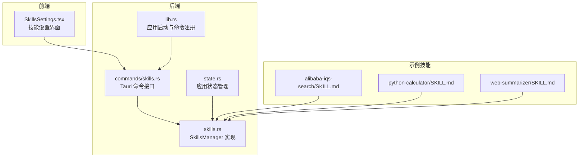
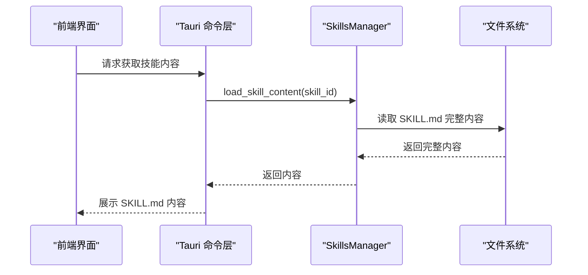
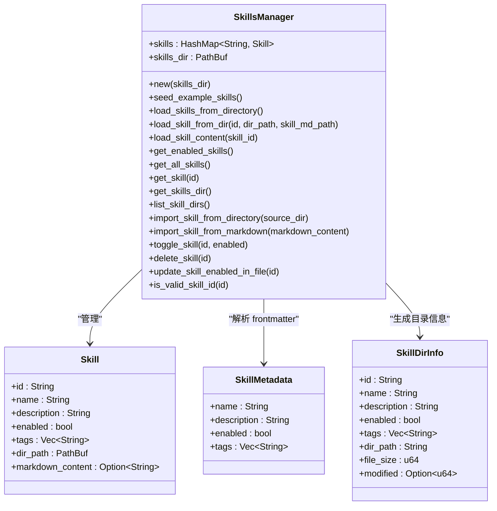
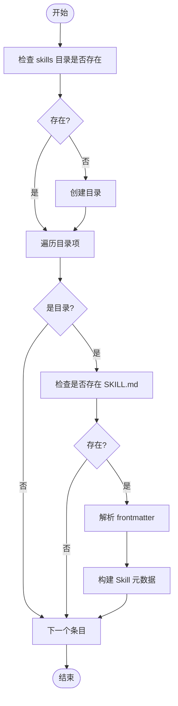
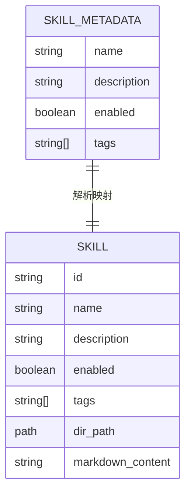
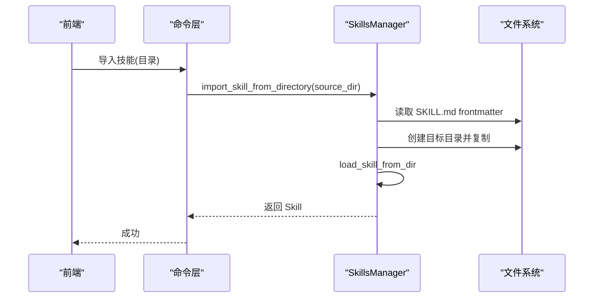
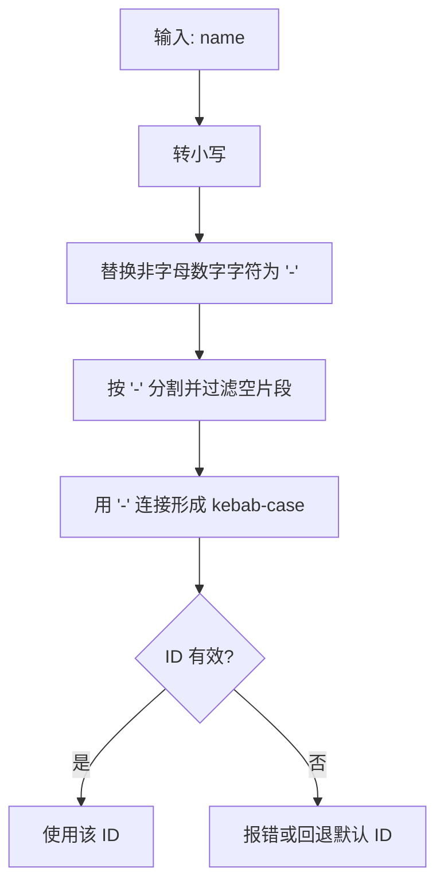
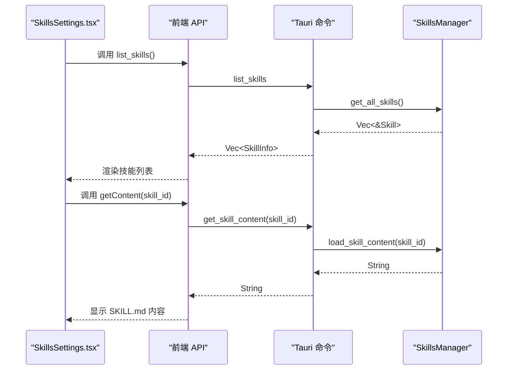
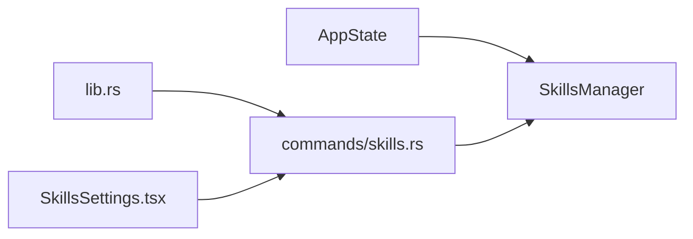

# 技能架构设计

<cite>
**本文档引用的文件**
- [skills.rs](file://native/src/ai/skills.rs)
- [skills.rs](file://src-tauri/src/ai/skills.rs)
- [skills.rs](file://src-tauri/src/commands/skills.rs)
- [state.rs](file://src-tauri/src/state.rs)
- [lib.rs](file://src-tauri/src/lib.rs)
- [SkillsSettings.tsx](file://src-web/src/components/settings/SkillsSettings.tsx)
- [SKILL.md](file://examples/skills/alibaba-iqs-search/SKILL.md)
- [SKILL.md](file://examples/skills/python-calculator/SKILL.md)
- [SKILL.md](file://examples/skills/web-summarizer/SKILL.md)
</cite>

## 目录
1. [简介](#简介)
2. [项目结构](#项目结构)
3. [核心组件](#核心组件)
4. [架构总览](#架构总览)
5. [详细组件分析](#详细组件分析)
6. [依赖关系分析](#依赖关系分析)
7. [性能考量](#性能考量)
8. [故障排除指南](#故障排除指南)
9. [结论](#结论)
10. [附录](#附录)

## 简介
本文件面向 CoSurf 技能架构设计，围绕 SkillsManager 的设计理念与实现进行深入解析。重点涵盖：
- 渐进式加载机制：仅解析 SKILL.md frontmatter，懒加载完整内容
- 技能目录结构设计：技能文件组织方式、目录命名规范、文件完整性检查
- 技能元数据系统：Skill 结构体设计、SkillMetadata 解析机制、标签系统实现
- 技能管理器核心功能：技能加载、验证、更新、删除等操作
- 技能 ID 生成规则与验证机制
- 具体的代码示例与使用模式，帮助正确实现技能架构

## 项目结构
CoSurf 的技能系统横跨后端 Rust（Tauri）与前端 React 两部分：
- 后端负责技能目录扫描、SKILL.md frontmatter 解析、懒加载、导入导出、状态持久化
- 前端负责展示技能列表、目录信息、导入界面、预览 SKILL.md 内容、交互式开关与删除

**图表来源**
- [SkillsSettings.tsx:1-541](file://src-web/src/components/settings/SkillsSettings.tsx#L1-L541)
- [state.rs:1-77](file://src-tauri/src/state.rs#L1-L77)
- [skills.rs:1-567](file://src-tauri/src/ai/skills.rs#L1-L567)
- [skills.rs:1-152](file://src-tauri/src/commands/skills.rs#L1-L152)
- [lib.rs:1-258](file://src-tauri/src/lib.rs#L1-L258)
- [SKILL.md:1-49](file://examples/skills/alibaba-iqs-search/SKILL.md#L1-L49)
- [SKILL.md:1-39](file://examples/skills/python-calculator/SKILL.md#L1-L39)
- [SKILL.md:1-57](file://examples/skills/web-summarizer/SKILL.md#L1-L57)

**章节来源**
- [SkillsSettings.tsx:1-541](file://src-web/src/components/settings/SkillsSettings.tsx#L1-L541)
- [state.rs:1-77](file://src-tauri/src/state.rs#L1-L77)
- [lib.rs:1-258](file://src-tauri/src/lib.rs#L1-L258)

## 核心组件
- SkillsManager：技能管理器，负责目录扫描、frontmatter 解析、懒加载、导入导出、启用/禁用、删除等
- Skill：技能实体，包含 id、name、description、enabled、tags、dir_path、markdown_content
- SkillMetadata：从 SKILL.md frontmatter 解析的元数据结构
- SkillDirInfo：用于前端展示的目录信息结构
- Tauri 命令：list_skills、delete_skill、toggle_skill、import_skill_from_markdown、import_skill_from_directory、list_skill_files、get_skill_content
- 应用状态 AppState：持有 SkillsManager，并在应用启动时初始化与加载技能

**章节来源**
- [skills.rs:24-88](file://src-tauri/src/ai/skills.rs#L24-L88)
- [skills.rs:10-33](file://src-tauri/src/commands/skills.rs#L10-L33)
- [state.rs:9-23](file://src-tauri/src/state.rs#L9-L23)

## 架构总览
技能架构采用“渐进式加载 + 懒加载”的设计：
- 初始加载仅解析 SKILL.md frontmatter，构建 Skill 元数据，不读取正文内容
- 当前端需要查看技能详情时，通过命令懒加载完整 SKILL.md 内容
- 目录结构采用“skills/{skill-id}/SKILL.md”的扁平目录组织，skill-id 即目录名

**图表来源**
- [skills.rs:139-152](file://src-tauri/src/commands/skills.rs#L139-L152)
- [skills.rs:252-263](file://src-tauri/src/ai/skills.rs#L252-L263)

## 详细组件分析

### SkillsManager 设计与实现
- 目录扫描：遍历 skills 目录，检查每个子目录是否包含 SKILL.md，若存在则解析 frontmatter 构建 Skill
- 渐进式加载：Skill 初始化时 markdown_content 为 None，避免一次性读取大量内容
- 懒加载：通过 load_skill_content 读取完整 SKILL.md 内容并缓存到内存
- 导入能力：支持从 Markdown 文本导入（自动推导目录名），以及从目录导入（复制整个目录）
- 更新能力：支持启用/禁用切换，并同步更新 SKILL.md frontmatter 中的 enabled 字段
- 删除能力：删除对应目录，彻底清理技能文件
- 目录信息：提供 list_skill_dirs，返回目录级信息（含文件大小、修改时间）

**图表来源**
- [skills.rs:24-88](file://src-tauri/src/ai/skills.rs#L24-L88)
- [skills.rs:51-82](file://src-tauri/src/ai/skills.rs#L51-L82)

**章节来源**
- [skills.rs:84-508](file://src-tauri/src/ai/skills.rs#L84-L508)

### 技能目录结构设计
- 组织方式：skills/{skill-id}/SKILL.md
- 目录命名规范：skill-id 即目录名，推荐使用 kebab-case（小写字母、数字、连字符）
- 文件完整性检查：加载时校验每个子目录是否包含 SKILL.md，缺失则跳过
- 示例技能：examples/skills 下提供 alibaba-iqs-search、python-calculator、web-summarizer 等示例

**图表来源**
- [skills.rs:172-250](file://src-tauri/src/ai/skills.rs#L172-L250)

**章节来源**
- [SKILL.md:1-49](file://examples/skills/alibaba-iqs-search/SKILL.md#L1-L49)
- [SKILL.md:1-39](file://examples/skills/python-calculator/SKILL.md#L1-L39)
- [SKILL.md:1-57](file://examples/skills/web-summarizer/SKILL.md#L1-L57)

### 技能元数据系统
- Skill 结构体：包含 id、name、description、enabled、tags、dir_path、markdown_content
- SkillMetadata：从 SKILL.md frontmatter 解析，字段包括 name、description、enabled、tags
- 标签系统：tags 为字符串数组，用于前端筛选与分类
- frontmatter 解析：支持 "---" 分隔的 YAML frontmatter，缺失时提供默认值

**图表来源**
- [skills.rs:51-60](file://src-tauri/src/ai/skills.rs#L51-L60)
- [skills.rs:24-45](file://src-tauri/src/ai/skills.rs#L24-L45)

**章节来源**
- [skills.rs:51-60](file://src-tauri/src/ai/skills.rs#L51-L60)
- [skills.rs:24-45](file://src-tauri/src/ai/skills.rs#L24-L45)

### 技能管理器核心功能
- 加载：load_skills_from_directory 或 seed_example_skills，仅解析 frontmatter
- 验证：is_valid_skill_id（kebab-case）、frontmatter 校验、目录完整性检查
- 更新：toggle_skill 切换 enabled，并同步更新 SKILL.md frontmatter
- 删除：delete_skill 删除目录
- 导入：import_skill_from_markdown（基于 name 推导目录名）、import_skill_from_directory（复制整个目录）

**图表来源**
- [skills.rs:109-124](file://src-tauri/src/commands/skills.rs#L109-L124)
- [skills.rs:350-401](file://src-tauri/src/ai/skills.rs#L350-L401)

**章节来源**
- [skills.rs:440-467](file://src-tauri/src/ai/skills.rs#L440-L467)
- [skills.rs:503-507](file://src-tauri/src/ai/skills.rs#L503-L507)

### 技能 ID 生成规则与验证
- 生成规则：从 SKILL.md frontmatter 的 name 字段转换为 kebab-case（小写、字母数字、连字符）
- 验证规则：非空且仅包含字母数字与连字符
- 目录名即 skill-id，用于唯一标识技能

**图表来源**
- [skills.rs:532-540](file://src-tauri/src/ai/skills.rs#L532-L540)
- [skills.rs:503-507](file://src-tauri/src/ai/skills.rs#L503-L507)

**章节来源**
- [skills.rs:532-540](file://src-tauri/src/ai/skills.rs#L532-L540)
- [skills.rs:503-507](file://src-tauri/src/ai/skills.rs#L503-L507)

### 前端集成与使用模式
- 技能设置界面：SkillsSettings.tsx 提供技能目录配置、导入、启用/禁用、删除、预览等功能
- 命令调用：通过 Tauri 命令与后端交互，如 list_skills、import_skill_from_markdown、get_skill_content
- 预览模式：懒加载 SKILL.md 内容并在弹窗中展示

**图表来源**
- [SkillsSettings.tsx:166-184](file://src-web/src/components/settings/SkillsSettings.tsx#L166-L184)
- [skills.rs:139-152](file://src-tauri/src/commands/skills.rs#L139-L152)
- [skills.rs:252-263](file://src-tauri/src/ai/skills.rs#L252-L263)

**章节来源**
- [SkillsSettings.tsx:1-541](file://src-web/src/components/settings/SkillsSettings.tsx#L1-L541)
- [skills.rs:42-152](file://src-tauri/src/commands/skills.rs#L42-L152)

## 依赖关系分析
- AppState 在应用启动时创建 SkillsManager，并加载示例技能与现有技能
- Tauri 命令层封装了对 SkillsManager 的调用，提供统一的 API 接口
- 前端通过 API 与命令层交互，实现技能管理的可视化操作

**图表来源**
- [state.rs:25-76](file://src-tauri/src/state.rs#L25-L76)
- [lib.rs:108-214](file://src-tauri/src/lib.rs#L108-L214)
- [skills.rs:1-152](file://src-tauri/src/commands/skills.rs#L1-L152)
- [SkillsSettings.tsx:1-541](file://src-web/src/components/settings/SkillsSettings.tsx#L1-L541)

**章节来源**
- [state.rs:1-77](file://src-tauri/src/state.rs#L1-L77)
- [lib.rs:1-258](file://src-tauri/src/lib.rs#L1-L258)

## 性能考量
- 渐进式加载：初始仅解析 frontmatter，避免一次性读取大量 SKILL.md 内容，降低内存占用与启动时间
- 懒加载：仅在用户请求时读取完整内容，减少不必要的 IO
- 目录扫描：对每个子目录进行最小化检查（存在 SKILL.md 即可），避免深度遍历
- 缓存策略：懒加载后将完整内容缓存到内存，重复访问无需再次读取

[本节为通用性能讨论，不直接分析具体文件]

## 故障排除指南
- 目录不存在：应用启动时会自动创建 skills 目录；若手动删除，重启后会重建
- SKILL.md 缺失：目录扫描会跳过不含 SKILL.md 的子目录
- frontmatter 格式错误：解析失败会记录警告并跳过该技能
- 权限问题：导入或删除技能时若无权限，会返回内部错误
- ID 无效：导入时若 name 无法转换为有效的 kebab-case，会触发验证失败

**章节来源**
- [skills.rs:172-250](file://src-tauri/src/ai/skills.rs#L172-L250)
- [skills.rs:503-507](file://src-tauri/src/ai/skills.rs#L503-L507)

## 结论
CoSurf 的技能架构通过“渐进式加载 + 懒加载”实现了高性能与易扩展的技能管理。Skill 元数据与目录结构清晰，ID 生成与验证机制完善，前后端协同提供了完整的技能生命周期管理体验。建议在实际使用中遵循 kebab-case 命名规范，确保 frontmatter 格式正确，并利用懒加载特性优化前端渲染性能。

[本节为总结性内容，不直接分析具体文件]

## 附录
- 示例技能参考：
  - [alibaba-iqs-search/SKILL.md:1-49](file://examples/skills/alibaba-iqs-search/SKILL.md#L1-L49)
  - [python-calculator/SKILL.md:1-39](file://examples/skills/python-calculator/SKILL.md#L1-L39)
  - [web-summarizer/SKILL.md:1-57](file://examples/skills/web-summarizer/SKILL.md#L1-L57)

[本节为补充材料，不直接分析具体文件]