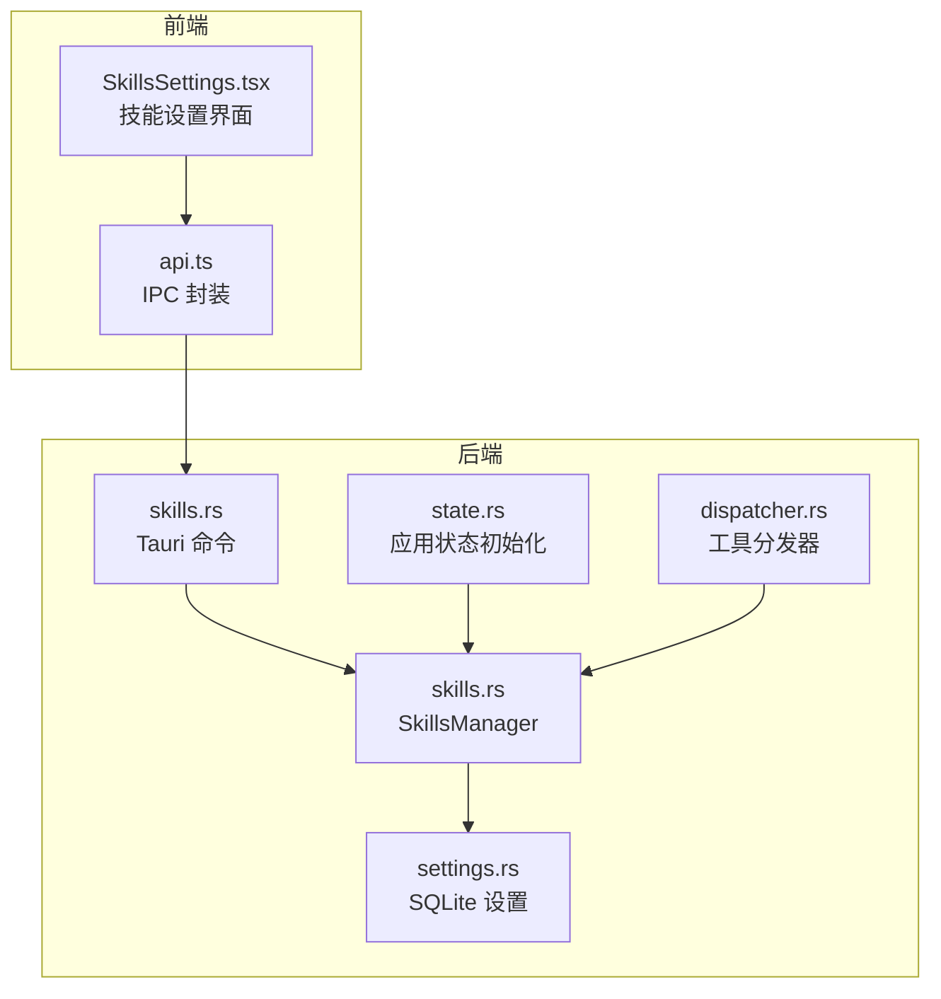
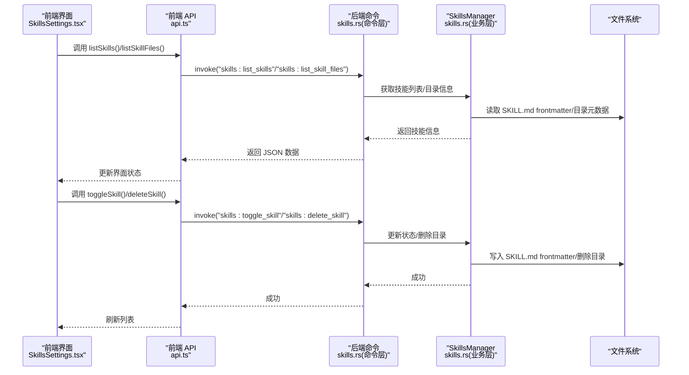
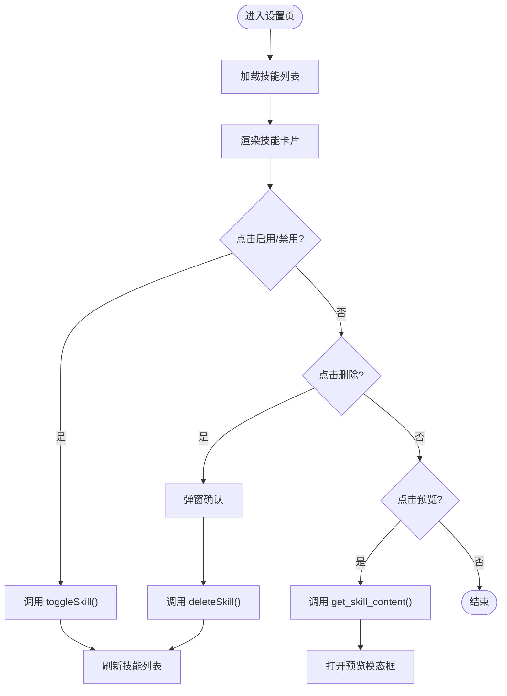
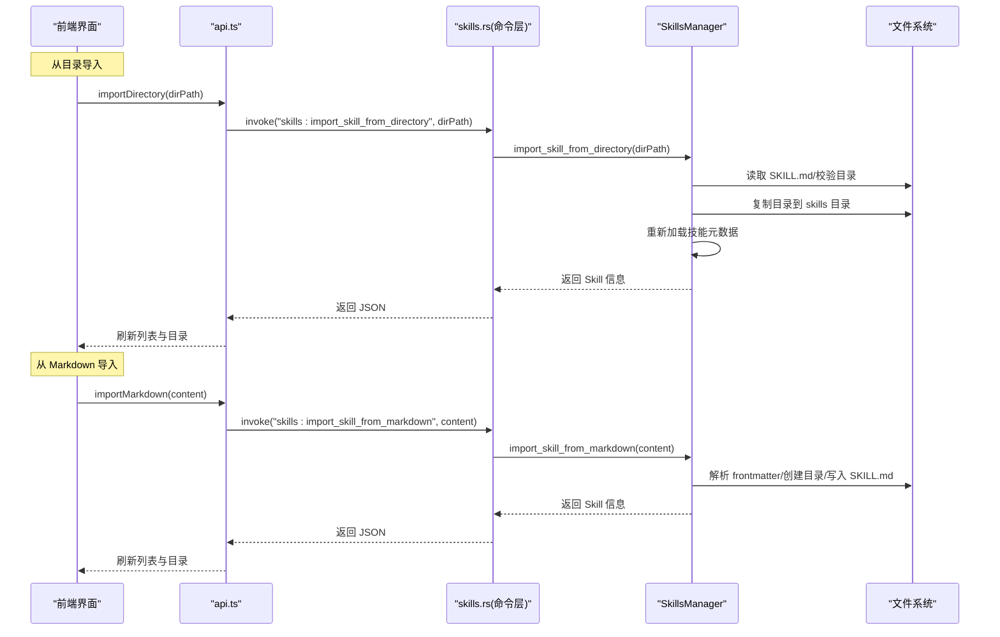
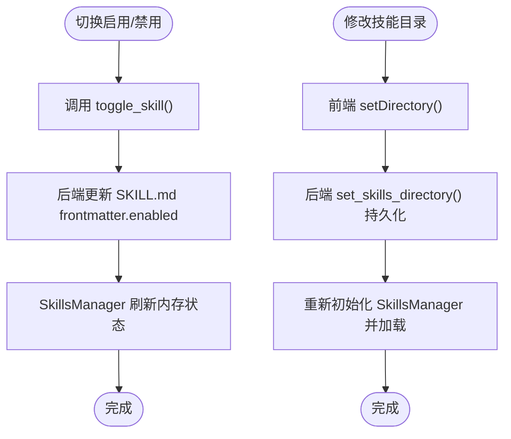
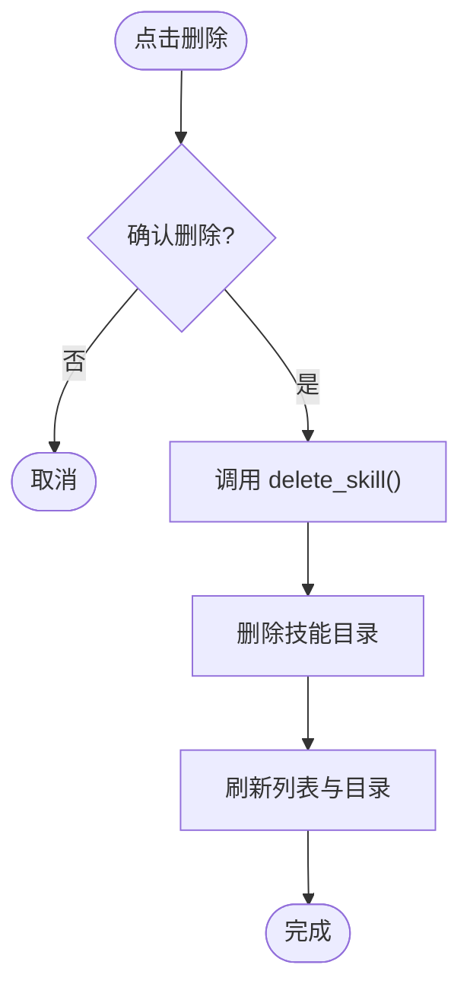
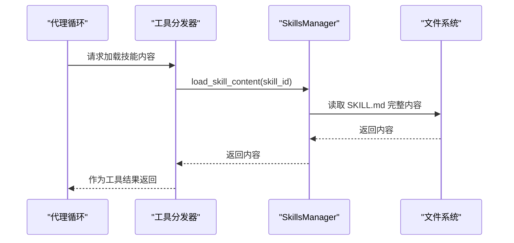
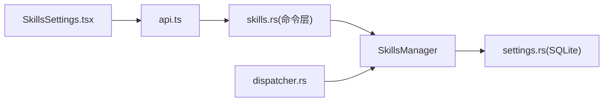

# 技能管理界面

<cite>
**本文引用的文件**
- [SkillsSettings.tsx](file://src-web/src/components/settings/SkillsSettings.tsx)
- [api.ts](file://src-web/src/lib/api.ts)
- [skills.rs（前端命令封装）](file://src-tauri/src/commands/skills.rs)
- [skills.rs（后端管理器）](file://src-tauri/src/ai/skills.rs)
- [settings.rs（数据库设置）](file://src-tauri/src/db/settings.rs)
- [state.rs（应用状态初始化）](file://src-tauri/src/state.rs)
- [dispatcher.rs（工具分发器）](file://src-tauri/src/ai/tools_impl/dispatcher.rs)
- [SKILLS_REFACTORING.md](file://docs/SKILLS_REFACTORING.md)
- [SKILLS_PERSISTENCE.md](file://docs/SKILLS_PERSISTENCE.md)
- [SKILLS_DIRECTORY_MODIFICATION.md](file://docs/SKILLS_DIRECTORY_MODIFICATION.md)
- [alibabacloud-iqs-search-skill.md](file://examples/alibabacloud-iqs-search-skill.md)
- [python-calculator-skill.md](file://examples/python-calculator-skill.md)
- [weather-search-skill.md](file://examples/weather-search-skill.md)
</cite>

## 目录
1. [简介](#简介)
2. [项目结构](#项目结构)
3. [核心组件](#核心组件)
4. [架构总览](#架构总览)
5. [详细组件分析](#详细组件分析)
6. [依赖关系分析](#依赖关系分析)
7. [性能考量](#性能考量)
8. [故障排查指南](#故障排查指南)
9. [结论](#结论)
10. [附录](#附录)

## 简介
本文件面向 CoSurf 技能管理界面，系统性阐述技能列表展示、搜索过滤、分类标签、状态管理；详述技能导入流程（从目录导入、从 Markdown 导入、示例技能同步）；解释技能配置管理（启用/禁用切换、标签编辑、描述修改）；说明技能删除与备份机制（确认流程、数据保护、恢复选项）；并提供最佳实践（目录组织、命名规范、版本管理）。同时给出前端界面交互设计与后端 API 接口说明。

## 项目结构
技能管理界面由前端 React 组件与后端 Tauri 命令共同构成，采用“前端 UI + IPC 调用 + Rust 后端”的分层架构。前端负责展示与交互，后端负责文件系统操作与状态持久化。

**图表来源**
- [SkillsSettings.tsx:1-550](file://src-web/src/components/settings/SkillsSettings.tsx#L1-L550)
- [api.ts:370-445](file://src-web/src/lib/api.ts#L370-L445)
- [skills.rs（前端命令封装）:1-152](file://src-tauri/src/commands/skills.rs#L1-L152)
- [skills.rs（后端管理器）:1-576](file://src-tauri/src/ai/skills.rs#L1-L576)
- [settings.rs（数据库设置）:302-339](file://src-tauri/src/db/settings.rs#L302-L339)
- [state.rs（应用状态初始化）:113-142](file://src-tauri/src/state.rs#L113-L142)
- [dispatcher.rs（工具分发器）:75-104](file://src-tauri/src/ai/tools_impl/dispatcher.rs#L75-L104)

**章节来源**
- [SkillsSettings.tsx:1-550](file://src-web/src/components/settings/SkillsSettings.tsx#L1-L550)
- [api.ts:370-445](file://src-web/src/lib/api.ts#L370-L445)
- [skills.rs（前端命令封装）:1-152](file://src-tauri/src/commands/skills.rs#L1-L152)
- [skills.rs（后端管理器）:1-576](file://src-tauri/src/ai/skills.rs#L1-L576)
- [settings.rs（数据库设置）:302-339](file://src-tauri/src/db/settings.rs#L302-L339)
- [state.rs（应用状态初始化）:113-142](file://src-tauri/src/state.rs#L113-L142)
- [dispatcher.rs（工具分发器）:75-104](file://src-tauri/src/ai/tools_impl/dispatcher.rs#L75-L104)

## 核心组件
- 前端界面组件：SkillsSettings.tsx，负责技能列表展示、导入、启用/禁用、删除、预览等交互。
- 前端 API 封装：api.ts，统一暴露 IPC 调用，包括 list、toggle、importMarkdown、importDirectory、setDirectory、listFiles、getContent 等。
- 后端命令：skills.rs（命令层），提供 list_skills、toggle_skill、import_skill_from_markdown、import_skill_from_directory、list_skill_files、get_skill_content 等命令。
- 后端管理器：skills.rs（业务层），实现 SkillsManager，负责目录扫描、导入、启用/禁用、删除、懒加载等内容。
- 数据持久化：settings.rs，提供 get/set skills directory 与 IQS API Key 的持久化。
- 应用状态：state.rs，在应用启动时加载 skills 目录并初始化 SkillsManager。
- 工具分发：dispatcher.rs，按需加载 SKILL.md 内容作为工具结果返回给代理。

**章节来源**
- [SkillsSettings.tsx:1-550](file://src-web/src/components/settings/SkillsSettings.tsx#L1-L550)
- [api.ts:370-445](file://src-web/src/lib/api.ts#L370-L445)
- [skills.rs（前端命令封装）:1-152](file://src-tauri/src/commands/skills.rs#L1-L152)
- [skills.rs（后端管理器）:1-576](file://src-tauri/src/ai/skills.rs#L1-L576)
- [settings.rs（数据库设置）:302-339](file://src-tauri/src/db/settings.rs#L302-L339)
- [state.rs（应用状态初始化）:113-142](file://src-tauri/src/state.rs#L113-L142)
- [dispatcher.rs（工具分发器）:75-104](file://src-tauri/src/ai/tools_impl/dispatcher.rs#L75-L104)

## 架构总览
技能管理采用“懒加载 + 渐进式加载”架构：初始仅解析 SKILL.md frontmatter，模型选择技能后再懒加载完整内容。目录结构以“技能名/”为目录，内含 SKILL.md 文件。前端通过 IPC 调用后端命令，后端通过 SkillsManager 操作文件系统并持久化状态。

**图表来源**
- [SkillsSettings.tsx:39-229](file://src-web/src/components/settings/SkillsSettings.tsx#L39-L229)
- [api.ts:370-389](file://src-web/src/lib/api.ts#L370-L389)
- [skills.rs（前端命令封装）:42-152](file://src-tauri/src/commands/skills.rs#L42-L152)
- [skills.rs（后端管理器）:172-517](file://src-tauri/src/ai/skills.rs#L172-L517)

**章节来源**
- [SkillsSettings.tsx:39-229](file://src-web/src/components/settings/SkillsSettings.tsx#L39-L229)
- [api.ts:370-389](file://src-web/src/lib/api.ts#L370-L389)
- [skills.rs（前端命令封装）:42-152](file://src-tauri/src/commands/skills.rs#L42-L152)
- [skills.rs（后端管理器）:172-517](file://src-tauri/src/ai/skills.rs#L172-L517)

## 详细组件分析

### 技能列表展示与交互
- 列表渲染：前端从后端获取技能列表与目录信息，分别渲染“已加载的 Skills”和“Skill 目录”。
- 状态管理：启用/禁用通过 toggleSkill 触发，删除通过 deleteSkill 触发，均即时更新界面并持久化。
- 预览功能：点击“预览”加载 SKILL.md 完整内容，便于审阅与调试。
- 搜索过滤：当前实现未提供前端搜索过滤功能，可通过在 UI 层增加输入框与过滤逻辑扩展。

**图表来源**
- [SkillsSettings.tsx:168-229](file://src-web/src/components/settings/SkillsSettings.tsx#L168-L229)
- [api.ts:370-389](file://src-web/src/lib/api.ts#L370-L389)
- [skills.rs（前端命令封装）:60-152](file://src-tauri/src/commands/skills.rs#L60-L152)

**章节来源**
- [SkillsSettings.tsx:340-440](file://src-web/src/components/settings/SkillsSettings.tsx#L340-L440)
- [api.ts:370-389](file://src-web/src/lib/api.ts#L370-L389)
- [skills.rs（前端命令封装）:60-152](file://src-tauri/src/commands/skills.rs#L60-L152)

### 技能导入功能
- 从目录导入：选择包含 SKILL.md 的技能目录，后端复制到 skills 目录并重新加载。
- 从 Markdown 导入：粘贴 SKILL.md 内容，后端解析 frontmatter，创建目录并写入 SKILL.md。
- 示例技能同步：后端将 examples/skills 下的示例技能复制到用户 skills 目录（覆盖最新版本）。

**图表来源**
- [SkillsSettings.tsx:137-173](file://src-web/src/components/settings/SkillsSettings.tsx#L137-L173)
- [api.ts:375-382](file://src-web/src/lib/api.ts#L375-L382)
- [skills.rs（前端命令封装）:92-124](file://src-tauri/src/commands/skills.rs#L92-L124)
- [skills.rs（后端管理器）:359-447](file://src-tauri/src/ai/skills.rs#L359-L447)

**章节来源**
- [SkillsSettings.tsx:137-173](file://src-web/src/components/settings/SkillsSettings.tsx#L137-L173)
- [api.ts:375-382](file://src-web/src/lib/api.ts#L375-L382)
- [skills.rs（前端命令封装）:92-124](file://src-tauri/src/commands/skills.rs#L92-L124)
- [skills.rs（后端管理器）:359-447](file://src-tauri/src/ai/skills.rs#L359-L447)

### 技能配置管理
- 启用/禁用切换：前端调用 toggle_skill，后端更新 SKILL.md frontmatter 的 enabled 字段，并在内存中切换状态。
- 标签与描述：通过 SKILL.md frontmatter 的 tags 与 description 字段管理；导入时解析并写入。
- 目录配置：前端可修改 skills 目录，后端持久化到 SQLite，并重新初始化 SkillsManager 从新目录加载。

**图表来源**
- [SkillsSettings.tsx:211-223](file://src-web/src/components/settings/SkillsSettings.tsx#L211-L223)
- [api.ts:381-382](file://src-web/src/lib/api.ts#L381-L382)
- [skills.rs（前端命令封装）:76-90](file://src-tauri/src/commands/skills.rs#L76-L90)
- [skills.rs（后端管理器）:449-476](file://src-tauri/src/ai/skills.rs#L449-L476)
- [settings.rs（数据库设置）:302-339](file://src-tauri/src/db/settings.rs#L302-L339)

**章节来源**
- [SkillsSettings.tsx:211-223](file://src-web/src/components/settings/SkillsSettings.tsx#L211-L223)
- [api.ts:381-382](file://src-web/src/lib/api.ts#L381-L382)
- [skills.rs（前端命令封装）:76-90](file://src-tauri/src/commands/skills.rs#L76-L90)
- [skills.rs（后端管理器）:449-476](file://src-tauri/src/ai/skills.rs#L449-L476)
- [settings.rs（数据库设置）:302-339](file://src-tauri/src/db/settings.rs#L302-L339)

### 技能删除与备份机制
- 删除流程：前端弹窗确认后调用 delete_skill，后端删除对应目录，确保数据完整性。
- 备份建议：当前未提供自动备份功能，建议在删除前手动复制目录，或在 UI 中增加“备份到历史”按钮。
- 恢复选项：删除后可通过重新导入或从备份目录恢复。

**图表来源**
- [SkillsSettings.tsx:195-209](file://src-web/src/components/settings/SkillsSettings.tsx#L195-L209)
- [api.ts:370-371](file://src-web/src/lib/api.ts#L370-L371)
- [skills.rs（前端命令封装）:60-74](file://src-tauri/src/commands/skills.rs#L60-L74)
- [skills.rs（后端管理器）:462-476](file://src-tauri/src/ai/skills.rs#L462-L476)

**章节来源**
- [SkillsSettings.tsx:195-209](file://src-web/src/components/settings/SkillsSettings.tsx#L195-L209)
- [api.ts:370-371](file://src-web/src/lib/api.ts#L370-L371)
- [skills.rs（前端命令封装）:60-74](file://src-tauri/src/commands/skills.rs#L60-L74)
- [skills.rs（后端管理器）:462-476](file://src-tauri/src/ai/skills.rs#L462-L476)

### 技能内容懒加载与执行
- 懒加载：初始仅解析 SKILL.md frontmatter，模型选择技能后才加载完整内容。
- 执行流程：工具分发器加载技能内容作为工具结果返回，模型据此决定后续工具调用。

**图表来源**
- [dispatcher.rs（工具分发器）:75-104](file://src-tauri/src/ai/tools_impl/dispatcher.rs#L75-L104)
- [skills.rs（后端管理器）:261-272](file://src-tauri/src/ai/skills.rs#L261-L272)

**章节来源**
- [dispatcher.rs（工具分发器）:75-104](file://src-tauri/src/ai/tools_impl/dispatcher.rs#L75-L104)
- [skills.rs（后端管理器）:261-272](file://src-tauri/src/ai/skills.rs#L261-L272)

## 依赖关系分析
- 前端依赖后端命令：SkillsSettings.tsx 通过 api.ts 调用后端命令，命令层再委托 SkillsManager。
- 后端依赖数据库：SkillsManager 初始化时从 SQLite 读取 skills 目录配置。
- 工具分发依赖 SkillsManager：按需加载 SKILL.md 内容。

**图表来源**
- [SkillsSettings.tsx:1-550](file://src-web/src/components/settings/SkillsSettings.tsx#L1-L550)
- [api.ts:370-445](file://src-web/src/lib/api.ts#L370-L445)
- [skills.rs（前端命令封装）:1-152](file://src-tauri/src/commands/skills.rs#L1-L152)
- [skills.rs（后端管理器）:1-576](file://src-tauri/src/ai/skills.rs#L1-L576)
- [settings.rs（数据库设置）:302-339](file://src-tauri/src/db/settings.rs#L302-L339)
- [dispatcher.rs（工具分发器）:75-104](file://src-tauri/src/ai/tools_impl/dispatcher.rs#L75-L104)

**章节来源**
- [SkillsSettings.tsx:1-550](file://src-web/src/components/settings/SkillsSettings.tsx#L1-L550)
- [api.ts:370-445](file://src-web/src/lib/api.ts#L370-L445)
- [skills.rs（前端命令封装）:1-152](file://src-tauri/src/commands/skills.rs#L1-L152)
- [skills.rs（后端管理器）:1-576](file://src-tauri/src/ai/skills.rs#L1-L576)
- [settings.rs（数据库设置）:302-339](file://src-tauri/src/db/settings.rs#L302-L339)
- [dispatcher.rs（工具分发器）:75-104](file://src-tauri/src/ai/tools_impl/dispatcher.rs#L75-L104)

## 性能考量
- 渐进式加载：初始仅解析 frontmatter，减少 IO 与内存占用。
- 懒加载内容：仅在模型选择技能时加载完整 SKILL.md，降低启动与运行时开销。
- 目录监听：可选的文件系统监听（参考重构文档）可实现热重载，提升开发体验。
- 缓存层：未来可引入 TTL 缓存与增量更新，进一步优化性能。

[本节为通用性能讨论，不直接分析具体文件]

## 故障排查指南
- 无法加载技能：检查 skills 目录是否存在且包含 SKILL.md；确认后端日志输出。
- 切换目录失败：确认新目录权限与路径正确；查看 set_skills_directory 的错误处理。
- 导入失败：检查 SKILL.md frontmatter 格式；确认导入命令返回的错误信息。
- 删除异常：确认目录存在且可删除；检查权限与并发锁。

**章节来源**
- [SKILLS_PERSISTENCE.md:462-541](file://docs/SKILLS_PERSISTENCE.md#L462-L541)
- [SKILLS_DIRECTORY_MODIFICATION.md:195-241](file://docs/SKILLS_DIRECTORY_MODIFICATION.md#L195-L241)
- [skills.rs（后端管理器）:172-229](file://src-tauri/src/ai/skills.rs#L172-L229)

## 结论
技能管理界面通过前后端协同，实现了从目录导入、Markdown 导入、示例同步到启用/禁用、删除与预览的完整闭环。后端采用渐进式与懒加载策略，兼顾性能与可维护性；前端提供直观的 UI 与完善的错误反馈。建议后续增强搜索过滤、自动备份与版本管理能力，以进一步提升用户体验。

## 附录

### 前端界面交互设计要点
- 技能卡片：展示名称、描述、标签、启用状态与操作按钮。
- 目录配置：支持编辑、选择目录、保存与重新加载。
- 导入模态框：提供 SKILL.md 模板与格式说明。
- 预览面板：展示 SKILL.md 原文，便于审阅。

**章节来源**
- [SkillsSettings.tsx:231-548](file://src-web/src/components/settings/SkillsSettings.tsx#L231-L548)

### 后端 API 接口说明
- 列出技能：list_skills → 返回技能列表
- 列出目录：list_skill_files → 返回目录信息（含文件大小、修改时间、启用状态）
- 获取内容：get_skill_content → 返回 SKILL.md 完整内容
- 启用/禁用：toggle_skill → 切换 enabled 并更新文件
- 删除技能：delete_skill → 删除技能目录
- 从 Markdown 导入：import_skill_from_markdown → 创建目录并写入 SKILL.md
- 从目录导入：import_skill_from_directory → 复制目录并重新加载
- 设置目录：db:set_skills_directory → 持久化目录并重新加载

**章节来源**
- [api.ts:370-389](file://src-web/src/lib/api.ts#L370-L389)
- [skills.rs（前端命令封装）:42-152](file://src-tauri/src/commands/skills.rs#L42-L152)

### 最佳实践
- 目录组织：每个技能以独立目录存放，目录名为 kebab-case 的技能 ID，包含 SKILL.md。
- 命名规范：技能 ID 使用小写字母、数字与短横线组合，避免特殊字符。
- 版本管理：通过目录名区分不同版本，或在 SKILL.md 中记录版本号与变更说明。
- 安全与备份：导入前备份重要目录；删除前确认并考虑手动备份；敏感配置使用环境变量或设置页面管理。

**章节来源**
- [SKILLS_REFACTORING.md:281-488](file://docs/SKILLS_REFACTORING.md#L281-L488)
- [SKILLS_PERSISTENCE.md:462-541](file://docs/SKILLS_PERSISTENCE.md#L462-L541)
- [alibabacloud-iqs-search-skill.md:1-146](file://examples/alibabacloud-iqs-search-skill.md#L1-L146)
- [python-calculator-skill.md:1-93](file://examples/python-calculator-skill.md#L1-L93)
- [weather-search-skill.md:1-98](file://examples/weather-search-skill.md#L1-L98)