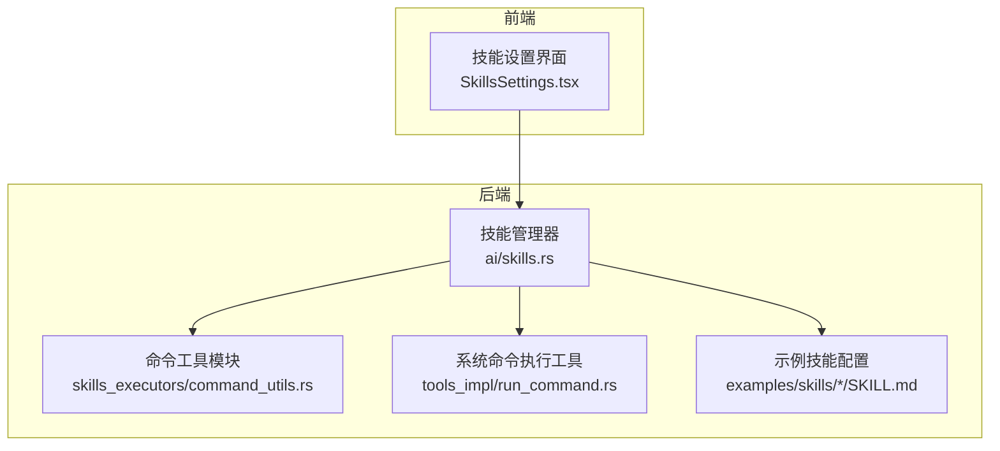
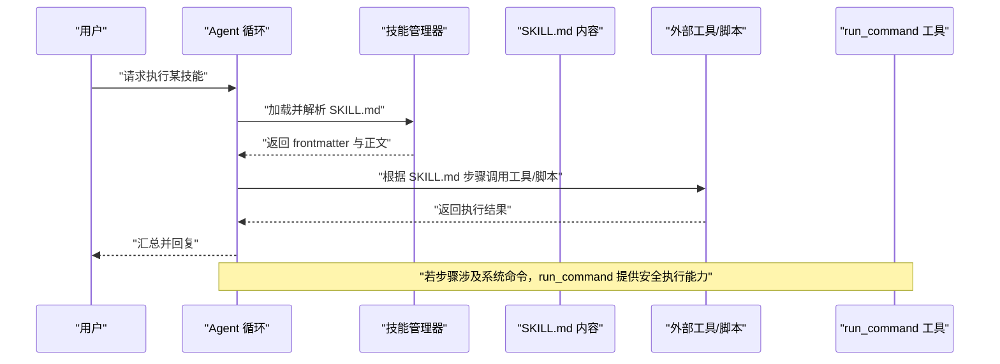
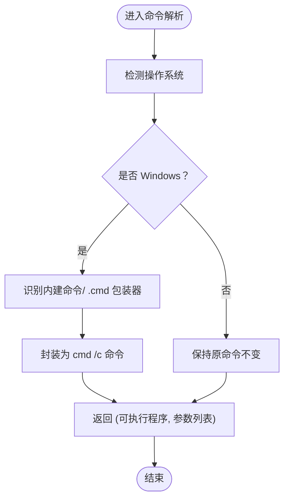
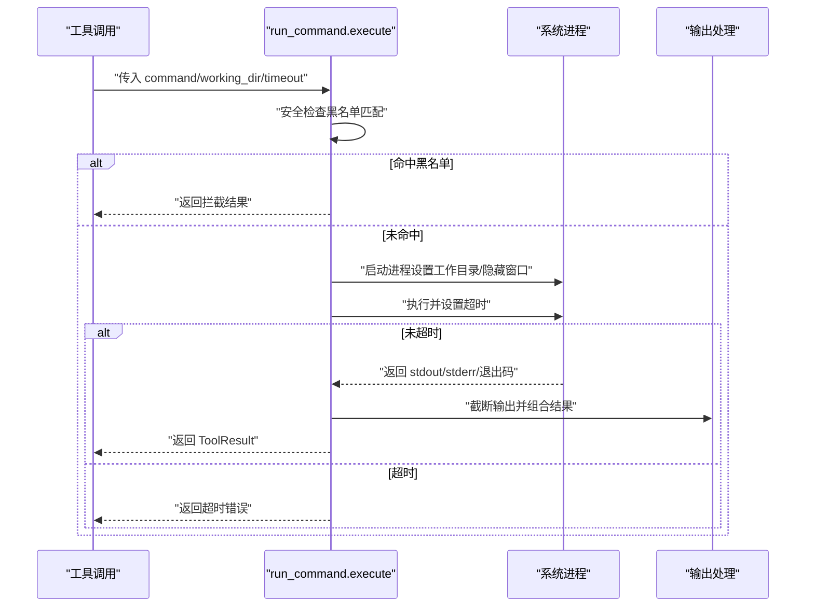
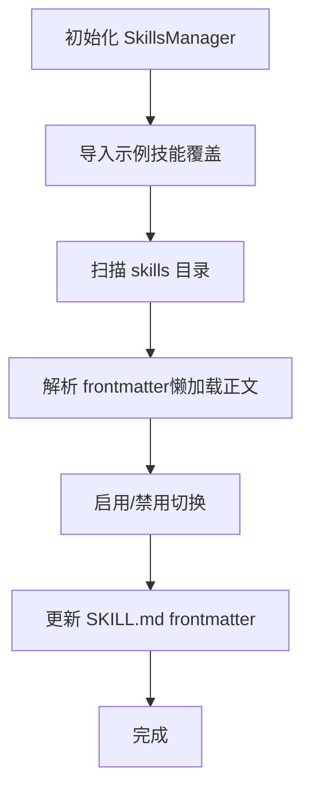
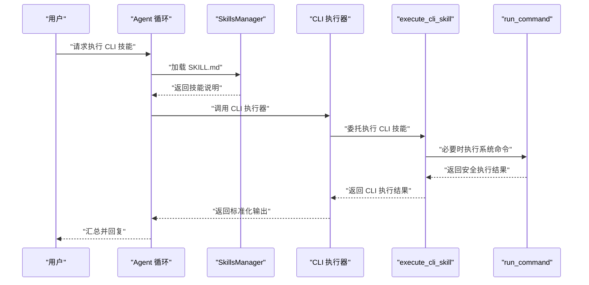

# CLI 技能

<cite>
**本文引用的文件**
- [command_utils.rs](file://src-tauri/src/ai/skills_executors/command_utils.rs)
- [run_command.rs](file://src-tauri/src/ai/tools_impl/run_command.rs)
- [SKILL.md（Python 计算器）](file://examples/skills/python-calculator/SKILL.md)
- [SKILL.md（网页内容总结）](file://examples/skills/web-summarizer/SKILL.md)
- [mod.rs（skills_executors 模块入口）](file://src-tauri/src/ai/skills_executors/mod.rs)
- [skills.rs（AI 技能管理）](file://src-tauri/src/ai/skills.rs)
- [SKILLS_ENGINE_REFACTORING.md](file://docs/SKILLS_ENGINE_REFACTORING.md)
- [SKILLS_REFACTORING.md](file://docs/SKILLS_REFACTORING.md)
- [AGENT_DYNAMIC_TOOLS.md](file://docs/AGENT_DYNAMIC_TOOLS.md)
- [SkillsSettings.tsx（前端配置界面）](file://src-web/src/components/settings/SkillsSettings.tsx)
</cite>

## 目录
1. [简介](#简介)
2. [项目结构](#项目结构)
3. [核心组件](#核心组件)
4. [架构总览](#架构总览)
5. [详细组件分析](#详细组件分析)
6. [依赖关系分析](#依赖关系分析)
7. [性能考虑](#性能考虑)
8. [故障排查指南](#故障排查指南)
9. [结论](#结论)
10. [附录](#附录)

## 简介
本文件面向 CLI 技能类型，系统性阐述其技术实现与工程实践，重点覆盖以下方面：
- 命令解析与参数传递机制
- 执行环境隔离与安全限制
- 命令工具模块（command_utils）的工作原理（进程启动、标准输入输出处理、错误捕获与超时控制）
- CLI 技能示例与 SKILL.md 配置文件分析（Python 计算器、阿里云 IQS 搜索）
- 安全限制（路径验证、权限控制、资源限制）
- 调试方法、性能优化建议与常见问题解决方案

## 项目结构
围绕 CLI 技能的关键代码分布在如下模块：
- 命令工具模块：src-tauri/src/ai/skills_executors/command_utils.rs
- 系统命令执行工具：src-tauri/src/ai/tools_impl/run_command.rs
- 技能管理与加载：src-tauri/src/ai/skills.rs
- 示例技能配置：examples/skills/{python-calculator, alibaba-iqs-search}/SKILL.md
- 文档参考：docs/SKILLS_ENGINE_REFACTORING.md、docs/SKILLS_REFACTORING.md、docs/AGENT_DYNAMIC_TOOLS.md
- 前端技能配置界面：src-web/src/components/settings/SkillsSettings.tsx

图表来源
- [command_utils.rs:1-95](file://src-tauri/src/ai/skills_executors/command_utils.rs#L1-L95)
- [run_command.rs:1-161](file://src-tauri/src/ai/tools_impl/run_command.rs#L1-L161)
- [skills.rs:1-200](file://src-tauri/src/ai/skills.rs#L1-L200)
- [SKILL.md（Python 计算器）:1-39](file://examples/skills/python-calculator/SKILL.md#L1-L39)
- [SkillsSettings.tsx:486-521](file://src-web/src/components/settings/SkillsSettings.tsx#L486-L521)

章节来源
- [command_utils.rs:1-95](file://src-tauri/src/ai/skills_executors/command_utils.rs#L1-L95)
- [run_command.rs:1-161](file://src-tauri/src/ai/tools_impl/run_command.rs#L1-L161)
- [skills.rs:1-200](file://src-tauri/src/ai/skills.rs#L1-L200)
- [SKILL.md（Python 计算器）:1-39](file://examples/skills/python-calculator/SKILL.md#L1-L39)
- [SkillsSettings.tsx:486-521](file://src-web/src/components/settings/SkillsSettings.tsx#L486-L521)

## 核心组件
- 命令工具模块（command_utils）
  - 功能：构建增强的 PATH 环境变量、解析命令（Windows 上 .cmd 包装器与 shell 内建命令通过 cmd /c 执行）
  - 关键点：跨平台 PATH 增强、Windows 特定命令包装策略
- 系统命令执行工具（run_command）
  - 功能：在系统终端中执行 shell 命令，捕获 stdout/stderr，进行安全拦截、超时控制与输出截断
  - 关键点：危险命令黑名单、超时限制、输出截断、隐藏窗口（Windows）
- 技能管理器（skills）
  - 功能：懒加载 SKILL.md frontmatter，按需加载正文；支持导入示例技能、启用/禁用、目录结构管理
  - 关键点：渐进式加载、目录复制与覆盖、frontmatter 解析与更新

章节来源
- [command_utils.rs:1-95](file://src-tauri/src/ai/skills_executors/command_utils.rs#L1-L95)
- [run_command.rs:1-161](file://src-tauri/src/ai/tools_impl/run_command.rs#L1-L161)
- [skills.rs:1-200](file://src-tauri/src/ai/skills.rs#L1-L200)

## 架构总览
CLI 技能在当前架构中由 Agent Loop 驱动，而非独立的 CLI 执行器。Agent 根据 SKILL.md 的说明动态调用工具链（如 MCP 工具、内置工具、脚本等）。命令工具模块（command_utils）为 CLI 场景提供 PATH 增强与命令解析能力，系统命令执行工具（run_command）提供安全可控的系统命令执行能力。

图表来源
- [SKILLS_ENGINE_REFACTORING.md:302-328](file://docs/SKILLS_ENGINE_REFACTORING.md#L302-L328)
- [AGENT_DYNAMIC_TOOLS.md:110-147](file://docs/AGENT_DYNAMIC_TOOLS.md#L110-L147)
- [run_command.rs:35-161](file://src-tauri/src/ai/tools_impl/run_command.rs#L35-L161)

章节来源
- [SKILLS_ENGINE_REFACTORING.md:196-383](file://docs/SKILLS_ENGINE_REFACTORING.md#L196-L383)
- [AGENT_DYNAMIC_TOOLS.md:110-147](file://docs/AGENT_DYNAMIC_TOOLS.md#L110-L147)

## 详细组件分析

### 命令工具模块（command_utils）工作原理
- PATH 增强
  - 读取系统 PATH，并在 Windows 上追加常见运行时安装位置（nvm、volta、fnm、全局 Node.js、Python 等），在 macOS/Linux 上追加 ~/.nvm、~/.volta、~/.fnm 等路径
  - 使用分隔符（Windows 分号、其他系统冒号）拼接为新的 PATH
- 命令解析
  - Windows 平台下，针对内建命令（如 echo、type、dir、copy、move、del、ren、set、npx、npm、pnpm、yarn、node、uvx、pipx）与 .cmd 包装器，统一通过 cmd /c 执行，保证兼容性
  - 其他平台保持原样

图表来源
- [command_utils.rs:77-95](file://src-tauri/src/ai/skills_executors/command_utils.rs#L77-L95)

章节来源
- [command_utils.rs:1-95](file://src-tauri/src/ai/skills_executors/command_utils.rs#L1-L95)

### 系统命令执行工具（run_command）实现要点
- 参数与工作目录
  - 从工具调用参数中提取 command、working_dir、timeout，未提供时采用默认值
- 安全拦截
  - 对命令进行小写化处理，匹配黑名单前缀（如 rm -rf /、格式化磁盘、fork bomb 等），命中则立即返回拦截结果
- 进程执行与超时
  - Windows 使用 cmd /C，非 Windows 使用 sh -c
  - 设置工作目录，隐藏窗口（Windows）
  - 使用 tokio::time::timeout 控制执行时限，默认 30 秒
- 输出处理
  - 截断 stdout（最大 8000 字符）、stderr（最大 4000 字符），避免超长输出
  - 组合输出与退出码，返回 ToolResult

图表来源
- [run_command.rs:35-161](file://src-tauri/src/ai/tools_impl/run_command.rs#L35-L161)

章节来源
- [run_command.rs:1-161](file://src-tauri/src/ai/tools_impl/run_command.rs#L1-L161)

### 技能管理与加载（skills）
- 渐进式加载
  - 初始仅解析 SKILL.md frontmatter（name/description/tags），正文按需懒加载
- 示例技能导入
  - 将 examples/skills 下的示例技能复制到 skills 目录，覆盖最新版本
- 目录结构与启用/禁用
  - 以目录名为技能 ID，支持启用/禁用与 frontmatter 更新
- 前端配置
  - 前端提供编辑 SKILL.md 的界面，便于自定义技能说明与步骤

图表来源
- [skills.rs:99-170](file://src-tauri/src/ai/skills.rs#L99-L170)
- [skills.rs:172-200](file://src-tauri/src/ai/skills.rs#L172-L200)
- [skills.rs:449-462](file://src-tauri/src/ai/skills.rs#L449-L462)
- [SkillsSettings.tsx:486-521](file://src-web/src/components/settings/SkillsSettings.tsx#L486-L521)

章节来源
- [skills.rs:1-200](file://src-tauri/src/ai/skills.rs#L1-L200)
- [SkillsSettings.tsx:486-521](file://src-web/src/components/settings/SkillsSettings.tsx#L486-L521)

### CLI 技能示例与 SKILL.md 配置分析

#### Python 计算器（SKILL.md）
- 角色与用途：数学计算助手，支持基本运算、幂运算、取模、平方根、三角函数与常数
- 使用说明：简单计算直接给出答案，复杂表达式逐步分解
- 注意事项：乘法优先于加法、括号优先、角度换弧度

章节来源
- [SKILL.md（Python 计算器）:1-39](file://examples/skills/python-calculator/SKILL.md#L1-L39)

#### 网页内容总结（SKILL.md）
- 角色与用途：打开指定网页并提取、总结其主要内容，支持多语言翻译
- 执行步骤：open_url → summarize_page → 可选翻译 → 结构化输出
- 可用工具：open_url、summarize_page、translate、export_markdown
- 注意事项：部分网页加载时间较长、内容为空可能是反爬虫限制

章节来源
- [SKILL.md（网页内容总结）:1-57](file://examples/skills/web-summarizer/SKILL.md#L1-L57)

### CLI 技能的执行流程（基于 Agent Loop 驱动）
- Agent 根据 SKILL.md 的说明，动态决定调用哪些工具（MCP 工具、内置工具、脚本等）
- 若涉及系统命令，run_command 提供安全可控的执行通道
- 执行器（CLI/Script/MCP/Built-in）由 Skills 引擎统一调度，CLI 执行器委托给现有函数并自动去除首尾空白

图表来源
- [SKILLS_ENGINE_REFACTORING.md:196-222](file://docs/SKILLS_ENGINE_REFACTORING.md#L196-L222)
- [SKILLS_ENGINE_REFACTORING.md:302-328](file://docs/SKILLS_ENGINE_REFACTORING.md#L302-L328)
- [run_command.rs:35-161](file://src-tauri/src/ai/tools_impl/run_command.rs#L35-L161)

章节来源
- [SKILLS_ENGINE_REFACTORING.md:196-383](file://docs/SKILLS_ENGINE_REFACTORING.md#L196-L383)

## 依赖关系分析
- 模块耦合
  - skills_executors/command_utils 与 tools_impl/run_command 在功能上互补：前者负责 PATH 增强与命令解析，后者负责系统命令的安全执行
  - skills 管理器与前端 SkillsSettings.tsx 交互，支撑技能的可视化配置与导入
- 外部依赖
  - tokio::process::Command 用于跨平台进程管理
  - tokio::time::timeout 用于超时控制
  - tracing 用于日志记录

图表来源
- [command_utils.rs:1-95](file://src-tauri/src/ai/skills_executors/command_utils.rs#L1-L95)
- [run_command.rs:1-161](file://src-tauri/src/ai/tools_impl/run_command.rs#L1-L161)
- [skills.rs:1-200](file://src-tauri/src/ai/skills.rs#L1-L200)
- [SkillsSettings.tsx:486-521](file://src-web/src/components/settings/SkillsSettings.tsx#L486-L521)

章节来源
- [mod.rs（skills_executors 模块入口）:1-6](file://src-tauri/src/ai/skills_executors/mod.rs#L1-L6)

## 性能考虑
- 进程启动与 I/O
  - 使用 tokio::process::Command 异步执行，避免阻塞主线程
  - 输出截断（stdout 8000 字符、stderr 4000 字符）降低内存占用与传输成本
- 超时控制
  - 默认 30 秒超时，防止长时间阻塞；可通过工具参数调整
- 路径解析
  - 增强 PATH 可减少“命令找不到”的重试与失败，提升成功率
- 懒加载
  - SKILL.md 正文按需加载，降低初始加载开销

[本节为通用性能建议，不直接分析具体文件]

## 故障排查指南
- 命令执行失败
  - 检查命令是否在当前 PATH 中；必要时使用绝对路径或手动设置 PATH
  - 查看 run_command 的日志输出，确认是否触发安全拦截或超时
- 输出过长
  - stdout/stderr 已截断，若需完整输出，建议在上游工具中限制输出范围
- 权限问题
  - 确认运行用户具备执行目标命令的权限；Windows 上隐藏窗口不影响权限
- 超时问题
  - 调整工具参数中的 timeout；对于耗时任务，考虑拆分为多个短任务
- 技能未生效
  - 检查 SKILL.md 是否存在且 frontmatter 正确；确认技能目录结构与 ID 规范

章节来源
- [run_command.rs:101-161](file://src-tauri/src/ai/tools_impl/run_command.rs#L101-L161)
- [skills.rs:369-462](file://src-tauri/src/ai/skills.rs#L369-L462)

## 结论
CLI 技能在当前架构中由 Agent Loop 驱动，通过 SKILL.md 明确步骤与工具调用顺序。命令工具模块（command_utils）提供跨平台 PATH 增强与命令解析，系统命令执行工具（run_command）提供安全可控的系统命令执行能力。结合懒加载的技能管理与前端可视化配置，CLI 技能具备良好的扩展性与安全性。

[本节为总结性内容，不直接分析具体文件]

## 附录

### CLI 技能配置要点（SKILL.md）
- 使用 YAML frontmatter 定义元数据（name、description、tags）
- 正文描述使用场景、执行步骤与可用工具
- 建议明确参数说明与注意事项，便于 Agent 正确调用工具

章节来源
- [SkillsSettings.tsx:486-521](file://src-web/src/components/settings/SkillsSettings.tsx#L486-L521)