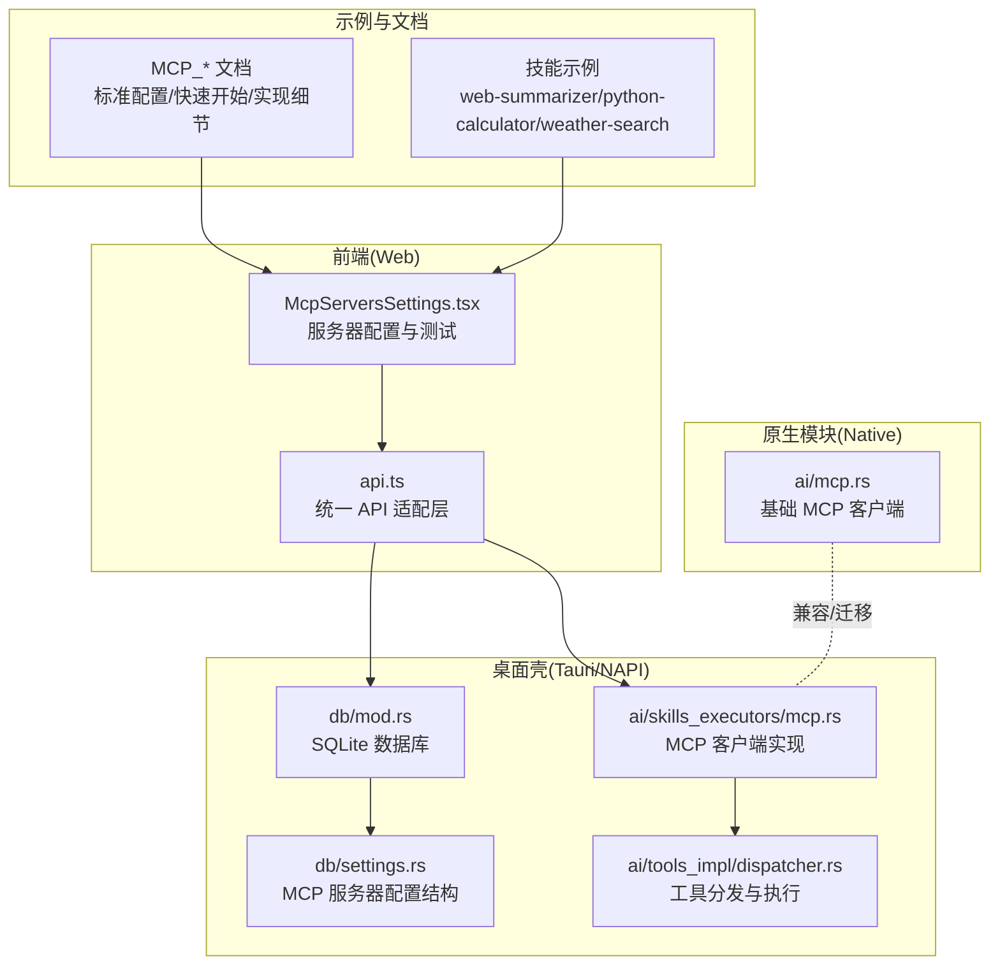
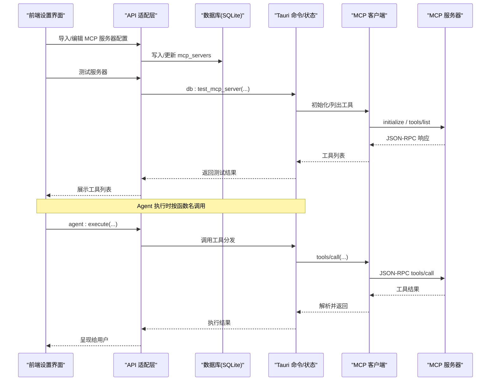
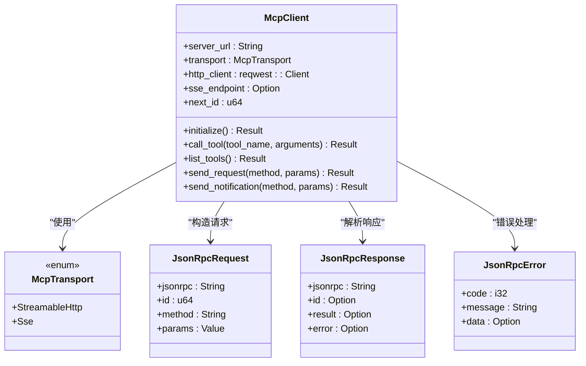
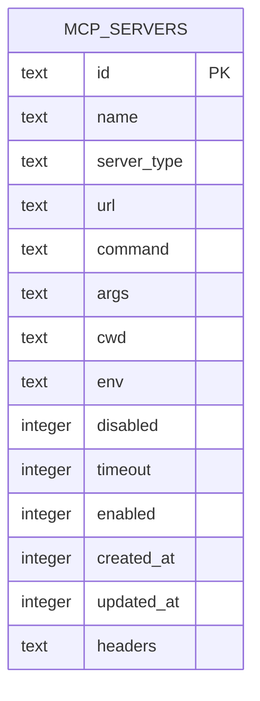
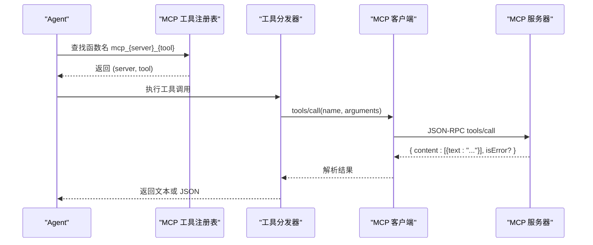
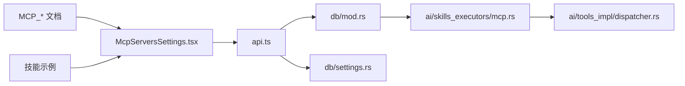

# MCP 技能

<cite>
**本文引用的文件**
- [native\src\ai\mcp.rs](file://native\src\ai\mcp.rs)
- [src-tauri\src\ai\mcp.rs](file://src-tauri\src\ai\mcp.rs)
- [src-tauri\src\ai\skills_executors\mcp.rs](file://src-tauri\src\ai\skills_executors\mcp.rs)
- [src-web\src\components\settings\McpServersSettings.tsx](file://src-web\src\components\settings\McpServersSettings.tsx)
- [src-web\src\lib\api.ts](file://src-web\src\lib\api.ts)
- [src-tauri\src\db\settings.rs](file://src-tauri\src\db\settings.rs)
- [src-tauri\src\db\mod.rs](file://src-tauri\src\db\mod.rs)
- [src-tauri\src\ai\tools_impl\dispatcher.rs](file://src-tauri\src\ai\tools_impl\dispatcher.rs)
- [examples\skills\web-summarizer\SKILL.md](file://examples\skills\web-summarizer\SKILL.md)
- [examples\skills\python-calculator\SKILL.md](file://examples\skills\python-calculator\SKILL.md)
- [examples\weather-search-skill.md](file://examples\weather-search-skill.md)
- [docs\MCP_STANDARD_CONFIG.md](file://docs\MCP_STANDARD_CONFIG.md)
- [docs\MCP_JSON_CONFIG.md](file://docs\MCP_JSON_CONFIG.md)
- [docs\MCP_QUICK_START.md](file://docs\MCP_QUICK_START.md)
- [docs\MCP_SKILL_IMPLEMENTATION.md](file://docs\MCP_SKILL_IMPLEMENTATION.md)
- [docs\MCP_SKILL_SUMMARY.md](file://docs\MCP_SKILL_SUMMARY.md)
</cite>

## 目录
1. [简介](#简介)
2. [项目结构](#项目结构)
3. [核心组件](#核心组件)
4. [架构总览](#架构总览)
5. [详细组件分析](#详细组件分析)
6. [依赖关系分析](#依赖关系分析)
7. [性能考量](#性能考量)
8. [故障排除指南](#故障排除指南)
9. [结论](#结论)
10. [附录](#附录)

## 简介
本文件面向 MCP（Model Context Protocol）技能类型，系统化阐述协议原理、传输机制、工具发现流程；详解 MCP 客户端实现（连接建立、心跳/通知、消息序列化与反序列化）、MCP 服务器配置与管理（注册、工具列表获取、动态调用）；并提供实际应用场景与配置示例（第三方工具集成、自定义工具开发），以及调试方法、连接故障排除、性能优化策略与安全注意事项。

## 项目结构
CoSurf 采用多层架构：
- 前端（Web）：React 组件负责 MCP 服务器配置、工具列表展示与测试、API 适配层。
- 桌面壳（Tauri/NAPI）：Rust 后端负责数据库、MCP 客户端、工具分发与执行、IPC 命令。
- 原生模块（Native）：提供基础的 MCP 客户端能力（迁移与兼容）。
- 示例与文档：提供标准配置、快速开始、技能示例与实现细节。

**图表来源**
- [src-web\src\components\settings\McpServersSettings.tsx:1-688](file://src-web\src\components\settings\McpServersSettings.tsx#L1-L688)
- [src-web\src\lib\api.ts:1-445](file://src-web\src\lib\api.ts#L1-L445)
- [src-tauri\src\db\mod.rs:114-129](file://src-tauri\src\db\mod.rs#L114-L129)
- [src-tauri\src\db\settings.rs:71-114](file://src-tauri\src\db\settings.rs#L71-L114)
- [src-tauri\src\ai\skills_executors\mcp.rs:1-558](file://src-tauri\src\ai\skills_executors\mcp.rs#L1-L558)
- [src-tauri\src\ai\tools_impl\dispatcher.rs:121-141](file://src-tauri\src\ai\tools_impl\dispatcher.rs#L121-L141)
- [native\src\ai\mcp.rs:1-307](file://native\src\ai\mcp.rs#L1-L307)
- [docs\MCP_STANDARD_CONFIG.md:1-364](file://docs\MCP_STANDARD_CONFIG.md#L1-L364)
- [docs\MCP_QUICK_START.md:1-339](file://docs\MCP_QUICK_START.md#L1-L339)

**章节来源**
- [src-web\src\components\settings\McpServersSettings.tsx:1-688](file://src-web\src\components\settings\McpServersSettings.tsx#L1-L688)
- [src-web\src\lib\api.ts:178-218](file://src-web\src\lib\api.ts#L178-L218)
- [src-tauri\src\db\mod.rs:114-129](file://src-tauri\src\db\mod.rs#L114-L129)
- [src-tauri\src\db\settings.rs:71-114](file://src-tauri\src\db\settings.rs#L71-L114)
- [src-tauri\src\ai\skills_executors\mcp.rs:1-558](file://src-tauri\src\ai\skills_executors\mcp.rs#L1-L558)
- [native\src\ai\mcp.rs:1-307](file://native\src\ai\mcp.rs#L1-L307)
- [docs\MCP_STANDARD_CONFIG.md:1-364](file://docs\MCP_STANDARD_CONFIG.md#L1-L364)
- [docs\MCP_QUICK_START.md:1-339](file://docs\MCP_QUICK_START.md#L1-L339)

## 核心组件
- MCP 客户端（Rust）：实现 JSON-RPC 2.0、SSE/Streamable HTTP 传输、初始化与通知、工具调用、响应解析与错误处理。
- MCP 服务器配置与持久化：支持标准 JSON 配置导入、SQLite 存储、UI 编辑与测试。
- 前端设置界面：服务器列表、工具测试、导入导出、编辑与启停。
- 工具分发与执行：在 Agent Loop 中注册 MCP 工具函数，按名称路由到具体服务器与工具。
- 示例与文档：标准配置、快速开始、技能示例与实现细节。

**章节来源**
- [src-tauri\src\ai\skills_executors\mcp.rs:92-198](file://src-tauri\src\ai\skills_executors\mcp.rs#L92-L198)
- [src-tauri\src\db\settings.rs:71-114](file://src-tauri\src\db\settings.rs#L71-L114)
- [src-web\src\components\settings\McpServersSettings.tsx:104-184](file://src-web\src\components\settings\McpServersSettings.tsx#L104-L184)
- [src-tauri\src\ai\tools_impl\dispatcher.rs:121-141](file://src-tauri\src\ai\tools_impl\dispatcher.rs#L121-L141)
- [docs\MCP_STANDARD_CONFIG.md:1-364](file://docs\MCP_STANDARD_CONFIG.md#L1-L364)

## 架构总览
MCP 技能在 CoSurf 中的端到端流程：
- 前端导入/编辑 MCP 服务器配置，持久化至 SQLite。
- 应用启动时加载启用的服务器，初始化 MCP 客户端，发送 initialize 与 initialized 通知。
- Agent 通过函数名路由到对应 MCP 工具，客户端发起 tools/call 请求，解析响应并返回给 Agent。

**图表来源**
- [src-web\src\components\settings\McpServersSettings.tsx:104-184](file://src-web\src\components\settings\McpServersSettings.tsx#L104-L184)
- [src-web\src\lib\api.ts:178-218](file://src-web\src\lib\api.ts#L178-L218)
- [src-tauri\src\db\mod.rs:114-129](file://src-tauri\src\db\mod.rs#L114-L129)
- [src-tauri\src\ai\skills_executors\mcp.rs:167-198](file://src-tauri\src\ai\skills_executors\mcp.rs#L167-L198)
- [src-tauri\src\ai\tools_impl\dispatcher.rs:121-141](file://src-tauri\src\ai\tools_impl\dispatcher.rs#L121-L141)

## 详细组件分析

### MCP 客户端（Rust 实现）
- 协议与传输
  - JSON-RPC 2.0：请求/响应结构、错误对象标准化。
  - 传输模式：Streamable HTTP（POST JSON-RPC 到 URL，支持 application/json 或 text/event-stream）、SSE（先 GET 建立 SSE，读取 endpoint，再 POST）。
- 连接与初始化
  - initialize：发送协议版本、能力与客户端信息；随后发送 initialized 通知。
  - SSE：在 initialize 前建立 SSE 连接，读取 endpoint 事件，后续请求均 POST 至该 endpoint。
- 工具调用与响应解析
  - tools/call：构造请求体，发送并解析 JSON-RPC 响应；若 MCP 工具返回 isError 与 content，则提取文本内容。
- 认证与头部
  - 支持 Authorization Bearer Token（优先使用传入 headers 中的认证头，否则使用配置 api_key）。
  - 支持自定义 headers（如 X-API-Key）。
- 错误处理
  - 标准 JSON-RPC 错误码与消息；HTTP 状态码非成功时返回错误；SSE 流解析失败或无 result 时返回错误。

**图表来源**
- [src-tauri\src\ai\skills_executors\mcp.rs:18-558](file://src-tauri\src\ai\skills_executors\mcp.rs#L18-L558)

**章节来源**
- [src-tauri\src\ai\skills_executors\mcp.rs:167-198](file://src-tauri\src\ai\skills_executors\mcp.rs#L167-L198)
- [src-tauri\src\ai\skills_executors\mcp.rs:200-258](file://src-tauri\src\ai\skills_executors\mcp.rs#L200-L258)
- [src-tauri\src\ai\skills_executors\mcp.rs:262-305](file://src-tauri\src\ai\skills_executors\mcp.rs#L262-L305)
- [src-tauri\src\ai\skills_executors\mcp.rs:308-461](file://src-tauri\src\ai\skills_executors\mcp.rs#L308-L461)
- [src-tauri\src\ai\skills_executors\mcp.rs:462-558](file://src-tauri\src\ai\skills_executors\mcp.rs#L462-L558)

### MCP 服务器配置与持久化
- 配置结构
  - 支持标准 JSON 配置（mcpServers），字段包括：name、server_type（http/streamableHttp/sse/stdio）、url、command、args、cwd、env、disabled、timeout、headers 等。
  - 旧版字段映射：server_url → url；api_key → env 中的键值。
- 数据库存储
  - mcp_servers 表：id、name、server_type、url、command、args、cwd、env、disabled、timeout、enabled、created_at、updated_at、headers。
  - 运行时迁移：确保新增列存在（如 server_type、url、cwd、timeout、enabled、headers）。
- 前端导入与编辑
  - 支持从 JSON 导入、编辑、启停、测试连接、自动加载工具列表。
  - 测试接口返回工具数组，前端展示工具名称与描述。

**图表来源**
- [src-tauri\src\db\mod.rs:114-129](file://src-tauri\src\db\mod.rs#L114-L129)

**章节来源**
- [src-tauri\src\db\settings.rs:71-114](file://src-tauri\src\db\settings.rs#L71-L114)
- [src-tauri\src\db\mod.rs:235-266](file://src-tauri\src\db\mod.rs#L235-L266)
- [src-web\src\components\settings\McpServersSettings.tsx:104-184](file://src-web\src\components\settings\McpServersSettings.tsx#L104-L184)
- [docs\MCP_STANDARD_CONFIG.md:1-364](file://docs\MCP_STANDARD_CONFIG.md#L1-L364)
- [docs\MCP_JSON_CONFIG.md:75-461](file://docs\MCP_JSON_CONFIG.md#L75-L461)

### 工具分发与执行
- Agent Loop 注册：MCP 工具以函数形式注册，函数名为 mcp_{server}_{tool}。
- 执行流程：根据函数名在注册表中查找 server 与 original_tool_name，调用对应 MCP 客户端执行 tools/call。
- 响应处理：解析 MCP 工具返回的 content 文本，或回退为 JSON 字符串。

**图表来源**
- [src-tauri\src\ai\tools_impl\dispatcher.rs:121-141](file://src-tauri\src\ai\tools_impl\dispatcher.rs#L121-L141)
- [src-tauri\src\ai\skills_executors\mcp.rs:200-246](file://src-tauri\src\ai\skills_executors\mcp.rs#L200-L246)

**章节来源**
- [src-tauri\src\ai\tools_impl\dispatcher.rs:121-141](file://src-tauri\src\ai\tools_impl\dispatcher.rs#L121-L141)
- [src-tauri\src\ai\skills_executors\mcp.rs:200-246](file://src-tauri\src\ai\skills_executors\mcp.rs#L200-L246)

### 原生模块 MCP 客户端（兼容与迁移）
- 提供基础的 MCP 数据结构与客户端骨架，支持 Streamable HTTP 与 SSE（部分实现），并具备工具 Schema 生成能力。
- 与 Tauri 版本相比，原生模块更偏向于迁移与兼容，实际生产使用建议以 Tauri 版本为主。

**章节来源**
- [native\src\ai\mcp.rs:1-307](file://native\src\ai\mcp.rs#L1-L307)

## 依赖关系分析
- 前端依赖
  - api.ts：封装 IPC 调用，提供 listMcpServers、testMcpServer、import_mcp_servers_from_json 等方法。
  - McpServersSettings.tsx：负责 UI 交互、导入/编辑/测试/启停、自动加载工具列表。
- 后端依赖
  - db/mod.rs：SQLite 初始化与迁移，mcp_servers 表结构与列保障。
  - db/settings.rs：McpServerConfig 结构与枚举（Http/StreamableHttp/Sse/Stdio）。
  - skills_executors/mcp.rs：MCP 客户端实现与 JSON-RPC/SSE 处理。
  - tools_impl/dispatcher.rs：工具分发与执行。
- 文档与示例
  - MCP_STANDARD_CONFIG.md：标准 JSON 配置格式与字段说明。
  - MCP_QUICK_START.md：快速开始、调试技巧、常见错误排查。
  - 技能示例：web-summarizer、python-calculator、weather-search。

**图表来源**
- [src-web\src\components\settings\McpServersSettings.tsx:1-688](file://src-web\src\components\settings\McpServersSettings.tsx#L1-L688)
- [src-web\src\lib\api.ts:178-218](file://src-web\src\lib\api.ts#L178-L218)
- [src-tauri\src\db\mod.rs:114-129](file://src-tauri\src\db\mod.rs#L114-L129)
- [src-tauri\src\db\settings.rs:71-114](file://src-tauri\src\db\settings.rs#L71-L114)
- [src-tauri\src\ai\skills_executors\mcp.rs:1-558](file://src-tauri\src\ai\skills_executors\mcp.rs#L1-L558)
- [src-tauri\src\ai\tools_impl\dispatcher.rs:121-141](file://src-tauri\src\ai\tools_impl\dispatcher.rs#L121-L141)
- [docs\MCP_STANDARD_CONFIG.md:1-364](file://docs\MCP_STANDARD_CONFIG.md#L1-L364)
- [examples\skills\web-summarizer\SKILL.md:1-57](file://examples\skills\web-summarizer\SKILL.md#L1-L57)

**章节来源**
- [src-web\src\lib\api.ts:178-218](file://src-web\src\lib\api.ts#L178-L218)
- [src-tauri\src\db\mod.rs:114-129](file://src-tauri\src\db\mod.rs#L114-L129)
- [src-tauri\src\db\settings.rs:71-114](file://src-tauri\src\db\settings.rs#L71-L114)
- [src-tauri\src\ai\skills_executors\mcp.rs:1-558](file://src-tauri\src\ai\skills_executors\mcp.rs#L1-L558)
- [src-tauri\src\ai\tools_impl\dispatcher.rs:121-141](file://src-tauri\src\ai\tools_impl\dispatcher.rs#L121-L141)
- [docs\MCP_STANDARD_CONFIG.md:1-364](file://docs\MCP_STANDARD_CONFIG.md#L1-L364)
- [examples\skills\web-summarizer\SKILL.md:1-57](file://examples\skills\web-summarizer\SKILL.md#L1-L57)

## 性能考量
- 连接与超时
  - HTTP 客户端默认超时约 60 秒；SSE 模式下 endpoint 读取有 30 秒超时。
- 并发与连接复用
  - 使用共享的 reqwest 客户端实例，减少连接开销。
- 响应解析
  - Streamable HTTP：根据 Content-Type 判断是否为 SSE 流，分别解析。
  - SSE：逐行读取 data 事件，提取 JSON-RPC 响应，最后一条 result 作为最终结果。
- 建议
  - 对高频调用的服务器可考虑连接池与缓存策略（参考文档中的高级用法）。
  - 控制工具参数大小与数量，避免超大负载导致超时。

[本节为通用指导，不直接分析具体文件]

## 故障排除指南
- 认证失败
  - 现象：MCP error -32000: Unauthorized。
  - 排查：确认 Authorization 头是否正确设置；若使用自定义 headers（如 X-API-Key），确保未重复设置 Authorization；检查环境变量与 ${} 语法。
- 连接超时
  - 现象：Failed to send MCP request: operation timed out。
  - 排查：检查网络连通性、服务器 URL 正确性、防火墙/代理；必要时增加超时时间。
- 工具不存在
  - 现象：MCP error -32601: Method not found。
  - 排查：核对工具名拼写；确认服务器支持该工具；查看服务器文档。
- SSE 端点获取失败
  - 现象：SSE endpoint returned error 或 Timed out waiting for SSE endpoint event。
  - 排查：确认服务器支持 SSE；检查 GET SSE endpoint 是否可达；确认事件流中包含 endpoint 事件。
- 响应格式异常
  - 现象：No valid JSON-RPC result found in SSE stream 或 No result。
  - 排查：确认服务器返回符合 MCP 标准的 JSON-RPC 响应；检查 content 字段与 isError 标记。

**章节来源**
- [docs\MCP_QUICK_START.md:174-208](file://docs\MCP_QUICK_START.md#L174-L208)
- [src-tauri\src\ai\skills_executors\mcp.rs:308-461](file://src-tauri\src\ai\skills_executors\mcp.rs#L308-L461)
- [src-tauri\src\ai\skills_executors\mcp.rs:462-558](file://src-tauri\src\ai\skills_executors\mcp.rs#L462-L558)

## 结论
CoSurf 的 MCP 技能体系完整实现了 MCP 协议与 JSON-RPC 2.0，支持 Streamable HTTP 与 SSE 传输，具备完善的服务器配置、持久化与前端管理能力，并在 Agent Loop 中无缝集成工具调用。通过标准配置与示例文档，用户可快速集成第三方 MCP 服务或开发自定义工具，满足多样化的业务场景需求。

[本节为总结性内容，不直接分析具体文件]

## 附录

### MCP 协议与传输机制
- 协议版本：2024-11-05。
- 初始化流程：initialize → initialized 通知。
- 工具调用：tools/call。
- 传输模式：Streamable HTTP（POST JSON-RPC）、SSE（GET 建立连接，读取 endpoint，再 POST）。

**章节来源**
- [src-tauri\src\ai\skills_executors\mcp.rs:167-198](file://src-tauri\src\ai\skills_executors\mcp.rs#L167-L198)
- [src-tauri\src\ai\skills_executors\mcp.rs:262-305](file://src-tauri\src\ai\skills_executors\mcp.rs#L262-L305)
- [src-tauri\src\ai\skills_executors\mcp.rs:308-461](file://src-tauri\src\ai\skills_executors\mcp.rs#L308-L461)

### MCP 客户端实现要点
- 请求/响应序列化与反序列化：使用 serde。
- 认证头优先级：若 headers 中已有 Authorization/X-API-Key，则不再注入 api_key。
- SSE 端点解析：支持相对路径与绝对路径，基于 base_url 拼接。
- 工具调用结果提取：优先提取 content 中的文本，否则返回 JSON 字符串。

**章节来源**
- [src-tauri\src\ai\skills_executors\mcp.rs:104-159](file://src-tauri\src\ai\skills_executors\mcp.rs#L104-L159)
- [src-tauri\src\ai\skills_executors\mcp.rs:200-246](file://src-tauri\src\ai\skills_executors\mcp.rs#L200-L246)
- [src-tauri\src\ai\skills_executors\mcp.rs:392-414](file://src-tauri\src\ai\skills_executors\mcp.rs#L392-L414)

### MCP 服务器配置与管理
- 标准 JSON 配置：支持多服务器混合配置，字段覆盖旧版 server_url/api_key。
- 数据库存储：mcp_servers 表，运行时迁移确保列存在。
- 前端管理：导入/编辑/启停/测试/自动加载工具列表。

**章节来源**
- [docs\MCP_STANDARD_CONFIG.md:1-364](file://docs\MCP_STANDARD_CONFIG.md#L1-L364)
- [docs\MCP_JSON_CONFIG.md:75-461](file://docs\MCP_JSON_CONFIG.md#L75-L461)
- [src-tauri\src\db\mod.rs:114-129](file://src-tauri\src\db\mod.rs#L114-L129)
- [src-web\src\components\settings\McpServersSettings.tsx:104-184](file://src-web\src\components\settings\McpServersSettings.tsx#L104-L184)

### 实际应用场景与配置示例
- 第三方工具集成：天气查询、网页搜索等。
- 自定义工具开发：参考技能示例，编写 SKILL.md 并在前端导入启用。
- 示例文件：
  - [web-summarizer SKILL.md:1-57](file://examples\skills\web-summarizer\SKILL.md#L1-L57)
  - [python-calculator SKILL.md:1-39](file://examples\skills\python-calculator\SKILL.md#L1-L39)
  - [weather-search-skill.md:1-98](file://examples\weather-search-skill.md#L1-L98)

**章节来源**
- [examples\skills\web-summarizer\SKILL.md:1-57](file://examples\skills\web-summarizer\SKILL.md#L1-L57)
- [examples\skills\python-calculator\SKILL.md:1-39](file://examples\skills\python-calculator\SKILL.md#L1-L39)
- [examples\weather-search-skill.md:1-98](file://examples\weather-search-skill.md#L1-L98)

### 调试方法与最佳实践
- 日志：在关键节点打印 server_url、tool_name、响应状态与内容。
- 测试：使用 curl 直接测试 initialize 与 tools/call。
- 错误排查：对照常见错误与解决方案。
- 安全：使用环境变量存储 API Key，避免硬编码与提交到版本控制。

**章节来源**
- [docs\MCP_QUICK_START.md:160-208](file://docs\MCP_QUICK_START.md#L160-L208)
- [docs\MCP_SKILL_SUMMARY.md:244-289](file://docs\MCP_SKILL_SUMMARY.md#L244-L289)
- [docs\MCP_SKILL_IMPLEMENTATION.md:271-348](file://docs\MCP_SKILL_IMPLEMENTATION.md#L271-L348)