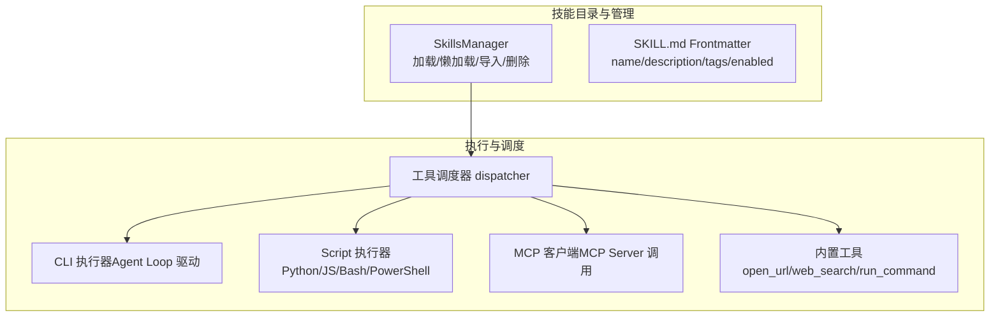
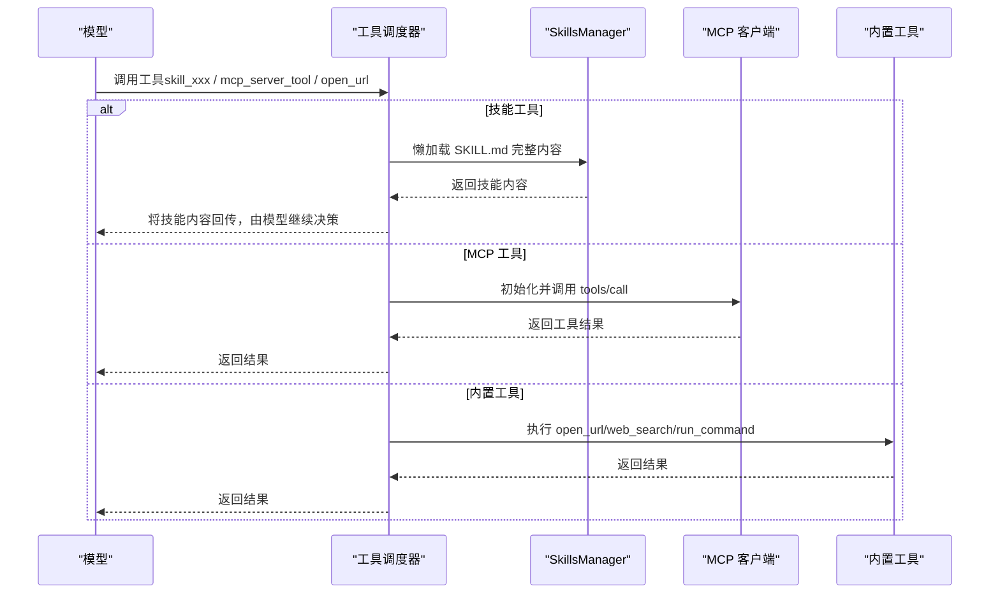
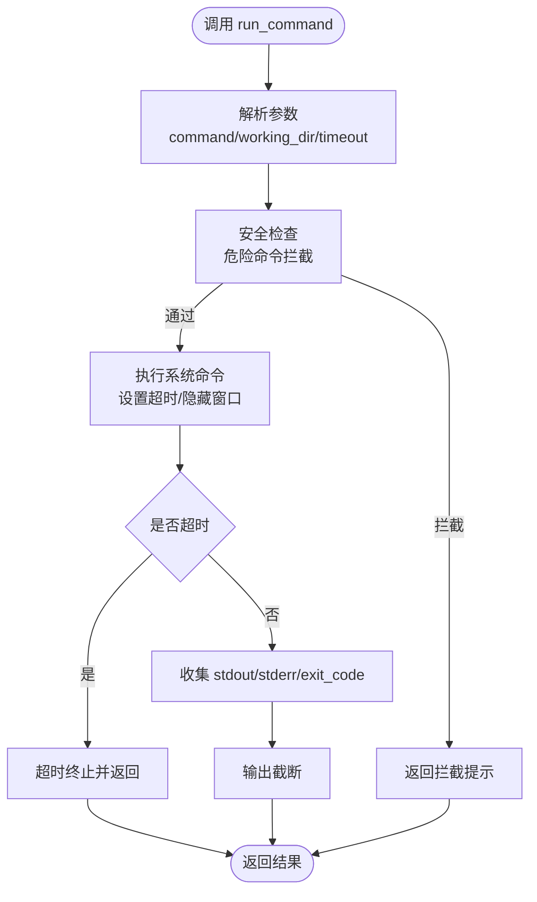
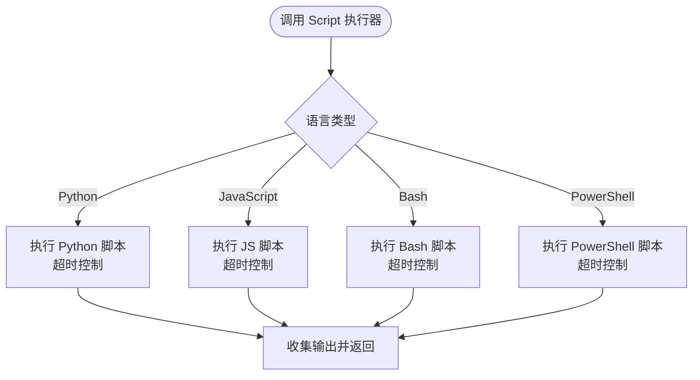
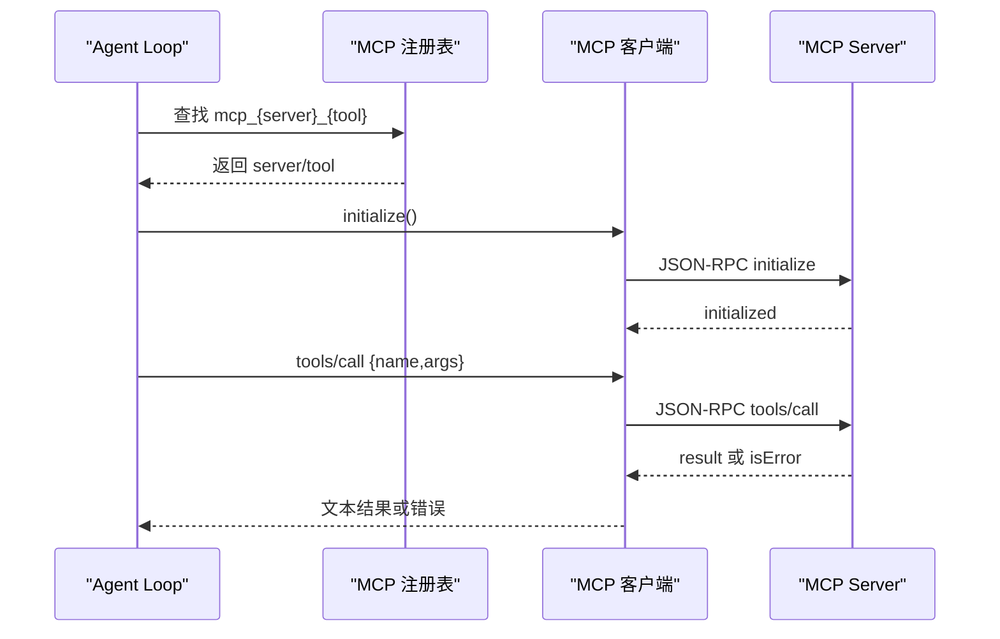
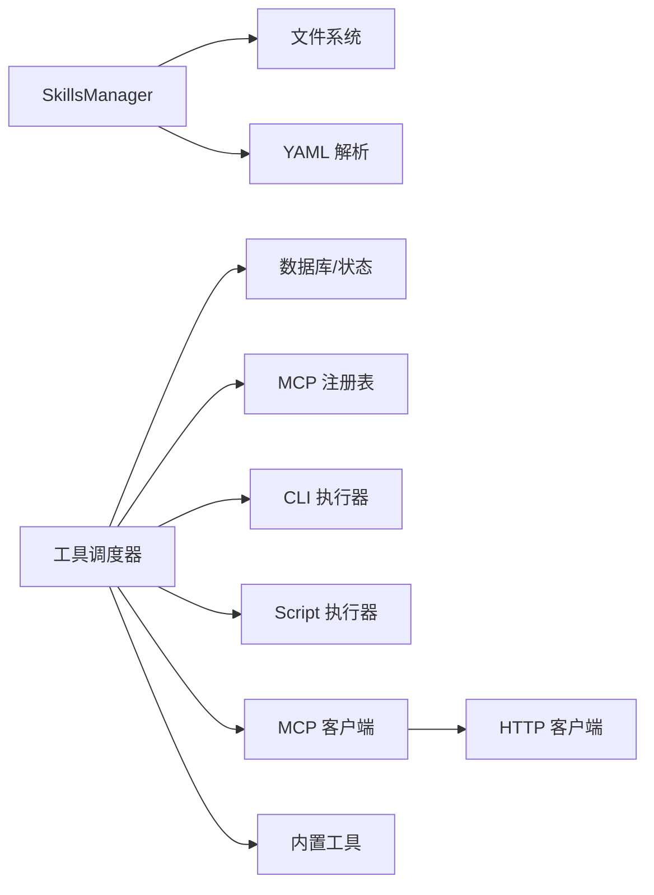

# 技能类型详解

<cite>
**本文引用的文件**
- [native/src/ai/skills.rs](file://native/src/ai/skills.rs)
- [src-tauri/src/ai/skills.rs](file://src-tauri/src/ai/skills.rs)
- [src-tauri/src/ai/skills_executors/mod.rs](file://src-tauri/src/ai/skills_executors/mod.rs)
- [src-tauri/src/ai/skills_executors/mcp.rs](file://src-tauri/src/ai/skills_executors/mcp.rs)
- [src-tauri/src/ai/skills_executors/command_utils.rs](file://src-tauri/src/ai/skills_executors/command_utils.rs)
- [src-tauri/src/ai/tools_impl/dispatcher.rs](file://src-tauri/src/ai/tools_impl/dispatcher.rs)
- [src-tauri/src/ai/tools_impl/run_command.rs](file://src-tauri/src/ai/tools_impl/run_command.rs)
- [src-tauri/src/ai/tools_impl/open_url.rs](file://src-tauri/src/ai/tools_impl/open_url.rs)
- [src-tauri/src/ai/tools_impl/web_search.rs](file://src-tauri/src/ai/tools_impl/web_search.rs)
- [examples/skills/alibaba-iqs-search/SKILL.md](file://examples/skills/alibaba-iqs-search/SKILL.md)
- [examples/skills/python-calculator/SKILL.md](file://examples/skills/python-calculator/SKILL.md)
- [examples/skills/web-summarizer/SKILL.md](file://examples/skills/web-summarizer/SKILL.md)
- [docs/PYTHON_CALCULATOR_FIX.md](file://docs/PYTHON_CALCULATOR_FIX.md)
- [docs/AGENT_DYNAMIC_TOOLS.md](file://docs/AGENT_DYNAMIC_TOOLS.md)
- [docs/MCP_SKILL_IMPLEMENTATION.md](file://docs/MCP_SKILL_IMPLEMENTATION.md)
- [docs/SKILLS_ENGINE_REFACTORING.md](file://docs/SKILLS_ENGINE_REFACTORING.md)
- [docs/SKILLS_REFACTORING.md](file://docs/SKILLS_REFACTORING.md)
</cite>

## 目录
1. [简介](#简介)
2. [项目结构](#项目结构)
3. [核心组件](#核心组件)
4. [架构总览](#架构总览)
5. [详细组件分析](#详细组件分析)
6. [依赖关系分析](#依赖关系分析)
7. [性能考量](#性能考量)
8. [故障排查指南](#故障排查指南)
9. [结论](#结论)
10. [附录](#附录)

## 简介
本文面向 CoSurf 的“技能”体系，系统阐述三类技能类型：CLI Skills（命令行工具执行）、Script Skills（脚本执行，支持 Python、JavaScript、Bash、PowerShell）、MCP Skills（MCP Server 工具调用）。我们将从实现原理、执行环境、安全限制、性能与功能差异、使用建议与最佳实践等维度展开，并结合仓库中的示例 SKILL.md 与实现代码，给出可操作的技能配置与落地建议。

## 项目结构
CoSurf 的技能系统围绕“技能目录 + SKILL.md + 执行器/工具调度器”组织，核心位于 Rust 后端与 Tauri 前后端协同处：
- 技能目录扫描与元数据解析：在 native 与 src-tauri 中分别实现，负责从 SKILL.md frontmatter 加载技能元信息，支持懒加载完整内容。
- 执行器与工具调度：CLI/Script 执行器已迁移至 Agent Loop 驱动；MCP 执行器仍保留客户端能力；内置工具（如 open_url、web_search、run_command）通过统一调度器分发。
- 示例技能：examples/skills 下提供真实 SKILL.md 示例，便于理解配置与使用方式。

**图表来源**
- [src-tauri/src/ai/skills.rs:85-170](file://src-tauri/src/ai/skills.rs#L85-L170)
- [src-tauri/src/ai/tools_impl/dispatcher.rs:11-55](file://src-tauri/src/ai/tools_impl/dispatcher.rs#L11-L55)
- [src-tauri/src/ai/skills_executors/mcp.rs:92-101](file://src-tauri/src/ai/skills_executors/mcp.rs#L92-L101)

**章节来源**
- [src-tauri/src/ai/skills.rs:1-170](file://src-tauri/src/ai/skills.rs#L1-L170)
- [native/src/ai/skills.rs:56-128](file://native/src/ai/skills.rs#L56-L128)

## 核心组件
- SkillsManager：负责扫描技能目录、解析 SKILL.md frontmatter、懒加载完整内容、导入/导出/删除技能、列出目录信息等。
- 工具调度器 dispatcher：根据工具名（skill_*、mcp_*、内置工具）分发到对应实现。
- MCP 客户端：封装 JSON-RPC、Streamable HTTP、SSE 传输，支持初始化与工具调用。
- 内置工具：open_url、web_search、run_command 等，具备安全限制与超时控制。
- CLI/Script 执行器：通过 Agent Loop 驱动，支持跨平台命令解析与 PATH 增强。

**章节来源**
- [native/src/ai/skills.rs:56-128](file://native/src/ai/skills.rs#L56-L128)
- [src-tauri/src/ai/tools_impl/dispatcher.rs:11-55](file://src-tauri/src/ai/tools_impl/dispatcher.rs#L11-L55)
- [src-tauri/src/ai/skills_executors/mcp.rs:92-101](file://src-tauri/src/ai/skills_executors/mcp.rs#L92-L101)
- [src-tauri/src/ai/tools_impl/run_command.rs:19-32](file://src-tauri/src/ai/tools_impl/run_command.rs#L19-L32)
- [src-tauri/src/ai/skills_executors/command_utils.rs:4-75](file://src-tauri/src/ai/skills_executors/command_utils.rs#L4-L75)

## 架构总览
技能类型在 Agent Loop 中以“工具”的形式被调用。当模型选择某技能时，系统会：
- 对于“技能工具”（skill_{id}）：懒加载 SKILL.md 完整内容，返回给 Agent Loop，由其继续解析并调用 MCP 工具/内置工具/脚本。
- 对于“MCP 工具”（mcp_{server}_{tool}）：通过注册表定位服务器与原始工具名，直接调用 MCP Server。
- 对于“内置工具”（open_url/web_search/run_command）：按各自实现执行，内置安全与超时控制。

**图表来源**
- [src-tauri/src/ai/tools_impl/dispatcher.rs:57-119](file://src-tauri/src/ai/tools_impl/dispatcher.rs#L57-L119)
- [src-tauri/src/ai/skills_executors/mcp.rs:167-198](file://src-tauri/src/ai/skills_executors/mcp.rs#L167-L198)
- [src-tauri/src/ai/tools_impl/open_url.rs:16-100](file://src-tauri/src/ai/tools_impl/open_url.rs#L16-L100)
- [src-tauri/src/ai/tools_impl/web_search.rs:14-110](file://src-tauri/src/ai/tools_impl/web_search.rs#L14-L110)

## 详细组件分析

### CLI Skills（命令行工具执行）
- 实现原理
  - 命令解析与跨平台 PATH 增强：通过增强的 PATH 与命令包装策略，确保 npx/npm/pnpm/yarn/node/pipx 等在 Windows 上通过 cmd /c 执行。
  - Agent Loop 驱动：CLI 执行器已迁移至 Agent Loop，由 run_command 工具统一执行系统命令，具备超时与输出截断、危险命令拦截等安全机制。
- 执行环境
  - 默认超时 30 秒；输出截断上限约 8000 字符；Windows 隐藏控制台窗口；黑名单拦截 rm -rf、格式化磁盘、fork bomb 等高危命令。
- 安全限制
  - 黑名单命令严格匹配；超时强制终止；输出截断防止内存膨胀；工作目录可选。
- 性能与功能
  - 适合轻量系统级任务；不适合长时间运行或需要复杂交互的任务。
- 使用建议
  - 明确工作目录与超时；避免高危命令；优先使用幂等命令；合理设置超时。

**图表来源**
- [src-tauri/src/ai/tools_impl/run_command.rs:34-150](file://src-tauri/src/ai/tools_impl/run_command.rs#L34-L150)
- [src-tauri/src/ai/skills_executors/command_utils.rs:77-95](file://src-tauri/src/ai/skills_executors/command_utils.rs#L77-L95)

**章节来源**
- [src-tauri/src/ai/tools_impl/run_command.rs:1-161](file://src-tauri/src/ai/tools_impl/run_command.rs#L1-L161)
- [src-tauri/src/ai/skills_executors/command_utils.rs:1-95](file://src-tauri/src/ai/skills_executors/command_utils.rs#L1-L95)

### Script Skills（脚本执行）
- 实现原理
  - 支持 Python、JavaScript、Bash、PowerShell 四种语言；通过统一入口执行，参数以 JSON 形式传递；新增统一超时控制，避免无限挂起。
- 执行环境
  - 脚本运行环境依赖系统已安装对应解释器；超时可配置，建议为快速计算 5-10 秒，复杂操作 30-60 秒。
- 安全限制
  - 通过超时与日志观测提升可控性；建议配合沙箱或受限环境部署。
- 性能与功能
  - 适合短时计算与数据处理；网络请求建议设置超时；注意内存占用与输出大小。
- 使用建议
  - 为每个 Script Skill 配置合理 timeout；记录超时日志；避免长时间阻塞；必要时拆分为多个小脚本。

**图表来源**
- [docs/PYTHON_CALCULATOR_FIX.md:134-180](file://docs/PYTHON_CALCULATOR_FIX.md#L134-L180)
- [docs/SKILLS_ENGINE_REFACTORING.md:223-248](file://docs/SKILLS_ENGINE_REFACTORING.md#L223-L248)

**章节来源**
- [docs/PYTHON_CALCULATOR_FIX.md:134-230](file://docs/PYTHON_CALCULATOR_FIX.md#L134-L230)
- [docs/SKILLS_ENGINE_REFACTORING.md:223-248](file://docs/SKILLS_ENGINE_REFACTORING.md#L223-L248)

### MCP Skills（MCP Server 工具调用）
- 实现原理
  - 遵循 MCP（Model Context Protocol）标准，支持 Streamable HTTP 与 SSE 两种传输模式；客户端负责初始化、发送 JSON-RPC 请求、解析响应（含 isError 标记）。
  - Agent Loop 中将 MCP 工具注册为独立 function（mcp_{server}_{tool}），通过注册表定位服务器与原始工具名后直接调用。
- 执行环境
  - 需要配置 MCP Server URL、传输类型（HTTP/Streamable HTTP/SSE）与可选自定义头；SSE 模式需先建立连接获取 endpoint。
- 安全限制
  - 通过服务器 URL 与认证头控制访问；工具级错误通过 isError 字段识别；响应内容需校验格式。
- 性能与功能
  - 适合调用外部工具服务；SSE 支持流式响应；需关注网络延迟与超时。
- 使用建议
  - 优先使用 Streamable HTTP；SSE 仅在服务端支持时启用；为工具调用设置合理超时；记录错误码与内容以便排障。

**图表来源**
- [src-tauri/src/ai/tools_impl/dispatcher.rs:121-204](file://src-tauri/src/ai/tools_impl/dispatcher.rs#L121-L204)
- [src-tauri/src/ai/skills_executors/mcp.rs:167-246](file://src-tauri/src/ai/skills_executors/mcp.rs#L167-L246)
- [docs/MCP_SKILL_IMPLEMENTATION.md:108-156](file://docs/MCP_SKILL_IMPLEMENTATION.md#L108-L156)

**章节来源**
- [src-tauri/src/ai/skills_executors/mcp.rs:1-555](file://src-tauri/src/ai/skills_executors/mcp.rs#L1-L555)
- [src-tauri/src/ai/tools_impl/dispatcher.rs:121-204](file://src-tauri/src/ai/tools_impl/dispatcher.rs#L121-L204)
- [docs/MCP_SKILL_IMPLEMENTATION.md:108-156](file://docs/MCP_SKILL_IMPLEMENTATION.md#L108-L156)

### 技能类型对比与适用场景
- CLI Skills
  - 场景：系统命令、文件操作、简单批处理。
  - 优势：低延迟、易调试。
  - 局限：仅限系统命令；复杂逻辑需组合多个命令。
- Script Skills
  - 场景：数学计算、数据处理、自动化脚本。
  - 优势：语言丰富、生态完善。
  - 局限：需保证解释器可用与超时控制。
- MCP Skills
  - 场景：调用第三方工具服务、外部 API。
  - 优势：标准化协议、可扩展性强。
  - 局限：依赖网络与服务端配置。

**章节来源**
- [src-tauri/src/ai/tools_impl/run_command.rs:19-32](file://src-tauri/src/ai/tools_impl/run_command.rs#L19-L32)
- [docs/PYTHON_CALCULATOR_FIX.md:420-476](file://docs/PYTHON_CALCULATOR_FIX.md#L420-L476)
- [src-tauri/src/ai/skills_executors/mcp.rs:1-50](file://src-tauri/src/ai/skills_executors/mcp.rs#L1-L50)

## 依赖关系分析
- SkillsManager 依赖文件系统与 YAML 解析；与工具调度器解耦，仅提供懒加载能力。
- 工具调度器依赖数据库状态（MCP 服务器配置、技能目录）与注册表。
- MCP 客户端依赖 HTTP 客户端与 JSON-RPC 解析。
- 内置工具依赖 Tauri 窗口事件与状态管理。

**图表来源**
- [src-tauri/src/ai/skills.rs:172-250](file://src-tauri/src/ai/skills.rs#L172-L250)
- [src-tauri/src/ai/tools_impl/dispatcher.rs:121-204](file://src-tauri/src/ai/tools_impl/dispatcher.rs#L121-L204)
- [src-tauri/src/ai/skills_executors/mcp.rs:146-158](file://src-tauri/src/ai/skills_executors/mcp.rs#L146-L158)

**章节来源**
- [src-tauri/src/ai/skills.rs:172-250](file://src-tauri/src/ai/skills.rs#L172-L250)
- [src-tauri/src/ai/tools_impl/dispatcher.rs:1-55](file://src-tauri/src/ai/tools_impl/dispatcher.rs#L1-L55)

## 性能考量
- 懒加载：仅在模型选择技能工具时才读取完整 SKILL.md，降低启动与查询成本。
- 超时控制：Script 执行器与 run_command 工具均提供超时保护，避免长时间阻塞。
- 输出截断：run_command 工具对 stdout/stderr 截断，防止大输出导致内存压力。
- 传输优化：MCP 客户端支持 Streamable HTTP 与 SSE，按服务端能力选择最优模式。

**章节来源**
- [native/src/ai/skills.rs:182-197](file://native/src/ai/skills.rs#L182-L197)
- [src-tauri/src/ai/tools_impl/run_command.rs:16-20](file://src-tauri/src/ai/tools_impl/run_command.rs#L16-L20)
- [docs/PYTHON_CALCULATOR_FIX.md:134-180](file://docs/PYTHON_CALCULATOR_FIX.md#L134-L180)
- [src-tauri/src/ai/skills_executors/mcp.rs:257-302](file://src-tauri/src/ai/skills_executors/mcp.rs#L257-L302)

## 故障排查指南
- 技能未加载
  - 检查 SKILL.md 是否存在 frontmatter；确认目录结构与权限；查看懒加载日志。
- MCP 工具调用失败
  - 确认服务器 URL、传输类型与自定义头；检查 SSE endpoint 获取是否成功；查看 JSON-RPC 错误码与 isError 标记。
- 内置工具异常
  - run_command：检查超时、危险命令拦截、输出截断；open_url：检查 URL 格式与前端事件响应。
- 脚本执行超时
  - 调整 timeout 配置；检查脚本逻辑；观察日志输出。

**章节来源**
- [src-tauri/src/ai/tools_impl/dispatcher.rs:134-204](file://src-tauri/src/ai/tools_impl/dispatcher.rs#L134-L204)
- [src-tauri/src/ai/skills_executors/mcp.rs:257-387](file://src-tauri/src/ai/skills_executors/mcp.rs#L257-L387)
- [src-tauri/src/ai/tools_impl/run_command.rs:133-149](file://src-tauri/src/ai/tools_impl/run_command.rs#L133-L149)
- [src-tauri/src/ai/tools_impl/open_url.rs:102-145](file://src-tauri/src/ai/tools_impl/open_url.rs#L102-L145)

## 结论
CoSurf 的技能体系以“工具化”为核心，通过 SkillsManager 的懒加载与工具调度器的统一分发，实现了 CLI、Script、MCP 三大类技能的灵活组合。在实际使用中，应根据任务特性选择合适技能类型：系统命令优先 CLI，复杂逻辑优先 Script，外部服务优先 MCP。同时，务必重视超时与安全控制，确保系统稳定与可控。

## 附录

### 技能示例与配置要点
- 阿里云 IQS 搜索（Web 搜索）
  - 示例路径：[examples/skills/alibaba-iqs-search/SKILL.md](file://examples/skills/alibaba-iqs-search/SKILL.md)
  - 关键点：明确参数（query/engine_type/time_range/max_results），说明使用场景与执行步骤。
- Python Calculator（脚本示例）
  - 示例路径：[examples/skills/python-calculator/SKILL.md](file://examples/skills/python-calculator/SKILL.md)
  - 关键点：支持基本运算、幂次、三角函数、常数；强调计算顺序与单位换算。
- 网页内容总结（综合工具链）
  - 示例路径：[examples/skills/web-summarizer/SKILL.md](file://examples/skills/web-summarizer/SKILL.md)
  - 关键点：open_url → summarize_page → 可选翻译/导出；给出执行流程与注意事项。

**章节来源**
- [examples/skills/alibaba-iqs-search/SKILL.md:1-49](file://examples/skills/alibaba-iqs-search/SKILL.md#L1-L49)
- [examples/skills/python-calculator/SKILL.md:1-39](file://examples/skills/python-calculator/SKILL.md#L1-L39)
- [examples/skills/web-summarizer/SKILL.md:1-57](file://examples/skills/web-summarizer/SKILL.md#L1-L57)

### 技能类型选择指南与最佳实践
- 选择指南
  - 系统命令：优先 CLI；若涉及复杂流程，拆分为多个命令或改用脚本。
  - 数据处理/计算：优先 Script；为每个技能设置合理超时。
  - 外部服务：优先 MCP；确保服务器可达与认证有效。
- 最佳实践
  - 为 Script 配置超时；记录超时日志；避免无限循环。
  - 使用 open_url 时注意 URL 格式与前端事件；run_command 严格拦截高危命令。
  - MCP 工具调用前先初始化；SSE 模式需等待 endpoint；统一解析 isError 与 content。

**章节来源**
- [docs/PYTHON_CALCULATOR_FIX.md:420-476](file://docs/PYTHON_CALCULATOR_FIX.md#L420-L476)
- [src-tauri/src/ai/tools_impl/run_command.rs:22-32](file://src-tauri/src/ai/tools_impl/run_command.rs#L22-L32)
- [src-tauri/src/ai/skills_executors/mcp.rs:167-198](file://src-tauri/src/ai/skills_executors/mcp.rs#L167-L198)