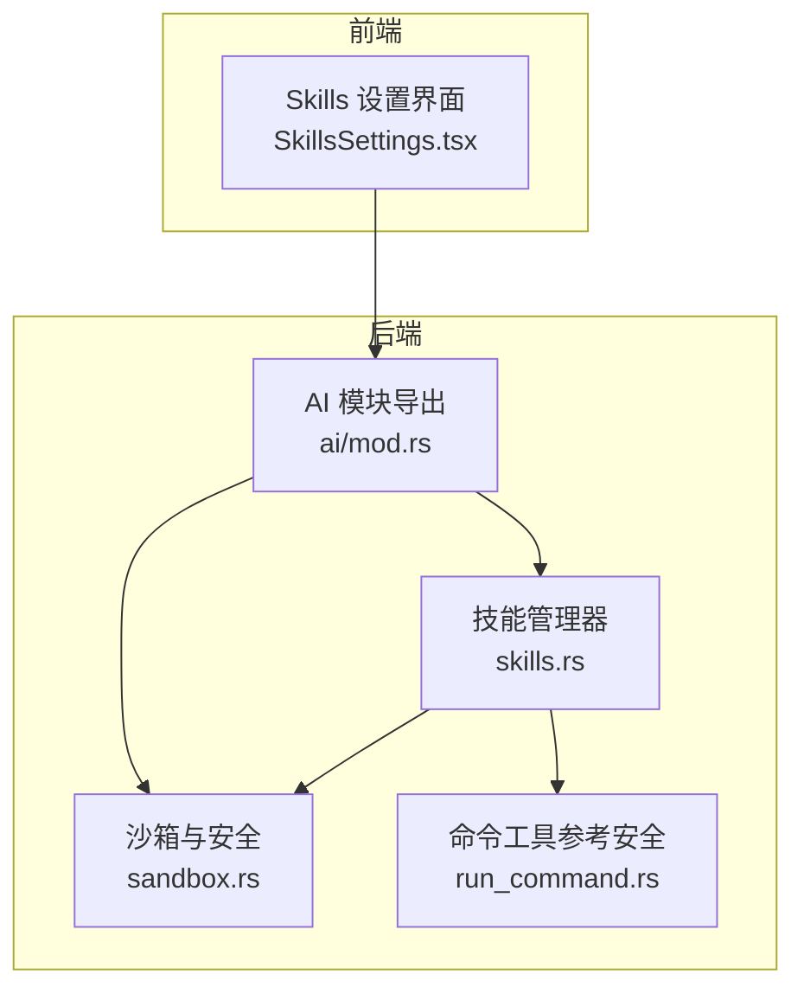
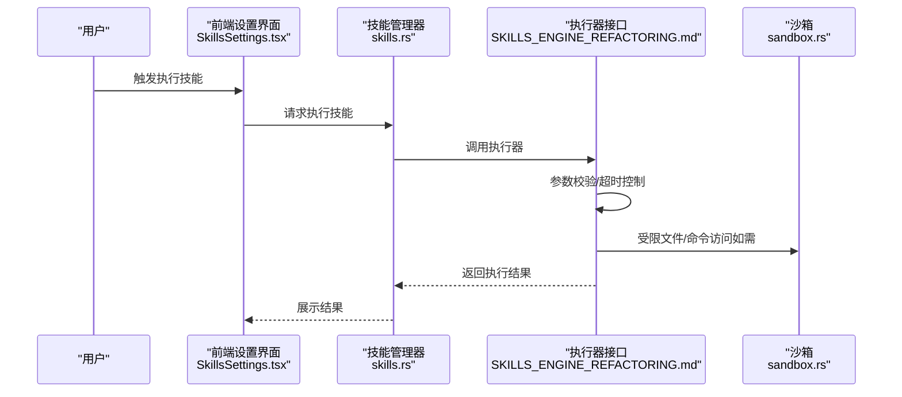
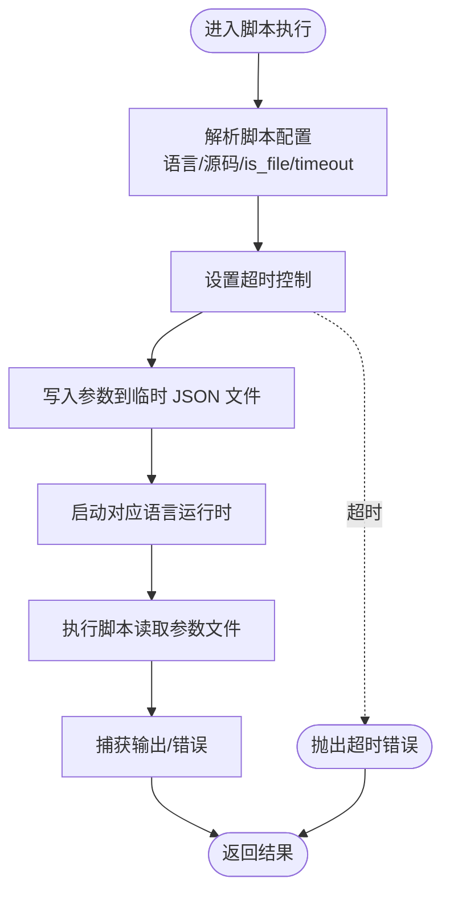
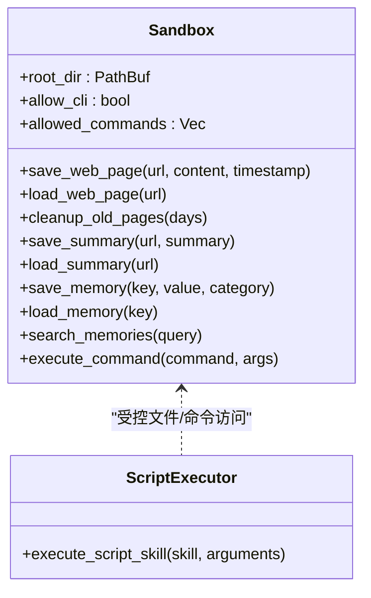
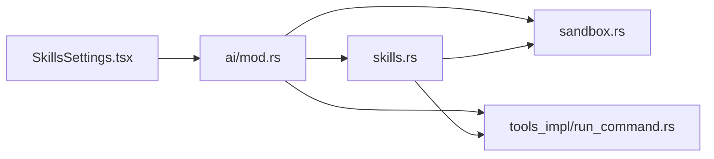

# 脚本技能

<cite>
**本文引用的文件**
- [src-tauri/src/ai/mod.rs](file://src-tauri/src/ai/mod.rs)
- [src-tauri/src/ai/skills.rs](file://src-tauri/src/ai/skills.rs)
- [src-tauri/src/ai/sandbox.rs](file://src-tauri/src/ai/sandbox.rs)
- [src-tauri/src/ai/tools_impl/run_command.rs](file://src-tauri/src/ai/tools_impl/run_command.rs)
- [src-web/src/components/settings/SkillsSettings.tsx](file://src-web/src/components/settings/SkillsSettings.tsx)
- [examples/skills/python-calculator/SKILL.md](file://examples/skills/python-calculator/SKILL.md)
- [examples/skills/web-summarizer/SKILL.md](file://examples/skills/web-summarizer/SKILL.md)
- [docs/SKILLS_MARKDOWN_GUIDE.md](file://docs/SKILLS_MARKDOWN_GUIDE.md)
- [docs/PYTHON_CALCULATOR_FIX.md](file://docs/PYTHON_CALCULATOR_FIX.md)
- [docs/SKILLS_ENGINE_REFACTORING.md](file://docs/SKILLS_ENGINE_REFACTORING.md)
- [docs/SKILLS_DIRECTORY_MANAGEMENT.md](file://docs/SKILLS_DIRECTORY_MANAGEMENT.md)
</cite>

## 目录
1. [简介](#简介)
2. [项目结构](#项目结构)
3. [核心组件](#核心组件)
4. [架构总览](#架构总览)
5. [详细组件分析](#详细组件分析)
6. [依赖关系分析](#依赖关系分析)
7. [性能考量](#性能考量)
8. [故障排查指南](#故障排查指南)
9. [结论](#结论)
10. [附录](#附录)

## 简介
本文件面向“脚本技能”类型，系统性阐述其技术实现与使用方法，重点覆盖：
- 支持的编程语言与执行环境：Python、JavaScript、PowerShell 的运行机制与参数传递
- 安全与沙箱：隔离、资源限制、时间限制
- 与 CLI 技能的差异：执行效率、功能丰富度、适用场景
- 完整示例：Python 计算器、网页摘要等 SKILL.md 配置与实现要点
- 调试技巧、性能监控、错误处理与最佳实践

## 项目结构
围绕脚本技能的关键目录与文件如下：
- 后端 AI 模块导出与组织：[src-tauri/src/ai/mod.rs](file://src-tauri/src/ai/mod.rs)
- 脚本技能管理与目录结构：[src-tauri/src/ai/skills.rs](file://src-tauri/src/ai/skills.rs)
- 沙箱与安全能力：[src-tauri/src/ai/sandbox.rs](file://src-tauri/src/ai/sandbox.rs)
- 命令行工具（参考安全策略）：[src-tauri/src/ai/tools_impl/run_command.rs](file://src-tauri/src/ai/tools_impl/run_command.rs)
- 前端技能设置界面：[src-web/src/components/settings/SkillsSettings.tsx](file://src-web/src/components/settings/SkillsSettings.tsx)
- 示例技能文档：Python 计算器、网页摘要
- 技能系统文档：Markdown 格式指南、引擎重构与超时修复、目录管理

**图表来源**
- [src-tauri/src/ai/mod.rs:1-12](file://src-tauri/src/ai/mod.rs#L1-L12)
- [src-tauri/src/ai/skills.rs:1-576](file://src-tauri/src/ai/skills.rs#L1-L576)
- [src-tauri/src/ai/sandbox.rs:1-251](file://src-tauri/src/ai/sandbox.rs#L1-L251)
- [src-tauri/src/ai/tools_impl/run_command.rs:1-47](file://src-tauri/src/ai/tools_impl/run_command.rs#L1-L47)
- [src-web/src/components/settings/SkillsSettings.tsx:486-521](file://src-web/src/components/settings/SkillsSettings.tsx#L486-L521)

**章节来源**
- [src-tauri/src/ai/mod.rs:1-12](file://src-tauri/src/ai/mod.rs#L1-L12)
- [src-tauri/src/ai/skills.rs:1-576](file://src-tauri/src/ai/skills.rs#L1-L576)
- [src-tauri/src/ai/sandbox.rs:1-251](file://src-tauri/src/ai/sandbox.rs#L1-L251)
- [src-tauri/src/ai/tools_impl/run_command.rs:1-47](file://src-tauri/src/ai/tools_impl/run_command.rs#L1-L47)
- [src-web/src/components/settings/SkillsSettings.tsx:486-521](file://src-web/src/components/settings/SkillsSettings.tsx#L486-L521)

## 核心组件
- 技能管理器（SkillsManager）
  - 负责从目录加载、解析 SKILL.md（frontmatter），支持懒加载完整内容
  - 支持导入/导出、启用/禁用、删除技能目录
- 沙箱（Sandbox）
  - 提供受限的文件系统与命令执行能力，用于安全存储与受控命令执行
- 前端技能设置（SkillsSettings.tsx）
  - 提供导入、启用/禁用、测试执行、列表展示等功能
- 文档与示例
  - SKILLS_MARKDOWN_GUIDE.md：技能类型、参数、超时、安全等规范
  - PYTHON_CALCULATOR_FIX.md：脚本执行超时修复与各语言执行器实现要点
  - 示例 SKILL.md：Python 计算器、网页摘要

**章节来源**
- [src-tauri/src/ai/skills.rs:1-576](file://src-tauri/src/ai/skills.rs#L1-L576)
- [src-tauri/src/ai/sandbox.rs:1-251](file://src-tauri/src/ai/sandbox.rs#L1-L251)
- [src-web/src/components/settings/SkillsSettings.tsx:486-521](file://src-web/src/components/settings/SkillsSettings.tsx#L486-L521)
- [docs/SKILLS_MARKDOWN_GUIDE.md:1-416](file://docs/SKILLS_MARKDOWN_GUIDE.md#L1-L416)
- [docs/PYTHON_CALCULATOR_FIX.md:134-232](file://docs/PYTHON_CALCULATOR_FIX.md#L134-L232)

## 架构总览
脚本技能的执行链路：
- 用户在前端触发技能执行
- 后端 SkillsManager 根据技能 ID 定位目录，解析 frontmatter
- 通过执行器（CLI/Script/MCP）执行具体逻辑
- 脚本执行采用超时控制与参数文件传递
- 沙箱提供受限的文件与命令能力，保障安全

**图表来源**
- [src-web/src/components/settings/SkillsSettings.tsx:486-521](file://src-web/src/components/settings/SkillsSettings.tsx#L486-L521)
- [src-tauri/src/ai/skills.rs:1-576](file://src-tauri/src/ai/skills.rs#L1-L576)
- [docs/SKILLS_ENGINE_REFACTORING.md:120-383](file://docs/SKILLS_ENGINE_REFACTORING.md#L120-L383)
- [src-tauri/src/ai/sandbox.rs:1-251](file://src-tauri/src/ai/sandbox.rs#L1-L251)

## 详细组件分析

### 脚本技能执行器与语言支持
- 支持语言
  - Python、JavaScript、Bash、PowerShell
- 执行机制
  - 通过超时控制封装（tokio::time::timeout）
  - 参数通过临时 JSON 文件传递，脚本读取 argv[1] 获取参数路径
  - 统一错误处理与输出捕获
- 超时控制
  - 脚本配置中新增 timeout 字段，未设置时使用默认值
  - 执行器按配置传入超时秒数，超时即报错并终止

**图表来源**
- [docs/PYTHON_CALCULATOR_FIX.md:134-232](file://docs/PYTHON_CALCULATOR_FIX.md#L134-L232)
- [docs/SKILLS_ENGINE_REFACTORING.md:196-248](file://docs/SKILLS_ENGINE_REFACTORING.md#L196-L248)

**章节来源**
- [docs/SKILLS_ENGINE_REFACTORING.md:196-248](file://docs/SKILLS_ENGINE_REFACTORING.md#L196-L248)
- [docs/PYTHON_CALCULATOR_FIX.md:134-232](file://docs/PYTHON_CALCULATOR_FIX.md#L134-L232)

### 安全沙箱与资源限制
- 沙箱能力
  - 限定根目录，提供 web_pages、summaries、memories、history 等子目录
  - 受限命令执行（白名单），默认允许 ls/cat/echo/pwd/find 等基础命令
  - 提供清理过期网页内容、保存/加载网页摘要与记忆的能力
- 资源限制与时间限制
  - 脚本执行采用超时控制（tokio::time::timeout）
  - 命令工具示例展示了超时与输出截断（最大字符数）等安全策略
- 与脚本技能的关系
  - 脚本技能本身通过超时与参数文件传递实现隔离
  - 沙箱用于受控的文件与命令访问（如需）

**图表来源**
- [src-tauri/src/ai/sandbox.rs:1-251](file://src-tauri/src/ai/sandbox.rs#L1-L251)
- [docs/SKILLS_ENGINE_REFACTORING.md:196-248](file://docs/SKILLS_ENGINE_REFACTORING.md#L196-L248)

**章节来源**
- [src-tauri/src/ai/sandbox.rs:1-251](file://src-tauri/src/ai/sandbox.rs#L1-L251)
- [src-tauri/src/ai/tools_impl/run_command.rs:1-47](file://src-tauri/src/ai/tools_impl/run_command.rs#L1-L47)

### 脚本技能与 CLI 技能的对比
- 执行效率
  - CLI 技能直接调用系统命令，通常更快
  - 脚本技能需要启动语言运行时，有一定启动开销
- 功能丰富度
  - CLI 技能适合简单命令与管道组合
  - 脚本技能支持复杂逻辑、第三方库、网络请求、文件处理
- 使用场景
  - CLI：系统运维、文件处理、快速命令
  - 脚本：数据分析、自动化、跨平台任务、工具集成

**章节来源**
- [docs/SKILLS_ENGINE_REFACTORING.md:196-248](file://docs/SKILLS_ENGINE_REFACTORING.md#L196-L248)

### 示例分析：Python 计算器
- SKILL.md 内容要点
  - 支持基本运算、幂运算、取模、平方根、三角函数、常数
  - 使用说明与示例，强调运算顺序与角度/弧度转换
- 执行要点
  - 通过脚本执行器运行 Python 代码
  - 参数通过临时 JSON 文件传递，脚本读取并解析
  - 建议设置合理超时（如 5-10 秒）

**章节来源**
- [examples/skills/python-calculator/SKILL.md:1-39](file://examples/skills/python-calculator/SKILL.md#L1-L39)
- [docs/SKILLS_MARKDOWN_GUIDE.md:86-114](file://docs/SKILLS_MARKDOWN_GUIDE.md#L86-L114)
- [docs/PYTHON_CALCULATOR_FIX.md:420-476](file://docs/PYTHON_CALCULATOR_FIX.md#L420-L476)

### 示例分析：网页摘要
- SKILL.md 内容要点
  - 使用 open_url、summarize_page、translate、export_markdown 等工具
  - 执行步骤：打开网页 → 提取内容 → 可选翻译 → 生成结构化回答
- 执行要点
  - 由 Agent Loop 根据 SKILL.md 决策调用工具
  - 建议控制摘要长度与等待时间，避免反爬虫限制

**章节来源**
- [examples/skills/web-summarizer/SKILL.md:1-57](file://examples/skills/web-summarizer/SKILL.md#L1-L57)
- [docs/SKILLS_MARKDOWN_GUIDE.md:86-114](file://docs/SKILLS_MARKDOWN_GUIDE.md#L86-L114)

### 技能目录与管理
- 目录结构
  - 每个技能为独立目录，包含 SKILL.md
  - 前端导入/导出、启用/禁用、删除、懒加载
- 目录 API
  - 列出文件、获取/设置目录、导入 Markdown/目录
- 最佳实践
  - 使用 Git 管理技能目录
  - 定期备份技能目录

**章节来源**
- [src-tauri/src/ai/skills.rs:100-170](file://src-tauri/src/ai/skills.rs#L100-L170)
- [docs/SKILLS_DIRECTORY_MANAGEMENT.md:74-236](file://docs/SKILLS_DIRECTORY_MANAGEMENT.md#L74-L236)
- [docs/SKILLS_DIRECTORY_MANAGEMENT.md:570-604](file://docs/SKILLS_DIRECTORY_MANAGEMENT.md#L570-L604)

## 依赖关系分析
- 模块耦合
  - AI 模块导出技能类型与执行器接口
  - 技能管理器依赖沙箱与工具实现
  - 前端通过 IPC 调用后端命令（导入、设置目录等）
- 执行器接口
  - 统一的 SkillExecutor trait，便于扩展新类型
  - 标准化执行结果（成功/失败、耗时、错误信息）

**图表来源**
- [src-tauri/src/ai/mod.rs:1-12](file://src-tauri/src/ai/mod.rs#L1-L12)
- [src-tauri/src/ai/skills.rs:1-576](file://src-tauri/src/ai/skills.rs#L1-L576)
- [src-tauri/src/ai/sandbox.rs:1-251](file://src-tauri/src/ai/sandbox.rs#L1-L251)
- [src-tauri/src/ai/tools_impl/run_command.rs:1-47](file://src-tauri/src/ai/tools_impl/run_command.rs#L1-L47)
- [src-web/src/components/settings/SkillsSettings.tsx:486-521](file://src-web/src/components/settings/SkillsSettings.tsx#L486-L521)

**章节来源**
- [src-tauri/src/ai/mod.rs:1-12](file://src-tauri/src/ai/mod.rs#L1-L12)
- [docs/SKILLS_ENGINE_REFACTORING.md:120-195](file://docs/SKILLS_ENGINE_REFACTORING.md#L120-L195)

## 性能考量
- 超时控制
  - 脚本执行统一采用 tokio::time::timeout，防止无限挂起
  - 建议根据任务类型设置合理超时（快速计算 5s、数据处理 30s、网络请求 60s）
- 并发与缓存
  - 引擎重构文档提供了并发限流与执行结果缓存的设计思路（可选实现）
- 输出截断
  - 命令工具示例展示了输出截断策略，避免过大输出影响性能

**章节来源**
- [docs/PYTHON_CALCULATOR_FIX.md:420-476](file://docs/PYTHON_CALCULATOR_FIX.md#L420-L476)
- [docs/SKILLS_ENGINE_REFACTORING.md:520-584](file://docs/SKILLS_ENGINE_REFACTORING.md#L520-L584)
- [src-tauri/src/ai/tools_impl/run_command.rs:16-47](file://src-tauri/src/ai/tools_impl/run_command.rs#L16-L47)

## 故障排查指南
- 超时问题
  - 现象：脚本长时间无响应
  - 处理：检查 SKILL.md 中 timeout 配置；查看日志中的超时记录
- 参数传递
  - 现象：脚本无法读取参数
  - 处理：确认参数通过临时 JSON 文件传递；脚本读取 argv[1] 获取参数路径
- 目录与导入
  - 现象：技能未出现在列表
  - 处理：检查技能目录结构与 SKILL.md；使用前端导入功能或目录 API
- 安全限制
  - 现象：受限命令不可用或文件访问失败
  - 处理：遵循沙箱白名单与目录结构；必要时在沙箱内进行受控操作

**章节来源**
- [docs/PYTHON_CALCULATOR_FIX.md:446-476](file://docs/PYTHON_CALCULATOR_FIX.md#L446-L476)
- [docs/SKILLS_MARKDOWN_GUIDE.md:328-355](file://docs/SKILLS_MARKDOWN_GUIDE.md#L328-L355)
- [src-tauri/src/ai/sandbox.rs:215-244](file://src-tauri/src/ai/sandbox.rs#L215-L244)

## 结论
脚本技能通过统一的执行器接口与超时控制，实现了对 Python、JavaScript、Bash、PowerShell 的安全、可控执行。结合沙箱与目录管理，既保证了灵活性，又强化了安全性与可观测性。建议在实际使用中：
- 为不同任务设置合适的超时
- 使用 Markdown 格式的 SKILL.md 提升可维护性
- 通过前端界面与目录 API 管理技能集合
- 在需要时利用沙箱进行受控文件与命令操作

## 附录
- 前端导入模态框示例（Markdown 格式说明）
  - 支持 YAML frontmatter、配置代码块、参数表格与示例
- 示例技能
  - Python 计算器、网页摘要等 SKILL.md

**章节来源**
- [src-web/src/components/settings/SkillsSettings.tsx:486-521](file://src-web/src/components/settings/SkillsSettings.tsx#L486-L521)
- [examples/skills/python-calculator/SKILL.md:1-39](file://examples/skills/python-calculator/SKILL.md#L1-L39)
- [examples/skills/web-summarizer/SKILL.md:1-57](file://examples/skills/web-summarizer/SKILL.md#L1-L57)