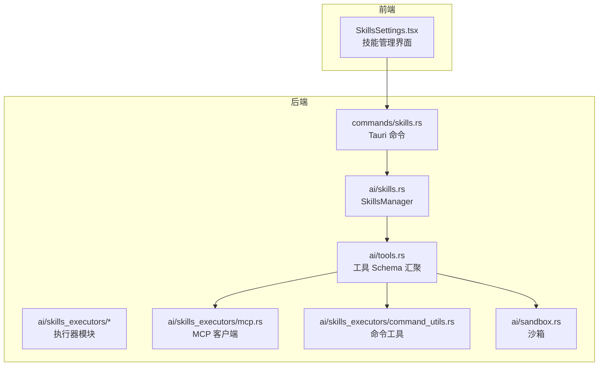
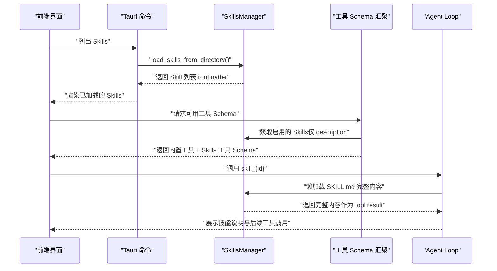
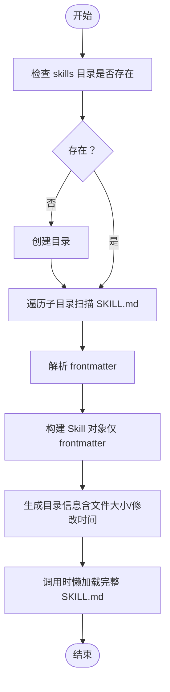
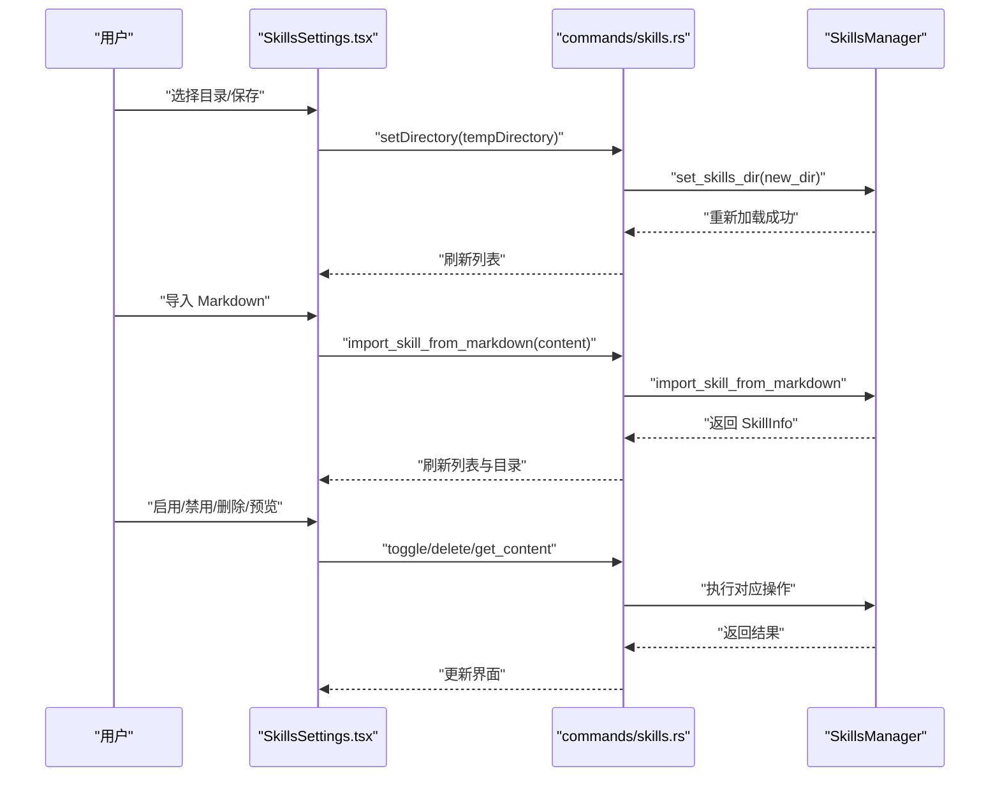
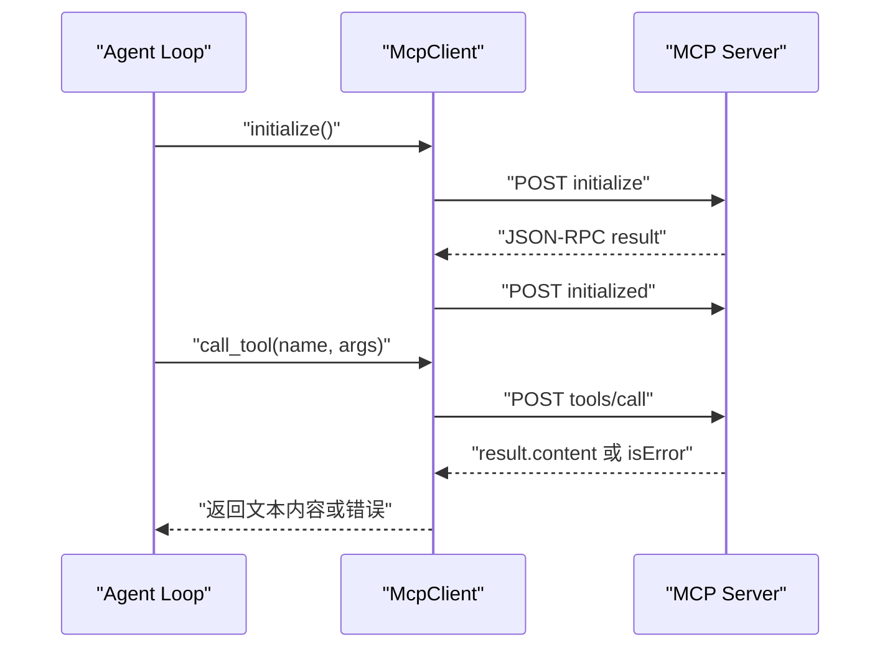
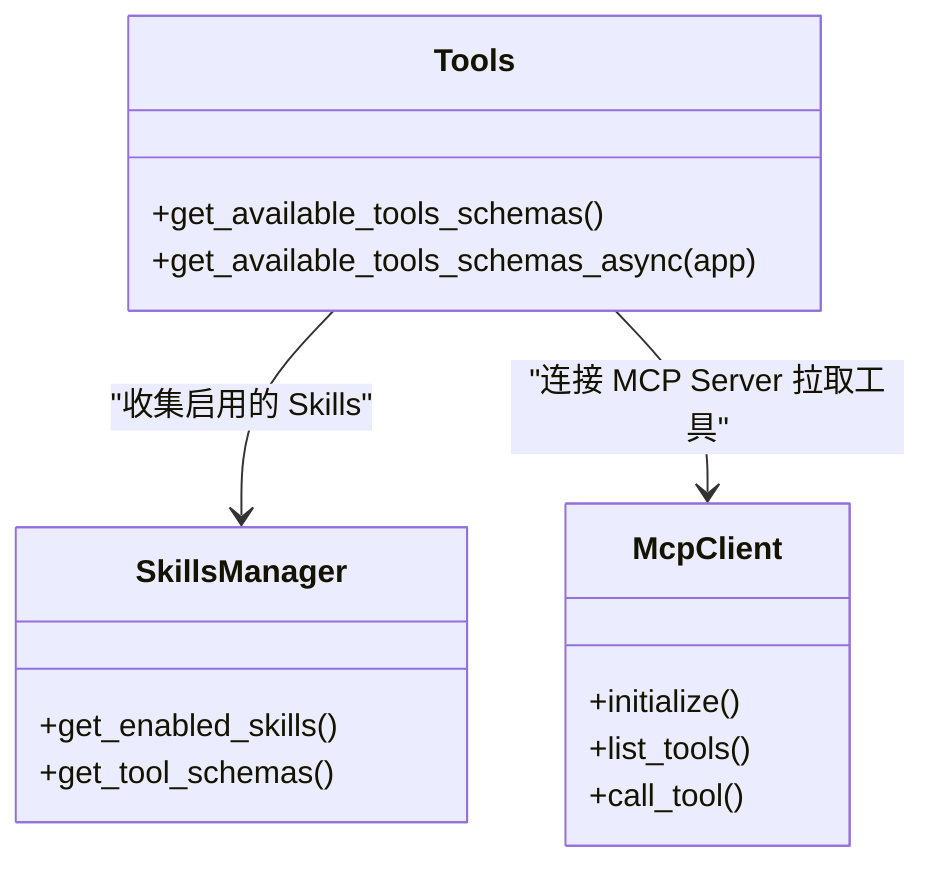
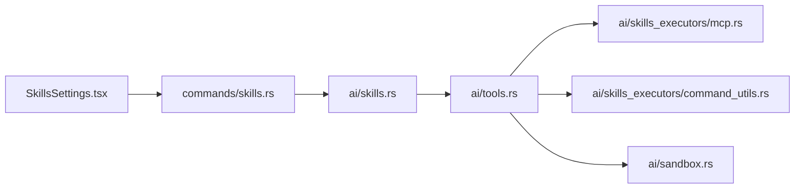

# 技能系统

<cite>
**本文引用的文件**
- [native\src\ai\skills.rs](file://native\src\ai\skills.rs)
- [src-tauri\src\ai\skills.rs](file://src-tauri\src\ai\skills.rs)
- [src-tauri\src\ai\skills_executors\mod.rs](file://src-tauri\src\ai\skills_executors\mod.rs)
- [src-tauri\src\ai\skills_executors\command_utils.rs](file://src-tauri\src\ai\skills_executors\command_utils.rs)
- [src-tauri\src\ai\skills_executors\mcp.rs](file://src-tauri\src\ai\skills_executors\mcp.rs)
- [src-tauri\src\ai\tools.rs](file://src-tauri\src\ai\tools.rs)
- [src-tauri\src\ai\sandbox.rs](file://src-tauri\src\ai\sandbox.rs)
- [src-tauri\src\ai\tools_impl\mod.rs](file://src-tauri\src\ai\tools_impl\mod.rs)
- [src-tauri\src\commands\skills.rs](file://src-tauri\src\commands\skills.rs)
- [src-web\src\components\settings\SkillsSettings.tsx](file://src-web\src\components\settings\SkillsSettings.tsx)
- [examples\skills\alibaba-iqs-search\SKILL.md](file://examples\skills\alibaba-iqs-search\SKILL.md)
- [examples\skills\python-calculator\SKILL.md](file://examples\skills\python-calculator\SKILL.md)
- [examples\skills\web-summarizer\SKILL.md](file://examples\skills\web-summarizer\SKILL.md)
</cite>

## 目录
1. [简介](#简介)
2. [项目结构](#项目结构)
3. [核心组件](#核心组件)
4. [架构总览](#架构总览)
5. [详细组件分析](#详细组件分析)
6. [依赖关系分析](#依赖关系分析)
7. [性能考量](#性能考量)
8. [故障排查指南](#故障排查指南)
9. [结论](#结论)
10. [附录](#附录)

## 简介
本文件面向 CoSurf 技能系统，系统性阐述 Skills 架构的设计理念与实现方式，涵盖技能类型（CLI、脚本、MCP）、技能加载与解析机制、技能执行器实现、技能管理界面、开发指南、安全与权限控制，以及具体示例与使用案例。

## 项目结构
技能系统横跨后端 Rust（Tauri）与前端 React，采用“渐进式加载 + 代理路由”的设计：
- 后端负责技能目录扫描、元数据解析、懒加载、工具 Schema 汇聚、MCP 工具发现与调用、命令执行辅助与沙箱能力。
- 前端提供技能目录配置、导入/导出、启用/禁用、删除、内容预览等管理界面。
- 示例技能位于 examples/skills，采用统一的 SKILL.md 格式，包含 YAML frontmatter 与正文说明。

**图表来源**
- [src-web\src\components\settings\SkillsSettings.tsx](file://src-web\src\components\settings\SkillsSettings.tsx)
- [src-tauri\src\commands\skills.rs](file://src-tauri\src\commands\skills.rs)
- [src-tauri\src\ai\skills.rs](file://src-tauri\src\ai\skills.rs)
- [src-tauri\src\ai\skills_executors\mod.rs](file://src-tauri\src\ai\skills_executors\mod.rs)
- [src-tauri\src\ai\skills_executors\mcp.rs](file://src-tauri\src\ai\skills_executors\mcp.rs)
- [src-tauri\src\ai\skills_executors\command_utils.rs](file://src-tauri\src\ai\skills_executors\command_utils.rs)
- [src-tauri\src\ai\sandbox.rs](file://src-tauri\src\ai\sandbox.rs)
- [src-tauri\src\ai\tools.rs](file://src-tauri\src\ai\tools.rs)

**章节来源**
- [src-web\src\components\settings\SkillsSettings.tsx](file://src-web\src\components\settings\SkillsSettings.tsx)
- [src-tauri\src\commands\skills.rs](file://src-tauri\src\commands\skills.rs)
- [src-tauri\src\ai\skills.rs](file://src-tauri\src\ai\skills.rs)

## 核心组件
- SkillsManager：负责技能目录扫描、frontmatter 解析、懒加载、导入/导出、启用/禁用、删除、目录信息列举。
- 工具 Schema 汇聚：将内置工具、Skills 工具、MCP 工具统一暴露给模型，形成 function calling schema。
- 执行器模块：MCP 客户端、命令工具、脚本执行器（已迁移至 Agent Loop 驱动）。
- 沙箱：提供受限的 CLI 执行与数据存储能力。
- 前端管理界面：技能目录配置、导入、启用/禁用、删除、内容预览。

**章节来源**
- [src-tauri\src\ai\skills.rs](file://src-tauri\src\ai\skills.rs)
- [src-tauri\src\ai\tools.rs](file://src-tauri\src\ai\tools.rs)
- [src-tauri\src\ai\skills_executors\mcp.rs](file://src-tauri\src\ai\skills_executors\mcp.rs)
- [src-tauri\src\ai\skills_executors\command_utils.rs](file://src-tauri\src\ai\skills_executors\command_utils.rs)
- [src-tauri\src\ai\sandbox.rs](file://src-tauri\src\ai\sandbox.rs)
- [src-web\src\components\settings\SkillsSettings.tsx](file://src-web\src\components\settings\SkillsSettings.tsx)

## 架构总览
技能系统采用“渐进式加载 + 代理路由”：
- 初始加载仅解析 SKILL.md frontmatter，模型仅看到 description；调用 skill_{id} 时才懒加载完整内容作为 tool result 返回。
- Agent Loop 根据 SKILL.md 正文决定下一步调用哪些工具（内置工具、MCP 工具或脚本）。
- 工具 Schema 汇聚：内置工具 + Skills 工具（仅 description）+ MCP 工具（动态 discover）。

**图表来源**
- [src-tauri\src\commands\skills.rs](file://src-tauri\src\commands\skills.rs)
- [src-tauri\src\ai\skills.rs](file://src-tauri\src\ai\skills.rs)
- [src-tauri\src\ai\tools.rs](file://src-tauri\src\ai\tools.rs)

## 详细组件分析

### 技能文件格式与元数据定义
- 文件结构：每个技能以独立目录存放，目录名为技能 ID，包含 SKILL.md。
- frontmatter：使用 YAML frontmatter 定义 name、description、enabled、tags 等元数据。
- 正文：自然语言说明技能用途、执行步骤、参数与示例，Agent Loop 根据此内容决定工具调用。

示例参考：
- [examples\skills\alibaba-iqs-search\SKILL.md](file://examples\skills\alibaba-iqs-search\SKILL.md)
- [examples\skills\python-calculator\SKILL.md](file://examples\skills\python-calculator\SKILL.md)
- [examples\skills\web-summarizer\SKILL.md](file://examples\skills\web-summarizer\SKILL.md)

**章节来源**
- [src-tauri\src\ai\skills.rs](file://src-tauri\src\ai\skills.rs)
- [examples\skills\alibaba-iqs-search\SKILL.md](file://examples\skills\alibaba-iqs-search\SKILL.md)
- [examples\skills\python-calculator\SKILL.md](file://examples\skills\python-calculator\SKILL.md)
- [examples\skills\web-summarizer\SKILL.md](file://examples\skills\web-summarizer\SKILL.md)

### 技能加载与解析机制
- 目录扫描：遍历 skills 目录，检查每个子目录是否存在 SKILL.md。
- frontmatter 解析：提取 name/description/tags/enabled，构建 Skill 对象。
- 懒加载：首次仅加载 frontmatter；调用时再读取完整 SKILL.md。
- 目录信息：提供文件大小、修改时间等元信息，按修改时间排序。

**图表来源**
- [src-tauri\src\ai\skills.rs](file://src-tauri\src\ai\skills.rs)

**章节来源**
- [src-tauri\src\ai\skills.rs](file://src-tauri\src\ai\skills.rs)

### 技能管理界面（前端）
- 技能目录配置：支持选择/保存 skills 目录，变更后通知后端更新并重新加载。
- 导入：支持从 Markdown 文本导入，或从文件夹导入（复制目录到 skills 目录）。
- 管理：启用/禁用、删除、内容预览。
- 列表：展示已安装的 Skills 与目录列表（按修改时间排序）。

**图表来源**
- [src-web\src\components\settings\SkillsSettings.tsx](file://src-web\src\components\settings\SkillsSettings.tsx)
- [src-tauri\src\commands\skills.rs](file://src-tauri\src\commands\skills.rs)
- [src-tauri\src\ai\skills.rs](file://src-tauri\src\ai\skills.rs)

**章节来源**
- [src-web\src\components\settings\SkillsSettings.tsx](file://src-web\src\components\settings\SkillsSettings.tsx)
- [src-tauri\src\commands\skills.rs](file://src-tauri\src\commands\skills.rs)

### 技能执行器实现

#### MCP 执行器
- 支持 Streamable HTTP 与 SSE 两种传输模式，自动识别 endpoint 并发送 JSON-RPC 请求。
- 初始化时发送 initialize 与 initialized 通知，随后调用 tools/call 获取工具结果。
- 对工具返回的 content 数组进行聚合，若包含 isError 标记则抛出错误。

**图表来源**
- [src-tauri\src\ai\skills_executors\mcp.rs](file://src-tauri\src\ai\skills_executors\mcp.rs)

**章节来源**
- [src-tauri\src\ai\skills_executors\mcp.rs](file://src-tauri\src\ai\skills_executors\mcp.rs)

#### 命令工具（跨平台 PATH 增强与命令解析）
- 构建增强的 PATH 环境变量，包含常见运行时安装位置（Windows nvm/fnm/volta/pnpm 等，macOS/Linux ~/.nvm ~/.volta ~/.fnm 等）。
- Windows 上对内建命令与 .cmd 包装器进行解析，统一通过 cmd /c 执行，保证兼容性。

**章节来源**
- [src-tauri\src\ai\skills_executors\command_utils.rs](file://src-tauri\src\ai\skills_executors\command_utils.rs)

#### 脚本执行器（已迁移至 Agent Loop 驱动）
- 原设计中包含 CLI/Script 执行器，现已迁移至 Agent Loop 驱动，由 SKILL.md 正文指导具体工具调用（如 web_search、open_url、summarize_page 等）。

**章节来源**
- [src-tauri\src\ai\skills_executors\mod.rs](file://src-tauri\src\ai\skills_executors\mod.rs)

### 工具 Schema 汇聚与代理路由
- 内置工具：summarize_page、web_agent、open_url、translate、export_markdown、web_search、run_command。
- Skills 工具：将每个启用的技能包装为 skill_{id}，仅暴露 description，正文内容在调用时懒加载。
- MCP 工具：连接每个启用的 MCP Server，拉取 tools/list，将每个工具注册为独立 function（命名 mcp_{server}_{tool}），并建立路由映射。

**图表来源**
- [src-tauri\src\ai\tools.rs](file://src-tauri\src\ai\tools.rs)
- [src-tauri\src\ai\skills.rs](file://src-tauri\src\ai\skills.rs)
- [src-tauri\src\ai\skills_executors\mcp.rs](file://src-tauri\src\ai\skills_executors\mcp.rs)

**章节来源**
- [src-tauri\src\ai\tools.rs](file://src-tauri\src\ai\tools.rs)
- [src-tauri\src\ai\skills.rs](file://src-tauri\src\ai\skills.rs)

### 沙箱执行与安全机制
- 沙箱提供受限的 CLI 执行能力：可配置允许的命令白名单，执行时限定工作目录，并对输出进行校验。
- 提供网页内容、摘要、记忆等数据的持久化与清理能力，支持按时间阈值清理过期数据。
- 适用于需要隔离执行与数据存储的场景，降低风险面。

**章节来源**
- [src-tauri\src\ai\sandbox.rs](file://src-tauri\src\ai\sandbox.rs)

## 依赖关系分析
- 前端通过 Tauri 命令与后端交互，后端 SkillsManager 负责技能生命周期管理。
- 工具 Schema 汇聚模块同时对接 Skills 与 MCP，形成统一的 function calling 接口。
- 执行器模块（MCP、命令工具）为工具调用提供底层能力。

**图表来源**
- [src-web\src\components\settings\SkillsSettings.tsx](file://src-web\src\components\settings\SkillsSettings.tsx)
- [src-tauri\src\commands\skills.rs](file://src-tauri\src\commands\skills.rs)
- [src-tauri\src\ai\skills.rs](file://src-tauri\src\ai\skills.rs)
- [src-tauri\src\ai\tools.rs](file://src-tauri\src\ai\tools.rs)
- [src-tauri\src\ai\skills_executors\mcp.rs](file://src-tauri\src\ai\skills_executors\mcp.rs)
- [src-tauri\src\ai\skills_executors\command_utils.rs](file://src-tauri\src\ai\skills_executors\command_utils.rs)
- [src-tauri\src\ai\sandbox.rs](file://src-tauri\src\ai\sandbox.rs)

**章节来源**
- [src-tauri\src\ai\tools.rs](file://src-tauri\src\ai\tools.rs)
- [src-tauri\src\ai\skills.rs](file://src-tauri\src\ai\skills.rs)

## 性能考量
- 渐进式加载：frontmatter 仅在初始加载时解析，完整 SKILL.md 仅在调用时懒加载，降低内存与 IO 压力。
- 工具 Schema 动态汇聚：仅在需要时连接 MCP Server 拉取工具列表，避免不必要的网络开销。
- 目录信息排序：按修改时间排序，便于快速定位最新技能。
- 建议：为大型技能集合引入缓存层与文件系统监听，实现热重载与增量更新。

[本节为通用性能讨论，不涉及具体文件分析]

## 故障排查指南
- 导入失败：检查 SKILL.md frontmatter 格式与必填字段；查看后端日志定位错误。
- 技能未出现在工具列表：确认 enabled 状态与目录结构；检查懒加载是否成功。
- MCP 工具不可用：确认 MCP Server URL、传输模式（HTTP/SSE）、认证头；检查初始化与 tools/list 是否成功。
- 命令执行失败：确认命令在白名单中；检查 PATH 增强是否正确；查看 stderr 输出。
- 前端无响应：确认 Tauri 命令通道正常；检查前端与后端状态同步。

**章节来源**
- [src-tauri\src\ai\skills.rs](file://src-tauri\src\ai\skills.rs)
- [src-tauri\src\ai\skills_executors\mcp.rs](file://src-tauri\src\ai\skills_executors\mcp.rs)
- [src-tauri\src\ai\skills_executors\command_utils.rs](file://src-tauri\src\ai\skills_executors\command_utils.rs)
- [src-web\src\components\settings\SkillsSettings.tsx](file://src-web\src\components\settings\SkillsSettings.tsx)

## 结论
CoSurf 技能系统通过“渐进式加载 + 代理路由”的设计，实现了对 CLI、脚本与 MCP 工具的统一抽象与灵活调度。前端提供直观的技能管理界面，后端以 SkillsManager 为核心，结合工具 Schema 汇聚与执行器模块，支撑 Agent Loop 的智能决策与执行。配合沙箱与安全机制，系统在开放性与安全性之间取得平衡，适合持续演进与团队协作。

[本节为总结性内容，不涉及具体文件分析]

## 附录

### 技能类型与使用场景
- CLI/MCP：通过 MCP 客户端与命令工具实现外部系统集成与跨平台命令执行。
- 脚本：原设计包含脚本执行器，现已迁移至 Agent Loop 驱动，由 SKILL.md 正文指导工具调用。
- MCP：支持 Streamable HTTP 与 SSE 传输，动态发现工具并注册为 function。

**章节来源**
- [src-tauri\src\ai\skills_executors\mcp.rs](file://src-tauri\src\ai\skills_executors\mcp.rs)
- [src-tauri\src\ai\skills_executors\command_utils.rs](file://src-tauri\src\ai\skills_executors\command_utils.rs)
- [src-tauri\src\ai\skills_executors\mod.rs](file://src-tauri\src\ai\skills_executors\mod.rs)

### 技能开发指南
- 规范：使用 YAML frontmatter 定义元数据；在正文中给出明确的使用说明、执行步骤与参数示例。
- 最佳实践：单一职责、清晰描述、合理参数与默认值、健壮的错误处理、审计日志。
- 安全：验证输入、限制权限、必要时在沙箱中执行、设置超时与资源限制。
- 示例：参考 examples/skills 下的 SKILL.md，学习如何组织内容与参数。

**章节来源**
- [examples\skills\alibaba-iqs-search\SKILL.md](file://examples\skills\alibaba-iqs-search\SKILL.md)
- [examples\skills\python-calculator\SKILL.md](file://examples\skills\python-calculator\SKILL.md)
- [examples\skills\web-summarizer\SKILL.md](file://examples\skills\web-summarizer\SKILL.md)